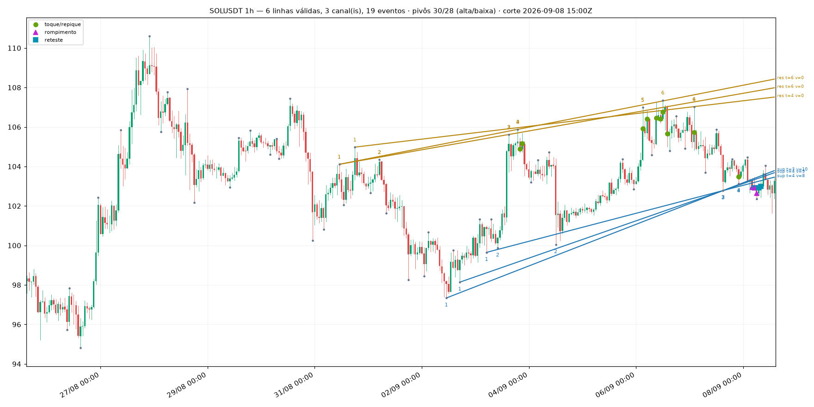
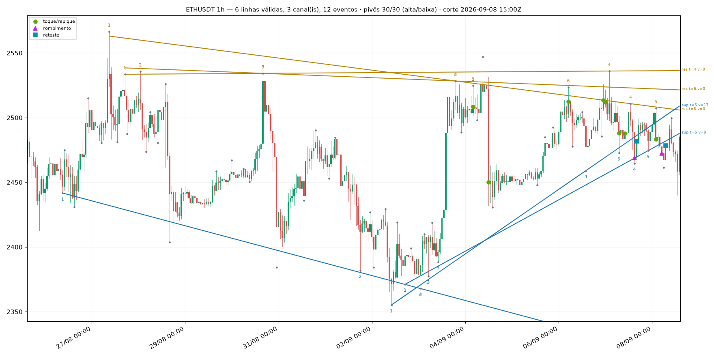
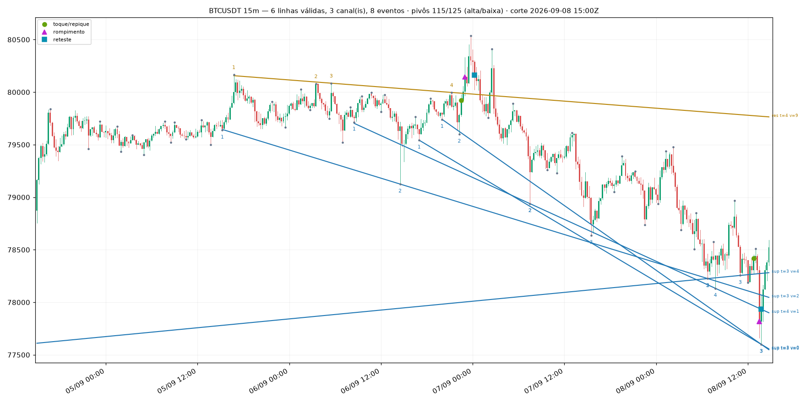
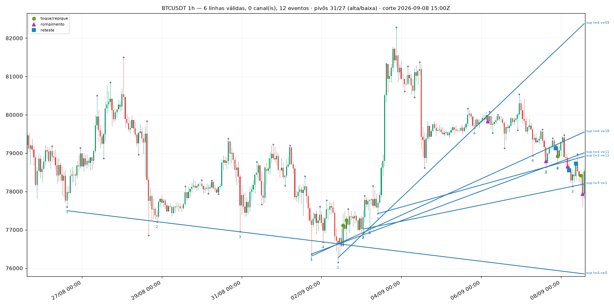

# Linhas de tendência — como o Lab passou a traçá-las (pivôs, linhas, canais, rompimento, reteste)

> **RASCUNHO do quant-engineer (T3.34, 2026-09-08).** Escrito em `.claude/state/exp-drafts/`
> para a Sexta-feira arquivar em `obsidian/11-KNOWLEDGE/` e mover as seis figuras de
> `.claude/state/design/trendlines/*.png` para `obsidian/attachments/`. Os caminhos das imagens
> abaixo são relativos ao repositório; em Obsidian viram `![[ethusdt-1h.png]]`.
> Não editei `obsidian/**`.

## O que isto é

O Everton pediu (2026-09-08) que o Lab aprendesse a traçar "as famosas linhas de tendência". Esta
nota descreve a **primitiva determinística** que foi entregue: pivôs, linhas de suporte e
resistência, canais e os três eventos que o preço pode causar numa linha. Nada aqui decide operação
— a estratégia que usa isto é a T3.34b. Figuras, cunha, triângulo, bandeira e OCO (as "padrões
gráficos" do mesmo material) são a T3.35, e todos são **duas destas linhas com uma relação** entre
elas (convergentes, paralelas, divergentes), então esta é a peça de baixo.

Código: `packages/indicators/hunter_indicators/patterns/` (`pivots.py`, `trendlines.py`,
`channels.py`, `events.py`, `scale.py`, `scan.py`, `definitions.py`). Revisado pela Astra em
2026-09-08 (`.claude/state/astra-review-T3.34-trendlines.md`): três defeitos apontados por ela
foram corrigidos antes de esta nota existir — ver §7, itens A a C.

## 1. Pivô — o ponto por onde a linha passa

Um **pivô de alta** (swing high) é uma barra cuja máxima é a maior das `k` barras de cada lado.
Um **pivô de baixa** é o espelho, com a mínima. Três regras, e cada uma existe porque tirá-la produz
uma linha que ninguém traçaria à mão:

1. **janela de confirmação `k` (padrão 3).** O lado direito é o ponto inteiro: um pivô só é
   *conhecido* `k` barras depois. Cada pivô carrega `confirmed_at = index + k`, e nenhum consumidor
   pode ancorar decisão na barra do próprio pivô. Isto é anti-antecipação, não estética;
2. **filtro de significância em ATR (`min_swing_atr`, padrão 1,0).** A *proeminência* — a
   profundidade do vale medida contra o mais baixo dos dois picos que o ladeiam (definição
   topográfica, sobre as `k` barras de cada lado, **excluída a barra do pivô**, para que a própria
   amplitude dela não sirva de fiador) — precisa alcançar `min_swing_atr` ATRs. Sem isso, todo
   repuxo de uma fita que acabou de acalmar vira "swing";
3. **empate fica com a barra mais velha:** estritamente maior à esquerda, maior-ou-igual à direita.
   Um platô de três máximas iguais rende **um** pivô, não três.

Uma barra cujo ATR ainda não aqueceu (as ~15 primeiras, com período 14) **não é pivô**: sem escala
não há como aplicar a regra 2, e inventar escala seria pior do que recusar.

## 2. Quando uma linha vale

Candidata = a reta por **dois pivôs do mesmo lado** (máximas → resistência, mínimas → suporte).
Ela vira **linha** quando a fita a honrou:

- **toques:** pelo menos `min_touches` (padrão **3** — "dois pontos traçam, o terceiro confirma")
  pivôs do mesmo lado ficam a até `tolerance_atr` (padrão 0,25 ATR) dela;
- **respeitada:** entre o primeiro e o último toque, **nenhum fechamento** passa da linha por mais
  de `tolerance_atr`. Um fechamento através dela é pavio; dois são outra linha;
- **nota:** `toques × extensão − violações`, com extensão em barras entre o primeiro e o último
  toque, e `violações` contando os fechamentos através da linha do primeiro toque até o corte;
- **`valid_from_idx`** = o **mais tardio** entre a confirmação dos dois pivôs que fixam a
  inclinação (`origin` e `through`) e a confirmação do `min_touches`-ésimo toque. É a primeira barra
  em que alguém poderia ter traçado aquela linha, e nenhum evento é reportado antes dela. A
  geometria de uma linha é história; a **existência** dela tem data.

O que a varredura **não** promete: que a mesma linha estivesse *selecionada* naquela barra. Nota,
baldes e o teto de seis linhas são avaliados no corte, então uma varredura na barra 500 é um desenho
retrospectivo das linhas que sobrevivem **hoje**, não uma repetição de quais eram as seis melhores na
barra 300. Quem precisa da sequência viva chama a varredura uma vez por barra — que é o que uma
estratégia faz.

Linhas redundantes são colapsadas: uma por (lado, faixa de inclinação, faixa de nível), medidas em
ATR (`angle_bucket_atr` 0,10 ATR/barra; `level_bucket_atr` 0,50 ATR) — e a de maior nota vence.

## 3. Canal

Um **canal** é um par (resistência, suporte) cujas inclinações concordam até `parallel_tol`
(padrão 0,05 ATR por barra), com preço entre elas. A largura sai em ATRs (`width_atr`) e é o que dá
alvo à estratégia: *"o alvo é a largura do canal"* é uma frase que só significa alguma coisa quando
a largura tem unidade.

## 4. Os três eventos

Avaliados **no fechamento da barra** e nunca antes de `valid_from_idx` — que é o **mais tardio**
entre a confirmação dos dois pivôs que fixam a inclinação e a confirmação do terceiro toque:

- **repique / toque (`bounce`):** o extremo da barra chega a `tolerance_atr` da linha e, em até
  `bounce_bars` (3) barras, um fechamento se afasta `bounce_atr` (0,5 ATR). É a evidência de que a
  linha está sendo respeitada;
- **rompimento (`breakout`):** o primeiro fechamento além da linha por mais de `break_atr`
  (0,5 ATR). Com `rvol_min` informado, um rompimento **sem volume relativo** não é evento nenhum —
  não é reportado em lugar algum, porque "rompeu, quietinho" é exatamente o rompimento que falha;
- **reteste (`retest`):** depois do rompimento, uma barra que volta a `tolerance_atr` da linha e
  fecha de novo no sentido do rompimento, dentro de `retest_bars` (10). A polaridade inverte: quem
  toca a resistência rompida por cima é a **mínima** da barra, não a máxima.

Um pavio que **atravessa** a linha por mais que a tolerância e fecha de volta **não** é repique aqui
(é um rompimento falso, e nomeá-lo de repique deixaria uma estratégia comprar um nível que acabou de
ser furado). É omissão deliberada — ver limites, item 5.

## 5. Parâmetros e padrões

| parâmetro | padrão | o que é |
|---|---|---|
| `pivot_k` | 3 | barras de cada lado para confirmar um pivô |
| `min_swing_atr` | 1,0 | proeminência mínima do pivô, em ATR |
| `atr_period` | 14 | ATR de Wilder (`wilder_v1`, o mesmo do resto do sistema) |
| `min_touches` | 3 | pivôs necessários para a linha valer |
| `tolerance_atr` | 0,25 | distância que ainda conta como "na linha" |
| `break_atr` | 0,5 | fechamento além da linha que conta como rompimento |
| `bounce_atr` | 0,5 | afastamento que confirma o repique |
| `retest_bars` | 10 | janela do reteste depois do rompimento |
| `bounce_bars` | 3 | janela da confirmação do repique |
| `parallel_tol` | 0,05 | diferença de inclinação (ATR/barra) que ainda é "paralela" |
| `angle_bucket_atr` / `level_bucket_atr` | 0,10 / 0,50 | faixas de deduplicação |
| `max_anchors` | 20 | pivôs mais recentes usados como âncora (custo) |
| `max_lines` / `max_channels` | 6 / 3 | teto de saída |
| `rvol_min` | — | volume relativo mínimo do rompimento (opcional) |

**Todos são suposições declaradas, nenhum é medido.** Vêm do brief da T3.34 e da prática clássica.
A calibração honesta exige rodar a T3.34b e olhar a distribuição, não olhar mais figuras.

## 6. As figuras (dado real da VPS, 14 dias, corte 2026-09-08 15:00Z)

Velas de 1 min finais dobradas em SQL em baldes completos de 15 m e 1 h (balde com um minuto
faltando não é exportado). Pontos cinza = pivôs; azul = suporte; dourado = resistência; números =
ordem dos toques; ▲ rompimento, ■ reteste, ● repique. O rótulo `t=` são os toques e `v=` as
violações.

| figura | barras | pivôs | linhas | canais | eventos |
|---|---|---|---|---|---|
| `btcusdt-15m.png` | 1344 | 240 | 6 | 3 | 8 |
| `btcusdt-1h.png` | 336 | 58 | 6 | 0 | 12 |
| `ethusdt-15m.png` | 1344 | 249 | 6 | 3 | 9 |
| `ethusdt-1h.png` | 336 | 60 | 6 | 3 | 12 |
| `solusdt-15m.png` | 1344 | 254 | 6 | 3 | 4 |
| `solusdt-1h.png` | 336 | 58 | 6 | 3 | 19 |

**O que saiu certo, e vale dizer alto:** em `solusdt-1h` o canal de alta de 02/09 a 08/09 —
resistência com 6 toques e 0 violações, suporte com 4 —, o rompimento para baixo em 08/09 e o
reteste logo depois são exatamente o que um humano teria desenhado. Em `btcusdt-15m` a resistência
descendente de 4 toques com o rompimento e o reteste de 07/09 também. Em `solusdt-15m` a
resistência descendente de 4 toques atravessa a figura inteira (977 barras de extensão) sem uma
violação. Em `ethusdt-1h`, a resistência descendente de 5 toques e o suporte ascendente convergindo
na borda direita, com rompimento e reteste em 08/09, é uma cunha de manual.

## 7. Limites — o que um humano teria feito diferente

Olhei as seis. Seis diferenças, em ordem de importância:

1. **não aposentamos linha rompida.** A nota penaliza cada violação em 1 ponto, mas `toques × extensão`
   domina: em `ethusdt-15m` há uma resistência com `t=4 v=52` — o preço deixou aquela linha há 52
   barras e ela continua desenhada; em `btcusdt-1h`, um suporte com `v=59`. Um humano apaga a linha
   no rompimento (ou, no máximo, a mantém até o fim da janela de reteste). **É a correção número um**,
   e é de versão nova, não de ajuste: `retire_after_break` mudaria a saída de todas as figuras;
2. **leque a partir de um mesmo fundo.** Em `btcusdt-1h` seis suportes saem do mesmo aglomerado de
   mínimas de 02/09 abrindo em leque. Para nós são seis linhas com inclinações diferentes; para um
   humano é **uma** linha. A deduplicação usa inclinação e nível *no corte*, e no corte elas já
   divergiram o bastante para sobreviver — falta uma regra de "mesma âncora inicial";
3. **linhas quase idênticas empilhadas.** Em `ethusdt-1h` sobram três resistências (`t=4`, `t=5`,
   `t=6`), duas delas a menos de 10 pontos uma da outra na borda direita. O balde de nível de
   0,50 ATR é fino demais para 1 h;
4. **pivôs demais no 15 m.** 240–254 pivôs em 1344 barras é um pivô a cada ~5 barras; um humano
   marca 20 ou 30 no mesmo gráfico. `pivot_k = 3` com `min_swing_atr = 1,0` é permissivo em 15 m —
   o número de pivôs não atrapalha a linha (ela exige colinearidade), mas polui a figura e infla o
   custo;
5. **não existe linha horizontal como conceito.** Suporte/resistência clássicos incluem **níveis**
   (topos e fundos no mesmo preço). Aqui um nível é só uma reta de inclinação ~0 e precisa de três
   pivôs dentro de 0,25 ATR — no BTC de 1 h (ATR ~400 USDT) isso é uma janela de 100 USDT e os
   topos de 80.100/80.500/81.350 não cabem. Resultado: **nenhuma resistência** em `btcusdt-1h`, e é
   justamente onde um humano traçaria a horizontal de 80.100;
6. **a linha é estendida até o corte, sempre.** Um humano encurta a linha quando ela deixa de ser
   relevante; nós projetamos do primeiro toque até a última barra, o que faz suportes íngremes
   atravessarem o gráfico inteiro (as azuis de `solusdt-15m` e `btcusdt-15m`).

Nenhum destes seis é bug: são a regra da T3.34 funcionando como escrita. Todos são candidatos a
`patterns` v2, e cada um muda números já desenhados — portanto **versão nova**, nunca edição.

**Três que eram bug, apontados pela Astra e corrigidos** (as figuras acima já são as corrigidas):

- **A. a linha desenhada não era a linha validada.** A geometria vinha do par de pivôs, mas a
  projeção reancorava no primeiro *toque*, que só precisa estar a 0,25 ATR dela. No dado real a
  deriva chegou a **0,485 ATR** e uma das linhas publicadas violava a própria regra de respeito.
  Agora `origin`/`through` guardam o par e `projected()` usa o par;
- **B. `valid_from_idx` podia anteceder a própria geometria.** Uma linha cuja inclinação vinha de
  pivôs das barras 310 e 323 dizia valer desde a barra 232, e os eventos procurados a partir dali
  eram medidos contra uma inclinação do futuro. Agora a validade é o **mais tardio** entre as três
  confirmações;
- **C. um repique pendente engolia o rompimento que veio antes dele.** Toque em `t`, rompimento em
  `t+1`, recuperação em `t+2` produzia um repique em `t+2` e o cursor pulava o rompimento — que
  sumia do histórico (o corte vivo em `t+1` o tinha reportado). Agora o rompimento cancela o
  repique pendente.

## 8. Custo

Uma varredura completa custa **194 ms** em 1344 barras de 15 m e **84 ms** em 336 barras de 1 h
(ETHUSDT, medido em 2026-09-08 na máquina de dev). O teto vem do `max_anchors = 20`: sem ele o
número de pares candidatos cresce com o quadrado dos pivôs.

## 9. O que isto **não** prova

Que linha de tendência tem valor preditivo. Isto é geometria determinística e reproduzível; se
comprar rompimento de resistência descendente com volume paga o custo é o que a T3.34b existe para
descobrir, com replay e coorte, como as outras estratégias.
