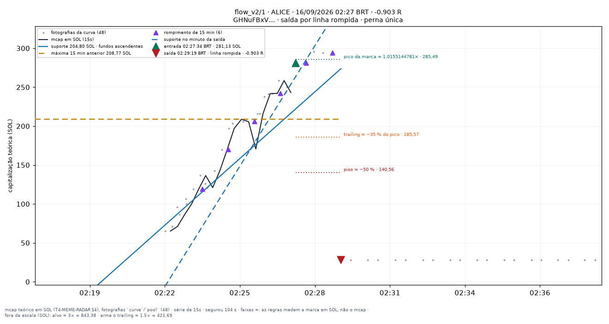
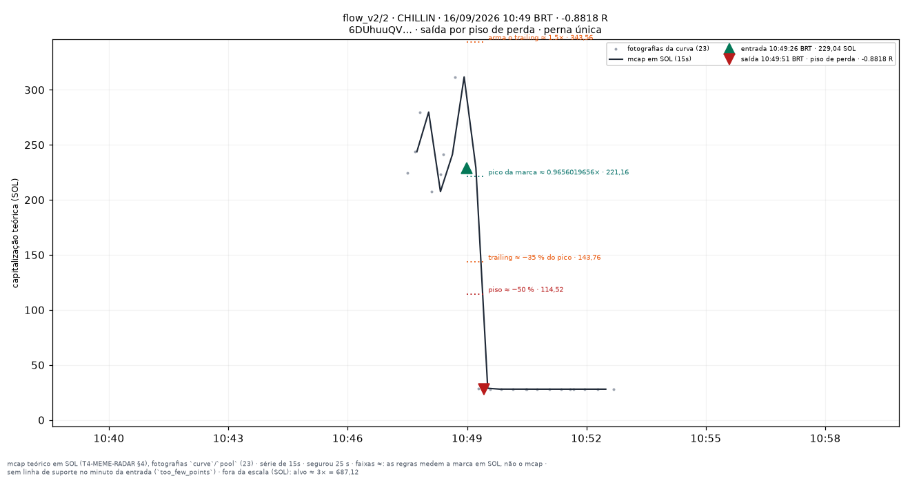
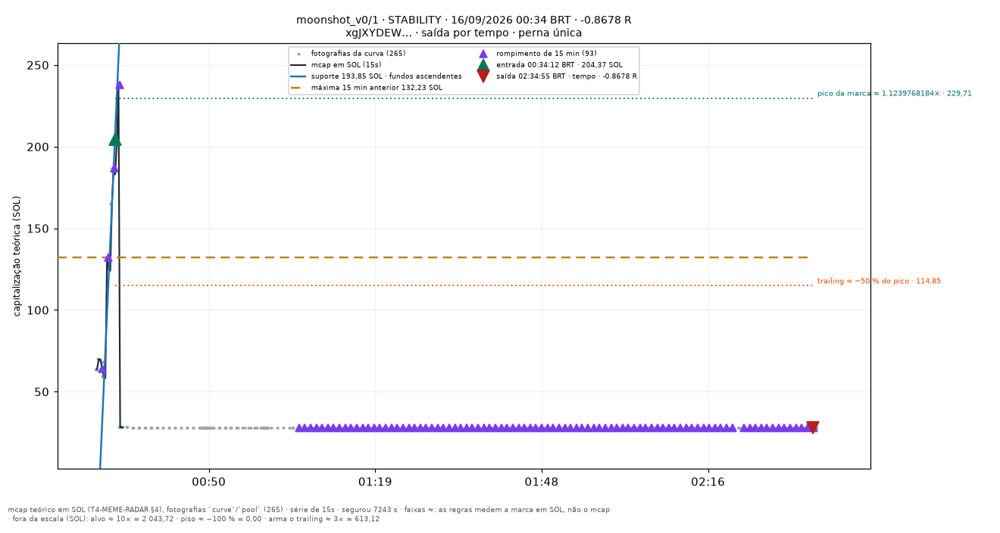

# Traçamentos de 16/09/2026 — leitura parcial (16h)

Os gráficos do dia (`meme_render_bets.py render`) estão em `attachments/meme/2026-09-16/<conjunto>/` e listados, por conjunto, nas páginas do índice [[03-TRADING/Meme/Apostas-tracadas/README|Operações traçadas (meme)]]. O diário do dia ([[09-OPERATIONS/Diario-Meme/README|Diário Meme]]) só nasce no fechamento das 00:10 BRT (`docs/DEPLOYMENT.md` §3.6b); esta página é a leitura **parcial**, das apostas fechadas até a exportação. Todo número abaixo sai do JSONL pelo script do cabeçalho — nada foi digitado à mão.

## Leitura dos traçamentos — 16/09 16h (parcial)

110 aposta(s) fechada(s) no JSONL (110 medida(s), 0 indeterminada(s)); última saída às 15:35 BRT; 30 moedas distintas (a mesma entrada cai em vários conjuntos). Soma de R: **+2.85**; mediana **-0.100**; média +0.026; 37 positivas.

Sem a moeda da maior aposta (KITE, todas as suas pernas): soma **-12.13** em 104 apostas.

| conjunto | n | soma R | mediana R | média R | positivas | pior | melhor |
|---|---|---|---|---|---|---|---|
| `flow_v2/2` | 30 | -1.22 | -0.089 | -0.041 | 11 | -0.90 | +2.90 |
| `flow_v2/5` | 26 | -0.89 | -0.089 | -0.034 | 10 | -0.90 | +2.90 |
| `flow_v2/3` | 17 | -0.77 | -0.143 | -0.046 | 6 | -0.88 | +2.90 |
| `organic_v0/1` | 1 | -0.34 | -0.342 | -0.342 | 0 | -0.34 | -0.34 |
| `flow_v2/1` | 8 | -0.09 | -0.056 | -0.011 | 4 | -0.90 | +1.30 |
| `hype_probe_v0/2` | 8 | -0.05 | -0.041 | -0.006 | 2 | -0.87 | +1.22 |
| `moonshot_v0/2` | 10 | +0.83 | -0.684 | +0.083 | 2 | -0.87 | +4.41 |
| `moonshot_v0/1` | 10 | +5.38 | -0.684 | +0.538 | 2 | -0.87 | +8.96 |

| motivo de saída | n | soma R | média R | mediana R |
|---|---|---|---|---|
| `line_broken` | 49 | +1.28 | +0.026 | +0.088 |
| `max_loss` | 22 | -16.40 | -0.745 | -0.770 |
| `time_stop` | 17 | -8.55 | -0.503 | -0.717 |
| `creator_dump` | 9 | -3.62 | -0.403 | -0.348 |
| `migrated` | 5 | +5.60 | +1.120 | +1.304 |
| `target` | 4 | +17.65 | +4.412 | +2.896 |
| `trailing` | 4 | +6.90 | +1.726 | +1.268 |

`line_broken`: **49** de 110 (45 %), R médio **+0.026** (mediana +0.088, 25 positivas) contra **+0.026** das outras 61 (mediana -0.651, 12 positivas).
Das `line_broken`, 3 chegaram a ≥ 1,5× (arme do trailing) antes de sair; high-water mediano 1.06×.

Faixas de R das `line_broken`: ≤ -0.50: 6; -0.50 … -0.10: 10; -0.10 … +0.10: 14; +0.10 … +0.50: 13; ≥ +0.50: 6.

**3 melhores** (uma moeda por linha; os outros conjuntos que a levaram entre parênteses)

- `moonshot_v0/1` · KITE · 05:09 BRT · **+8.96 R** · saída `target` (também `flow_v2/1` +0.38, `flow_v2/2` +0.38, `flow_v2/5` +0.38, `hype_probe_v0/2` +0.47, `moonshot_v0/2` +4.41)

- `flow_v2/5` · LAUNCH · 00:18 BRT · **+2.90 R** · saída `target` (também `flow_v2/2` +2.90, `flow_v2/2` -0.08, `flow_v2/3` +2.90, `flow_v2/3` -0.08, `flow_v2/5` -0.08)

- `flow_v2/5` · GREMLIN · 12:52 BRT · **+1.30 R** · saída `migrated` (também `flow_v2/1` +1.30, `flow_v2/2` +1.30)

**3 piores**

- `flow_v2/1` · ALICE · 02:27 BRT · **-0.90 R** · saída `line_broken` (também `flow_v2/2` -0.90, `flow_v2/5` -0.90, `moonshot_v0/1` -0.87, `moonshot_v0/2` -0.87)

- `flow_v2/2` · CHILLIN · 10:49 BRT · **-0.88 R** · saída `max_loss` (também `flow_v2/3` -0.88, `flow_v2/5` -0.88)

- `moonshot_v0/1` · STABILITY · 00:34 BRT · **-0.87 R** · saída `time_stop` (também `flow_v2/1` +0.23, `flow_v2/2` +0.23, `flow_v2/5` +0.23, `hype_probe_v0/2` -0.04, `hype_probe_v0/2` -0.87, `moonshot_v0/2` -0.87)

### Três lições (o que a linha acertou e errou hoje)

1. **A linha rompida é o freio, não o motor.** Ela fechou 49 das 110 apostas com R médio de +0.03 e mediana +0.09 — quase todas perto de zero (27 das 49 entre −0.10 e +0.50) — enquanto as outras 61 têm mediana −0.65, carregadas pelo `max_loss` (22, média −0.75) e pelo `time_stop` (17, média −0.50). Onde havia linha para romper, ela tirou a aposta antes do piso; onde não havia (CHILLIN entrou com `too_few_points`, sem suporte no minuto da entrada) o piso de −50 % foi a única defesa e chegou tarde: −0.88 R em 25 s.

2. **A linha não protege de buraco.** ALICE (−0.90 R, `line_broken`) entrou a 281 SOL, no pico (1.016×), com o suporte quase vertical (fundos ascendentes de uma reta de 2 minutos); a próxima fotografia já estava em 30 SOL. A saída foi rotulada "linha rompida", mas era rug — 6 das 49 `line_broken` ficaram ≤ −0.50 R, e todas elas têm esse desenho: linha íngreme demais para ser suporte, entrada na exaustão. Uma inclinação máxima da reta (ou exigir que o suporte tenha mais de 2 minutos de idade) é a hipótese a testar.

3. **A linha rompida cortou o único grande ganho do dia.** KITE saiu por `line_broken` a +0.38 R nos três `flow_v2` e no `hype_probe_v0/2`, e por alvo a +8.96 R no `moonshot_v0/1` (+4.41 no `moonshot_v0/2`, trailing). Sem KITE o dia soma **−12.13 R** em 104 apostas — o resultado positivo (+2.85) é uma moeda. O que a linha fez de bom em LAUNCH (rompimento da máxima de 15 min com suporte subindo, alvo 3× em 6 min) e em GREMLIN (segurou até a migração, +1.30) ela desfez em KITE ao ler o primeiro recuo de 270→250 como quebra. Contraste honesto: linha como saída = perdas pequenas e ganhos pequenos; sem linha = cauda dos dois lados. Não dá para escolher pelo dia de hoje — 30 moedas, uma delas manda no total.
