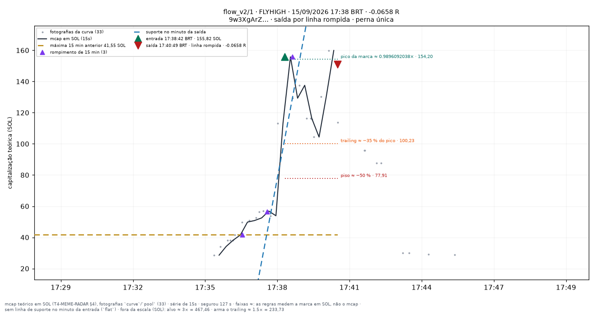
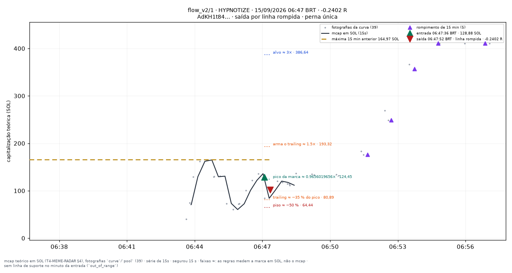
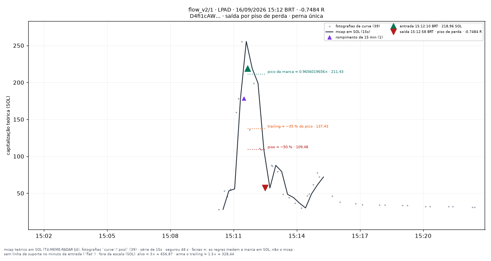

# flow_v2/1 — apostas traçadas

Uma imagem por aposta **fechada** do conjunto `flow_v2/1` (research_only), desenhada por `infra/scripts/meme_render_bets.py` a partir de `meme_paper_bets`, `meme_features_15s`, `meme_features_1m` e `meme_curve_snapshots` — nenhum número desta página foi digitado à mão.

**Pré-registro congelado:** [[EXP-M5-fluxo-e-holders]]. As linhas desenhadas são as **features** do fold (`support_line_sol`, `high_15m_sol`, `breakout_15m`, `higher_lows`, T4.10), lidas no minuto fechado da entrada — a mesma geometria da tela `/meme/{mint}` (`apps/web/components/meme/meme-lines.ts`). Para um conjunto que não lê linha para decidir elas são **contexto**, nunca entrada da decisão.

**Faixas com `≈`:** alvo, piso, arme e trailing medem a **marca em SOL** (o que uma venda cheia renderia, taxas incluídas — `docs/RISK_ENGINE_MEME.md` §6), não a capitalização; no gráfico os múltiplos aparecem aplicados ao mcap da entrada. O R do título é o da linha da aposta.

| régua congelada | valor |
|---|---|
| tamanho (SOL) | `0.05` |
| alvo (×) | `3` |
| trailing (%) | `35` |
| arma o trailing (×) | `1.5` |
| tempo máximo (s) | `1800` |
| piso de perda (%) | `50` |
| sai na linha rompida | sim |
| sai na migração | — |
| relógio | `15s` |

Reproduzir: `docs/PIPELINE.md` §9c. Diário do dia: [[09-OPERATIONS/Diario-Meme/README|Diário Meme]]. Índice: [[03-TRADING/Meme/Apostas-tracadas/README|Operações traçadas (meme)]].
## Dia 2026-09-14

1 aposta(s) fechada(s) — 1 medida(s), 0 indeterminada(s). Soma de R das medidas: **-0.4456**.

**Melhor · Pior · Mais recente** — LBN · 22:21:56 BRT · -0.4456 R · saída por `line_broken`.

| hora (BRT) | símbolo | mint | R | saída | gráfico |
|---|---|---|---|---|---|
| 22:21:56 | LBN | `Hp9aqfw8xj…` | -0.4456 | line_broken | [2221-LBN--0.45.png](../../../attachments/meme/2026-09-14/flow_v2-1/2221-LBN--0.45.png) |

## Dia 2026-09-15

2 aposta(s) fechada(s) — 2 medida(s), 0 indeterminada(s). Soma de R das medidas: **-0.3060**.

**Melhor · Mais recente** — FLYHIGH · 17:38:42 BRT · -0.0658 R · saída por `line_broken`.

**Pior** — HYPNOTIZE · 06:47:36 BRT · -0.2402 R · saída por `line_broken`.

| hora (BRT) | símbolo | mint | R | saída | gráfico |
|---|---|---|---|---|---|
| 06:47:36 | HYPNOTIZE | `AdKH1t84SA…` | -0.2402 | line_broken | [0647-HYPNOTIZE--0.24.png](../../../attachments/meme/2026-09-15/flow_v2-1/0647-HYPNOTIZE--0.24.png) |
| 17:38:42 | FLYHIGH | `9w3XgArZLR…` | -0.0658 | line_broken | [1738-FLYHIGH--0.07.png](../../../attachments/meme/2026-09-15/flow_v2-1/1738-FLYHIGH--0.07.png) |

## Dia 2026-09-16

8 aposta(s) fechada(s) — 8 medida(s), 0 indeterminada(s). Soma de R das medidas: **-0.0914**.

**Melhor** — GREMLIN · 12:52:49 BRT · +1.3044 R · saída por `migrated`.

**Pior** — ALICE · 02:27:34 BRT · -0.903 R · saída por `line_broken`.

**Mais recente** — LPAD · 15:12:10 BRT · -0.7484 R · saída por `max_loss`.

| hora (BRT) | símbolo | mint | R | saída | gráfico |
|---|---|---|---|---|---|
| 00:33:42 | STABILITY | `xgJXYDEWaM…` | +0.2296 | line_broken | [0033-STABILITY-+0.23.png](../../../attachments/meme/2026-09-16/flow_v2-1/0033-STABILITY-%2B0.23.png) |
| 02:27:34 | ALICE | `GHNuFBxVwH…` | -0.903 | line_broken | [0227-ALICE--0.90.png](../../../attachments/meme/2026-09-16/flow_v2-1/0227-ALICE--0.90.png) |
| 02:52:11 | KANYE | `34kSYEW5sn…` | -0.3415 | creator_dump | [0252-KANYE--0.34.png](../../../attachments/meme/2026-09-16/flow_v2-1/0252-KANYE--0.34.png) |
| 05:07:36 | KITE | `56KcQzfmDW…` | +0.3842 | line_broken | [0507-KITE-+0.38.png](../../../attachments/meme/2026-09-16/flow_v2-1/0507-KITE-%2B0.38.png) |
| 07:58:52 | KLING | `YNsgprpQRL…` | +0.6814 | line_broken | [0758-KLING-+0.68.png](../../../attachments/meme/2026-09-16/flow_v2-1/0758-KLING-%2B0.68.png) |
| 12:52:49 | GREMLIN | `Gn9U13zkBd…` | +1.3044 | migrated | [1252-GREMLIN-+1.30.png](../../../attachments/meme/2026-09-16/flow_v2-1/1252-GREMLIN-%2B1.30.png) |
| 14:04:54 | SORT | `7uwn4TV124…` | -0.698 | max_loss | [1404-SORT--0.70.png](../../../attachments/meme/2026-09-16/flow_v2-1/1404-SORT--0.70.png) |
| 15:12:10 | LPAD | `D4fi1cAWTZ…` | -0.7484 | max_loss | [1512-LPAD--0.75.png](../../../attachments/meme/2026-09-16/flow_v2-1/1512-LPAD--0.75.png) |
