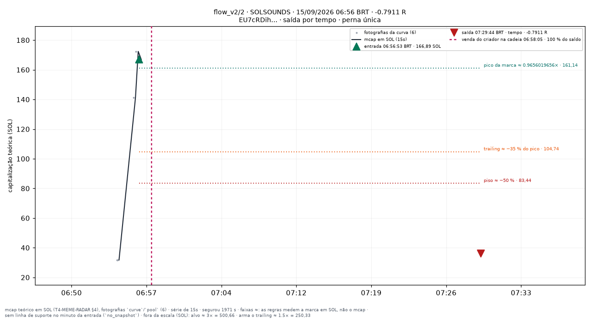
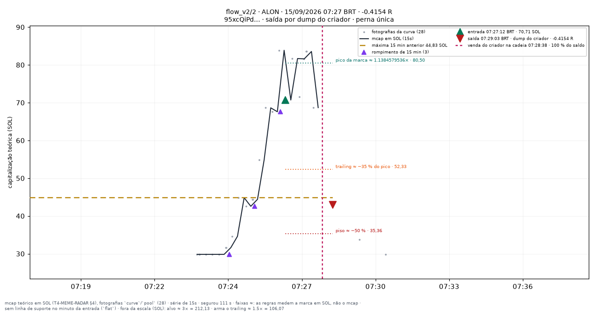

# flow_v2/2 — apostas traçadas

Uma imagem por aposta **fechada** do conjunto `flow_v2/2` (research_only), desenhada por `infra/scripts/meme_render_bets.py` a partir de `meme_paper_bets`, `meme_features_15s`, `meme_features_1m` e `meme_curve_snapshots` — nenhum número desta página foi digitado à mão.

**Pré-registro congelado:** [[EXP-M5-fluxo-e-holders]]. As linhas desenhadas são as **features** do fold (`support_line_sol`, `high_15m_sol`, `breakout_15m`, `higher_lows`, T4.10), lidas no minuto fechado da entrada — a mesma geometria da tela `/meme/{mint}` (`apps/web/components/meme/meme-lines.ts`). Para um conjunto que não lê linha para decidir elas são **contexto**, nunca entrada da decisão.

**Faixas com `≈`:** alvo, piso, arme e trailing medem a **marca em SOL** (o que uma venda cheia renderia, taxas incluídas — `docs/RISK_ENGINE_MEME.md` §6), não a capitalização; no gráfico os múltiplos aparecem aplicados ao mcap da entrada. O R do título é o da linha da aposta.

| régua congelada | valor |
|---|---|
| tamanho (SOL) | `0.05` |
| alvo (×) | `3` |
| trailing (%) | `35` |
| arma o trailing (×) | `1.5` |
| tempo máximo (s) | `1800` |
| piso de perda (%) | `50` |
| sai na linha rompida | sim |
| sai na migração | — |
| relógio | `15s` |

Reproduzir: `docs/PIPELINE.md` §9c. Diário do dia: [[09-OPERATIONS/Diario-Meme/README|Diário Meme]]. Índice: [[03-TRADING/Meme/Apostas-tracadas/README|Operações traçadas (meme)]].
## Dia 2026-09-14

21 aposta(s) fechada(s) — 21 medida(s), 0 indeterminada(s). Soma de R das medidas: **-3.8006**.

**Melhor** — POGOCOIN · 05:57:38 BRT · +0.4031 R · saída por `line_broken`.

**Pior** — RABBITSON · 02:18:22 BRT · -0.7881 R · saída por `creator_dump`.

**Mais recente** — QUANTHROP · 13:12:31 BRT · -0.1674 R · saída por `line_broken`.

| hora (BRT) | símbolo | mint | R | saída | gráfico |
|---|---|---|---|---|---|
| 02:02:35 | SHROOMS | `5zEJv98Gen…` | -0.0403 | line_broken | [0202-SHROOMS--0.04.png](../../../attachments/meme/2026-09-14/flow_v2-2/0202-SHROOMS--0.04.png) |
| 02:18:22 | RABBITSON | `GJ1UcM2YSr…` | -0.7881 | creator_dump | [0218-RABBITSON--0.79.png](../../../attachments/meme/2026-09-14/flow_v2-2/0218-RABBITSON--0.79.png) |
| 02:38:35 | WOODS | `3mg9SaHmnU…` | -0.441 | creator_dump | [0238-WOODS--0.44.png](../../../attachments/meme/2026-09-14/flow_v2-2/0238-WOODS--0.44.png) |
| 03:25:49 | ETCAMAH | `5TncKg7ddH…` | -0.0134 | creator_dump | [0325-ETCAMAH--0.01.png](../../../attachments/meme/2026-09-14/flow_v2-2/0325-ETCAMAH--0.01.png) |
| 05:29:01 | TOPBLAST | `EhpeXu97rY…` | +0.0186 | line_broken | [0529-TOPBLAST-+0.02.png](../../../attachments/meme/2026-09-14/flow_v2-2/0529-TOPBLAST-%2B0.02.png) |
| 05:56:50 | THALEAAI | `7VxFoVMgsM…` | -0.306 | time_stop | [0556-THALEAAI--0.31.png](../../../attachments/meme/2026-09-14/flow_v2-2/0556-THALEAAI--0.31.png) |
| 05:57:38 | POGOCOIN | `GHhmR5PGcC…` | +0.4031 | line_broken | [0557-POGOCOIN-+0.40.png](../../../attachments/meme/2026-09-14/flow_v2-2/0557-POGOCOIN-%2B0.40.png) |
| 06:23:47 | BALLS | `EytoSxwBFD…` | -0.1043 | creator_dump | [0623-BALLS--0.10.png](../../../attachments/meme/2026-09-14/flow_v2-2/0623-BALLS--0.10.png) |
| 06:44:15 | BABITA | `8W83qMuygm…` | +0.3775 | line_broken | [0644-BABITA-+0.38.png](../../../attachments/meme/2026-09-14/flow_v2-2/0644-BABITA-%2B0.38.png) |
| 08:02:50 | JABALI | `HPrPCcVyhj…` | -0.2464 | creator_dump | [0802-JABALI--0.25.png](../../../attachments/meme/2026-09-14/flow_v2-2/0802-JABALI--0.25.png) |
| 09:32:27 | HEDGEHOG | `EbmHC1LCcE…` | -0.0597 | line_broken | [0932-HEDGEHOG--0.06.png](../../../attachments/meme/2026-09-14/flow_v2-2/0932-HEDGEHOG--0.06.png) |
| 09:34:39 | FIHDIH | `G37hddA7Dv…` | -0.0181 | line_broken | [0934-FIHDIH--0.02.png](../../../attachments/meme/2026-09-14/flow_v2-2/0934-FIHDIH--0.02.png) |
| 09:59:54 | SEPE | `DuK4UHAYpQ…` | +0.0584 | creator_dump | [0959-SEPE-+0.06.png](../../../attachments/meme/2026-09-14/flow_v2-2/0959-SEPE-%2B0.06.png) |
| 10:05:10 | MALKIN | `FNvkVXVvpE…` | -0.0477 | line_broken | [1005-MALKIN--0.05.png](../../../attachments/meme/2026-09-14/flow_v2-2/1005-MALKIN--0.05.png) |
| 10:09:36 | ROO | `7PjBxJhPSD…` | -0.1306 | creator_dump | [1009-ROO--0.13.png](../../../attachments/meme/2026-09-14/flow_v2-2/1009-ROO--0.13.png) |
| 10:18:21 | PUMPDOG | `5kJ9jKaPNm…` | -0.581 | max_loss | [1018-PUMPDOG--0.58.png](../../../attachments/meme/2026-09-14/flow_v2-2/1018-PUMPDOG--0.58.png) |
| 10:29:29 | ALTO | `PH84sm35uJ…` | -0.7426 | max_loss | [1029-ALTO--0.74.png](../../../attachments/meme/2026-09-14/flow_v2-2/1029-ALTO--0.74.png) |
| 10:55:27 | 胆子肥 | `A7TN4eqhJ6…` | -0.6793 | creator_dump | [1055-胆子肥--0.68.png](../../../attachments/meme/2026-09-14/flow_v2-2/1055-%E8%83%86%E5%AD%90%E8%82%A5--0.68.png) |
| 10:55:43 | BIKINIHOUSE | `HewpaqSnF5…` | +0.2844 | creator_dump | [1055-BIKINIHOUSE-+0.28.png](../../../attachments/meme/2026-09-14/flow_v2-2/1055-BIKINIHOUSE-%2B0.28.png) |
| 11:38:41 | ORB | `9qdvsftkST…` | -0.5769 | creator_dump | [1138-ORB--0.58.png](../../../attachments/meme/2026-09-14/flow_v2-2/1138-ORB--0.58.png) |
| 13:12:31 | QUANTHROP | `G2bJr5gYqn…` | -0.1674 | line_broken | [1312-QUANTHROP--0.17.png](../../../attachments/meme/2026-09-14/flow_v2-2/1312-QUANTHROP--0.17.png) |

## Dia 2026-09-15

23 aposta(s) fechada(s) — 23 medida(s), 0 indeterminada(s). Soma de R das medidas: **-4.8949**.

**Melhor** — ASSCOIN · 02:12:09 BRT · +0.5979 R · saída por `creator_dump`.

**Pior** — SOLSOUNDS · 06:56:53 BRT · -0.7911 R · saída por `time_stop`.

**Mais recente** — ALON · 07:27:12 BRT · -0.4154 R · saída por `creator_dump`.

| hora (BRT) | símbolo | mint | R | saída | gráfico |
|---|---|---|---|---|---|
| 00:03:17 | KIRKYAHU | `BgJGJNyu6m…` | +0.0809 | line_broken | [0003-KIRKYAHU-+0.08.png](../../../attachments/meme/2026-09-15/flow_v2-2/0003-KIRKYAHU-%2B0.08.png) |
| 00:05:23 | KIRKYAHU | `BgJGJNyu6m…` | -0.2278 | line_broken | [0005-KIRKYAHU--0.23.png](../../../attachments/meme/2026-09-15/flow_v2-2/0005-KIRKYAHU--0.23.png) |
| 00:15:42 | HOT | `6NPa4ww1Gq…` | -0.4113 | creator_dump | [0015-HOT--0.41.png](../../../attachments/meme/2026-09-15/flow_v2-2/0015-HOT--0.41.png) |
| 01:20:48 | 21CABBAGE | `Gx5rXExD2p…` | +0.1303 | line_broken | [0120-21CABBAGE-+0.13.png](../../../attachments/meme/2026-09-15/flow_v2-2/0120-21CABBAGE-%2B0.13.png) |
| 01:33:23 | PLASMA | `FFFomNPUNv…` | -0.7068 | max_loss | [0133-PLASMA--0.71.png](../../../attachments/meme/2026-09-15/flow_v2-2/0133-PLASMA--0.71.png) |
| 01:58:31 | ASIANDOG | `BgP6Hwn5XC…` | -0.3526 | creator_dump | [0158-ASIANDOG--0.35.png](../../../attachments/meme/2026-09-15/flow_v2-2/0158-ASIANDOG--0.35.png) |
| 02:12:09 | ASSCOIN | `GNjHEoZK5R…` | +0.5979 | creator_dump | [0212-ASSCOIN-+0.60.png](../../../attachments/meme/2026-09-15/flow_v2-2/0212-ASSCOIN-%2B0.60.png) |
| 02:53:38 | YENNII56 | `CxMf8sTCij…` | -0.0665 | creator_dump | [0253-YENNII56--0.07.png](../../../attachments/meme/2026-09-15/flow_v2-2/0253-YENNII56--0.07.png) |
| 02:54:25 | BLAST | `BwcWz1LdGe…` | -0.5863 | max_loss | [0254-BLAST--0.59.png](../../../attachments/meme/2026-09-15/flow_v2-2/0254-BLAST--0.59.png) |
| 03:10:51 | CUBA | `HEH8n3YfYq…` | -0.299 | creator_dump | [0310-CUBA--0.30.png](../../../attachments/meme/2026-09-15/flow_v2-2/0310-CUBA--0.30.png) |
| 03:12:45 | RUSELL | `5y35sVHmBH…` | -0.1101 | creator_dump | [0312-RUSELL--0.11.png](../../../attachments/meme/2026-09-15/flow_v2-2/0312-RUSELL--0.11.png) |
| 03:15:33 | OG | `JB3Rrt2HT3…` | -0.0434 | line_broken | [0315-OG--0.04.png](../../../attachments/meme/2026-09-15/flow_v2-2/0315-OG--0.04.png) |
| 04:03:30 | ANSIM | `9aZFnxKCAv…` | -0.5117 | max_loss | [0403-ANSIM--0.51.png](../../../attachments/meme/2026-09-15/flow_v2-2/0403-ANSIM--0.51.png) |
| 04:24:10 | LEBROOM | `82KAQ8mvhR…` | -0.0418 | line_broken | [0424-LEBROOM--0.04.png](../../../attachments/meme/2026-09-15/flow_v2-2/0424-LEBROOM--0.04.png) |
| 04:35:29 | TBUZZ | `FmfB54HiRF…` | +0.02 | creator_dump | [0435-TBUZZ-+0.02.png](../../../attachments/meme/2026-09-15/flow_v2-2/0435-TBUZZ-%2B0.02.png) |
| 06:12:13 | SOLFLY | `99B9ZJWagN…` | -0.0984 | line_broken | [0612-SOLFLY--0.10.png](../../../attachments/meme/2026-09-15/flow_v2-2/0612-SOLFLY--0.10.png) |
| 06:46:00 | STOCKPILLS | `73PrUsqpcx…` | -0.3918 | max_loss | [0646-STOCKPILLS--0.39.png](../../../attachments/meme/2026-09-15/flow_v2-2/0646-STOCKPILLS--0.39.png) |
| 06:47:36 | HYPNOTIZE | `AdKH1t84SA…` | -0.2402 | line_broken | [0647-HYPNOTIZE--0.24.png](../../../attachments/meme/2026-09-15/flow_v2-2/0647-HYPNOTIZE--0.24.png) |
| 06:49:42 | HYPNOTIZE | `AdKH1t84SA…` | +0.271 | line_broken | [0649-HYPNOTIZE-+0.27.png](../../../attachments/meme/2026-09-15/flow_v2-2/0649-HYPNOTIZE-%2B0.27.png) |
| 06:56:53 | SOLSOUNDS | `EU7cRDihom…` | -0.7911 | time_stop | [0656-SOLSOUNDS--0.79.png](../../../attachments/meme/2026-09-15/flow_v2-2/0656-SOLSOUNDS--0.79.png) |
| 07:05:49 | TUDUM | `FDchkT7ycr…` | +0.0469 | creator_dump | [0705-TUDUM-+0.05.png](../../../attachments/meme/2026-09-15/flow_v2-2/0705-TUDUM-%2B0.05.png) |
| 07:17:50 | RIZZ | `7LLE17W7XL…` | -0.7476 | time_stop | [0717-RIZZ--0.75.png](../../../attachments/meme/2026-09-15/flow_v2-2/0717-RIZZ--0.75.png) |
| 07:27:12 | ALON | `95xcQiPd8u…` | -0.4154 | creator_dump | [0727-ALON--0.42.png](../../../attachments/meme/2026-09-15/flow_v2-2/0727-ALON--0.42.png) |
