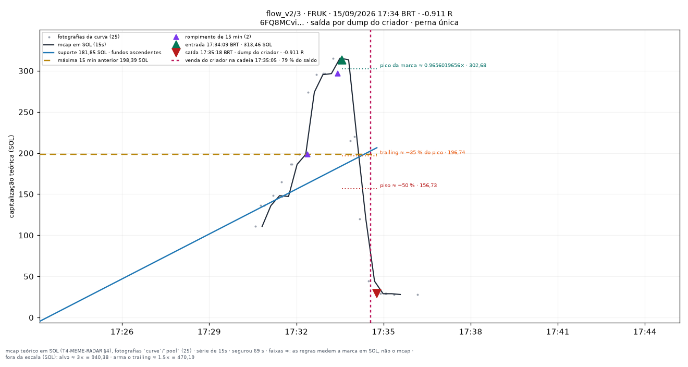
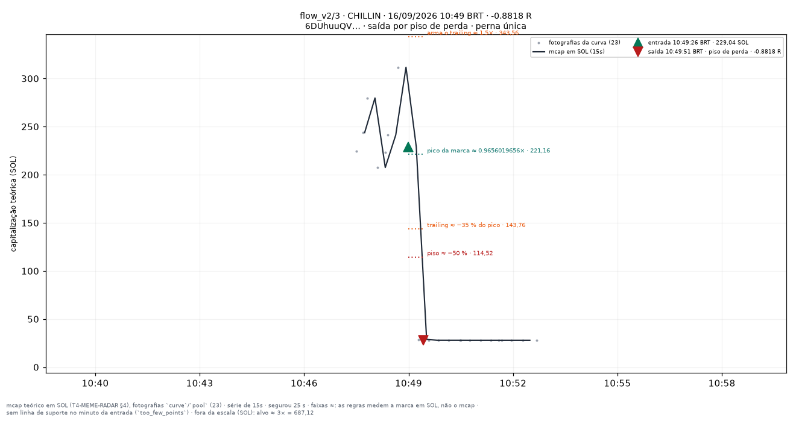
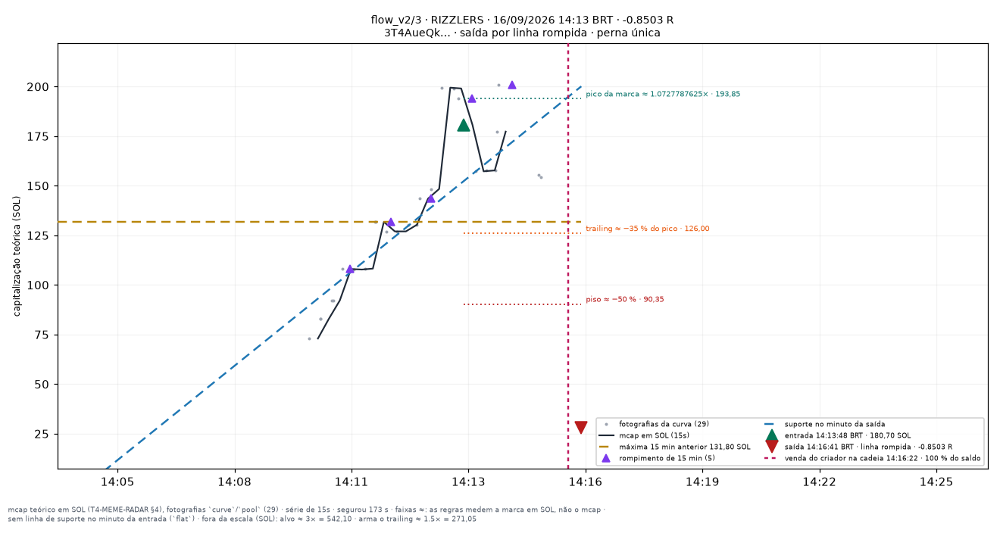

# flow_v2/3 — apostas traçadas

Uma imagem por aposta **fechada** do conjunto `flow_v2/3` (research_only), desenhada por `infra/scripts/meme_render_bets.py` a partir de `meme_paper_bets`, `meme_features_15s`, `meme_features_1m` e `meme_curve_snapshots` — nenhum número desta página foi digitado à mão.

**Pré-registro congelado:** [[EXP-M5-fluxo-e-holders]]. As linhas desenhadas são as **features** do fold (`support_line_sol`, `high_15m_sol`, `breakout_15m`, `higher_lows`, T4.10), lidas no minuto fechado da entrada — a mesma geometria da tela `/meme/{mint}` (`apps/web/components/meme/meme-lines.ts`). Para um conjunto que não lê linha para decidir elas são **contexto**, nunca entrada da decisão.

**Faixas com `≈`:** alvo, piso, arme e trailing medem a **marca em SOL** (o que uma venda cheia renderia, taxas incluídas — `docs/RISK_ENGINE_MEME.md` §6), não a capitalização; no gráfico os múltiplos aparecem aplicados ao mcap da entrada. O R do título é o da linha da aposta.

| régua congelada | valor |
|---|---|
| tamanho (SOL) | `0.05` |
| alvo (×) | `3` |
| trailing (%) | `35` |
| arma o trailing (×) | `1.5` |
| tempo máximo (s) | `1800` |
| piso de perda (%) | `50` |
| sai na linha rompida | sim |
| sai na migração | — |
| relógio | `15s` |

Reproduzir: `docs/PIPELINE.md` §9c. Diário do dia: [[09-OPERATIONS/Diario-Meme/README|Diário Meme]]. Índice: [[03-TRADING/Meme/Apostas-tracadas/README|Operações traçadas (meme)]].
## Dia 2026-09-15

6 aposta(s) fechada(s) — 6 medida(s), 0 indeterminada(s). Soma de R das medidas: **-0.4012**.

**Melhor** — MITCHELLE · 17:55:34 BRT · +0.5495 R · saída por `line_broken`.

**Pior** — FRUK · 17:34:09 BRT · -0.911 R · saída por `creator_dump`.

**Mais recente** — KITH · 19:00:59 BRT · +0.3282 R · saída por `line_broken`.

| hora (BRT) | símbolo | mint | R | saída | gráfico |
|---|---|---|---|---|---|
| 17:28:40 | NOIRA | `CLK5SyTFhn…` | -0.169 | line_broken | [1728-NOIRA--0.17.png](../../../attachments/meme/2026-09-15/flow_v2-3/1728-NOIRA--0.17.png) |
| 17:34:09 | FRUK | `6FQ8MCvigJ…` | -0.911 | creator_dump | [1734-FRUK--0.91.png](../../../attachments/meme/2026-09-15/flow_v2-3/1734-FRUK--0.91.png) |
| 17:55:34 | MITCHELLE | `BdGyZJL81E…` | +0.5495 | line_broken | [1755-MITCHELLE-+0.55.png](../../../attachments/meme/2026-09-15/flow_v2-3/1755-MITCHELLE-%2B0.55.png) |
| 18:11:45 | DPUMP | `5aBAkzHnxo…` | -0.0172 | creator_dump | [1811-DPUMP--0.02.png](../../../attachments/meme/2026-09-15/flow_v2-3/1811-DPUMP--0.02.png) |
| 18:33:00 | NYAN | `CVe9RECt4p…` | -0.1817 | line_broken | [1833-NYAN--0.18.png](../../../attachments/meme/2026-09-15/flow_v2-3/1833-NYAN--0.18.png) |
| 19:00:59 | KITH | `Rvwhhtjw1p…` | +0.3282 | line_broken | [1900-KITH-+0.33.png](../../../attachments/meme/2026-09-15/flow_v2-3/1900-KITH-%2B0.33.png) |

## Dia 2026-09-16

17 aposta(s) fechada(s) — 17 medida(s), 0 indeterminada(s). Soma de R das medidas: **-0.7742**.

**Melhor** — LAUNCH · 00:18:37 BRT · +2.8961 R · saída por `target`.

**Pior** — CHILLIN · 10:49:26 BRT · -0.8818 R · saída por `max_loss`.

**Mais recente** — RIZZLERS · 14:13:48 BRT · -0.8503 R · saída por `line_broken`.

| hora (BRT) | símbolo | mint | R | saída | gráfico |
|---|---|---|---|---|---|
| 00:16:31 | LAUNCH | `JBFeVRrjtu…` | -0.0769 | line_broken | [0016-LAUNCH--0.08.png](../../../attachments/meme/2026-09-16/flow_v2-3/0016-LAUNCH--0.08.png) |
| 00:18:37 | LAUNCH | `JBFeVRrjtu…` | +2.8961 | target | [0018-LAUNCH-+2.90.png](../../../attachments/meme/2026-09-16/flow_v2-3/0018-LAUNCH-%2B2.90.png) |
| 02:54:04 | INDIEREACH | `kDToGHjuti…` | +0.8917 | line_broken | [0254-INDIEREACH-+0.89.png](../../../attachments/meme/2026-09-16/flow_v2-3/0254-INDIEREACH-%2B0.89.png) |
| 02:56:10 | INDIEREACH | `kDToGHjuti…` | -0.8661 | max_loss | [0256-INDIEREACH--0.87.png](../../../attachments/meme/2026-09-16/flow_v2-3/0256-INDIEREACH--0.87.png) |
| 03:48:25 | NAMEROT | `3ySWBtEico…` | -0.2507 | line_broken | [0348-NAMEROT--0.25.png](../../../attachments/meme/2026-09-16/flow_v2-3/0348-NAMEROT--0.25.png) |
| 06:01:17 | JSC | `FS8Vrc5zyT…` | -0.2748 | max_loss | [0601-JSC--0.27.png](../../../attachments/meme/2026-09-16/flow_v2-3/0601-JSC--0.27.png) |
| 06:10:27 | ZKPASS | `FMh5opbs4e…` | -0.8109 | max_loss | [0610-ZKPASS--0.81.png](../../../attachments/meme/2026-09-16/flow_v2-3/0610-ZKPASS--0.81.png) |
| 06:19:06 | BITMAKER | `SogCcFn78Y…` | +0.0951 | line_broken | [0619-BITMAKER-+0.10.png](../../../attachments/meme/2026-09-16/flow_v2-3/0619-BITMAKER-%2B0.10.png) |
| 06:20:09 | BITMAKER | `SogCcFn78Y…` | +0.245 | line_broken | [0620-BITMAKER-+0.24.png](../../../attachments/meme/2026-09-16/flow_v2-3/0620-BITMAKER-%2B0.24.png) |
| 06:53:17 | TASKON | `j3YSKrAJrT…` | -0.7703 | max_loss | [0653-TASKON--0.77.png](../../../attachments/meme/2026-09-16/flow_v2-3/0653-TASKON--0.77.png) |
| 08:49:54 | KORI | `CGYSnnTTqF…` | -0.0687 | line_broken | [0849-KORI--0.07.png](../../../attachments/meme/2026-09-16/flow_v2-3/0849-KORI--0.07.png) |
| 10:07:48 | COINU | `EnPx4oBFL1…` | +0.1466 | line_broken | [1007-COINU-+0.15.png](../../../attachments/meme/2026-09-16/flow_v2-3/1007-COINU-%2B0.15.png) |
| 10:49:26 | CHILLIN | `6DUhuuQVaQ…` | -0.8818 | max_loss | [1049-CHILLIN--0.88.png](../../../attachments/meme/2026-09-16/flow_v2-3/1049-CHILLIN--0.88.png) |
| 12:07:55 | CGRAM | `3tAFaZsjAv…` | -0.1441 | line_broken | [1207-CGRAM--0.14.png](../../../attachments/meme/2026-09-16/flow_v2-3/1207-CGRAM--0.14.png) |
| 13:45:01 | GPT6SOL | `9NPxe7cB8B…` | -0.1426 | line_broken | [1345-GPT6SOL--0.14.png](../../../attachments/meme/2026-09-16/flow_v2-3/1345-GPT6SOL--0.14.png) |
| 14:08:24 | STEVE | `FLHSaTeXxo…` | +0.0885 | line_broken | [1408-STEVE-+0.09.png](../../../attachments/meme/2026-09-16/flow_v2-3/1408-STEVE-%2B0.09.png) |
| 14:13:48 | RIZZLERS | `3T4AueQkix…` | -0.8503 | line_broken | [1413-RIZZLERS--0.85.png](../../../attachments/meme/2026-09-16/flow_v2-3/1413-RIZZLERS--0.85.png) |
