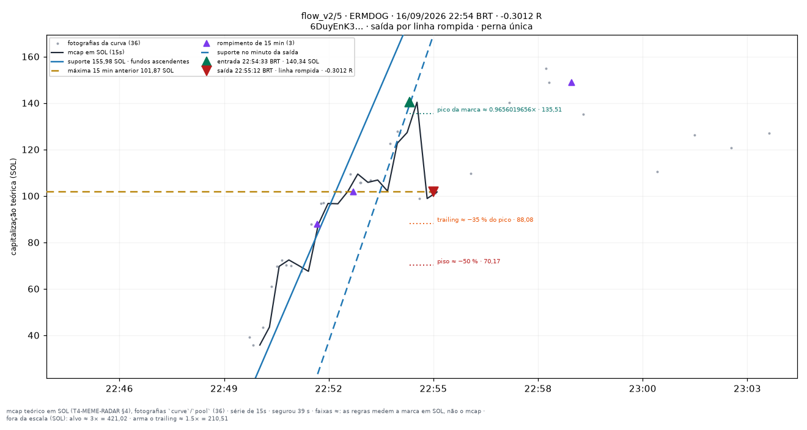
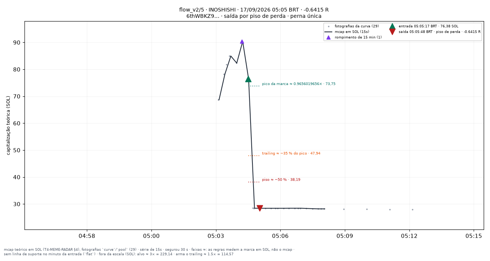
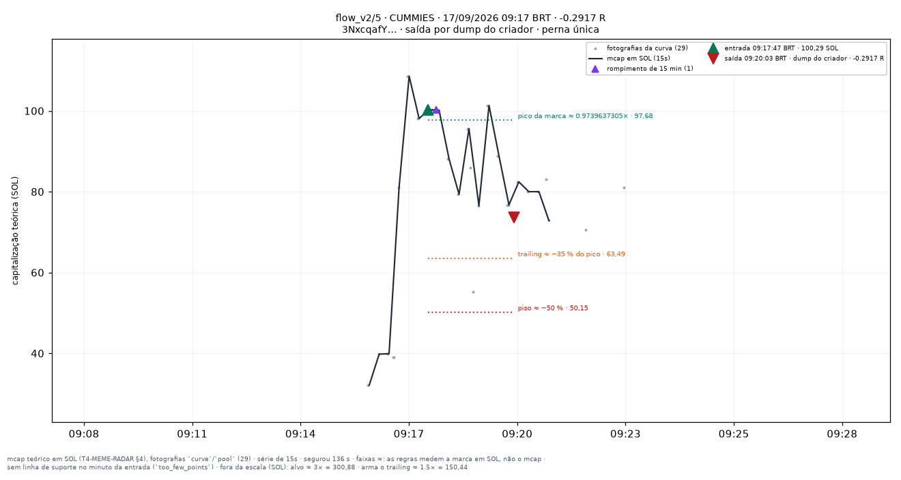

# flow_v2/5 — apostas traçadas

Uma imagem por aposta **fechada** do conjunto `flow_v2/5` (research_only), desenhada por `infra/scripts/meme_render_bets.py` a partir de `meme_paper_bets`, `meme_features_15s`, `meme_features_1m` e `meme_curve_snapshots` — nenhum número desta página foi digitado à mão.

**Pré-registro congelado:** [[EXP-M6-exclusoes-de-pedigree]]. As linhas desenhadas são as **features** do fold (`support_line_sol`, `high_15m_sol`, `breakout_15m`, `higher_lows`, T4.10), lidas no minuto fechado da entrada — a mesma geometria da tela `/meme/{mint}` (`apps/web/components/meme/meme-lines.ts`). Para um conjunto que não lê linha para decidir elas são **contexto**, nunca entrada da decisão.

**Faixas com `≈`:** alvo, piso, arme e trailing medem a **marca em SOL** (o que uma venda cheia renderia, taxas incluídas — `docs/RISK_ENGINE_MEME.md` §6), não a capitalização; no gráfico os múltiplos aparecem aplicados ao mcap da entrada. O R do título é o da linha da aposta.

| régua congelada | valor |
|---|---|
| tamanho (SOL) | `0.05` |
| alvo (×) | `3` |
| trailing (%) | `35` |
| arma o trailing (×) | `1.5` |
| tempo máximo (s) | `1800` |
| piso de perda (%) | `50` |
| sai na linha rompida | sim |
| sai na migração | — |
| relógio | `15s` |

Reproduzir: `docs/PIPELINE.md` §9c. Diário do dia: [[09-OPERATIONS/Diario-Meme/README|Diário Meme]]. Índice: [[03-TRADING/Meme/Apostas-tracadas/README|Operações traçadas (meme)]].
## Dia 2026-09-16

35 aposta(s) fechada(s) — 35 medida(s), 0 indeterminada(s). Soma de R das medidas: **-1.8846**.

**Melhor** — LAUNCH · 00:18:37 BRT · +2.8961 R · saída por `target`.

**Pior** — ALICE · 02:27:34 BRT · -0.903 R · saída por `line_broken`.

**Mais recente** — ERMDOG · 22:54:33 BRT · -0.3012 R · saída por `line_broken`.

| hora (BRT) | símbolo | mint | R | saída | gráfico |
|---|---|---|---|---|---|
| 00:16:31 | LAUNCH | `JBFeVRrjtu…` | -0.0769 | line_broken | [0016-LAUNCH--0.08.png](../../../attachments/meme/2026-09-16/flow_v2-5/0016-LAUNCH--0.08.png) |
| 00:18:37 | LAUNCH | `JBFeVRrjtu…` | +2.8961 | target | [0018-LAUNCH-+2.90.png](../../../attachments/meme/2026-09-16/flow_v2-5/0018-LAUNCH-%2B2.90.png) |
| 00:33:42 | STABILITY | `xgJXYDEWaM…` | +0.2296 | line_broken | [0033-STABILITY-+0.23.png](../../../attachments/meme/2026-09-16/flow_v2-5/0033-STABILITY-%2B0.23.png) |
| 02:27:34 | ALICE | `GHNuFBxVwH…` | -0.903 | line_broken | [0227-ALICE--0.90.png](../../../attachments/meme/2026-09-16/flow_v2-5/0227-ALICE--0.90.png) |
| 02:50:10 | KANYE | `34kSYEW5sn…` | -0.3483 | creator_dump | [0250-KANYE--0.35.png](../../../attachments/meme/2026-09-16/flow_v2-5/0250-KANYE--0.35.png) |
| 02:54:04 | INDIEREACH | `kDToGHjuti…` | +0.8917 | line_broken | [0254-INDIEREACH-+0.89.png](../../../attachments/meme/2026-09-16/flow_v2-5/0254-INDIEREACH-%2B0.89.png) |
| 02:56:10 | INDIEREACH | `kDToGHjuti…` | -0.8661 | max_loss | [0256-INDIEREACH--0.87.png](../../../attachments/meme/2026-09-16/flow_v2-5/0256-INDIEREACH--0.87.png) |
| 03:48:25 | NAMEROT | `3ySWBtEico…` | -0.2507 | line_broken | [0348-NAMEROT--0.25.png](../../../attachments/meme/2026-09-16/flow_v2-5/0348-NAMEROT--0.25.png) |
| 05:07:36 | KITE | `56KcQzfmDW…` | +0.3842 | line_broken | [0507-KITE-+0.38.png](../../../attachments/meme/2026-09-16/flow_v2-5/0507-KITE-%2B0.38.png) |
| 06:10:27 | ZKPASS | `FMh5opbs4e…` | -0.8109 | max_loss | [0610-ZKPASS--0.81.png](../../../attachments/meme/2026-09-16/flow_v2-5/0610-ZKPASS--0.81.png) |
| 06:19:06 | BITMAKER | `SogCcFn78Y…` | +0.0951 | line_broken | [0619-BITMAKER-+0.10.png](../../../attachments/meme/2026-09-16/flow_v2-5/0619-BITMAKER-%2B0.10.png) |
| 06:20:09 | BITMAKER | `SogCcFn78Y…` | +0.245 | line_broken | [0620-BITMAKER-+0.24.png](../../../attachments/meme/2026-09-16/flow_v2-5/0620-BITMAKER-%2B0.24.png) |
| 06:53:17 | TASKON | `j3YSKrAJrT…` | -0.7703 | max_loss | [0653-TASKON--0.77.png](../../../attachments/meme/2026-09-16/flow_v2-5/0653-TASKON--0.77.png) |
| 07:00:06 | POLKADOT | `Un18N8fpCb…` | -0.0416 | line_broken | [0700-POLKADOT--0.04.png](../../../attachments/meme/2026-09-16/flow_v2-5/0700-POLKADOT--0.04.png) |
| 07:42:54 | SWISSC | `XtSLPWvMt4…` | -0.1002 | line_broken | [0742-SWISSC--0.10.png](../../../attachments/meme/2026-09-16/flow_v2-5/0742-SWISSC--0.10.png) |
| 07:58:52 | KLING | `YNsgprpQRL…` | +0.6814 | line_broken | [0758-KLING-+0.68.png](../../../attachments/meme/2026-09-16/flow_v2-5/0758-KLING-%2B0.68.png) |
| 08:49:54 | KORI | `CGYSnnTTqF…` | -0.0687 | line_broken | [0849-KORI--0.07.png](../../../attachments/meme/2026-09-16/flow_v2-5/0849-KORI--0.07.png) |
| 10:49:26 | CHILLIN | `6DUhuuQVaQ…` | -0.8818 | max_loss | [1049-CHILLIN--0.88.png](../../../attachments/meme/2026-09-16/flow_v2-5/1049-CHILLIN--0.88.png) |
| 11:46:40 | INCEPT | `FHcHh1ELbW…` | +0.2959 | line_broken | [1146-INCEPT-+0.30.png](../../../attachments/meme/2026-09-16/flow_v2-5/1146-INCEPT-%2B0.30.png) |
| 12:07:55 | CGRAM | `3tAFaZsjAv…` | -0.1441 | line_broken | [1207-CGRAM--0.14.png](../../../attachments/meme/2026-09-16/flow_v2-5/1207-CGRAM--0.14.png) |
| 12:52:49 | GREMLIN | `Gn9U13zkBd…` | +1.3044 | migrated | [1252-GREMLIN-+1.30.png](../../../attachments/meme/2026-09-16/flow_v2-5/1252-GREMLIN-%2B1.30.png) |
| 14:04:54 | SORT | `7uwn4TV124…` | -0.698 | max_loss | [1404-SORT--0.70.png](../../../attachments/meme/2026-09-16/flow_v2-5/1404-SORT--0.70.png) |
| 14:08:24 | STEVE | `FLHSaTeXxo…` | +0.0885 | line_broken | [1408-STEVE-+0.09.png](../../../attachments/meme/2026-09-16/flow_v2-5/1408-STEVE-%2B0.09.png) |
| 14:13:48 | RIZZLERS | `3T4AueQkix…` | -0.8503 | line_broken | [1413-RIZZLERS--0.85.png](../../../attachments/meme/2026-09-16/flow_v2-5/1413-RIZZLERS--0.85.png) |
| 15:12:10 | LPAD | `D4fi1cAWTZ…` | -0.7484 | max_loss | [1512-LPAD--0.75.png](../../../attachments/meme/2026-09-16/flow_v2-5/1512-LPAD--0.75.png) |
| 15:33:17 | CASINU | `Cfsb4vMug1…` | -0.4408 | creator_dump | [1533-CASINU--0.44.png](../../../attachments/meme/2026-09-16/flow_v2-5/1533-CASINU--0.44.png) |
| 16:08:33 | MOONEY | `E2y5iF7aKn…` | -0.1489 | line_broken | [1608-MOONEY--0.15.png](../../../attachments/meme/2026-09-16/flow_v2-5/1608-MOONEY--0.15.png) |
| 16:34:31 | RASMR | `4W6Mf2DkcK…` | -0.0806 | trailing | [1634-RASMR--0.08.png](../../../attachments/meme/2026-09-16/flow_v2-5/1634-RASMR--0.08.png) |
| 17:00:32 | MAXBIDDING | `6qHrLunMNU…` | -0.0451 | line_broken | [1700-MAXBIDDING--0.05.png](../../../attachments/meme/2026-09-16/flow_v2-5/1700-MAXBIDDING--0.05.png) |
| 18:19:34 | FLYDRONES | `41tvJNWrNm…` | -0.3857 | line_broken | [1819-FLYDRONES--0.39.png](../../../attachments/meme/2026-09-16/flow_v2-5/1819-FLYDRONES--0.39.png) |
| 19:19:07 | AAS | `DvKH9THR4R…` | -0.1031 | line_broken | [1919-AAS--0.10.png](../../../attachments/meme/2026-09-16/flow_v2-5/1919-AAS--0.10.png) |
| 19:27:17 | LIQUI | `5gg7L1ifsj…` | -0.1543 | creator_dump | [1927-LIQUI--0.15.png](../../../attachments/meme/2026-09-16/flow_v2-5/1927-LIQUI--0.15.png) |
| 20:22:54 | BPAD | `2M49EhYQeR…` | +0.2814 | trailing | [2022-BPAD-+0.28.png](../../../attachments/meme/2026-09-16/flow_v2-5/2022-BPAD-%2B0.28.png) |
| 22:52:55 | ERMDOG | `6DuyEnK3wf…` | -0.0588 | line_broken | [2252-ERMDOG--0.06.png](../../../attachments/meme/2026-09-16/flow_v2-5/2252-ERMDOG--0.06.png) |
| 22:54:33 | ERMDOG | `6DuyEnK3wf…` | -0.3012 | line_broken | [2254-ERMDOG--0.30.png](../../../attachments/meme/2026-09-16/flow_v2-5/2254-ERMDOG--0.30.png) |

## Dia 2026-09-17

42 aposta(s) fechada(s) — 42 medida(s), 0 indeterminada(s). Soma de R das medidas: **+2.2476**.

**Melhor** — GHOSTY · 08:27:44 BRT · +1.9067 R · saída por `target`.

**Pior** — INOSHISHI · 05:05:17 BRT · -0.6415 R · saída por `max_loss`.

**Mais recente** — CUMMIES · 09:17:47 BRT · -0.2917 R · saída por `creator_dump`.

| hora (BRT) | símbolo | mint | R | saída | gráfico |
|---|---|---|---|---|---|
| 01:07:01 | WISH | `4qpraJNwVi…` | -0.2723 | creator_dump | [0107-WISH--0.27.png](../../../attachments/meme/2026-09-17/flow_v2-5/0107-WISH--0.27.png) |
| 01:41:11 | JACOB | `2aSiTzA3tS…` | -0.3498 | line_broken | [0141-JACOB--0.35.png](../../../attachments/meme/2026-09-17/flow_v2-5/0141-JACOB--0.35.png) |
| 01:48:43 | MO | `GLZ4KoE61G…` | -0.4008 | line_broken | [0148-MO--0.40.png](../../../attachments/meme/2026-09-17/flow_v2-5/0148-MO--0.40.png) |
| 01:52:16 | 镜隙 | `4a4SZhBRii…` | -0.5174 | max_loss | [0152-镜隙--0.52.png](../../../attachments/meme/2026-09-17/flow_v2-5/0152-%E9%95%9C%E9%9A%99--0.52.png) |
| 01:56:05 | PETA | `3RMktUeuUM…` | -0.0982 | line_broken | [0156-PETA--0.10.png](../../../attachments/meme/2026-09-17/flow_v2-5/0156-PETA--0.10.png) |
| 02:21:25 | STACK | `FX4W3xMLi4…` | +0.5964 | creator_dump | [0221-STACK-+0.60.png](../../../attachments/meme/2026-09-17/flow_v2-5/0221-STACK-%2B0.60.png) |
| 02:36:17 | UNRWA | `45agCDaFCn…` | -0.103 | line_broken | [0236-UNRWA--0.10.png](../../../attachments/meme/2026-09-17/flow_v2-5/0236-UNRWA--0.10.png) |
| 02:41:37 | STAND | `4azaSvHaCy…` | +0.0189 | line_broken | [0241-STAND-+0.02.png](../../../attachments/meme/2026-09-17/flow_v2-5/0241-STAND-%2B0.02.png) |
| 02:43:29 | STAND | `4azaSvHaCy…` | -0.0374 | line_broken | [0243-STAND--0.04.png](../../../attachments/meme/2026-09-17/flow_v2-5/0243-STAND--0.04.png) |
| 02:54:34 | STREAMED | `B8HWPKPfbn…` | -0.4958 | line_broken | [0254-STREAMED--0.50.png](../../../attachments/meme/2026-09-17/flow_v2-5/0254-STREAMED--0.50.png) |
| 03:11:22 | BOB | `3jjcJMbwM6…` | +0.0456 | line_broken | [0311-BOB-+0.05.png](../../../attachments/meme/2026-09-17/flow_v2-5/0311-BOB-%2B0.05.png) |
| 03:16:40 | GAMBLER | `C3bsd1nZXx…` | +0.1406 | line_broken | [0316-GAMBLER-+0.14.png](../../../attachments/meme/2026-09-17/flow_v2-5/0316-GAMBLER-%2B0.14.png) |
| 03:24:51 | ARCANE | `9pkehwnktJ…` | +0.024 | line_broken | [0324-ARCANE-+0.02.png](../../../attachments/meme/2026-09-17/flow_v2-5/0324-ARCANE-%2B0.02.png) |
| 03:28:28 | FLOCK | `EuS3oJQ9xx…` | +1.3343 | line_broken | [0328-FLOCK-+1.33.png](../../../attachments/meme/2026-09-17/flow_v2-5/0328-FLOCK-%2B1.33.png) |
| 03:46:28 | ROUNDHEAD | `C8zaN6ZVpa…` | -0.1758 | time_stop | [0346-ROUNDHEAD--0.18.png](../../../attachments/meme/2026-09-17/flow_v2-5/0346-ROUNDHEAD--0.18.png) |
| 04:44:21 | ALTLAYER | `6rziNWMPP8…` | -0.0378 | line_broken | [0444-ALTLAYER--0.04.png](../../../attachments/meme/2026-09-17/flow_v2-5/0444-ALTLAYER--0.04.png) |
| 04:45:39 | ALTLAYER | `6rziNWMPP8…` | +0.1358 | line_broken | [0445-ALTLAYER-+0.14.png](../../../attachments/meme/2026-09-17/flow_v2-5/0445-ALTLAYER-%2B0.14.png) |
| 04:45:39 | HALLOWMEME | `6eNVcPbWdk…` | -0.2543 | creator_dump | [0445-HALLOWMEME--0.25.png](../../../attachments/meme/2026-09-17/flow_v2-5/0445-HALLOWMEME--0.25.png) |
| 04:57:18 | 401K | `kjcARRbT5r…` | +0.6341 | line_broken | [0457-401K-+0.63.png](../../../attachments/meme/2026-09-17/flow_v2-5/0457-401K-%2B0.63.png) |
| 04:58:23 | ASPCAT | `86ViwEDh38…` | +0.6027 | creator_dump | [0458-ASPCAT-+0.60.png](../../../attachments/meme/2026-09-17/flow_v2-5/0458-ASPCAT-%2B0.60.png) |
| 05:05:17 | INOSHISHI | `6thWBKZ9Ka…` | -0.6415 | max_loss | [0505-INOSHISHI--0.64.png](../../../attachments/meme/2026-09-17/flow_v2-5/0505-INOSHISHI--0.64.png) |
| 05:07:31 | CASHOUT | `aN3JAry31T…` | +0.2959 | line_broken | [0507-CASHOUT-+0.30.png](../../../attachments/meme/2026-09-17/flow_v2-5/0507-CASHOUT-%2B0.30.png) |
| 05:38:37 | SPIKE | `Adhkq34cPu…` | -0.0348 | creator_dump | [0538-SPIKE--0.03.png](../../../attachments/meme/2026-09-17/flow_v2-5/0538-SPIKE--0.03.png) |
| 05:45:29 | MERTCASH | `2apUMi97QM…` | -0.5945 | creator_dump | [0545-MERTCASH--0.59.png](../../../attachments/meme/2026-09-17/flow_v2-5/0545-MERTCASH--0.59.png) |
| 05:49:40 | ELONMUSEK | `6c3aYhoNf4…` | -0.2305 | line_broken | [0549-ELONMUSEK--0.23.png](../../../attachments/meme/2026-09-17/flow_v2-5/0549-ELONMUSEK--0.23.png) |
| 06:13:33 | BYZ | `8Rjh5N6fPo…` | -0.189 | line_broken | [0613-BYZ--0.19.png](../../../attachments/meme/2026-09-17/flow_v2-5/0613-BYZ--0.19.png) |
| 06:26:16 | LUP | `5uLSGFxeFb…` | +0.0263 | line_broken | [0626-LUP-+0.03.png](../../../attachments/meme/2026-09-17/flow_v2-5/0626-LUP-%2B0.03.png) |
| 07:08:33 | TESTES | `6YsoQWiqmK…` | -0.211 | line_broken | [0708-TESTES--0.21.png](../../../attachments/meme/2026-09-17/flow_v2-5/0708-TESTES--0.21.png) |
| 07:20:19 | MELO | `EjamsQo99B…` | -0.0375 | creator_dump | [0720-MELO--0.04.png](../../../attachments/meme/2026-09-17/flow_v2-5/0720-MELO--0.04.png) |
| 07:30:14 | GATO | `717VW8LR4m…` | +0.2808 | line_broken | [0730-GATO-+0.28.png](../../../attachments/meme/2026-09-17/flow_v2-5/0730-GATO-%2B0.28.png) |
| 07:31:18 | GATO | `717VW8LR4m…` | -0.2759 | line_broken | [0731-GATO--0.28.png](../../../attachments/meme/2026-09-17/flow_v2-5/0731-GATO--0.28.png) |
| 07:40:40 | VIRUS | `1m8HuLPhyw…` | -0.0063 | line_broken | [0740-VIRUS--0.01.png](../../../attachments/meme/2026-09-17/flow_v2-5/0740-VIRUS--0.01.png) |
| 07:41:45 | VIRUS | `1m8HuLPhyw…` | -0.0356 | line_broken | [0741-VIRUS--0.04.png](../../../attachments/meme/2026-09-17/flow_v2-5/0741-VIRUS--0.04.png) |
| 07:42:51 | VIRUS | `1m8HuLPhyw…` | +0.1702 | line_broken | [0742-VIRUS-+0.17.png](../../../attachments/meme/2026-09-17/flow_v2-5/0742-VIRUS-%2B0.17.png) |
| 07:55:13 | FREEBOTS | `BWAGS7sWBC…` | -0.1156 | creator_dump | [0755-FREEBOTS--0.12.png](../../../attachments/meme/2026-09-17/flow_v2-5/0755-FREEBOTS--0.12.png) |
| 08:06:41 | MAYOR | `9XaVY3ugtS…` | +0.6771 | line_broken | [0806-MAYOR-+0.68.png](../../../attachments/meme/2026-09-17/flow_v2-5/0806-MAYOR-%2B0.68.png) |
| 08:27:44 | GHOSTY | `fsnuqm67yp…` | +1.9067 | target | [0827-GHOSTY-+1.91.png](../../../attachments/meme/2026-09-17/flow_v2-5/0827-GHOSTY-%2B1.91.png) |
| 08:35:17 | RINA | `CTCpMwvtFq…` | +0.0333 | creator_dump | [0835-RINA-+0.03.png](../../../attachments/meme/2026-09-17/flow_v2-5/0835-RINA-%2B0.03.png) |
| 08:50:55 | MONKES | `DM82WtB7zT…` | +0.2394 | line_broken | [0850-MONKES-+0.24.png](../../../attachments/meme/2026-09-17/flow_v2-5/0850-MONKES-%2B0.24.png) |
| 09:01:02 | FOPSY | `ByvLWZthK4…` | +0.1055 | line_broken | [0901-FOPSY-+0.11.png](../../../attachments/meme/2026-09-17/flow_v2-5/0901-FOPSY-%2B0.11.png) |
| 09:01:18 | PAIDSEM | `EB2f6dyTDM…` | +0.3865 | line_broken | [0901-PAIDSEM-+0.39.png](../../../attachments/meme/2026-09-17/flow_v2-5/0901-PAIDSEM-%2B0.39.png) |
| 09:17:47 | CUMMIES | `3NxcqafYo8…` | -0.2917 | creator_dump | [0917-CUMMIES--0.29.png](../../../attachments/meme/2026-09-17/flow_v2-5/0917-CUMMIES--0.29.png) |
