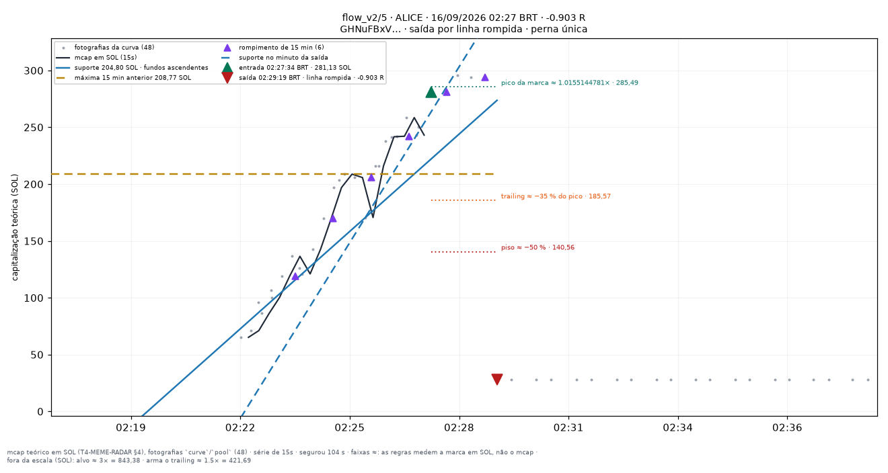
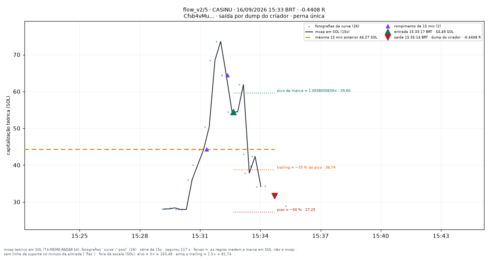

# flow_v2/5 — apostas traçadas

Uma imagem por aposta **fechada** do conjunto `flow_v2/5` (research_only), desenhada por `infra/scripts/meme_render_bets.py` a partir de `meme_paper_bets`, `meme_features_15s`, `meme_features_1m` e `meme_curve_snapshots` — nenhum número desta página foi digitado à mão.

**Pré-registro congelado:** [[EXP-M6-exclusoes-de-pedigree]]. As linhas desenhadas são as **features** do fold (`support_line_sol`, `high_15m_sol`, `breakout_15m`, `higher_lows`, T4.10), lidas no minuto fechado da entrada — a mesma geometria da tela `/meme/{mint}` (`apps/web/components/meme/meme-lines.ts`). Para um conjunto que não lê linha para decidir elas são **contexto**, nunca entrada da decisão.

**Faixas com `≈`:** alvo, piso, arme e trailing medem a **marca em SOL** (o que uma venda cheia renderia, taxas incluídas — `docs/RISK_ENGINE_MEME.md` §6), não a capitalização; no gráfico os múltiplos aparecem aplicados ao mcap da entrada. O R do título é o da linha da aposta.

| régua congelada | valor |
|---|---|
| tamanho (SOL) | `0.05` |
| alvo (×) | `3` |
| trailing (%) | `35` |
| arma o trailing (×) | `1.5` |
| tempo máximo (s) | `1800` |
| piso de perda (%) | `50` |
| sai na linha rompida | sim |
| sai na migração | — |
| relógio | `15s` |

Reproduzir: `docs/PIPELINE.md` §9c. Diário do dia: [[09-OPERATIONS/Diario-Meme/README|Diário Meme]]. Índice: [[03-TRADING/Meme/Apostas-tracadas/README|Operações traçadas (meme)]].

## Dia 2026-09-16

26 aposta(s) fechada(s) — 26 medida(s), 0 indeterminada(s). Soma de R das medidas: **-0.8883**.

**Melhor** — LAUNCH · 00:18:37 BRT · +2.8961 R · saída por `target`.

**Pior** — ALICE · 02:27:34 BRT · -0.903 R · saída por `line_broken`.

**Mais recente** — CASINU · 15:33:17 BRT · -0.4408 R · saída por `creator_dump`.

| hora (BRT) | símbolo | mint | R | saída | gráfico |
|---|---|---|---|---|---|
| 00:16:31 | LAUNCH | `JBFeVRrjtu…` | -0.0769 | line_broken | [0016-LAUNCH--0.08.png](../../../attachments/meme/2026-09-16/flow_v2-5/0016-LAUNCH--0.08.png) |
| 00:18:37 | LAUNCH | `JBFeVRrjtu…` | +2.8961 | target | [0018-LAUNCH-+2.90.png](../../../attachments/meme/2026-09-16/flow_v2-5/0018-LAUNCH-%2B2.90.png) |
| 00:33:42 | STABILITY | `xgJXYDEWaM…` | +0.2296 | line_broken | [0033-STABILITY-+0.23.png](../../../attachments/meme/2026-09-16/flow_v2-5/0033-STABILITY-%2B0.23.png) |
| 02:27:34 | ALICE | `GHNuFBxVwH…` | -0.903 | line_broken | [0227-ALICE--0.90.png](../../../attachments/meme/2026-09-16/flow_v2-5/0227-ALICE--0.90.png) |
| 02:50:10 | KANYE | `34kSYEW5sn…` | -0.3483 | creator_dump | [0250-KANYE--0.35.png](../../../attachments/meme/2026-09-16/flow_v2-5/0250-KANYE--0.35.png) |
| 02:54:04 | INDIEREACH | `kDToGHjuti…` | +0.8917 | line_broken | [0254-INDIEREACH-+0.89.png](../../../attachments/meme/2026-09-16/flow_v2-5/0254-INDIEREACH-%2B0.89.png) |
| 02:56:10 | INDIEREACH | `kDToGHjuti…` | -0.8661 | max_loss | [0256-INDIEREACH--0.87.png](../../../attachments/meme/2026-09-16/flow_v2-5/0256-INDIEREACH--0.87.png) |
| 03:48:25 | NAMEROT | `3ySWBtEico…` | -0.2507 | line_broken | [0348-NAMEROT--0.25.png](../../../attachments/meme/2026-09-16/flow_v2-5/0348-NAMEROT--0.25.png) |
| 05:07:36 | KITE | `56KcQzfmDW…` | +0.3842 | line_broken | [0507-KITE-+0.38.png](../../../attachments/meme/2026-09-16/flow_v2-5/0507-KITE-%2B0.38.png) |
| 06:10:27 | ZKPASS | `FMh5opbs4e…` | -0.8109 | max_loss | [0610-ZKPASS--0.81.png](../../../attachments/meme/2026-09-16/flow_v2-5/0610-ZKPASS--0.81.png) |
| 06:19:06 | BITMAKER | `SogCcFn78Y…` | +0.0951 | line_broken | [0619-BITMAKER-+0.10.png](../../../attachments/meme/2026-09-16/flow_v2-5/0619-BITMAKER-%2B0.10.png) |
| 06:20:09 | BITMAKER | `SogCcFn78Y…` | +0.245 | line_broken | [0620-BITMAKER-+0.24.png](../../../attachments/meme/2026-09-16/flow_v2-5/0620-BITMAKER-%2B0.24.png) |
| 06:53:17 | TASKON | `j3YSKrAJrT…` | -0.7703 | max_loss | [0653-TASKON--0.77.png](../../../attachments/meme/2026-09-16/flow_v2-5/0653-TASKON--0.77.png) |
| 07:00:06 | POLKADOT | `Un18N8fpCb…` | -0.0416 | line_broken | [0700-POLKADOT--0.04.png](../../../attachments/meme/2026-09-16/flow_v2-5/0700-POLKADOT--0.04.png) |
| 07:42:54 | SWISSC | `XtSLPWvMt4…` | -0.1002 | line_broken | [0742-SWISSC--0.10.png](../../../attachments/meme/2026-09-16/flow_v2-5/0742-SWISSC--0.10.png) |
| 07:58:52 | KLING | `YNsgprpQRL…` | +0.6814 | line_broken | [0758-KLING-+0.68.png](../../../attachments/meme/2026-09-16/flow_v2-5/0758-KLING-%2B0.68.png) |
| 08:49:54 | KORI | `CGYSnnTTqF…` | -0.0687 | line_broken | [0849-KORI--0.07.png](../../../attachments/meme/2026-09-16/flow_v2-5/0849-KORI--0.07.png) |
| 10:49:26 | CHILLIN | `6DUhuuQVaQ…` | -0.8818 | max_loss | [1049-CHILLIN--0.88.png](../../../attachments/meme/2026-09-16/flow_v2-5/1049-CHILLIN--0.88.png) |
| 11:46:40 | INCEPT | `FHcHh1ELbW…` | +0.2959 | line_broken | [1146-INCEPT-+0.30.png](../../../attachments/meme/2026-09-16/flow_v2-5/1146-INCEPT-%2B0.30.png) |
| 12:07:55 | CGRAM | `3tAFaZsjAv…` | -0.1441 | line_broken | [1207-CGRAM--0.14.png](../../../attachments/meme/2026-09-16/flow_v2-5/1207-CGRAM--0.14.png) |
| 12:52:49 | GREMLIN | `Gn9U13zkBd…` | +1.3044 | migrated | [1252-GREMLIN-+1.30.png](../../../attachments/meme/2026-09-16/flow_v2-5/1252-GREMLIN-%2B1.30.png) |
| 14:04:54 | SORT | `7uwn4TV124…` | -0.698 | max_loss | [1404-SORT--0.70.png](../../../attachments/meme/2026-09-16/flow_v2-5/1404-SORT--0.70.png) |
| 14:08:24 | STEVE | `FLHSaTeXxo…` | +0.0885 | line_broken | [1408-STEVE-+0.09.png](../../../attachments/meme/2026-09-16/flow_v2-5/1408-STEVE-%2B0.09.png) |
| 14:13:48 | RIZZLERS | `3T4AueQkix…` | -0.8503 | line_broken | [1413-RIZZLERS--0.85.png](../../../attachments/meme/2026-09-16/flow_v2-5/1413-RIZZLERS--0.85.png) |
| 15:12:10 | LPAD | `D4fi1cAWTZ…` | -0.7484 | max_loss | [1512-LPAD--0.75.png](../../../attachments/meme/2026-09-16/flow_v2-5/1512-LPAD--0.75.png) |
| 15:33:17 | CASINU | `Cfsb4vMug1…` | -0.4408 | creator_dump | [1533-CASINU--0.44.png](../../../attachments/meme/2026-09-16/flow_v2-5/1533-CASINU--0.44.png) |
