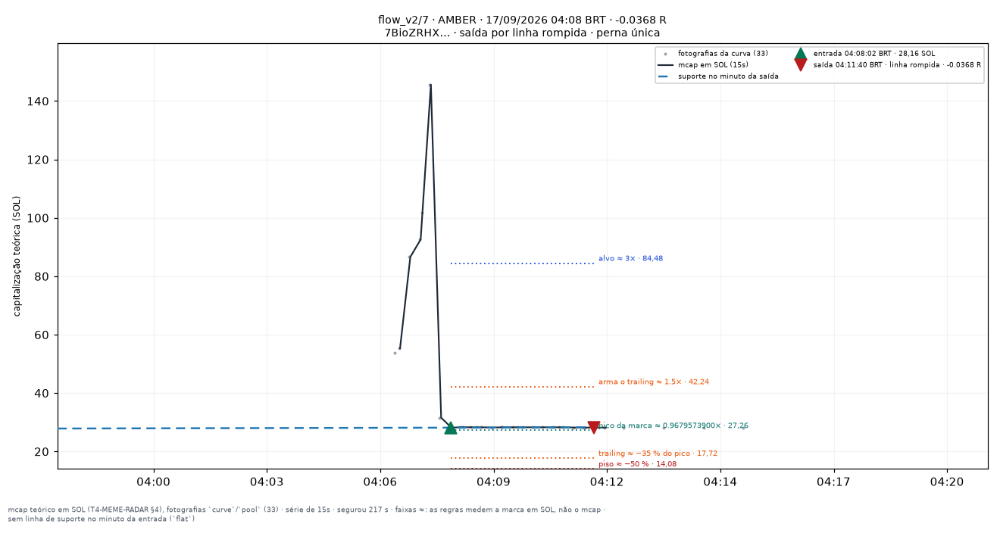
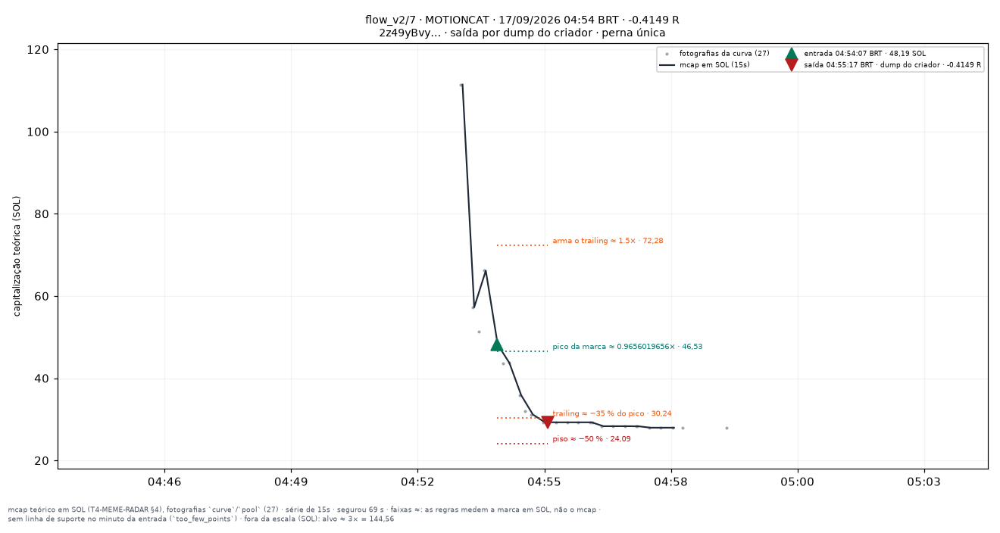
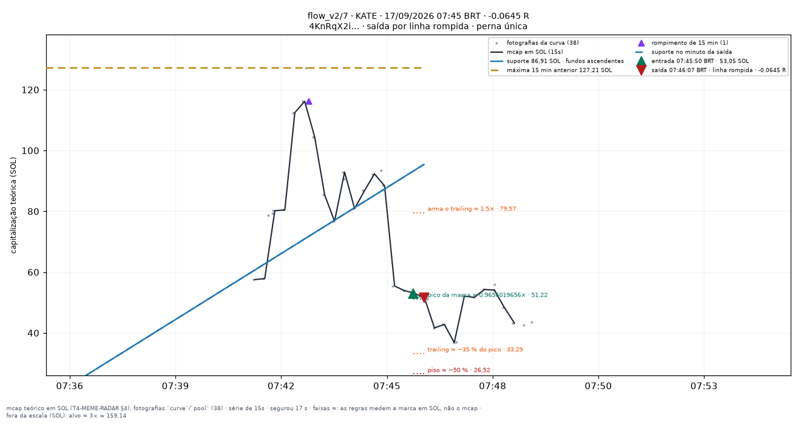

# flow_v2/7 — apostas traçadas

Uma imagem por aposta **fechada** do conjunto `flow_v2/7` (research_only), desenhada por `infra/scripts/meme_render_bets.py` a partir de `meme_paper_bets`, `meme_features_15s`, `meme_features_1m` e `meme_curve_snapshots` — nenhum número desta página foi digitado à mão.

**Pré-registro congelado:** [[EXP-M10-compradores-25]]. As linhas desenhadas são as **features** do fold (`support_line_sol`, `high_15m_sol`, `breakout_15m`, `higher_lows`, T4.10), lidas no minuto fechado da entrada — a mesma geometria da tela `/meme/{mint}` (`apps/web/components/meme/meme-lines.ts`). Para um conjunto que não lê linha para decidir elas são **contexto**, nunca entrada da decisão.

**Faixas com `≈`:** alvo, piso, arme e trailing medem a **marca em SOL** (o que uma venda cheia renderia, taxas incluídas — `docs/RISK_ENGINE_MEME.md` §6), não a capitalização; no gráfico os múltiplos aparecem aplicados ao mcap da entrada. O R do título é o da linha da aposta.

| régua congelada | valor |
|---|---|
| tamanho (SOL) | `0.05` |
| alvo (×) | `3` |
| trailing (%) | `35` |
| arma o trailing (×) | `1.5` |
| tempo máximo (s) | `1800` |
| piso de perda (%) | `50` |
| sai na linha rompida | sim |
| sai na migração | — |
| relógio | `15s` |

Reproduzir: `docs/PIPELINE.md` §9c. Diário do dia: [[09-OPERATIONS/Diario-Meme/README|Diário Meme]]. Índice: [[03-TRADING/Meme/Apostas-tracadas/README|Operações traçadas (meme)]].

## Dia 2026-09-17

7 aposta(s) fechada(s) — 7 medida(s), 0 indeterminada(s). Soma de R das medidas: **-1.0652**.

**Melhor** — AMBER · 04:08:02 BRT · -0.0368 R · saída por `line_broken`.

**Pior** — MOTIONCAT · 04:54:07 BRT · -0.4149 R · saída por `creator_dump`.

**Mais recente** — KATE · 07:45:50 BRT · -0.0645 R · saída por `line_broken`.

| hora (BRT) | símbolo | mint | R | saída | gráfico |
|---|---|---|---|---|---|
| 00:24:52 | BALLSACKDORK | `9X4CFoSDm6…` | -0.3455 | line_broken | [0024-BALLSACKDORK--0.35.png](../../../attachments/meme/2026-09-17/flow_v2-7/0024-BALLSACKDORK--0.35.png) |
| 03:00:52 | KABO | `7koNefaxP9…` | -0.0499 | creator_dump | [0300-KABO--0.05.png](../../../attachments/meme/2026-09-17/flow_v2-7/0300-KABO--0.05.png) |
| 04:08:02 | AMBER | `7BioZRHXzq…` | -0.0368 | line_broken | [0408-AMBER--0.04.png](../../../attachments/meme/2026-09-17/flow_v2-7/0408-AMBER--0.04.png) |
| 04:16:09 | INMATE | `AEtHL6NyZ7…` | -0.116 | line_broken | [0416-INMATE--0.12.png](../../../attachments/meme/2026-09-17/flow_v2-7/0416-INMATE--0.12.png) |
| 04:54:07 | MOTIONCAT | `2z49yBvyp3…` | -0.4149 | creator_dump | [0454-MOTIONCAT--0.41.png](../../../attachments/meme/2026-09-17/flow_v2-7/0454-MOTIONCAT--0.41.png) |
| 06:13:00 | SNOZ | `2G7PAVufb3…` | -0.0376 | line_broken | [0613-SNOZ--0.04.png](../../../attachments/meme/2026-09-17/flow_v2-7/0613-SNOZ--0.04.png) |
| 07:45:50 | KATE | `4KnRqX2ip3…` | -0.0645 | line_broken | [0745-KATE--0.06.png](../../../attachments/meme/2026-09-17/flow_v2-7/0745-KATE--0.06.png) |
