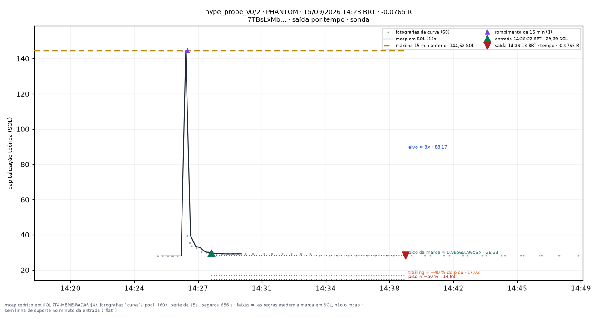
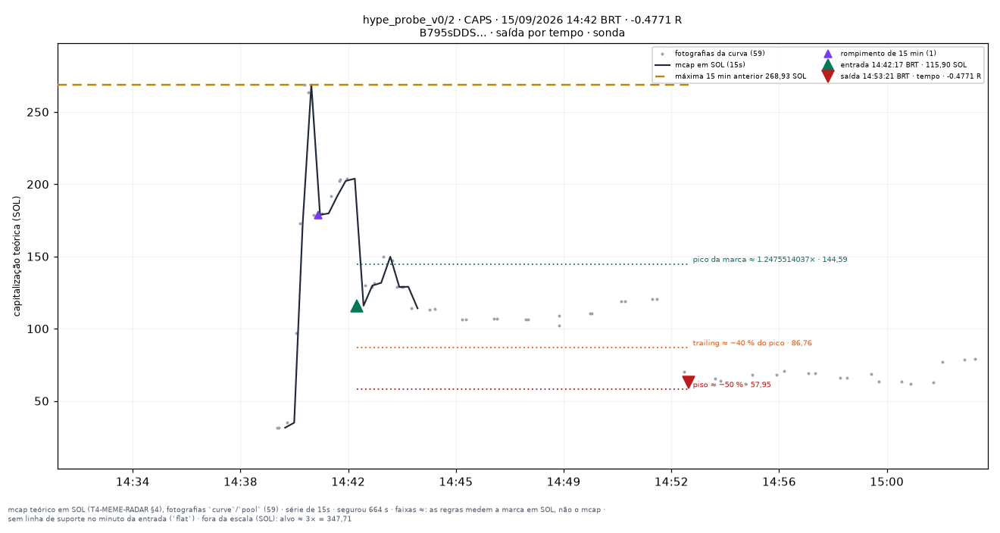
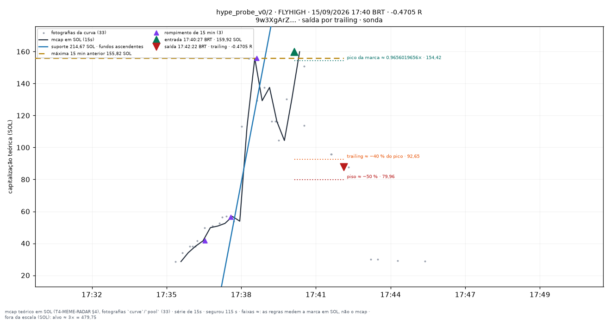
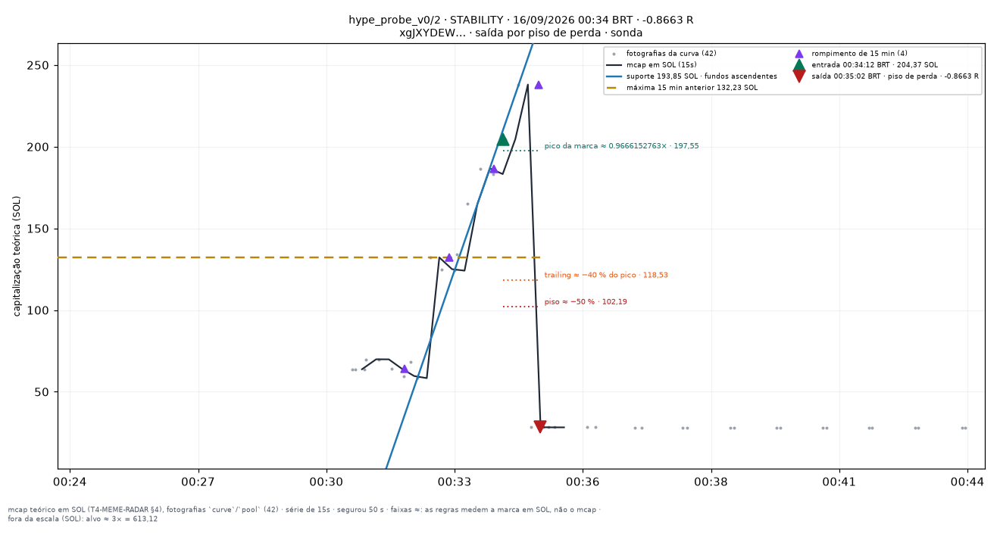
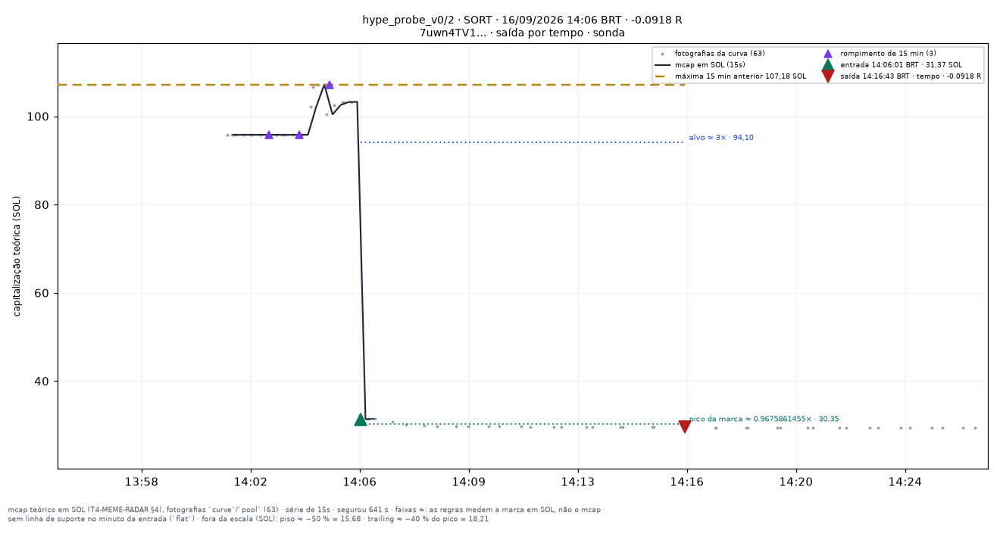

# hype_probe_v0/2 — apostas traçadas

Uma imagem por aposta **fechada** do conjunto `hype_probe_v0/2` (research_only), desenhada por `infra/scripts/meme_render_bets.py` a partir de `meme_paper_bets`, `meme_features_15s`, `meme_features_1m` e `meme_curve_snapshots` — nenhum número desta página foi digitado à mão.

**Pré-registro congelado:** [[EXP-M5-fluxo-e-holders]]. As linhas desenhadas são as **features** do fold (`support_line_sol`, `high_15m_sol`, `breakout_15m`, `higher_lows`, T4.10), lidas no minuto fechado da entrada — a mesma geometria da tela `/meme/{mint}` (`apps/web/components/meme/meme-lines.ts`). Para um conjunto que não lê linha para decidir elas são **contexto**, nunca entrada da decisão.

**Faixas com `≈`:** alvo, piso, arme e trailing medem a **marca em SOL** (o que uma venda cheia renderia, taxas incluídas — `docs/RISK_ENGINE_MEME.md` §6), não a capitalização; no gráfico os múltiplos aparecem aplicados ao mcap da entrada. O R do título é o da linha da aposta.

| régua congelada | valor |
|---|---|
| tamanho (SOL) | `0.01` |
| alvo (×) | `3` |
| trailing (%) | `40` |
| arma o trailing (×) | — |
| tempo máximo (s) | `600` |
| piso de perda (%) | `50` |
| sai na linha rompida | — |
| sai na migração | — |
| relógio | — |

Reproduzir: `docs/PIPELINE.md` §9c. Diário do dia: [[09-OPERATIONS/Diario-Meme/README|Diário Meme]]. Índice: [[03-TRADING/Meme/Apostas-tracadas/README|Operações traçadas (meme)]].
## Dia 2026-09-14

2 aposta(s) fechada(s) — 2 medida(s), 0 indeterminada(s). Soma de R das medidas: **-0.3751**.

**Melhor** — UNCLE · 03:23:14 BRT · -0.0361 R · saída por `creator_dump`.

**Pior · Mais recente** — LBN · 22:23:26 BRT · -0.339 R · saída por `trailing`.

| hora (BRT) | símbolo | mint | R | saída | gráfico |
|---|---|---|---|---|---|
| 03:23:14 | UNCLE | `J5iARiAWbd…` | -0.0361 | creator_dump | [0323-UNCLE--0.04.png](../../../attachments/meme/2026-09-14/hype_probe_v0-2/0323-UNCLE--0.04.png) |
| 22:23:26 | LBN | `Hp9aqfw8xj…` | -0.339 | trailing | [2223-LBN--0.34.png](../../../attachments/meme/2026-09-14/hype_probe_v0-2/2223-LBN--0.34.png) |

## Dia 2026-09-15

3 aposta(s) fechada(s) — 3 medida(s), 0 indeterminada(s). Soma de R das medidas: **-1.0241**.

**Melhor** — PHANTOM · 14:28:22 BRT · -0.0765 R · saída por `time_stop`.

**Pior** — CAPS · 14:42:17 BRT · -0.4771 R · saída por `time_stop`.

**Mais recente** — FLYHIGH · 17:40:27 BRT · -0.4705 R · saída por `trailing`.

| hora (BRT) | símbolo | mint | R | saída | gráfico |
|---|---|---|---|---|---|
| 14:28:22 | PHANTOM | `7TBsLxMbhD…` | -0.0765 | time_stop | [1428-PHANTOM--0.08.png](../../../attachments/meme/2026-09-15/hype_probe_v0-2/1428-PHANTOM--0.08.png) |
| 14:42:17 | CAPS | `B795sDDSw9…` | -0.4771 | time_stop | [1442-CAPS--0.48.png](../../../attachments/meme/2026-09-15/hype_probe_v0-2/1442-CAPS--0.48.png) |
| 17:40:27 | FLYHIGH | `9w3XgArZLR…` | -0.4705 | trailing | [1740-FLYHIGH--0.47.png](../../../attachments/meme/2026-09-15/hype_probe_v0-2/1740-FLYHIGH--0.47.png) |

## Dia 2026-09-16

8 aposta(s) fechada(s) — 8 medida(s), 0 indeterminada(s). Soma de R das medidas: **-0.0461**.

**Melhor** — DATBOI · 03:28:35 BRT · +1.2189 R · saída por `migrated`.

**Pior** — STABILITY · 00:34:12 BRT · -0.8663 R · saída por `max_loss`.

**Mais recente** — SORT · 14:06:01 BRT · -0.0918 R · saída por `time_stop`.

| hora (BRT) | símbolo | mint | R | saída | gráfico |
|---|---|---|---|---|---|
| 00:34:12 | STABILITY | `xgJXYDEWaM…` | -0.8663 | max_loss | [0034-STABILITY--0.87.png](../../../attachments/meme/2026-09-16/hype_probe_v0-2/0034-STABILITY--0.87.png) |
| 00:36:17 | STABILITY | `xgJXYDEWaM…` | -0.0417 | time_stop | [0036-STABILITY--0.04.png](../../../attachments/meme/2026-09-16/hype_probe_v0-2/0036-STABILITY--0.04.png) |
| 03:28:35 | DATBOI | `6jcGTKroM1…` | +1.2189 | migrated | [0328-DATBOI-+1.22.png](../../../attachments/meme/2026-09-16/hype_probe_v0-2/0328-DATBOI-%2B1.22.png) |
| 05:09:09 | KITE | `56KcQzfmDW…` | +0.4658 | migrated | [0509-KITE-+0.47.png](../../../attachments/meme/2026-09-16/hype_probe_v0-2/0509-KITE-%2B0.47.png) |
| 07:01:09 | POLKADOT | `Un18N8fpCb…` | -0.0348 | time_stop | [0701-POLKADOT--0.03.png](../../../attachments/meme/2026-09-16/hype_probe_v0-2/0701-POLKADOT--0.03.png) |
| 08:00:06 | KLING | `YNsgprpQRL…` | -0.0405 | trailing | [0800-KLING--0.04.png](../../../attachments/meme/2026-09-16/hype_probe_v0-2/0800-KLING--0.04.png) |
| 08:13:12 | SOLDIERS | `A2SmpwJBVM…` | -0.6556 | max_loss | [0813-SOLDIERS--0.66.png](../../../attachments/meme/2026-09-16/hype_probe_v0-2/0813-SOLDIERS--0.66.png) |
| 14:06:01 | SORT | `7uwn4TV124…` | -0.0918 | time_stop | [1406-SORT--0.09.png](../../../attachments/meme/2026-09-16/hype_probe_v0-2/1406-SORT--0.09.png) |
