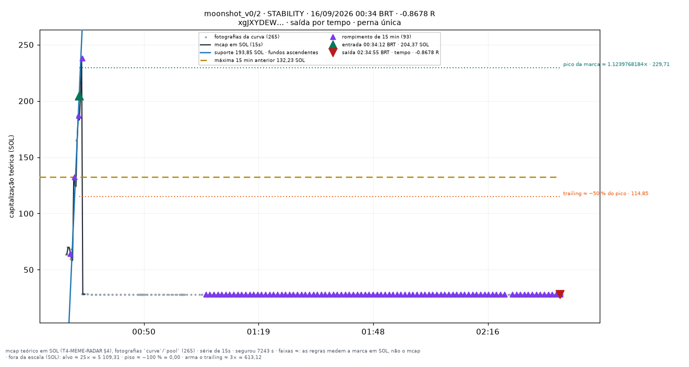
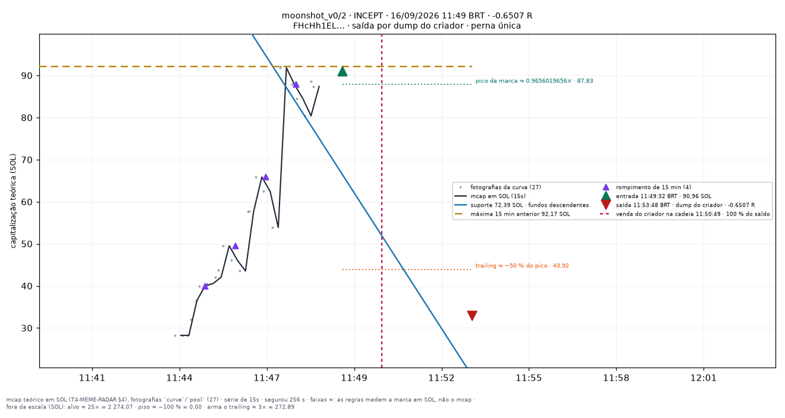

# moonshot_v0/2 — apostas traçadas

Uma imagem por aposta **fechada** do conjunto `moonshot_v0/2` (research_only), desenhada por `infra/scripts/meme_render_bets.py` a partir de `meme_paper_bets`, `meme_features_15s`, `meme_features_1m` e `meme_curve_snapshots` — nenhum número desta página foi digitado à mão.

**Pré-registro congelado:** [[EXP-M4-moonshot]]. As linhas desenhadas são as **features** do fold (`support_line_sol`, `high_15m_sol`, `breakout_15m`, `higher_lows`, T4.10), lidas no minuto fechado da entrada — a mesma geometria da tela `/meme/{mint}` (`apps/web/components/meme/meme-lines.ts`). Para um conjunto que não lê linha para decidir elas são **contexto**, nunca entrada da decisão.

**Faixas com `≈`:** alvo, piso, arme e trailing medem a **marca em SOL** (o que uma venda cheia renderia, taxas incluídas — `docs/RISK_ENGINE_MEME.md` §6), não a capitalização; no gráfico os múltiplos aparecem aplicados ao mcap da entrada. O R do título é o da linha da aposta.

| régua congelada | valor |
|---|---|
| tamanho (SOL) | `0.02` |
| alvo (×) | `25` |
| trailing (%) | `50` |
| arma o trailing (×) | `3` |
| tempo máximo (s) | `7200` |
| piso de perda (%) | `100` |
| sai na linha rompida | — |
| sai na migração | não |
| relógio | — |

Reproduzir: `docs/PIPELINE.md` §9c. Diário do dia: [[09-OPERATIONS/Diario-Meme/README|Diário Meme]]. Índice: [[03-TRADING/Meme/Apostas-tracadas/README|Operações traçadas (meme)]].
## Dia 2026-09-14

6 aposta(s) fechada(s) — 6 medida(s), 0 indeterminada(s). Soma de R das medidas: **-0.9617**.

**Melhor** — BENDRILLR · 16:49:16 BRT · +0.5703 R · saída por `time_stop`.

**Pior** — CTB · 07:15:11 BRT · -0.842 R · saída por `time_stop`.

**Mais recente** — LBN · 22:23:26 BRT · -0.4649 R · saída por `creator_dump`.

| hora (BRT) | símbolo | mint | R | saída | gráfico |
|---|---|---|---|---|---|
| 03:23:14 | UNCLE | `J5iARiAWbd…` | -0.0367 | creator_dump | [0323-UNCLE--0.04.png](../../../attachments/meme/2026-09-14/moonshot_v0-2/0323-UNCLE--0.04.png) |
| 07:15:11 | CTB | `4afLRsZLb4…` | -0.842 | time_stop | [0715-CTB--0.84.png](../../../attachments/meme/2026-09-14/moonshot_v0-2/0715-CTB--0.84.png) |
| 10:24:08 | DICARPIO | `25zWDWqsvv…` | -0.0524 | creator_dump | [1024-DICARPIO--0.05.png](../../../attachments/meme/2026-09-14/moonshot_v0-2/1024-DICARPIO--0.05.png) |
| 16:49:16 | BENDRILLR | `DmccGwRcUU…` | +0.5703 | time_stop | [1649-BENDRILLR-+0.57.png](../../../attachments/meme/2026-09-14/moonshot_v0-2/1649-BENDRILLR-%2B0.57.png) |
| 16:53:17 | STUART | `8fJjPjFc9P…` | -0.1359 | time_stop | [1653-STUART--0.14.png](../../../attachments/meme/2026-09-14/moonshot_v0-2/1653-STUART--0.14.png) |
| 22:23:26 | LBN | `Hp9aqfw8xj…` | -0.4649 | creator_dump | [2223-LBN--0.46.png](../../../attachments/meme/2026-09-14/moonshot_v0-2/2223-LBN--0.46.png) |

## Dia 2026-09-15

7 aposta(s) fechada(s) — 7 medida(s), 0 indeterminada(s). Soma de R das medidas: **+2.8365**.

**Melhor** — HYPNOTIZE · 06:46:16 BRT · +3.3555 R · saída por `trailing`.

**Pior** — FLYHIGH · 17:40:27 BRT · -0.824 R · saída por `creator_dump`.

**Mais recente** — BOLDCOIN · 18:55:29 BRT · +0.7689 R · saída por `creator_dump`.

| hora (BRT) | símbolo | mint | R | saída | gráfico |
|---|---|---|---|---|---|
| 06:46:16 | HYPNOTIZE | `AdKH1t84SA…` | +3.3555 | trailing | [0646-HYPNOTIZE-+3.36.png](../../../attachments/meme/2026-09-15/moonshot_v0-2/0646-HYPNOTIZE-%2B3.36.png) |
| 09:20:20 | BDOGC | `261sDw1fQ1…` | -0.0484 | time_stop | [0920-BDOGC--0.05.png](../../../attachments/meme/2026-09-15/moonshot_v0-2/0920-BDOGC--0.05.png) |
| 11:34:22 | ETCH | `3zw996PTFi…` | +0.3804 | creator_dump | [1134-ETCH-+0.38.png](../../../attachments/meme/2026-09-15/moonshot_v0-2/1134-ETCH-%2B0.38.png) |
| 14:28:22 | PHANTOM | `7TBsLxMbhD…` | -0.0746 | time_stop | [1428-PHANTOM--0.07.png](../../../attachments/meme/2026-09-15/moonshot_v0-2/1428-PHANTOM--0.07.png) |
| 14:42:17 | CAPS | `B795sDDSw9…` | -0.7211 | time_stop | [1442-CAPS--0.72.png](../../../attachments/meme/2026-09-15/moonshot_v0-2/1442-CAPS--0.72.png) |
| 17:40:27 | FLYHIGH | `9w3XgArZLR…` | -0.824 | creator_dump | [1740-FLYHIGH--0.82.png](../../../attachments/meme/2026-09-15/moonshot_v0-2/1740-FLYHIGH--0.82.png) |
| 18:55:29 | BOLDCOIN | `EZdoYwMPiS…` | +0.7689 | creator_dump | [1855-BOLDCOIN-+0.77.png](../../../attachments/meme/2026-09-15/moonshot_v0-2/1855-BOLDCOIN-%2B0.77.png) |

## Dia 2026-09-16

10 aposta(s) fechada(s) — 10 medida(s), 0 indeterminada(s). Soma de R das medidas: **+0.8324**.

**Melhor** — KITE · 05:09:09 BRT · +4.4087 R · saída por `trailing`.

**Pior** — STABILITY · 00:34:12 BRT · -0.8678 R · saída por `time_stop`.

**Mais recente** — INCEPT · 11:49:32 BRT · -0.6507 R · saída por `creator_dump`.

| hora (BRT) | símbolo | mint | R | saída | gráfico |
|---|---|---|---|---|---|
| 00:34:12 | STABILITY | `xgJXYDEWaM…` | -0.8678 | time_stop | [0034-STABILITY--0.87.png](../../../attachments/meme/2026-09-16/moonshot_v0-2/0034-STABILITY--0.87.png) |
| 02:25:10 | ALICE | `GHNuFBxVwH…` | -0.867 | time_stop | [0225-ALICE--0.87.png](../../../attachments/meme/2026-09-16/moonshot_v0-2/0225-ALICE--0.87.png) |
| 03:25:25 | DATBOI | `6jcGTKroM1…` | +1.2676 | trailing | [0325-DATBOI-+1.27.png](../../../attachments/meme/2026-09-16/moonshot_v0-2/0325-DATBOI-%2B1.27.png) |
| 05:09:09 | KITE | `56KcQzfmDW…` | +4.4087 | trailing | [0509-KITE-+4.41.png](../../../attachments/meme/2026-09-16/moonshot_v0-2/0509-KITE-%2B4.41.png) |
| 07:01:09 | POLKADOT | `Un18N8fpCb…` | -0.0355 | time_stop | [0701-POLKADOT--0.04.png](../../../attachments/meme/2026-09-16/moonshot_v0-2/0701-POLKADOT--0.04.png) |
| 07:45:34 | SWISSC | `XtSLPWvMt4…` | -0.8579 | time_stop | [0745-SWISSC--0.86.png](../../../attachments/meme/2026-09-16/moonshot_v0-2/0745-SWISSC--0.86.png) |
| 08:00:06 | KLING | `YNsgprpQRL…` | -0.8063 | time_stop | [0800-KLING--0.81.png](../../../attachments/meme/2026-09-16/moonshot_v0-2/0800-KLING--0.81.png) |
| 08:13:12 | SOLDIERS | `A2SmpwJBVM…` | -0.7165 | time_stop | [0813-SOLDIERS--0.72.png](../../../attachments/meme/2026-09-16/moonshot_v0-2/0813-SOLDIERS--0.72.png) |
| 08:31:14 | SYMMETRY | `KfPbK7bSmY…` | -0.0422 | time_stop | [0831-SYMMETRY--0.04.png](../../../attachments/meme/2026-09-16/moonshot_v0-2/0831-SYMMETRY--0.04.png) |
| 11:49:32 | INCEPT | `FHcHh1ELbW…` | -0.6507 | creator_dump | [1149-INCEPT--0.65.png](../../../attachments/meme/2026-09-16/moonshot_v0-2/1149-INCEPT--0.65.png) |
