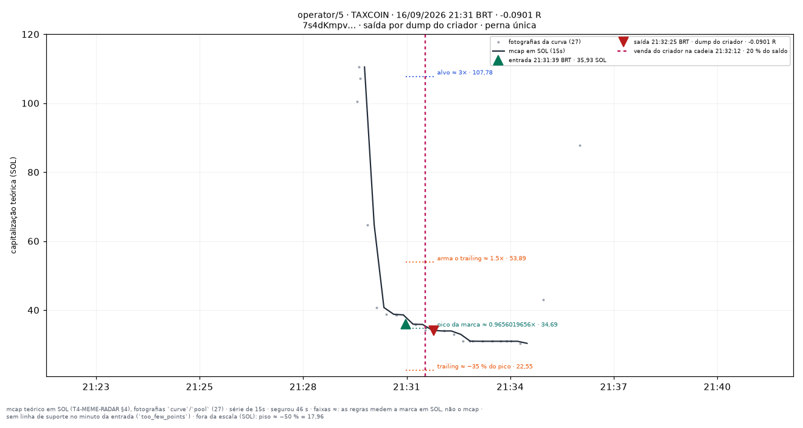
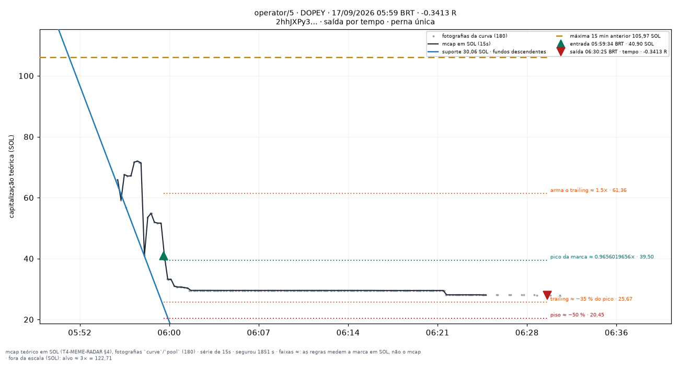

# operator/5 — apostas traçadas

Uma imagem por aposta **fechada** do conjunto `operator/5` (operator), desenhada por `infra/scripts/meme_render_bets.py` a partir de `meme_paper_bets`, `meme_features_15s`, `meme_features_1m` e `meme_curve_snapshots` — nenhum número desta página foi digitado à mão.

**Pré-registro congelado:** (conjunto `operator` — sem pré-registro; a mesa decide). As linhas desenhadas são as **features** do fold (`support_line_sol`, `high_15m_sol`, `breakout_15m`, `higher_lows`, T4.10), lidas no minuto fechado da entrada — a mesma geometria da tela `/meme/{mint}` (`apps/web/components/meme/meme-lines.ts`). Para um conjunto que não lê linha para decidir elas são **contexto**, nunca entrada da decisão.

**Faixas com `≈`:** alvo, piso, arme e trailing medem a **marca em SOL** (o que uma venda cheia renderia, taxas incluídas — `docs/RISK_ENGINE_MEME.md` §6), não a capitalização; no gráfico os múltiplos aparecem aplicados ao mcap da entrada. O R do título é o da linha da aposta.

| régua congelada | valor |
|---|---|
| tamanho (SOL) | `0.05` |
| alvo (×) | `3` |
| trailing (%) | `35` |
| arma o trailing (×) | `1.5` |
| tempo máximo (s) | `1800` |
| piso de perda (%) | `50` |
| sai na linha rompida | sim |
| sai na migração | — |
| relógio | `15s` |

Reproduzir: `docs/PIPELINE.md` §9c. Diário do dia: [[09-OPERATIONS/Diario-Meme/README|Diário Meme]]. Índice: [[03-TRADING/Meme/Apostas-tracadas/README|Operações traçadas (meme)]].
## Dia 2026-09-16

1 aposta(s) fechada(s) — 1 medida(s), 0 indeterminada(s). Soma de R das medidas: **-0.0901**.

**Melhor · Pior · Mais recente** — TAXCOIN · 21:31:39 BRT · -0.0901 R · saída por `creator_dump`.

| hora (BRT) | símbolo | mint | R | saída | gráfico |
|---|---|---|---|---|---|
| 21:31:39 | TAXCOIN | `7s4dKmpvQx…` | -0.0901 | creator_dump | [2131-TAXCOIN--0.09.png](../../../attachments/meme/2026-09-16/operator-5/2131-TAXCOIN--0.09.png) |

## Dia 2026-09-17

5 aposta(s) fechada(s) — 5 medida(s), 0 indeterminada(s). Soma de R das medidas: **-0.6589**.

**Melhor · Mais recente** — PLANB · 06:01:10 BRT · +0.2281 R · saída por `line_broken`.

**Pior** — DOPEY · 05:59:34 BRT · -0.3413 R · saída por `time_stop`.

| hora (BRT) | símbolo | mint | R | saída | gráfico |
|---|---|---|---|---|---|
| 03:08:28 | CATBYTE | `63NPcW9qYC…` | -0.0401 | line_broken | [0308-CATBYTE--0.04.png](../../../attachments/meme/2026-09-17/operator-5/0308-CATBYTE--0.04.png) |
| 03:28:35 | RAMEN | `CCLstvwa27…` | -0.2403 | line_broken | [0328-RAMEN--0.24.png](../../../attachments/meme/2026-09-17/operator-5/0328-RAMEN--0.24.png) |
| 04:15:21 | INMATE | `AEtHL6NyZ7…` | -0.2654 | line_broken | [0415-INMATE--0.27.png](../../../attachments/meme/2026-09-17/operator-5/0415-INMATE--0.27.png) |
| 05:59:34 | DOPEY | `2hhJXPy3ce…` | -0.3413 | time_stop | [0559-DOPEY--0.34.png](../../../attachments/meme/2026-09-17/operator-5/0559-DOPEY--0.34.png) |
| 06:01:10 | PLANB | `Dy9YAbcLWB…` | +0.2281 | line_broken | [0601-PLANB-+0.23.png](../../../attachments/meme/2026-09-17/operator-5/0601-PLANB-%2B0.23.png) |
