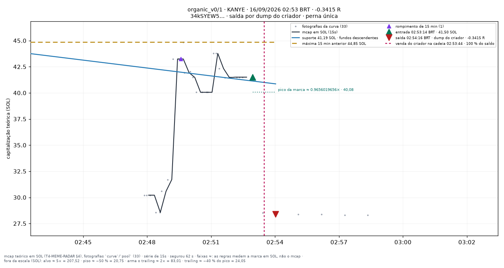

# organic_v0/1 — apostas traçadas

Uma imagem por aposta **fechada** do conjunto `organic_v0/1` (research_only), desenhada por `infra/scripts/meme_render_bets.py` a partir de `meme_paper_bets`, `meme_features_15s`, `meme_features_1m` e `meme_curve_snapshots` — nenhum número desta página foi digitado à mão.

**Pré-registro congelado:** [[EXP-M7-organica-lenta]]. As linhas desenhadas são as **features** do fold (`support_line_sol`, `high_15m_sol`, `breakout_15m`, `higher_lows`, T4.10), lidas no minuto fechado da entrada — a mesma geometria da tela `/meme/{mint}` (`apps/web/components/meme/meme-lines.ts`). Para um conjunto que não lê linha para decidir elas são **contexto**, nunca entrada da decisão.

**Faixas com `≈`:** alvo, piso, arme e trailing medem a **marca em SOL** (o que uma venda cheia renderia, taxas incluídas — `docs/RISK_ENGINE_MEME.md` §6), não a capitalização; no gráfico os múltiplos aparecem aplicados ao mcap da entrada. O R do título é o da linha da aposta.

| régua congelada | valor |
|---|---|
| tamanho (SOL) | `0.05` |
| alvo (×) | `5` |
| trailing (%) | `40` |
| arma o trailing (×) | `2` |
| tempo máximo (s) | `3600` |
| piso de perda (%) | `50` |
| sai na linha rompida | não |
| sai na migração | não |
| relógio | `1m` |

Reproduzir: `docs/PIPELINE.md` §9c. Diário do dia: [[09-OPERATIONS/Diario-Meme/README|Diário Meme]]. Índice: [[03-TRADING/Meme/Apostas-tracadas/README|Operações traçadas (meme)]].

## Dia 2026-09-16

1 aposta(s) fechada(s) — 1 medida(s), 0 indeterminada(s). Soma de R das medidas: **-0.3415**.

**Melhor · Pior · Mais recente** — KANYE · 02:53:14 BRT · -0.3415 R · saída por `creator_dump`.

| hora (BRT) | símbolo | mint | R | saída | gráfico |
|---|---|---|---|---|---|
| 02:53:14 | KANYE | `34kSYEW5sn…` | -0.3415 | creator_dump | [0253-KANYE--0.34.png](../../../attachments/meme/2026-09-16/organic_v0-1/0253-KANYE--0.34.png) |
