# mean_reversion v3 — operações traçadas

**12 operação(ões) concluída(s)**, coorte(s) prospective, replay, expectância **+0.3830 R** por operação (média simples de `signal_outcomes.r_multiple`, líquida de custos e funding). Corte da leitura: 08/09/2026 20:15 BRT (23:15Z).

As linhas de tendência destes gráficos são traçadas pelo **mesmo código congelado**
que decide (`hunter_core.strategies.tl_scan`, parâmetros de
`trendline_breakout_v1.default_parameters`), cortado na barra da decisão: nenhuma
vela posterior à decisão participa do traçado. Para toda versão que **não é**
`trendline_breakout_v1`, elas são **contexto calculado depois** — a estratégia não
leu linha nenhuma para decidir. Ver [[Operacoes-tracadas/README]] e [[KB-0076-por-que-perdemos-2026-09-08]].

> [!info] Esta versão **não lê** linhas de tendência para decidir. As linhas abaixo são contexto, nunca entrada da decisão.

**Contrato da hipótese:** [[EXP-0009-mean-reversion-pullback-em-tendencia]] (contrato da mãe v1).

## Tabela

| # | Decisão (BRT) | UTC | Mercado | Coorte | Entrada | Stop | Alvo | Saída | R | Linhas no corte | `line_id` usado | Gráfico |
|---|---|---|---|---|---|---|---|---|---|---|---|---|
| 001 | 20/08 16:30 | 19:30Z | XRPUSDT | replay | 1.2297374000 | 1.2103426835 | 1.2639859747 | alvo | +1.68 | 0 | `—` | [20260820-1930Z-XRPUSDT-target.png](../../attachments/operacoes/mean_reversion-v3/20260820-1930Z-XRPUSDT-target.png) |
| 002 | 21/08 09:00 | 12:00Z | DOGEUSDT | replay | 0.0829297280 | 0.0821399518 | 0.0843150723 | alvo | +1.61 | 1 | `—` | [20260821-1200Z-DOGEUSDT-target.png](../../attachments/operacoes/mean_reversion-v3/20260821-1200Z-DOGEUSDT-target.png) |
| 003 | 21/08 15:00 | 18:00Z | XRPUSDT | replay | 1.3877321400 | 1.3680753767 | 1.4136369350 | stop | -1.10 | 1 | `—` | [20260821-1800Z-XRPUSDT-stop.png](../../attachments/operacoes/mean_reversion-v3/20260821-1800Z-XRPUSDT-stop.png) |
| 004 | 21/08 17:00 | 20:00Z | XRPUSDT | replay | 1.3704217600 | 1.3558177308 | 1.3970234038 | alvo | +1.69 | 3 | `—` | [20260821-2000Z-XRPUSDT-target.png](../../attachments/operacoes/mean_reversion-v3/20260821-2000Z-XRPUSDT-target.png) |
| 005 | 22/08 02:30 | 05:30Z | ETHUSDT | replay | 2430.2372680000 | 2412.2399736575 | 2476.2900395138 | stop | -1.19 | 2 | `—` | [20260822-0530Z-ETHUSDT-stop.png](../../attachments/operacoes/mean_reversion-v3/20260822-0530Z-ETHUSDT-stop.png) |
| 006 | 22/08 02:30 | 05:30Z | DOGEUSDT | replay | 0.0897538200 | 0.0878141450 | 0.0959287825 | horizonte | +0.92 | 3 | `—` | [20260822-0530Z-DOGEUSDT-expired.png](../../attachments/operacoes/mean_reversion-v3/20260822-0530Z-DOGEUSDT-expired.png) |
| 007 | 22/08 05:45 | 08:45Z | XRPUSDT | replay | 1.5089048000 | 1.4673985281 | 1.5854022078 | stop | -1.05 | 0 | `—` | [20260822-0845Z-XRPUSDT-stop.png](../../attachments/operacoes/mean_reversion-v3/20260822-0845Z-XRPUSDT-stop.png) |
| 008 | 22/08 07:30 | 10:30Z | SOLUSDT | replay | 92.5154760000 | 91.1176686680 | 94.4984969981 | horizonte | +0.90 | 0 | `—` | [20260822-1030Z-SOLUSDT-expired.png](../../attachments/operacoes/mean_reversion-v3/20260822-1030Z-SOLUSDT-expired.png) |
| 009 | 22/08 07:30 | 10:30Z | XRPUSDT | replay | 1.4733835000 | 1.4339558634 | 1.5383162050 | horizonte | +0.12 | 0 | `—` | [20260822-1030Z-XRPUSDT-expired.png](../../attachments/operacoes/mean_reversion-v3/20260822-1030Z-XRPUSDT-expired.png) |
| 010 | 22/08 07:30 | 10:30Z | DOGEUSDT | replay | 0.0892235020 | 0.0874853025 | 0.0921720463 | horizonte | +0.85 | 1 | `—` | [20260822-1030Z-DOGEUSDT-expired.png](../../attachments/operacoes/mean_reversion-v3/20260822-1030Z-DOGEUSDT-expired.png) |
| 011 | 23/08 17:15 | 20:15Z | XRPUSDT | replay | 1.5000995200 | 1.4834539634 | 1.5225690549 | alvo | +1.22 | 2 | `—` | [20260823-2015Z-XRPUSDT-target.png](../../attachments/operacoes/mean_reversion-v3/20260823-2015Z-XRPUSDT-target.png) |
| 012 | 08/09 19:00 | 22:00Z | PONSUSDT | prospective | 0.8017807800 | 0.7789648143 | 0.8265527786 | stop | -1.05 | 3 | `—` | [20260908-2200Z-PONSUSDT-stop.png](../../attachments/operacoes/mean_reversion-v3/20260908-2200Z-PONSUSDT-stop.png) |

## Gráficos

### 001 — XRPUSDT · 20/08/2026 16:30 BRT · +1.68 R

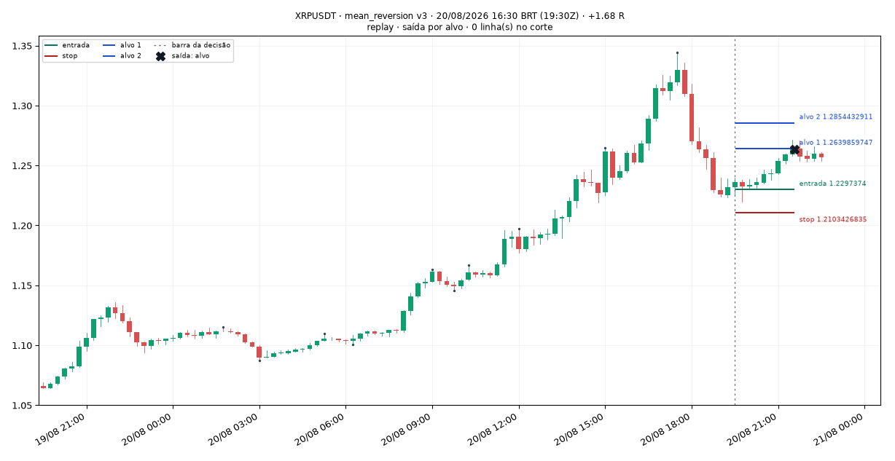

> Mean reversion 15m: fechamento 1.2318 a -1.07 desvios da média de 20 fechamentos (1.26712), dentro de tendência de alta de 1h (fechamento 1.2293 acima da SMA de 20 horas, 1.161265), fechamento acima do meio da barra (1.2313), ATR% 1.74%

### 002 — DOGEUSDT · 21/08/2026 09:00 BRT · +1.61 R

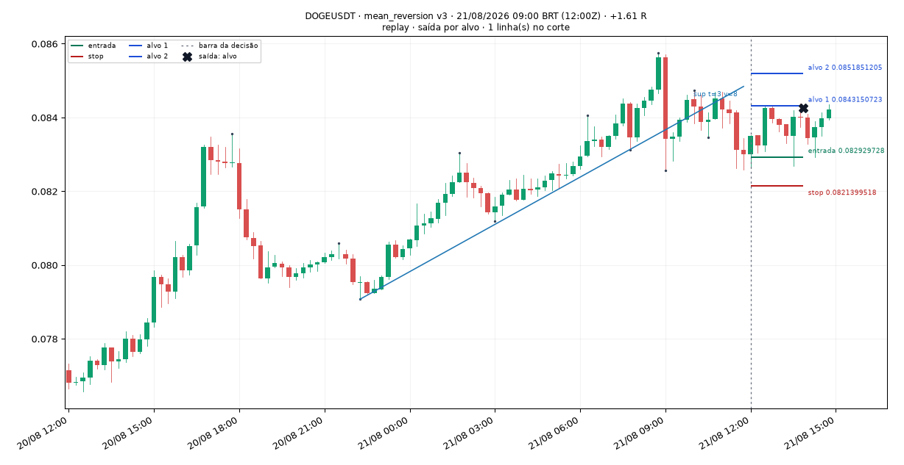

> Mean reversion 15m: fechamento 0.08301 a -1.70 desvios da média de 20 fechamentos (0.0840315), dentro de tendência de alta de 1h (fechamento 0.08301 acima da SMA de 20 horas, 0.081937), fechamento acima do meio da barra (0.083005), ATR% 1.05%

### 003 — XRPUSDT · 21/08/2026 15:00 BRT · -1.10 R

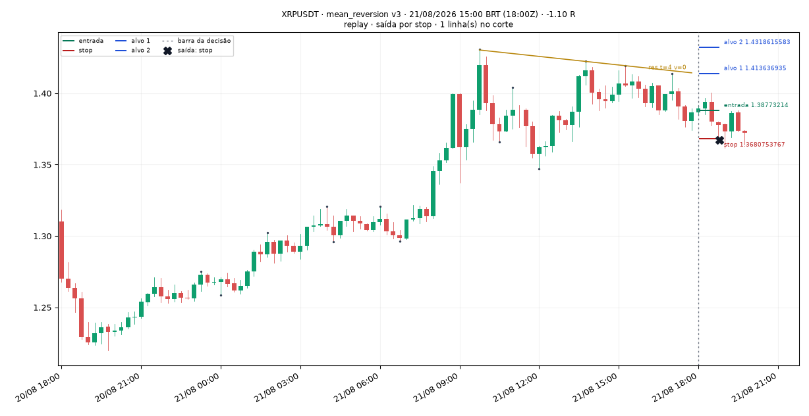

> Mean reversion 15m: fechamento 1.3863 a -1.11 desvios da média de 20 fechamentos (1.397445), dentro de tendência de alta de 1h (fechamento 1.3863 acima da SMA de 20 horas, 1.33668), fechamento acima do meio da barra (1.38185), ATR% 1.31%

### 004 — XRPUSDT · 21/08/2026 17:00 BRT · +1.69 R

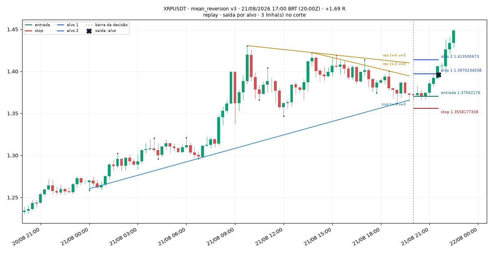

> Mean reversion 15m: fechamento 1.3723 a -1.58 desvios da média de 20 fechamentos (1.39066), dentro de tendência de alta de 1h (fechamento 1.3723 acima da SMA de 20 horas, 1.349205), fechamento acima do meio da barra (1.36895), ATR% 1.20%

### 005 — ETHUSDT · 22/08/2026 02:30 BRT · -1.19 R

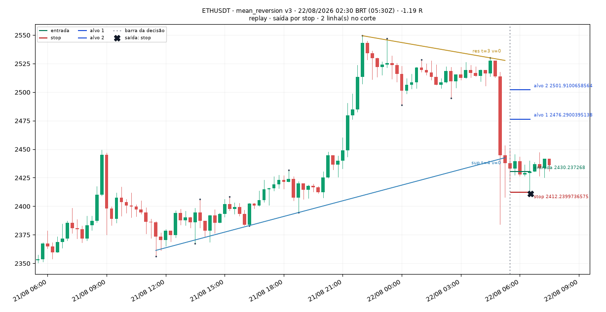

> Mean reversion 15m: fechamento 2437.86 a -3.08 desvios da média de 20 fechamentos (2508.125), dentro de tendência de alta de 1h (fechamento 2513.88 acima da SMA de 20 horas, 2444.212), fechamento acima do meio da barra (2430.56), ATR% 1.05%

### 006 — DOGEUSDT · 22/08/2026 02:30 BRT · +0.92 R

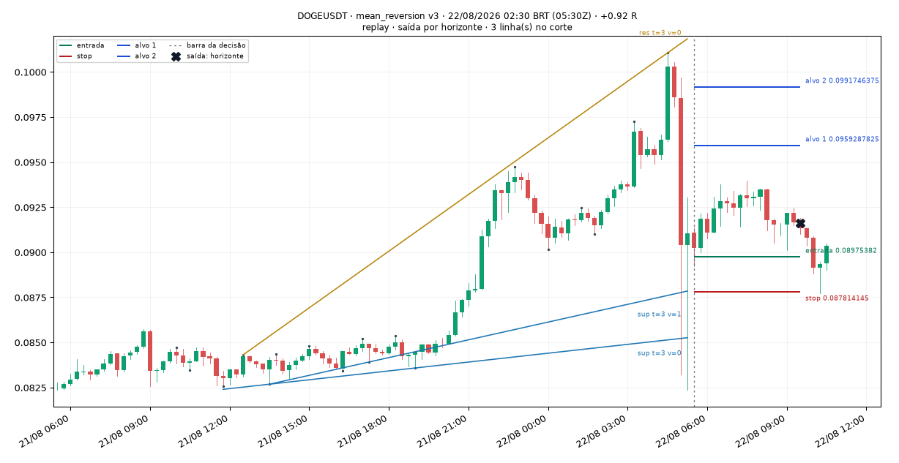

> Mean reversion 15m: fechamento 0.09106 a -1.04 desvios da média de 20 fechamentos (0.0938055), dentro de tendência de alta de 1h (fechamento 0.09858 acima da SMA de 20 horas, 0.087479), fechamento acima do meio da barra (0.08769), ATR% 3.56%

### 007 — XRPUSDT · 22/08/2026 05:45 BRT · -1.05 R

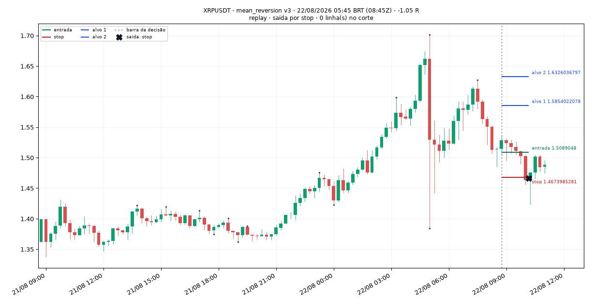

> Mean reversion 15m: fechamento 1.5146 a -1.20 desvios da média de 20 fechamentos (1.565745), dentro de tendência de alta de 1h (fechamento 1.5636 acima da SMA de 20 horas, 1.449355), fechamento acima do meio da barra (1.50095), ATR% 3.12%

### 008 — SOLUSDT · 22/08/2026 07:30 BRT · +0.90 R

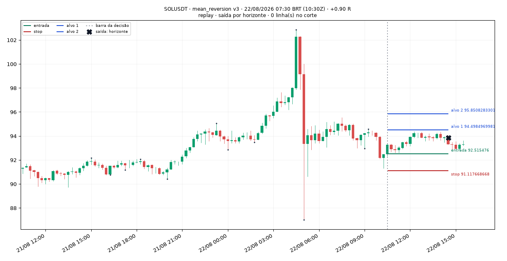

> Mean reversion 15m: fechamento 92.47 a -2.24 desvios da média de 20 fechamentos (94.0435), dentro de tendência de alta de 1h (fechamento 93.91 acima da SMA de 20 horas, 93.5025), fechamento acima do meio da barra (91.9), ATR% 1.46%

### 009 — XRPUSDT · 22/08/2026 07:30 BRT · +0.12 R

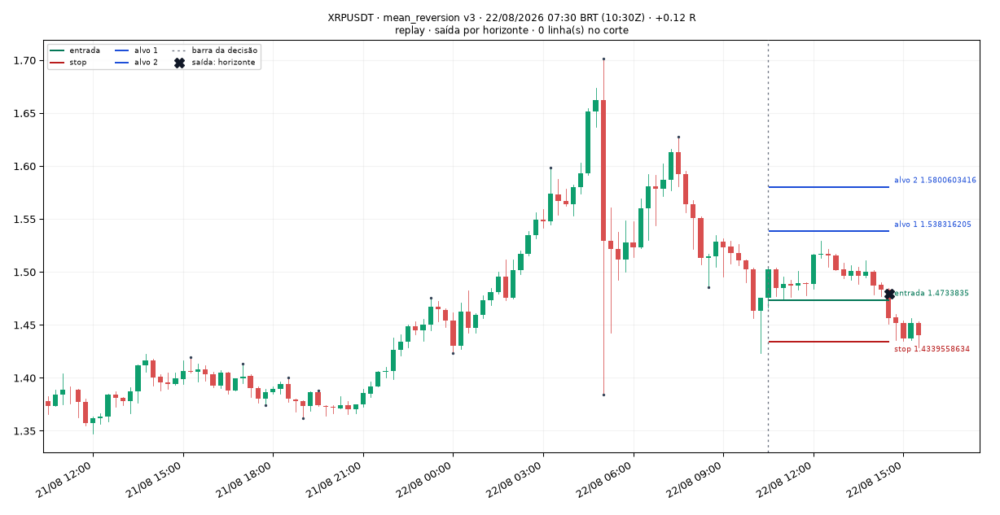

> Mean reversion 15m: fechamento 1.4757 a -1.58 desvios da média de 20 fechamentos (1.536745), dentro de tendência de alta de 1h (fechamento 1.5025 acima da SMA de 20 horas, 1.46704), fechamento acima do meio da barra (1.44955), ATR% 2.83%

### 010 — DOGEUSDT · 22/08/2026 07:30 BRT · +0.85 R

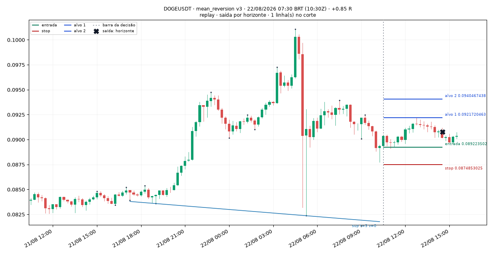

> Mean reversion 15m: fechamento 0.08936 a -2.05 desvios da média de 20 fechamentos (0.091782), dentro de tendência de alta de 1h (fechamento 0.0908 acima da SMA de 20 horas, 0.0897875), fechamento acima do meio da barra (0.088595), ATR% 2.10%

### 011 — XRPUSDT · 23/08/2026 17:15 BRT · +1.22 R

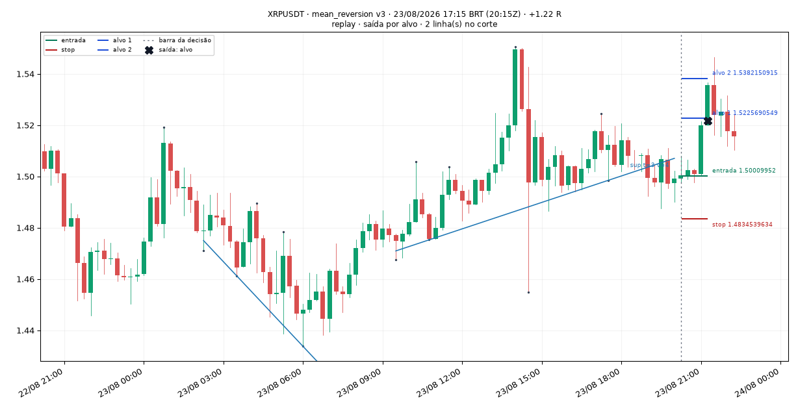

> Mean reversion 15m: fechamento 1.4991 a -1.03 desvios da média de 20 fechamentos (1.5051), dentro de tendência de alta de 1h (fechamento 1.4972 acima da SMA de 20 horas, 1.484885), fechamento acima do meio da barra (1.49615), ATR% 1.04%

### 012 — PONSUSDT · 08/09/2026 19:00 BRT · -1.05 R

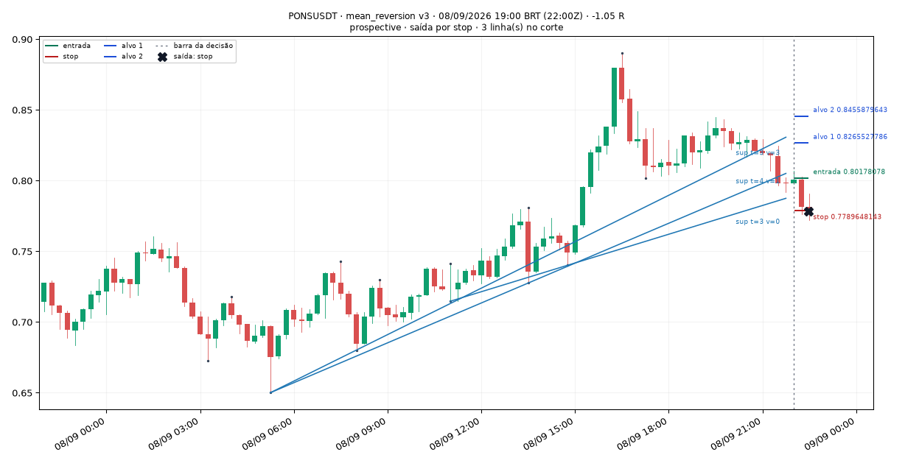

> Mean reversion 15m: fechamento 0.798 a -1.98 desvios da média de 20 fechamentos (0.819825), dentro de tendência de alta de 1h (fechamento 0.798 acima da SMA de 20 horas, 0.753225), fechamento acima do meio da barra (0.79685), ATR% 2.39%
