# momentum v6 — operações traçadas

**213 operação(ões) concluída(s)**, coorte(s) prospective, replay, expectância **-0.0794 R** por operação (média simples de `signal_outcomes.r_multiple`, líquida de custos e funding). Corte da leitura: 08/09/2026 20:15 BRT (23:15Z).

As linhas de tendência destes gráficos são traçadas pelo **mesmo código congelado**
que decide (`hunter_core.strategies.tl_scan`, parâmetros de
`trendline_breakout_v1.default_parameters`), cortado na barra da decisão: nenhuma
vela posterior à decisão participa do traçado. Para toda versão que **não é**
`trendline_breakout_v1`, elas são **contexto calculado depois** — a estratégia não
leu linha nenhuma para decidir. Ver [[Operacoes-tracadas/README]] e [[KB-0076-por-que-perdemos-2026-09-08]].

> [!info] Esta versão **não lê** linhas de tendência para decidir. As linhas abaixo são contexto, nunca entrada da decisão.

**Contrato da hipótese:** [[EXP-0013-momentum-alvo-3-atr]].

## Tabela

| # | Decisão (BRT) | UTC | Mercado | Coorte | Entrada | Stop | Alvo | Saída | R | Linhas no corte | `line_id` usado | Gráfico |
|---|---|---|---|---|---|---|---|---|---|---|---|---|
| 001 | 11/08 11:15 | 14:15Z | DOGEUSDT | replay | 0.0713127620 | 0.0707799683 | 0.0717400635 | invalidação | -1.13 | 3 | `—` | [20260811-1415Z-DOGEUSDT-invalidated.png](../../attachments/operacoes/momentum-v6/20260811-1415Z-DOGEUSDT-invalidated.png) |
| 002 | 11/08 14:00 | 17:00Z | XRPUSDT | replay | 1.0117066600 | 1.0019241336 | 1.0237517327 | invalidação | -0.43 | 4 | `—` | [20260811-1700Z-XRPUSDT-invalidated.png](../../attachments/operacoes/momentum-v6/20260811-1700Z-XRPUSDT-invalidated.png) |
| 003 | 11/08 17:00 | 20:00Z | XRPUSDT | replay | 1.0164094800 | 1.0089531839 | 1.0273936322 | horizonte | +0.57 | 1 | `—` | [20260811-2000Z-XRPUSDT-expired.png](../../attachments/operacoes/momentum-v6/20260811-2000Z-XRPUSDT-expired.png) |
| 004 | 11/08 17:00 | 20:00Z | ETHUSDT | replay | 1883.1892360000 | 1872.2057997091 | 1899.0984005817 | horizonte | -0.48 | 1 | `—` | [20260811-2000Z-ETHUSDT-expired.png](../../attachments/operacoes/momentum-v6/20260811-2000Z-ETHUSDT-expired.png) |
| 005 | 11/08 17:00 | 20:00Z | DOGEUSDT | replay | 0.0711826840 | 0.0705694960 | 0.0718910081 | alvo | +0.99 | 0 | `—` | [20260811-2000Z-DOGEUSDT-target.png](../../attachments/operacoes/momentum-v6/20260811-2000Z-DOGEUSDT-target.png) |
| 006 | 11/08 17:00 | 20:00Z | SOLUSDT | replay | 75.7954500000 | 75.2892225011 | 76.3115549979 | alvo | +0.81 | 3 | `—` | [20260811-2000Z-SOLUSDT-target.png](../../attachments/operacoes/momentum-v6/20260811-2000Z-SOLUSDT-target.png) |
| 007 | 11/08 18:45 | 21:45Z | DOGEUSDT | replay | 0.0721732780 | 0.0716043742 | 0.0732412516 | invalidação | -0.48 | 1 | `—` | [20260811-2145Z-DOGEUSDT-invalidated.png](../../attachments/operacoes/momentum-v6/20260811-2145Z-DOGEUSDT-invalidated.png) |
| 008 | 13/08 00:00 | 03:00Z | DOGEUSDT | replay | 0.0703421800 | 0.0699271034 | 0.0709257933 | horizonte | +0.48 | 1 | `—` | [20260813-0300Z-DOGEUSDT-expired.png](../../attachments/operacoes/momentum-v6/20260813-0300Z-DOGEUSDT-expired.png) |
| 009 | 16/08 22:45 | 01:45Z | SOLUSDT | replay | 75.2351140000 | 74.9021807768 | 75.9456384464 | invalidação | -0.84 | 0 | `—` | [20260817-0145Z-SOLUSDT-invalidated.png](../../attachments/operacoes/momentum-v6/20260817-0145Z-SOLUSDT-invalidated.png) |
| 010 | 16/08 23:45 | 02:45Z | SOLUSDT | replay | 75.3351740000 | 74.9900201235 | 76.0099597531 | horizonte | +0.63 | 0 | `—` | [20260817-0245Z-SOLUSDT-expired.png](../../attachments/operacoes/momentum-v6/20260817-0245Z-SOLUSDT-expired.png) |
| 011 | 18/08 12:30 | 15:30Z | SOLUSDT | replay | 77.0962300000 | 76.6325214823 | 77.7349570355 | invalidação | -0.76 | 3 | `—` | [20260818-1530Z-SOLUSDT-invalidated.png](../../attachments/operacoes/momentum-v6/20260818-1530Z-SOLUSDT-invalidated.png) |
| 012 | 19/08 10:30 | 13:30Z | SOLUSDT | replay | 78.6071360000 | 78.1149882966 | 79.1800234068 | invalidação | -0.70 | 4 | `—` | [20260819-1330Z-SOLUSDT-invalidated.png](../../attachments/operacoes/momentum-v6/20260819-1330Z-SOLUSDT-invalidated.png) |
| 013 | 19/08 11:45 | 14:45Z | SOLUSDT | replay | 79.0774180000 | 78.5599748487 | 79.8500503026 | alvo | +1.28 | 5 | `—` | [20260819-1445Z-SOLUSDT-target.png](../../attachments/operacoes/momentum-v6/20260819-1445Z-SOLUSDT-target.png) |
| 014 | 19/08 12:00 | 15:00Z | ETHUSDT | replay | 1973.8235840000 | 1958.0354670176 | 1993.5990659647 | alvo | +1.08 | 2 | `—` | [20260819-1500Z-ETHUSDT-target.png](../../attachments/operacoes/momentum-v6/20260819-1500Z-ETHUSDT-target.png) |
| 015 | 19/08 12:00 | 15:00Z | XRPUSDT | replay | 1.0320188400 | 1.0266944752 | 1.0447110496 | alvo | +2.11 | 3 | `—` | [20260819-1500Z-XRPUSDT-target.png](../../attachments/operacoes/momentum-v6/20260819-1500Z-XRPUSDT-target.png) |
| 016 | 19/08 12:15 | 15:15Z | DOGEUSDT | replay | 0.0719931700 | 0.0714729028 | 0.0726641944 | alvo | +1.09 | 3 | `—` | [20260819-1515Z-DOGEUSDT-target.png](../../attachments/operacoes/momentum-v6/20260819-1515Z-DOGEUSDT-target.png) |
| 017 | 19/08 13:15 | 16:15Z | ETHUSDT | replay | 2096.8973840000 | 2058.6828498550 | 2149.6043002899 | invalidação | -0.56 | 2 | `—` | [20260819-1615Z-ETHUSDT-invalidated.png](../../attachments/operacoes/momentum-v6/20260819-1615Z-ETHUSDT-invalidated.png) |
| 018 | 19/08 17:00 | 20:00Z | ETHUSDT | replay | 2103.4513140000 | 2080.3517788251 | 2142.2064423498 | alvo | +1.55 | 0 | `—` | [20260819-2000Z-ETHUSDT-target.png](../../attachments/operacoes/momentum-v6/20260819-2000Z-ETHUSDT-target.png) |
| 019 | 19/08 17:15 | 20:15Z | XRPUSDT | replay | 1.0757450600 | 1.0642782243 | 1.0922435514 | alvo | +1.31 | 1 | `—` | [20260819-2015Z-XRPUSDT-target.png](../../attachments/operacoes/momentum-v6/20260819-2015Z-XRPUSDT-target.png) |
| 020 | 19/08 18:00 | 21:00Z | SOLUSDT | replay | 83.8202620000 | 82.9332479105 | 85.2635041789 | alvo | +1.49 | 1 | `—` | [20260819-2100Z-SOLUSDT-target.png](../../attachments/operacoes/momentum-v6/20260819-2100Z-SOLUSDT-target.png) |
| 021 | 19/08 18:00 | 21:00Z | DOGEUSDT | replay | 0.0741644720 | 0.0735163179 | 0.0754473641 | alvo | +1.82 | 2 | `—` | [20260819-2100Z-DOGEUSDT-target.png](../../attachments/operacoes/momentum-v6/20260819-2100Z-DOGEUSDT-target.png) |
| 022 | 20/08 03:30 | 06:30Z | SOLUSDT | replay | 85.4812580000 | 84.8606704776 | 86.5986590448 | alvo | +1.59 | 1 | `—` | [20260820-0630Z-SOLUSDT-target.png](../../attachments/operacoes/momentum-v6/20260820-0630Z-SOLUSDT-target.png) |
| 023 | 20/08 05:15 | 08:15Z | ETHUSDT | replay | 2276.1548740000 | 2264.3094980876 | 2322.5110038248 | horizonte | -0.51 | 1 | `—` | [20260820-0815Z-ETHUSDT-expired.png](../../attachments/operacoes/momentum-v6/20260820-0815Z-ETHUSDT-expired.png) |
| 024 | 20/08 05:15 | 08:15Z | XRPUSDT | replay | 1.1271759000 | 1.1194504039 | 1.1462991922 | alvo | +2.27 | 2 | `—` | [20260820-0815Z-XRPUSDT-target.png](../../attachments/operacoes/momentum-v6/20260820-0815Z-XRPUSDT-target.png) |
| 025 | 20/08 05:15 | 08:15Z | DOGEUSDT | replay | 0.0763357740 | 0.0758531386 | 0.0776437227 | alvo | +2.49 | 0 | `—` | [20260820-0815Z-DOGEUSDT-target.png](../../attachments/operacoes/momentum-v6/20260820-0815Z-DOGEUSDT-target.png) |
| 026 | 20/08 08:45 | 11:45Z | DOGEUSDT | replay | 0.0776165420 | 0.0768433918 | 0.0789032165 | invalidação | -0.76 | 2 | `—` | [20260820-1145Z-DOGEUSDT-invalidated.png](../../attachments/operacoes/momentum-v6/20260820-1145Z-DOGEUSDT-invalidated.png) |
| 027 | 20/08 08:45 | 11:45Z | XRPUSDT | replay | 1.1945162800 | 1.1747554611 | 1.2171890778 | alvo | +1.06 | 2 | `—` | [20260820-1145Z-XRPUSDT-target.png](../../attachments/operacoes/momentum-v6/20260820-1145Z-XRPUSDT-target.png) |
| 028 | 20/08 10:30 | 13:30Z | DOGEUSDT | replay | 0.0774264280 | 0.0770175162 | 0.0792449677 | stop | -1.26 | 3 | `—` | [20260820-1330Z-DOGEUSDT-stop.png](../../attachments/operacoes/momentum-v6/20260820-1330Z-DOGEUSDT-stop.png) |
| 029 | 20/08 11:15 | 14:15Z | DOGEUSDT | replay | 0.0778967100 | 0.0771806809 | 0.0796386383 | invalidação | -0.50 | 2 | `—` | [20260820-1415Z-DOGEUSDT-invalidated.png](../../attachments/operacoes/momentum-v6/20260820-1415Z-DOGEUSDT-invalidated.png) |
| 030 | 20/08 12:00 | 15:00Z | DOGEUSDT | replay | 0.0784370340 | 0.0775981034 | 0.0801237932 | alvo | +1.88 | 2 | `—` | [20260820-1500Z-DOGEUSDT-target.png](../../attachments/operacoes/momentum-v6/20260820-1500Z-DOGEUSDT-target.png) |
| 031 | 20/08 12:15 | 15:15Z | XRPUSDT | replay | 1.2588548600 | 1.2384966552 | 1.3084066896 | stop | -1.09 | 1 | `—` | [20260820-1515Z-XRPUSDT-stop.png](../../attachments/operacoes/momentum-v6/20260820-1515Z-XRPUSDT-stop.png) |
| 032 | 20/08 12:30 | 15:30Z | ETHUSDT | replay | 2317.0994260000 | 2288.1535514407 | 2362.6328971186 | invalidação | -0.62 | 3 | `—` | [20260820-1530Z-ETHUSDT-invalidated.png](../../attachments/operacoes/momentum-v6/20260820-1530Z-ETHUSDT-invalidated.png) |
| 033 | 20/08 13:30 | 16:30Z | XRPUSDT | replay | 1.2667596000 | 1.2434255701 | 1.3174488598 | alvo | +2.09 | 0 | `—` | [20260820-1630Z-XRPUSDT-target.png](../../attachments/operacoes/momentum-v6/20260820-1630Z-XRPUSDT-target.png) |
| 034 | 20/08 13:30 | 16:30Z | DOGEUSDT | replay | 0.0803781980 | 0.0794437831 | 0.0826724339 | alvo | +2.33 | 2 | `—` | [20260820-1630Z-DOGEUSDT-target.png](../../attachments/operacoes/momentum-v6/20260820-1630Z-DOGEUSDT-target.png) |
| 035 | 20/08 13:45 | 16:45Z | ETHUSDT | replay | 2344.0555900000 | 2318.9518407112 | 2406.8463185776 | stop | -1.13 | 3 | `—` | [20260820-1645Z-ETHUSDT-stop.png](../../attachments/operacoes/momentum-v6/20260820-1645Z-ETHUSDT-stop.png) |
| 036 | 20/08 14:30 | 17:30Z | XRPUSDT | replay | 1.3208920600 | 1.2921540180 | 1.3744919640 | invalidação | -0.45 | 0 | `—` | [20260820-1730Z-XRPUSDT-invalidated.png](../../attachments/operacoes/momentum-v6/20260820-1730Z-XRPUSDT-invalidated.png) |
| 037 | 20/08 21:30 | 00:30Z | DOGEUSDT | replay | 0.0811686720 | 0.0801636589 | 0.0828826822 | alvo | +1.59 | 0 | `—` | [20260821-0030Z-DOGEUSDT-target.png](../../attachments/operacoes/momentum-v6/20260821-0030Z-DOGEUSDT-target.png) |
| 038 | 20/08 21:30 | 00:30Z | SOLUSDT | replay | 88.3329680000 | 87.7651674082 | 89.6096651835 | invalidação | -0.94 | 3 | `—` | [20260821-0030Z-SOLUSDT-invalidated.png](../../attachments/operacoes/momentum-v6/20260821-0030Z-SOLUSDT-invalidated.png) |
| 039 | 20/08 22:30 | 01:30Z | ETHUSDT | replay | 2351.2098800000 | 2331.2920644167 | 2394.3158711667 | invalidação | -0.49 | 3 | `—` | [20260821-0130Z-ETHUSDT-invalidated.png](../../attachments/operacoes/momentum-v6/20260821-0130Z-ETHUSDT-invalidated.png) |
| 040 | 20/08 23:00 | 02:00Z | XRPUSDT | replay | 1.2914744200 | 1.2758304495 | 1.3354391011 | invalidação | -0.36 | 0 | `—` | [20260821-0200Z-XRPUSDT-invalidated.png](../../attachments/operacoes/momentum-v6/20260821-0200Z-XRPUSDT-invalidated.png) |
| 041 | 20/08 23:00 | 02:00Z | SOLUSDT | replay | 88.8832980000 | 88.2049329367 | 90.5601341266 | alvo | +2.29 | 5 | `—` | [20260821-0200Z-SOLUSDT-target.png](../../attachments/operacoes/momentum-v6/20260821-0200Z-SOLUSDT-target.png) |
| 042 | 21/08 03:30 | 06:30Z | DOGEUSDT | replay | 0.0834200220 | 0.0824593650 | 0.0851612699 | alvo | +1.68 | 0 | `—` | [20260821-0630Z-DOGEUSDT-target.png](../../attachments/operacoes/momentum-v6/20260821-0630Z-DOGEUSDT-target.png) |
| 043 | 21/08 05:15 | 08:15Z | XRPUSDT | replay | 1.3515104200 | 1.3247486019 | 1.3870027962 | alvo | +1.25 | 2 | `—` | [20260821-0815Z-XRPUSDT-target.png](../../attachments/operacoes/momentum-v6/20260821-0815Z-XRPUSDT-target.png) |
| 044 | 21/08 05:30 | 08:30Z | ETHUSDT | replay | 2388.7724040000 | 2364.7838130006 | 2431.3723739988 | alvo | +1.63 | 2 | `—` | [20260821-0830Z-ETHUSDT-target.png](../../attachments/operacoes/momentum-v6/20260821-0830Z-ETHUSDT-target.png) |
| 045 | 21/08 05:30 | 08:30Z | SOLUSDT | replay | 91.4648460000 | 90.3918148603 | 93.3263702793 | alvo | +1.61 | 5 | `—` | [20260821-0830Z-SOLUSDT-target.png](../../attachments/operacoes/momentum-v6/20260821-0830Z-SOLUSDT-target.png) |
| 046 | 21/08 07:00 | 10:00Z | XRPUSDT | replay | 1.4177501400 | 1.3863885055 | 1.4863229890 | invalidação | -0.85 | 2 | `—` | [20260821-1000Z-XRPUSDT-invalidated.png](../../attachments/operacoes/momentum-v6/20260821-1000Z-XRPUSDT-invalidated.png) |
| 047 | 21/08 14:15 | 17:15Z | ETHUSDT | replay | 2414.0075360000 | 2390.8012660283 | 2463.2474679434 | horizonte | +1.36 | 4 | `—` | [20260821-1715Z-ETHUSDT-expired.png](../../attachments/operacoes/momentum-v6/20260821-1715Z-ETHUSDT-expired.png) |
| 048 | 21/08 17:45 | 20:45Z | DOGEUSDT | replay | 0.0866719720 | 0.0854491514 | 0.0890816972 | alvo | +1.87 | 5 | `—` | [20260821-2045Z-DOGEUSDT-target.png](../../attachments/operacoes/momentum-v6/20260821-2045Z-DOGEUSDT-target.png) |
| 049 | 21/08 18:30 | 21:30Z | SOLUSDT | replay | 92.9257220000 | 91.9029726136 | 94.5940547728 | alvo | +1.50 | 6 | `—` | [20260821-2130Z-SOLUSDT-target.png](../../attachments/operacoes/momentum-v6/20260821-2130Z-SOLUSDT-target.png) |
| 050 | 21/08 19:15 | 22:15Z | XRPUSDT | replay | 1.4257549400 | 1.4017071508 | 1.4751856985 | alvo | +1.97 | 4 | `—` | [20260821-2215Z-XRPUSDT-target.png](../../attachments/operacoes/momentum-v6/20260821-2215Z-XRPUSDT-target.png) |
| 051 | 21/08 19:45 | 22:45Z | DOGEUSDT | replay | 0.0939563400 | 0.0919630052 | 0.0977139897 | invalidação | -0.55 | 5 | `—` | [20260821-2245Z-DOGEUSDT-invalidated.png](../../attachments/operacoes/momentum-v6/20260821-2245Z-DOGEUSDT-invalidated.png) |
| 052 | 21/08 20:30 | 23:30Z | SOLUSDT | replay | 94.2265020000 | 93.3669320331 | 96.5561359339 | invalidação | -0.47 | 4 | `—` | [20260821-2330Z-SOLUSDT-invalidated.png](../../attachments/operacoes/momentum-v6/20260821-2330Z-SOLUSDT-invalidated.png) |
| 053 | 21/08 22:45 | 01:45Z | XRPUSDT | replay | 1.4997993400 | 1.4630654597 | 1.5603690805 | invalidação | -0.72 | 1 | `—` | [20260822-0145Z-XRPUSDT-invalidated.png](../../attachments/operacoes/momentum-v6/20260822-0145Z-XRPUSDT-invalidated.png) |
| 054 | 21/08 23:45 | 02:45Z | SOLUSDT | replay | 95.6073300000 | 94.5792291500 | 97.9715417000 | alvo | +2.17 | 3 | `—` | [20260822-0245Z-SOLUSDT-target.png](../../attachments/operacoes/momentum-v6/20260822-0245Z-SOLUSDT-target.png) |
| 055 | 22/08 00:30 | 03:30Z | XRPUSDT | replay | 1.5819486000 | 1.5352038705 | 1.6500922591 | alvo | +1.41 | 1 | `—` | [20260822-0330Z-XRPUSDT-target.png](../../attachments/operacoes/momentum-v6/20260822-0330Z-XRPUSDT-target.png) |
| 056 | 22/08 00:30 | 03:30Z | DOGEUSDT | replay | 0.0967680260 | 0.0948417851 | 0.1004164299 | stop | -1.07 | 3 | `—` | [20260822-0330Z-DOGEUSDT-stop.png](../../attachments/operacoes/momentum-v6/20260822-0330Z-DOGEUSDT-stop.png) |
| 057 | 22/08 01:45 | 04:45Z | DOGEUSDT | replay | 0.1002601200 | 0.0979895901 | 0.1049508197 | stop | -1.06 | 4 | `—` | [20260822-0445Z-DOGEUSDT-stop.png](../../attachments/operacoes/momentum-v6/20260822-0445Z-DOGEUSDT-stop.png) |
| 058 | 22/08 14:30 | 17:30Z | DOGEUSDT | replay | 0.0925054700 | 0.0905289779 | 0.0950620441 | alvo | +1.23 | 0 | `—` | [20260822-1730Z-DOGEUSDT-target.png](../../attachments/operacoes/momentum-v6/20260822-1730Z-DOGEUSDT-target.png) |
| 059 | 22/08 17:00 | 20:00Z | ETHUSDT | replay | 2439.9230760000 | 2425.2939482896 | 2463.9521034208 | invalidação | -0.84 | 1 | `—` | [20260822-2000Z-ETHUSDT-invalidated.png](../../attachments/operacoes/momentum-v6/20260822-2000Z-ETHUSDT-invalidated.png) |
| 060 | 22/08 21:45 | 00:45Z | SOLUSDT | replay | 96.7480140000 | 94.9756785998 | 99.0986428004 | stop | -1.08 | 0 | `—` | [20260823-0045Z-SOLUSDT-stop.png](../../attachments/operacoes/momentum-v6/20260823-0045Z-SOLUSDT-stop.png) |
| 061 | 23/08 05:45 | 08:45Z | ETHUSDT | replay | 2422.1424140000 | 2400.9591144714 | 2456.1917710572 | invalidação | -0.63 | 1 | `—` | [20260823-0845Z-ETHUSDT-invalidated.png](../../attachments/operacoes/momentum-v6/20260823-0845Z-ETHUSDT-invalidated.png) |
| 062 | 23/08 07:30 | 10:30Z | DOGEUSDT | replay | 0.0920451940 | 0.0908448472 | 0.0941303056 | alvo | +1.63 | 1 | `—` | [20260823-1030Z-DOGEUSDT-target.png](../../attachments/operacoes/momentum-v6/20260823-1030Z-DOGEUSDT-target.png) |
| 063 | 23/08 08:30 | 11:30Z | SOLUSDT | replay | 94.4566400000 | 93.4802502914 | 95.9994994171 | stop | -1.13 | 0 | `—` | [20260823-1130Z-SOLUSDT-stop.png](../../attachments/operacoes/momentum-v6/20260823-1130Z-SOLUSDT-stop.png) |
| 064 | 23/08 08:30 | 11:30Z | ETHUSDT | replay | 2429.5468540000 | 2412.0810265780 | 2456.5979468441 | alvo | +1.35 | 1 | `—` | [20260823-1130Z-ETHUSDT-target.png](../../attachments/operacoes/momentum-v6/20260823-1130Z-ETHUSDT-target.png) |
| 065 | 23/08 08:30 | 11:30Z | XRPUSDT | replay | 1.4946962800 | 1.4703774817 | 1.5373450366 | invalidação | -0.26 | 2 | `—` | [20260823-1130Z-XRPUSDT-invalidated.png](../../attachments/operacoes/momentum-v6/20260823-1130Z-XRPUSDT-invalidated.png) |
| 066 | 23/08 10:30 | 13:30Z | XRPUSDT | replay | 1.5089048000 | 1.4837700271 | 1.5468599458 | alvo | +1.42 | 3 | `—` | [20260823-1330Z-XRPUSDT-target.png](../../attachments/operacoes/momentum-v6/20260823-1330Z-XRPUSDT-target.png) |
| 067 | 23/08 18:15 | 21:15Z | SOLUSDT | replay | 95.7974440000 | 94.9634004209 | 97.0231991583 | invalidação | -0.78 | 2 | `—` | [20260823-2115Z-SOLUSDT-invalidated.png](../../attachments/operacoes/momentum-v6/20260823-2115Z-SOLUSDT-invalidated.png) |
| 068 | 23/08 18:15 | 21:15Z | ETHUSDT | replay | 2467.4796000000 | 2448.6365315917 | 2497.8769368165 | stop | -1.18 | 1 | `—` | [20260823-2115Z-ETHUSDT-stop.png](../../attachments/operacoes/momentum-v6/20260823-2115Z-ETHUSDT-stop.png) |
| 069 | 23/08 18:30 | 21:30Z | XRPUSDT | replay | 1.5377220800 | 1.5134439131 | 1.5796121738 | stop | -1.09 | 3 | `—` | [20260823-2130Z-XRPUSDT-stop.png](../../attachments/operacoes/momentum-v6/20260823-2130Z-XRPUSDT-stop.png) |
| 070 | 24/08 04:15 | 07:15Z | ETHUSDT | replay | 2467.4896060000 | 2449.5546309409 | 2509.3907381182 | invalidação | -1.07 | 5 | `—` | [20260824-0715Z-ETHUSDT-invalidated.png](../../attachments/operacoes/momentum-v6/20260824-0715Z-ETHUSDT-invalidated.png) |
| 071 | 24/08 04:15 | 07:15Z | SOLUSDT | replay | 95.2070900000 | 94.3762206593 | 97.1775586813 | stop | -1.16 | 5 | `—` | [20260824-0715Z-SOLUSDT-stop.png](../../attachments/operacoes/momentum-v6/20260824-0715Z-SOLUSDT-stop.png) |
| 072 | 24/08 04:15 | 07:15Z | XRPUSDT | replay | 1.4945962200 | 1.4744316912 | 1.5424366176 | invalidação | -1.06 | 2 | `—` | [20260824-0715Z-XRPUSDT-invalidated.png](../../attachments/operacoes/momentum-v6/20260824-0715Z-XRPUSDT-invalidated.png) |
| 073 | 24/08 07:15 | 10:15Z | ETHUSDT | replay | 2480.4273640000 | 2463.6275239880 | 2519.5249520241 | stop | -1.21 | 4 | `—` | [20260824-1015Z-ETHUSDT-stop.png](../../attachments/operacoes/momentum-v6/20260824-1015Z-ETHUSDT-stop.png) |
| 074 | 24/08 08:45 | 11:45Z | XRPUSDT | replay | 1.5056028200 | 1.4885025554 | 1.5469948892 | stop | -1.12 | 4 | `—` | [20260824-1145Z-XRPUSDT-stop.png](../../attachments/operacoes/momentum-v6/20260824-1145Z-XRPUSDT-stop.png) |
| 075 | 24/08 08:45 | 11:45Z | SOLUSDT | replay | 96.1276420000 | 95.4015734428 | 97.9468531144 | stop | -1.18 | 5 | `—` | [20260824-1145Z-SOLUSDT-stop.png](../../attachments/operacoes/momentum-v6/20260824-1145Z-SOLUSDT-stop.png) |
| 076 | 24/08 08:45 | 11:45Z | ETHUSDT | replay | 2501.0297180000 | 2484.7682428993 | 2548.2835142013 | stop | -1.21 | 5 | `—` | [20260824-1145Z-ETHUSDT-stop.png](../../attachments/operacoes/momentum-v6/20260824-1145Z-ETHUSDT-stop.png) |
| 077 | 24/08 08:45 | 11:45Z | DOGEUSDT | replay | 0.0925254820 | 0.0916891936 | 0.0947516128 | invalidação | -0.51 | 2 | `—` | [20260824-1145Z-DOGEUSDT-invalidated.png](../../attachments/operacoes/momentum-v6/20260824-1145Z-DOGEUSDT-invalidated.png) |
| 078 | 24/08 10:00 | 13:00Z | SOLUSDT | replay | 96.1976840000 | 95.1993215637 | 98.3813568726 | invalidação | -0.28 | 5 | `—` | [20260824-1300Z-SOLUSDT-invalidated.png](../../attachments/operacoes/momentum-v6/20260824-1300Z-SOLUSDT-invalidated.png) |
| 079 | 24/08 10:00 | 13:00Z | DOGEUSDT | replay | 0.0929957640 | 0.0921110748 | 0.0954678504 | invalidação | -0.76 | 5 | `—` | [20260824-1300Z-DOGEUSDT-invalidated.png](../../attachments/operacoes/momentum-v6/20260824-1300Z-DOGEUSDT-invalidated.png) |
| 080 | 24/08 10:00 | 13:00Z | XRPUSDT | replay | 1.5134075000 | 1.4957529047 | 1.5585941905 | stop | -1.12 | 4 | `—` | [20260824-1300Z-XRPUSDT-stop.png](../../attachments/operacoes/momentum-v6/20260824-1300Z-XRPUSDT-stop.png) |
| 081 | 24/08 10:00 | 13:00Z | ETHUSDT | replay | 2509.7749620000 | 2488.3442957444 | 2559.2814085112 | stop | -1.16 | 4 | `—` | [20260824-1300Z-ETHUSDT-stop.png](../../attachments/operacoes/momentum-v6/20260824-1300Z-ETHUSDT-stop.png) |
| 082 | 24/08 11:30 | 14:30Z | ETHUSDT | replay | 2522.4625700000 | 2489.6647147356 | 2569.3005705289 | invalidação | -0.35 | 3 | `—` | [20260824-1430Z-ETHUSDT-invalidated.png](../../attachments/operacoes/momentum-v6/20260824-1430Z-ETHUSDT-invalidated.png) |
| 083 | 24/08 11:45 | 14:45Z | SOLUSDT | replay | 96.4678460000 | 95.2714851417 | 98.8070297167 | invalidação | -0.44 | 4 | `—` | [20260824-1445Z-SOLUSDT-invalidated.png](../../attachments/operacoes/momentum-v6/20260824-1445Z-SOLUSDT-invalidated.png) |
| 084 | 24/08 11:45 | 14:45Z | XRPUSDT | replay | 1.5242139800 | 1.4974315195 | 1.5714369611 | invalidação | -0.61 | 4 | `—` | [20260824-1445Z-XRPUSDT-invalidated.png](../../attachments/operacoes/momentum-v6/20260824-1445Z-XRPUSDT-invalidated.png) |
| 085 | 24/08 12:30 | 15:30Z | SOLUSDT | replay | 97.2082900000 | 96.0563398928 | 99.7873202144 | invalidação | -0.80 | 4 | `—` | [20260824-1530Z-SOLUSDT-invalidated.png](../../attachments/operacoes/momentum-v6/20260824-1530Z-SOLUSDT-invalidated.png) |
| 086 | 24/08 19:45 | 22:45Z | SOLUSDT | replay | 97.8586800000 | 96.6333756881 | 99.6532486238 | invalidação | -0.47 | 6 | `—` | [20260824-2245Z-SOLUSDT-invalidated.png](../../attachments/operacoes/momentum-v6/20260824-2245Z-SOLUSDT-invalidated.png) |
| 087 | 24/08 21:15 | 00:15Z | SOLUSDT | replay | 99.8798920000 | 99.1652663521 | 103.4094672959 | horizonte | +1.83 | 6 | `—` | [20260825-0015Z-SOLUSDT-expired.png](../../attachments/operacoes/momentum-v6/20260825-0015Z-SOLUSDT-expired.png) |
| 088 | 24/08 21:45 | 00:45Z | XRPUSDT | replay | 1.5127070800 | 1.4899821824 | 1.5458356352 | alvo | +1.36 | 5 | `—` | [20260825-0045Z-XRPUSDT-target.png](../../attachments/operacoes/momentum-v6/20260825-0045Z-XRPUSDT-target.png) |
| 089 | 24/08 22:00 | 01:00Z | ETHUSDT | replay | 2495.3363040000 | 2475.7736679902 | 2525.0526640195 | invalidação | -0.56 | 2 | `—` | [20260825-0100Z-ETHUSDT-invalidated.png](../../attachments/operacoes/momentum-v6/20260825-0100Z-ETHUSDT-invalidated.png) |
| 090 | 24/08 22:00 | 01:00Z | DOGEUSDT | replay | 0.0915649060 | 0.0904456308 | 0.0933087383 | invalidação | -0.56 | 2 | `—` | [20260825-0100Z-DOGEUSDT-invalidated.png](../../attachments/operacoes/momentum-v6/20260825-0100Z-DOGEUSDT-invalidated.png) |
| 091 | 24/08 23:30 | 02:30Z | DOGEUSDT | replay | 0.0927556200 | 0.0918431774 | 0.0950736452 | stop | -1.14 | 2 | `—` | [20260825-0230Z-DOGEUSDT-stop.png](../../attachments/operacoes/momentum-v6/20260825-0230Z-DOGEUSDT-stop.png) |
| 092 | 24/08 23:30 | 02:30Z | ETHUSDT | replay | 2528.1960080000 | 2509.2044826715 | 2568.2610346569 | stop | -1.19 | 4 | `—` | [20260825-0230Z-ETHUSDT-stop.png](../../attachments/operacoes/momentum-v6/20260825-0230Z-ETHUSDT-stop.png) |
| 093 | 25/08 02:30 | 05:30Z | SOLUSDT | replay | 102.6115300000 | 101.1841426487 | 105.6717147025 | invalidação | -0.74 | 3 | `—` | [20260825-0530Z-SOLUSDT-invalidated.png](../../attachments/operacoes/momentum-v6/20260825-0530Z-SOLUSDT-invalidated.png) |
| 094 | 26/08 07:45 | 10:45Z | SOLUSDT | replay | 97.5284820000 | 96.6911190222 | 98.6677619555 | stop | -1.16 | 5 | `—` | [20260826-1045Z-SOLUSDT-stop.png](../../attachments/operacoes/momentum-v6/20260826-1045Z-SOLUSDT-stop.png) |
| 095 | 26/08 08:00 | 11:00Z | ETHUSDT | replay | 2469.1706140000 | 2454.7543847058 | 2493.5012305884 | stop | -1.24 | 2 | `—` | [20260826-1100Z-ETHUSDT-stop.png](../../attachments/operacoes/momentum-v6/20260826-1100Z-ETHUSDT-stop.png) |
| 096 | 26/08 08:00 | 11:00Z | DOGEUSDT | replay | 0.0868020500 | 0.0861763653 | 0.0880772695 | invalidação | -0.36 | 4 | `—` | [20260826-1100Z-DOGEUSDT-invalidated.png](../../attachments/operacoes/momentum-v6/20260826-1100Z-DOGEUSDT-invalidated.png) |
| 097 | 26/08 15:15 | 18:15Z | ETHUSDT | replay | 2466.6891260000 | 2449.8919302492 | 2499.3561395016 | invalidação | -0.49 | 6 | `—` | [20260826-1815Z-ETHUSDT-invalidated.png](../../attachments/operacoes/momentum-v6/20260826-1815Z-ETHUSDT-invalidated.png) |
| 098 | 26/08 16:30 | 19:30Z | ETHUSDT | replay | 2476.8051920000 | 2463.7196331660 | 2509.8907336679 | invalidação | -0.78 | 6 | `—` | [20260826-1930Z-ETHUSDT-invalidated.png](../../attachments/operacoes/momentum-v6/20260826-1930Z-ETHUSDT-invalidated.png) |
| 099 | 26/08 18:15 | 21:15Z | SOLUSDT | replay | 97.5685060000 | 96.7479246749 | 98.9441506502 | alvo | +1.51 | 5 | `—` | [20260826-2115Z-SOLUSDT-target.png](../../attachments/operacoes/momentum-v6/20260826-2115Z-SOLUSDT-target.png) |
| 100 | 26/08 18:15 | 21:15Z | ETHUSDT | replay | 2493.1750080000 | 2476.2898606195 | 2523.0002787610 | horizonte | -0.41 | 6 | `—` | [20260826-2115Z-ETHUSDT-expired.png](../../attachments/operacoes/momentum-v6/20260826-2115Z-ETHUSDT-expired.png) |
| 101 | 26/08 18:30 | 21:30Z | DOGEUSDT | replay | 0.0859615460 | 0.0853924166 | 0.0875151668 | alvo | +2.52 | 4 | `—` | [20260826-2130Z-DOGEUSDT-target.png](../../attachments/operacoes/momentum-v6/20260826-2130Z-DOGEUSDT-target.png) |
| 102 | 26/08 19:15 | 22:15Z | XRPUSDT | replay | 1.4062432400 | 1.3891476368 | 1.4322047263 | invalidação | -0.49 | 5 | `—` | [20260826-2215Z-XRPUSDT-invalidated.png](../../attachments/operacoes/momentum-v6/20260826-2215Z-XRPUSDT-invalidated.png) |
| 103 | 26/08 20:15 | 23:15Z | SOLUSDT | replay | 100.5102700000 | 99.2873450750 | 102.3853098500 | alvo | +1.42 | 5 | `—` | [20260826-2315Z-SOLUSDT-target.png](../../attachments/operacoes/momentum-v6/20260826-2315Z-SOLUSDT-target.png) |
| 104 | 27/08 03:00 | 06:00Z | SOLUSDT | replay | 101.8610800000 | 101.0297154489 | 104.0005691022 | invalidação | -0.74 | 3 | `—` | [20260827-0600Z-SOLUSDT-invalidated.png](../../attachments/operacoes/momentum-v6/20260827-0600Z-SOLUSDT-invalidated.png) |
| 105 | 27/08 05:15 | 08:15Z | XRPUSDT | replay | 1.4219526600 | 1.4133356165 | 1.4519287671 | alvo | +3.24 | 2 | `—` | [20260827-0815Z-XRPUSDT-target.png](../../attachments/operacoes/momentum-v6/20260827-0815Z-XRPUSDT-target.png) |
| 106 | 27/08 05:15 | 08:15Z | ETHUSDT | replay | 2516.1187660000 | 2505.5801171135 | 2546.1097657731 | alvo | +2.51 | 3 | `—` | [20260827-0815Z-ETHUSDT-target.png](../../attachments/operacoes/momentum-v6/20260827-0815Z-ETHUSDT-target.png) |
| 107 | 27/08 05:15 | 08:15Z | SOLUSDT | replay | 102.7816320000 | 101.9218844898 | 105.1262310205 | alvo | +2.56 | 3 | `—` | [20260827-0815Z-SOLUSDT-target.png](../../attachments/operacoes/momentum-v6/20260827-0815Z-SOLUSDT-target.png) |
| 108 | 27/08 05:15 | 08:15Z | DOGEUSDT | replay | 0.0881228420 | 0.0875731281 | 0.0896037438 | alvo | +2.47 | 3 | `—` | [20260827-0815Z-DOGEUSDT-target.png](../../attachments/operacoes/momentum-v6/20260827-0815Z-DOGEUSDT-target.png) |
| 109 | 27/08 11:00 | 14:00Z | SOLUSDT | replay | 105.9635400000 | 104.7770436528 | 108.4159126944 | alvo | +1.93 | 0 | `—` | [20260827-1400Z-SOLUSDT-target.png](../../attachments/operacoes/momentum-v6/20260827-1400Z-SOLUSDT-target.png) |
| 110 | 27/08 11:30 | 14:30Z | XRPUSDT | replay | 1.4554727600 | 1.4411644823 | 1.4937710355 | stop | -1.14 | 3 | `—` | [20260827-1430Z-XRPUSDT-stop.png](../../attachments/operacoes/momentum-v6/20260827-1430Z-XRPUSDT-stop.png) |
| 111 | 27/08 11:45 | 14:45Z | DOGEUSDT | replay | 0.0892435140 | 0.0883080531 | 0.0912238939 | invalidação | -0.44 | 3 | `—` | [20260827-1445Z-DOGEUSDT-invalidated.png](../../attachments/operacoes/momentum-v6/20260827-1445Z-DOGEUSDT-invalidated.png) |
| 112 | 27/08 13:45 | 16:45Z | DOGEUSDT | replay | 0.0897238020 | 0.0886869713 | 0.0915760574 | invalidação | -0.61 | 2 | `—` | [20260827-1645Z-DOGEUSDT-invalidated.png](../../attachments/operacoes/momentum-v6/20260827-1645Z-DOGEUSDT-invalidated.png) |
| 113 | 27/08 17:00 | 20:00Z | SOLUSDT | replay | 108.9753460000 | 107.9601237373 | 112.0697525254 | invalidação | -0.31 | 4 | `—` | [20260827-2000Z-SOLUSDT-invalidated.png](../../attachments/operacoes/momentum-v6/20260827-2000Z-SOLUSDT-invalidated.png) |
| 114 | 27/08 22:30 | 01:30Z | XRPUSDT | replay | 1.4658790000 | 1.4545578384 | 1.4918843232 | stop | -1.18 | 6 | `—` | [20260828-0130Z-XRPUSDT-stop.png](../../attachments/operacoes/momentum-v6/20260828-0130Z-XRPUSDT-stop.png) |
| 115 | 27/08 22:30 | 01:30Z | DOGEUSDT | replay | 0.0898838980 | 0.0892318087 | 0.0912063826 | stop | -1.19 | 5 | `—` | [20260828-0130Z-DOGEUSDT-stop.png](../../attachments/operacoes/momentum-v6/20260828-0130Z-DOGEUSDT-stop.png) |
| 116 | 28/08 08:15 | 11:15Z | XRPUSDT | replay | 1.4296572800 | 1.4186630571 | 1.4463738859 | invalidação | -0.59 | 3 | `—` | [20260828-1115Z-XRPUSDT-invalidated.png](../../attachments/operacoes/momentum-v6/20260828-1115Z-XRPUSDT-invalidated.png) |
| 117 | 28/08 11:45 | 14:45Z | DOGEUSDT | replay | 0.0875825180 | 0.0866838423 | 0.0894023154 | invalidação | -0.87 | 2 | `—` | [20260828-1445Z-DOGEUSDT-invalidated.png](../../attachments/operacoes/momentum-v6/20260828-1445Z-DOGEUSDT-invalidated.png) |
| 118 | 28/08 11:45 | 14:45Z | ETHUSDT | replay | 2507.3334980000 | 2487.0035398351 | 2552.4829203298 | invalidação | -0.42 | 5 | `—` | [20260828-1445Z-ETHUSDT-invalidated.png](../../attachments/operacoes/momentum-v6/20260828-1445Z-ETHUSDT-invalidated.png) |
| 119 | 28/08 12:00 | 15:00Z | XRPUSDT | replay | 1.4335596200 | 1.4123402177 | 1.4665195646 | invalidação | -0.75 | 3 | `—` | [20260828-1500Z-XRPUSDT-invalidated.png](../../attachments/operacoes/momentum-v6/20260828-1500Z-XRPUSDT-invalidated.png) |
| 120 | 28/08 12:30 | 15:30Z | SOLUSDT | replay | 106.5939180000 | 105.0953792254 | 109.9092415491 | invalidação | -0.76 | 5 | `—` | [20260828-1530Z-SOLUSDT-invalidated.png](../../attachments/operacoes/momentum-v6/20260828-1530Z-SOLUSDT-invalidated.png) |
| 121 | 29/08 11:45 | 14:45Z | SOLUSDT | replay | 105.0129700000 | 104.4060338660 | 105.9479322679 | stop | -1.24 | 5 | `—` | [20260829-1445Z-SOLUSDT-stop.png](../../attachments/operacoes/momentum-v6/20260829-1445Z-SOLUSDT-stop.png) |
| 122 | 29/08 16:30 | 19:30Z | SOLUSDT | replay | 105.7534140000 | 105.1147493496 | 106.8105013008 | invalidação | -0.97 | 2 | `—` | [20260829-1930Z-SOLUSDT-invalidated.png](../../attachments/operacoes/momentum-v6/20260829-1930Z-SOLUSDT-invalidated.png) |
| 123 | 30/08 10:00 | 13:00Z | SOLUSDT | replay | 106.0836120000 | 105.4971837520 | 107.1256324961 | alvo | +1.52 | 4 | `—` | [20260830-1300Z-SOLUSDT-target.png](../../attachments/operacoes/momentum-v6/20260830-1300Z-SOLUSDT-target.png) |
| 124 | 30/08 10:00 | 13:00Z | DOGEUSDT | replay | 0.0853311680 | 0.0850000011 | 0.0861699978 | invalidação | -0.67 | 6 | `—` | [20260830-1300Z-DOGEUSDT-invalidated.png](../../attachments/operacoes/momentum-v6/20260830-1300Z-DOGEUSDT-invalidated.png) |
| 125 | 30/08 11:00 | 14:00Z | XRPUSDT | replay | 1.4071437800 | 1.4007125239 | 1.4225749521 | stop | -1.31 | 1 | `—` | [20260830-1400Z-XRPUSDT-stop.png](../../attachments/operacoes/momentum-v6/20260830-1400Z-XRPUSDT-stop.png) |
| 126 | 30/08 11:00 | 14:00Z | DOGEUSDT | replay | 0.0856513600 | 0.0852741601 | 0.0864316798 | invalidação | -0.90 | 6 | `—` | [20260830-1400Z-DOGEUSDT-invalidated.png](../../attachments/operacoes/momentum-v6/20260830-1400Z-DOGEUSDT-invalidated.png) |
| 127 | 30/08 13:15 | 16:15Z | ETHUSDT | replay | 2515.9386580000 | 2496.9930200154 | 2534.6039599691 | stop | -1.18 | 3 | `—` | [20260830-1615Z-ETHUSDT-stop.png](../../attachments/operacoes/momentum-v6/20260830-1615Z-ETHUSDT-stop.png) |
| 128 | 30/08 13:15 | 16:15Z | DOGEUSDT | replay | 0.0859715520 | 0.0853925138 | 0.0867049724 | stop | -1.21 | 3 | `—` | [20260830-1615Z-DOGEUSDT-stop.png](../../attachments/operacoes/momentum-v6/20260830-1615Z-DOGEUSDT-stop.png) |
| 129 | 30/08 13:45 | 16:45Z | XRPUSDT | replay | 1.4125470200 | 1.4024132978 | 1.4278734043 | alvo | +1.32 | 2 | `—` | [20260830-1645Z-XRPUSDT-target.png](../../attachments/operacoes/momentum-v6/20260830-1645Z-XRPUSDT-target.png) |
| 130 | 30/08 15:45 | 18:45Z | DOGEUSDT | replay | 0.0863717920 | 0.0857821053 | 0.0875157893 | invalidação | -0.29 | 3 | `—` | [20260830-1845Z-DOGEUSDT-invalidated.png](../../attachments/operacoes/momentum-v6/20260830-1845Z-DOGEUSDT-invalidated.png) |
| 131 | 31/08 02:30 | 05:30Z | ETHUSDT | replay | 2436.4509940000 | 2417.4424991263 | 2468.1650017475 | horizonte | +0.37 | 4 | `—` | [20260831-0530Z-ETHUSDT-expired.png](../../attachments/operacoes/momentum-v6/20260831-0530Z-ETHUSDT-expired.png) |
| 132 | 31/08 02:30 | 05:30Z | SOLUSDT | replay | 102.7516140000 | 101.6628546517 | 104.5642906966 | horizonte | +0.24 | 2 | `—` | [20260831-0530Z-SOLUSDT-expired.png](../../attachments/operacoes/momentum-v6/20260831-0530Z-SOLUSDT-expired.png) |
| 133 | 31/08 02:30 | 05:30Z | DOGEUSDT | replay | 0.0829097160 | 0.0821758806 | 0.0842882388 | horizonte | -0.18 | 1 | `—` | [20260831-0530Z-DOGEUSDT-expired.png](../../attachments/operacoes/momentum-v6/20260831-0530Z-DOGEUSDT-expired.png) |
| 134 | 31/08 08:00 | 11:00Z | SOLUSDT | replay | 103.6321420000 | 102.8956290775 | 105.0687418450 | stop | -1.20 | 2 | `—` | [20260831-1100Z-SOLUSDT-stop.png](../../attachments/operacoes/momentum-v6/20260831-1100Z-SOLUSDT-stop.png) |
| 135 | 31/08 11:45 | 14:45Z | ETHUSDT | replay | 2465.7685740000 | 2447.5817925159 | 2498.3664149681 | horizonte | +0.71 | 4 | `—` | [20260831-1445Z-ETHUSDT-expired.png](../../attachments/operacoes/momentum-v6/20260831-1445Z-ETHUSDT-expired.png) |
| 136 | 31/08 15:30 | 18:30Z | SOLUSDT | replay | 103.8022440000 | 102.9125724980 | 105.3648550040 | invalidação | -0.35 | 6 | `—` | [20260831-1830Z-SOLUSDT-invalidated.png](../../attachments/operacoes/momentum-v6/20260831-1830Z-SOLUSDT-invalidated.png) |
| 137 | 01/09 00:45 | 03:45Z | XRPUSDT | replay | 1.3895332200 | 1.3815197754 | 1.4075604492 | invalidação | -0.66 | 4 | `—` | [20260901-0345Z-XRPUSDT-invalidated.png](../../attachments/operacoes/momentum-v6/20260901-0345Z-XRPUSDT-invalidated.png) |
| 138 | 01/09 00:45 | 03:45Z | SOLUSDT | replay | 103.8022440000 | 103.2704092219 | 105.0391815562 | invalidação | -1.18 | 3 | `—` | [20260901-0345Z-SOLUSDT-invalidated.png](../../attachments/operacoes/momentum-v6/20260901-0345Z-SOLUSDT-invalidated.png) |
| 139 | 01/09 00:45 | 03:45Z | DOGEUSDT | replay | 0.0832799380 | 0.0828992836 | 0.0841914328 | horizonte | -0.59 | 5 | `—` | [20260901-0345Z-DOGEUSDT-expired.png](../../attachments/operacoes/momentum-v6/20260901-0345Z-DOGEUSDT-expired.png) |
| 140 | 01/09 00:45 | 03:45Z | ETHUSDT | replay | 2476.3849400000 | 2464.1630094809 | 2498.7439810383 | invalidação | -0.69 | 5 | `—` | [20260901-0345Z-ETHUSDT-invalidated.png](../../attachments/operacoes/momentum-v6/20260901-0345Z-ETHUSDT-invalidated.png) |
| 141 | 01/09 03:00 | 06:00Z | XRPUSDT | replay | 1.3950365200 | 1.3855327724 | 1.4115344553 | invalidação | -0.69 | 4 | `—` | [20260901-0600Z-XRPUSDT-invalidated.png](../../attachments/operacoes/momentum-v6/20260901-0600Z-XRPUSDT-invalidated.png) |
| 142 | 01/09 20:45 | 23:45Z | ETHUSDT | replay | 2422.2624860000 | 2407.9359864378 | 2450.3980271244 | invalidação | -0.57 | 6 | `—` | [20260901-2345Z-ETHUSDT-invalidated.png](../../attachments/operacoes/momentum-v6/20260901-2345Z-ETHUSDT-invalidated.png) |
| 143 | 02/09 00:30 | 03:30Z | XRPUSDT | replay | 1.3541119800 | 1.3436302495 | 1.3768395010 | invalidação | -0.53 | 5 | `—` | [20260902-0330Z-XRPUSDT-invalidated.png](../../attachments/operacoes/momentum-v6/20260902-0330Z-XRPUSDT-invalidated.png) |
| 144 | 02/09 10:45 | 13:45Z | XRPUSDT | replay | 1.3451065800 | 1.3333593998 | 1.3688812003 | stop | -1.16 | 6 | `—` | [20260902-1345Z-XRPUSDT-stop.png](../../attachments/operacoes/momentum-v6/20260902-1345Z-XRPUSDT-stop.png) |
| 145 | 02/09 10:45 | 13:45Z | DOGEUSDT | replay | 0.0819591460 | 0.0813691773 | 0.0832016454 | stop | -1.19 | 1 | `—` | [20260902-1345Z-DOGEUSDT-stop.png](../../attachments/operacoes/momentum-v6/20260902-1345Z-DOGEUSDT-stop.png) |
| 146 | 02/09 10:45 | 13:45Z | SOLUSDT | replay | 99.5496940000 | 98.7562347368 | 101.3475305264 | invalidação | -0.65 | 4 | `—` | [20260902-1345Z-SOLUSDT-invalidated.png](../../attachments/operacoes/momentum-v6/20260902-1345Z-SOLUSDT-invalidated.png) |
| 147 | 02/09 10:45 | 13:45Z | ETHUSDT | replay | 2417.3895640000 | 2399.4169277477 | 2449.5261445045 | stop | -1.19 | 2 | `—` | [20260902-1345Z-ETHUSDT-stop.png](../../attachments/operacoes/momentum-v6/20260902-1345Z-ETHUSDT-stop.png) |
| 148 | 02/09 17:15 | 20:15Z | XRPUSDT | replay | 1.3492090400 | 1.3390829025 | 1.3688341950 | invalidação | -0.69 | 2 | `—` | [20260902-2015Z-XRPUSDT-invalidated.png](../../attachments/operacoes/momentum-v6/20260902-2015Z-XRPUSDT-invalidated.png) |
| 149 | 02/09 17:15 | 20:15Z | SOLUSDT | replay | 99.5296820000 | 98.9006936668 | 100.9986126664 | invalidação | -0.27 | 2 | `—` | [20260902-2015Z-SOLUSDT-invalidated.png](../../attachments/operacoes/momentum-v6/20260902-2015Z-SOLUSDT-invalidated.png) |
| 150 | 02/09 21:00 | 00:00Z | SOLUSDT | replay | 100.4102100000 | 99.7488812613 | 101.6422374774 | stop | -1.21 | 5 | `—` | [20260903-0000Z-SOLUSDT-stop.png](../../attachments/operacoes/momentum-v6/20260903-0000Z-SOLUSDT-stop.png) |
| 151 | 02/09 22:15 | 01:15Z | XRPUSDT | replay | 1.3574139600 | 1.3481339078 | 1.3777321844 | horizonte | +0.47 | 2 | `—` | [20260903-0115Z-XRPUSDT-expired.png](../../attachments/operacoes/momentum-v6/20260903-0115Z-XRPUSDT-expired.png) |
| 152 | 02/09 22:15 | 01:15Z | DOGEUSDT | replay | 0.0820492000 | 0.0814751478 | 0.0831697043 | alvo | +1.75 | 3 | `—` | [20260903-0115Z-DOGEUSDT-target.png](../../attachments/operacoes/momentum-v6/20260903-0115Z-DOGEUSDT-target.png) |
| 153 | 02/09 23:45 | 02:45Z | SOLUSDT | replay | 100.7604200000 | 100.0015781783 | 102.1268436434 | invalidação | -0.77 | 4 | `—` | [20260903-0245Z-SOLUSDT-invalidated.png](../../attachments/operacoes/momentum-v6/20260903-0245Z-SOLUSDT-invalidated.png) |
| 154 | 02/09 23:45 | 02:45Z | ETHUSDT | replay | 2404.5718780000 | 2391.2482704883 | 2429.7134590235 | stop | -1.25 | 3 | `—` | [20260903-0245Z-ETHUSDT-stop.png](../../attachments/operacoes/momentum-v6/20260903-0245Z-ETHUSDT-stop.png) |
| 155 | 03/09 04:15 | 07:15Z | ETHUSDT | replay | 2410.4454000000 | 2398.9038773829 | 2437.6522452341 | invalidação | -0.60 | 5 | `—` | [20260903-0715Z-ETHUSDT-invalidated.png](../../attachments/operacoes/momentum-v6/20260903-0715Z-ETHUSDT-invalidated.png) |
| 156 | 03/09 04:15 | 07:15Z | SOLUSDT | replay | 101.0706060000 | 100.4116821280 | 102.5666357440 | invalidação | -0.61 | 3 | `—` | [20260903-0715Z-SOLUSDT-invalidated.png](../../attachments/operacoes/momentum-v6/20260903-0715Z-SOLUSDT-invalidated.png) |
| 157 | 03/09 04:15 | 07:15Z | DOGEUSDT | replay | 0.0834300280 | 0.0828711166 | 0.0846377668 | invalidação | -0.76 | 2 | `—` | [20260903-0715Z-DOGEUSDT-invalidated.png](../../attachments/operacoes/momentum-v6/20260903-0715Z-DOGEUSDT-invalidated.png) |
| 158 | 03/09 04:15 | 07:15Z | XRPUSDT | replay | 1.3709220600 | 1.3613103785 | 1.3936792429 | invalidação | -0.38 | 2 | `—` | [20260903-0715Z-XRPUSDT-invalidated.png](../../attachments/operacoes/momentum-v6/20260903-0715Z-XRPUSDT-invalidated.png) |
| 159 | 03/09 05:15 | 08:15Z | XRPUSDT | replay | 1.3733235000 | 1.3618990179 | 1.3970019641 | invalidação | -0.43 | 3 | `—` | [20260903-0815Z-XRPUSDT-invalidated.png](../../attachments/operacoes/momentum-v6/20260903-0815Z-XRPUSDT-invalidated.png) |
| 160 | 03/09 09:45 | 12:45Z | ETHUSDT | replay | 2413.8774580000 | 2400.3796398511 | 2436.5907202979 | alvo | +1.43 | 5 | `—` | [20260903-1245Z-ETHUSDT-target.png](../../attachments/operacoes/momentum-v6/20260903-1245Z-ETHUSDT-target.png) |
| 161 | 03/09 09:45 | 12:45Z | SOLUSDT | replay | 101.0005640000 | 100.2956341253 | 102.2287317494 | alvo | +1.54 | 4 | `—` | [20260903-1245Z-SOLUSDT-target.png](../../attachments/operacoes/momentum-v6/20260903-1245Z-SOLUSDT-target.png) |
| 162 | 03/09 09:45 | 12:45Z | XRPUSDT | replay | 1.3763253000 | 1.3653146700 | 1.3940706600 | alvo | +1.44 | 2 | `—` | [20260903-1245Z-XRPUSDT-target.png](../../attachments/operacoes/momentum-v6/20260903-1245Z-XRPUSDT-target.png) |
| 163 | 03/09 10:00 | 13:00Z | DOGEUSDT | replay | 0.0834400340 | 0.0830816625 | 0.0846966751 | alvo | +3.18 | 2 | `—` | [20260903-1300Z-DOGEUSDT-target.png](../../attachments/operacoes/momentum-v6/20260903-1300Z-DOGEUSDT-target.png) |
| 164 | 03/09 11:30 | 14:30Z | XRPUSDT | replay | 1.4081443800 | 1.3940255673 | 1.4323488654 | alvo | +1.57 | 2 | `—` | [20260903-1430Z-XRPUSDT-target.png](../../attachments/operacoes/momentum-v6/20260903-1430Z-XRPUSDT-target.png) |
| 165 | 03/09 12:30 | 15:30Z | ETHUSDT | replay | 2490.9836940000 | 2469.9953120737 | 2528.2993758525 | invalidação | -0.31 | 3 | `—` | [20260903-1530Z-ETHUSDT-invalidated.png](../../attachments/operacoes/momentum-v6/20260903-1530Z-ETHUSDT-invalidated.png) |
| 166 | 03/09 13:00 | 16:00Z | SOLUSDT | replay | 104.9629400000 | 103.9883025250 | 107.4433949499 | invalidação | -0.90 | 3 | `—` | [20260903-1600Z-SOLUSDT-invalidated.png](../../attachments/operacoes/momentum-v6/20260903-1600Z-SOLUSDT-invalidated.png) |
| 167 | 03/09 13:00 | 16:00Z | XRPUSDT | replay | 1.4616764800 | 1.4440597135 | 1.5041805729 | stop | -1.12 | 3 | `—` | [20260903-1600Z-XRPUSDT-stop.png](../../attachments/operacoes/momentum-v6/20260903-1600Z-XRPUSDT-stop.png) |
| 168 | 03/09 13:00 | 16:00Z | DOGEUSDT | replay | 0.0893035500 | 0.0880080417 | 0.0915539166 | horizonte | -0.37 | 1 | `—` | [20260903-1600Z-DOGEUSDT-expired.png](../../attachments/operacoes/momentum-v6/20260903-1600Z-DOGEUSDT-expired.png) |
| 169 | 03/09 15:15 | 18:15Z | XRPUSDT | replay | 1.4687807400 | 1.4490610261 | 1.5034779478 | invalidação | -0.57 | 2 | `—` | [20260903-1815Z-XRPUSDT-invalidated.png](../../attachments/operacoes/momentum-v6/20260903-1815Z-XRPUSDT-invalidated.png) |
| 170 | 03/09 17:00 | 20:00Z | XRPUSDT | replay | 1.4643781000 | 1.4542872038 | 1.5041255924 | invalidação | +0.08 | 1 | `—` | [20260903-2000Z-XRPUSDT-invalidated.png](../../attachments/operacoes/momentum-v6/20260903-2000Z-XRPUSDT-invalidated.png) |
| 171 | 04/09 00:15 | 03:15Z | ETHUSDT | replay | 2511.4459640000 | 2496.7430412626 | 2537.1139174748 | invalidação | -0.58 | 1 | `—` | [20260904-0315Z-ETHUSDT-invalidated.png](../../attachments/operacoes/momentum-v6/20260904-0315Z-ETHUSDT-invalidated.png) |
| 172 | 04/09 01:30 | 04:30Z | ETHUSDT | replay | 2521.3418980000 | 2509.9041771386 | 2548.4116457228 | stop | -1.31 | 3 | `—` | [20260904-0430Z-ETHUSDT-stop.png](../../attachments/operacoes/momentum-v6/20260904-0430Z-ETHUSDT-stop.png) |
| 173 | 04/09 06:00 | 09:00Z | SOLUSDT | replay | 104.3925980000 | 103.7222709952 | 105.5154580096 | invalidação | -0.55 | 4 | `—` | [20260904-0900Z-SOLUSDT-invalidated.png](../../attachments/operacoes/momentum-v6/20260904-0900Z-SOLUSDT-invalidated.png) |
| 174 | 04/09 06:00 | 09:00Z | ETHUSDT | replay | 2527.5055940000 | 2512.9575104863 | 2553.3749790274 | invalidação | -0.66 | 5 | `—` | [20260904-0900Z-ETHUSDT-invalidated.png](../../attachments/operacoes/momentum-v6/20260904-0900Z-ETHUSDT-invalidated.png) |
| 175 | 04/09 06:00 | 09:00Z | DOGEUSDT | replay | 0.0876025300 | 0.0870584804 | 0.0887430392 | invalidação | -0.51 | 2 | `—` | [20260904-0900Z-DOGEUSDT-invalidated.png](../../attachments/operacoes/momentum-v6/20260904-0900Z-DOGEUSDT-invalidated.png) |
| 176 | 05/09 03:45 | 06:45Z | DOGEUSDT | replay | 0.0855212820 | 0.0850036794 | 0.0861926412 | alvo | +1.05 | 5 | `—` | [20260905-0645Z-DOGEUSDT-target.png](../../attachments/operacoes/momentum-v6/20260905-0645Z-DOGEUSDT-target.png) |
| 177 | 05/09 09:45 | 12:45Z | DOGEUSDT | replay | 0.0873323680 | 0.0867918839 | 0.0883462321 | horizonte | +0.05 | 0 | `—` | [20260905-1245Z-DOGEUSDT-expired.png](../../attachments/operacoes/momentum-v6/20260905-1245Z-DOGEUSDT-expired.png) |
| 178 | 05/09 11:45 | 14:45Z | XRPUSDT | replay | 1.4172498400 | 1.4097807721 | 1.4293384558 | invalidação | -0.77 | 6 | `—` | [20260905-1445Z-XRPUSDT-invalidated.png](../../attachments/operacoes/momentum-v6/20260905-1445Z-XRPUSDT-invalidated.png) |
| 179 | 05/09 14:15 | 17:15Z | SOLUSDT | replay | 103.8122500000 | 103.5109362882 | 104.9481274236 | stop | -1.48 | 4 | `—` | [20260905-1715Z-SOLUSDT-stop.png](../../attachments/operacoes/momentum-v6/20260905-1715Z-SOLUSDT-stop.png) |
| 180 | 05/09 14:15 | 17:15Z | XRPUSDT | replay | 1.4190509200 | 1.4144836421 | 1.4346327159 | stop | -1.43 | 6 | `—` | [20260905-1715Z-XRPUSDT-stop.png](../../attachments/operacoes/momentum-v6/20260905-1715Z-XRPUSDT-stop.png) |
| 181 | 05/09 15:00 | 18:00Z | DOGEUSDT | replay | 0.0936061300 | 0.0927487306 | 0.0971025389 | stop | -1.15 | 1 | `—` | [20260905-1800Z-DOGEUSDT-stop.png](../../attachments/operacoes/momentum-v6/20260905-1800Z-DOGEUSDT-stop.png) |
| 182 | 05/09 23:00 | 02:00Z | SOLUSDT | replay | 104.1624600000 | 103.4969316511 | 104.9761366978 | alvo | +1.00 | 3 | `—` | [20260906-0200Z-SOLUSDT-target.png](../../attachments/operacoes/momentum-v6/20260906-0200Z-SOLUSDT-target.png) |
| 183 | 06/09 00:45 | 03:45Z | XRPUSDT | replay | 1.4291569800 | 1.4204217776 | 1.4425564447 | stop | -1.23 | 3 | `—` | [20260906-0345Z-XRPUSDT-stop.png](../../attachments/operacoes/momentum-v6/20260906-0345Z-XRPUSDT-stop.png) |
| 184 | 06/09 00:45 | 03:45Z | DOGEUSDT | replay | 0.0915749120 | 0.0908575398 | 0.0930849204 | stop | -1.18 | 2 | `—` | [20260906-0345Z-DOGEUSDT-stop.png](../../attachments/operacoes/momentum-v6/20260906-0345Z-DOGEUSDT-stop.png) |
| 185 | 06/09 06:30 | 09:30Z | SOLUSDT | replay | 107.2142900000 | 106.1281590707 | 108.5636818586 | invalidação | -0.99 | 2 | `—` | [20260906-0930Z-SOLUSDT-invalidated.png](../../attachments/operacoes/momentum-v6/20260906-0930Z-SOLUSDT-invalidated.png) |
| 186 | 06/09 09:45 | 12:45Z | SOLUSDT | replay | 107.0241760000 | 106.2583032212 | 108.3333935577 | invalidação | -0.53 | 0 | `—` | [20260906-1245Z-SOLUSDT-invalidated.png](../../attachments/operacoes/momentum-v6/20260906-1245Z-SOLUSDT-invalidated.png) |
| 187 | 06/09 11:00 | 14:00Z | SOLUSDT | replay | 106.9841520000 | 106.2413290621 | 108.6073418758 | invalidação | -1.04 | 1 | `—` | [20260906-1400Z-SOLUSDT-invalidated.png](../../attachments/operacoes/momentum-v6/20260906-1400Z-SOLUSDT-invalidated.png) |
| 188 | 06/09 17:30 | 20:30Z | DOGEUSDT | replay | 0.0899839580 | 0.0894269603 | 0.0909060794 | alvo | +1.43 | 1 | `—` | [20260906-2030Z-DOGEUSDT-target.png](../../attachments/operacoes/momentum-v6/20260906-2030Z-DOGEUSDT-target.png) |
| 189 | 06/09 23:45 | 02:45Z | SOLUSDT | replay | 106.7039840000 | 105.8733261238 | 108.4133477524 | stop | -1.18 | 3 | `—` | [20260907-0245Z-SOLUSDT-stop.png](../../attachments/operacoes/momentum-v6/20260907-0245Z-SOLUSDT-stop.png) |
| 190 | 06/09 23:45 | 02:45Z | ETHUSDT | replay | 2526.5250060000 | 2511.5648819304 | 2555.6502361391 | stop | -1.24 | 3 | `—` | [20260907-0245Z-ETHUSDT-stop.png](../../attachments/operacoes/momentum-v6/20260907-0245Z-ETHUSDT-stop.png) |
| 191 | 07/09 09:30 | 12:30Z | DOGEUSDT | replay | 0.0904342280 | 0.0898153757 | 0.0915392486 | alvo | +1.58 | 5 | `—` | [20260907-1230Z-DOGEUSDT-target.png](../../attachments/operacoes/momentum-v6/20260907-1230Z-DOGEUSDT-target.png) |
| 192 | 07/09 10:00 | 13:00Z | XRPUSDT | replay | 1.4124469600 | 1.4043737958 | 1.4260524084 | stop | -1.24 | 2 | `—` | [20260907-1300Z-XRPUSDT-stop.png](../../attachments/operacoes/momentum-v6/20260907-1300Z-XRPUSDT-stop.png) |
| 193 | 07/09 10:00 | 13:00Z | SOLUSDT | replay | 105.7434080000 | 105.1357063145 | 106.7685873710 | stop | -1.24 | 4 | `—` | [20260907-1300Z-SOLUSDT-stop.png](../../attachments/operacoes/momentum-v6/20260907-1300Z-SOLUSDT-stop.png) |
| 194 | 07/09 10:30 | 13:30Z | DOGEUSDT | replay | 0.0915248820 | 0.0909450094 | 0.0930299812 | stop | -1.22 | 5 | `—` | [20260907-1330Z-DOGEUSDT-stop.png](../../attachments/operacoes/momentum-v6/20260907-1330Z-DOGEUSDT-stop.png) |
| 195 | 07/09 20:15 | 23:15Z | DOGEUSDT | replay | 0.0907043900 | 0.0901070294 | 0.0922159412 | invalidação | -0.76 | 1 | `—` | [20260907-2315Z-DOGEUSDT-invalidated.png](../../attachments/operacoes/momentum-v6/20260907-2315Z-DOGEUSDT-invalidated.png) |
| 196 | 08/09 16:15 | 19:15Z | DOGSUSDT | prospective | 0.0000572743 | 0.0000539866 | 0.0000642868 | invalidação | -0.31 | 0 | `—` | [20260908-1915Z-DOGSUSDT-invalidated.png](../../attachments/operacoes/momentum-v6/20260908-1915Z-DOGSUSDT-invalidated.png) |
| 197 | 08/09 16:15 | 19:15Z | EGLDUSDT | prospective | 4.7878710000 | 4.7441005953 | 4.9267988094 | alvo | +3.02 | 6 | `—` | [20260908-1915Z-EGLDUSDT-target.png](../../attachments/operacoes/momentum-v6/20260908-1915Z-EGLDUSDT-target.png) |
| 198 | 08/09 16:30 | 19:30Z | SKRUSDT | prospective | 0.0222713548 | 0.0219525278 | 0.0233039444 | stop | -1.10 | 1 | `—` | [20260908-1930Z-SKRUSDT-stop.png](../../attachments/operacoes/momentum-v6/20260908-1930Z-SKRUSDT-stop.png) |
| 199 | 08/09 16:30 | 19:30Z | XPLUSDT | prospective | 0.1005402880 | 0.0986470603 | 0.1052858793 | invalidação | -0.35 | 0 | `—` | [20260908-1930Z-XPLUSDT-invalidated.png](../../attachments/operacoes/momentum-v6/20260908-1930Z-XPLUSDT-invalidated.png) |
| 200 | 08/09 17:00 | 20:00Z | FFUSDT | prospective | 0.1465879000 | 0.1421770439 | 0.1548159121 | alvo | +1.82 | 3 | `—` | [20260908-2000Z-FFUSDT-target.png](../../attachments/operacoes/momentum-v6/20260908-2000Z-FFUSDT-target.png) |
| 201 | 08/09 17:15 | 20:15Z | NEIROUSDT | prospective | 0.0000905843 | 0.0000896181 | 0.0000932837 | invalidação | -0.53 | 4 | `—` | [20260908-2015Z-NEIROUSDT-invalidated.png](../../attachments/operacoes/momentum-v6/20260908-2015Z-NEIROUSDT-invalidated.png) |
| 202 | 08/09 17:15 | 20:15Z | PEOPLEUSDT | prospective | 0.0082329368 | 0.0081626494 | 0.0084727011 | invalidação | -0.65 | 0 | `—` | [20260908-2015Z-PEOPLEUSDT-invalidated.png](../../attachments/operacoes/momentum-v6/20260908-2015Z-PEOPLEUSDT-invalidated.png) |
| 203 | 08/09 17:15 | 20:15Z | ORCAUSDT | prospective | 1.4278562000 | 1.4102048612 | 1.4815902777 | invalidação | -0.73 | 4 | `—` | [20260908-2015Z-ORCAUSDT-invalidated.png](../../attachments/operacoes/momentum-v6/20260908-2015Z-ORCAUSDT-invalidated.png) |
| 204 | 08/09 17:15 | 20:15Z | SIRENUSDT | prospective | 0.0292475380 | 0.0290010589 | 0.0297178822 | stop | -1.17 | 1 | `—` | [20260908-2015Z-SIRENUSDT-stop.png](../../attachments/operacoes/momentum-v6/20260908-2015Z-SIRENUSDT-stop.png) |
| 205 | 08/09 17:30 | 20:30Z | VETUSDT | prospective | 0.0080348180 | 0.0079172265 | 0.0083185469 | invalidação | -0.22 | 2 | `—` | [20260908-2030Z-VETUSDT-invalidated.png](../../attachments/operacoes/momentum-v6/20260908-2030Z-VETUSDT-invalidated.png) |
| 206 | 08/09 17:45 | 20:45Z | PRLUSDT | prospective | 0.1261756600 | 0.1252755805 | 0.1286488390 | invalidação | -0.50 | 5 | `—` | [20260908-2045Z-PRLUSDT-invalidated.png](../../attachments/operacoes/momentum-v6/20260908-2045Z-PRLUSDT-invalidated.png) |
| 207 | 08/09 18:00 | 21:00Z | BTRUSDT | prospective | 0.0520512120 | 0.0505572281 | 0.0545555438 | invalidação | -0.40 | 3 | `—` | [20260908-2100Z-BTRUSDT-invalidated.png](../../attachments/operacoes/momentum-v6/20260908-2100Z-BTRUSDT-invalidated.png) |
| 208 | 08/09 18:00 | 21:00Z | RAYSOLUSDT | prospective | 1.2170297800 | 1.1942347574 | 1.2805304851 | stop | -1.07 | 0 | `—` | [20260908-2100Z-RAYSOLUSDT-stop.png](../../attachments/operacoes/momentum-v6/20260908-2100Z-RAYSOLUSDT-stop.png) |
| 209 | 08/09 18:15 | 21:15Z | CATIUSDT | prospective | 0.0625074820 | 0.0614003671 | 0.0647892658 | stop | -1.08 | 0 | `—` | [20260908-2115Z-CATIUSDT-stop.png](../../attachments/operacoes/momentum-v6/20260908-2115Z-CATIUSDT-stop.png) |
| 210 | 08/09 18:15 | 21:15Z | BIOUSDT | prospective | 0.0280568240 | 0.0278971103 | 0.0290157794 | stop | -1.24 | 3 | `—` | [20260908-2115Z-BIOUSDT-stop.png](../../attachments/operacoes/momentum-v6/20260908-2115Z-BIOUSDT-stop.png) |
| 211 | 08/09 18:30 | 21:30Z | FFUSDT | prospective | 0.1512707080 | 0.1467974734 | 0.1609350532 | invalidação | -0.75 | 3 | `—` | [20260908-2130Z-FFUSDT-invalidated.png](../../attachments/operacoes/momentum-v6/20260908-2130Z-FFUSDT-invalidated.png) |
| 212 | 08/09 18:30 | 21:30Z | MIRAUSDT | prospective | 0.0508204740 | 0.0505140588 | 0.0522418825 | stop | -1.23 | 3 | `—` | [20260908-2130Z-MIRAUSDT-stop.png](../../attachments/operacoes/momentum-v6/20260908-2130Z-MIRAUSDT-stop.png) |
| 213 | 08/09 18:45 | 21:45Z | 1000LUNCUSDT | prospective | 0.0537522320 | 0.0533459114 | 0.0546781772 | invalidação | -0.41 | 2 | `—` | [20260908-2145Z-1000LUNCUSDT-invalidated.png](../../attachments/operacoes/momentum-v6/20260908-2145Z-1000LUNCUSDT-invalidated.png) |

## Gráficos

### 001 — DOGEUSDT · 11/08/2026 11:15 BRT · -1.13 R

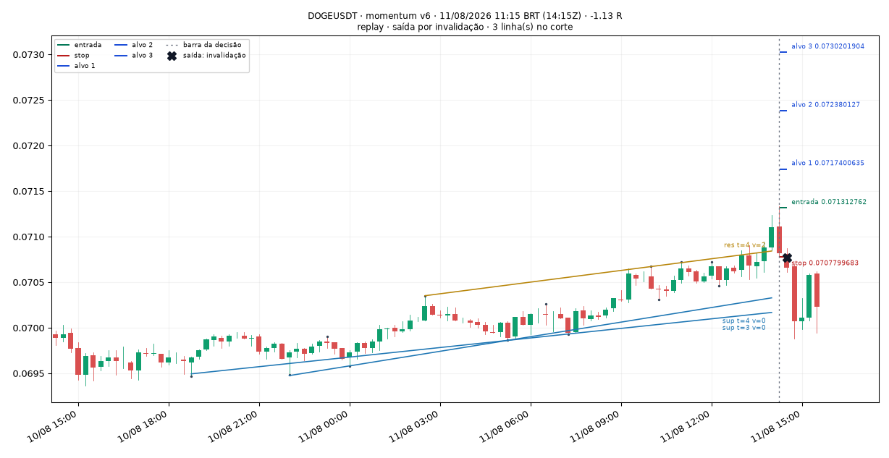

> Momentum 15m: fechamento 0.0711 acima da máxima dos 20 fechamentos anteriores (0.07088), retorno 15m 0.31%, volume relativo 7.28x da mediana de 96 barras, ATR% 0.30%

### 002 — XRPUSDT · 11/08/2026 14:00 BRT · -0.43 R

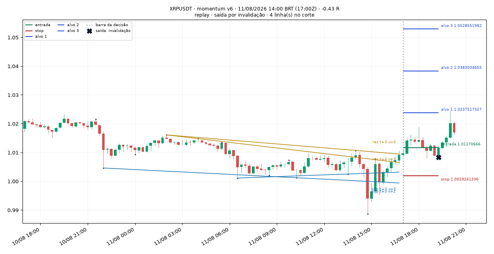

> Momentum 15m: fechamento 1.0092 acima da máxima dos 20 fechamentos anteriores (1.009), retorno 15m 0.19%, volume relativo 2.42x da mediana de 96 barras, ATR% 0.48%

### 003 — XRPUSDT · 11/08/2026 17:00 BRT · +0.57 R

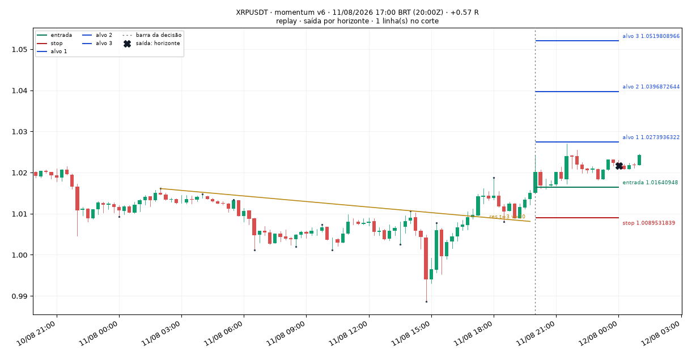

> Momentum 15m: fechamento 1.0151 acima da máxima dos 20 fechamentos anteriores (1.0144), retorno 15m 0.17%, volume relativo 1.55x da mediana de 96 barras, ATR% 0.40%

### 004 — ETHUSDT · 11/08/2026 17:00 BRT · -0.48 R

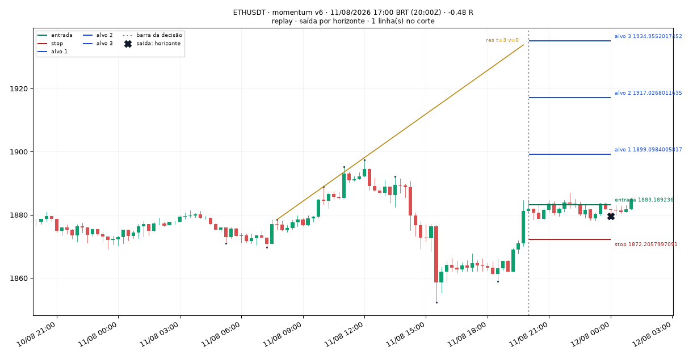

> Momentum 15m: fechamento 1881.17 acima da máxima dos 20 fechamentos anteriores (1876.38), retorno 15m 0.54%, volume relativo 7.99x da mediana de 96 barras, ATR% 0.32%

### 005 — DOGEUSDT · 11/08/2026 17:00 BRT · +0.99 R

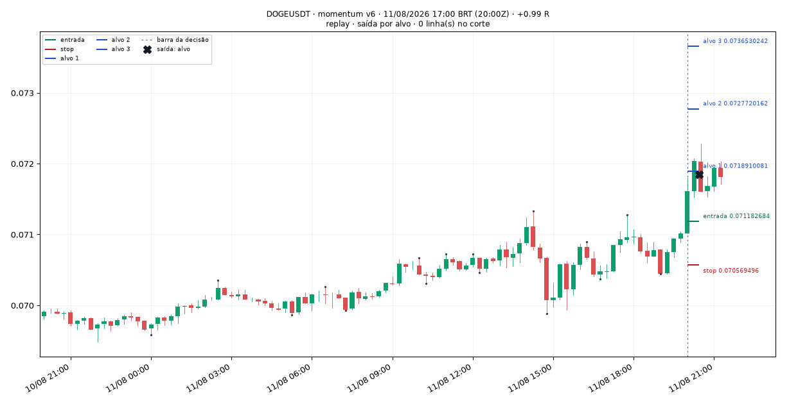

> Momentum 15m: fechamento 0.07101 acima da máxima dos 20 fechamentos anteriores (0.07097), retorno 15m 0.10%, volume relativo 1.58x da mediana de 96 barras, ATR% 0.41%

### 006 — SOLUSDT · 11/08/2026 17:00 BRT · +0.81 R

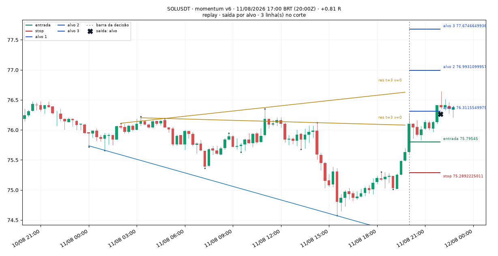

> Momentum 15m: fechamento 75.63 acima da máxima dos 20 fechamentos anteriores (75.48), retorno 15m 0.20%, volume relativo 2.57x da mediana de 96 barras, ATR% 0.30%

### 007 — DOGEUSDT · 11/08/2026 18:45 BRT · -0.48 R

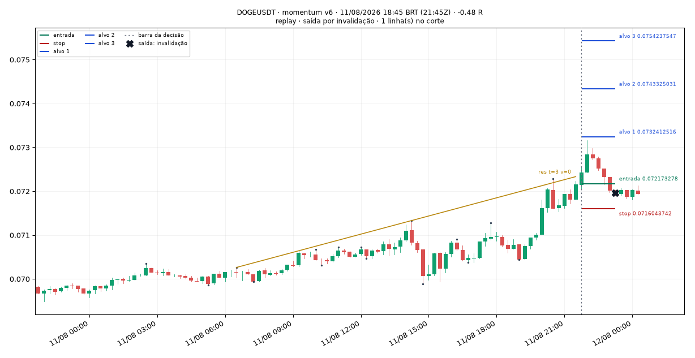

> Momentum 15m: fechamento 0.07215 acima da máxima dos 20 fechamentos anteriores (0.07204), retorno 15m 0.47%, volume relativo 1.57x da mediana de 96 barras, ATR% 0.50%

### 008 — DOGEUSDT · 13/08/2026 00:00 BRT · +0.48 R

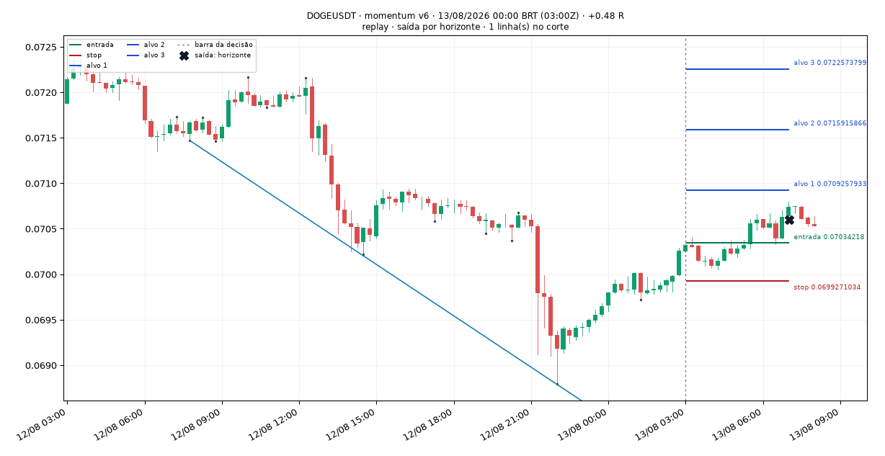

> Momentum 15m: fechamento 0.07026 acima da máxima dos 20 fechamentos anteriores (0.07001), retorno 15m 0.40%, volume relativo 2.17x da mediana de 96 barras, ATR% 0.32%

### 009 — SOLUSDT · 16/08/2026 22:45 BRT · -0.84 R

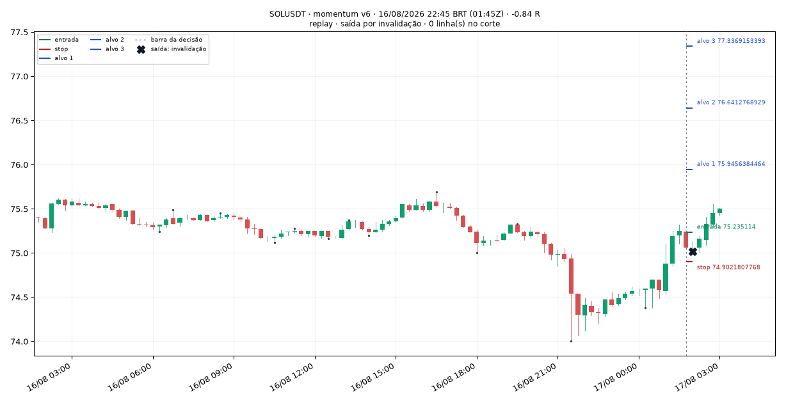

> Momentum 15m: fechamento 75.25 acima da máxima dos 20 fechamentos anteriores (75.19), retorno 15m 0.08%, volume relativo 3.69x da mediana de 96 barras, ATR% 0.31%

### 010 — SOLUSDT · 16/08/2026 23:45 BRT · +0.63 R

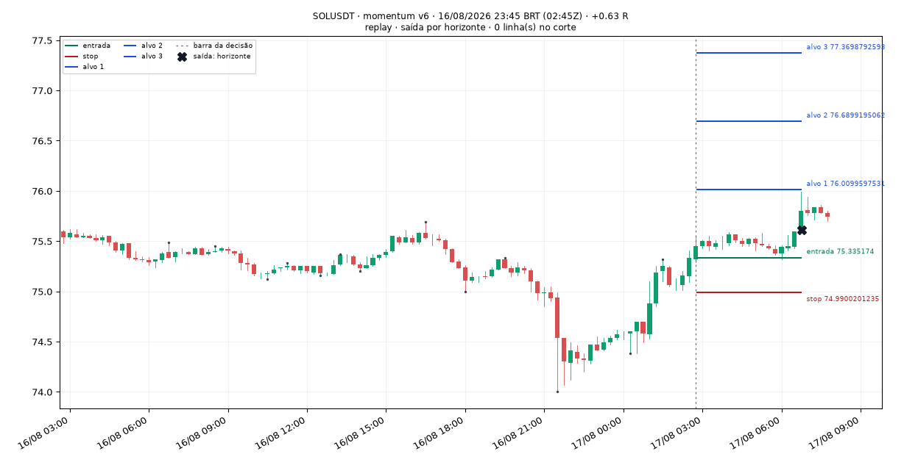

> Momentum 15m: fechamento 75.33 acima da máxima dos 20 fechamentos anteriores (75.25), retorno 15m 0.23%, volume relativo 4.49x da mediana de 96 barras, ATR% 0.30%

### 011 — SOLUSDT · 18/08/2026 12:30 BRT · -0.76 R

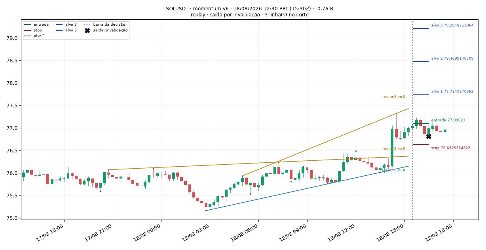

> Momentum 15m: fechamento 77 acima da máxima dos 20 fechamentos anteriores (76.98), retorno 15m 0.12%, volume relativo 2.01x da mediana de 96 barras, ATR% 0.32%

### 012 — SOLUSDT · 19/08/2026 10:30 BRT · -0.70 R

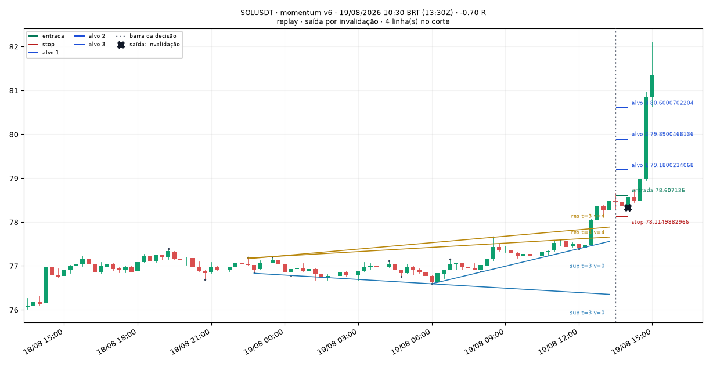

> Momentum 15m: fechamento 78.47 acima da máxima dos 20 fechamentos anteriores (78.37), retorno 15m 0.26%, volume relativo 2.21x da mediana de 96 barras, ATR% 0.30%

### 013 — SOLUSDT · 19/08/2026 11:45 BRT · +1.28 R

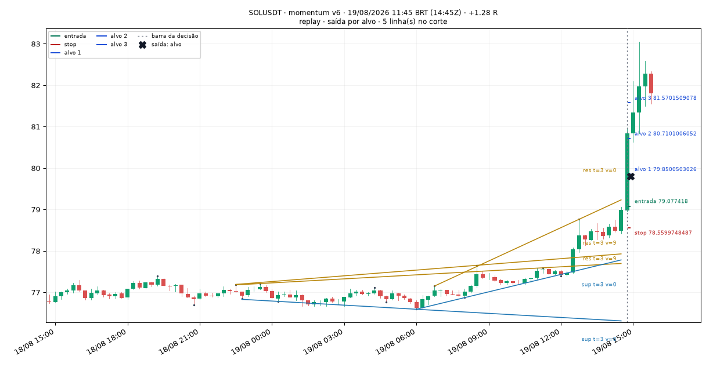

> Momentum 15m: fechamento 78.99 acima da máxima dos 20 fechamentos anteriores (78.58), retorno 15m 0.64%, volume relativo 4.81x da mediana de 96 barras, ATR% 0.36%

### 014 — ETHUSDT · 19/08/2026 12:00 BRT · +1.08 R

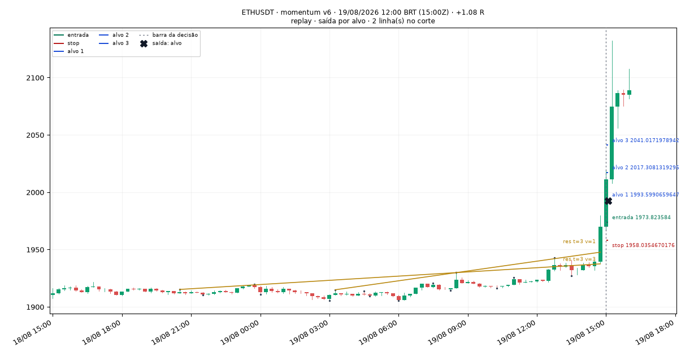

> Momentum 15m: fechamento 1969.89 acima da máxima dos 20 fechamentos anteriores (1939.17), retorno 15m 1.58%, volume relativo 29.77x da mediana de 96 barras, ATR% 0.40%

### 015 — XRPUSDT · 19/08/2026 12:00 BRT · +2.11 R

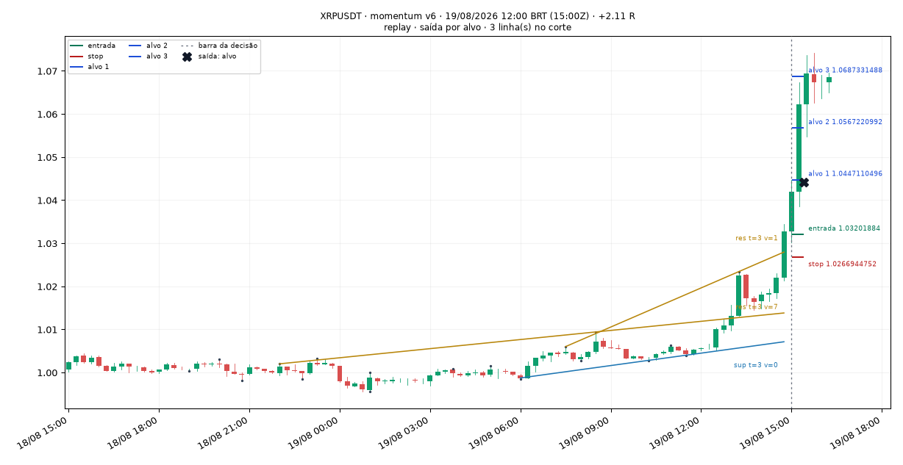

> Momentum 15m: fechamento 1.0327 acima da máxima dos 20 fechamentos anteriores (1.0225), retorno 15m 1.05%, volume relativo 11.26x da mediana de 96 barras, ATR% 0.39%

### 016 — DOGEUSDT · 19/08/2026 12:15 BRT · +1.09 R

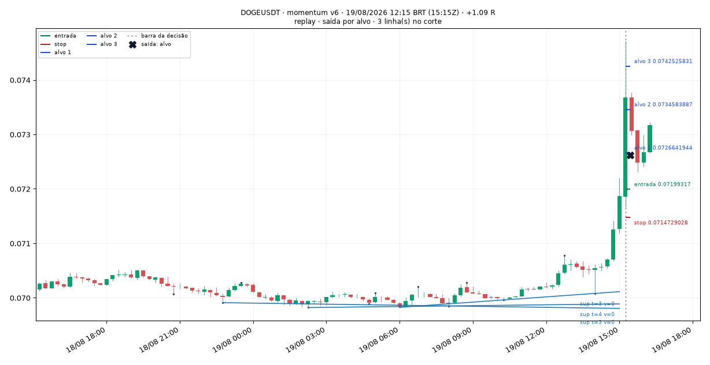

> Momentum 15m: fechamento 0.07187 acima da máxima dos 20 fechamentos anteriores (0.07125), retorno 15m 0.87%, volume relativo 18.50x da mediana de 96 barras, ATR% 0.37%

### 017 — ETHUSDT · 19/08/2026 13:15 BRT · -0.56 R

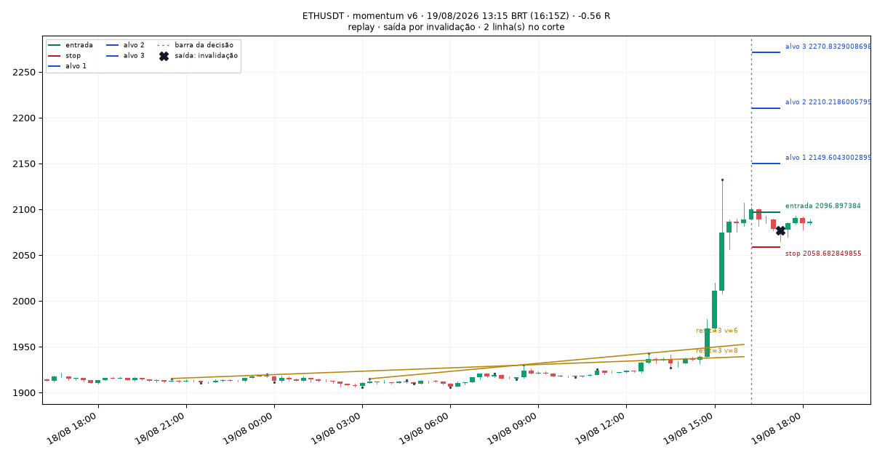

> Momentum 15m: fechamento 2088.99 acima da máxima dos 20 fechamentos anteriores (2086.45), retorno 15m 0.18%, volume relativo 20.30x da mediana de 96 barras, ATR% 0.97%

### 018 — ETHUSDT · 19/08/2026 17:00 BRT · +1.55 R

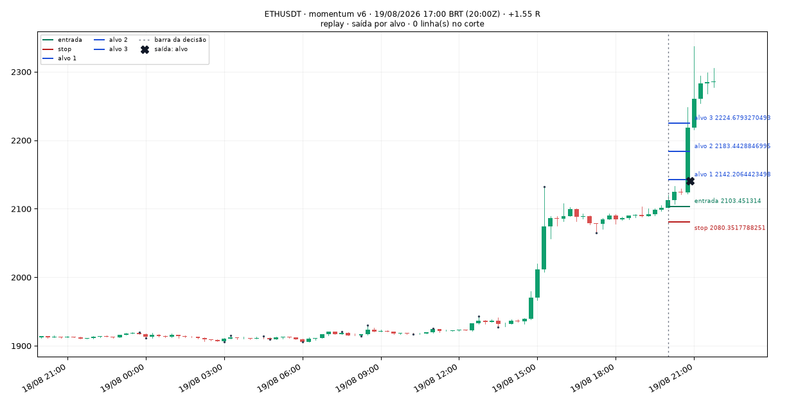

> Momentum 15m: fechamento 2100.97 acima da máxima dos 20 fechamentos anteriores (2099.57), retorno 15m 0.11%, volume relativo 2.76x da mediana de 96 barras, ATR% 0.65%

### 019 — XRPUSDT · 19/08/2026 17:15 BRT · +1.31 R

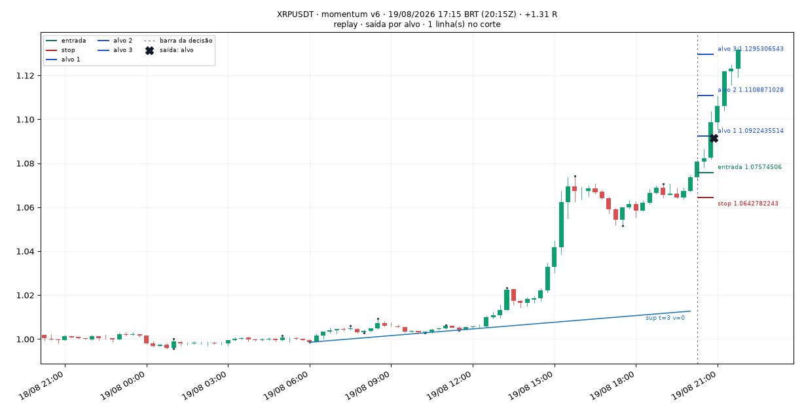

> Momentum 15m: fechamento 1.0736 acima da máxima dos 20 fechamentos anteriores (1.0694), retorno 15m 0.57%, volume relativo 3.59x da mediana de 96 barras, ATR% 0.58%

### 020 — SOLUSDT · 19/08/2026 18:00 BRT · +1.49 R

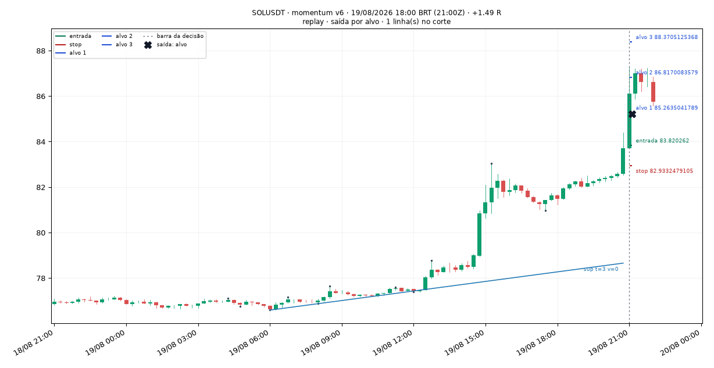

> Momentum 15m: fechamento 83.71 acima da máxima dos 20 fechamentos anteriores (82.58), retorno 15m 1.37%, volume relativo 14.31x da mediana de 96 barras, ATR% 0.62%

### 021 — DOGEUSDT · 19/08/2026 18:00 BRT · +1.82 R

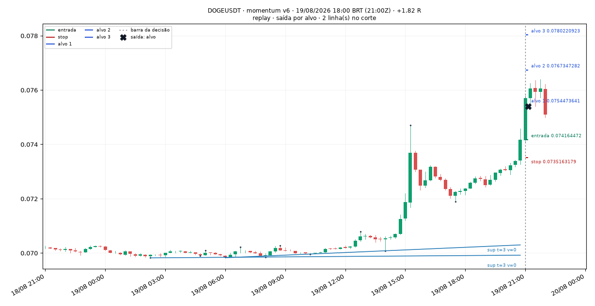

> Momentum 15m: fechamento 0.07416 acima da máxima dos 20 fechamentos anteriores (0.07339), retorno 15m 1.05%, volume relativo 12.51x da mediana de 96 barras, ATR% 0.58%

### 022 — SOLUSDT · 20/08/2026 03:30 BRT · +1.59 R

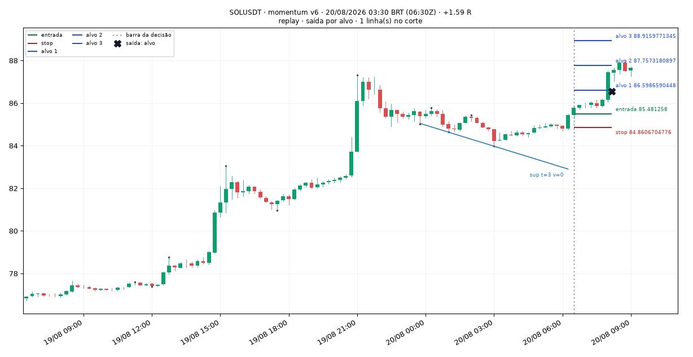

> Momentum 15m: fechamento 85.44 acima da máxima dos 20 fechamentos anteriores (85.36), retorno 15m 0.77%, volume relativo 2.44x da mediana de 96 barras, ATR% 0.45%

### 023 — ETHUSDT · 20/08/2026 05:15 BRT · -0.51 R

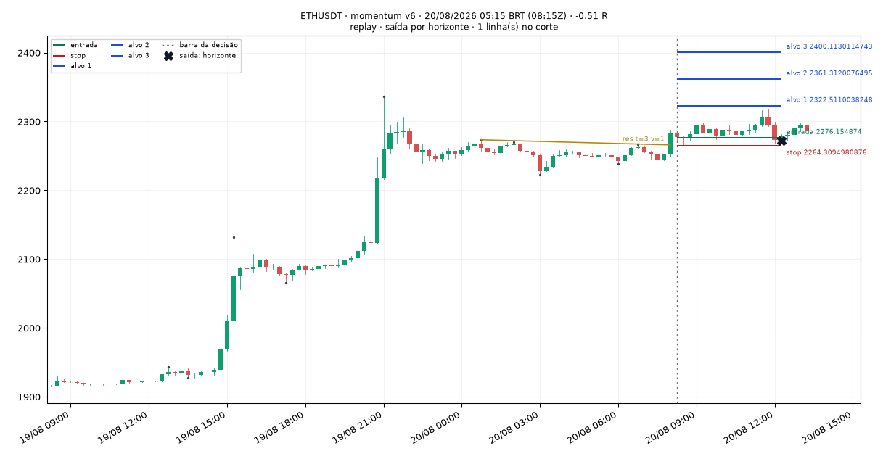

> Momentum 15m: fechamento 2283.71 acima da máxima dos 20 fechamentos anteriores (2262.1), retorno 15m 1.43%, volume relativo 3.87x da mediana de 96 barras, ATR% 0.57%

### 024 — XRPUSDT · 20/08/2026 05:15 BRT · +2.27 R

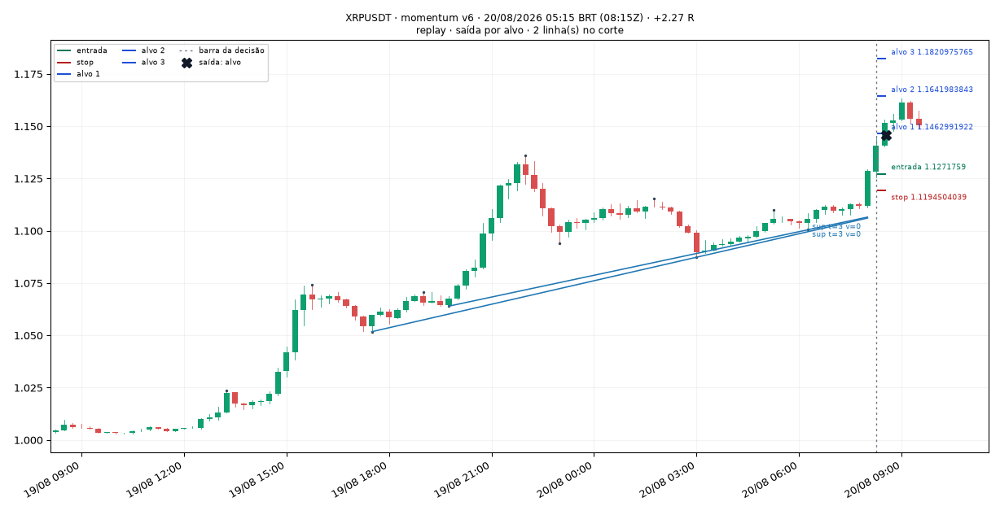

> Momentum 15m: fechamento 1.1284 acima da máxima dos 20 fechamentos anteriores (1.1128), retorno 15m 1.47%, volume relativo 2.71x da mediana de 96 barras, ATR% 0.53%

### 025 — DOGEUSDT · 20/08/2026 05:15 BRT · +2.49 R

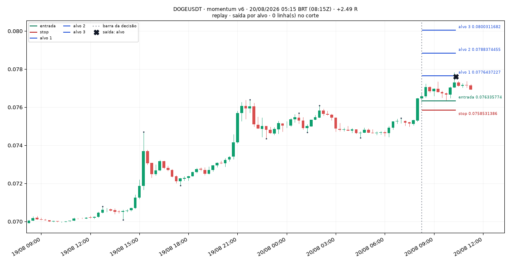

> Momentum 15m: fechamento 0.07645 acima da máxima dos 20 fechamentos anteriores (0.07531), retorno 15m 1.51%, volume relativo 3.70x da mediana de 96 barras, ATR% 0.52%

### 026 — DOGEUSDT · 20/08/2026 08:45 BRT · -0.76 R

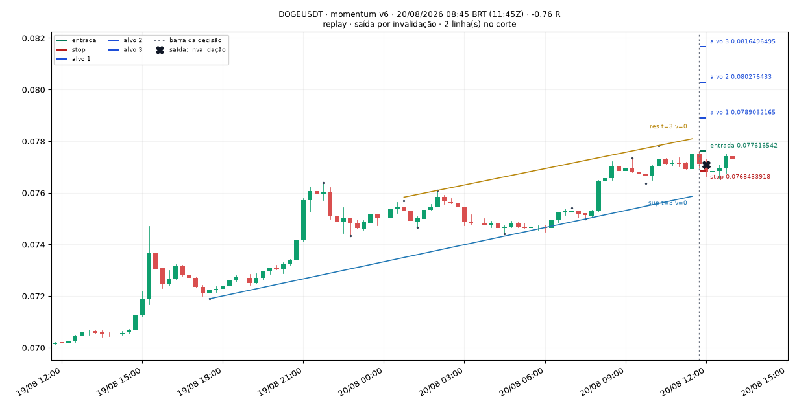

> Momentum 15m: fechamento 0.07753 acima da máxima dos 20 fechamentos anteriores (0.07729), retorno 15m 0.79%, volume relativo 2.27x da mediana de 96 barras, ATR% 0.59%

### 027 — XRPUSDT · 20/08/2026 08:45 BRT · +1.06 R

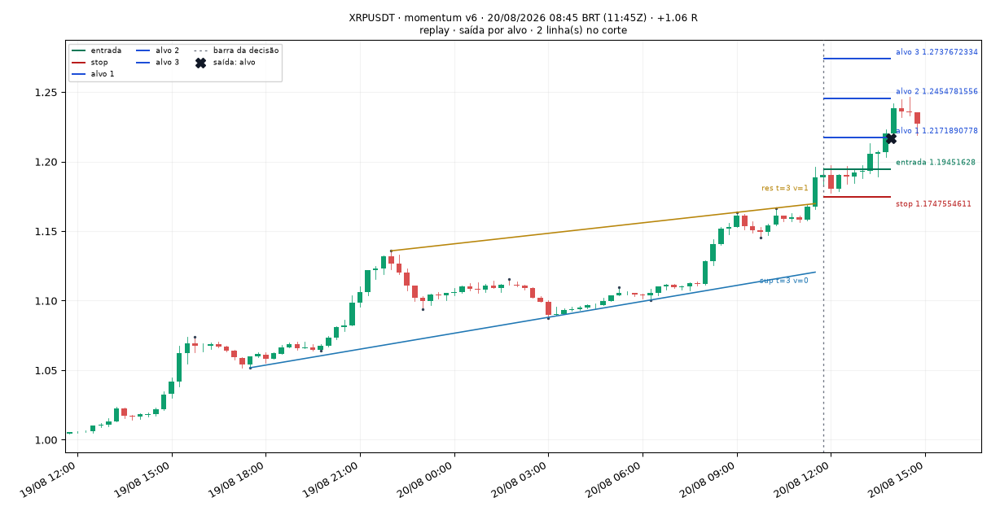

> Momentum 15m: fechamento 1.1889 acima da máxima dos 20 fechamentos anteriores (1.1675), retorno 15m 1.83%, volume relativo 4.70x da mediana de 96 barras, ATR% 0.79%

### 028 — DOGEUSDT · 20/08/2026 10:30 BRT · -1.26 R

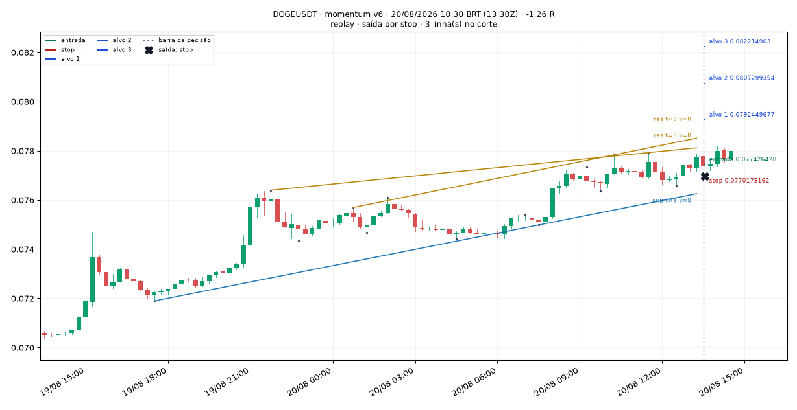

> Momentum 15m: fechamento 0.07776 acima da máxima dos 20 fechamentos anteriores (0.07753), retorno 15m 0.61%, volume relativo 1.52x da mediana de 96 barras, ATR% 0.64%

### 029 — DOGEUSDT · 20/08/2026 11:15 BRT · -0.50 R

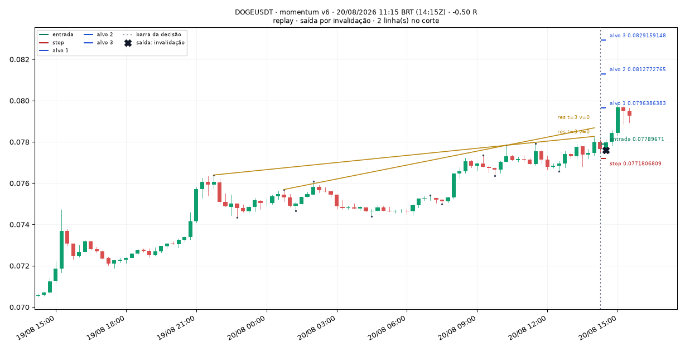

> Momentum 15m: fechamento 0.078 acima da máxima dos 20 fechamentos anteriores (0.07776), retorno 15m 0.71%, volume relativo 1.98x da mediana de 96 barras, ATR% 0.70%

### 030 — DOGEUSDT · 20/08/2026 12:00 BRT · +1.88 R

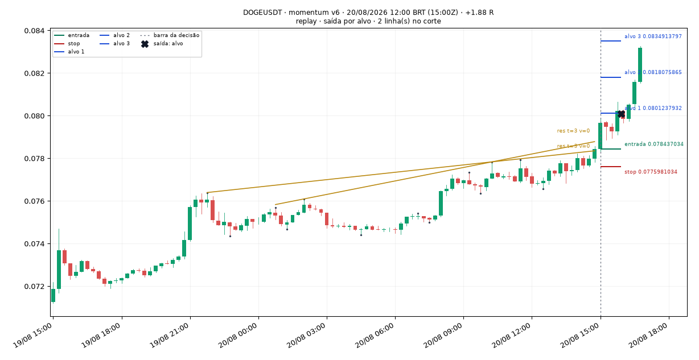

> Momentum 15m: fechamento 0.07844 acima da máxima dos 20 fechamentos anteriores (0.078), retorno 15m 0.59%, volume relativo 2.54x da mediana de 96 barras, ATR% 0.72%

### 031 — XRPUSDT · 20/08/2026 12:15 BRT · -1.09 R

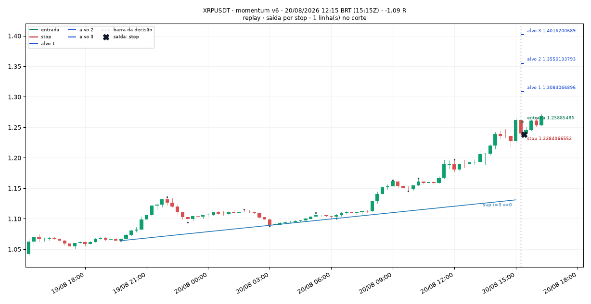

> Momentum 15m: fechamento 1.2618 acima da máxima dos 20 fechamentos anteriores (1.2386), retorno 15m 2.82%, volume relativo 4.99x da mediana de 96 barras, ATR% 1.23%

### 032 — ETHUSDT · 20/08/2026 12:30 BRT · -0.62 R

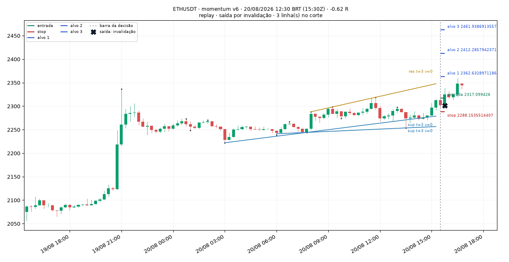

> Momentum 15m: fechamento 2312.98 acima da máxima dos 20 fechamentos anteriores (2306.25), retorno 15m 0.69%, volume relativo 2.91x da mediana de 96 barras, ATR% 0.72%

### 033 — XRPUSDT · 20/08/2026 13:30 BRT · +2.09 R

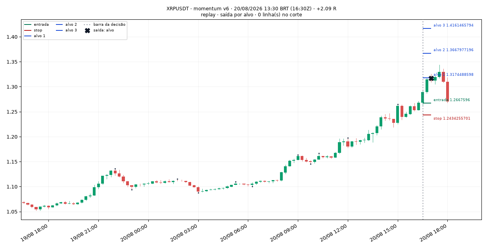

> Momentum 15m: fechamento 1.2681 acima da máxima dos 20 fechamentos anteriores (1.2618), retorno 15m 1.22%, volume relativo 1.95x da mediana de 96 barras, ATR% 1.30%

### 034 — DOGEUSDT · 20/08/2026 13:30 BRT · +2.33 R

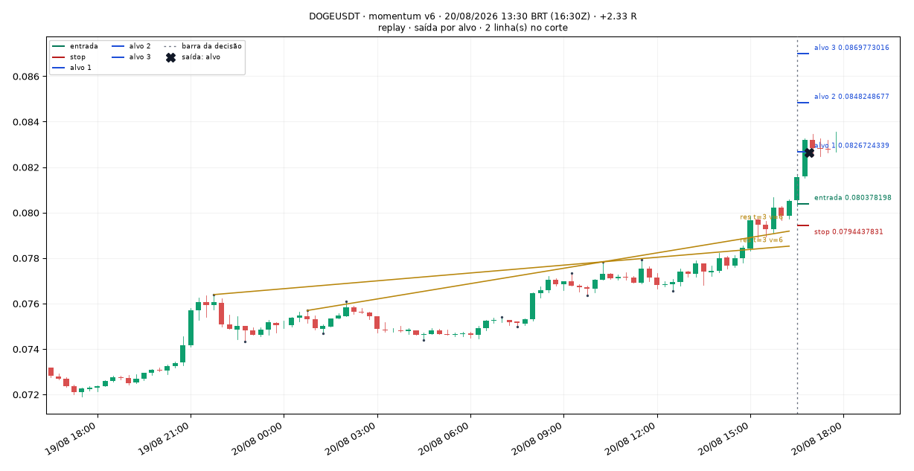

> Momentum 15m: fechamento 0.08052 acima da máxima dos 20 fechamentos anteriores (0.08021), retorno 15m 0.84%, volume relativo 1.59x da mediana de 96 barras, ATR% 0.89%

### 035 — ETHUSDT · 20/08/2026 13:45 BRT · -1.13 R

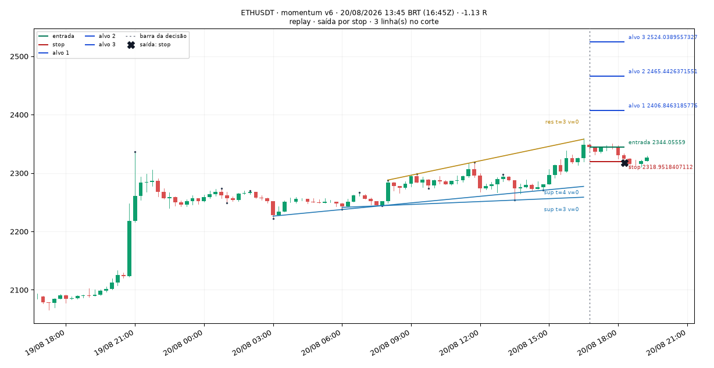

> Momentum 15m: fechamento 2348.25 acima da máxima dos 20 fechamentos anteriores (2325.2), retorno 15m 0.99%, volume relativo 3.33x da mediana de 96 barras, ATR% 0.83%

### 036 — XRPUSDT · 20/08/2026 14:30 BRT · -0.45 R

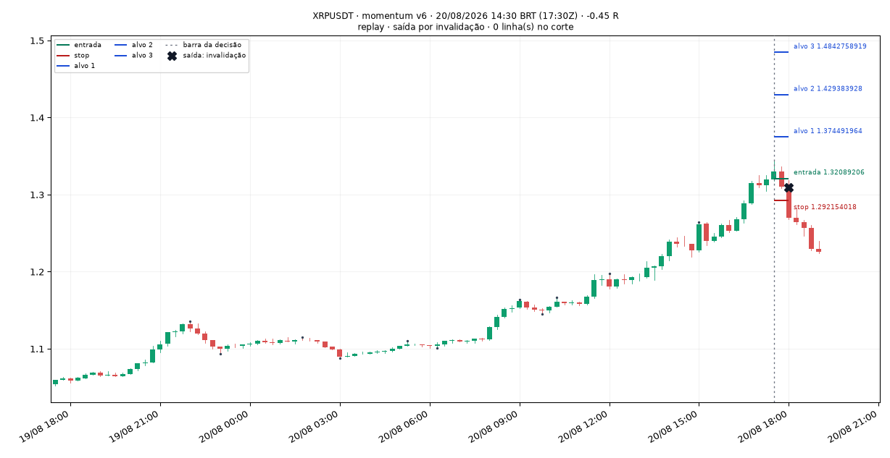

> Momentum 15m: fechamento 1.3196 acima da máxima dos 20 fechamentos anteriores (1.3146), retorno 15m 0.58%, volume relativo 3.73x da mediana de 96 barras, ATR% 1.39%

### 037 — DOGEUSDT · 20/08/2026 21:30 BRT · +1.59 R

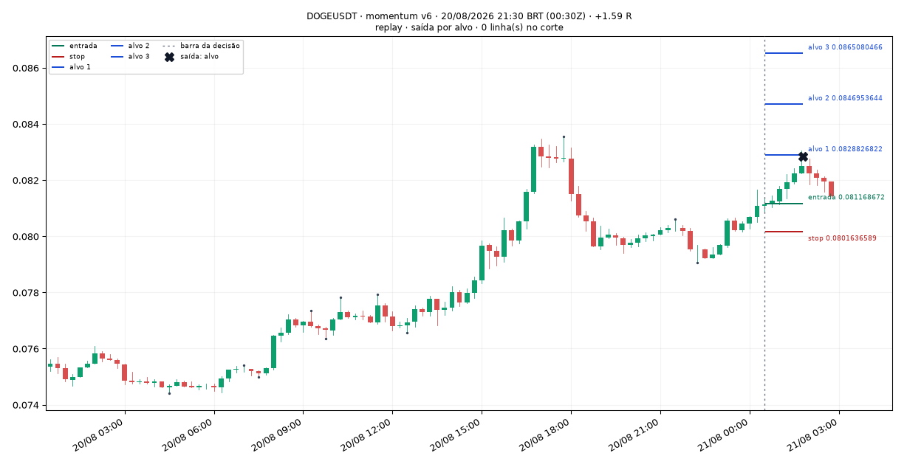

> Momentum 15m: fechamento 0.08107 acima da máxima dos 20 fechamentos anteriores (0.08069), retorno 15m 0.47%, volume relativo 3.18x da mediana de 96 barras, ATR% 0.75%

### 038 — SOLUSDT · 20/08/2026 21:30 BRT · -0.94 R

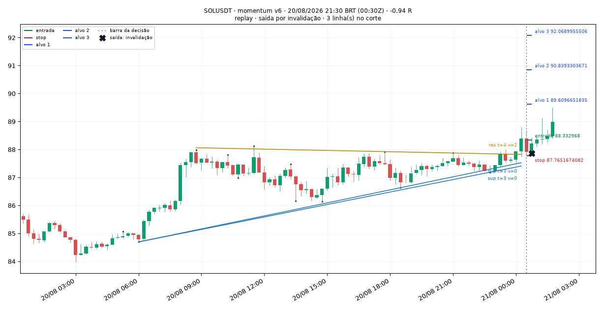

> Momentum 15m: fechamento 88.38 acima da máxima dos 20 fechamentos anteriores (87.93), retorno 15m 0.51%, volume relativo 3.49x da mediana de 96 barras, ATR% 0.46%

### 039 — ETHUSDT · 20/08/2026 22:30 BRT · -0.49 R

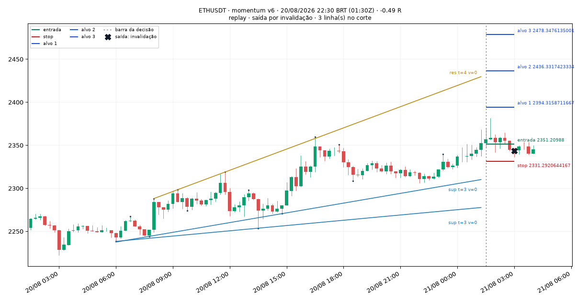

> Momentum 15m: fechamento 2352.3 acima da máxima dos 20 fechamentos anteriores (2344.74), retorno 15m 0.32%, volume relativo 3.81x da mediana de 96 barras, ATR% 0.60%

### 040 — XRPUSDT · 20/08/2026 23:00 BRT · -0.36 R

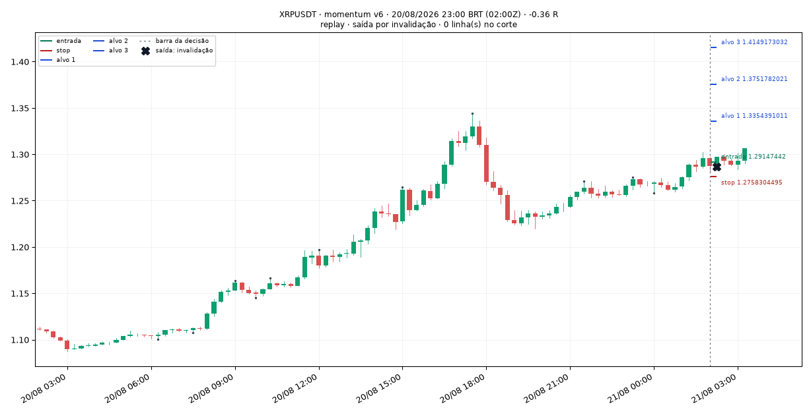

> Momentum 15m: fechamento 1.2957 acima da máxima dos 20 fechamentos anteriores (1.2889), retorno 15m 0.68%, volume relativo 1.60x da mediana de 96 barras, ATR% 1.02%

### 041 — SOLUSDT · 20/08/2026 23:00 BRT · +2.29 R

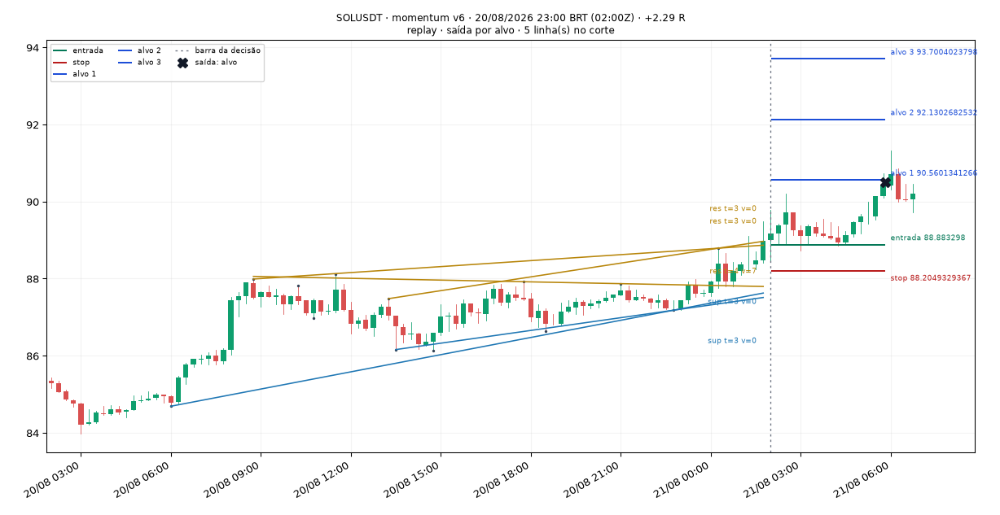

> Momentum 15m: fechamento 88.99 acima da máxima dos 20 fechamentos anteriores (88.47), retorno 15m 0.59%, volume relativo 3.51x da mediana de 96 barras, ATR% 0.59%

### 042 — DOGEUSDT · 21/08/2026 03:30 BRT · +1.68 R

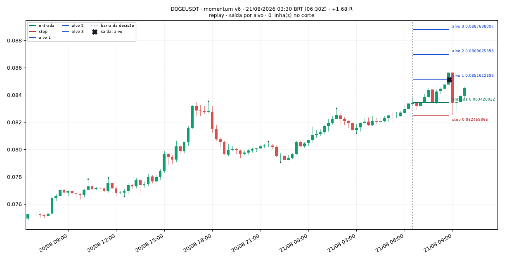

> Momentum 15m: fechamento 0.08336 acima da máxima dos 20 fechamentos anteriores (0.08295), retorno 15m 0.49%, volume relativo 2.13x da mediana de 96 barras, ATR% 0.72%

### 043 — XRPUSDT · 21/08/2026 05:15 BRT · +1.25 R

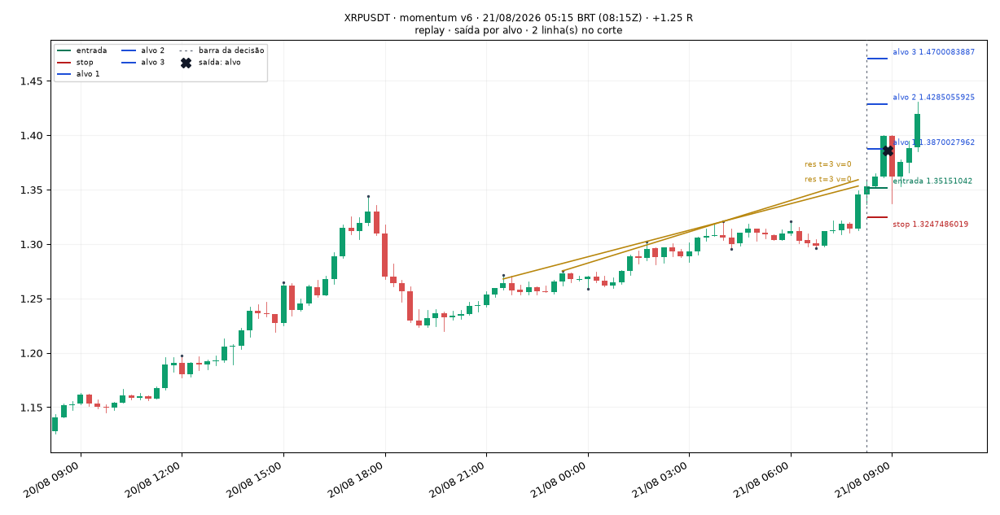

> Momentum 15m: fechamento 1.3455 acima da máxima dos 20 fechamentos anteriores (1.3189), retorno 15m 2.41%, volume relativo 2.80x da mediana de 96 barras, ATR% 1.03%

### 044 — ETHUSDT · 21/08/2026 05:30 BRT · +1.63 R

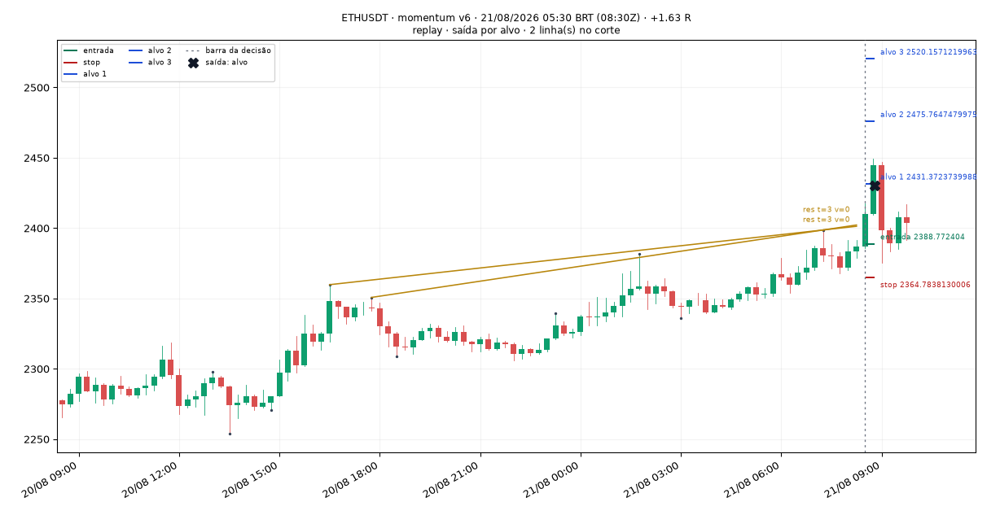

> Momentum 15m: fechamento 2386.98 acima da máxima dos 20 fechamentos anteriores (2385.55), retorno 15m 0.15%, volume relativo 1.64x da mediana de 96 barras, ATR% 0.62%

### 045 — SOLUSDT · 21/08/2026 05:30 BRT · +1.61 R

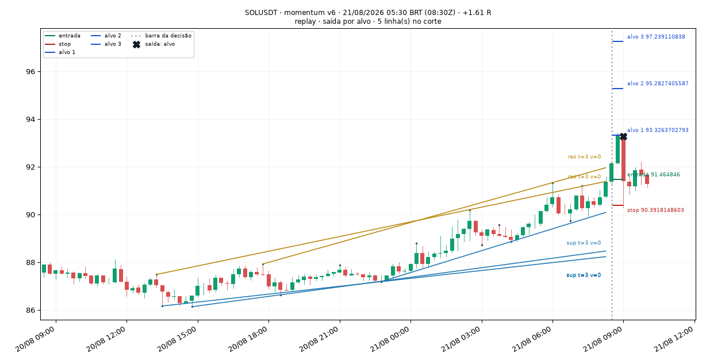

> Momentum 15m: fechamento 91.37 acima da máxima dos 20 fechamentos anteriores (90.78), retorno 15m 0.71%, volume relativo 2.74x da mediana de 96 barras, ATR% 0.71%

### 046 — XRPUSDT · 21/08/2026 07:00 BRT · -0.85 R

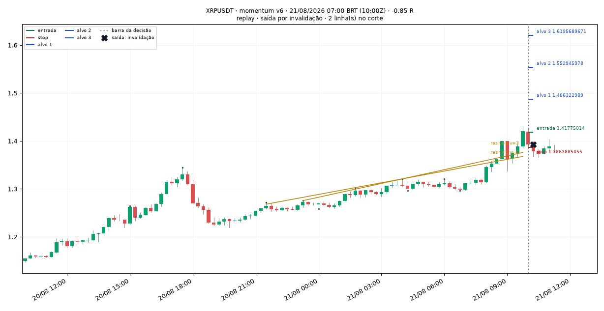

> Momentum 15m: fechamento 1.4197 acima da máxima dos 20 fechamentos anteriores (1.3994), retorno 15m 2.25%, volume relativo 4.05x da mediana de 96 barras, ATR% 1.56%

### 047 — ETHUSDT · 21/08/2026 14:15 BRT · +1.36 R

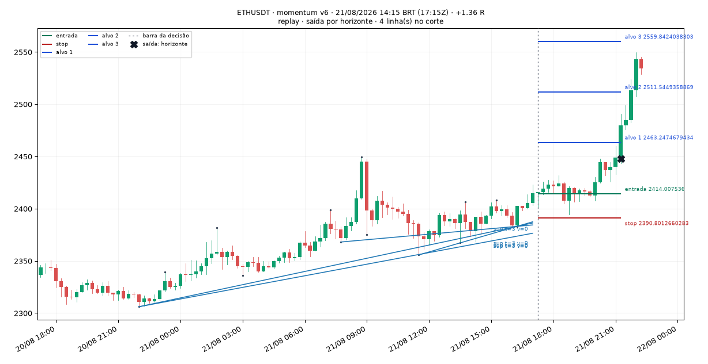

> Momentum 15m: fechamento 2414.95 acima da máxima dos 20 fechamentos anteriores (2405.13), retorno 15m 0.41%, volume relativo 1.58x da mediana de 96 barras, ATR% 0.67%

### 048 — DOGEUSDT · 21/08/2026 17:45 BRT · +1.87 R

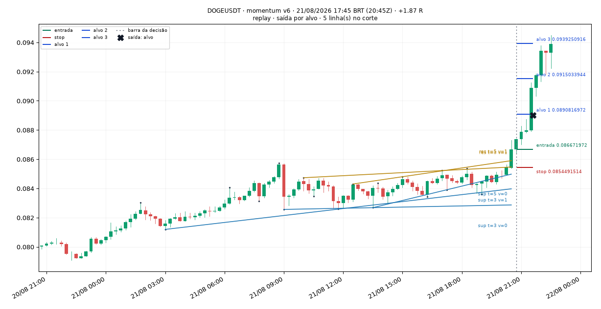

> Momentum 15m: fechamento 0.08666 acima da máxima dos 20 fechamentos anteriores (0.08542), retorno 15m 1.45%, volume relativo 4.71x da mediana de 96 barras, ATR% 0.93%

### 049 — SOLUSDT · 21/08/2026 18:30 BRT · +1.50 R

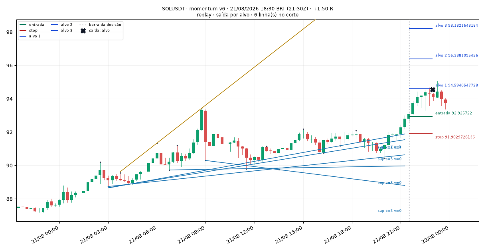

> Momentum 15m: fechamento 92.8 acima da máxima dos 20 fechamentos anteriores (92.28), retorno 15m 0.56%, volume relativo 1.73x da mediana de 96 barras, ATR% 0.64%

### 050 — XRPUSDT · 21/08/2026 19:15 BRT · +1.97 R

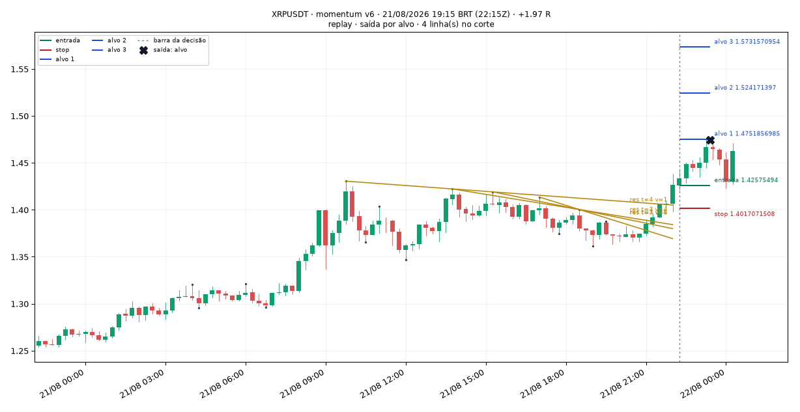

> Momentum 15m: fechamento 1.4262 acima da máxima dos 20 fechamentos anteriores (1.4063), retorno 15m 1.42%, volume relativo 3.37x da mediana de 96 barras, ATR% 1.14%

### 051 — DOGEUSDT · 21/08/2026 19:45 BRT · -0.55 R

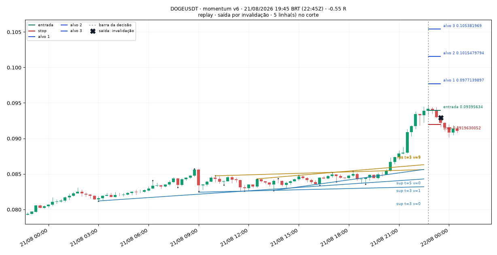

> Momentum 15m: fechamento 0.09388 acima da máxima dos 20 fechamentos anteriores (0.09343), retorno 15m 0.64%, volume relativo 3.69x da mediana de 96 barras, ATR% 1.36%

### 052 — SOLUSDT · 21/08/2026 20:30 BRT · -0.47 R

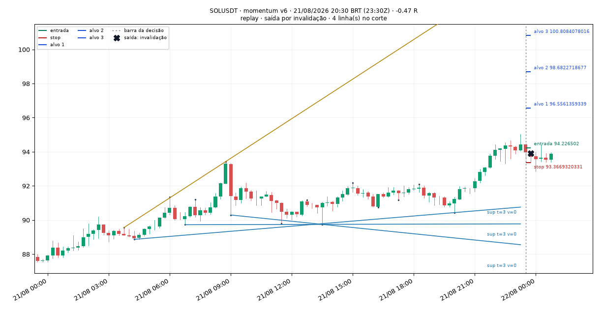

> Momentum 15m: fechamento 94.43 acima da máxima dos 20 fechamentos anteriores (94.37), retorno 15m 0.37%, volume relativo 1.57x da mediana de 96 barras, ATR% 0.75%

### 053 — XRPUSDT · 21/08/2026 22:45 BRT · -0.72 R

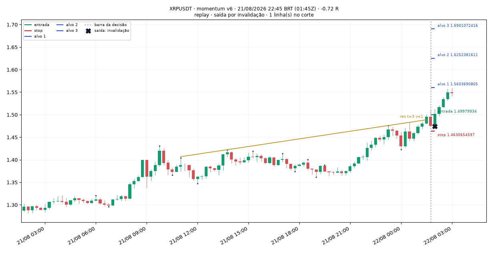

> Momentum 15m: fechamento 1.4955 acima da máxima dos 20 fechamentos anteriores (1.4806), retorno 15m 1.01%, volume relativo 1.60x da mediana de 96 barras, ATR% 1.45%

### 054 — SOLUSDT · 21/08/2026 23:45 BRT · +2.17 R

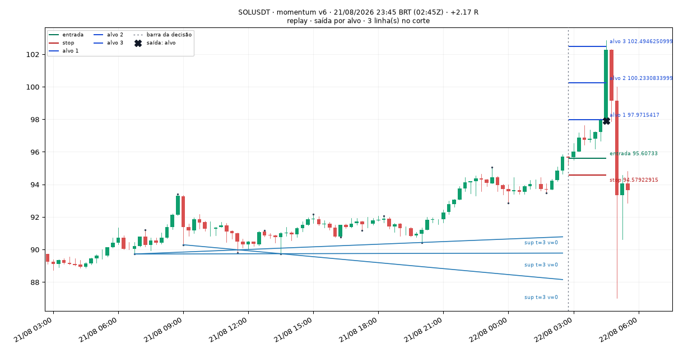

> Momentum 15m: fechamento 95.71 acima da máxima dos 20 fechamentos anteriores (94.84), retorno 15m 0.92%, volume relativo 2.17x da mediana de 96 barras, ATR% 0.79%

### 055 — XRPUSDT · 22/08/2026 00:30 BRT · +1.41 R

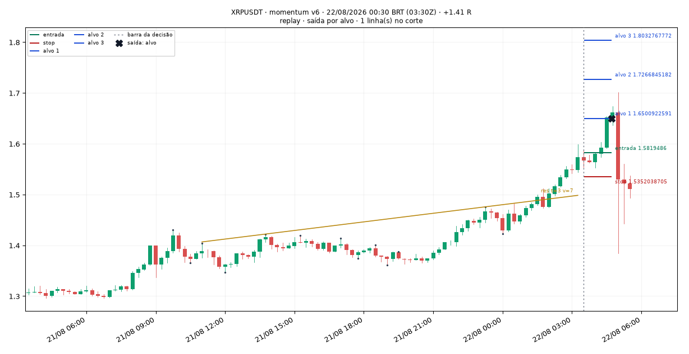

> Momentum 15m: fechamento 1.5735 acima da máxima dos 20 fechamentos anteriores (1.5492), retorno 15m 1.65%, volume relativo 3.49x da mediana de 96 barras, ATR% 1.62%

### 056 — DOGEUSDT · 22/08/2026 00:30 BRT · -1.07 R

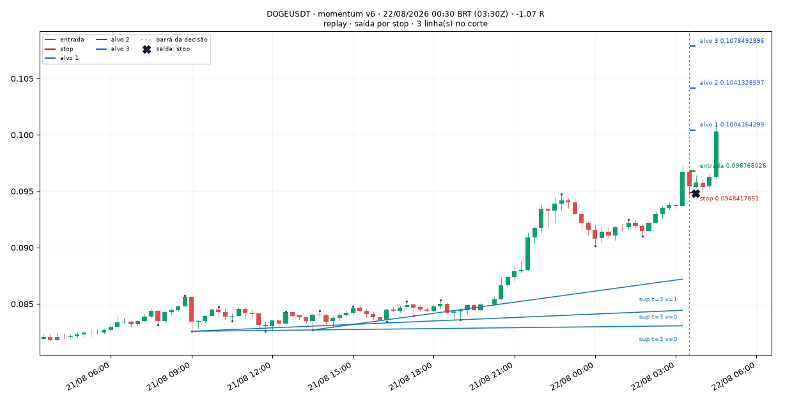

> Momentum 15m: fechamento 0.0967 acima da máxima dos 20 fechamentos anteriores (0.09418), retorno 15m 3.27%, volume relativo 4.02x da mediana de 96 barras, ATR% 1.28%

### 057 — DOGEUSDT · 22/08/2026 01:45 BRT · -1.06 R

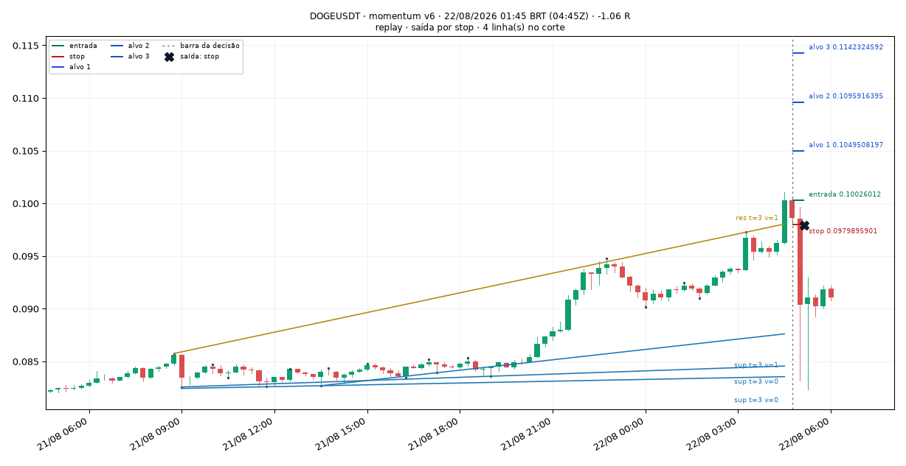

> Momentum 15m: fechamento 0.10031 acima da máxima dos 20 fechamentos anteriores (0.0967), retorno 15m 4.21%, volume relativo 5.23x da mediana de 96 barras, ATR% 1.54%

### 058 — DOGEUSDT · 22/08/2026 14:30 BRT · +1.23 R

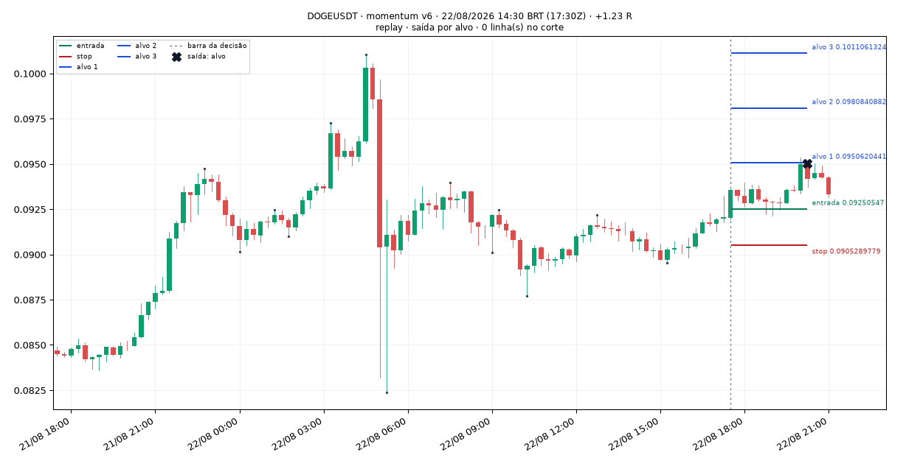

> Momentum 15m: fechamento 0.09204 acima da máxima dos 20 fechamentos anteriores (0.09195), retorno 15m 0.10%, volume relativo 1.51x da mediana de 96 barras, ATR% 1.09%

### 059 — ETHUSDT · 22/08/2026 17:00 BRT · -0.84 R

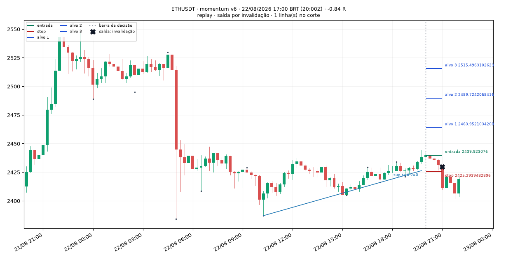

> Momentum 15m: fechamento 2438.18 acima da máxima dos 20 fechamentos anteriores (2433.81), retorno 15m 0.18%, volume relativo 1.59x da mediana de 96 barras, ATR% 0.35%

### 060 — SOLUSDT · 22/08/2026 21:45 BRT · -1.08 R

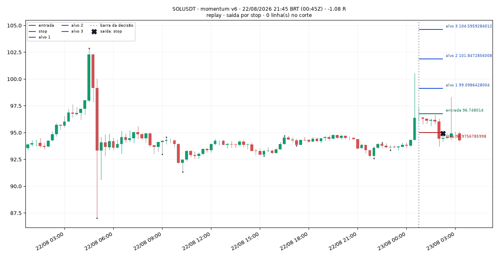

> Momentum 15m: fechamento 96.35 acima da máxima dos 20 fechamentos anteriores (94.76), retorno 15m 2.16%, volume relativo 10.28x da mediana de 96 barras, ATR% 0.95%

### 061 — ETHUSDT · 23/08/2026 05:45 BRT · -0.63 R

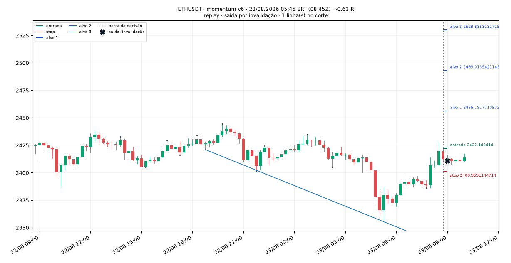

> Momentum 15m: fechamento 2419.37 acima da máxima dos 20 fechamentos anteriores (2413.68), retorno 15m 0.53%, volume relativo 4.18x da mediana de 96 barras, ATR% 0.51%

### 062 — DOGEUSDT · 23/08/2026 07:30 BRT · +1.63 R

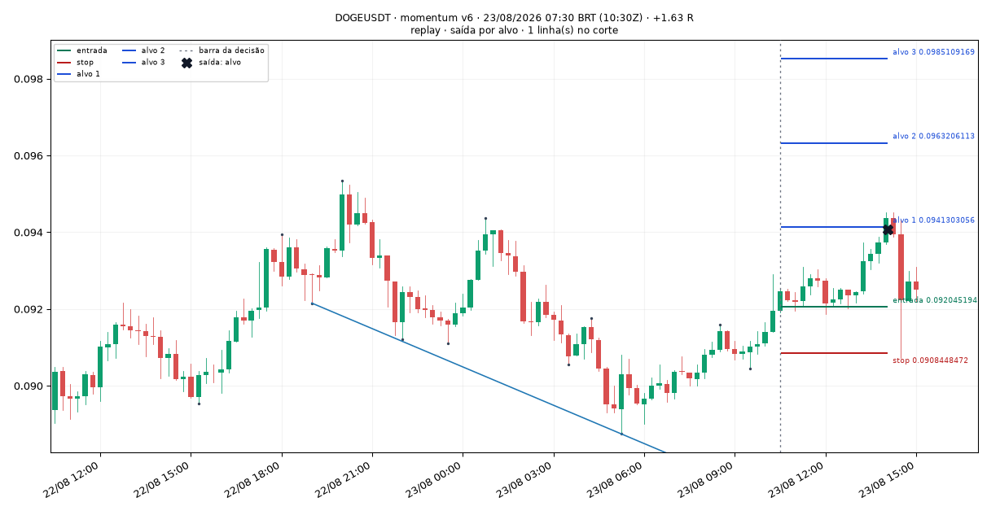

> Momentum 15m: fechamento 0.09194 acima da máxima dos 20 fechamentos anteriores (0.09142), retorno 15m 0.59%, volume relativo 2.63x da mediana de 96 barras, ATR% 0.79%

### 063 — SOLUSDT · 23/08/2026 08:30 BRT · -1.13 R

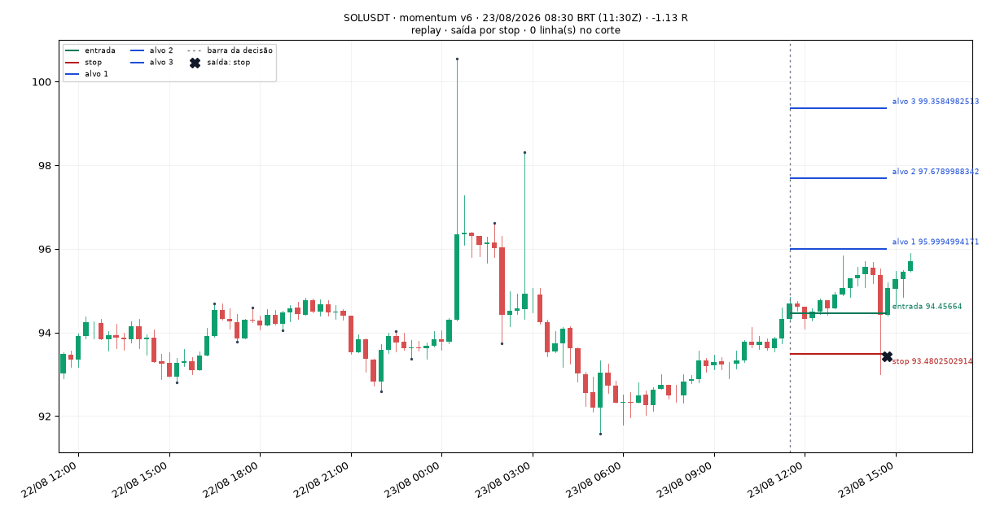

> Momentum 15m: fechamento 94.32 acima da máxima dos 20 fechamentos anteriores (93.85), retorno 15m 0.50%, volume relativo 2.32x da mediana de 96 barras, ATR% 0.59%

### 064 — ETHUSDT · 23/08/2026 08:30 BRT · +1.35 R

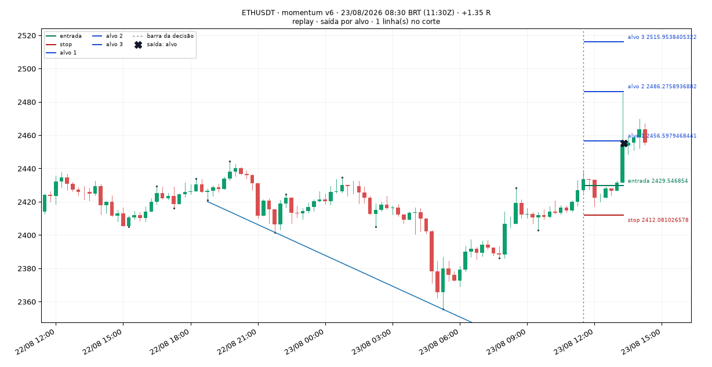

> Momentum 15m: fechamento 2426.92 acima da máxima dos 20 fechamentos anteriores (2420.05), retorno 15m 0.28%, volume relativo 3.78x da mediana de 96 barras, ATR% 0.41%

### 065 — XRPUSDT · 23/08/2026 08:30 BRT · -0.26 R

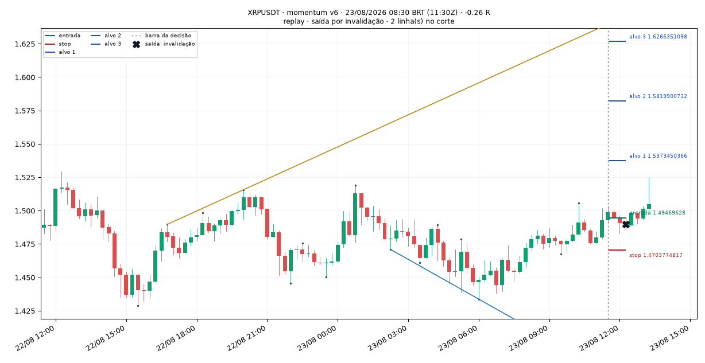

> Momentum 15m: fechamento 1.4927 acima da máxima dos 20 fechamentos anteriores (1.491), retorno 15m 0.86%, volume relativo 1.70x da mediana de 96 barras, ATR% 1.00%

### 066 — XRPUSDT · 23/08/2026 10:30 BRT · +1.42 R

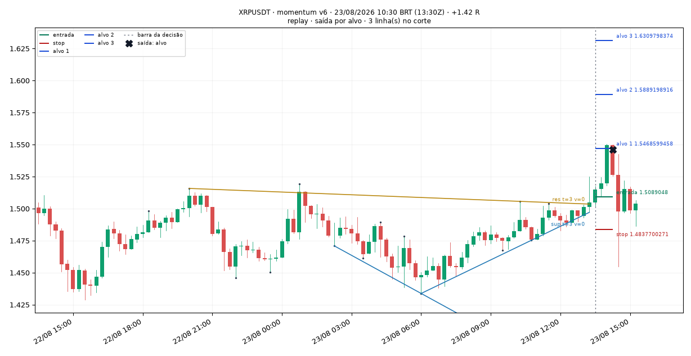

> Momentum 15m: fechamento 1.5048 acima da máxima dos 20 fechamentos anteriores (1.5014), retorno 15m 0.23%, volume relativo 3.58x da mediana de 96 barras, ATR% 0.93%

### 067 — SOLUSDT · 23/08/2026 18:15 BRT · -0.78 R

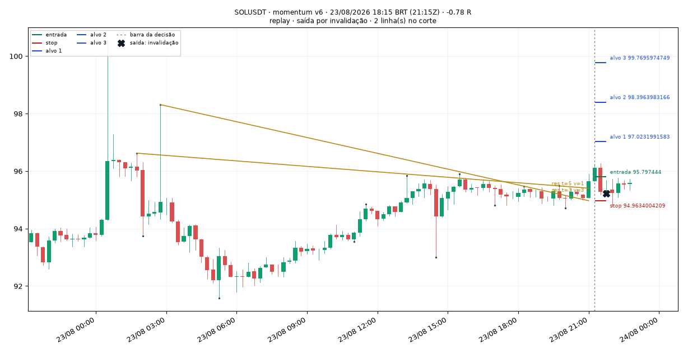

> Momentum 15m: fechamento 95.65 acima da máxima dos 20 fechamentos anteriores (95.54), retorno 15m 0.61%, volume relativo 1.63x da mediana de 96 barras, ATR% 0.48%

### 068 — ETHUSDT · 23/08/2026 18:15 BRT · -1.18 R

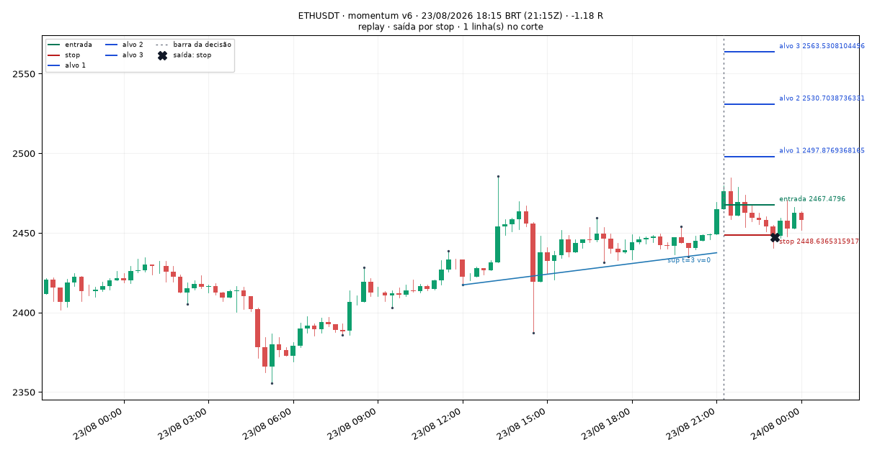

> Momentum 15m: fechamento 2465.05 acima da máxima dos 20 fechamentos anteriores (2449.7), retorno 15m 0.65%, volume relativo 3.05x da mediana de 96 barras, ATR% 0.44%

### 069 — XRPUSDT · 23/08/2026 18:30 BRT · -1.09 R

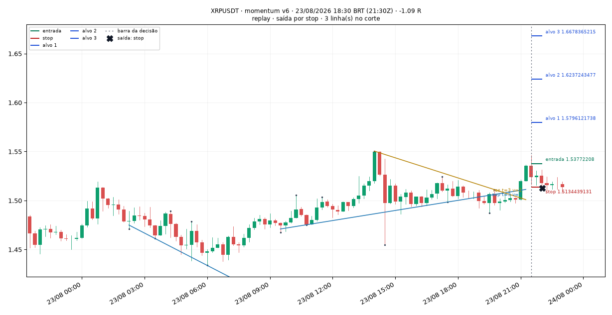

> Momentum 15m: fechamento 1.5355 acima da máxima dos 20 fechamentos anteriores (1.5198), retorno 15m 1.03%, volume relativo 1.55x da mediana de 96 barras, ATR% 0.96%

### 070 — ETHUSDT · 24/08/2026 04:15 BRT · -1.07 R

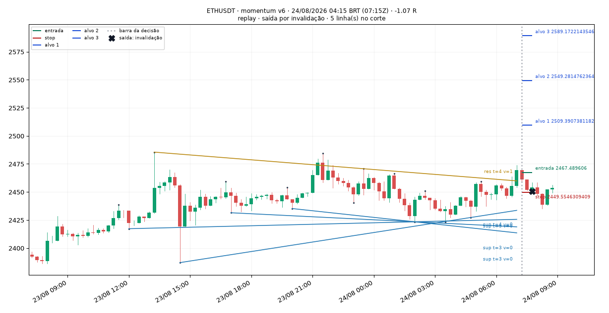

> Momentum 15m: fechamento 2469.5 acima da máxima dos 20 fechamentos anteriores (2457.16), retorno 15m 0.57%, volume relativo 2.42x da mediana de 96 barras, ATR% 0.54%

### 071 — SOLUSDT · 24/08/2026 04:15 BRT · -1.16 R

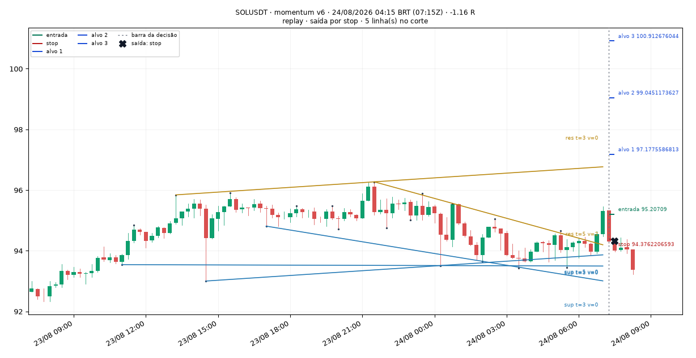

> Momentum 15m: fechamento 95.31 acima da máxima dos 20 fechamentos anteriores (94.78), retorno 15m 0.81%, volume relativo 2.09x da mediana de 96 barras, ATR% 0.65%

### 072 — XRPUSDT · 24/08/2026 04:15 BRT · -1.06 R

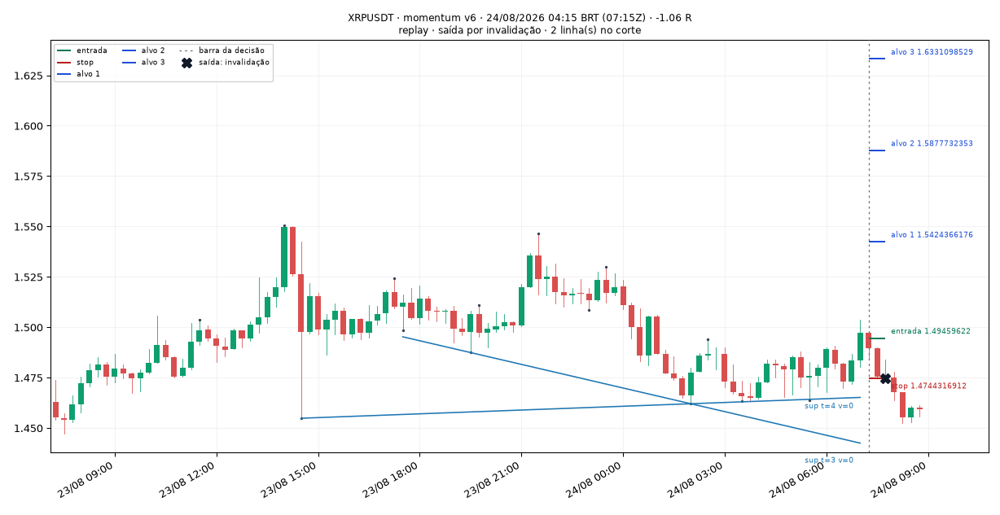

> Momentum 15m: fechamento 1.4971 acima da máxima dos 20 fechamentos anteriores (1.489), retorno 15m 0.91%, volume relativo 1.66x da mediana de 96 barras, ATR% 1.01%

### 073 — ETHUSDT · 24/08/2026 07:15 BRT · -1.21 R

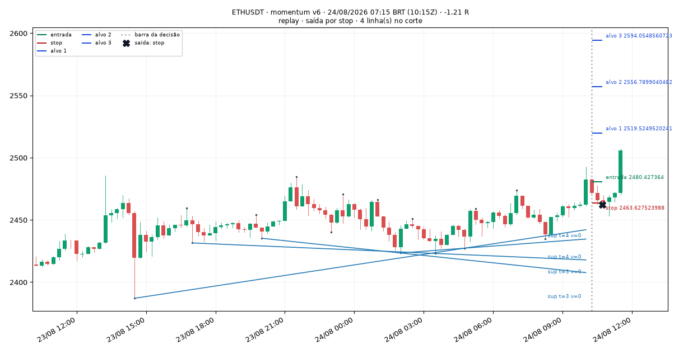

> Momentum 15m: fechamento 2482.26 acima da máxima dos 20 fechamentos anteriores (2469.5), retorno 15m 0.81%, volume relativo 6.06x da mediana de 96 barras, ATR% 0.50%

### 074 — XRPUSDT · 24/08/2026 08:45 BRT · -1.12 R

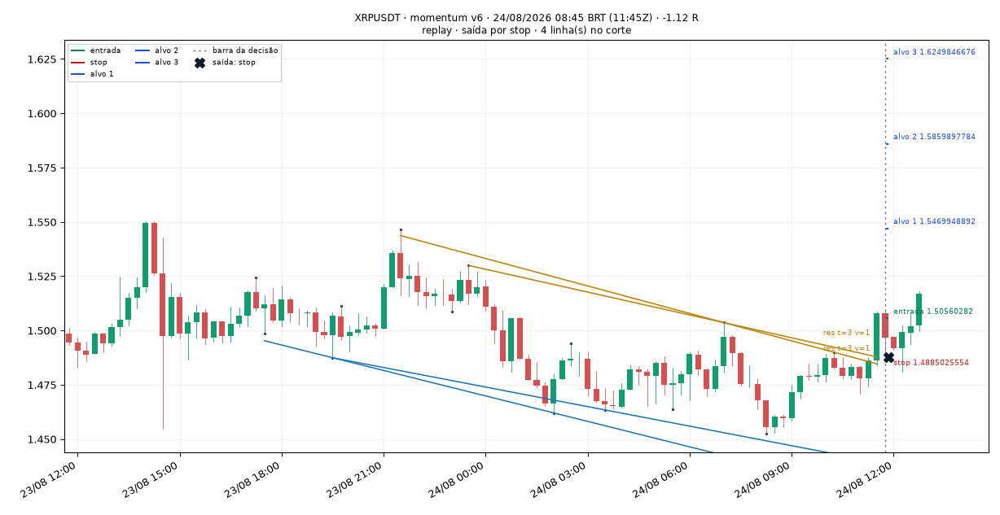

> Momentum 15m: fechamento 1.508 acima da máxima dos 20 fechamentos anteriores (1.4971), retorno 15m 1.48%, volume relativo 2.17x da mediana de 96 barras, ATR% 0.86%

### 075 — SOLUSDT · 24/08/2026 08:45 BRT · -1.18 R

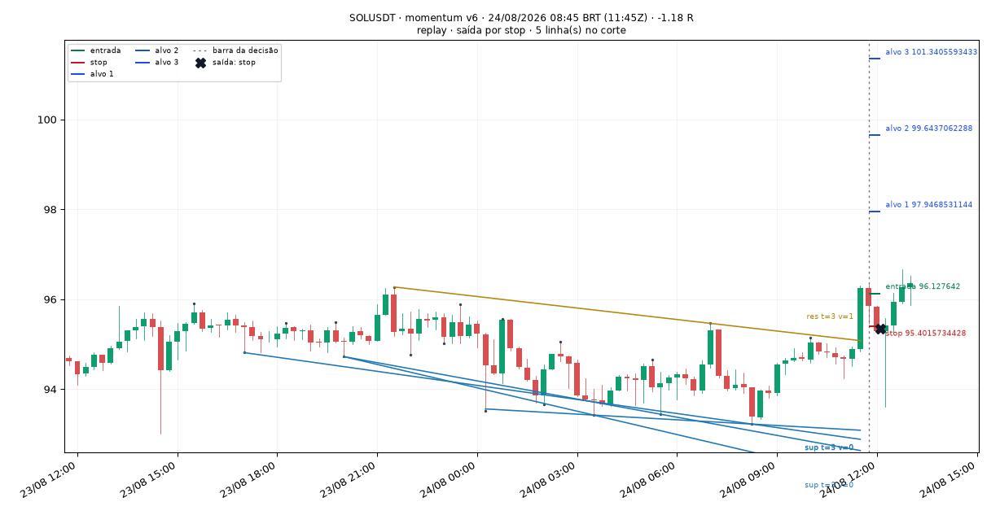

> Momentum 15m: fechamento 96.25 acima da máxima dos 20 fechamentos anteriores (95.31), retorno 15m 1.43%, volume relativo 4.10x da mediana de 96 barras, ATR% 0.59%

### 076 — ETHUSDT · 24/08/2026 08:45 BRT · -1.21 R

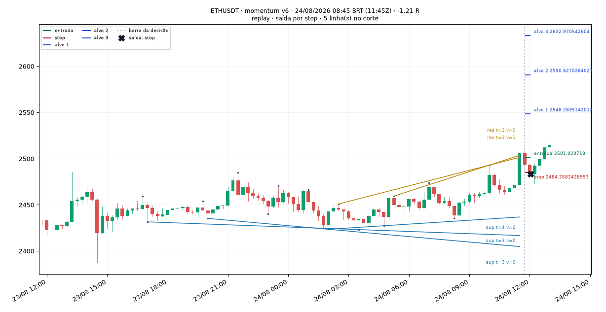

> Momentum 15m: fechamento 2505.94 acima da máxima dos 20 fechamentos anteriores (2482.26), retorno 15m 1.39%, volume relativo 6.26x da mediana de 96 barras, ATR% 0.56%

### 077 — DOGEUSDT · 24/08/2026 08:45 BRT · -0.51 R

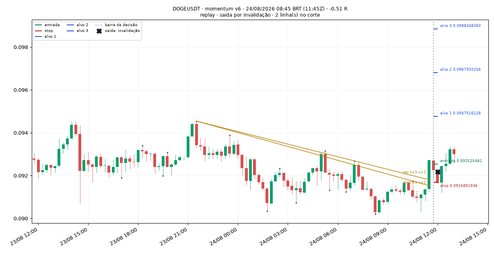

> Momentum 15m: fechamento 0.09271 acima da máxima dos 20 fechamentos anteriores (0.0925), retorno 15m 1.49%, volume relativo 2.70x da mediana de 96 barras, ATR% 0.73%

### 078 — SOLUSDT · 24/08/2026 10:00 BRT · -0.28 R

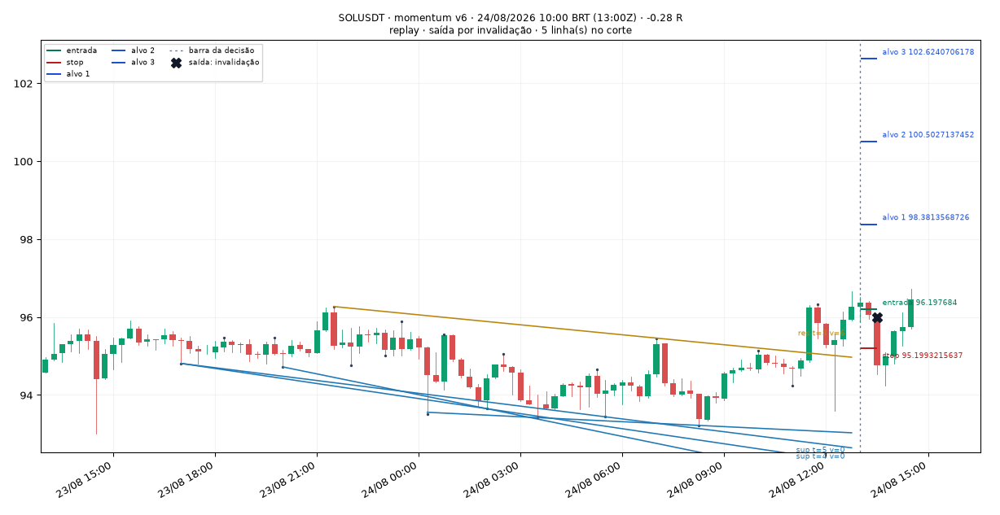

> Momentum 15m: fechamento 96.26 acima da máxima dos 20 fechamentos anteriores (96.25), retorno 15m 0.34%, volume relativo 3.11x da mediana de 96 barras, ATR% 0.73%

### 079 — DOGEUSDT · 24/08/2026 10:00 BRT · -0.76 R

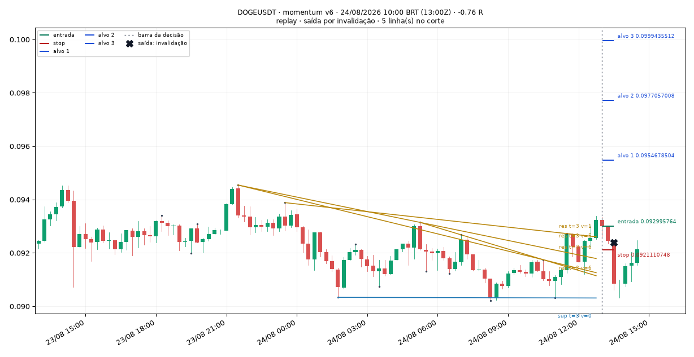

> Momentum 15m: fechamento 0.09323 acima da máxima dos 20 fechamentos anteriores (0.09271), retorno 15m 0.73%, volume relativo 2.39x da mediana de 96 barras, ATR% 0.80%

### 080 — XRPUSDT · 24/08/2026 10:00 BRT · -1.12 R

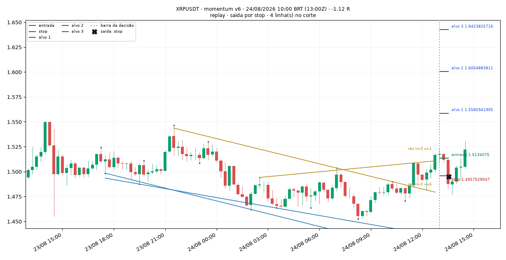

> Momentum 15m: fechamento 1.5167 acima da máxima dos 20 fechamentos anteriores (1.508), retorno 15m 0.98%, volume relativo 2.14x da mediana de 96 barras, ATR% 0.92%

### 081 — ETHUSDT · 24/08/2026 10:00 BRT · -1.16 R

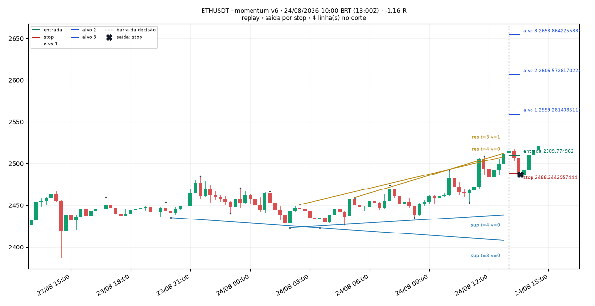

> Momentum 15m: fechamento 2511.99 acima da máxima dos 20 fechamentos anteriores (2505.94), retorno 15m 0.51%, volume relativo 4.49x da mediana de 96 barras, ATR% 0.63%

### 082 — ETHUSDT · 24/08/2026 11:30 BRT · -0.35 R

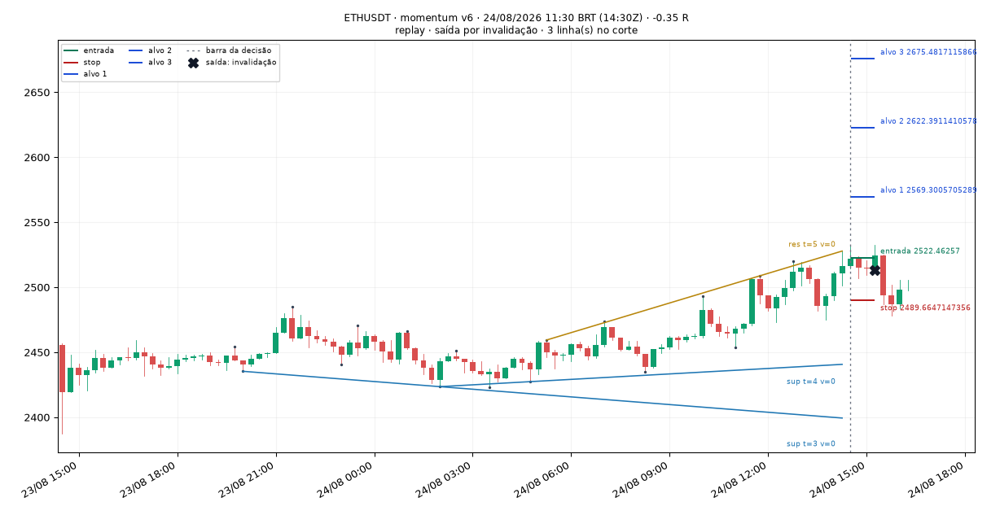

> Momentum 15m: fechamento 2516.21 acima da máxima dos 20 fechamentos anteriores (2514.97), retorno 15m 0.23%, volume relativo 4.48x da mediana de 96 barras, ATR% 0.70%

### 083 — SOLUSDT · 24/08/2026 11:45 BRT · -0.44 R

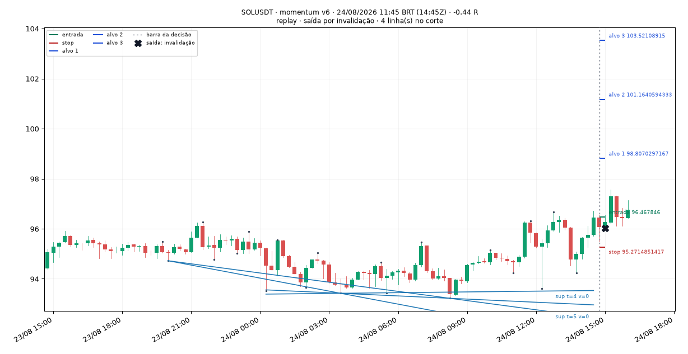

> Momentum 15m: fechamento 96.45 acima da máxima dos 20 fechamentos anteriores (96.36), retorno 15m 0.73%, volume relativo 3.03x da mediana de 96 barras, ATR% 0.81%

### 084 — XRPUSDT · 24/08/2026 11:45 BRT · -0.61 R

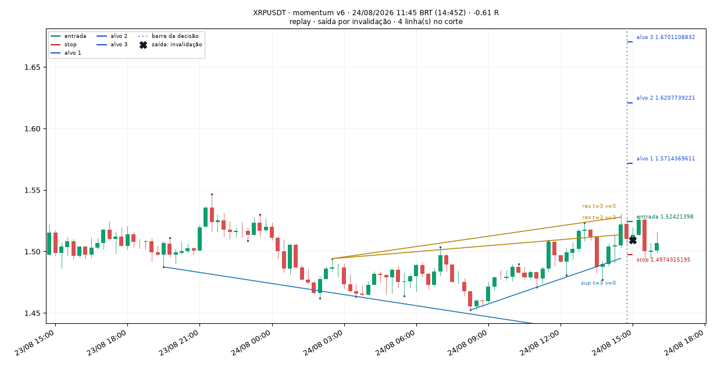

> Momentum 15m: fechamento 1.5221 acima da máxima dos 20 fechamentos anteriores (1.5176), retorno 15m 1.15%, volume relativo 2.76x da mediana de 96 barras, ATR% 1.08%

### 085 — SOLUSDT · 24/08/2026 12:30 BRT · -0.80 R

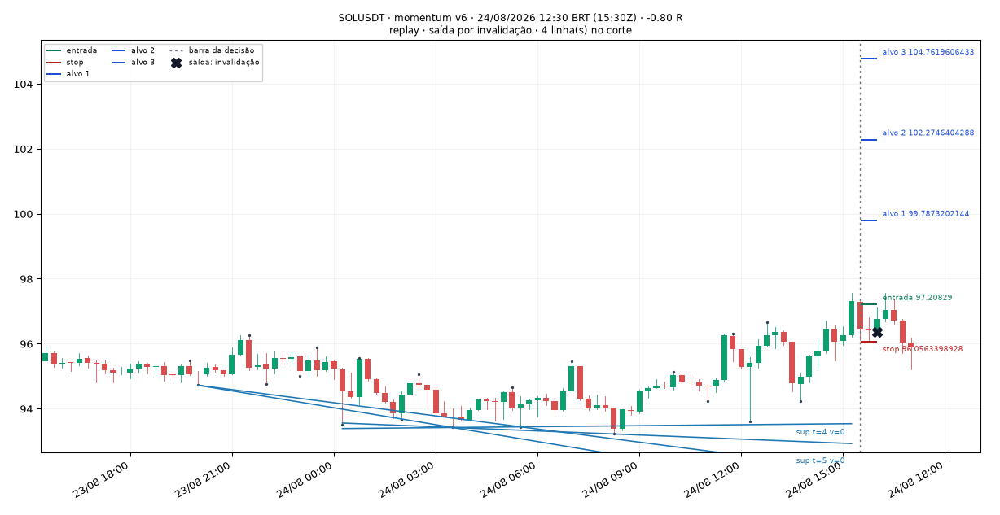

> Momentum 15m: fechamento 97.3 acima da máxima dos 20 fechamentos anteriores (96.45), retorno 15m 1.08%, volume relativo 3.66x da mediana de 96 barras, ATR% 0.85%

### 086 — SOLUSDT · 24/08/2026 19:45 BRT · -0.47 R

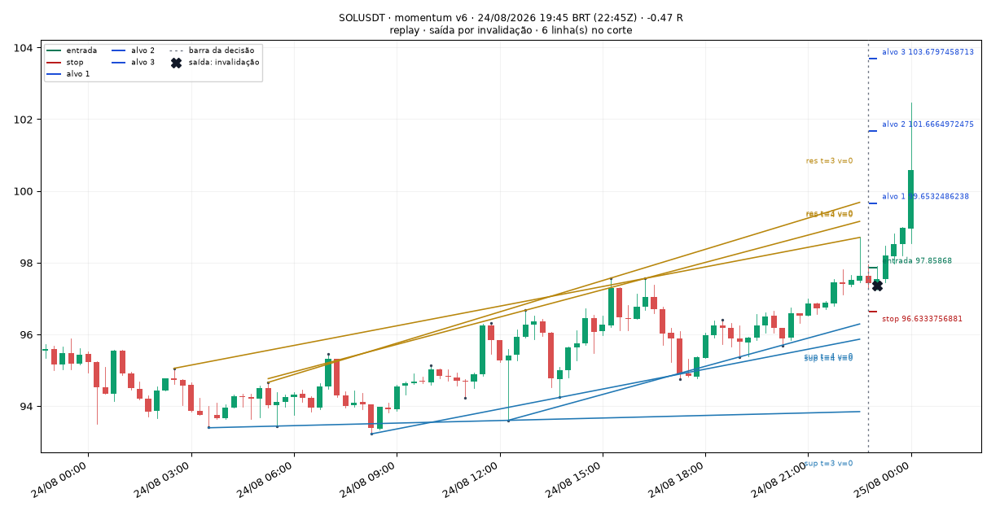

> Momentum 15m: fechamento 97.64 acima da máxima dos 20 fechamentos anteriores (97.51), retorno 15m 0.13%, volume relativo 3.46x da mediana de 96 barras, ATR% 0.69%

### 087 — SOLUSDT · 24/08/2026 21:15 BRT · +1.83 R

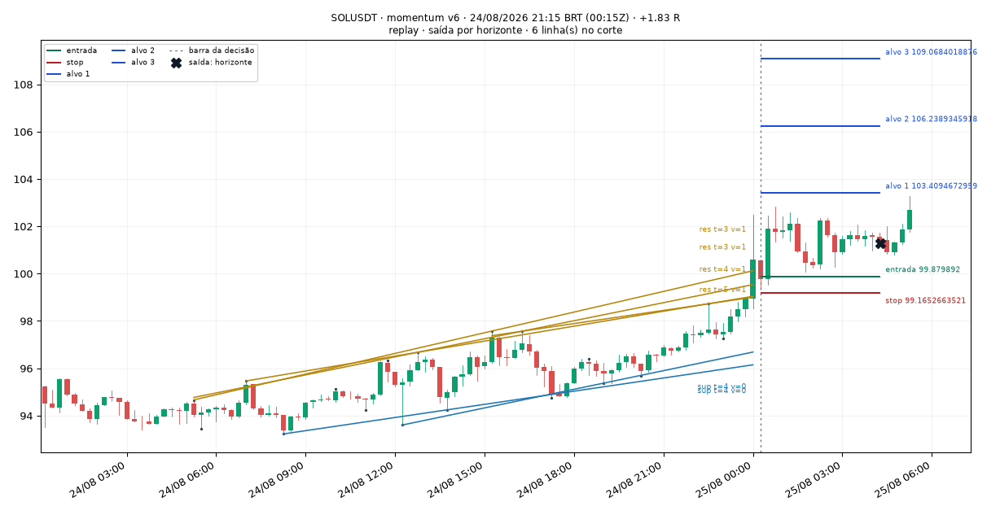

> Momentum 15m: fechamento 100.58 acima da máxima dos 20 fechamentos anteriores (98.96), retorno 15m 1.64%, volume relativo 9.37x da mediana de 96 barras, ATR% 0.94%

### 088 — XRPUSDT · 24/08/2026 21:45 BRT · +1.36 R

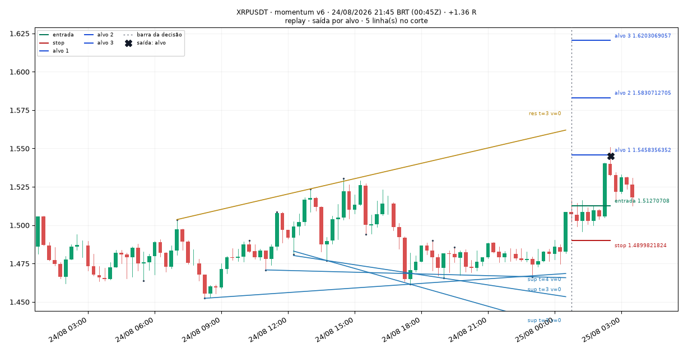

> Momentum 15m: fechamento 1.5086 acima da máxima dos 20 fechamentos anteriores (1.4883), retorno 15m 1.75%, volume relativo 1.65x da mediana de 96 barras, ATR% 0.82%

### 089 — ETHUSDT · 24/08/2026 22:00 BRT · -0.56 R

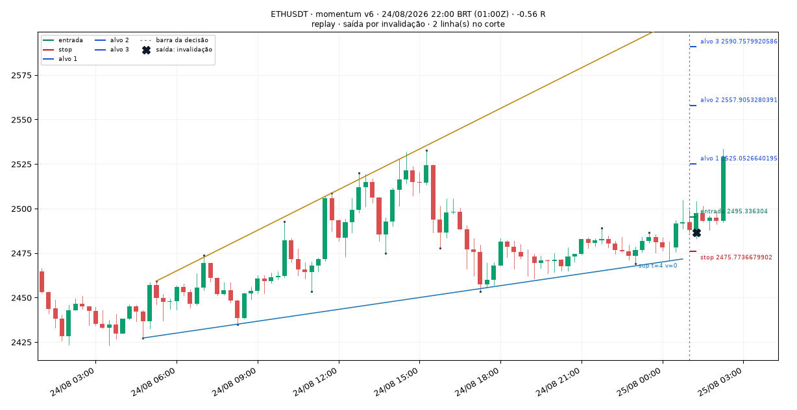

> Momentum 15m: fechamento 2492.2 acima da máxima dos 20 fechamentos anteriores (2491.54), retorno 15m 0.03%, volume relativo 2.38x da mediana de 96 barras, ATR% 0.44%

### 090 — DOGEUSDT · 24/08/2026 22:00 BRT · -0.56 R

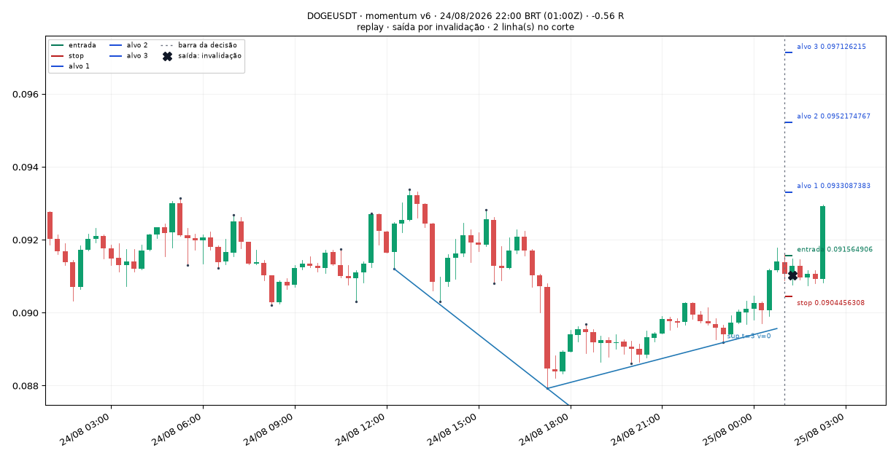

> Momentum 15m: fechamento 0.0914 acima da máxima dos 20 fechamentos anteriores (0.09116), retorno 15m 0.26%, volume relativo 1.77x da mediana de 96 barras, ATR% 0.70%

### 091 — DOGEUSDT · 24/08/2026 23:30 BRT · -1.14 R

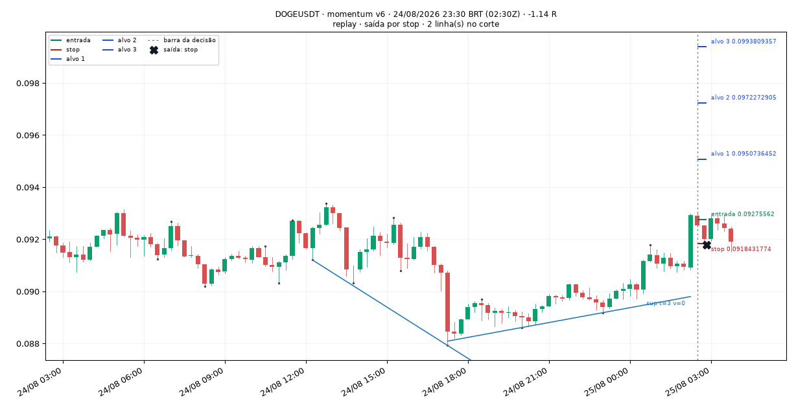

> Momentum 15m: fechamento 0.09292 acima da máxima dos 20 fechamentos anteriores (0.0914), retorno 15m 2.19%, volume relativo 3.48x da mediana de 96 barras, ATR% 0.77%

### 092 — ETHUSDT · 24/08/2026 23:30 BRT · -1.19 R

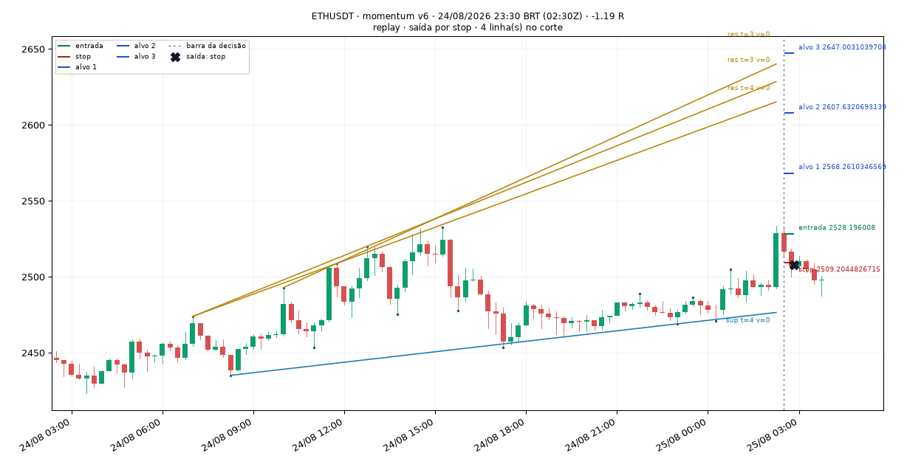

> Momentum 15m: fechamento 2528.89 acima da máxima dos 20 fechamentos anteriores (2497.38), retorno 15m 1.43%, volume relativo 5.75x da mediana de 96 barras, ATR% 0.52%

### 093 — SOLUSDT · 25/08/2026 02:30 BRT · -0.74 R

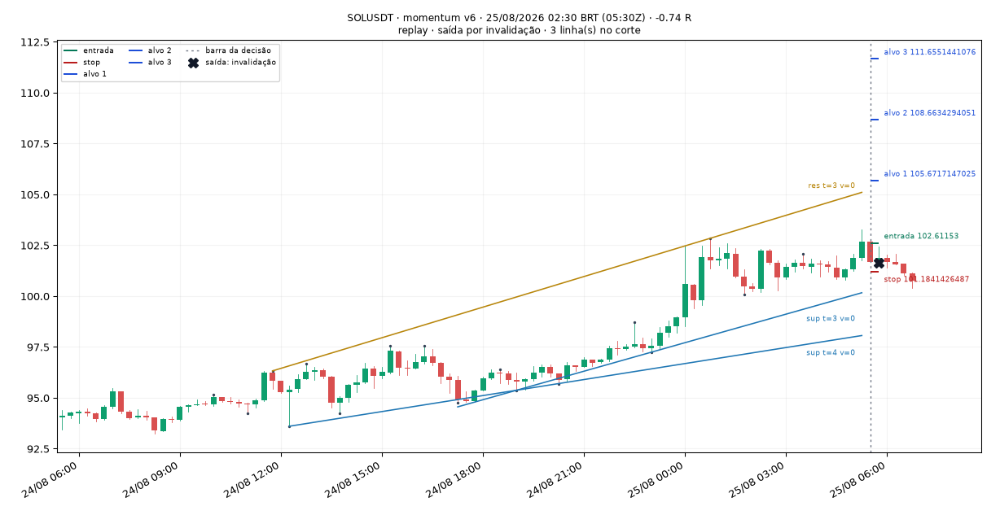

> Momentum 15m: fechamento 102.68 acima da máxima dos 20 fechamentos anteriores (102.25), retorno 15m 0.80%, volume relativo 1.80x da mediana de 96 barras, ATR% 0.97%

### 094 — SOLUSDT · 26/08/2026 07:45 BRT · -1.16 R

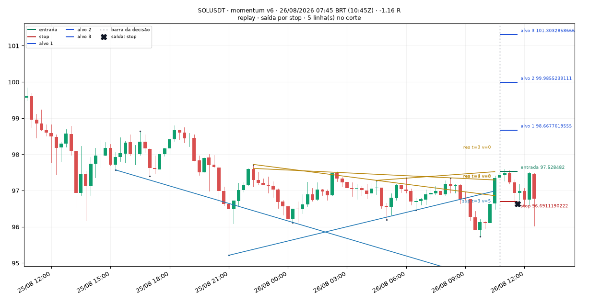

> Momentum 15m: fechamento 97.35 acima da máxima dos 20 fechamentos anteriores (97.18), retorno 15m 0.75%, volume relativo 2.20x da mediana de 96 barras, ATR% 0.45%

### 095 — ETHUSDT · 26/08/2026 08:00 BRT · -1.24 R

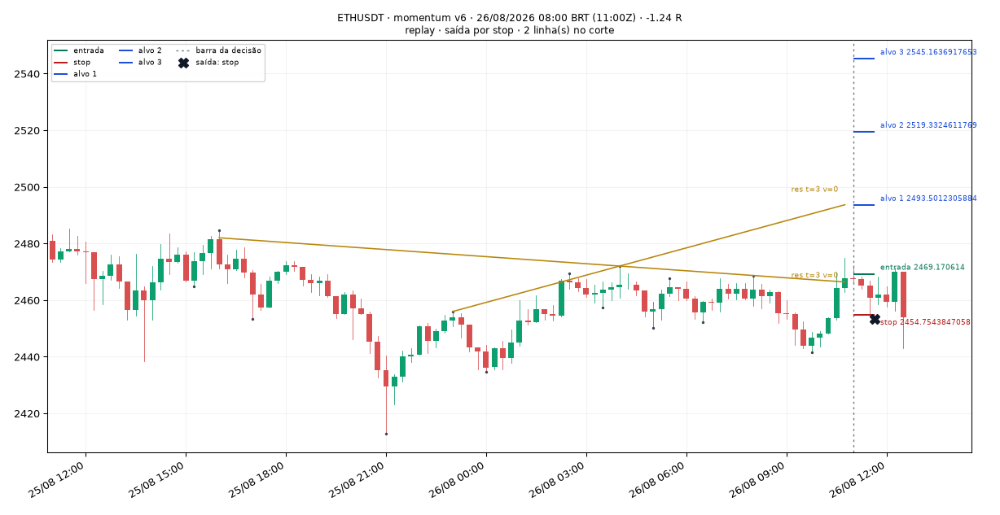

> Momentum 15m: fechamento 2467.67 acima da máxima dos 20 fechamentos anteriores (2464.17), retorno 15m 0.14%, volume relativo 2.32x da mediana de 96 barras, ATR% 0.35%

### 096 — DOGEUSDT · 26/08/2026 08:00 BRT · -0.36 R

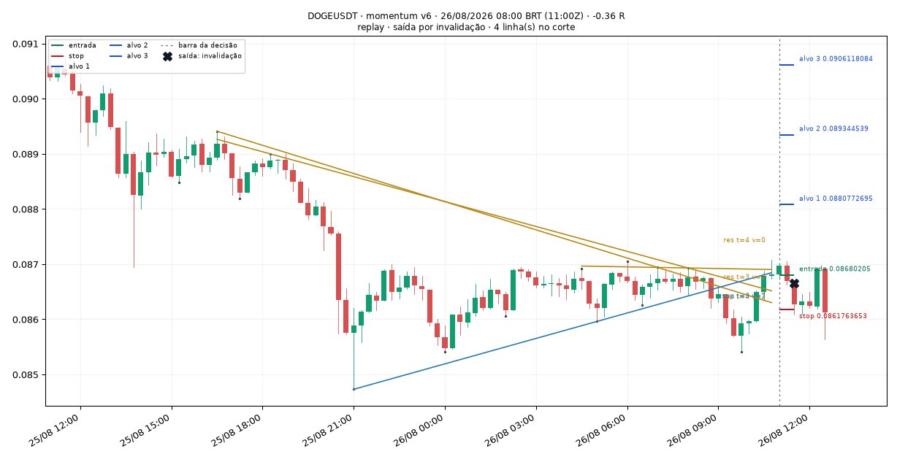

> Momentum 15m: fechamento 0.08681 acima da máxima dos 20 fechamentos anteriores (0.08678), retorno 15m 0.03%, volume relativo 1.50x da mediana de 96 barras, ATR% 0.49%

### 097 — ETHUSDT · 26/08/2026 15:15 BRT · -0.49 R

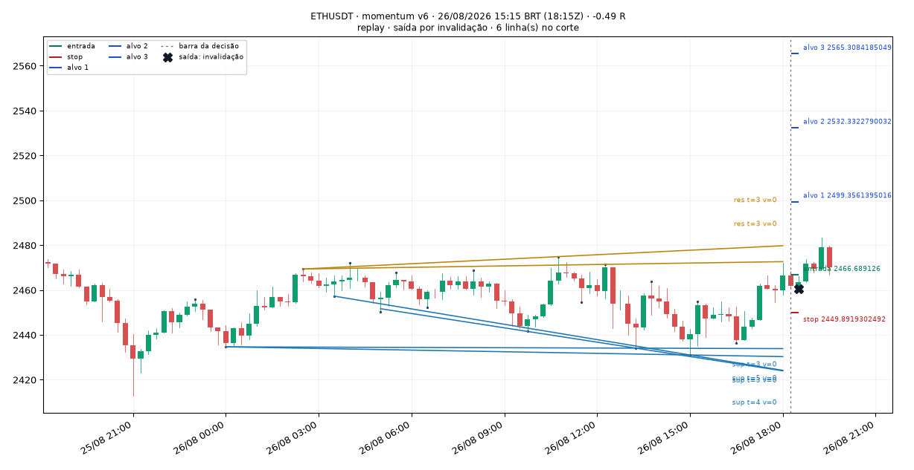

> Momentum 15m: fechamento 2466.38 acima da máxima dos 20 fechamentos anteriores (2461.98), retorno 15m 0.26%, volume relativo 1.88x da mediana de 96 barras, ATR% 0.45%

### 098 — ETHUSDT · 26/08/2026 16:30 BRT · -0.78 R

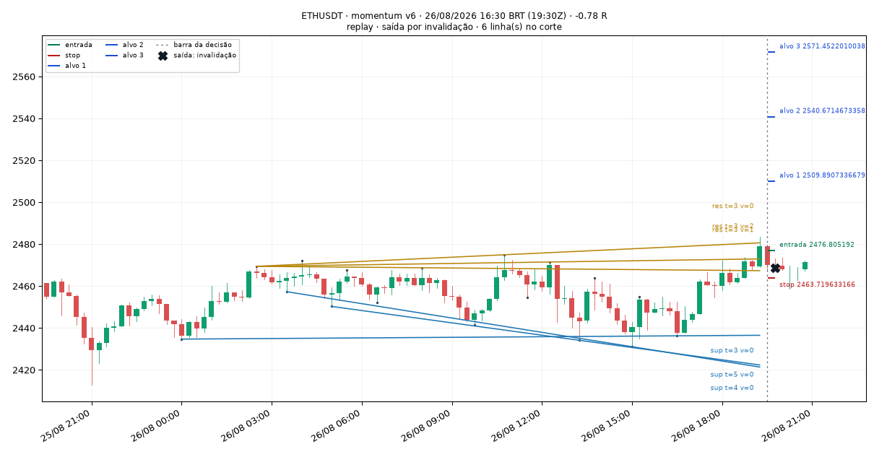

> Momentum 15m: fechamento 2479.11 acima da máxima dos 20 fechamentos anteriores (2471.72), retorno 15m 0.39%, volume relativo 2.88x da mediana de 96 barras, ATR% 0.41%

### 099 — SOLUSDT · 26/08/2026 18:15 BRT · +1.51 R

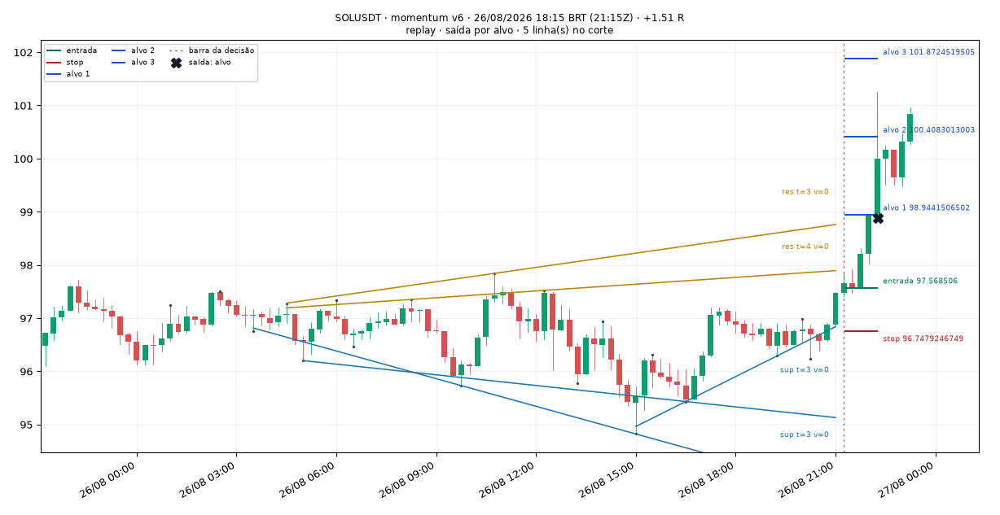

> Momentum 15m: fechamento 97.48 acima da máxima dos 20 fechamentos anteriores (97.12), retorno 15m 0.62%, volume relativo 1.75x da mediana de 96 barras, ATR% 0.50%

### 100 — ETHUSDT · 26/08/2026 18:15 BRT · -0.41 R

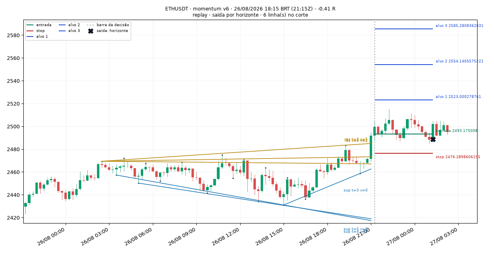

> Momentum 15m: fechamento 2491.86 acima da máxima dos 20 fechamentos anteriores (2479.11), retorno 15m 0.83%, volume relativo 3.93x da mediana de 96 barras, ATR% 0.42%

### 101 — DOGEUSDT · 26/08/2026 18:30 BRT · +2.52 R

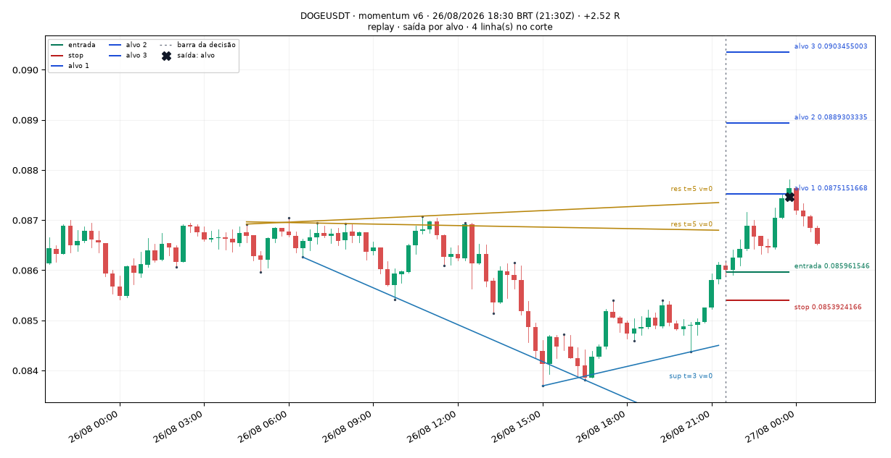

> Momentum 15m: fechamento 0.0861 acima da máxima dos 20 fechamentos anteriores (0.08581), retorno 15m 0.34%, volume relativo 2.00x da mediana de 96 barras, ATR% 0.55%

### 102 — XRPUSDT · 26/08/2026 19:15 BRT · -0.49 R

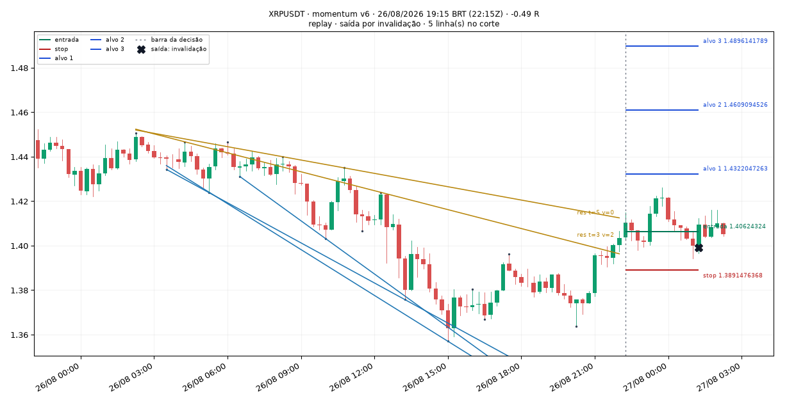

> Momentum 15m: fechamento 1.4035 acima da máxima dos 20 fechamentos anteriores (1.4004), retorno 15m 0.22%, volume relativo 1.62x da mediana de 96 barras, ATR% 0.68%

### 103 — SOLUSDT · 26/08/2026 20:15 BRT · +1.42 R

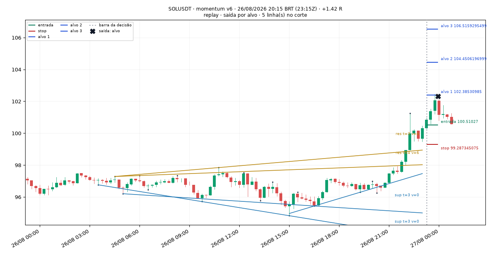

> Momentum 15m: fechamento 100.32 acima da máxima dos 20 fechamentos anteriores (100.16), retorno 15m 0.67%, volume relativo 2.67x da mediana de 96 barras, ATR% 0.69%

### 104 — SOLUSDT · 27/08/2026 03:00 BRT · -0.74 R

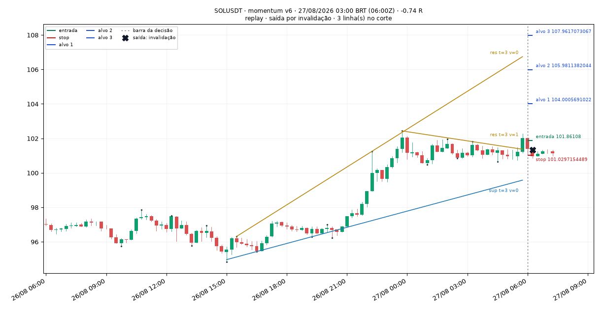

> Momentum 15m: fechamento 102.02 acima da máxima dos 20 fechamentos anteriores (101.66), retorno 15m 0.78%, volume relativo 2.65x da mediana de 96 barras, ATR% 0.65%

### 105 — XRPUSDT · 27/08/2026 05:15 BRT · +3.24 R

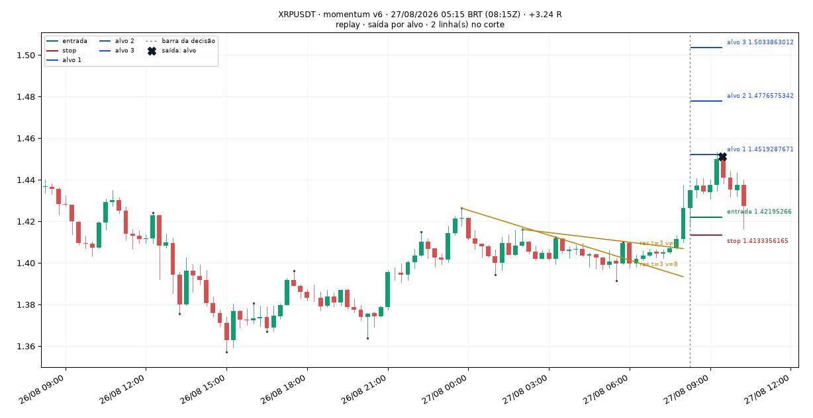

> Momentum 15m: fechamento 1.4262 acima da máxima dos 20 fechamentos anteriores (1.4118), retorno 15m 1.04%, volume relativo 5.09x da mediana de 96 barras, ATR% 0.60%

### 106 — ETHUSDT · 27/08/2026 05:15 BRT · +2.51 R

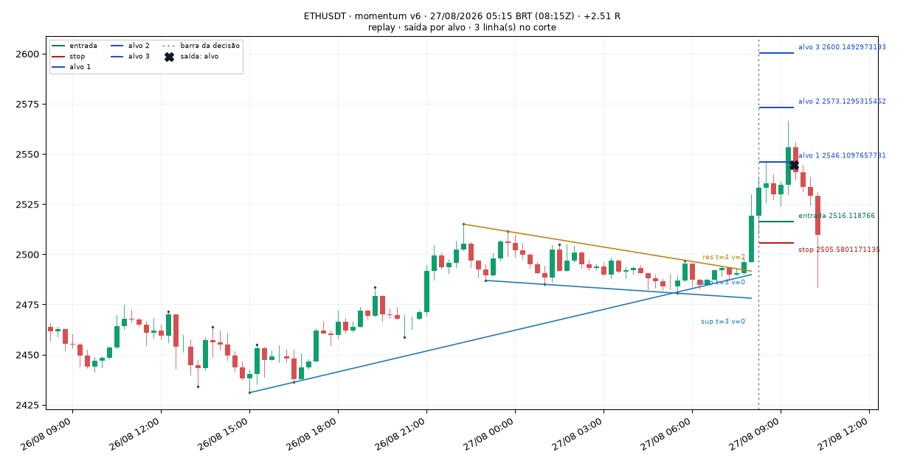

> Momentum 15m: fechamento 2519.09 acima da máxima dos 20 fechamentos anteriores (2496.78), retorno 15m 0.92%, volume relativo 8.40x da mediana de 96 barras, ATR% 0.36%

### 107 — SOLUSDT · 27/08/2026 05:15 BRT · +2.56 R

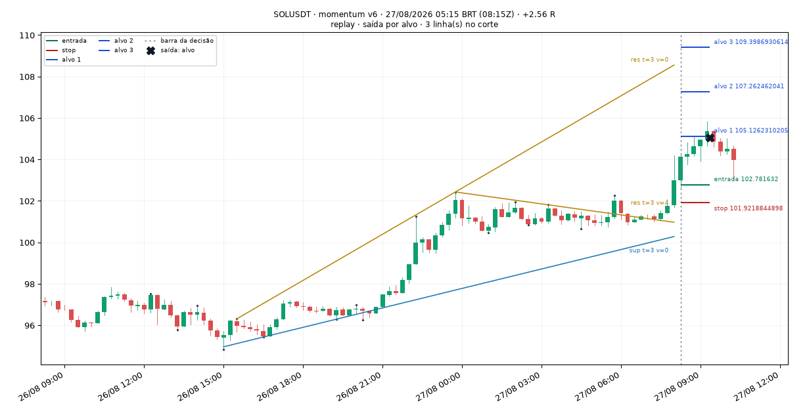

> Momentum 15m: fechamento 102.99 acima da máxima dos 20 fechamentos anteriores (102.02), retorno 15m 1.20%, volume relativo 8.23x da mediana de 96 barras, ATR% 0.69%

### 108 — DOGEUSDT · 27/08/2026 05:15 BRT · +2.47 R

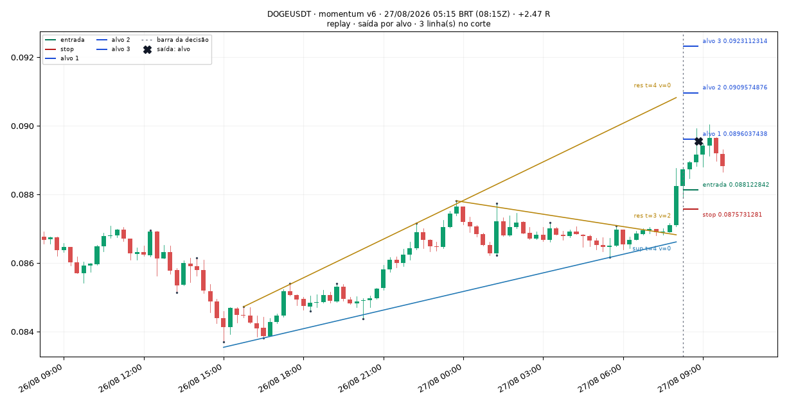

> Momentum 15m: fechamento 0.08825 acima da máxima dos 20 fechamentos anteriores (0.0871), retorno 15m 1.32%, volume relativo 5.47x da mediana de 96 barras, ATR% 0.51%

### 109 — SOLUSDT · 27/08/2026 11:00 BRT · +1.93 R

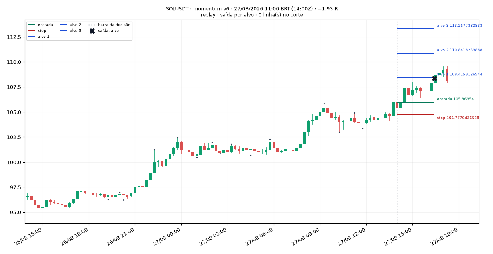

> Momentum 15m: fechamento 105.99 acima da máxima dos 20 fechamentos anteriores (105.36), retorno 15m 1.36%, volume relativo 5.72x da mediana de 96 barras, ATR% 0.76%

### 110 — XRPUSDT · 27/08/2026 11:30 BRT · -1.14 R

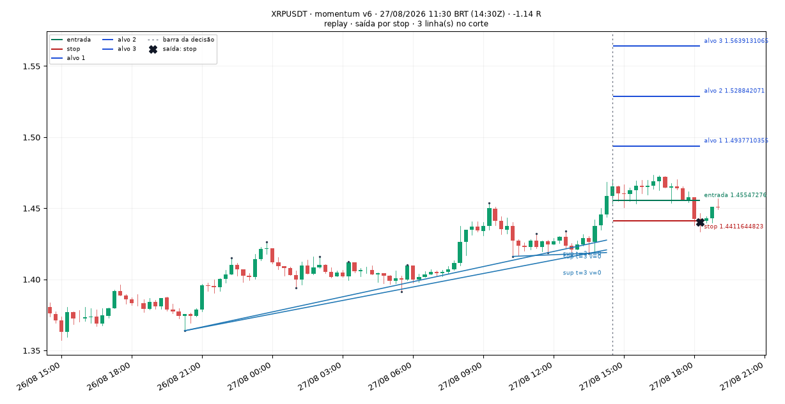

> Momentum 15m: fechamento 1.4587 acima da máxima dos 20 fechamentos anteriores (1.4499), retorno 15m 0.90%, volume relativo 4.01x da mediana de 96 barras, ATR% 0.80%

### 111 — DOGEUSDT · 27/08/2026 11:45 BRT · -0.44 R

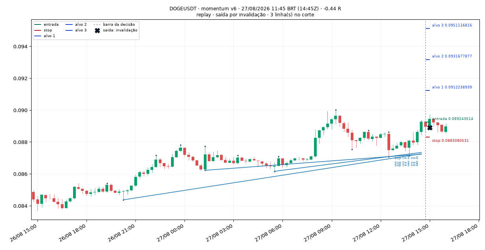

> Momentum 15m: fechamento 0.08928 acima da máxima dos 20 fechamentos anteriores (0.08919), retorno 15m 0.73%, volume relativo 2.08x da mediana de 96 barras, ATR% 0.73%

### 112 — DOGEUSDT · 27/08/2026 13:45 BRT · -0.61 R

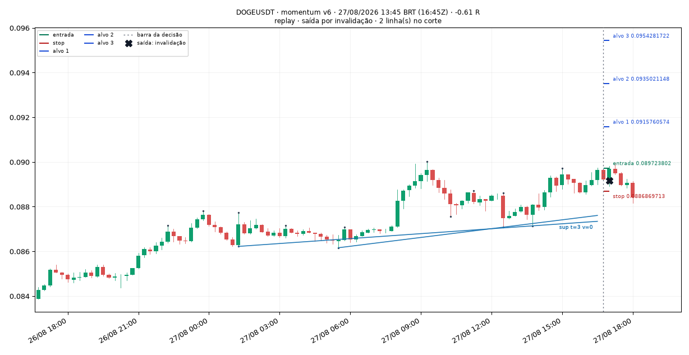

> Momentum 15m: fechamento 0.08965 acima da máxima dos 20 fechamentos anteriores (0.08945), retorno 15m 0.52%, volume relativo 1.58x da mediana de 96 barras, ATR% 0.72%

### 113 — SOLUSDT · 27/08/2026 17:00 BRT · -0.31 R

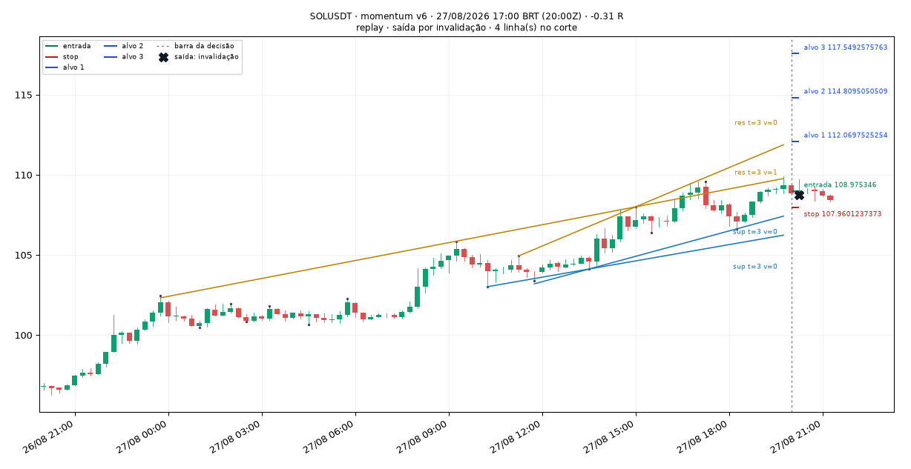

> Momentum 15m: fechamento 109.33 acima da máxima dos 20 fechamentos anteriores (109.22), retorno 15m 0.21%, volume relativo 2.54x da mediana de 96 barras, ATR% 0.84%

### 114 — XRPUSDT · 27/08/2026 22:30 BRT · -1.18 R

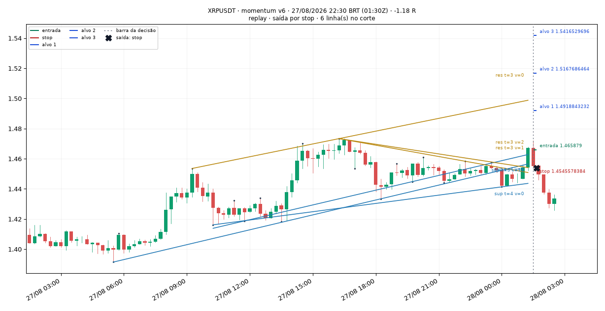

> Momentum 15m: fechamento 1.467 acima da máxima dos 20 fechamentos anteriores (1.4552), retorno 15m 0.89%, volume relativo 1.68x da mediana de 96 barras, ATR% 0.57%

### 115 — DOGEUSDT · 27/08/2026 22:30 BRT · -1.19 R

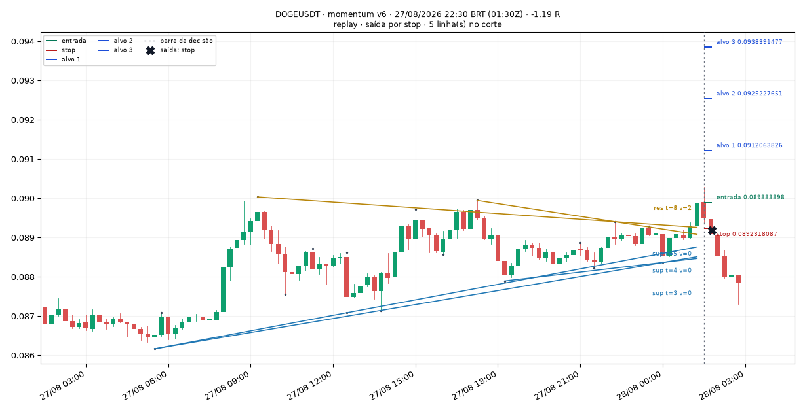

> Momentum 15m: fechamento 0.08989 acima da máxima dos 20 fechamentos anteriores (0.0893), retorno 15m 0.66%, volume relativo 1.91x da mediana de 96 barras, ATR% 0.49%

### 116 — XRPUSDT · 28/08/2026 08:15 BRT · -0.59 R

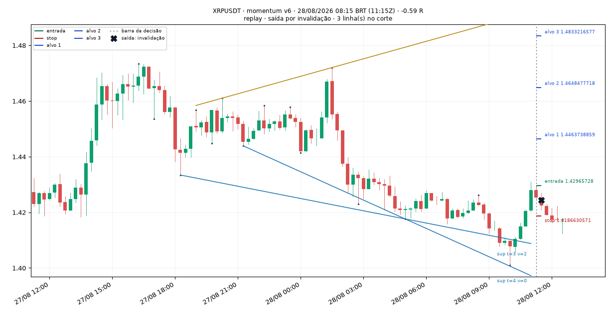

> Momentum 15m: fechamento 1.4279 acima da máxima dos 20 fechamentos anteriores (1.4269), retorno 15m 0.52%, volume relativo 2.07x da mediana de 96 barras, ATR% 0.43%

### 117 — DOGEUSDT · 28/08/2026 11:45 BRT · -0.87 R

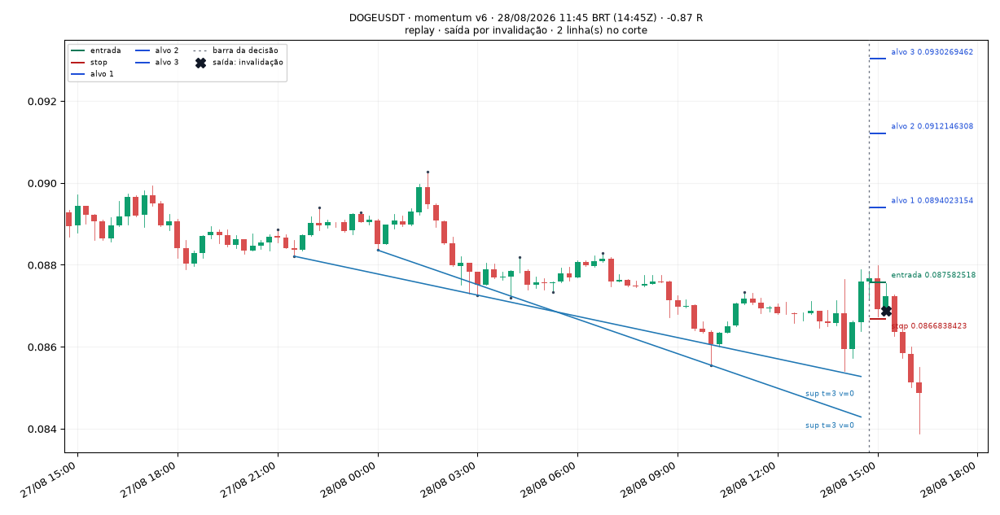

> Momentum 15m: fechamento 0.08759 acima da máxima dos 20 fechamentos anteriores (0.08717), retorno 15m 1.15%, volume relativo 5.28x da mediana de 96 barras, ATR% 0.69%

### 118 — ETHUSDT · 28/08/2026 11:45 BRT · -0.42 R

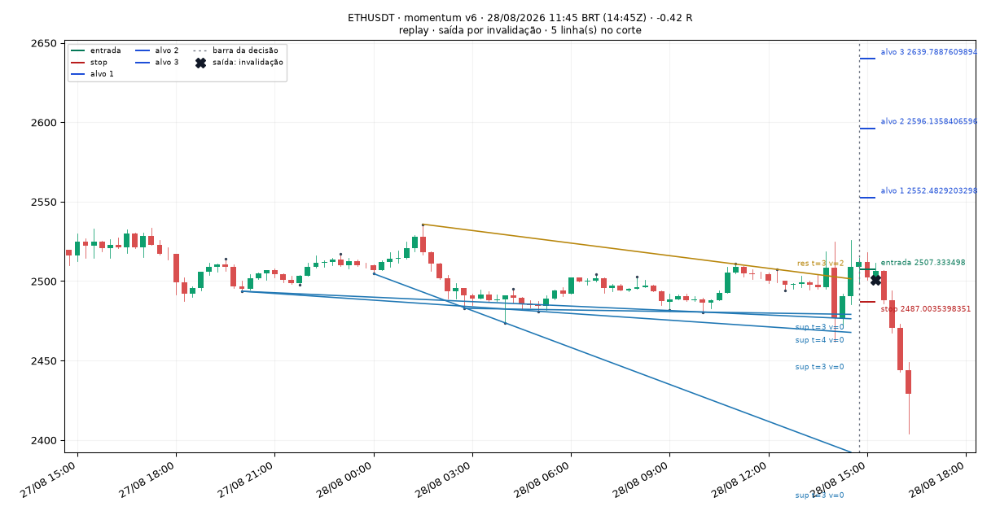

> Momentum 15m: fechamento 2508.83 acima da máxima dos 20 fechamentos anteriores (2508.72), retorno 15m 0.73%, volume relativo 9.67x da mediana de 96 barras, ATR% 0.58%

### 119 — XRPUSDT · 28/08/2026 12:00 BRT · -0.75 R

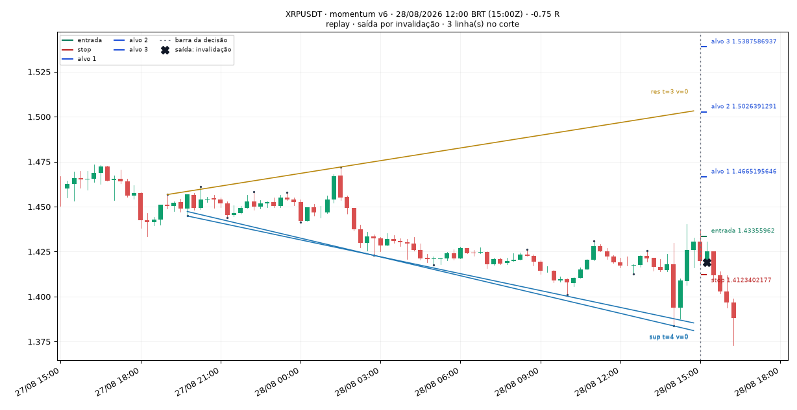

> Momentum 15m: fechamento 1.4304 acima da máxima dos 20 fechamentos anteriores (1.4279), retorno 15m 0.33%, volume relativo 2.76x da mediana de 96 barras, ATR% 0.84%

### 120 — SOLUSDT · 28/08/2026 12:30 BRT · -0.76 R

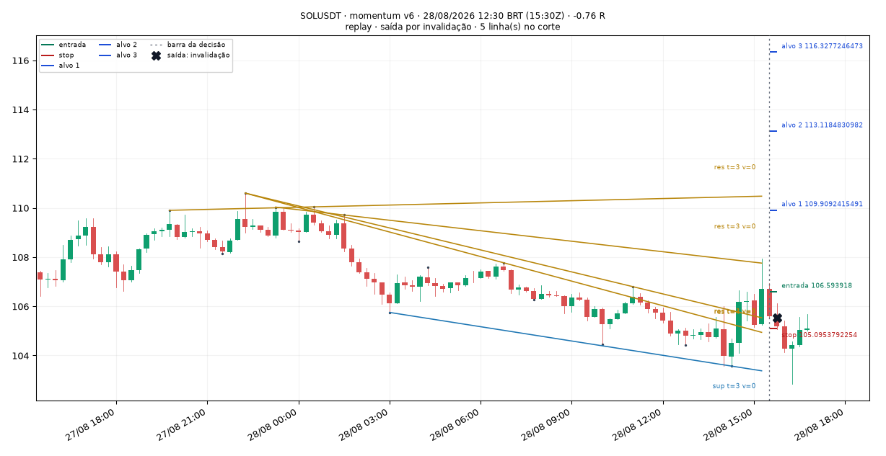

> Momentum 15m: fechamento 106.7 acima da máxima dos 20 fechamentos anteriores (106.39), retorno 15m 1.38%, volume relativo 7.92x da mediana de 96 barras, ATR% 1.00%

### 121 — SOLUSDT · 29/08/2026 11:45 BRT · -1.24 R

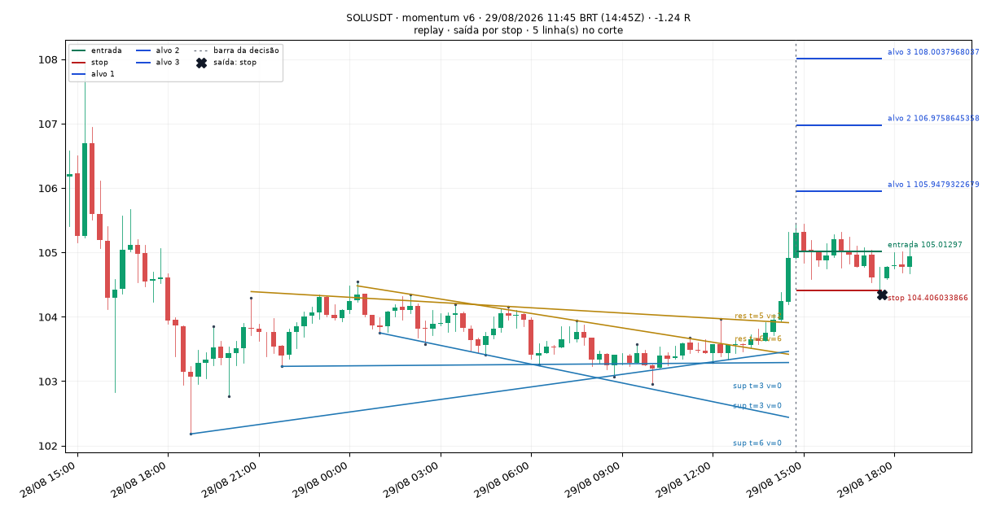

> Momentum 15m: fechamento 104.92 acima da máxima dos 20 fechamentos anteriores (104.24), retorno 15m 0.65%, volume relativo 5.72x da mediana de 96 barras, ATR% 0.33%

### 122 — SOLUSDT · 29/08/2026 16:30 BRT · -0.97 R

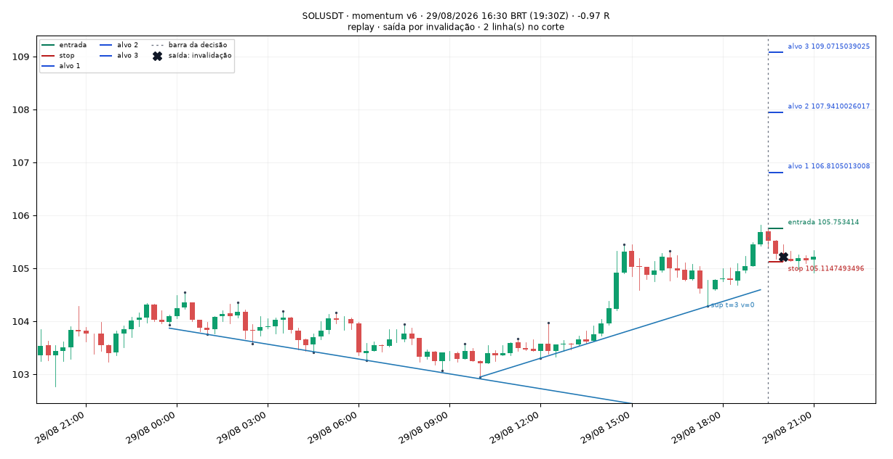

> Momentum 15m: fechamento 105.68 acima da máxima dos 20 fechamentos anteriores (105.45), retorno 15m 0.22%, volume relativo 2.33x da mediana de 96 barras, ATR% 0.36%

### 123 — SOLUSDT · 30/08/2026 10:00 BRT · +1.52 R

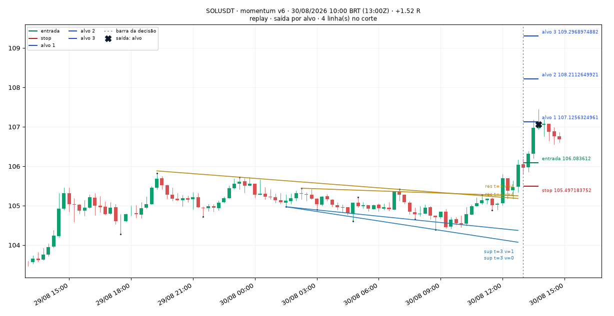

> Momentum 15m: fechamento 106.04 acima da máxima dos 20 fechamentos anteriores (105.7), retorno 15m 0.54%, volume relativo 2.90x da mediana de 96 barras, ATR% 0.34%

### 124 — DOGEUSDT · 30/08/2026 10:00 BRT · -0.67 R

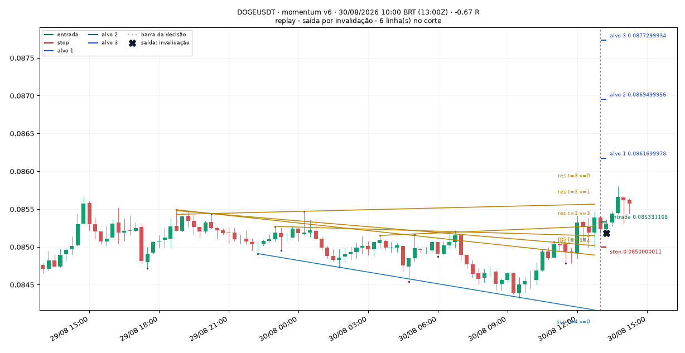

> Momentum 15m: fechamento 0.08539 acima da máxima dos 20 fechamentos anteriores (0.08532), retorno 15m 0.23%, volume relativo 1.82x da mediana de 96 barras, ATR% 0.30%

### 125 — XRPUSDT · 30/08/2026 11:00 BRT · -1.31 R

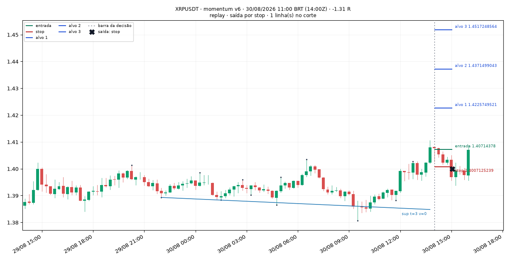

> Momentum 15m: fechamento 1.408 acima da máxima dos 20 fechamentos anteriores (1.4023), retorno 15m 0.41%, volume relativo 3.74x da mediana de 96 barras, ATR% 0.35%

### 126 — DOGEUSDT · 30/08/2026 11:00 BRT · -0.90 R

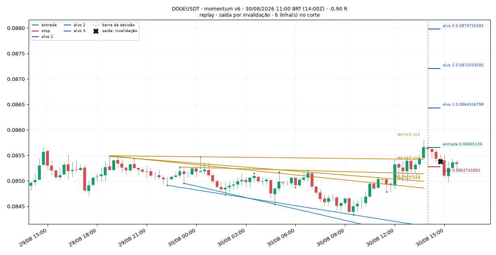

> Momentum 15m: fechamento 0.08566 acima da máxima dos 20 fechamentos anteriores (0.08544), retorno 15m 0.26%, volume relativo 3.52x da mediana de 96 barras, ATR% 0.30%

### 127 — ETHUSDT · 30/08/2026 13:15 BRT · -1.18 R

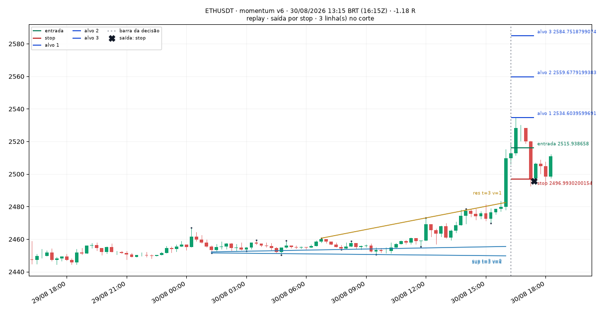

> Momentum 15m: fechamento 2509.53 acima da máxima dos 20 fechamentos anteriores (2479.91), retorno 15m 1.19%, volume relativo 16.87x da mediana de 96 barras, ATR% 0.33%

### 128 — DOGEUSDT · 30/08/2026 13:15 BRT · -1.21 R

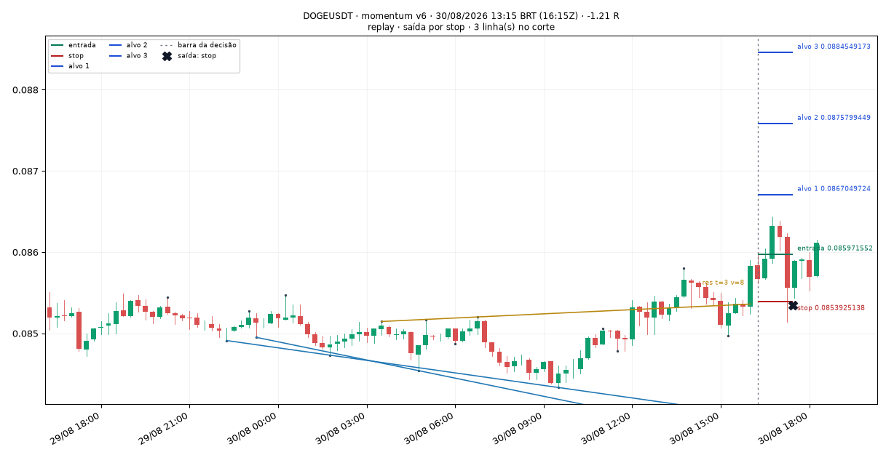

> Momentum 15m: fechamento 0.08583 acima da máxima dos 20 fechamentos anteriores (0.08566), retorno 15m 0.59%, volume relativo 3.23x da mediana de 96 barras, ATR% 0.34%

### 129 — XRPUSDT · 30/08/2026 13:45 BRT · +1.32 R

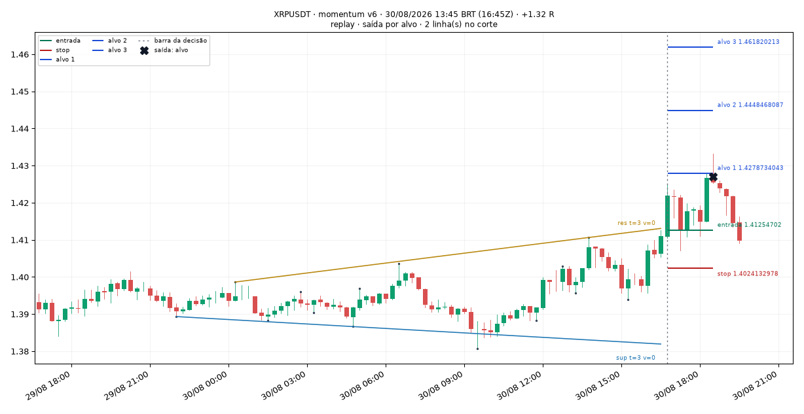

> Momentum 15m: fechamento 1.4109 acima da máxima dos 20 fechamentos anteriores (1.408), retorno 15m 0.34%, volume relativo 2.51x da mediana de 96 barras, ATR% 0.40%

### 130 — DOGEUSDT · 30/08/2026 15:45 BRT · -0.29 R

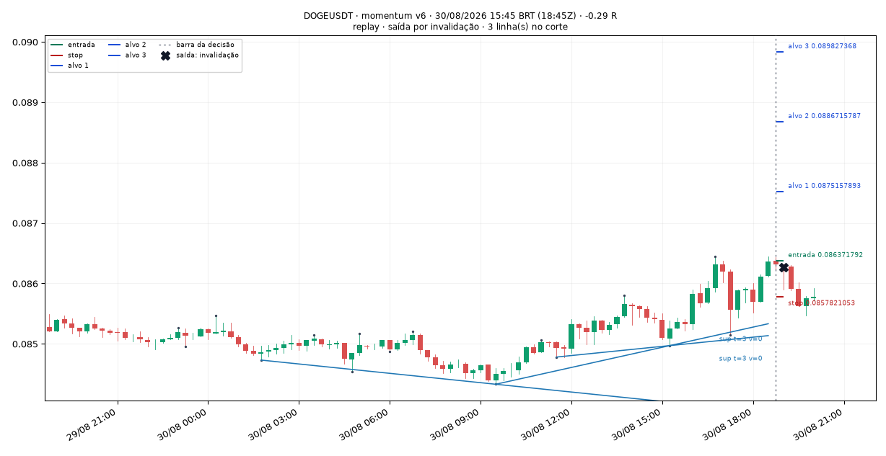

> Momentum 15m: fechamento 0.08636 acima da máxima dos 20 fechamentos anteriores (0.08632), retorno 15m 0.29%, volume relativo 2.21x da mediana de 96 barras, ATR% 0.45%

### 131 — ETHUSDT · 31/08/2026 02:30 BRT · +0.37 R

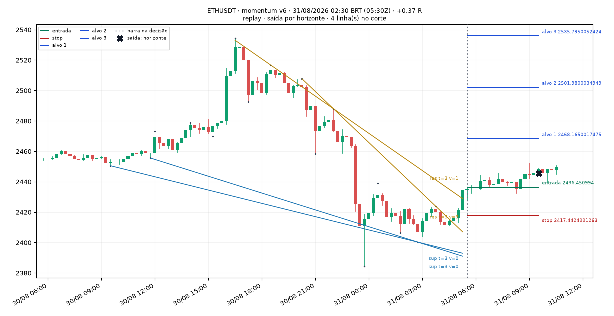

> Momentum 15m: fechamento 2434.35 acima da máxima dos 20 fechamentos anteriores (2431.11), retorno 15m 0.54%, volume relativo 4.54x da mediana de 96 barras, ATR% 0.46%

### 132 — SOLUSDT · 31/08/2026 02:30 BRT · +0.24 R

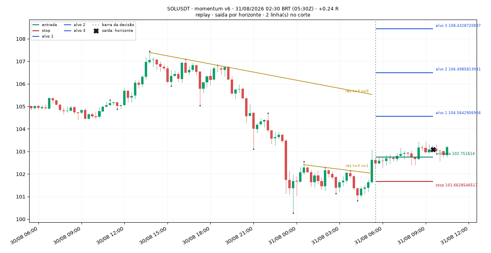

> Momentum 15m: fechamento 102.63 acima da máxima dos 20 fechamentos anteriores (102.28), retorno 15m 0.98%, volume relativo 4.78x da mediana de 96 barras, ATR% 0.63%

### 133 — DOGEUSDT · 31/08/2026 02:30 BRT · -0.18 R

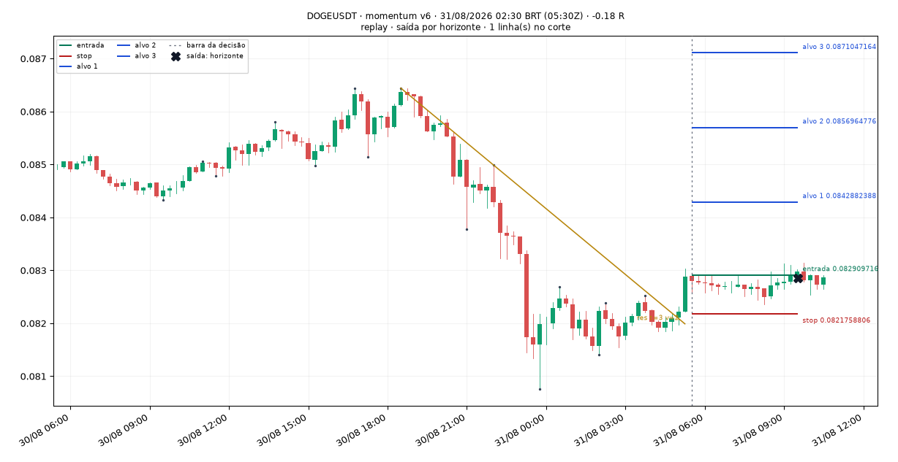

> Momentum 15m: fechamento 0.08288 acima da máxima dos 20 fechamentos anteriores (0.08247), retorno 15m 0.80%, volume relativo 3.64x da mediana de 96 barras, ATR% 0.57%

### 134 — SOLUSDT · 31/08/2026 08:00 BRT · -1.20 R

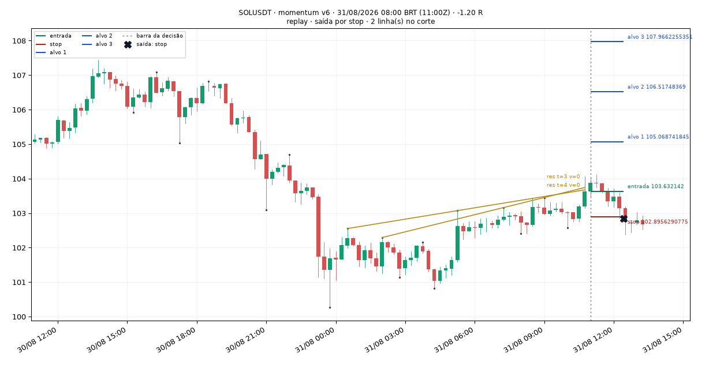

> Momentum 15m: fechamento 103.62 acima da máxima dos 20 fechamentos anteriores (103.19), retorno 15m 0.42%, volume relativo 2.76x da mediana de 96 barras, ATR% 0.47%

### 135 — ETHUSDT · 31/08/2026 11:45 BRT · +0.71 R

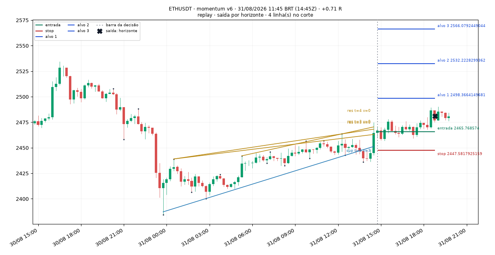

> Momentum 15m: fechamento 2464.51 acima da máxima dos 20 fechamentos anteriores (2454.37), retorno 15m 0.81%, volume relativo 4.52x da mediana de 96 barras, ATR% 0.46%

### 136 — SOLUSDT · 31/08/2026 15:30 BRT · -0.35 R

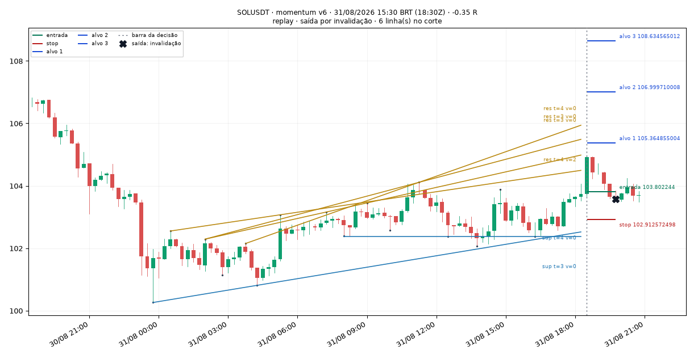

> Momentum 15m: fechamento 103.73 acima da máxima dos 20 fechamentos anteriores (103.65), retorno 15m 0.08%, volume relativo 1.50x da mediana de 96 barras, ATR% 0.53%

### 137 — XRPUSDT · 01/09/2026 00:45 BRT · -0.66 R

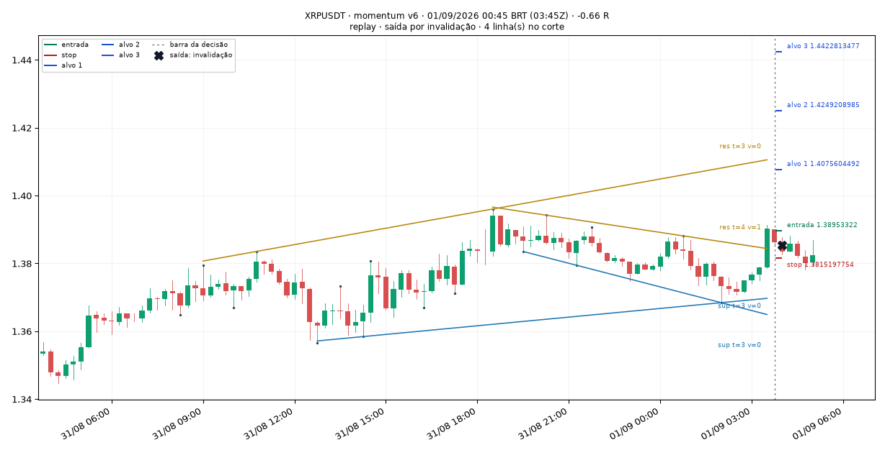

> Momentum 15m: fechamento 1.3902 acima da máxima dos 20 fechamentos anteriores (1.3865), retorno 15m 0.83%, volume relativo 1.91x da mediana de 96 barras, ATR% 0.42%

### 138 — SOLUSDT · 01/09/2026 00:45 BRT · -1.18 R

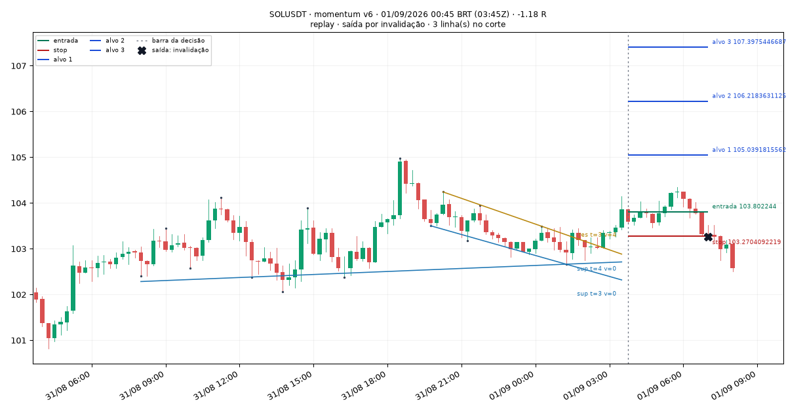

> Momentum 15m: fechamento 103.86 acima da máxima dos 20 fechamentos anteriores (103.46), retorno 15m 0.39%, volume relativo 1.66x da mediana de 96 barras, ATR% 0.38%

### 139 — DOGEUSDT · 01/09/2026 00:45 BRT · -0.59 R

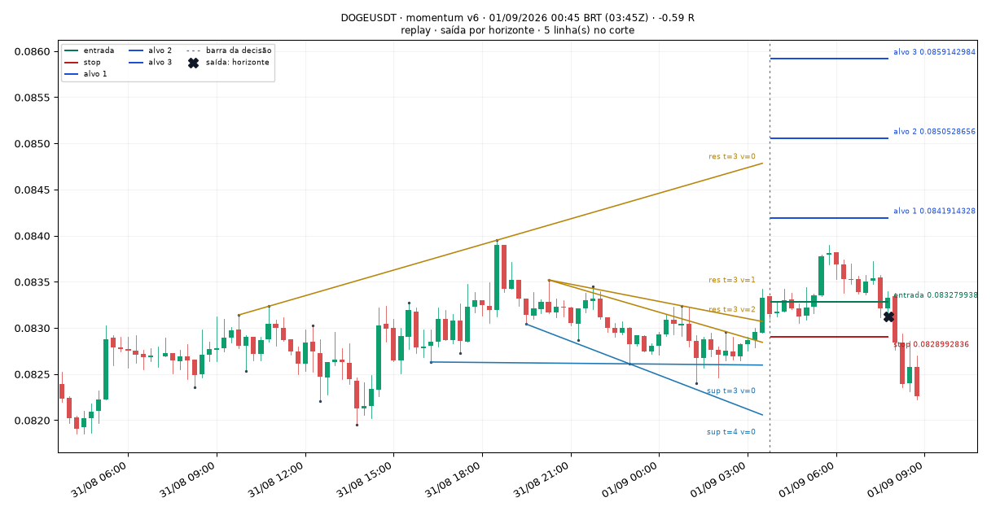

> Momentum 15m: fechamento 0.08333 acima da máxima dos 20 fechamentos anteriores (0.08309), retorno 15m 0.45%, volume relativo 1.95x da mediana de 96 barras, ATR% 0.34%

### 140 — ETHUSDT · 01/09/2026 00:45 BRT · -0.69 R

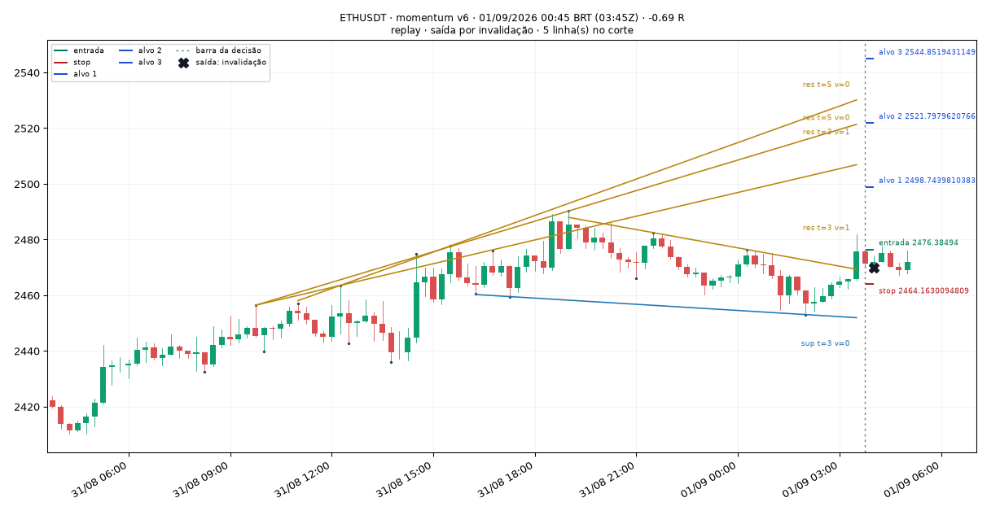

> Momentum 15m: fechamento 2475.69 acima da máxima dos 20 fechamentos anteriores (2474.26), retorno 15m 0.40%, volume relativo 2.52x da mediana de 96 barras, ATR% 0.31%

### 141 — XRPUSDT · 01/09/2026 03:00 BRT · -0.69 R

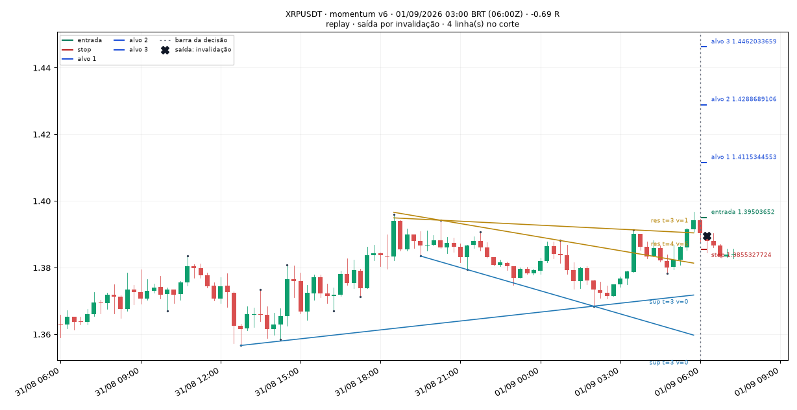

> Momentum 15m: fechamento 1.3942 acima da máxima dos 20 fechamentos anteriores (1.3915), retorno 15m 0.19%, volume relativo 1.58x da mediana de 96 barras, ATR% 0.41%

### 142 — ETHUSDT · 01/09/2026 20:45 BRT · -0.57 R

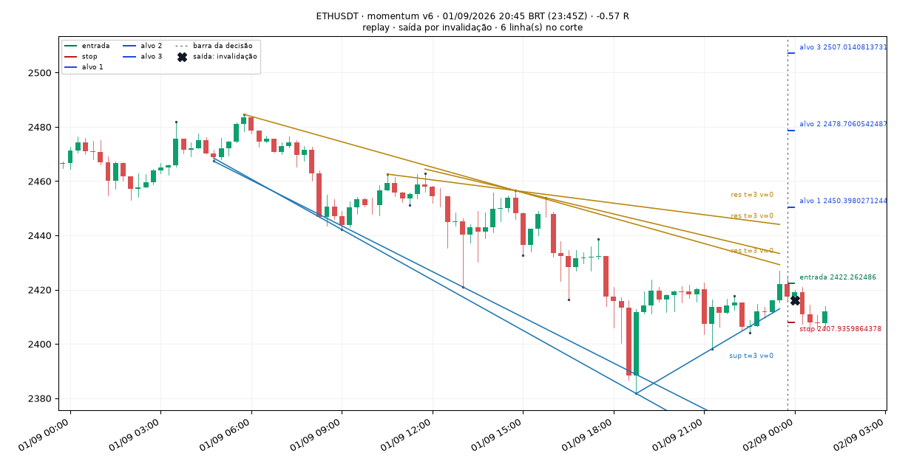

> Momentum 15m: fechamento 2422.09 acima da máxima dos 20 fechamentos anteriores (2420.23), retorno 15m 0.25%, volume relativo 1.78x da mediana de 96 barras, ATR% 0.39%

### 143 — XRPUSDT · 02/09/2026 00:30 BRT · -0.53 R

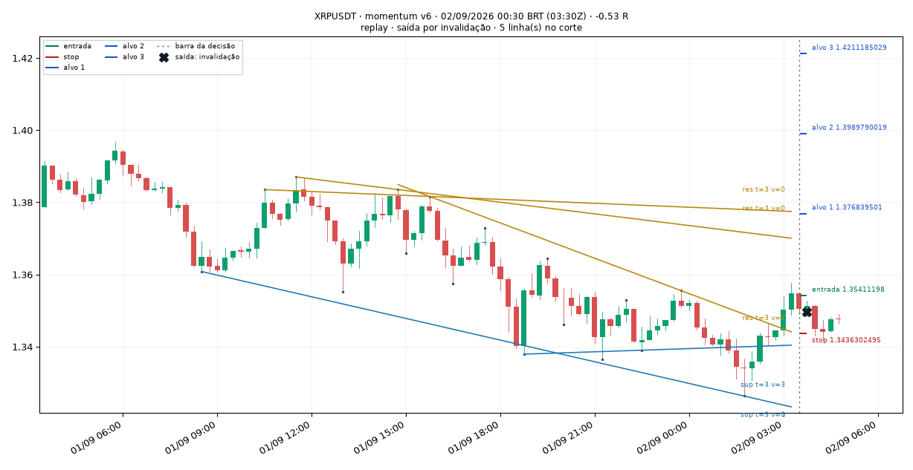

> Momentum 15m: fechamento 1.3547 acima da máxima dos 20 fechamentos anteriores (1.3528), retorno 15m 0.33%, volume relativo 1.71x da mediana de 96 barras, ATR% 0.54%

### 144 — XRPUSDT · 02/09/2026 10:45 BRT · -1.16 R

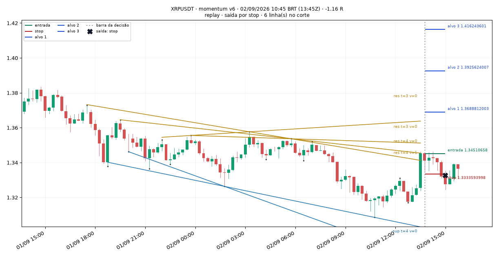

> Momentum 15m: fechamento 1.3452 acima da máxima dos 20 fechamentos anteriores (1.3322), retorno 15m 1.50%, volume relativo 3.40x da mediana de 96 barras, ATR% 0.59%

### 145 — DOGEUSDT · 02/09/2026 10:45 BRT · -1.19 R

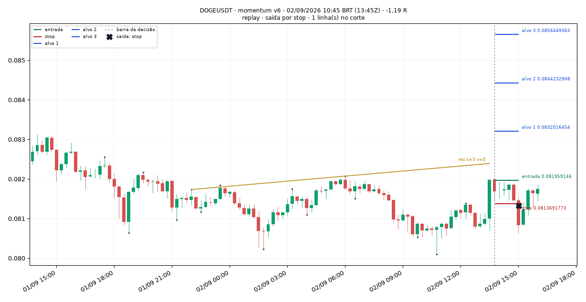

> Momentum 15m: fechamento 0.08198 acima da máxima dos 20 fechamentos anteriores (0.08135), retorno 15m 1.22%, volume relativo 2.75x da mediana de 96 barras, ATR% 0.50%

### 146 — SOLUSDT · 02/09/2026 10:45 BRT · -0.65 R

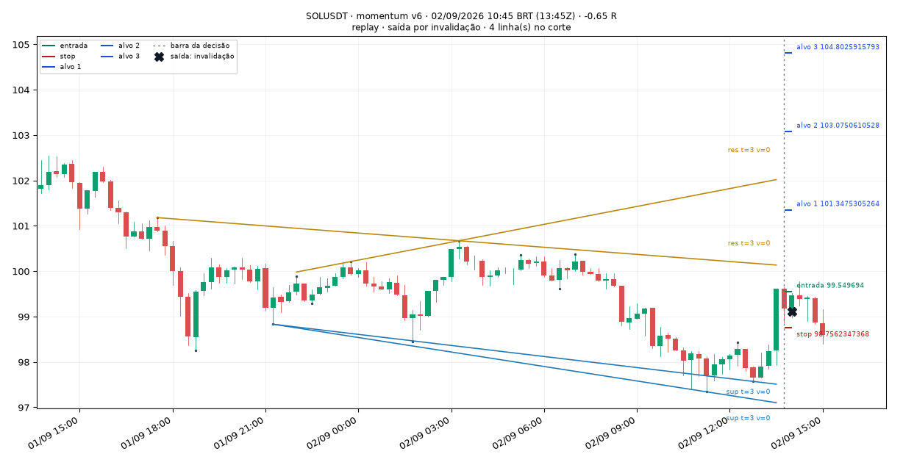

> Momentum 15m: fechamento 99.62 acima da máxima dos 20 fechamentos anteriores (99.18), retorno 15m 1.40%, volume relativo 3.82x da mediana de 96 barras, ATR% 0.58%

### 147 — ETHUSDT · 02/09/2026 10:45 BRT · -1.19 R

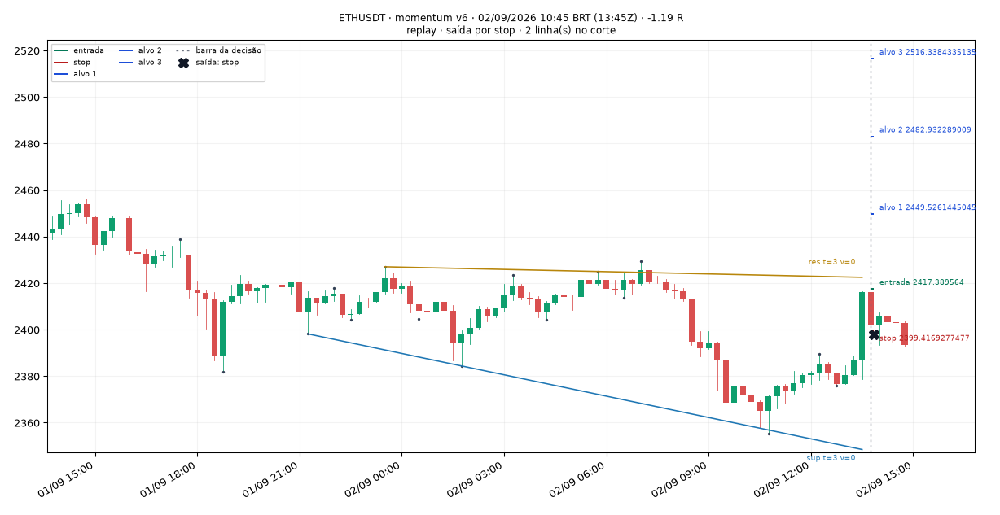

> Momentum 15m: fechamento 2416.12 acima da máxima dos 20 fechamentos anteriores (2394.65), retorno 15m 1.22%, volume relativo 5.17x da mediana de 96 barras, ATR% 0.46%

### 148 — XRPUSDT · 02/09/2026 17:15 BRT · -0.69 R

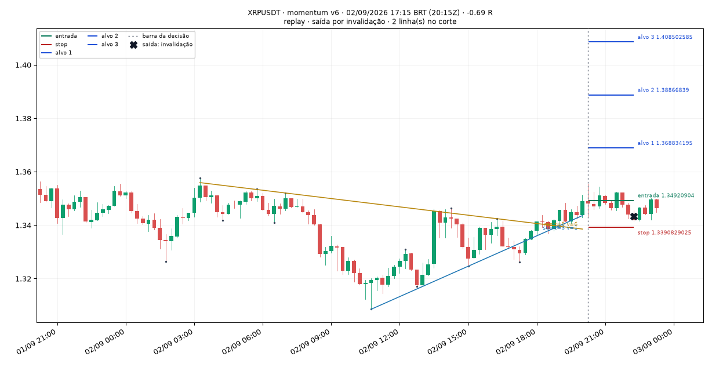

> Momentum 15m: fechamento 1.349 acima da máxima dos 20 fechamentos anteriores (1.3456), retorno 15m 0.39%, volume relativo 1.62x da mediana de 96 barras, ATR% 0.49%

### 149 — SOLUSDT · 02/09/2026 17:15 BRT · -0.27 R

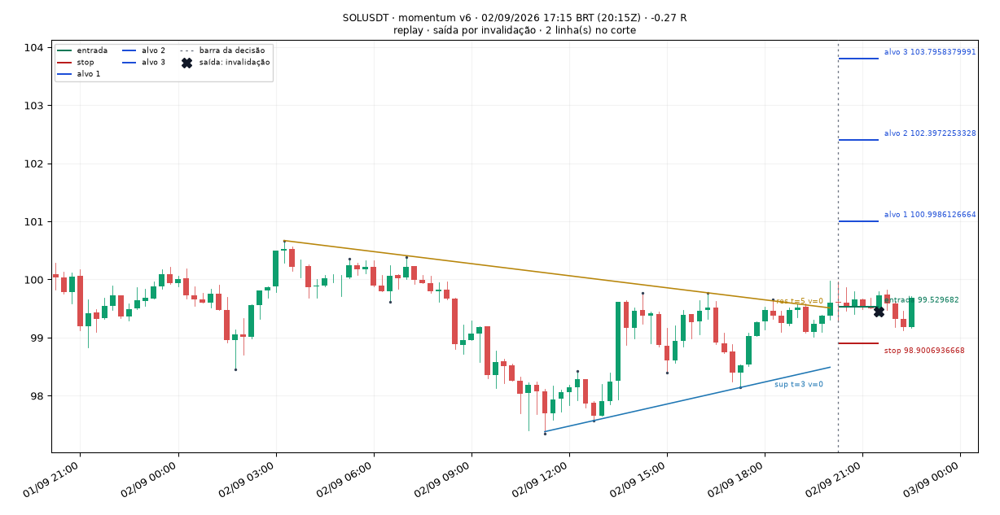

> Momentum 15m: fechamento 99.6 acima da máxima dos 20 fechamentos anteriores (99.52), retorno 15m 0.22%, volume relativo 1.88x da mediana de 96 barras, ATR% 0.47%

### 150 — SOLUSDT · 02/09/2026 21:00 BRT · -1.21 R

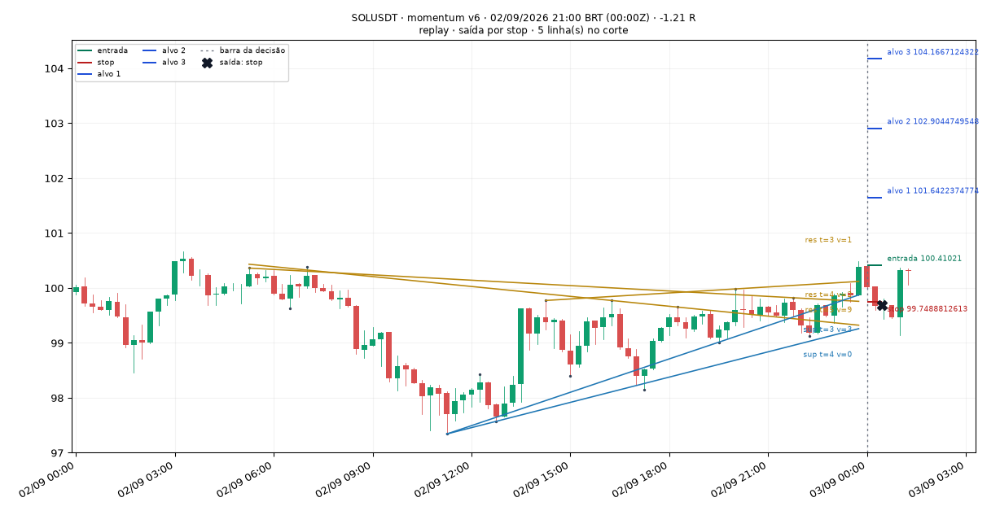

> Momentum 15m: fechamento 100.38 acima da máxima dos 20 fechamentos anteriores (99.9), retorno 15m 0.52%, volume relativo 1.59x da mediana de 96 barras, ATR% 0.42%

### 151 — XRPUSDT · 02/09/2026 22:15 BRT · +0.47 R

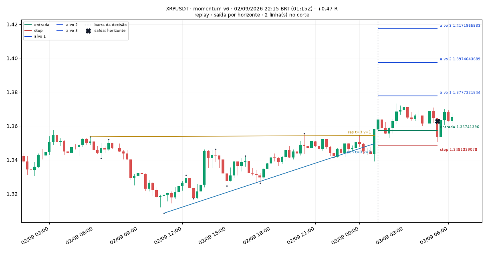

> Momentum 15m: fechamento 1.358 acima da máxima dos 20 fechamentos anteriores (1.3522), retorno 15m 1.08%, volume relativo 2.10x da mediana de 96 barras, ATR% 0.48%

### 152 — DOGEUSDT · 02/09/2026 22:15 BRT · +1.75 R

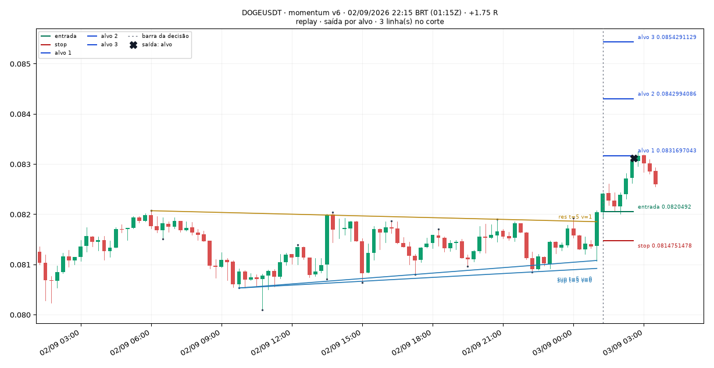

> Momentum 15m: fechamento 0.08204 acima da máxima dos 20 fechamentos anteriores (0.08182), retorno 15m 0.84%, volume relativo 2.32x da mediana de 96 barras, ATR% 0.46%

### 153 — SOLUSDT · 02/09/2026 23:45 BRT · -0.77 R

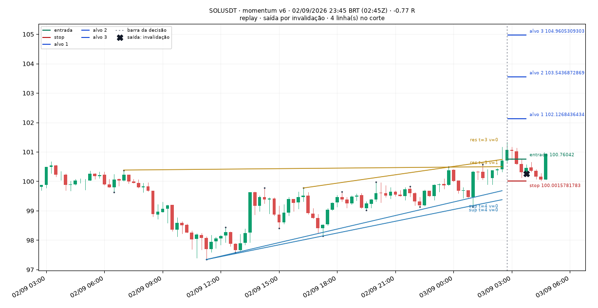

> Momentum 15m: fechamento 100.71 acima da máxima dos 20 fechamentos anteriores (100.41), retorno 15m 0.30%, volume relativo 3.14x da mediana de 96 barras, ATR% 0.47%

### 154 — ETHUSDT · 02/09/2026 23:45 BRT · -1.25 R

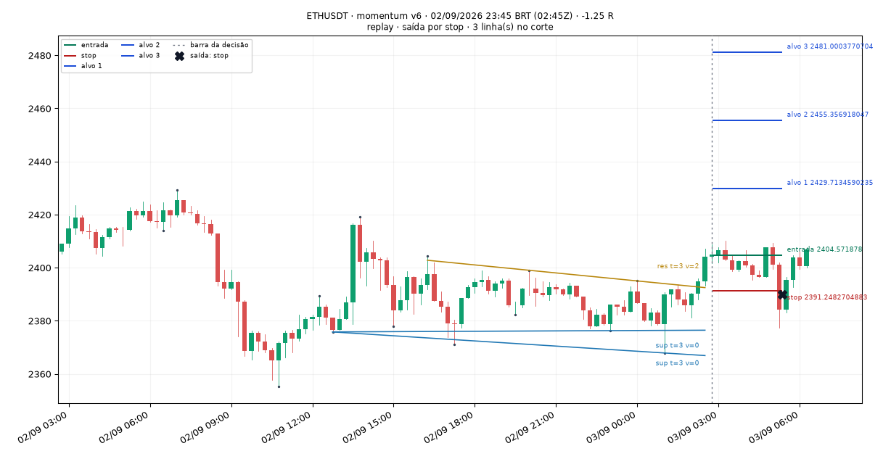

> Momentum 15m: fechamento 2404.07 acima da máxima dos 20 fechamentos anteriores (2394.79), retorno 15m 0.39%, volume relativo 3.39x da mediana de 96 barras, ATR% 0.36%

### 155 — ETHUSDT · 03/09/2026 04:15 BRT · -0.60 R

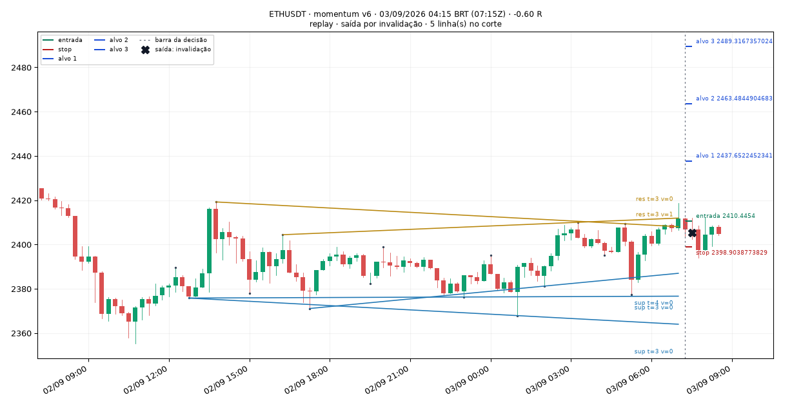

> Momentum 15m: fechamento 2411.82 acima da máxima dos 20 fechamentos anteriores (2408.94), retorno 15m 0.19%, volume relativo 3.33x da mediana de 96 barras, ATR% 0.36%

### 156 — SOLUSDT · 03/09/2026 04:15 BRT · -0.61 R

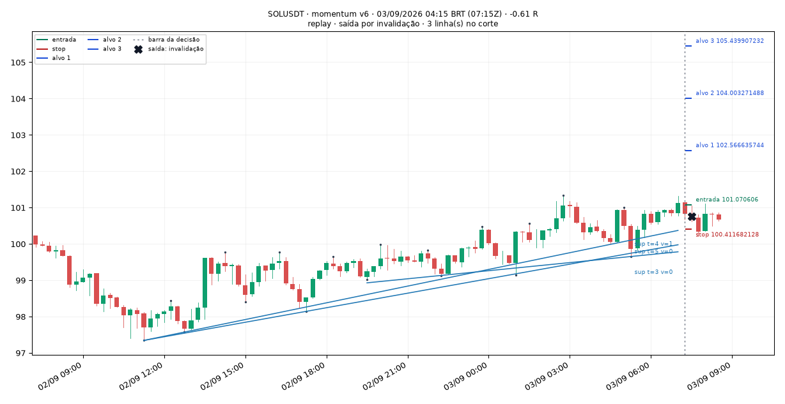

> Momentum 15m: fechamento 101.13 acima da máxima dos 20 fechamentos anteriores (101.06), retorno 15m 0.28%, volume relativo 2.43x da mediana de 96 barras, ATR% 0.47%

### 157 — DOGEUSDT · 03/09/2026 04:15 BRT · -0.76 R

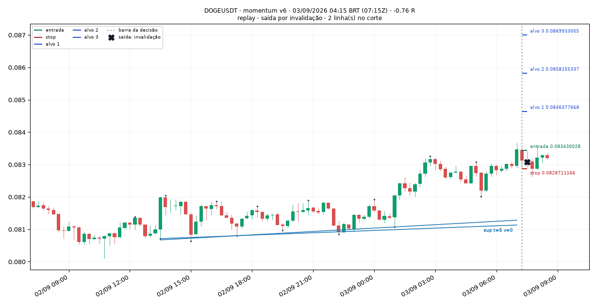

> Momentum 15m: fechamento 0.08346 acima da máxima dos 20 fechamentos anteriores (0.08316), retorno 15m 0.60%, volume relativo 3.00x da mediana de 96 barras, ATR% 0.47%

### 158 — XRPUSDT · 03/09/2026 04:15 BRT · -0.38 R

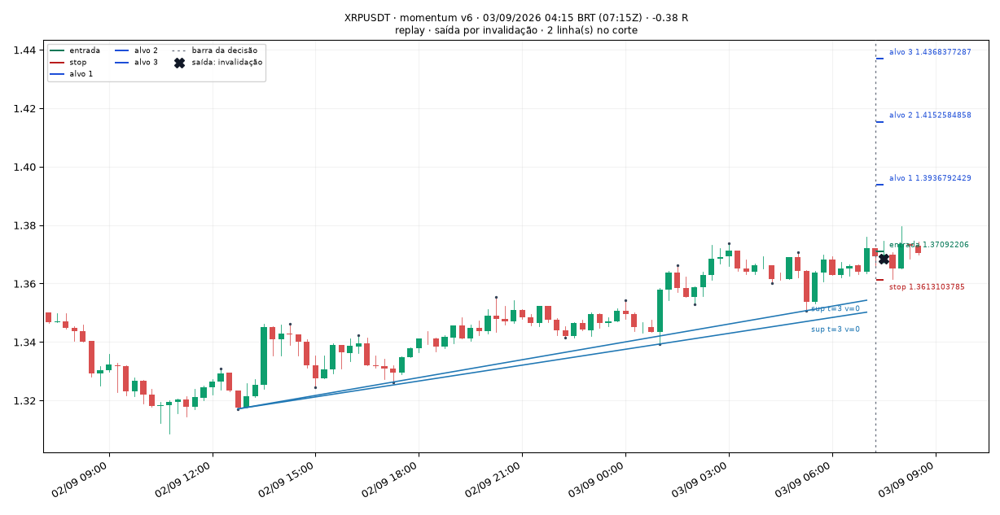

> Momentum 15m: fechamento 1.3721 acima da máxima dos 20 fechamentos anteriores (1.3713), retorno 15m 0.59%, volume relativo 1.85x da mediana de 96 barras, ATR% 0.52%

### 159 — XRPUSDT · 03/09/2026 05:15 BRT · -0.43 R

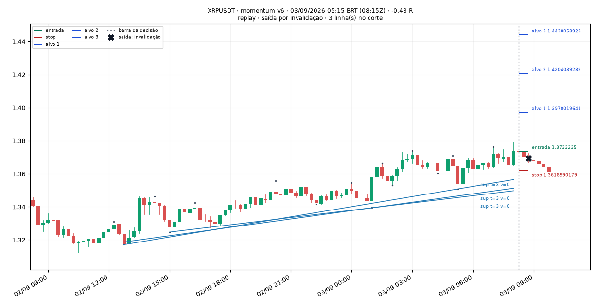

> Momentum 15m: fechamento 1.3736 acima da máxima dos 20 fechamentos anteriores (1.3721), retorno 15m 0.63%, volume relativo 2.18x da mediana de 96 barras, ATR% 0.57%

### 160 — ETHUSDT · 03/09/2026 09:45 BRT · +1.43 R

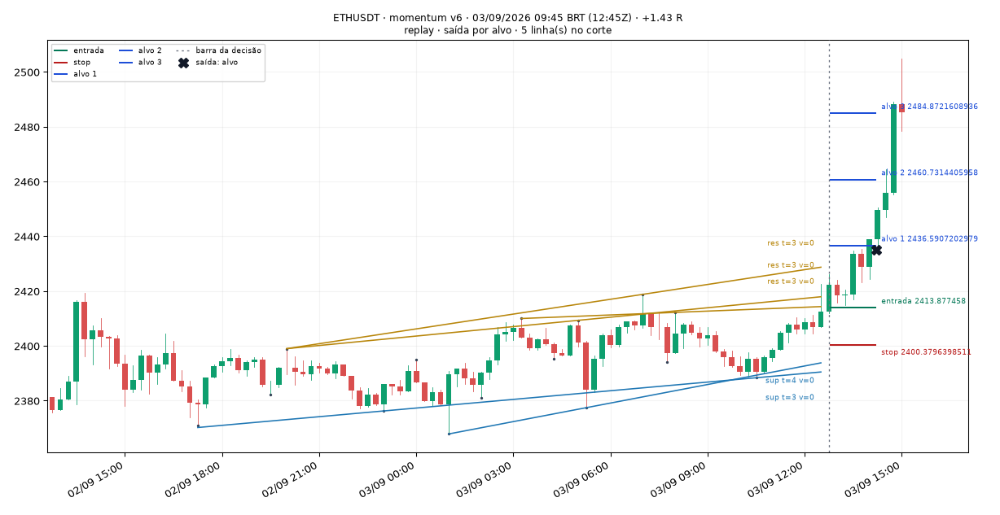

> Momentum 15m: fechamento 2412.45 acima da máxima dos 20 fechamentos anteriores (2408.74), retorno 15m 0.23%, volume relativo 4.31x da mediana de 96 barras, ATR% 0.33%

### 161 — SOLUSDT · 03/09/2026 09:45 BRT · +1.54 R

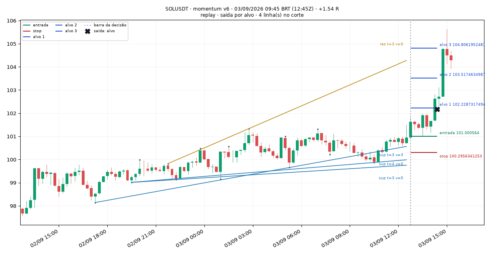

> Momentum 15m: fechamento 100.94 acima da máxima dos 20 fechamentos anteriores (100.91), retorno 15m 0.24%, volume relativo 2.96x da mediana de 96 barras, ATR% 0.43%

### 162 — XRPUSDT · 03/09/2026 09:45 BRT · +1.44 R

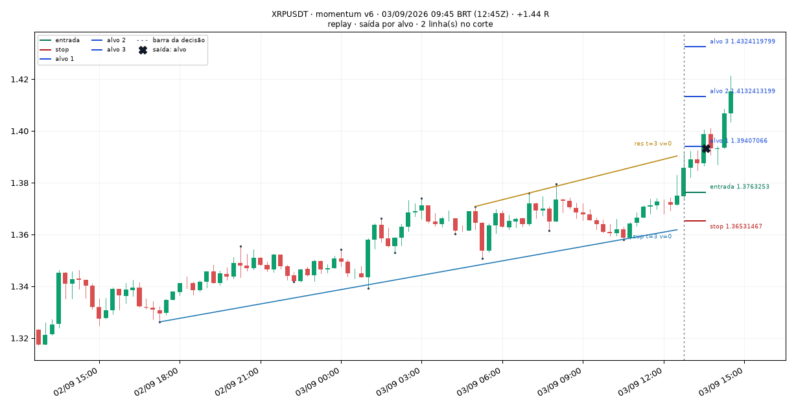

> Momentum 15m: fechamento 1.3749 acima da máxima dos 20 fechamentos anteriores (1.3736), retorno 15m 0.26%, volume relativo 3.56x da mediana de 96 barras, ATR% 0.46%

### 163 — DOGEUSDT · 03/09/2026 10:00 BRT · +3.18 R

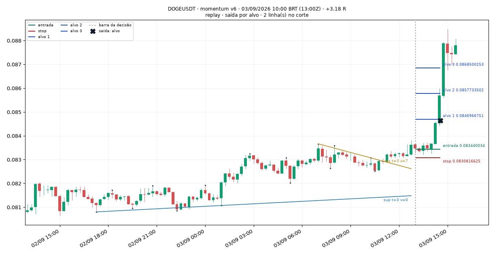

> Momentum 15m: fechamento 0.08362 acima da máxima dos 20 fechamentos anteriores (0.08329), retorno 15m 0.48%, volume relativo 2.32x da mediana de 96 barras, ATR% 0.43%

### 164 — XRPUSDT · 03/09/2026 11:30 BRT · +1.57 R

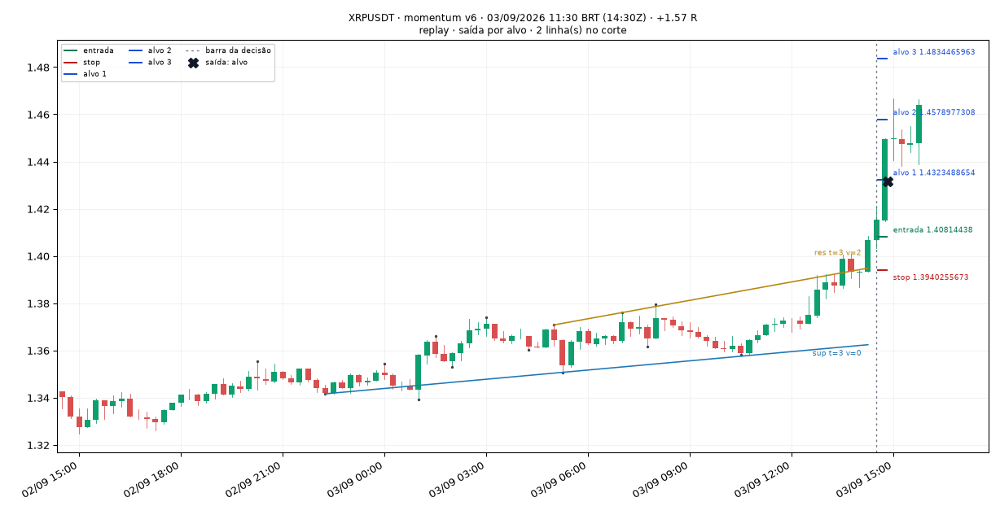

> Momentum 15m: fechamento 1.4068 acima da máxima dos 20 fechamentos anteriores (1.3988), retorno 15m 0.97%, volume relativo 2.93x da mediana de 96 barras, ATR% 0.61%

### 165 — ETHUSDT · 03/09/2026 12:30 BRT · -0.31 R

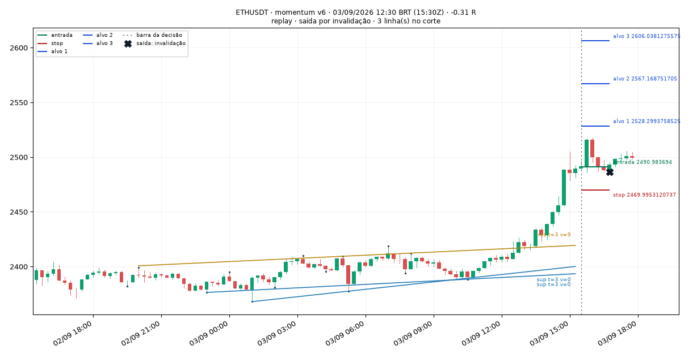

> Momentum 15m: fechamento 2489.43 acima da máxima dos 20 fechamentos anteriores (2488.32), retorno 15m 0.16%, volume relativo 2.63x da mediana de 96 barras, ATR% 0.52%

### 166 — SOLUSDT · 03/09/2026 13:00 BRT · -0.90 R

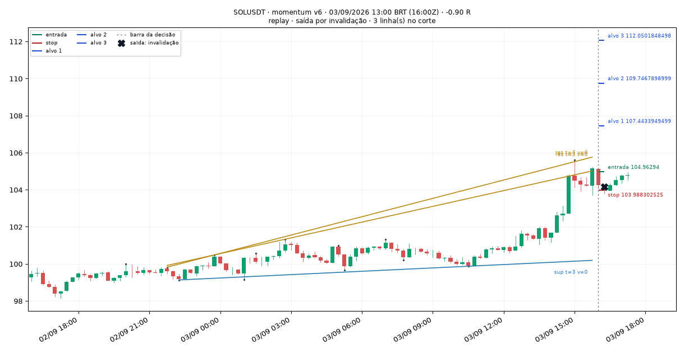

> Momentum 15m: fechamento 105.14 acima da máxima dos 20 fechamentos anteriores (104.77), retorno 15m 0.89%, volume relativo 4.00x da mediana de 96 barras, ATR% 0.73%

### 167 — XRPUSDT · 03/09/2026 13:00 BRT · -1.12 R

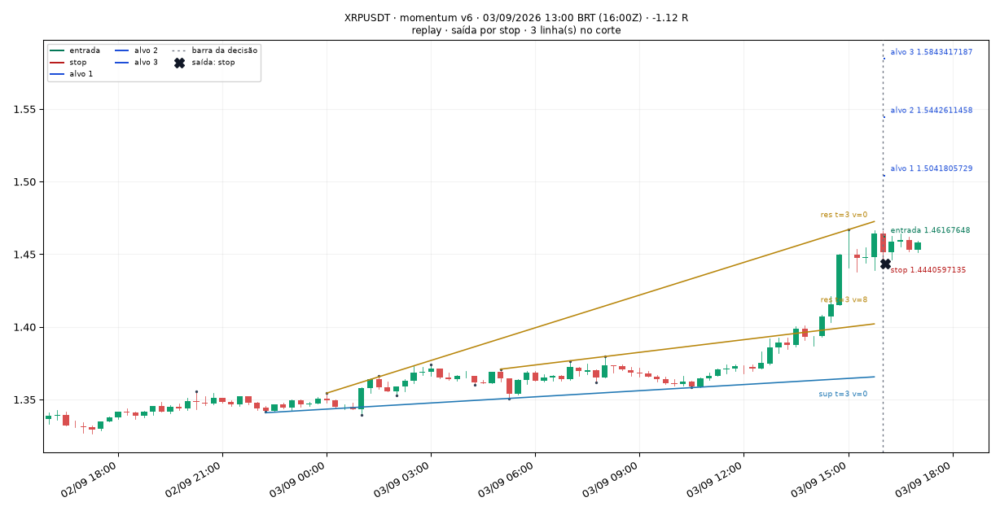

> Momentum 15m: fechamento 1.4641 acima da máxima dos 20 fechamentos anteriores (1.4497), retorno 15m 1.12%, volume relativo 4.95x da mediana de 96 barras, ATR% 0.91%

### 168 — DOGEUSDT · 03/09/2026 13:00 BRT · -0.37 R

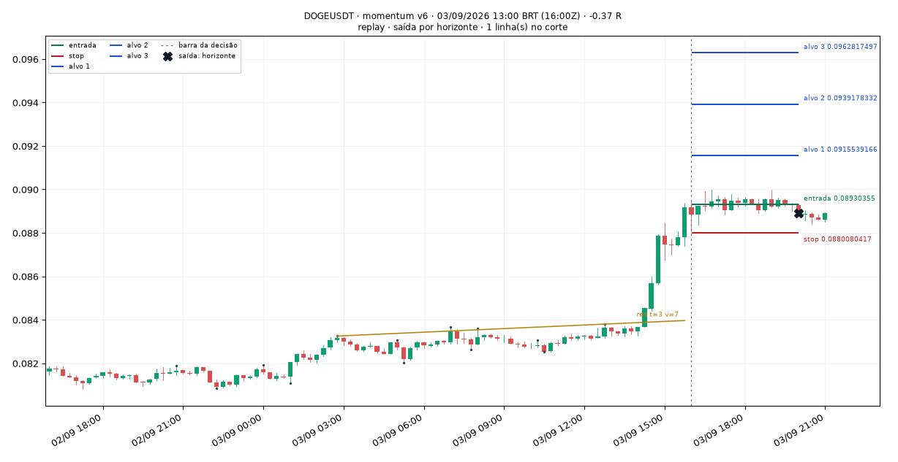

> Momentum 15m: fechamento 0.08919 acima da máxima dos 20 fechamentos anteriores (0.08788), retorno 15m 1.58%, volume relativo 5.97x da mediana de 96 barras, ATR% 0.88%

### 169 — XRPUSDT · 03/09/2026 15:15 BRT · -0.57 R

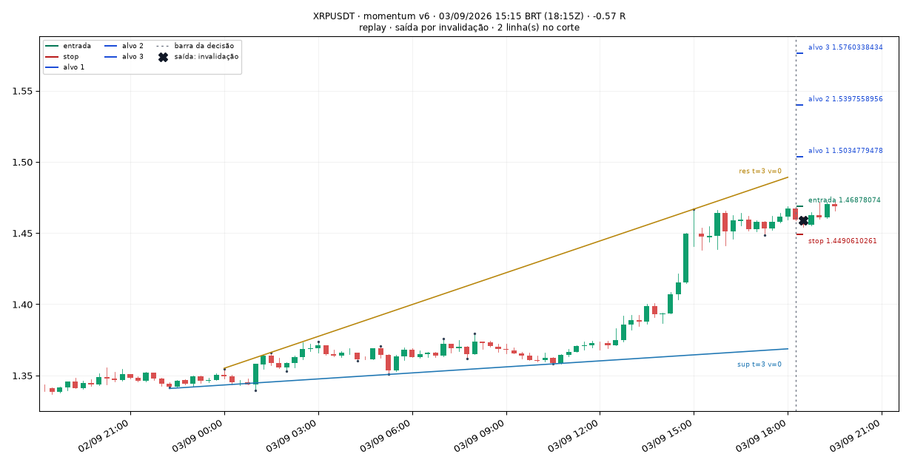

> Momentum 15m: fechamento 1.4672 acima da máxima dos 20 fechamentos anteriores (1.4641), retorno 15m 0.39%, volume relativo 1.70x da mediana de 96 barras, ATR% 0.82%

### 170 — XRPUSDT · 03/09/2026 17:00 BRT · +0.08 R

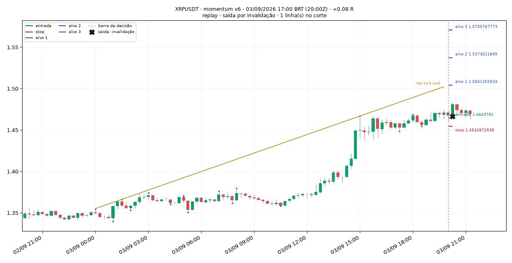

> Momentum 15m: fechamento 1.4709 acima da máxima dos 20 fechamentos anteriores (1.4706), retorno 15m 0.15%, volume relativo 1.80x da mediana de 96 barras, ATR% 0.75%

### 171 — ETHUSDT · 04/09/2026 00:15 BRT · -0.58 R

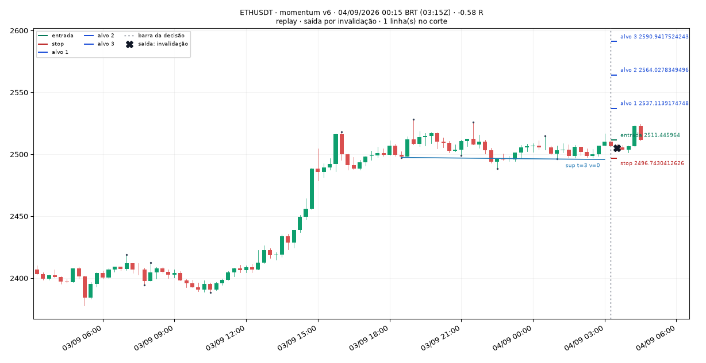

> Momentum 15m: fechamento 2510.2 acima da máxima dos 20 fechamentos anteriores (2506.99), retorno 15m 0.13%, volume relativo 2.22x da mediana de 96 barras, ATR% 0.36%

### 172 — ETHUSDT · 04/09/2026 01:30 BRT · -1.31 R

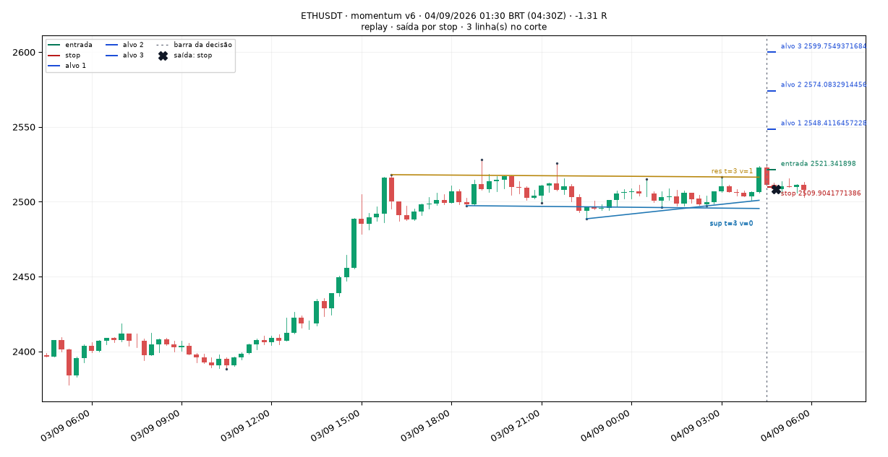

> Momentum 15m: fechamento 2522.74 acima da máxima dos 20 fechamentos anteriores (2510.2), retorno 15m 0.65%, volume relativo 3.12x da mediana de 96 barras, ATR% 0.34%

### 173 — SOLUSDT · 04/09/2026 06:00 BRT · -0.55 R

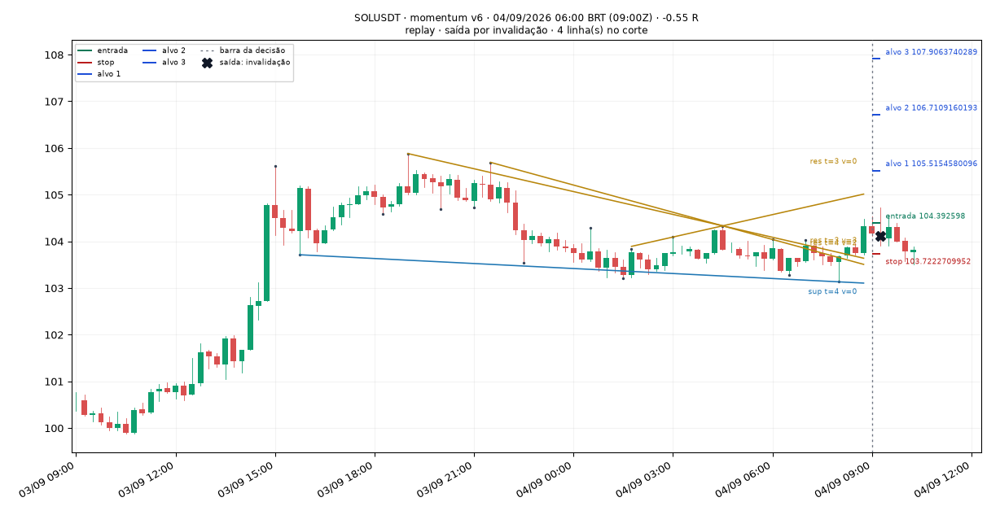

> Momentum 15m: fechamento 104.32 acima da máxima dos 20 fechamentos anteriores (104.24), retorno 15m 0.55%, volume relativo 2.53x da mediana de 96 barras, ATR% 0.38%

### 174 — ETHUSDT · 04/09/2026 06:00 BRT · -0.66 R

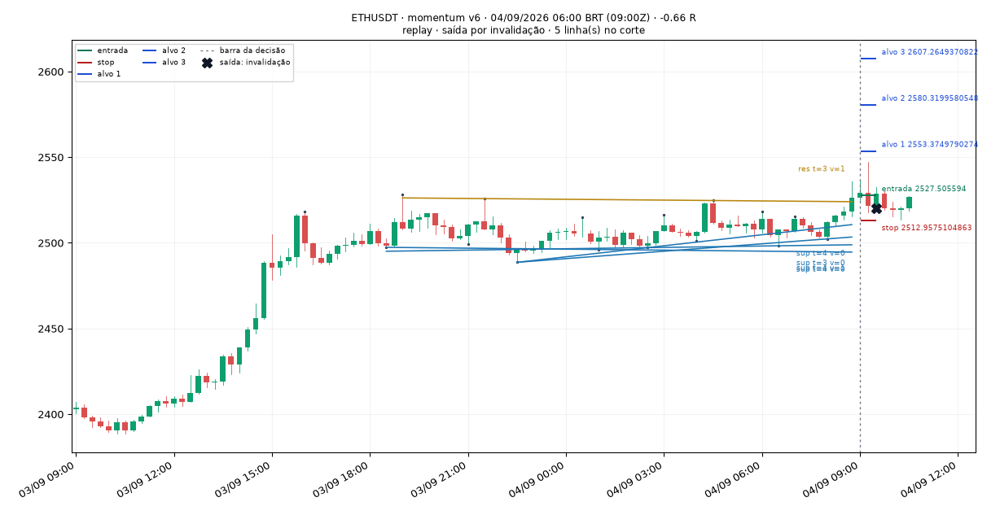

> Momentum 15m: fechamento 2526.43 acima da máxima dos 20 fechamentos anteriores (2522.74), retorno 15m 0.33%, volume relativo 5.32x da mediana de 96 barras, ATR% 0.36%

### 175 — DOGEUSDT · 04/09/2026 06:00 BRT · -0.51 R

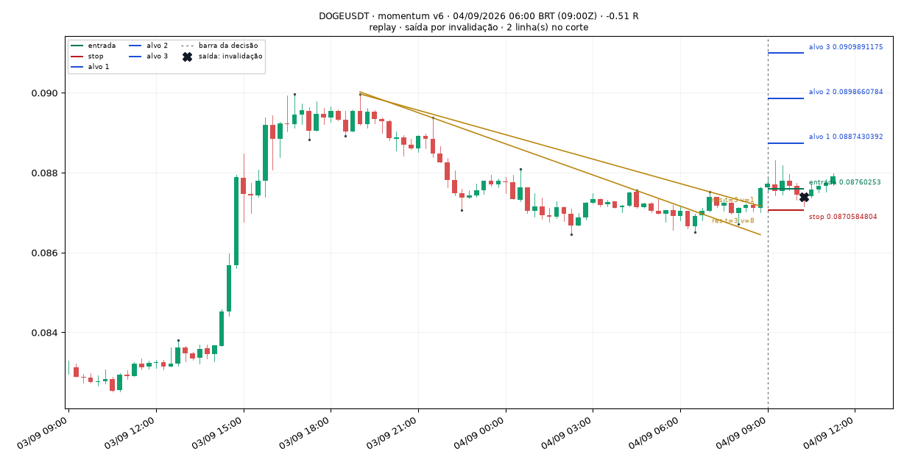

> Momentum 15m: fechamento 0.08762 acima da máxima dos 20 fechamentos anteriores (0.08751), retorno 15m 0.57%, volume relativo 1.95x da mediana de 96 barras, ATR% 0.43%

### 176 — DOGEUSDT · 05/09/2026 03:45 BRT · +1.05 R

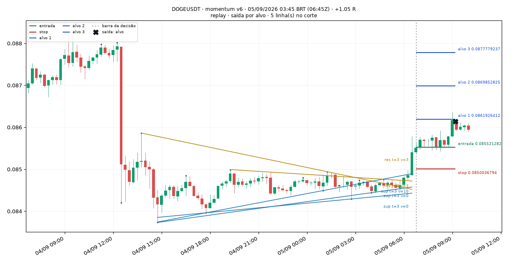

> Momentum 15m: fechamento 0.0854 acima da máxima dos 20 fechamentos anteriores (0.08486), retorno 15m 0.64%, volume relativo 4.73x da mediana de 96 barras, ATR% 0.31%

### 177 — DOGEUSDT · 05/09/2026 09:45 BRT · +0.05 R

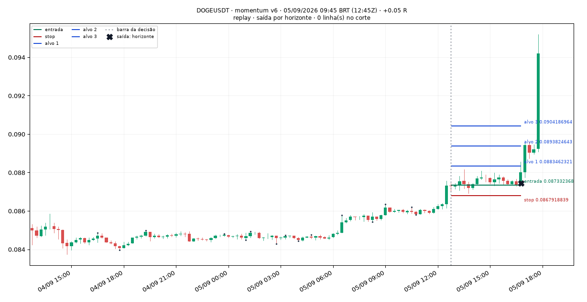

> Momentum 15m: fechamento 0.08731 acima da máxima dos 20 fechamentos anteriores (0.08634), retorno 15m 1.12%, volume relativo 6.93x da mediana de 96 barras, ATR% 0.40%

### 178 — XRPUSDT · 05/09/2026 11:45 BRT · -0.77 R

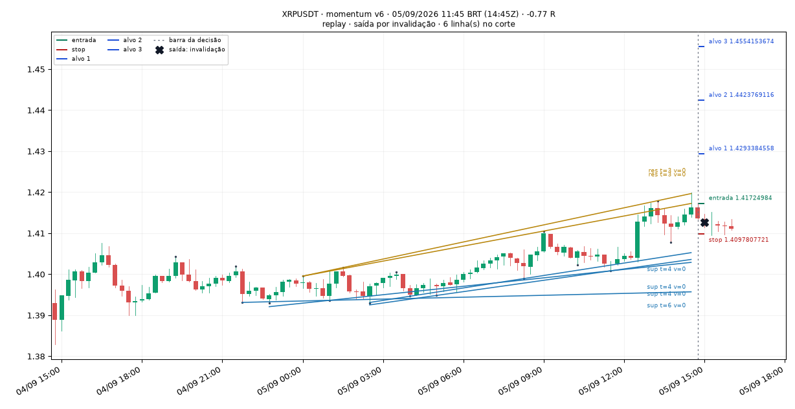

> Momentum 15m: fechamento 1.4163 acima da máxima dos 20 fechamentos anteriores (1.4161), retorno 15m 0.12%, volume relativo 2.09x da mediana de 96 barras, ATR% 0.31%

### 179 — SOLUSDT · 05/09/2026 14:15 BRT · -1.48 R

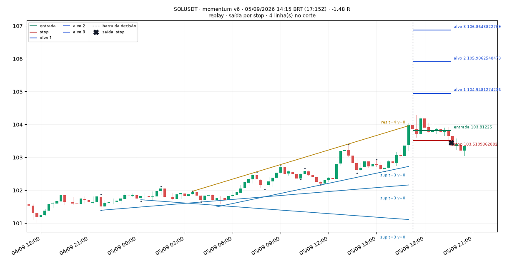

> Momentum 15m: fechamento 103.99 acima da máxima dos 20 fechamentos anteriores (103.36), retorno 15m 0.61%, volume relativo 5.84x da mediana de 96 barras, ATR% 0.31%

### 180 — XRPUSDT · 05/09/2026 14:15 BRT · -1.43 R

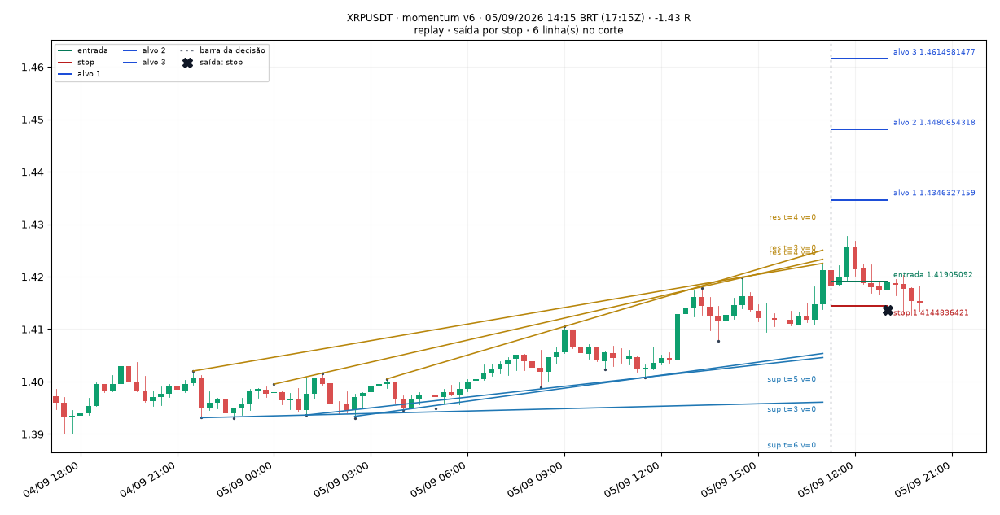

> Momentum 15m: fechamento 1.4212 acima da máxima dos 20 fechamentos anteriores (1.4163), retorno 15m 0.45%, volume relativo 2.84x da mediana de 96 barras, ATR% 0.32%

### 181 — DOGEUSDT · 05/09/2026 15:00 BRT · -1.15 R

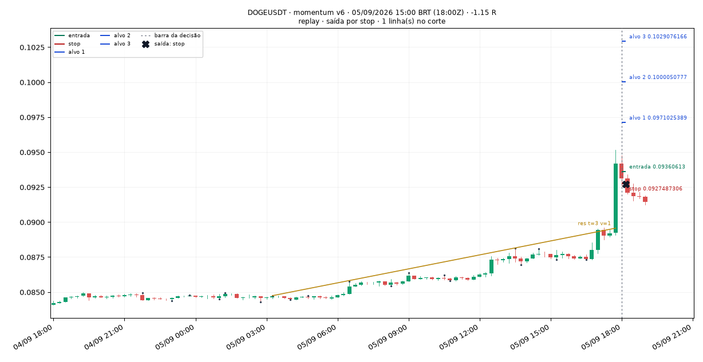

> Momentum 15m: fechamento 0.0942 acima da máxima dos 20 fechamentos anteriores (0.08943), retorno 15m 5.59%, volume relativo 24.00x da mediana de 96 barras, ATR% 1.03%

### 182 — SOLUSDT · 05/09/2026 23:00 BRT · +1.00 R

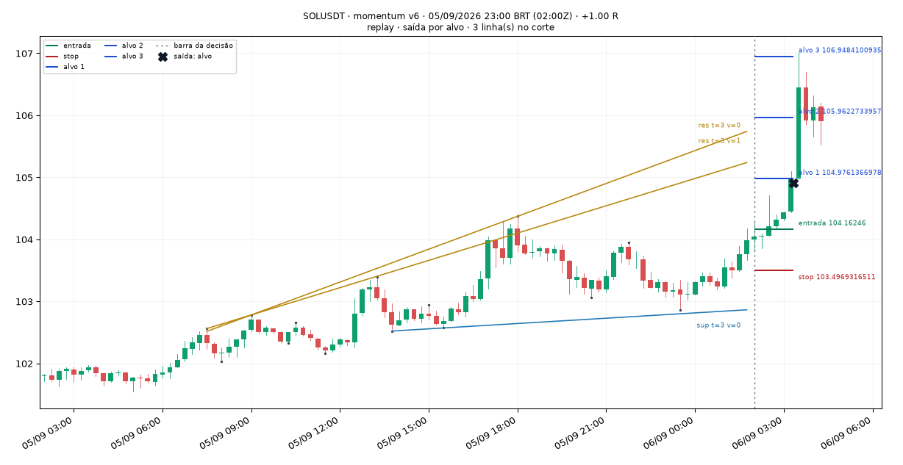

> Momentum 15m: fechamento 103.99 acima da máxima dos 20 fechamentos anteriores (103.88), retorno 15m 0.22%, volume relativo 2.71x da mediana de 96 barras, ATR% 0.32%

### 183 — XRPUSDT · 06/09/2026 00:45 BRT · -1.23 R

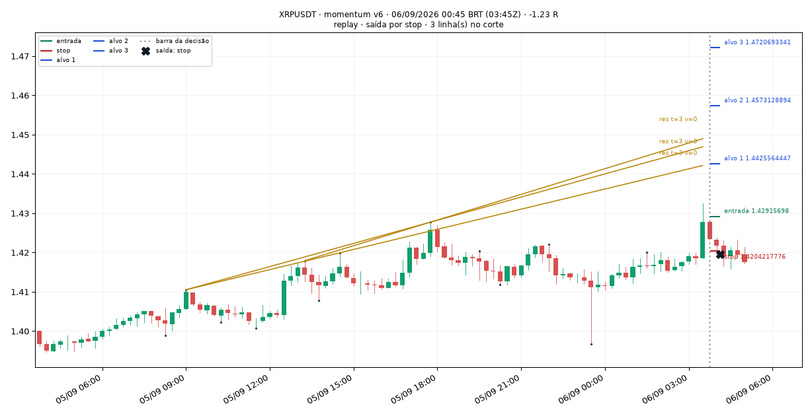

> Momentum 15m: fechamento 1.4278 acima da máxima dos 20 fechamentos anteriores (1.419), retorno 15m 0.66%, volume relativo 3.18x da mediana de 96 barras, ATR% 0.34%

### 184 — DOGEUSDT · 06/09/2026 00:45 BRT · -1.18 R

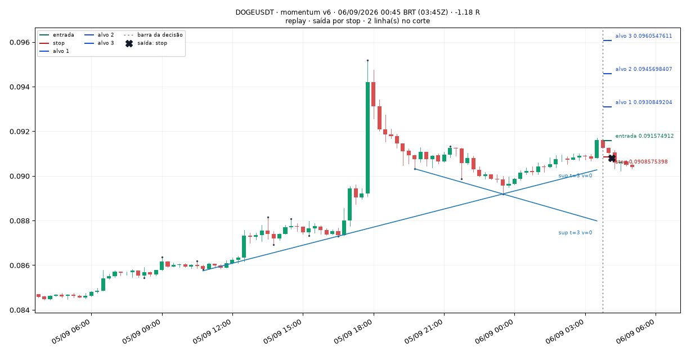

> Momentum 15m: fechamento 0.0916 acima da máxima dos 20 fechamentos anteriores (0.0909), retorno 15m 0.90%, volume relativo 3.45x da mediana de 96 barras, ATR% 0.54%

### 185 — SOLUSDT · 06/09/2026 06:30 BRT · -0.99 R

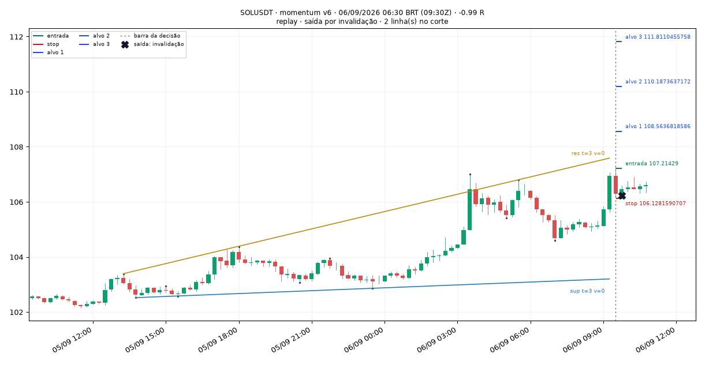

> Momentum 15m: fechamento 106.94 acima da máxima dos 20 fechamentos anteriores (106.4), retorno 15m 1.14%, volume relativo 6.17x da mediana de 96 barras, ATR% 0.51%

### 186 — SOLUSDT · 06/09/2026 09:45 BRT · -0.53 R

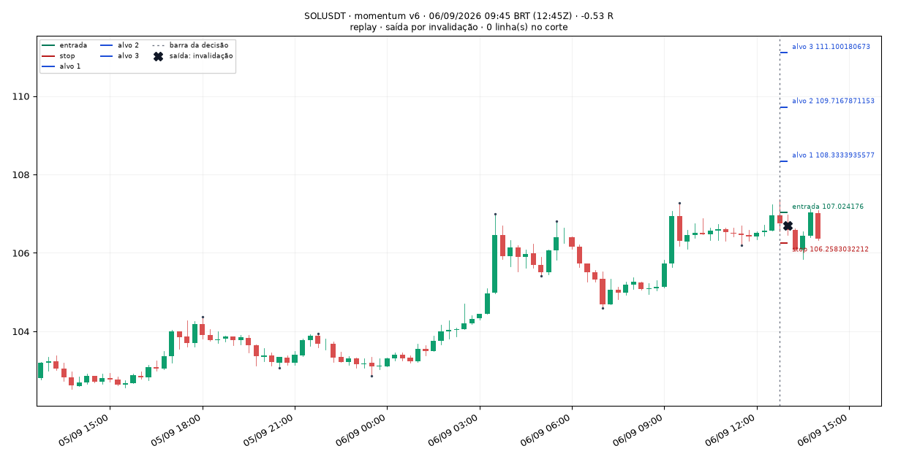

> Momentum 15m: fechamento 106.95 acima da máxima dos 20 fechamentos anteriores (106.94), retorno 15m 0.37%, volume relativo 2.38x da mediana de 96 barras, ATR% 0.43%

### 187 — SOLUSDT · 06/09/2026 11:00 BRT · -1.04 R

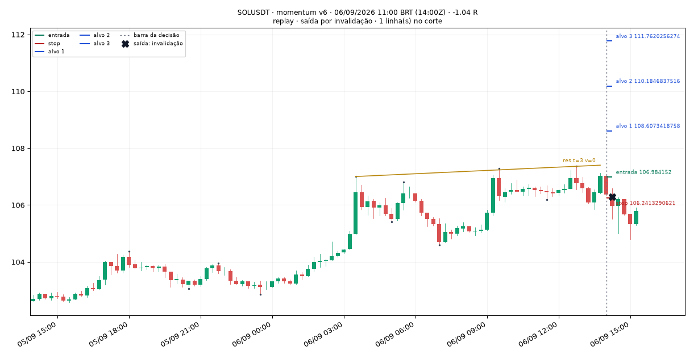

> Momentum 15m: fechamento 107.03 acima da máxima dos 20 fechamentos anteriores (106.95), retorno 15m 0.55%, volume relativo 1.86x da mediana de 96 barras, ATR% 0.49%

### 188 — DOGEUSDT · 06/09/2026 17:30 BRT · +1.43 R

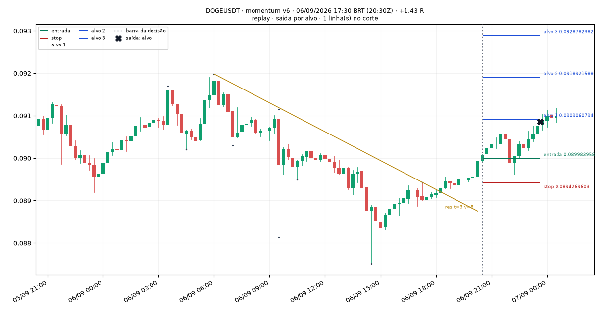

> Momentum 15m: fechamento 0.08992 acima da máxima dos 20 fechamentos anteriores (0.08956), retorno 15m 0.40%, volume relativo 1.65x da mediana de 96 barras, ATR% 0.37%

### 189 — SOLUSDT · 06/09/2026 23:45 BRT · -1.18 R

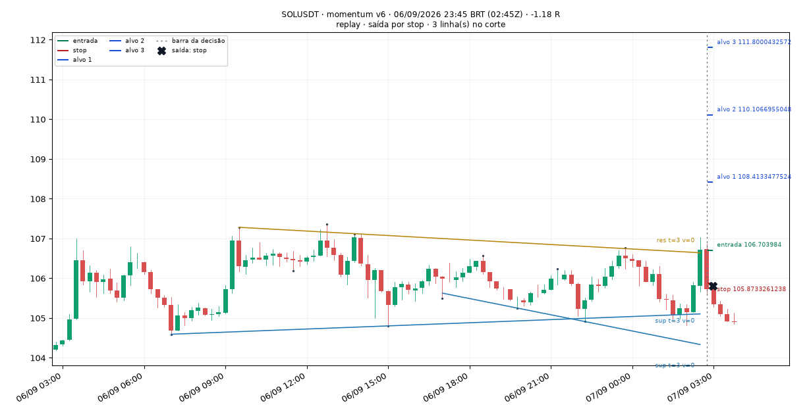

> Momentum 15m: fechamento 106.72 acima da máxima dos 20 fechamentos anteriores (106.57), retorno 15m 0.85%, volume relativo 2.70x da mediana de 96 barras, ATR% 0.53%

### 190 — ETHUSDT · 06/09/2026 23:45 BRT · -1.24 R

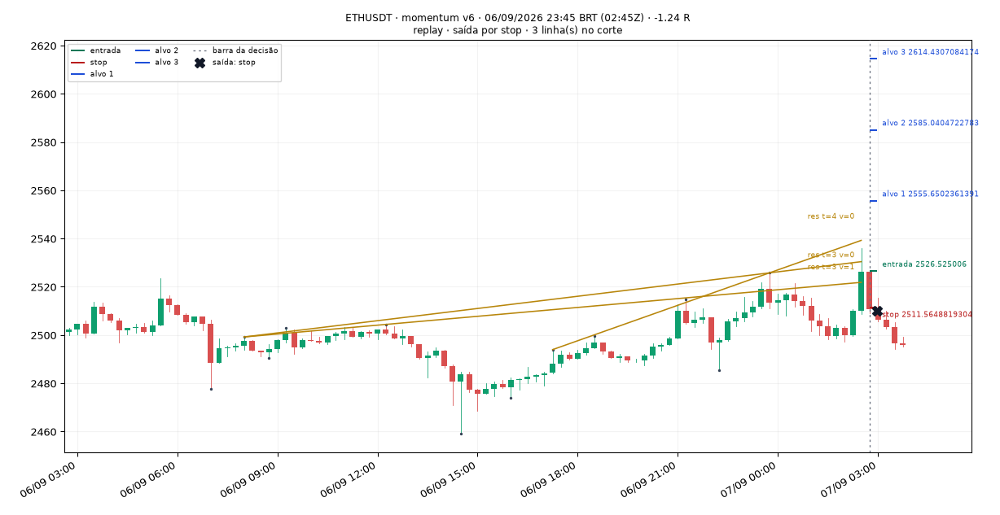

> Momentum 15m: fechamento 2526.26 acima da máxima dos 20 fechamentos anteriores (2519.27), retorno 15m 0.65%, volume relativo 7.09x da mediana de 96 barras, ATR% 0.39%

### 191 — DOGEUSDT · 07/09/2026 09:30 BRT · +1.58 R

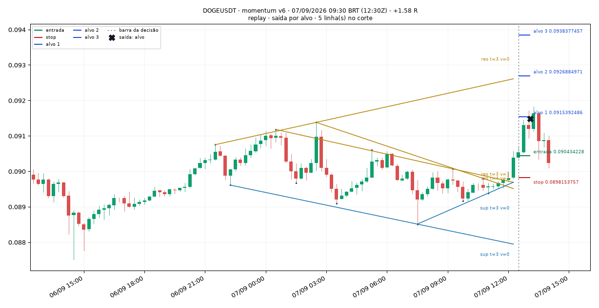

> Momentum 15m: fechamento 0.09039 acima da máxima dos 20 fechamentos anteriores (0.08982), retorno 15m 0.65%, volume relativo 1.59x da mediana de 96 barras, ATR% 0.42%

### 192 — XRPUSDT · 07/09/2026 10:00 BRT · -1.24 R

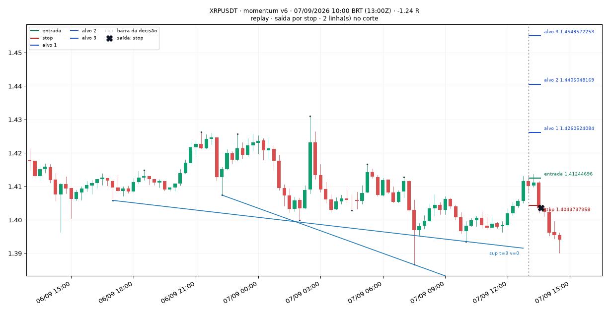

> Momentum 15m: fechamento 1.4116 acima da máxima dos 20 fechamentos anteriores (1.4062), retorno 15m 0.43%, volume relativo 2.25x da mediana de 96 barras, ATR% 0.34%

### 193 — SOLUSDT · 07/09/2026 10:00 BRT · -1.24 R

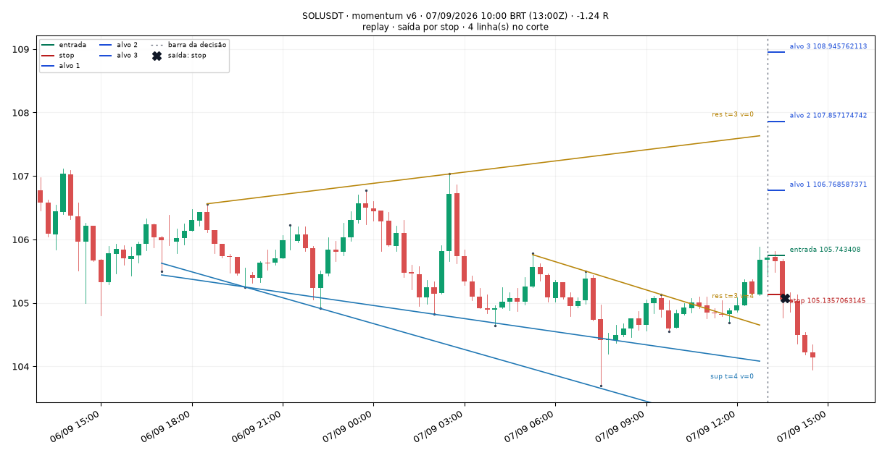

> Momentum 15m: fechamento 105.68 acima da máxima dos 20 fechamentos anteriores (105.33), retorno 15m 0.51%, volume relativo 1.96x da mediana de 96 barras, ATR% 0.34%

### 194 — DOGEUSDT · 07/09/2026 10:30 BRT · -1.22 R

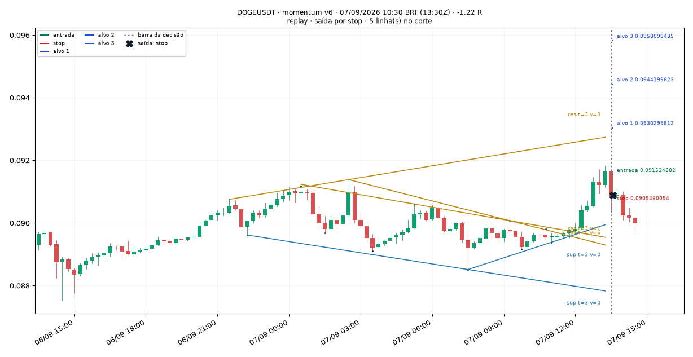

> Momentum 15m: fechamento 0.09164 acima da máxima dos 20 fechamentos anteriores (0.09131), retorno 15m 0.48%, volume relativo 1.63x da mediana de 96 barras, ATR% 0.51%

### 195 — DOGEUSDT · 07/09/2026 20:15 BRT · -0.76 R

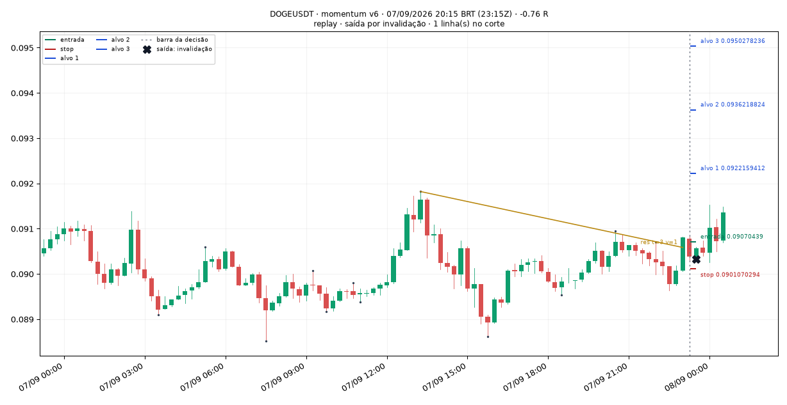

> Momentum 15m: fechamento 0.09081 acima da máxima dos 20 fechamentos anteriores (0.09071), retorno 15m 0.82%, volume relativo 1.57x da mediana de 96 barras, ATR% 0.52%

### 196 — DOGSUSDT · 08/09/2026 16:15 BRT · -0.31 R

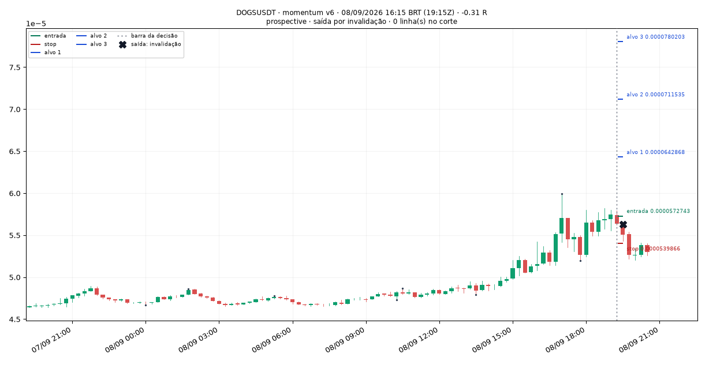

> Momentum 15m: fechamento 0.00005742 acima da máxima dos 20 fechamentos anteriores (0.00005707), retorno 15m 0.93%, volume relativo 36.95x da mediana de 96 barras, ATR% 3.99%

### 197 — EGLDUSDT · 08/09/2026 16:15 BRT · +3.02 R

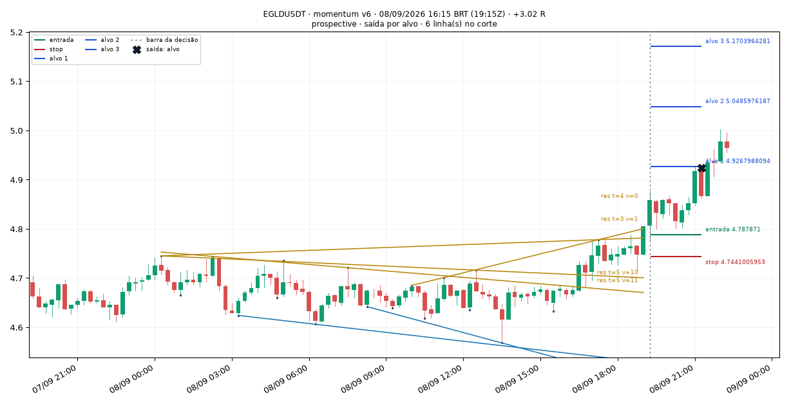

> Momentum 15m: fechamento 4.805 acima da máxima dos 20 fechamentos anteriores (4.766), retorno 15m 1.22%, volume relativo 1.96x da mediana de 96 barras, ATR% 0.84%

### 198 — SKRUSDT · 08/09/2026 16:30 BRT · -1.10 R

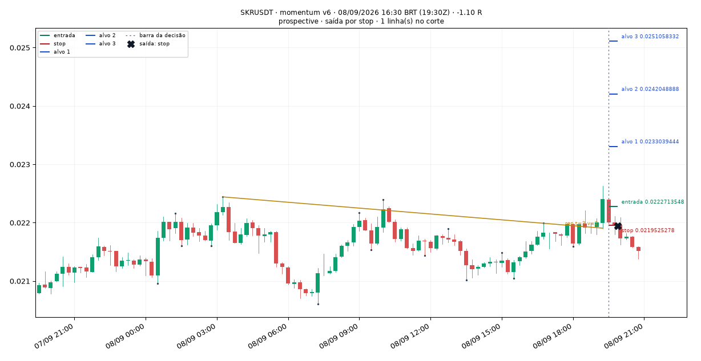

> Momentum 15m: fechamento 0.022403 acima da máxima dos 20 fechamentos anteriores (0.022), retorno 15m 1.83%, volume relativo 6.63x da mediana de 96 barras, ATR% 1.34%

### 199 — XPLUSDT · 08/09/2026 16:30 BRT · -0.35 R

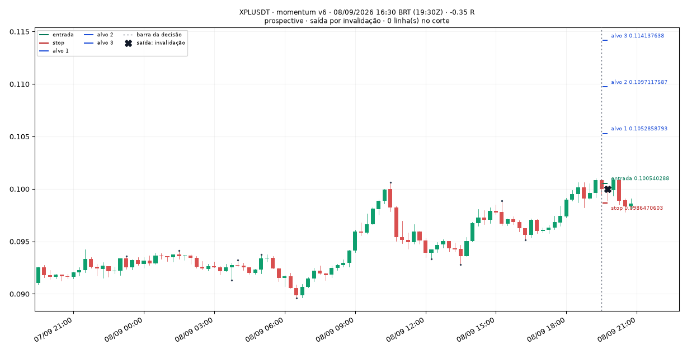

> Momentum 15m: fechamento 0.10086 acima da máxima dos 20 fechamentos anteriores (0.10017), retorno 15m 1.28%, volume relativo 1.67x da mediana de 96 barras, ATR% 1.46%

### 200 — FFUSDT · 08/09/2026 17:00 BRT · +1.82 R

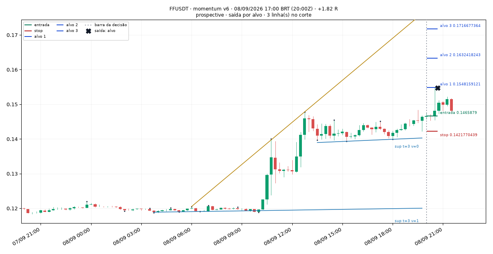

> Momentum 15m: fechamento 0.14639 acima da máxima dos 20 fechamentos anteriores (0.14535), retorno 15m 0.79%, volume relativo 19.79x da mediana de 96 barras, ATR% 1.92%

### 201 — NEIROUSDT · 08/09/2026 17:15 BRT · -0.53 R

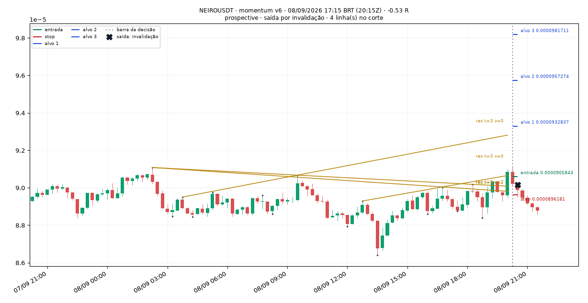

> Momentum 15m: fechamento 0.00009084 acima da máxima dos 20 fechamentos anteriores (0.00009033), retorno 15m 1.40%, volume relativo 2.35x da mediana de 96 barras, ATR% 0.90%

### 202 — PEOPLEUSDT · 08/09/2026 17:15 BRT · -0.65 R

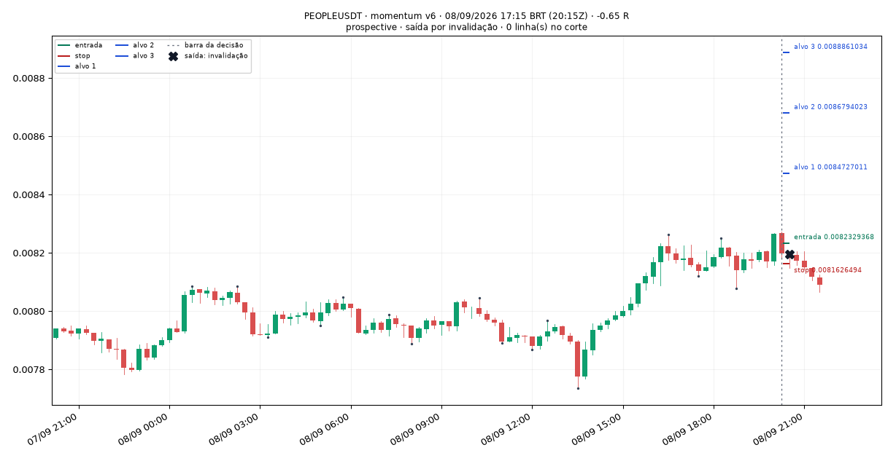

> Momentum 15m: fechamento 0.008266 acima da máxima dos 20 fechamentos anteriores (0.008223), retorno 15m 1.18%, volume relativo 1.95x da mediana de 96 barras, ATR% 0.83%

### 203 — ORCAUSDT · 08/09/2026 17:15 BRT · -0.73 R

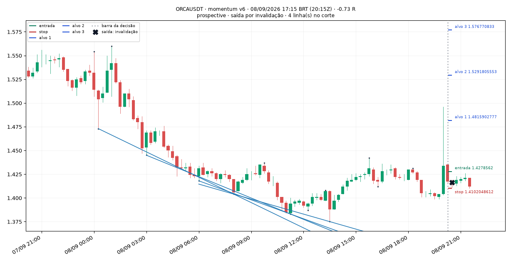

> Momentum 15m: fechamento 1.434 acima da máxima dos 20 fechamentos anteriores (1.431), retorno 15m 2.14%, volume relativo 4.98x da mediana de 96 barras, ATR% 1.11%

### 204 — SIRENUSDT · 08/09/2026 17:15 BRT · -1.17 R

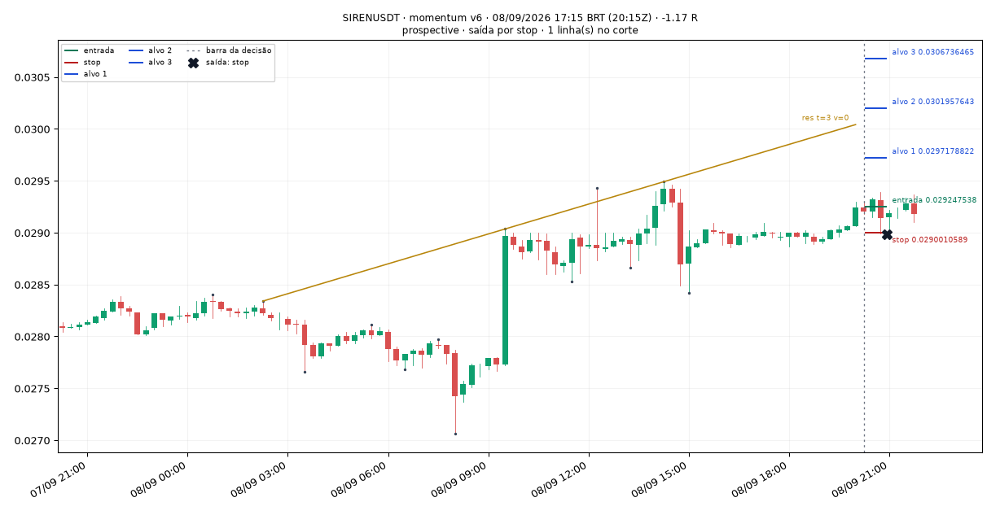

> Momentum 15m: fechamento 0.02924 acima da máxima dos 20 fechamentos anteriores (0.02906), retorno 15m 0.62%, volume relativo 2.88x da mediana de 96 barras, ATR% 0.54%

### 205 — VETUSDT · 08/09/2026 17:30 BRT · -0.22 R

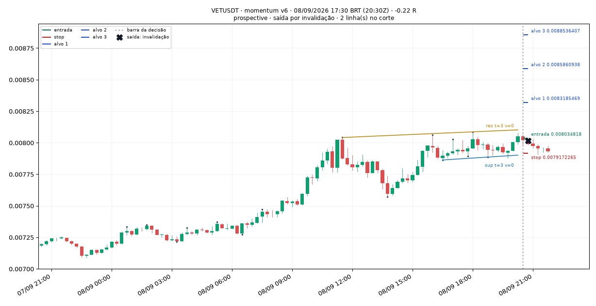

> Momentum 15m: fechamento 0.008051 acima da máxima dos 20 fechamentos anteriores (0.008028), retorno 15m 0.57%, volume relativo 2.94x da mediana de 96 barras, ATR% 1.11%

### 206 — PRLUSDT · 08/09/2026 17:45 BRT · -0.50 R

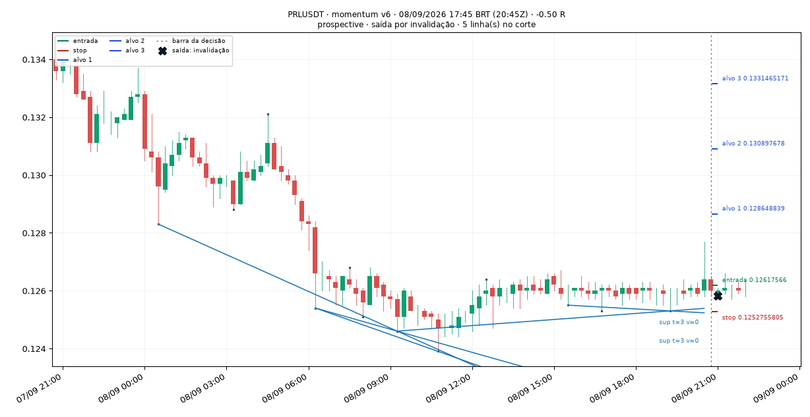

> Momentum 15m: fechamento 0.1264 acima da máxima dos 20 fechamentos anteriores (0.1261), retorno 15m 0.40%, volume relativo 2.34x da mediana de 96 barras, ATR% 0.59%

### 207 — BTRUSDT · 08/09/2026 18:00 BRT · -0.40 R

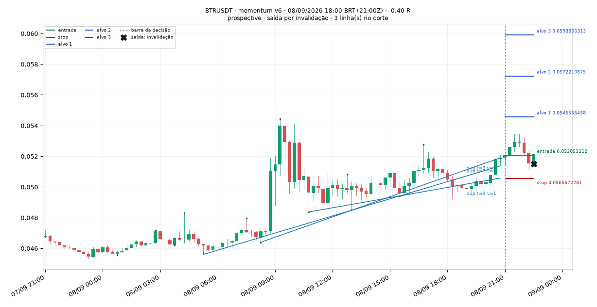

> Momentum 15m: fechamento 0.05189 acima da máxima dos 20 fechamentos anteriores (0.05185), retorno 15m 0.17%, volume relativo 1.59x da mediana de 96 barras, ATR% 1.71%

### 208 — RAYSOLUSDT · 08/09/2026 18:00 BRT · -1.07 R

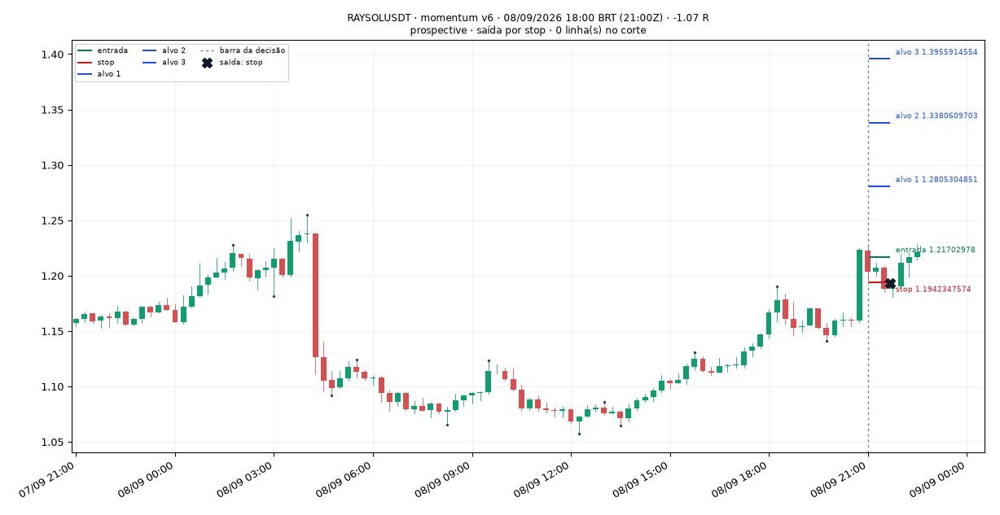

> Momentum 15m: fechamento 1.223 acima da máxima dos 20 fechamentos anteriores (1.1781), retorno 15m 5.48%, volume relativo 5.75x da mediana de 96 barras, ATR% 1.57%

### 209 — CATIUSDT · 08/09/2026 18:15 BRT · -1.08 R

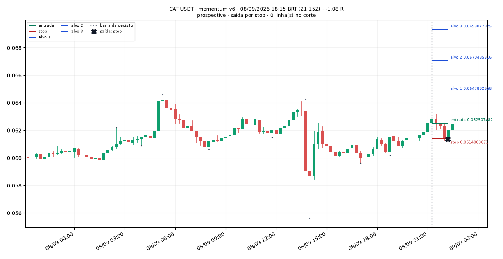

> Momentum 15m: fechamento 0.06253 acima da máxima dos 20 fechamentos anteriores (0.06188), retorno 15m 1.05%, volume relativo 3.21x da mediana de 96 barras, ATR% 1.20%

### 210 — BIOUSDT · 08/09/2026 18:15 BRT · -1.24 R

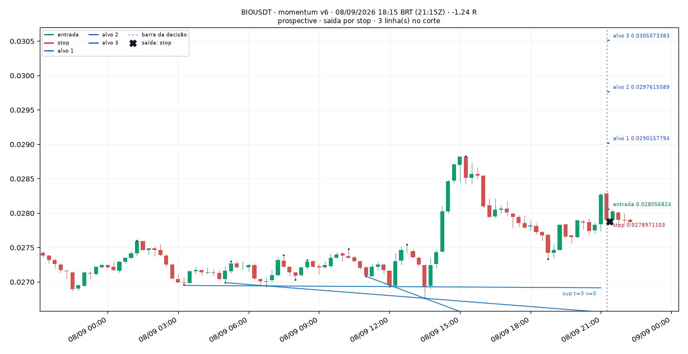

> Momentum 15m: fechamento 0.02827 acima da máxima dos 20 fechamentos anteriores (0.0281), retorno 15m 1.58%, volume relativo 4.10x da mediana de 96 barras, ATR% 0.88%

### 211 — FFUSDT · 08/09/2026 18:30 BRT · -0.75 R

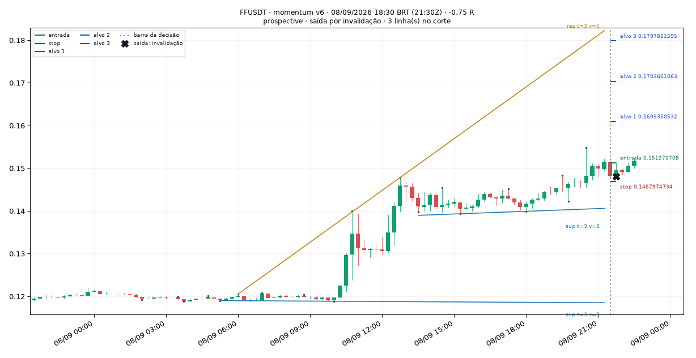

> Momentum 15m: fechamento 0.15151 acima da máxima dos 20 fechamentos anteriores (0.15045), retorno 15m 1.10%, volume relativo 8.03x da mediana de 96 barras, ATR% 2.07%

### 212 — MIRAUSDT · 08/09/2026 18:30 BRT · -1.23 R

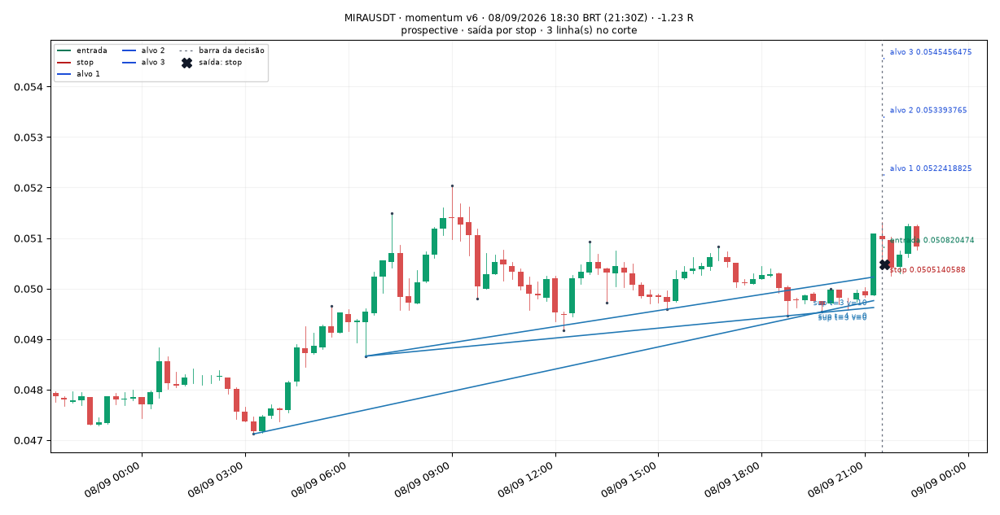

> Momentum 15m: fechamento 0.05109 acima da máxima dos 20 fechamentos anteriores (0.05062), retorno 15m 2.47%, volume relativo 2.40x da mediana de 96 barras, ATR% 0.75%

### 213 — 1000LUNCUSDT · 08/09/2026 18:45 BRT · -0.41 R

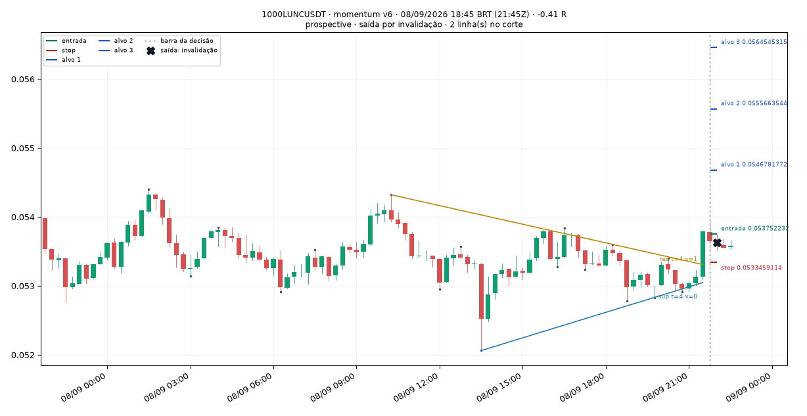

> Momentum 15m: fechamento 0.05379 acima da máxima dos 20 fechamentos anteriores (0.05373), retorno 15m 1.24%, volume relativo 2.22x da mediana de 96 barras, ATR% 0.55%
