# momentum v8 — operações traçadas

**184 operação(ões) concluída(s)**, coorte(s) prospective, replay, expectância **-0.0335 R** por operação (média simples de `signal_outcomes.r_multiple`, líquida de custos e funding). Corte da leitura: 08/09/2026 20:15 BRT (23:15Z).

As linhas de tendência destes gráficos são traçadas pelo **mesmo código congelado**
que decide (`hunter_core.strategies.tl_scan`, parâmetros de
`trendline_breakout_v1.default_parameters`), cortado na barra da decisão: nenhuma
vela posterior à decisão participa do traçado. Para toda versão que **não é**
`trendline_breakout_v1`, elas são **contexto calculado depois** — a estratégia não
leu linha nenhuma para decidir. Ver [[Operacoes-tracadas/README]] e [[KB-0076-por-que-perdemos-2026-09-08]].

> [!info] Esta versão **não lê** linhas de tendência para decidir. As linhas abaixo são contexto, nunca entrada da decisão.

**Contrato da hipótese:** `EXP-0018-stop-largo` (T3.47 V2, stop ×2 sobre a `momentum v6`) — em redação por outra tarefa, ainda sem nota no vault.

## Tabela

| # | Decisão (BRT) | UTC | Mercado | Coorte | Entrada | Stop | Alvo | Saída | R | Linhas no corte | `line_id` usado | Gráfico |
|---|---|---|---|---|---|---|---|---|---|---|---|---|
| 001 | 11/08 11:15 | 14:15Z | DOGEUSDT | replay | 0.0713127620 | 0.0704599365 | 0.0723801270 | invalidação | -0.71 | 3 | `—` | [20260811-1415Z-DOGEUSDT-invalidated.png](../../attachments/operacoes/momentum-v8/20260811-1415Z-DOGEUSDT-invalidated.png) |
| 002 | 11/08 14:00 | 17:00Z | XRPUSDT | replay | 1.0117066600 | 0.9946482673 | 1.0383034655 | invalidação | -0.25 | 4 | `—` | [20260811-1700Z-XRPUSDT-invalidated.png](../../attachments/operacoes/momentum-v8/20260811-1700Z-XRPUSDT-invalidated.png) |
| 003 | 11/08 17:00 | 20:00Z | DOGEUSDT | replay | 0.0711826840 | 0.0701289919 | 0.0727720162 | alvo | +1.41 | 0 | `—` | [20260811-2000Z-DOGEUSDT-target.png](../../attachments/operacoes/momentum-v8/20260811-2000Z-DOGEUSDT-target.png) |
| 004 | 11/08 17:00 | 20:00Z | ETHUSDT | replay | 1883.1892360000 | 1863.2415994183 | 1917.0268011635 | horizonte | -0.27 | 1 | `—` | [20260811-2000Z-ETHUSDT-expired.png](../../attachments/operacoes/momentum-v8/20260811-2000Z-ETHUSDT-expired.png) |
| 005 | 11/08 17:00 | 20:00Z | XRPUSDT | replay | 1.0164094800 | 1.0028063678 | 1.0396872644 | horizonte | +0.31 | 1 | `—` | [20260811-2000Z-XRPUSDT-expired.png](../../attachments/operacoes/momentum-v8/20260811-2000Z-XRPUSDT-expired.png) |
| 006 | 11/08 17:00 | 20:00Z | SOLUSDT | replay | 75.7954500000 | 74.9484450021 | 76.9931099957 | horizonte | +0.36 | 3 | `—` | [20260811-2000Z-SOLUSDT-expired.png](../../attachments/operacoes/momentum-v8/20260811-2000Z-SOLUSDT-expired.png) |
| 007 | 13/08 00:00 | 03:00Z | DOGEUSDT | replay | 0.0703421800 | 0.0695942067 | 0.0715915866 | horizonte | +0.27 | 1 | `—` | [20260813-0300Z-DOGEUSDT-expired.png](../../attachments/operacoes/momentum-v8/20260813-0300Z-DOGEUSDT-expired.png) |
| 008 | 16/08 22:45 | 01:45Z | SOLUSDT | replay | 75.2351140000 | 74.5543615536 | 76.6412768929 | invalidação | -0.41 | 0 | `—` | [20260817-0145Z-SOLUSDT-invalidated.png](../../attachments/operacoes/momentum-v8/20260817-0145Z-SOLUSDT-invalidated.png) |
| 009 | 16/08 23:45 | 02:45Z | SOLUSDT | replay | 75.3351740000 | 74.6500402469 | 76.6899195062 | horizonte | +0.32 | 0 | `—` | [20260817-0245Z-SOLUSDT-expired.png](../../attachments/operacoes/momentum-v8/20260817-0245Z-SOLUSDT-expired.png) |
| 010 | 18/08 12:30 | 15:30Z | SOLUSDT | replay | 77.0962300000 | 76.2650429645 | 78.4699140709 | invalidação | -0.42 | 3 | `—` | [20260818-1530Z-SOLUSDT-invalidated.png](../../attachments/operacoes/momentum-v8/20260818-1530Z-SOLUSDT-invalidated.png) |
| 011 | 19/08 10:30 | 13:30Z | SOLUSDT | replay | 78.6071360000 | 77.7599765932 | 79.8900468136 | invalidação | -0.41 | 4 | `—` | [20260819-1330Z-SOLUSDT-invalidated.png](../../attachments/operacoes/momentum-v8/20260819-1330Z-SOLUSDT-invalidated.png) |
| 012 | 19/08 11:45 | 14:45Z | SOLUSDT | replay | 79.0774180000 | 78.1299496974 | 80.7101006052 | alvo | +1.60 | 5 | `—` | [20260819-1445Z-SOLUSDT-target.png](../../attachments/operacoes/momentum-v8/20260819-1445Z-SOLUSDT-target.png) |
| 013 | 19/08 12:00 | 15:00Z | XRPUSDT | replay | 1.0320188400 | 1.0206889504 | 1.0567220992 | alvo | +2.05 | 3 | `—` | [20260819-1500Z-XRPUSDT-target.png](../../attachments/operacoes/momentum-v8/20260819-1500Z-XRPUSDT-target.png) |
| 014 | 19/08 12:00 | 15:00Z | ETHUSDT | replay | 1973.8235840000 | 1946.1809340353 | 2017.3081319295 | alvo | +1.47 | 2 | `—` | [20260819-1500Z-ETHUSDT-target.png](../../attachments/operacoes/momentum-v8/20260819-1500Z-ETHUSDT-target.png) |
| 015 | 19/08 12:15 | 15:15Z | DOGEUSDT | replay | 0.0719931700 | 0.0710758056 | 0.0734583887 | alvo | +1.49 | 3 | `—` | [20260819-1515Z-DOGEUSDT-target.png](../../attachments/operacoes/momentum-v8/20260819-1515Z-DOGEUSDT-target.png) |
| 016 | 19/08 13:15 | 16:15Z | ETHUSDT | replay | 2096.8973840000 | 2028.3756997101 | 2210.2186005799 | invalidação | -0.31 | 2 | `—` | [20260819-1615Z-ETHUSDT-invalidated.png](../../attachments/operacoes/momentum-v8/20260819-1615Z-ETHUSDT-invalidated.png) |
| 017 | 19/08 17:00 | 20:00Z | ETHUSDT | replay | 2103.4513140000 | 2059.7335576502 | 2183.4428846995 | alvo | +1.76 | 0 | `—` | [20260819-2000Z-ETHUSDT-target.png](../../attachments/operacoes/momentum-v8/20260819-2000Z-ETHUSDT-target.png) |
| 018 | 19/08 17:15 | 20:15Z | XRPUSDT | replay | 1.0757450600 | 1.0549564486 | 1.1108871028 | alvo | +1.62 | 1 | `—` | [20260819-2015Z-XRPUSDT-target.png](../../attachments/operacoes/momentum-v8/20260819-2015Z-XRPUSDT-target.png) |
| 019 | 19/08 18:00 | 21:00Z | SOLUSDT | replay | 83.8202620000 | 82.1564958211 | 86.8170083579 | alvo | +1.73 | 1 | `—` | [20260819-2100Z-SOLUSDT-target.png](../../attachments/operacoes/momentum-v8/20260819-2100Z-SOLUSDT-target.png) |
| 020 | 19/08 18:00 | 21:00Z | DOGEUSDT | replay | 0.0741644720 | 0.0728726359 | 0.0767347282 | horizonte | +0.87 | 2 | `—` | [20260819-2100Z-DOGEUSDT-expired.png](../../attachments/operacoes/momentum-v8/20260819-2100Z-DOGEUSDT-expired.png) |
| 021 | 20/08 03:30 | 06:30Z | SOLUSDT | replay | 85.4812580000 | 84.2813409552 | 87.7573180897 | alvo | +1.79 | 1 | `—` | [20260820-0630Z-SOLUSDT-target.png](../../attachments/operacoes/momentum-v8/20260820-0630Z-SOLUSDT-target.png) |
| 022 | 20/08 05:15 | 08:15Z | XRPUSDT | replay | 1.1271759000 | 1.1105008078 | 1.1641983843 | alvo | +2.12 | 2 | `—` | [20260820-0815Z-XRPUSDT-target.png](../../attachments/operacoes/momentum-v8/20260820-0815Z-XRPUSDT-target.png) |
| 023 | 20/08 05:15 | 08:15Z | ETHUSDT | replay | 2276.1548740000 | 2244.9089961752 | 2361.3120076495 | horizonte | -0.20 | 1 | `—` | [20260820-0815Z-ETHUSDT-expired.png](../../attachments/operacoes/momentum-v8/20260820-0815Z-ETHUSDT-expired.png) |
| 024 | 20/08 05:15 | 08:15Z | DOGEUSDT | replay | 0.0763357740 | 0.0752562773 | 0.0788374455 | horizonte | +0.36 | 0 | `—` | [20260820-0815Z-DOGEUSDT-expired.png](../../attachments/operacoes/momentum-v8/20260820-0815Z-DOGEUSDT-expired.png) |
| 025 | 20/08 08:45 | 11:45Z | XRPUSDT | replay | 1.1945162800 | 1.1606109222 | 1.2454781556 | alvo | +1.45 | 2 | `—` | [20260820-1145Z-XRPUSDT-target.png](../../attachments/operacoes/momentum-v8/20260820-1145Z-XRPUSDT-target.png) |
| 026 | 20/08 10:30 | 13:30Z | DOGEUSDT | replay | 0.0774264280 | 0.0762750323 | 0.0807299354 | invalidação | -0.13 | 3 | `—` | [20260820-1330Z-DOGEUSDT-invalidated.png](../../attachments/operacoes/momentum-v8/20260820-1330Z-DOGEUSDT-invalidated.png) |
| 027 | 20/08 11:15 | 14:15Z | DOGEUSDT | replay | 0.0778967100 | 0.0763613617 | 0.0812772765 | invalidação | -0.23 | 2 | `—` | [20260820-1415Z-DOGEUSDT-invalidated.png](../../attachments/operacoes/momentum-v8/20260820-1415Z-DOGEUSDT-invalidated.png) |
| 028 | 20/08 12:00 | 15:00Z | DOGEUSDT | replay | 0.0784370340 | 0.0767562068 | 0.0818075865 | alvo | +1.93 | 2 | `—` | [20260820-1500Z-DOGEUSDT-target.png](../../attachments/operacoes/momentum-v8/20260820-1500Z-DOGEUSDT-target.png) |
| 029 | 20/08 12:15 | 15:15Z | XRPUSDT | replay | 1.2588548600 | 1.2151933104 | 1.3550133793 | invalidação | -0.72 | 1 | `—` | [20260820-1515Z-XRPUSDT-invalidated.png](../../attachments/operacoes/momentum-v8/20260820-1515Z-XRPUSDT-invalidated.png) |
| 030 | 20/08 12:30 | 15:30Z | ETHUSDT | replay | 2317.0994260000 | 2263.3271028814 | 2412.2857942371 | invalidação | -0.33 | 3 | `—` | [20260820-1530Z-ETHUSDT-invalidated.png](../../attachments/operacoes/momentum-v8/20260820-1530Z-ETHUSDT-invalidated.png) |
| 031 | 20/08 13:45 | 16:45Z | ETHUSDT | replay | 2344.0555900000 | 2289.6536814224 | 2465.4426371551 | invalidação | -0.41 | 3 | `—` | [20260820-1645Z-ETHUSDT-invalidated.png](../../attachments/operacoes/momentum-v8/20260820-1645Z-ETHUSDT-invalidated.png) |
| 032 | 20/08 21:30 | 00:30Z | DOGEUSDT | replay | 0.0811686720 | 0.0792573178 | 0.0846953644 | horizonte | +0.37 | 0 | `—` | [20260821-0030Z-DOGEUSDT-expired.png](../../attachments/operacoes/momentum-v8/20260821-0030Z-DOGEUSDT-expired.png) |
| 033 | 20/08 21:30 | 00:30Z | SOLUSDT | replay | 88.3329680000 | 87.1503348165 | 90.8393303671 | invalidação | -0.45 | 3 | `—` | [20260821-0030Z-SOLUSDT-invalidated.png](../../attachments/operacoes/momentum-v8/20260821-0030Z-SOLUSDT-invalidated.png) |
| 034 | 20/08 22:30 | 01:30Z | ETHUSDT | replay | 2351.2098800000 | 2310.2841288333 | 2436.3317423334 | invalidação | -0.24 | 3 | `—` | [20260821-0130Z-ETHUSDT-invalidated.png](../../attachments/operacoes/momentum-v8/20260821-0130Z-ETHUSDT-invalidated.png) |
| 035 | 20/08 23:00 | 02:00Z | XRPUSDT | replay | 1.2914744200 | 1.2559608989 | 1.3751782021 | invalidação | -0.16 | 0 | `—` | [20260821-0200Z-XRPUSDT-invalidated.png](../../attachments/operacoes/momentum-v8/20260821-0200Z-XRPUSDT-invalidated.png) |
| 036 | 20/08 23:00 | 02:00Z | SOLUSDT | replay | 88.8832980000 | 87.4198658734 | 92.1302682532 | horizonte | +0.93 | 5 | `—` | [20260821-0200Z-SOLUSDT-expired.png](../../attachments/operacoes/momentum-v8/20260821-0200Z-SOLUSDT-expired.png) |
| 037 | 21/08 03:30 | 06:30Z | DOGEUSDT | replay | 0.0834200220 | 0.0815587301 | 0.0869625398 | horizonte | +0.25 | 0 | `—` | [20260821-0630Z-DOGEUSDT-expired.png](../../attachments/operacoes/momentum-v8/20260821-0630Z-DOGEUSDT-expired.png) |
| 038 | 21/08 05:15 | 08:15Z | XRPUSDT | replay | 1.3515104200 | 1.3039972038 | 1.4285055925 | alvo | +1.58 | 2 | `—` | [20260821-0815Z-XRPUSDT-target.png](../../attachments/operacoes/momentum-v8/20260821-0815Z-XRPUSDT-target.png) |
| 039 | 21/08 05:30 | 08:30Z | ETHUSDT | replay | 2388.7724040000 | 2342.5876260012 | 2475.7647479975 | invalidação | -0.41 | 2 | `—` | [20260821-0830Z-ETHUSDT-invalidated.png](../../attachments/operacoes/momentum-v8/20260821-0830Z-ETHUSDT-invalidated.png) |
| 040 | 21/08 05:30 | 08:30Z | SOLUSDT | replay | 91.4648460000 | 89.4136297207 | 95.2827405587 | invalidação | -0.55 | 5 | `—` | [20260821-0830Z-SOLUSDT-invalidated.png](../../attachments/operacoes/momentum-v8/20260821-0830Z-SOLUSDT-invalidated.png) |
| 041 | 21/08 14:15 | 17:15Z | ETHUSDT | replay | 2414.0075360000 | 2366.6525320566 | 2511.5449358869 | horizonte | +0.67 | 4 | `—` | [20260821-1715Z-ETHUSDT-expired.png](../../attachments/operacoes/momentum-v8/20260821-1715Z-ETHUSDT-expired.png) |
| 042 | 21/08 17:45 | 20:45Z | DOGEUSDT | replay | 0.0866719720 | 0.0842383028 | 0.0915033944 | alvo | +1.93 | 5 | `—` | [20260821-2045Z-DOGEUSDT-target.png](../../attachments/operacoes/momentum-v8/20260821-2045Z-DOGEUSDT-target.png) |
| 043 | 21/08 18:30 | 21:30Z | SOLUSDT | replay | 92.9257220000 | 91.0059452272 | 96.3881095456 | horizonte | +0.56 | 6 | `—` | [20260821-2130Z-SOLUSDT-expired.png](../../attachments/operacoes/momentum-v8/20260821-2130Z-SOLUSDT-expired.png) |
| 044 | 21/08 19:15 | 22:15Z | XRPUSDT | replay | 1.4257549400 | 1.3772143015 | 1.5241713970 | horizonte | +1.61 | 4 | `—` | [20260821-2215Z-XRPUSDT-expired.png](../../attachments/operacoes/momentum-v8/20260821-2215Z-XRPUSDT-expired.png) |
| 045 | 21/08 19:45 | 22:45Z | DOGEUSDT | replay | 0.0939563400 | 0.0900460103 | 0.1015479794 | invalidação | -0.28 | 5 | `—` | [20260821-2245Z-DOGEUSDT-invalidated.png](../../attachments/operacoes/momentum-v8/20260821-2245Z-DOGEUSDT-invalidated.png) |
| 046 | 21/08 23:45 | 02:45Z | SOLUSDT | replay | 95.6073300000 | 93.4484583000 | 100.2330833999 | alvo | +2.08 | 3 | `—` | [20260822-0245Z-SOLUSDT-target.png](../../attachments/operacoes/momentum-v8/20260822-0245Z-SOLUSDT-target.png) |
| 047 | 22/08 00:30 | 03:30Z | DOGEUSDT | replay | 0.0967680260 | 0.0929835701 | 0.1041328597 | stop | -1.03 | 3 | `—` | [20260822-0330Z-DOGEUSDT-stop.png](../../attachments/operacoes/momentum-v8/20260822-0330Z-DOGEUSDT-stop.png) |
| 048 | 22/08 00:30 | 03:30Z | XRPUSDT | replay | 1.5819486000 | 1.4969077409 | 1.7266845182 | stop | -1.03 | 1 | `—` | [20260822-0330Z-XRPUSDT-stop.png](../../attachments/operacoes/momentum-v8/20260822-0330Z-XRPUSDT-stop.png) |
| 049 | 22/08 14:30 | 17:30Z | DOGEUSDT | replay | 0.0925054700 | 0.0890179559 | 0.0980840882 | horizonte | +0.21 | 0 | `—` | [20260822-1730Z-DOGEUSDT-expired.png](../../attachments/operacoes/momentum-v8/20260822-1730Z-DOGEUSDT-expired.png) |
| 050 | 22/08 17:00 | 20:00Z | ETHUSDT | replay | 2439.9230760000 | 2412.4078965792 | 2489.7242068416 | invalidação | -0.45 | 1 | `—` | [20260822-2000Z-ETHUSDT-invalidated.png](../../attachments/operacoes/momentum-v8/20260822-2000Z-ETHUSDT-invalidated.png) |
| 051 | 22/08 21:45 | 00:45Z | SOLUSDT | replay | 96.7480140000 | 93.6013571996 | 101.8472856008 | invalidação | -0.78 | 0 | `—` | [20260823-0045Z-SOLUSDT-invalidated.png](../../attachments/operacoes/momentum-v8/20260823-0045Z-SOLUSDT-invalidated.png) |
| 052 | 23/08 05:45 | 08:45Z | ETHUSDT | replay | 2422.1424140000 | 2382.5482289428 | 2493.0135421143 | invalidação | -0.34 | 1 | `—` | [20260823-0845Z-ETHUSDT-invalidated.png](../../attachments/operacoes/momentum-v8/20260823-0845Z-ETHUSDT-invalidated.png) |
| 053 | 23/08 07:30 | 10:30Z | DOGEUSDT | replay | 0.0920451940 | 0.0897496944 | 0.0963206113 | horizonte | +0.87 | 1 | `—` | [20260823-1030Z-DOGEUSDT-expired.png](../../attachments/operacoes/momentum-v8/20260823-1030Z-DOGEUSDT-expired.png) |
| 054 | 23/08 08:30 | 11:30Z | XRPUSDT | replay | 1.4946962800 | 1.4480549634 | 1.5819900732 | invalidação | -0.13 | 2 | `—` | [20260823-1130Z-XRPUSDT-invalidated.png](../../attachments/operacoes/momentum-v8/20260823-1130Z-XRPUSDT-invalidated.png) |
| 055 | 23/08 08:30 | 11:30Z | SOLUSDT | replay | 94.4566400000 | 92.6405005829 | 97.6789988342 | horizonte | +0.56 | 0 | `—` | [20260823-1130Z-SOLUSDT-expired.png](../../attachments/operacoes/momentum-v8/20260823-1130Z-SOLUSDT-expired.png) |
| 056 | 23/08 08:30 | 11:30Z | ETHUSDT | replay | 2429.5468540000 | 2397.2420531559 | 2486.2758936882 | stop | -1.10 | 1 | `—` | [20260823-1130Z-ETHUSDT-stop.png](../../attachments/operacoes/momentum-v8/20260823-1130Z-ETHUSDT-stop.png) |
| 057 | 23/08 10:30 | 13:30Z | XRPUSDT | replay | 1.5089048000 | 1.4627400542 | 1.5889198916 | stop | -1.04 | 3 | `—` | [20260823-1330Z-XRPUSDT-stop.png](../../attachments/operacoes/momentum-v8/20260823-1330Z-XRPUSDT-stop.png) |
| 058 | 23/08 18:15 | 21:15Z | ETHUSDT | replay | 2467.4796000000 | 2432.2230631835 | 2530.7038736331 | invalidação | -0.65 | 1 | `—` | [20260823-2115Z-ETHUSDT-invalidated.png](../../attachments/operacoes/momentum-v8/20260823-2115Z-ETHUSDT-invalidated.png) |
| 059 | 23/08 18:15 | 21:15Z | SOLUSDT | replay | 95.7974440000 | 94.2768008417 | 98.3963983166 | invalidação | -0.43 | 2 | `—` | [20260823-2115Z-SOLUSDT-invalidated.png](../../attachments/operacoes/momentum-v8/20260823-2115Z-SOLUSDT-invalidated.png) |
| 060 | 23/08 18:30 | 21:30Z | XRPUSDT | replay | 1.5377220800 | 1.4913878262 | 1.6237243477 | invalidação | -0.48 | 3 | `—` | [20260823-2130Z-XRPUSDT-invalidated.png](../../attachments/operacoes/momentum-v8/20260823-2130Z-XRPUSDT-invalidated.png) |
| 061 | 24/08 04:15 | 07:15Z | ETHUSDT | replay | 2467.4896060000 | 2429.6092618818 | 2549.2814762364 | invalidação | -0.51 | 5 | `—` | [20260824-0715Z-ETHUSDT-invalidated.png](../../attachments/operacoes/momentum-v8/20260824-0715Z-ETHUSDT-invalidated.png) |
| 062 | 24/08 04:15 | 07:15Z | XRPUSDT | replay | 1.4945962200 | 1.4517633824 | 1.5877732353 | invalidação | -0.50 | 2 | `—` | [20260824-0715Z-XRPUSDT-invalidated.png](../../attachments/operacoes/momentum-v8/20260824-0715Z-XRPUSDT-invalidated.png) |
| 063 | 24/08 04:15 | 07:15Z | SOLUSDT | replay | 95.2070900000 | 93.4424413187 | 99.0451173627 | invalidação | -0.59 | 5 | `—` | [20260824-0715Z-SOLUSDT-invalidated.png](../../attachments/operacoes/momentum-v8/20260824-0715Z-SOLUSDT-invalidated.png) |
| 064 | 24/08 07:15 | 10:15Z | ETHUSDT | replay | 2480.4273640000 | 2444.9950479759 | 2556.7899040482 | invalidação | -0.52 | 4 | `—` | [20260824-1015Z-ETHUSDT-invalidated.png](../../attachments/operacoes/momentum-v8/20260824-1015Z-ETHUSDT-invalidated.png) |
| 065 | 24/08 08:45 | 11:45Z | XRPUSDT | replay | 1.5056028200 | 1.4690051108 | 1.5859897784 | invalidação | -0.30 | 4 | `—` | [20260824-1145Z-XRPUSDT-invalidated.png](../../attachments/operacoes/momentum-v8/20260824-1145Z-XRPUSDT-invalidated.png) |
| 066 | 24/08 08:45 | 11:45Z | SOLUSDT | replay | 96.1276420000 | 94.5531468856 | 99.6437062288 | invalidação | -0.62 | 5 | `—` | [20260824-1145Z-SOLUSDT-invalidated.png](../../attachments/operacoes/momentum-v8/20260824-1145Z-SOLUSDT-invalidated.png) |
| 067 | 24/08 08:45 | 11:45Z | ETHUSDT | replay | 2501.0297180000 | 2463.5964857987 | 2590.6270284027 | horizonte | -0.19 | 5 | `—` | [20260824-1145Z-ETHUSDT-expired.png](../../attachments/operacoes/momentum-v8/20260824-1145Z-ETHUSDT-expired.png) |
| 068 | 24/08 08:45 | 11:45Z | DOGEUSDT | replay | 0.0925254820 | 0.0906683872 | 0.0967932256 | invalidação | -0.23 | 2 | `—` | [20260824-1145Z-DOGEUSDT-invalidated.png](../../attachments/operacoes/momentum-v8/20260824-1145Z-DOGEUSDT-invalidated.png) |
| 069 | 24/08 10:00 | 13:00Z | DOGEUSDT | replay | 0.0929957640 | 0.0909921496 | 0.0977057008 | invalidação | -0.34 | 5 | `—` | [20260824-1300Z-DOGEUSDT-invalidated.png](../../attachments/operacoes/momentum-v8/20260824-1300Z-DOGEUSDT-invalidated.png) |
| 070 | 24/08 10:00 | 13:00Z | SOLUSDT | replay | 96.1976840000 | 94.1386431274 | 100.5027137452 | invalidação | -0.14 | 5 | `—` | [20260824-1300Z-SOLUSDT-invalidated.png](../../attachments/operacoes/momentum-v8/20260824-1300Z-SOLUSDT-invalidated.png) |
| 071 | 24/08 10:00 | 13:00Z | XRPUSDT | replay | 1.5134075000 | 1.4748058095 | 1.6004883811 | invalidação | -0.73 | 4 | `—` | [20260824-1300Z-XRPUSDT-invalidated.png](../../attachments/operacoes/momentum-v8/20260824-1300Z-XRPUSDT-invalidated.png) |
| 072 | 24/08 11:45 | 14:45Z | SOLUSDT | replay | 96.4678460000 | 94.0929702833 | 101.1640594333 | invalidação | -0.22 | 4 | `—` | [20260824-1445Z-SOLUSDT-invalidated.png](../../attachments/operacoes/momentum-v8/20260824-1445Z-SOLUSDT-invalidated.png) |
| 073 | 24/08 11:45 | 14:45Z | XRPUSDT | replay | 1.5242139800 | 1.4727630389 | 1.6207739221 | invalidação | -0.32 | 4 | `—` | [20260824-1445Z-XRPUSDT-invalidated.png](../../attachments/operacoes/momentum-v8/20260824-1445Z-XRPUSDT-invalidated.png) |
| 074 | 24/08 12:30 | 15:30Z | SOLUSDT | replay | 97.2082900000 | 94.8126797856 | 102.2746404288 | invalidação | -0.39 | 4 | `—` | [20260824-1530Z-SOLUSDT-invalidated.png](../../attachments/operacoes/momentum-v8/20260824-1530Z-SOLUSDT-invalidated.png) |
| 075 | 24/08 19:45 | 22:45Z | SOLUSDT | replay | 97.8586800000 | 95.6267513762 | 101.6664972475 | invalidação | -0.26 | 6 | `—` | [20260824-2245Z-SOLUSDT-invalidated.png](../../attachments/operacoes/momentum-v8/20260824-2245Z-SOLUSDT-invalidated.png) |
| 076 | 24/08 21:15 | 00:15Z | SOLUSDT | replay | 99.8798920000 | 97.7505327041 | 106.2389345918 | horizonte | +0.61 | 6 | `—` | [20260825-0015Z-SOLUSDT-expired.png](../../attachments/operacoes/momentum-v8/20260825-0015Z-SOLUSDT-expired.png) |
| 077 | 24/08 21:45 | 00:45Z | XRPUSDT | replay | 1.5127070800 | 1.4713643648 | 1.5830712705 | horizonte | -0.14 | 5 | `—` | [20260825-0045Z-XRPUSDT-expired.png](../../attachments/operacoes/momentum-v8/20260825-0045Z-XRPUSDT-expired.png) |
| 078 | 24/08 22:00 | 01:00Z | ETHUSDT | replay | 2495.3363040000 | 2459.3473359805 | 2557.9053280391 | invalidação | -0.30 | 2 | `—` | [20260825-0100Z-ETHUSDT-invalidated.png](../../attachments/operacoes/momentum-v8/20260825-0100Z-ETHUSDT-invalidated.png) |
| 079 | 24/08 22:00 | 01:00Z | DOGEUSDT | replay | 0.0915649060 | 0.0894912617 | 0.0952174767 | invalidação | -0.30 | 2 | `—` | [20260825-0100Z-DOGEUSDT-invalidated.png](../../attachments/operacoes/momentum-v8/20260825-0100Z-DOGEUSDT-invalidated.png) |
| 080 | 24/08 23:30 | 02:30Z | DOGEUSDT | replay | 0.0927556200 | 0.0907663548 | 0.0972272905 | horizonte | -0.20 | 2 | `—` | [20260825-0230Z-DOGEUSDT-expired.png](../../attachments/operacoes/momentum-v8/20260825-0230Z-DOGEUSDT-expired.png) |
| 081 | 24/08 23:30 | 02:30Z | ETHUSDT | replay | 2528.1960080000 | 2489.5189653431 | 2607.6320693139 | stop | -1.09 | 4 | `—` | [20260825-0230Z-ETHUSDT-stop.png](../../attachments/operacoes/momentum-v8/20260825-0230Z-ETHUSDT-stop.png) |
| 082 | 25/08 02:30 | 05:30Z | SOLUSDT | replay | 102.6115300000 | 99.6882852975 | 108.6634294051 | invalidação | -0.36 | 3 | `—` | [20260825-0530Z-SOLUSDT-invalidated.png](../../attachments/operacoes/momentum-v8/20260825-0530Z-SOLUSDT-invalidated.png) |
| 083 | 26/08 07:45 | 10:45Z | SOLUSDT | replay | 97.5284820000 | 96.0322380445 | 99.9855239111 | invalidação | -0.49 | 5 | `—` | [20260826-1045Z-SOLUSDT-invalidated.png](../../attachments/operacoes/momentum-v8/20260826-1045Z-SOLUSDT-invalidated.png) |
| 084 | 26/08 08:00 | 11:00Z | DOGEUSDT | replay | 0.0868020500 | 0.0855427305 | 0.0893445390 | invalidação | -0.18 | 4 | `—` | [20260826-1100Z-DOGEUSDT-invalidated.png](../../attachments/operacoes/momentum-v8/20260826-1100Z-DOGEUSDT-invalidated.png) |
| 085 | 26/08 08:00 | 11:00Z | ETHUSDT | replay | 2469.1706140000 | 2441.8387694116 | 2519.3324611769 | invalidação | -0.43 | 2 | `—` | [20260826-1100Z-ETHUSDT-invalidated.png](../../attachments/operacoes/momentum-v8/20260826-1100Z-ETHUSDT-invalidated.png) |
| 086 | 26/08 15:15 | 18:15Z | ETHUSDT | replay | 2466.6891260000 | 2433.4038604984 | 2532.3322790032 | invalidação | -0.25 | 6 | `—` | [20260826-1815Z-ETHUSDT-invalidated.png](../../attachments/operacoes/momentum-v8/20260826-1815Z-ETHUSDT-invalidated.png) |
| 087 | 26/08 16:30 | 19:30Z | ETHUSDT | replay | 2476.8051920000 | 2448.3292663321 | 2540.6714673358 | invalidação | -0.36 | 6 | `—` | [20260826-1930Z-ETHUSDT-invalidated.png](../../attachments/operacoes/momentum-v8/20260826-1930Z-ETHUSDT-invalidated.png) |
| 088 | 26/08 18:15 | 21:15Z | SOLUSDT | replay | 97.5685060000 | 96.0158493498 | 100.4083013003 | alvo | +1.74 | 5 | `—` | [20260826-2115Z-SOLUSDT-target.png](../../attachments/operacoes/momentum-v8/20260826-2115Z-SOLUSDT-target.png) |
| 089 | 26/08 18:15 | 21:15Z | ETHUSDT | replay | 2493.1750080000 | 2460.7197212390 | 2554.1405575221 | horizonte | -0.21 | 6 | `—` | [20260826-2115Z-ETHUSDT-expired.png](../../attachments/operacoes/momentum-v8/20260826-2115Z-ETHUSDT-expired.png) |
| 090 | 26/08 18:30 | 21:30Z | DOGEUSDT | replay | 0.0859615460 | 0.0846848332 | 0.0889303335 | horizonte | +0.90 | 4 | `—` | [20260826-2130Z-DOGEUSDT-expired.png](../../attachments/operacoes/momentum-v8/20260826-2130Z-DOGEUSDT-expired.png) |
| 091 | 26/08 19:15 | 22:15Z | XRPUSDT | replay | 1.4062432400 | 1.3747952737 | 1.4609094526 | invalidação | -0.27 | 5 | `—` | [20260826-2215Z-XRPUSDT-invalidated.png](../../attachments/operacoes/momentum-v8/20260826-2215Z-XRPUSDT-invalidated.png) |
| 092 | 26/08 20:15 | 23:15Z | SOLUSDT | replay | 100.5102700000 | 98.2546901500 | 104.4506196999 | horizonte | +0.14 | 5 | `—` | [20260826-2315Z-SOLUSDT-expired.png](../../attachments/operacoes/momentum-v8/20260826-2315Z-SOLUSDT-expired.png) |
| 093 | 27/08 03:00 | 06:00Z | SOLUSDT | replay | 101.8610800000 | 100.0394308978 | 105.9811382044 | invalidação | -0.34 | 3 | `—` | [20260827-0600Z-SOLUSDT-invalidated.png](../../attachments/operacoes/momentum-v8/20260827-0600Z-SOLUSDT-invalidated.png) |
| 094 | 27/08 05:15 | 08:15Z | DOGEUSDT | replay | 0.0881228420 | 0.0868962562 | 0.0909574876 | horizonte | +0.24 | 3 | `—` | [20260827-0815Z-DOGEUSDT-expired.png](../../attachments/operacoes/momentum-v8/20260827-0815Z-DOGEUSDT-expired.png) |
| 095 | 27/08 05:15 | 08:15Z | ETHUSDT | replay | 2516.1187660000 | 2492.0702342269 | 2573.1295315462 | stop | -1.15 | 3 | `—` | [20260827-0815Z-ETHUSDT-stop.png](../../attachments/operacoes/momentum-v8/20260827-0815Z-ETHUSDT-stop.png) |
| 096 | 27/08 05:15 | 08:15Z | XRPUSDT | replay | 1.4219526600 | 1.4004712329 | 1.4776575342 | horizonte | +0.20 | 2 | `—` | [20260827-0815Z-XRPUSDT-expired.png](../../attachments/operacoes/momentum-v8/20260827-0815Z-XRPUSDT-expired.png) |
| 097 | 27/08 05:15 | 08:15Z | SOLUSDT | replay | 102.7816320000 | 100.8537689795 | 107.2624620410 | horizonte | +0.72 | 3 | `—` | [20260827-0815Z-SOLUSDT-expired.png](../../attachments/operacoes/momentum-v8/20260827-0815Z-SOLUSDT-expired.png) |
| 098 | 27/08 11:00 | 14:00Z | SOLUSDT | replay | 105.9635400000 | 103.5640873056 | 110.8418253888 | horizonte | +0.76 | 0 | `—` | [20260827-1400Z-SOLUSDT-expired.png](../../attachments/operacoes/momentum-v8/20260827-1400Z-SOLUSDT-expired.png) |
| 099 | 27/08 11:30 | 14:30Z | XRPUSDT | replay | 1.4554727600 | 1.4236289645 | 1.5288420710 | invalidação | -0.47 | 3 | `—` | [20260827-1430Z-XRPUSDT-invalidated.png](../../attachments/operacoes/momentum-v8/20260827-1430Z-XRPUSDT-invalidated.png) |
| 100 | 27/08 11:45 | 14:45Z | DOGEUSDT | replay | 0.0892435140 | 0.0873361061 | 0.0931677877 | invalidação | -0.21 | 3 | `—` | [20260827-1445Z-DOGEUSDT-invalidated.png](../../attachments/operacoes/momentum-v8/20260827-1445Z-DOGEUSDT-invalidated.png) |
| 101 | 27/08 13:45 | 16:45Z | DOGEUSDT | replay | 0.0897238020 | 0.0877239426 | 0.0935021148 | invalidação | -0.31 | 2 | `—` | [20260827-1645Z-DOGEUSDT-invalidated.png](../../attachments/operacoes/momentum-v8/20260827-1645Z-DOGEUSDT-invalidated.png) |
| 102 | 27/08 17:00 | 20:00Z | SOLUSDT | replay | 108.9753460000 | 106.5902474746 | 114.8095050509 | invalidação | -0.13 | 4 | `—` | [20260827-2000Z-SOLUSDT-invalidated.png](../../attachments/operacoes/momentum-v8/20260827-2000Z-SOLUSDT-invalidated.png) |
| 103 | 27/08 22:30 | 01:30Z | XRPUSDT | replay | 1.4658790000 | 1.4421156768 | 1.5167686464 | invalidação | -0.78 | 6 | `—` | [20260828-0130Z-XRPUSDT-invalidated.png](../../attachments/operacoes/momentum-v8/20260828-0130Z-XRPUSDT-invalidated.png) |
| 104 | 27/08 22:30 | 01:30Z | DOGEUSDT | replay | 0.0898838980 | 0.0885736174 | 0.0925227651 | invalidação | -0.72 | 5 | `—` | [20260828-0130Z-DOGEUSDT-invalidated.png](../../attachments/operacoes/momentum-v8/20260828-0130Z-DOGEUSDT-invalidated.png) |
| 105 | 28/08 08:15 | 11:15Z | XRPUSDT | replay | 1.4296572800 | 1.4094261141 | 1.4648477718 | invalidação | -0.32 | 3 | `—` | [20260828-1115Z-XRPUSDT-invalidated.png](../../attachments/operacoes/momentum-v8/20260828-1115Z-XRPUSDT-invalidated.png) |
| 106 | 28/08 11:45 | 14:45Z | DOGEUSDT | replay | 0.0875825180 | 0.0857776846 | 0.0912146308 | invalidação | -0.43 | 2 | `—` | [20260828-1445Z-DOGEUSDT-invalidated.png](../../attachments/operacoes/momentum-v8/20260828-1445Z-DOGEUSDT-invalidated.png) |
| 107 | 28/08 11:45 | 14:45Z | ETHUSDT | replay | 2507.3334980000 | 2465.1770796702 | 2596.1358406596 | invalidação | -0.20 | 5 | `—` | [20260828-1445Z-ETHUSDT-invalidated.png](../../attachments/operacoes/momentum-v8/20260828-1445Z-ETHUSDT-invalidated.png) |
| 108 | 28/08 12:00 | 15:00Z | XRPUSDT | replay | 1.4335596200 | 1.3942804354 | 1.5026391291 | invalidação | -0.40 | 3 | `—` | [20260828-1500Z-XRPUSDT-invalidated.png](../../attachments/operacoes/momentum-v8/20260828-1500Z-XRPUSDT-invalidated.png) |
| 109 | 28/08 12:30 | 15:30Z | SOLUSDT | replay | 106.5939180000 | 103.4907584509 | 113.1184830982 | invalidação | -0.37 | 5 | `—` | [20260828-1530Z-SOLUSDT-invalidated.png](../../attachments/operacoes/momentum-v8/20260828-1530Z-SOLUSDT-invalidated.png) |
| 110 | 29/08 11:45 | 14:45Z | SOLUSDT | replay | 105.0129700000 | 103.8920677321 | 106.9758645358 | horizonte | -0.14 | 5 | `—` | [20260829-1445Z-SOLUSDT-expired.png](../../attachments/operacoes/momentum-v8/20260829-1445Z-SOLUSDT-expired.png) |
| 111 | 29/08 16:30 | 19:30Z | SOLUSDT | replay | 105.7534140000 | 104.5494986992 | 107.9410026017 | invalidação | -0.52 | 2 | `—` | [20260829-1930Z-SOLUSDT-invalidated.png](../../attachments/operacoes/momentum-v8/20260829-1930Z-SOLUSDT-invalidated.png) |
| 112 | 30/08 10:00 | 13:00Z | DOGEUSDT | replay | 0.0853311680 | 0.0846100022 | 0.0869499956 | invalidação | -0.31 | 6 | `—` | [20260830-1300Z-DOGEUSDT-invalidated.png](../../attachments/operacoes/momentum-v8/20260830-1300Z-DOGEUSDT-invalidated.png) |
| 113 | 30/08 10:00 | 13:00Z | SOLUSDT | replay | 106.0836120000 | 104.9543675039 | 108.2112649921 | horizonte | +0.43 | 4 | `—` | [20260830-1300Z-SOLUSDT-expired.png](../../attachments/operacoes/momentum-v8/20260830-1300Z-SOLUSDT-expired.png) |
| 114 | 30/08 11:00 | 14:00Z | XRPUSDT | replay | 1.4071437800 | 1.3934250479 | 1.4371499043 | invalidação | -0.90 | 1 | `—` | [20260830-1400Z-XRPUSDT-invalidated.png](../../attachments/operacoes/momentum-v8/20260830-1400Z-XRPUSDT-invalidated.png) |
| 115 | 30/08 11:00 | 14:00Z | DOGEUSDT | replay | 0.0856513600 | 0.0848883202 | 0.0872033595 | invalidação | -0.45 | 6 | `—` | [20260830-1400Z-DOGEUSDT-invalidated.png](../../attachments/operacoes/momentum-v8/20260830-1400Z-DOGEUSDT-invalidated.png) |
| 116 | 30/08 13:15 | 16:15Z | ETHUSDT | replay | 2515.9386580000 | 2484.4560400309 | 2559.6779199383 | horizonte | -0.48 | 3 | `—` | [20260830-1615Z-ETHUSDT-expired.png](../../attachments/operacoes/momentum-v8/20260830-1615Z-ETHUSDT-expired.png) |
| 117 | 30/08 13:15 | 16:15Z | DOGEUSDT | replay | 0.0859715520 | 0.0849550276 | 0.0875799449 | invalidação | -0.52 | 3 | `—` | [20260830-1615Z-DOGEUSDT-invalidated.png](../../attachments/operacoes/momentum-v8/20260830-1615Z-DOGEUSDT-invalidated.png) |
| 118 | 30/08 13:45 | 16:45Z | XRPUSDT | replay | 1.4125470200 | 1.3939265957 | 1.4448468087 | invalidação | -0.62 | 2 | `—` | [20260830-1645Z-XRPUSDT-invalidated.png](../../attachments/operacoes/momentum-v8/20260830-1645Z-XRPUSDT-invalidated.png) |
| 119 | 30/08 15:45 | 18:45Z | DOGEUSDT | replay | 0.0863717920 | 0.0852042107 | 0.0886715787 | invalidação | -0.15 | 3 | `—` | [20260830-1845Z-DOGEUSDT-invalidated.png](../../attachments/operacoes/momentum-v8/20260830-1845Z-DOGEUSDT-invalidated.png) |
| 120 | 31/08 02:30 | 05:30Z | DOGEUSDT | replay | 0.0829097160 | 0.0814717612 | 0.0856964776 | horizonte | -0.09 | 1 | `—` | [20260831-0530Z-DOGEUSDT-expired.png](../../attachments/operacoes/momentum-v8/20260831-0530Z-DOGEUSDT-expired.png) |
| 121 | 31/08 02:30 | 05:30Z | ETHUSDT | replay | 2436.4509940000 | 2400.5349982525 | 2501.9800034949 | horizonte | +0.20 | 4 | `—` | [20260831-0530Z-ETHUSDT-expired.png](../../attachments/operacoes/momentum-v8/20260831-0530Z-ETHUSDT-expired.png) |
| 122 | 31/08 02:30 | 05:30Z | SOLUSDT | replay | 102.7516140000 | 100.6957093034 | 106.4985813931 | horizonte | +0.13 | 2 | `—` | [20260831-0530Z-SOLUSDT-expired.png](../../attachments/operacoes/momentum-v8/20260831-0530Z-SOLUSDT-expired.png) |
| 123 | 31/08 08:00 | 11:00Z | SOLUSDT | replay | 103.6321420000 | 102.1712581550 | 106.5174836900 | invalidação | -0.44 | 2 | `—` | [20260831-1100Z-SOLUSDT-invalidated.png](../../attachments/operacoes/momentum-v8/20260831-1100Z-SOLUSDT-invalidated.png) |
| 124 | 31/08 11:45 | 14:45Z | ETHUSDT | replay | 2465.7685740000 | 2430.6535850319 | 2532.2228299362 | horizonte | +0.37 | 4 | `—` | [20260831-1445Z-ETHUSDT-expired.png](../../attachments/operacoes/momentum-v8/20260831-1445Z-ETHUSDT-expired.png) |
| 125 | 31/08 15:30 | 18:30Z | SOLUSDT | replay | 103.8022440000 | 102.0951449960 | 106.9997100080 | invalidação | -0.18 | 6 | `—` | [20260831-1830Z-SOLUSDT-invalidated.png](../../attachments/operacoes/momentum-v8/20260831-1830Z-SOLUSDT-invalidated.png) |
| 126 | 01/09 00:45 | 03:45Z | DOGEUSDT | replay | 0.0832799380 | 0.0824685672 | 0.0850528656 | horizonte | -0.28 | 5 | `—` | [20260901-0345Z-DOGEUSDT-expired.png](../../attachments/operacoes/momentum-v8/20260901-0345Z-DOGEUSDT-expired.png) |
| 127 | 01/09 00:45 | 03:45Z | XRPUSDT | replay | 1.3895332200 | 1.3728395508 | 1.4249208985 | invalidação | -0.32 | 4 | `—` | [20260901-0345Z-XRPUSDT-invalidated.png](../../attachments/operacoes/momentum-v8/20260901-0345Z-XRPUSDT-invalidated.png) |
| 128 | 01/09 00:45 | 03:45Z | SOLUSDT | replay | 103.8022440000 | 102.6808184438 | 106.2183631125 | invalidação | -0.56 | 3 | `—` | [20260901-0345Z-SOLUSDT-invalidated.png](../../attachments/operacoes/momentum-v8/20260901-0345Z-SOLUSDT-invalidated.png) |
| 129 | 01/09 00:45 | 03:45Z | ETHUSDT | replay | 2476.3849400000 | 2452.6360189617 | 2521.7979620766 | invalidação | -0.36 | 5 | `—` | [20260901-0345Z-ETHUSDT-invalidated.png](../../attachments/operacoes/momentum-v8/20260901-0345Z-ETHUSDT-invalidated.png) |
| 130 | 01/09 03:00 | 06:00Z | XRPUSDT | replay | 1.3950365200 | 1.3768655447 | 1.4288689106 | invalidação | -0.36 | 4 | `—` | [20260901-0600Z-XRPUSDT-invalidated.png](../../attachments/operacoes/momentum-v8/20260901-0600Z-XRPUSDT-invalidated.png) |
| 131 | 01/09 20:45 | 23:45Z | ETHUSDT | replay | 2422.2624860000 | 2393.7819728756 | 2478.7060542487 | invalidação | -0.29 | 6 | `—` | [20260901-2345Z-ETHUSDT-invalidated.png](../../attachments/operacoes/momentum-v8/20260901-2345Z-ETHUSDT-invalidated.png) |
| 132 | 02/09 00:30 | 03:30Z | XRPUSDT | replay | 1.3541119800 | 1.3325604990 | 1.3989790019 | invalidação | -0.26 | 5 | `—` | [20260902-0330Z-XRPUSDT-invalidated.png](../../attachments/operacoes/momentum-v8/20260902-0330Z-XRPUSDT-invalidated.png) |
| 133 | 02/09 10:45 | 13:45Z | ETHUSDT | replay | 2417.3895640000 | 2382.7138554955 | 2482.9322890090 | invalidação | -0.79 | 2 | `—` | [20260902-1345Z-ETHUSDT-invalidated.png](../../attachments/operacoes/momentum-v8/20260902-1345Z-ETHUSDT-invalidated.png) |
| 134 | 02/09 10:45 | 13:45Z | DOGEUSDT | replay | 0.0819591460 | 0.0807583546 | 0.0844232908 | stop | -1.09 | 1 | `—` | [20260902-1345Z-DOGEUSDT-stop.png](../../attachments/operacoes/momentum-v8/20260902-1345Z-DOGEUSDT-stop.png) |
| 135 | 02/09 10:45 | 13:45Z | XRPUSDT | replay | 1.3451065800 | 1.3215187997 | 1.3925624007 | invalidação | -0.64 | 6 | `—` | [20260902-1345Z-XRPUSDT-invalidated.png](../../attachments/operacoes/momentum-v8/20260902-1345Z-XRPUSDT-invalidated.png) |
| 136 | 02/09 10:45 | 13:45Z | SOLUSDT | replay | 99.5496940000 | 97.8924694736 | 103.0750610528 | invalidação | -0.31 | 4 | `—` | [20260902-1345Z-SOLUSDT-invalidated.png](../../attachments/operacoes/momentum-v8/20260902-1345Z-SOLUSDT-invalidated.png) |
| 137 | 02/09 17:15 | 20:15Z | SOLUSDT | replay | 99.5296820000 | 98.2013873336 | 102.3972253328 | invalidação | -0.13 | 2 | `—` | [20260902-2015Z-SOLUSDT-invalidated.png](../../attachments/operacoes/momentum-v8/20260902-2015Z-SOLUSDT-invalidated.png) |
| 138 | 02/09 17:15 | 20:15Z | XRPUSDT | replay | 1.3492090400 | 1.3291658050 | 1.3886683900 | invalidação | -0.35 | 2 | `—` | [20260902-2015Z-XRPUSDT-invalidated.png](../../attachments/operacoes/momentum-v8/20260902-2015Z-XRPUSDT-invalidated.png) |
| 139 | 02/09 21:00 | 00:00Z | SOLUSDT | replay | 100.4102100000 | 99.1177625226 | 102.9044749548 | invalidação | -0.67 | 5 | `—` | [20260903-0000Z-SOLUSDT-invalidated.png](../../attachments/operacoes/momentum-v8/20260903-0000Z-SOLUSDT-invalidated.png) |
| 140 | 02/09 22:15 | 01:15Z | DOGEUSDT | replay | 0.0820492000 | 0.0809102957 | 0.0842994086 | horizonte | +0.51 | 3 | `—` | [20260903-0115Z-DOGEUSDT-expired.png](../../attachments/operacoes/momentum-v8/20260903-0115Z-DOGEUSDT-expired.png) |
| 141 | 02/09 22:15 | 01:15Z | XRPUSDT | replay | 1.3574139600 | 1.3382678156 | 1.3974643689 | horizonte | +0.23 | 2 | `—` | [20260903-0115Z-XRPUSDT-expired.png](../../attachments/operacoes/momentum-v8/20260903-0115Z-XRPUSDT-expired.png) |
| 142 | 02/09 23:45 | 02:45Z | ETHUSDT | replay | 2404.5718780000 | 2378.4265409765 | 2455.3569180470 | stop | -1.13 | 3 | `—` | [20260903-0245Z-ETHUSDT-stop.png](../../attachments/operacoes/momentum-v8/20260903-0245Z-ETHUSDT-stop.png) |
| 143 | 02/09 23:45 | 02:45Z | SOLUSDT | replay | 100.7604200000 | 99.2931563566 | 103.5436872869 | invalidação | -0.40 | 4 | `—` | [20260903-0245Z-SOLUSDT-invalidated.png](../../attachments/operacoes/momentum-v8/20260903-0245Z-SOLUSDT-invalidated.png) |
| 144 | 03/09 04:15 | 07:15Z | XRPUSDT | replay | 1.3709220600 | 1.3505207571 | 1.4152584858 | invalidação | -0.18 | 2 | `—` | [20260903-0715Z-XRPUSDT-invalidated.png](../../attachments/operacoes/momentum-v8/20260903-0715Z-XRPUSDT-invalidated.png) |
| 145 | 03/09 04:15 | 07:15Z | DOGEUSDT | replay | 0.0834300280 | 0.0822822332 | 0.0858155337 | invalidação | -0.37 | 2 | `—` | [20260903-0715Z-DOGEUSDT-invalidated.png](../../attachments/operacoes/momentum-v8/20260903-0715Z-DOGEUSDT-invalidated.png) |
| 146 | 03/09 04:15 | 07:15Z | SOLUSDT | replay | 101.0706060000 | 99.6933642560 | 104.0032714880 | invalidação | -0.29 | 3 | `—` | [20260903-0715Z-SOLUSDT-invalidated.png](../../attachments/operacoes/momentum-v8/20260903-0715Z-SOLUSDT-invalidated.png) |
| 147 | 03/09 04:15 | 07:15Z | ETHUSDT | replay | 2410.4454000000 | 2385.9877547659 | 2463.4844904683 | invalidação | -0.28 | 5 | `—` | [20260903-0715Z-ETHUSDT-invalidated.png](../../attachments/operacoes/momentum-v8/20260903-0715Z-ETHUSDT-invalidated.png) |
| 148 | 03/09 05:15 | 08:15Z | XRPUSDT | replay | 1.3733235000 | 1.3501980359 | 1.4204039282 | invalidação | -0.21 | 3 | `—` | [20260903-0815Z-XRPUSDT-invalidated.png](../../attachments/operacoes/momentum-v8/20260903-0815Z-XRPUSDT-invalidated.png) |
| 149 | 03/09 09:45 | 12:45Z | ETHUSDT | replay | 2413.8774580000 | 2388.3092797021 | 2460.7314405958 | alvo | +1.70 | 5 | `—` | [20260903-1245Z-ETHUSDT-target.png](../../attachments/operacoes/momentum-v8/20260903-1245Z-ETHUSDT-target.png) |
| 150 | 03/09 09:45 | 12:45Z | XRPUSDT | replay | 1.3763253000 | 1.3557293400 | 1.4132413199 | alvo | +1.70 | 2 | `—` | [20260903-1245Z-XRPUSDT-target.png](../../attachments/operacoes/momentum-v8/20260903-1245Z-XRPUSDT-target.png) |
| 151 | 03/09 09:45 | 12:45Z | SOLUSDT | replay | 101.0005640000 | 99.6512682506 | 103.5174634987 | alvo | +1.76 | 4 | `—` | [20260903-1245Z-SOLUSDT-target.png](../../attachments/operacoes/momentum-v8/20260903-1245Z-SOLUSDT-target.png) |
| 152 | 03/09 10:00 | 13:00Z | DOGEUSDT | replay | 0.0834400340 | 0.0825433249 | 0.0857733502 | alvo | +2.47 | 2 | `—` | [20260903-1300Z-DOGEUSDT-target.png](../../attachments/operacoes/momentum-v8/20260903-1300Z-DOGEUSDT-target.png) |
| 153 | 03/09 12:30 | 15:30Z | ETHUSDT | replay | 2490.9836940000 | 2450.5606241475 | 2567.1687517050 | invalidação | -0.16 | 3 | `—` | [20260903-1530Z-ETHUSDT-invalidated.png](../../attachments/operacoes/momentum-v8/20260903-1530Z-ETHUSDT-invalidated.png) |
| 154 | 03/09 13:00 | 16:00Z | XRPUSDT | replay | 1.4616764800 | 1.4240194271 | 1.5442611458 | horizonte | -0.01 | 3 | `—` | [20260903-1600Z-XRPUSDT-expired.png](../../attachments/operacoes/momentum-v8/20260903-1600Z-XRPUSDT-expired.png) |
| 155 | 03/09 13:00 | 16:00Z | SOLUSDT | replay | 104.9629400000 | 102.8366050501 | 109.7467898999 | invalidação | -0.41 | 3 | `—` | [20260903-1600Z-SOLUSDT-invalidated.png](../../attachments/operacoes/momentum-v8/20260903-1600Z-SOLUSDT-invalidated.png) |
| 156 | 03/09 13:00 | 16:00Z | DOGEUSDT | replay | 0.0893035500 | 0.0868260834 | 0.0939178332 | horizonte | -0.19 | 1 | `—` | [20260903-1600Z-DOGEUSDT-expired.png](../../attachments/operacoes/momentum-v8/20260903-1600Z-DOGEUSDT-expired.png) |
| 157 | 03/09 17:30 | 20:30Z | XRPUSDT | replay | 1.4795872200 | 1.4462892264 | 1.5501215471 | invalidação | -0.33 | 0 | `—` | [20260903-2030Z-XRPUSDT-invalidated.png](../../attachments/operacoes/momentum-v8/20260903-2030Z-XRPUSDT-invalidated.png) |
| 158 | 04/09 00:15 | 03:15Z | ETHUSDT | replay | 2511.4459640000 | 2483.2860825252 | 2564.0278349496 | invalidação | -0.30 | 1 | `—` | [20260904-0315Z-ETHUSDT-invalidated.png](../../attachments/operacoes/momentum-v8/20260904-0315Z-ETHUSDT-invalidated.png) |
| 159 | 04/09 01:30 | 04:30Z | ETHUSDT | replay | 2521.3418980000 | 2497.0683542772 | 2574.0832914456 | invalidação | -0.67 | 3 | `—` | [20260904-0430Z-ETHUSDT-invalidated.png](../../attachments/operacoes/momentum-v8/20260904-0430Z-ETHUSDT-invalidated.png) |
| 160 | 04/09 06:00 | 09:00Z | SOLUSDT | replay | 104.3925980000 | 103.1245419904 | 106.7109160193 | invalidação | -0.29 | 4 | `—` | [20260904-0900Z-SOLUSDT-invalidated.png](../../attachments/operacoes/momentum-v8/20260904-0900Z-SOLUSDT-invalidated.png) |
| 161 | 04/09 06:00 | 09:00Z | DOGEUSDT | replay | 0.0876025300 | 0.0864969608 | 0.0898660784 | invalidação | -0.25 | 2 | `—` | [20260904-0900Z-DOGEUSDT-invalidated.png](../../attachments/operacoes/momentum-v8/20260904-0900Z-DOGEUSDT-invalidated.png) |
| 162 | 04/09 06:00 | 09:00Z | ETHUSDT | replay | 2527.5055940000 | 2499.4850209726 | 2580.3199580548 | invalidação | -0.34 | 5 | `—` | [20260904-0900Z-ETHUSDT-invalidated.png](../../attachments/operacoes/momentum-v8/20260904-0900Z-ETHUSDT-invalidated.png) |
| 163 | 05/09 03:45 | 06:45Z | DOGEUSDT | replay | 0.0855212820 | 0.0846073588 | 0.0869852825 | horizonte | +0.35 | 5 | `—` | [20260905-0645Z-DOGEUSDT-expired.png](../../attachments/operacoes/momentum-v8/20260905-0645Z-DOGEUSDT-expired.png) |
| 164 | 05/09 09:45 | 12:45Z | DOGEUSDT | replay | 0.0873323680 | 0.0862737679 | 0.0893824643 | horizonte | +0.03 | 0 | `—` | [20260905-1245Z-DOGEUSDT-expired.png](../../attachments/operacoes/momentum-v8/20260905-1245Z-DOGEUSDT-expired.png) |
| 165 | 05/09 11:45 | 14:45Z | XRPUSDT | replay | 1.4172498400 | 1.4032615442 | 1.4423769116 | invalidação | -0.41 | 6 | `—` | [20260905-1445Z-XRPUSDT-invalidated.png](../../attachments/operacoes/momentum-v8/20260905-1445Z-XRPUSDT-invalidated.png) |
| 166 | 05/09 14:15 | 17:15Z | XRPUSDT | replay | 1.4190509200 | 1.4077672841 | 1.4480654318 | invalidação | -0.51 | 6 | `—` | [20260905-1715Z-XRPUSDT-invalidated.png](../../attachments/operacoes/momentum-v8/20260905-1715Z-XRPUSDT-invalidated.png) |
| 167 | 05/09 14:15 | 17:15Z | SOLUSDT | replay | 103.8122500000 | 103.0318725764 | 105.9062548473 | invalidação | -0.97 | 4 | `—` | [20260905-1715Z-SOLUSDT-invalidated.png](../../attachments/operacoes/momentum-v8/20260905-1715Z-SOLUSDT-invalidated.png) |
| 168 | 05/09 15:00 | 18:00Z | DOGEUSDT | replay | 0.0936061300 | 0.0912974611 | 0.1000050777 | stop | -1.06 | 1 | `—` | [20260905-1800Z-DOGEUSDT-stop.png](../../attachments/operacoes/momentum-v8/20260905-1800Z-DOGEUSDT-stop.png) |
| 169 | 05/09 23:00 | 02:00Z | SOLUSDT | replay | 104.1624600000 | 103.0038633022 | 105.9622733957 | alvo | +1.43 | 3 | `—` | [20260906-0200Z-SOLUSDT-target.png](../../attachments/operacoes/momentum-v8/20260906-0200Z-SOLUSDT-target.png) |
| 170 | 06/09 00:45 | 03:45Z | XRPUSDT | replay | 1.4291569800 | 1.4130435553 | 1.4573128894 | invalidação | -0.83 | 3 | `—` | [20260906-0345Z-XRPUSDT-invalidated.png](../../attachments/operacoes/momentum-v8/20260906-0345Z-XRPUSDT-invalidated.png) |
| 171 | 06/09 00:45 | 03:45Z | DOGEUSDT | replay | 0.0915749120 | 0.0901150796 | 0.0945698407 | invalidação | -0.77 | 2 | `—` | [20260906-0345Z-DOGEUSDT-invalidated.png](../../attachments/operacoes/momentum-v8/20260906-0345Z-DOGEUSDT-invalidated.png) |
| 172 | 06/09 06:30 | 09:30Z | SOLUSDT | replay | 107.2142900000 | 105.3163181414 | 110.1873637172 | invalidação | -0.57 | 2 | `—` | [20260906-0930Z-SOLUSDT-invalidated.png](../../attachments/operacoes/momentum-v8/20260906-0930Z-SOLUSDT-invalidated.png) |
| 173 | 06/09 09:45 | 12:45Z | SOLUSDT | replay | 107.0241760000 | 105.5666064423 | 109.7167871153 | invalidação | -0.28 | 0 | `—` | [20260906-1245Z-SOLUSDT-invalidated.png](../../attachments/operacoes/momentum-v8/20260906-1245Z-SOLUSDT-invalidated.png) |
| 174 | 06/09 11:00 | 14:00Z | SOLUSDT | replay | 106.9841520000 | 105.4526581242 | 110.1846837516 | invalidação | -0.50 | 1 | `—` | [20260906-1400Z-SOLUSDT-invalidated.png](../../attachments/operacoes/momentum-v8/20260906-1400Z-SOLUSDT-invalidated.png) |
| 175 | 06/09 17:30 | 20:30Z | DOGEUSDT | replay | 0.0899839580 | 0.0889339206 | 0.0918921588 | horizonte | +0.85 | 1 | `—` | [20260906-2030Z-DOGEUSDT-expired.png](../../attachments/operacoes/momentum-v8/20260906-2030Z-DOGEUSDT-expired.png) |
| 176 | 06/09 23:45 | 02:45Z | SOLUSDT | replay | 106.7039840000 | 105.0266522476 | 110.1066955048 | invalidação | -0.66 | 3 | `—` | [20260907-0245Z-SOLUSDT-invalidated.png](../../attachments/operacoes/momentum-v8/20260907-0245Z-SOLUSDT-invalidated.png) |
| 177 | 06/09 23:45 | 02:45Z | ETHUSDT | replay | 2526.5250060000 | 2496.8697638609 | 2585.0404722783 | invalidação | -0.65 | 3 | `—` | [20260907-0245Z-ETHUSDT-invalidated.png](../../attachments/operacoes/momentum-v8/20260907-0245Z-ETHUSDT-invalidated.png) |
| 178 | 07/09 09:30 | 12:30Z | DOGEUSDT | replay | 0.0904342280 | 0.0892407514 | 0.0926884971 | invalidação | -0.75 | 5 | `—` | [20260907-1230Z-DOGEUSDT-invalidated.png](../../attachments/operacoes/momentum-v8/20260907-1230Z-DOGEUSDT-invalidated.png) |
| 179 | 07/09 10:00 | 13:00Z | XRPUSDT | replay | 1.4124469600 | 1.3971475916 | 1.4405048169 | invalidação | -0.72 | 2 | `—` | [20260907-1300Z-XRPUSDT-invalidated.png](../../attachments/operacoes/momentum-v8/20260907-1300Z-XRPUSDT-invalidated.png) |
| 180 | 07/09 10:00 | 13:00Z | SOLUSDT | replay | 105.7434080000 | 104.5914126290 | 107.8571747420 | invalidação | -0.74 | 4 | `—` | [20260907-1300Z-SOLUSDT-invalidated.png](../../attachments/operacoes/momentum-v8/20260907-1300Z-SOLUSDT-invalidated.png) |
| 181 | 07/09 20:15 | 23:15Z | DOGEUSDT | replay | 0.0907043900 | 0.0894040588 | 0.0936218824 | invalidação | -0.35 | 1 | `—` | [20260907-2315Z-DOGEUSDT-invalidated.png](../../attachments/operacoes/momentum-v8/20260907-2315Z-DOGEUSDT-invalidated.png) |
| 182 | 08/09 19:30 | 22:30Z | ZROUSDT | prospective | 1.1410842400 | 1.1187925194 | 1.2142149612 | invalidação | -0.30 | 4 | `—` | [20260908-2230Z-ZROUSDT-invalidated.png](../../attachments/operacoes/momentum-v8/20260908-2230Z-ZROUSDT-invalidated.png) |
| 183 | 08/09 19:45 | 22:45Z | FFUSDT | prospective | 0.1512907200 | 0.1428618454 | 0.1694663092 | invalidação | -0.23 | 3 | `—` | [20260908-2245Z-FFUSDT-invalidated.png](../../attachments/operacoes/momentum-v8/20260908-2245Z-FFUSDT-invalidated.png) |
| 184 | 08/09 19:45 | 22:45Z | ATOMUSDT | prospective | 1.8571136000 | 1.7974061826 | 1.9641876349 | invalidação | -0.23 | 2 | `—` | [20260908-2245Z-ATOMUSDT-invalidated.png](../../attachments/operacoes/momentum-v8/20260908-2245Z-ATOMUSDT-invalidated.png) |

## Gráficos

### 001 — DOGEUSDT · 11/08/2026 11:15 BRT · -0.71 R

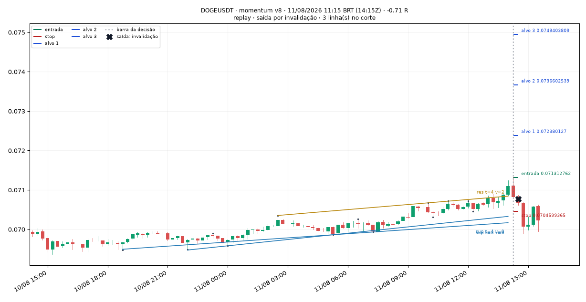

> Momentum 15m: fechamento 0.0711 acima da máxima dos 20 fechamentos anteriores (0.07088), retorno 15m 0.31%, volume relativo 7.28x da mediana de 96 barras, ATR% 0.30%

### 002 — XRPUSDT · 11/08/2026 14:00 BRT · -0.25 R

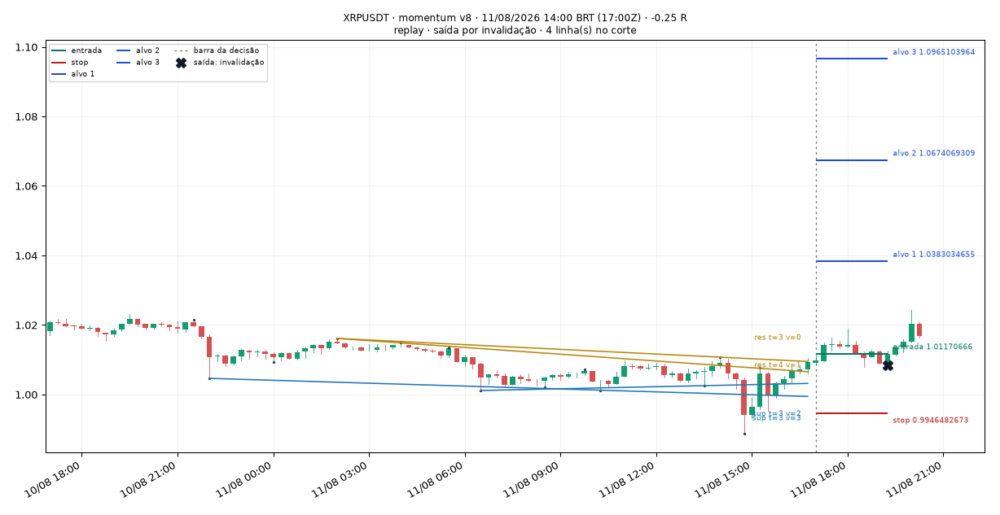

> Momentum 15m: fechamento 1.0092 acima da máxima dos 20 fechamentos anteriores (1.009), retorno 15m 0.19%, volume relativo 2.42x da mediana de 96 barras, ATR% 0.48%

### 003 — DOGEUSDT · 11/08/2026 17:00 BRT · +1.41 R

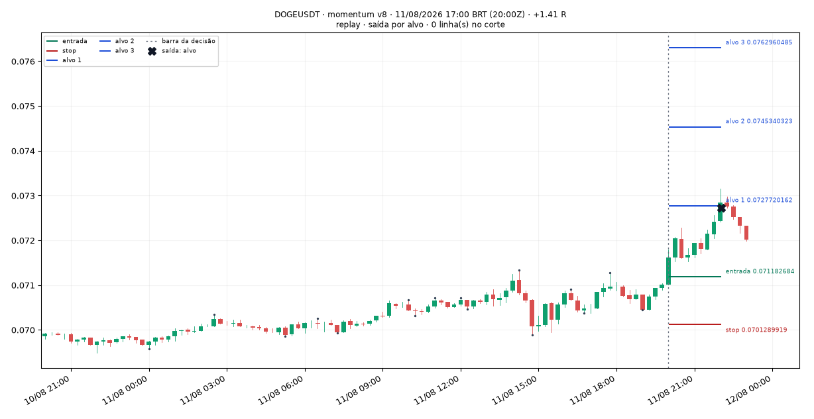

> Momentum 15m: fechamento 0.07101 acima da máxima dos 20 fechamentos anteriores (0.07097), retorno 15m 0.10%, volume relativo 1.58x da mediana de 96 barras, ATR% 0.41%

### 004 — ETHUSDT · 11/08/2026 17:00 BRT · -0.27 R

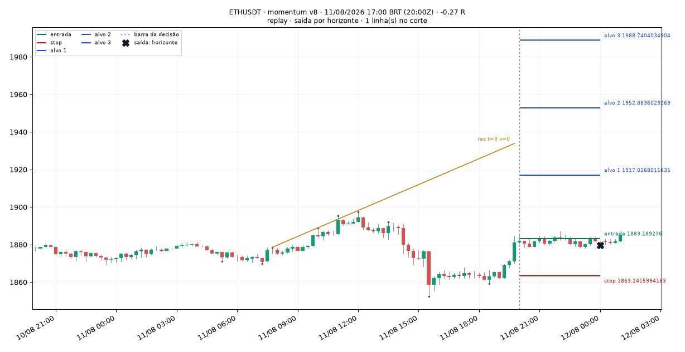

> Momentum 15m: fechamento 1881.17 acima da máxima dos 20 fechamentos anteriores (1876.38), retorno 15m 0.54%, volume relativo 7.99x da mediana de 96 barras, ATR% 0.32%

### 005 — XRPUSDT · 11/08/2026 17:00 BRT · +0.31 R

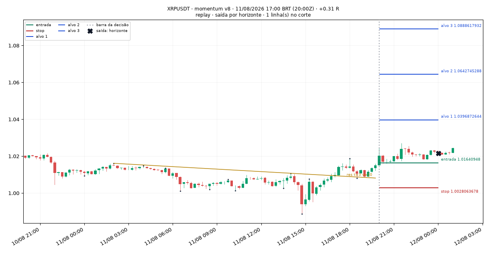

> Momentum 15m: fechamento 1.0151 acima da máxima dos 20 fechamentos anteriores (1.0144), retorno 15m 0.17%, volume relativo 1.55x da mediana de 96 barras, ATR% 0.40%

### 006 — SOLUSDT · 11/08/2026 17:00 BRT · +0.36 R

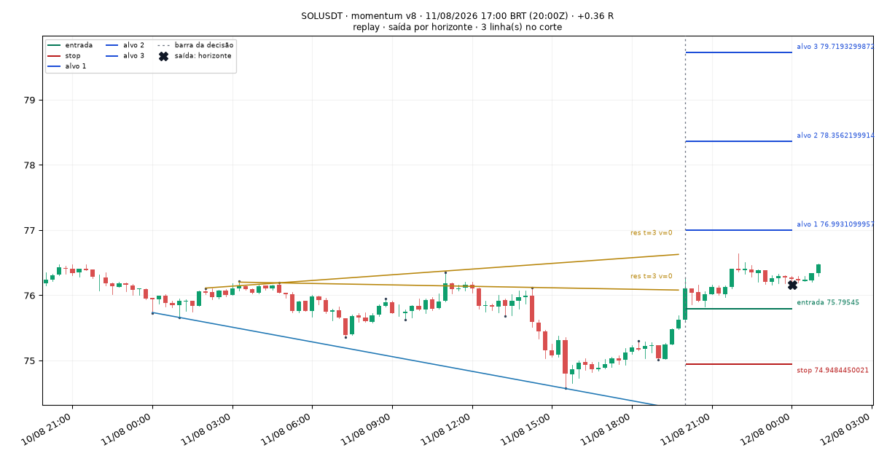

> Momentum 15m: fechamento 75.63 acima da máxima dos 20 fechamentos anteriores (75.48), retorno 15m 0.20%, volume relativo 2.57x da mediana de 96 barras, ATR% 0.30%

### 007 — DOGEUSDT · 13/08/2026 00:00 BRT · +0.27 R

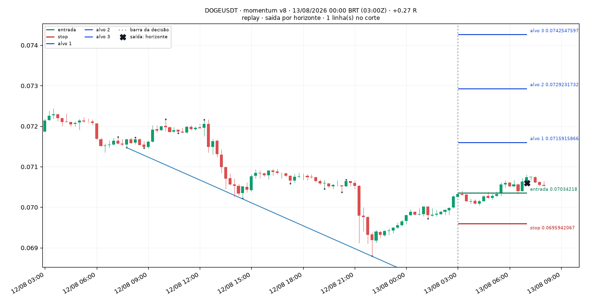

> Momentum 15m: fechamento 0.07026 acima da máxima dos 20 fechamentos anteriores (0.07001), retorno 15m 0.40%, volume relativo 2.17x da mediana de 96 barras, ATR% 0.32%

### 008 — SOLUSDT · 16/08/2026 22:45 BRT · -0.41 R

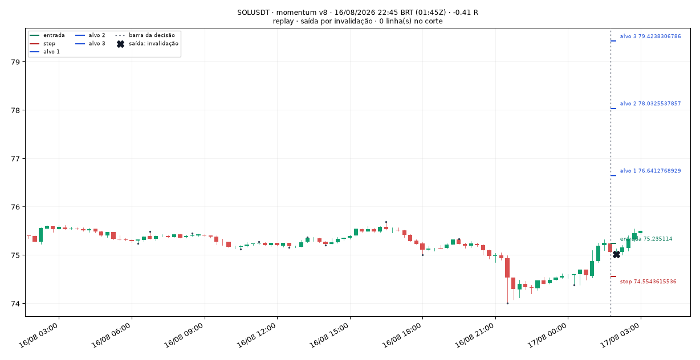

> Momentum 15m: fechamento 75.25 acima da máxima dos 20 fechamentos anteriores (75.19), retorno 15m 0.08%, volume relativo 3.69x da mediana de 96 barras, ATR% 0.31%

### 009 — SOLUSDT · 16/08/2026 23:45 BRT · +0.32 R

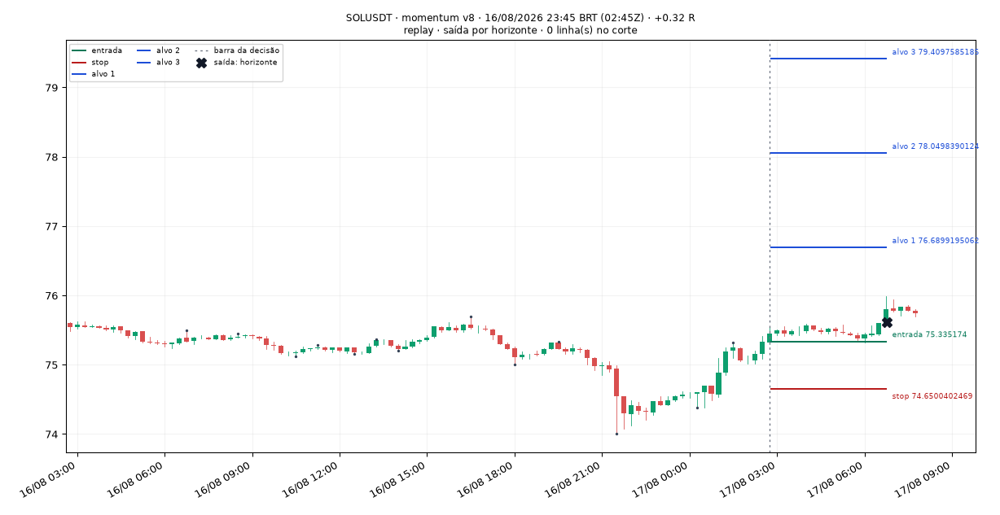

> Momentum 15m: fechamento 75.33 acima da máxima dos 20 fechamentos anteriores (75.25), retorno 15m 0.23%, volume relativo 4.49x da mediana de 96 barras, ATR% 0.30%

### 010 — SOLUSDT · 18/08/2026 12:30 BRT · -0.42 R

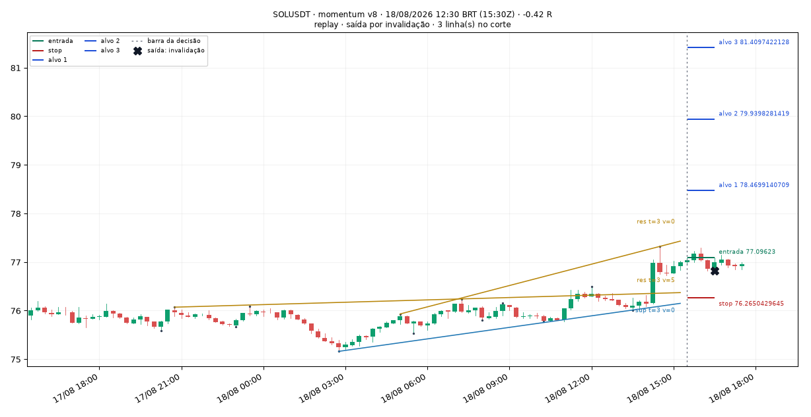

> Momentum 15m: fechamento 77 acima da máxima dos 20 fechamentos anteriores (76.98), retorno 15m 0.12%, volume relativo 2.01x da mediana de 96 barras, ATR% 0.32%

### 011 — SOLUSDT · 19/08/2026 10:30 BRT · -0.41 R

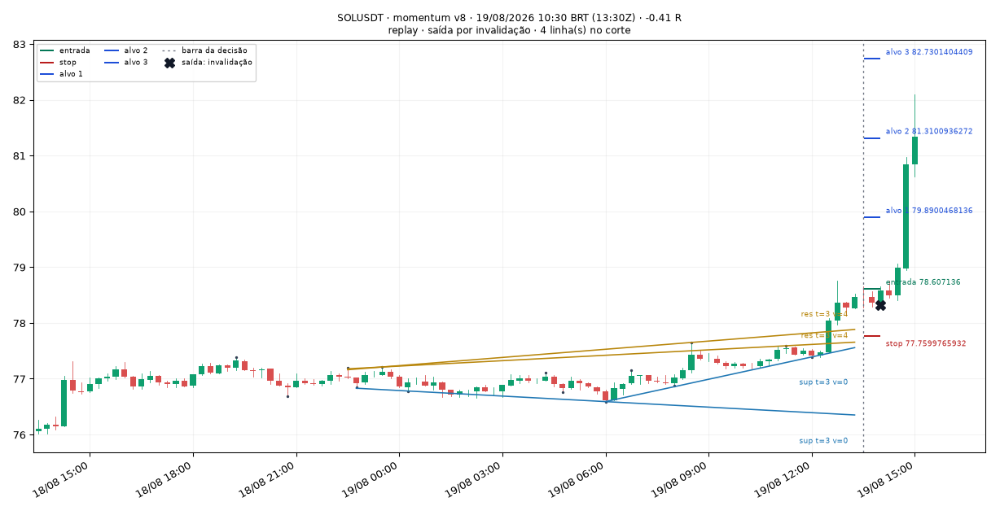

> Momentum 15m: fechamento 78.47 acima da máxima dos 20 fechamentos anteriores (78.37), retorno 15m 0.26%, volume relativo 2.21x da mediana de 96 barras, ATR% 0.30%

### 012 — SOLUSDT · 19/08/2026 11:45 BRT · +1.60 R

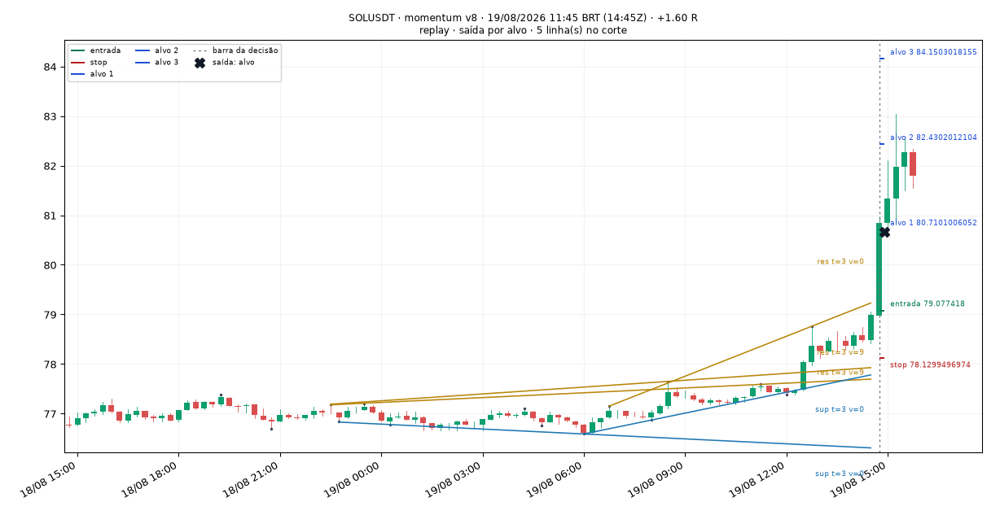

> Momentum 15m: fechamento 78.99 acima da máxima dos 20 fechamentos anteriores (78.58), retorno 15m 0.64%, volume relativo 4.81x da mediana de 96 barras, ATR% 0.36%

### 013 — XRPUSDT · 19/08/2026 12:00 BRT · +2.05 R

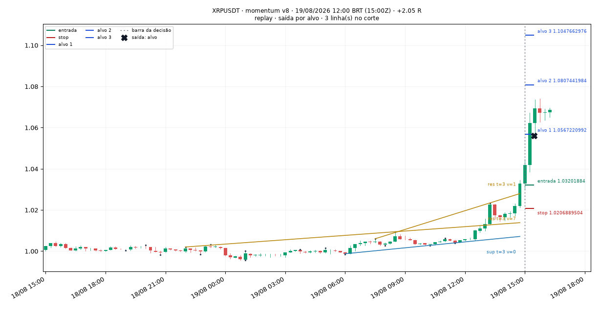

> Momentum 15m: fechamento 1.0327 acima da máxima dos 20 fechamentos anteriores (1.0225), retorno 15m 1.05%, volume relativo 11.26x da mediana de 96 barras, ATR% 0.39%

### 014 — ETHUSDT · 19/08/2026 12:00 BRT · +1.47 R

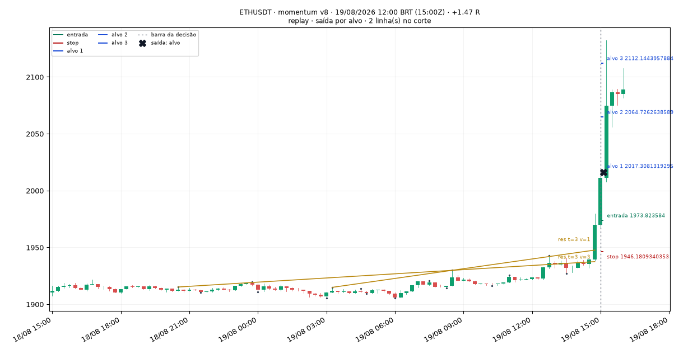

> Momentum 15m: fechamento 1969.89 acima da máxima dos 20 fechamentos anteriores (1939.17), retorno 15m 1.58%, volume relativo 29.77x da mediana de 96 barras, ATR% 0.40%

### 015 — DOGEUSDT · 19/08/2026 12:15 BRT · +1.49 R

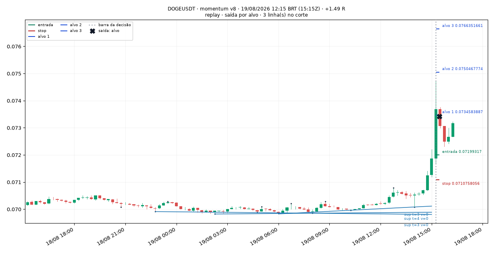

> Momentum 15m: fechamento 0.07187 acima da máxima dos 20 fechamentos anteriores (0.07125), retorno 15m 0.87%, volume relativo 18.50x da mediana de 96 barras, ATR% 0.37%

### 016 — ETHUSDT · 19/08/2026 13:15 BRT · -0.31 R

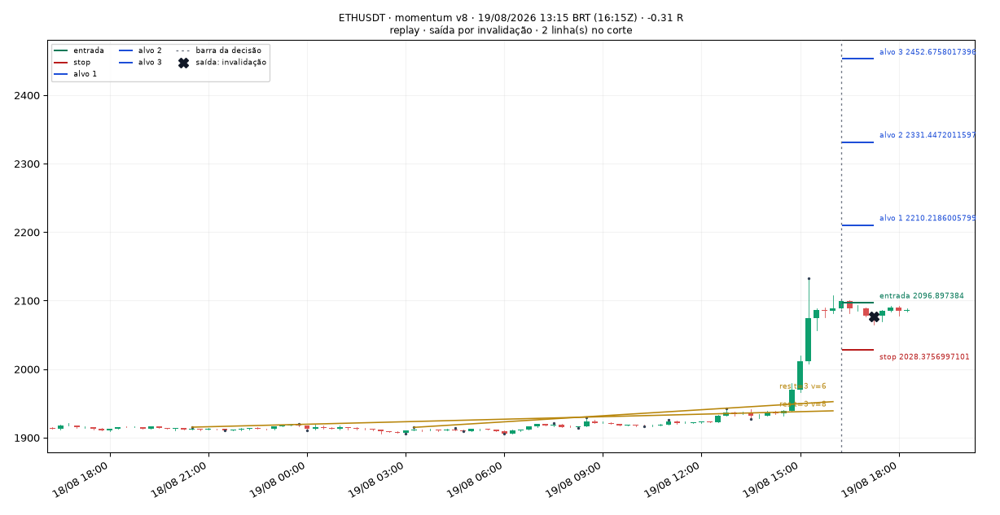

> Momentum 15m: fechamento 2088.99 acima da máxima dos 20 fechamentos anteriores (2086.45), retorno 15m 0.18%, volume relativo 20.30x da mediana de 96 barras, ATR% 0.97%

### 017 — ETHUSDT · 19/08/2026 17:00 BRT · +1.76 R

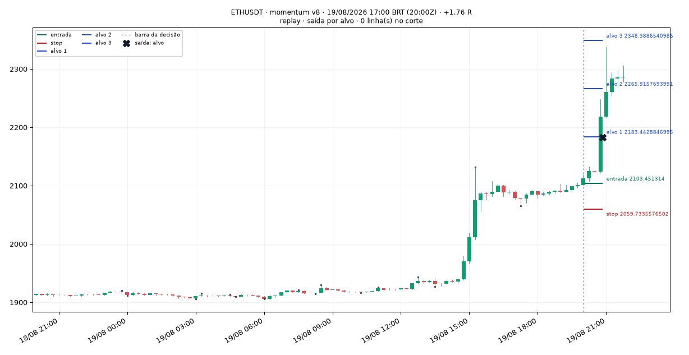

> Momentum 15m: fechamento 2100.97 acima da máxima dos 20 fechamentos anteriores (2099.57), retorno 15m 0.11%, volume relativo 2.76x da mediana de 96 barras, ATR% 0.65%

### 018 — XRPUSDT · 19/08/2026 17:15 BRT · +1.62 R

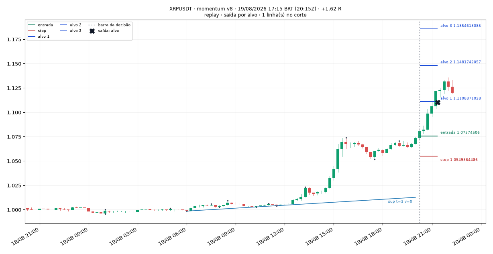

> Momentum 15m: fechamento 1.0736 acima da máxima dos 20 fechamentos anteriores (1.0694), retorno 15m 0.57%, volume relativo 3.59x da mediana de 96 barras, ATR% 0.58%

### 019 — SOLUSDT · 19/08/2026 18:00 BRT · +1.73 R

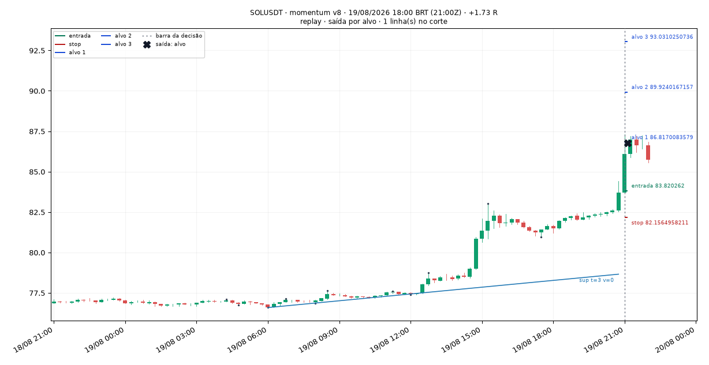

> Momentum 15m: fechamento 83.71 acima da máxima dos 20 fechamentos anteriores (82.58), retorno 15m 1.37%, volume relativo 14.31x da mediana de 96 barras, ATR% 0.62%

### 020 — DOGEUSDT · 19/08/2026 18:00 BRT · +0.87 R

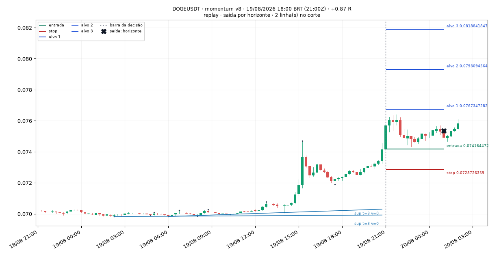

> Momentum 15m: fechamento 0.07416 acima da máxima dos 20 fechamentos anteriores (0.07339), retorno 15m 1.05%, volume relativo 12.51x da mediana de 96 barras, ATR% 0.58%

### 021 — SOLUSDT · 20/08/2026 03:30 BRT · +1.79 R

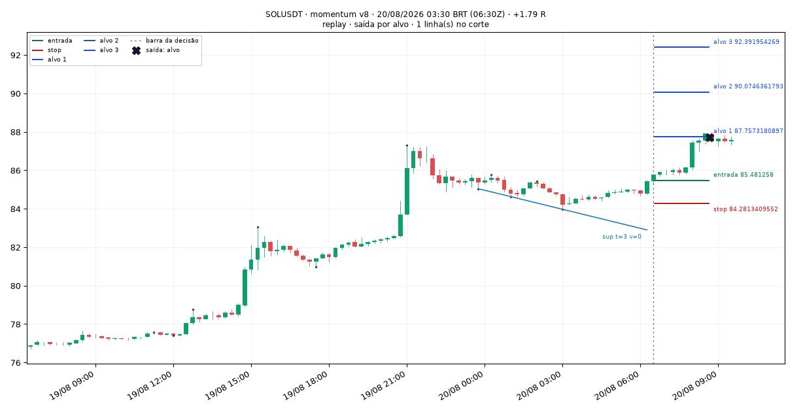

> Momentum 15m: fechamento 85.44 acima da máxima dos 20 fechamentos anteriores (85.36), retorno 15m 0.77%, volume relativo 2.44x da mediana de 96 barras, ATR% 0.45%

### 022 — XRPUSDT · 20/08/2026 05:15 BRT · +2.12 R

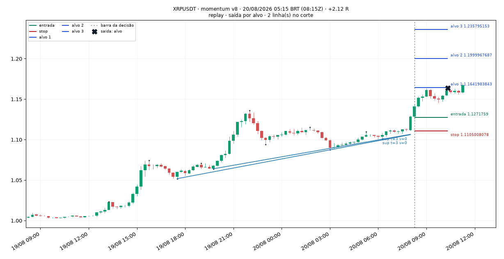

> Momentum 15m: fechamento 1.1284 acima da máxima dos 20 fechamentos anteriores (1.1128), retorno 15m 1.47%, volume relativo 2.71x da mediana de 96 barras, ATR% 0.53%

### 023 — ETHUSDT · 20/08/2026 05:15 BRT · -0.20 R

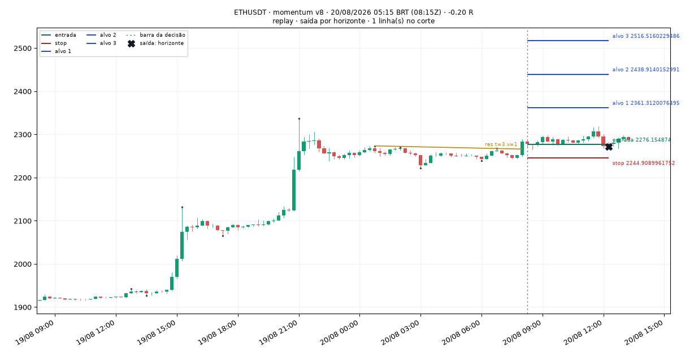

> Momentum 15m: fechamento 2283.71 acima da máxima dos 20 fechamentos anteriores (2262.1), retorno 15m 1.43%, volume relativo 3.87x da mediana de 96 barras, ATR% 0.57%

### 024 — DOGEUSDT · 20/08/2026 05:15 BRT · +0.36 R

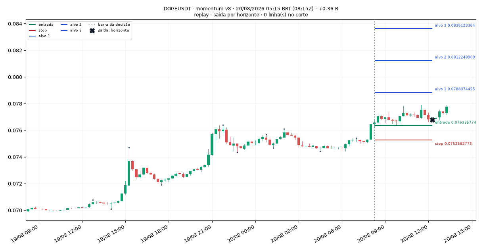

> Momentum 15m: fechamento 0.07645 acima da máxima dos 20 fechamentos anteriores (0.07531), retorno 15m 1.51%, volume relativo 3.70x da mediana de 96 barras, ATR% 0.52%

### 025 — XRPUSDT · 20/08/2026 08:45 BRT · +1.45 R

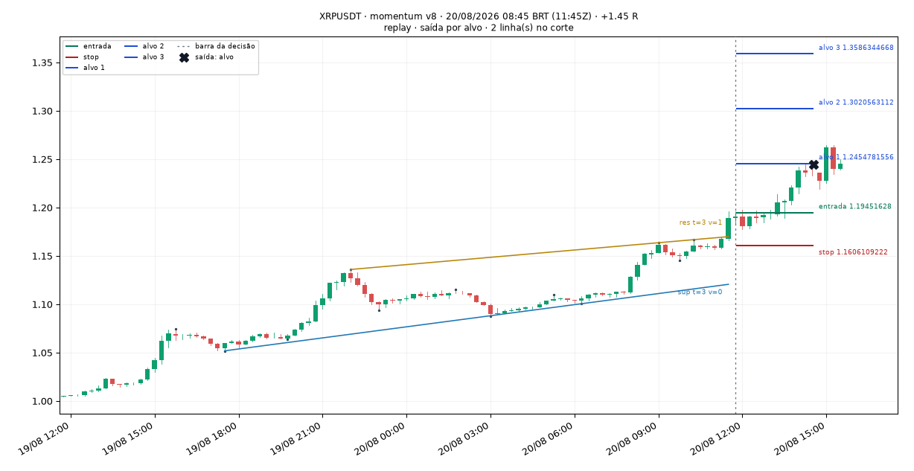

> Momentum 15m: fechamento 1.1889 acima da máxima dos 20 fechamentos anteriores (1.1675), retorno 15m 1.83%, volume relativo 4.70x da mediana de 96 barras, ATR% 0.79%

### 026 — DOGEUSDT · 20/08/2026 10:30 BRT · -0.13 R

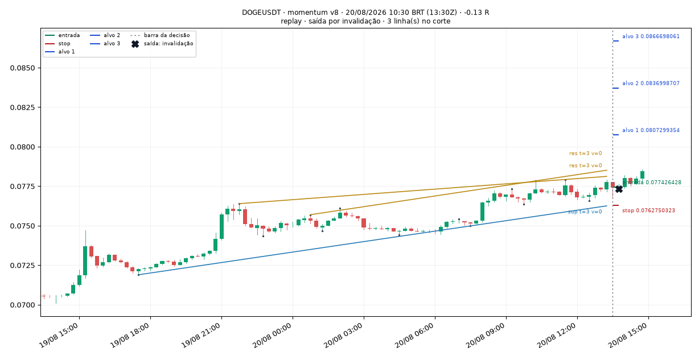

> Momentum 15m: fechamento 0.07776 acima da máxima dos 20 fechamentos anteriores (0.07753), retorno 15m 0.61%, volume relativo 1.52x da mediana de 96 barras, ATR% 0.64%

### 027 — DOGEUSDT · 20/08/2026 11:15 BRT · -0.23 R

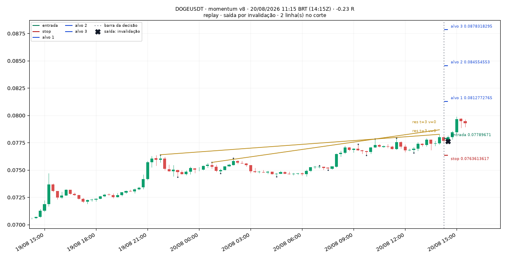

> Momentum 15m: fechamento 0.078 acima da máxima dos 20 fechamentos anteriores (0.07776), retorno 15m 0.71%, volume relativo 1.98x da mediana de 96 barras, ATR% 0.70%

### 028 — DOGEUSDT · 20/08/2026 12:00 BRT · +1.93 R

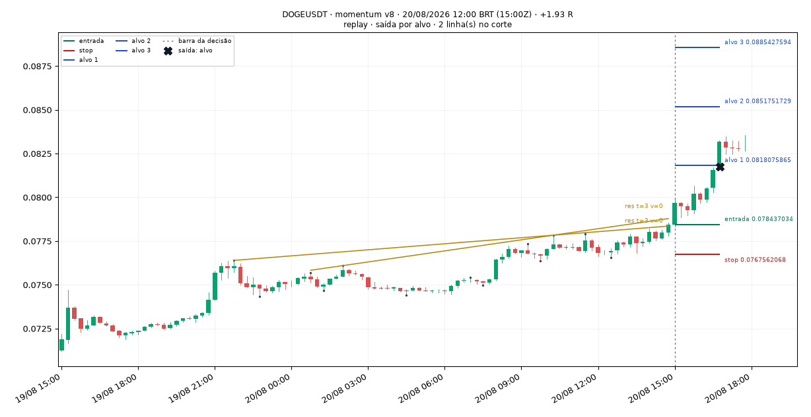

> Momentum 15m: fechamento 0.07844 acima da máxima dos 20 fechamentos anteriores (0.078), retorno 15m 0.59%, volume relativo 2.54x da mediana de 96 barras, ATR% 0.72%

### 029 — XRPUSDT · 20/08/2026 12:15 BRT · -0.72 R

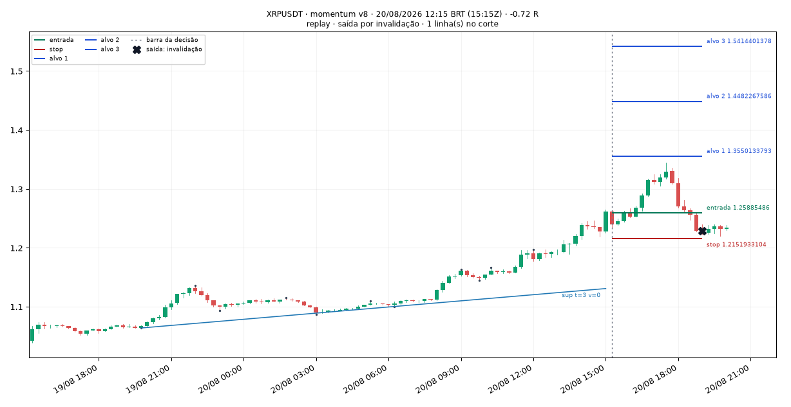

> Momentum 15m: fechamento 1.2618 acima da máxima dos 20 fechamentos anteriores (1.2386), retorno 15m 2.82%, volume relativo 4.99x da mediana de 96 barras, ATR% 1.23%

### 030 — ETHUSDT · 20/08/2026 12:30 BRT · -0.33 R

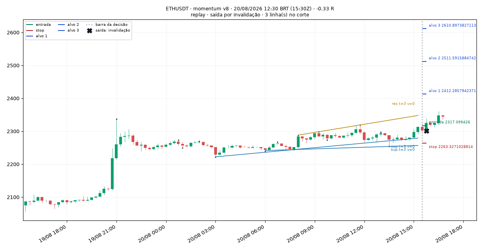

> Momentum 15m: fechamento 2312.98 acima da máxima dos 20 fechamentos anteriores (2306.25), retorno 15m 0.69%, volume relativo 2.91x da mediana de 96 barras, ATR% 0.72%

### 031 — ETHUSDT · 20/08/2026 13:45 BRT · -0.41 R

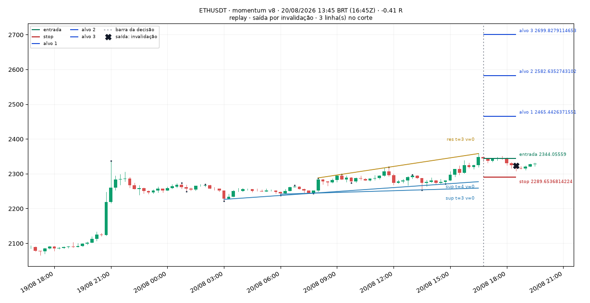

> Momentum 15m: fechamento 2348.25 acima da máxima dos 20 fechamentos anteriores (2325.2), retorno 15m 0.99%, volume relativo 3.33x da mediana de 96 barras, ATR% 0.83%

### 032 — DOGEUSDT · 20/08/2026 21:30 BRT · +0.37 R

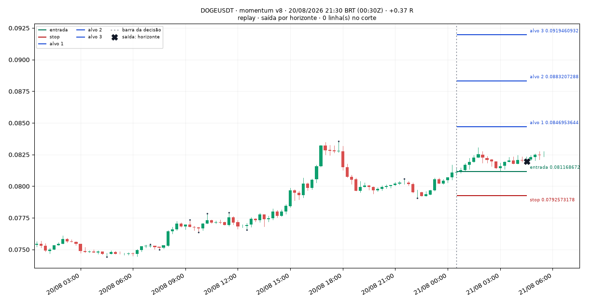

> Momentum 15m: fechamento 0.08107 acima da máxima dos 20 fechamentos anteriores (0.08069), retorno 15m 0.47%, volume relativo 3.18x da mediana de 96 barras, ATR% 0.75%

### 033 — SOLUSDT · 20/08/2026 21:30 BRT · -0.45 R

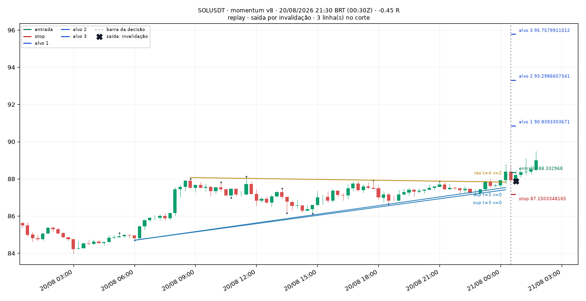

> Momentum 15m: fechamento 88.38 acima da máxima dos 20 fechamentos anteriores (87.93), retorno 15m 0.51%, volume relativo 3.49x da mediana de 96 barras, ATR% 0.46%

### 034 — ETHUSDT · 20/08/2026 22:30 BRT · -0.24 R

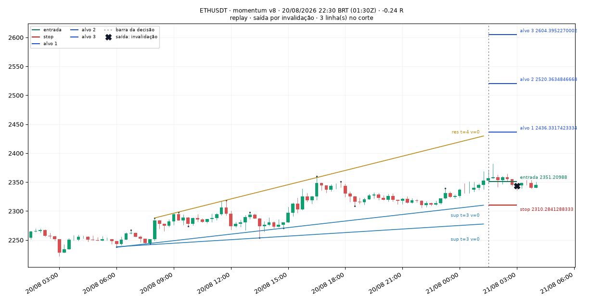

> Momentum 15m: fechamento 2352.3 acima da máxima dos 20 fechamentos anteriores (2344.74), retorno 15m 0.32%, volume relativo 3.81x da mediana de 96 barras, ATR% 0.60%

### 035 — XRPUSDT · 20/08/2026 23:00 BRT · -0.16 R

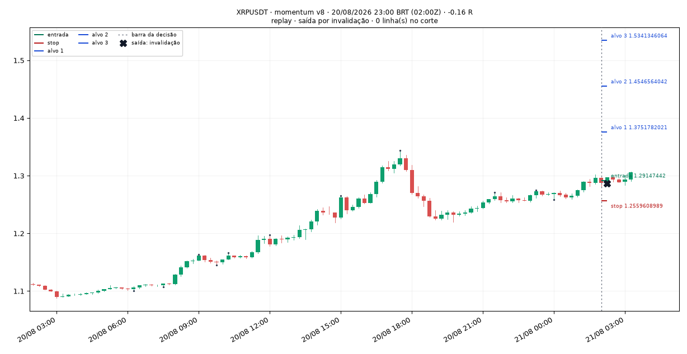

> Momentum 15m: fechamento 1.2957 acima da máxima dos 20 fechamentos anteriores (1.2889), retorno 15m 0.68%, volume relativo 1.60x da mediana de 96 barras, ATR% 1.02%

### 036 — SOLUSDT · 20/08/2026 23:00 BRT · +0.93 R

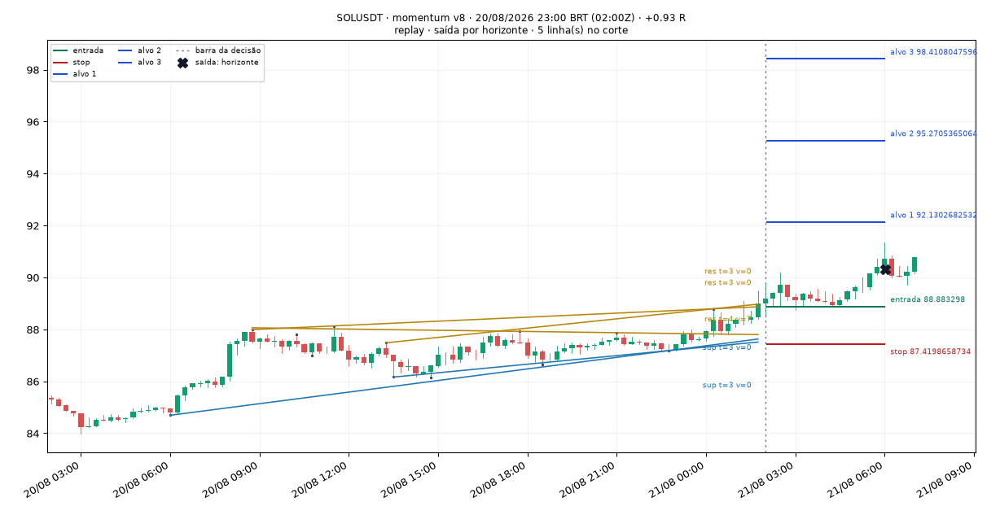

> Momentum 15m: fechamento 88.99 acima da máxima dos 20 fechamentos anteriores (88.47), retorno 15m 0.59%, volume relativo 3.51x da mediana de 96 barras, ATR% 0.59%

### 037 — DOGEUSDT · 21/08/2026 03:30 BRT · +0.25 R

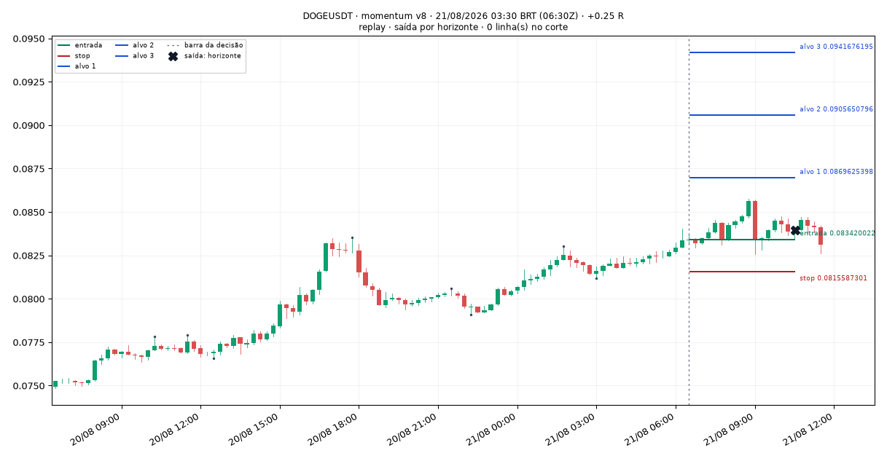

> Momentum 15m: fechamento 0.08336 acima da máxima dos 20 fechamentos anteriores (0.08295), retorno 15m 0.49%, volume relativo 2.13x da mediana de 96 barras, ATR% 0.72%

### 038 — XRPUSDT · 21/08/2026 05:15 BRT · +1.58 R

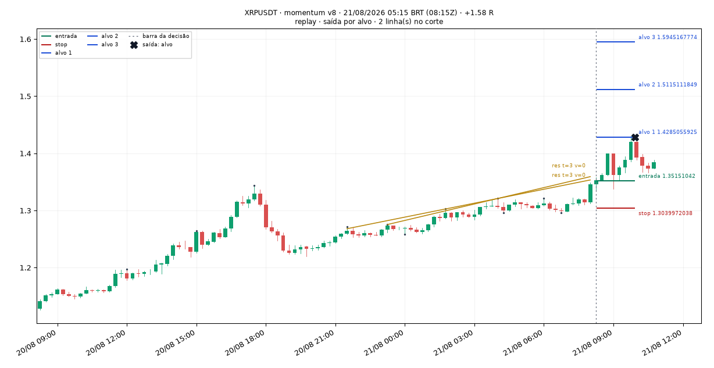

> Momentum 15m: fechamento 1.3455 acima da máxima dos 20 fechamentos anteriores (1.3189), retorno 15m 2.41%, volume relativo 2.80x da mediana de 96 barras, ATR% 1.03%

### 039 — ETHUSDT · 21/08/2026 05:30 BRT · -0.41 R

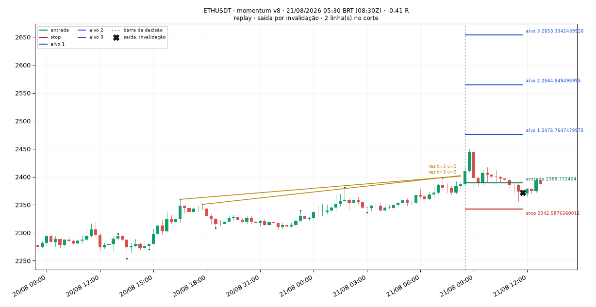

> Momentum 15m: fechamento 2386.98 acima da máxima dos 20 fechamentos anteriores (2385.55), retorno 15m 0.15%, volume relativo 1.64x da mediana de 96 barras, ATR% 0.62%

### 040 — SOLUSDT · 21/08/2026 05:30 BRT · -0.55 R

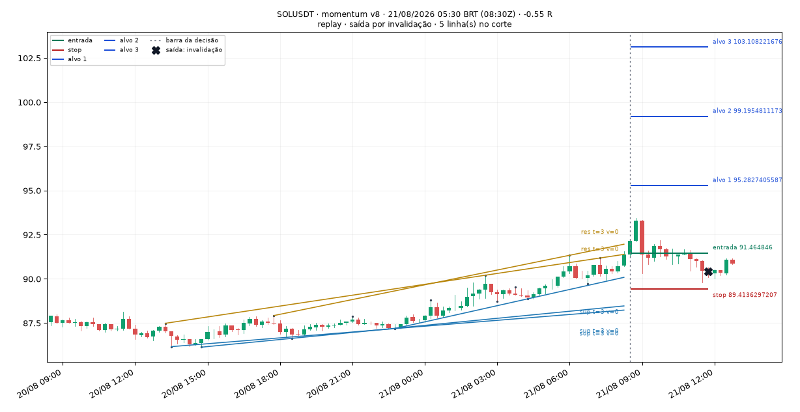

> Momentum 15m: fechamento 91.37 acima da máxima dos 20 fechamentos anteriores (90.78), retorno 15m 0.71%, volume relativo 2.74x da mediana de 96 barras, ATR% 0.71%

### 041 — ETHUSDT · 21/08/2026 14:15 BRT · +0.67 R

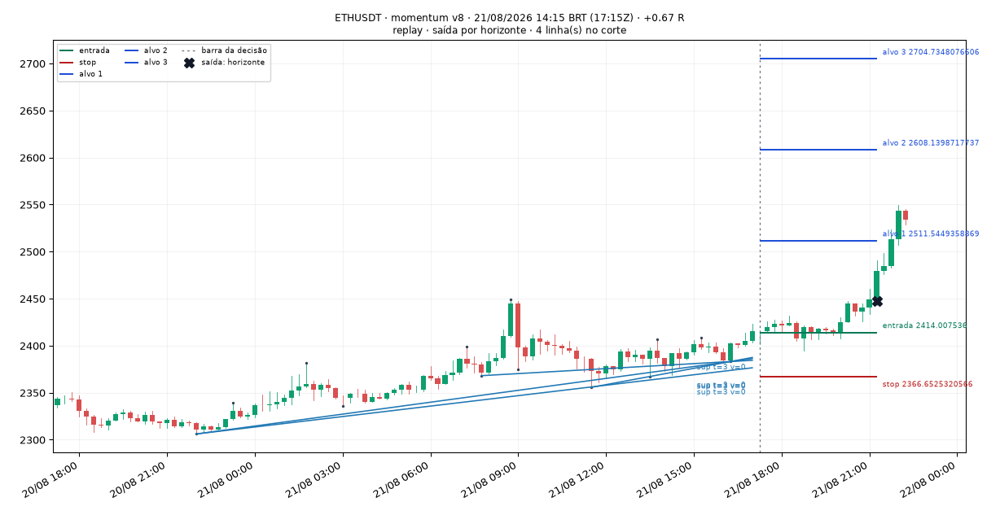

> Momentum 15m: fechamento 2414.95 acima da máxima dos 20 fechamentos anteriores (2405.13), retorno 15m 0.41%, volume relativo 1.58x da mediana de 96 barras, ATR% 0.67%

### 042 — DOGEUSDT · 21/08/2026 17:45 BRT · +1.93 R

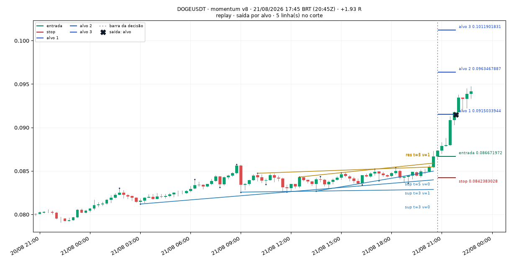

> Momentum 15m: fechamento 0.08666 acima da máxima dos 20 fechamentos anteriores (0.08542), retorno 15m 1.45%, volume relativo 4.71x da mediana de 96 barras, ATR% 0.93%

### 043 — SOLUSDT · 21/08/2026 18:30 BRT · +0.56 R

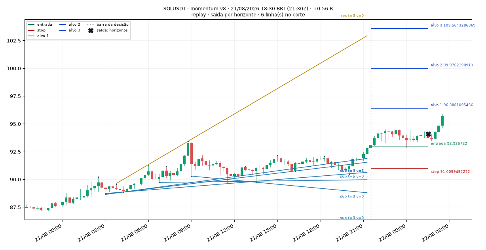

> Momentum 15m: fechamento 92.8 acima da máxima dos 20 fechamentos anteriores (92.28), retorno 15m 0.56%, volume relativo 1.73x da mediana de 96 barras, ATR% 0.64%

### 044 — XRPUSDT · 21/08/2026 19:15 BRT · +1.61 R

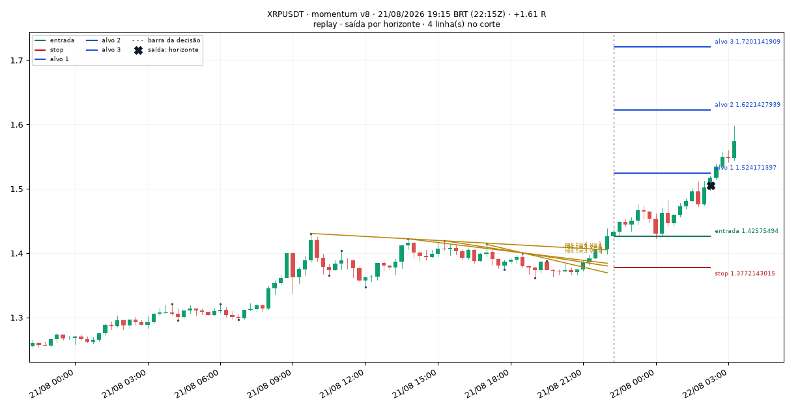

> Momentum 15m: fechamento 1.4262 acima da máxima dos 20 fechamentos anteriores (1.4063), retorno 15m 1.42%, volume relativo 3.37x da mediana de 96 barras, ATR% 1.14%

### 045 — DOGEUSDT · 21/08/2026 19:45 BRT · -0.28 R

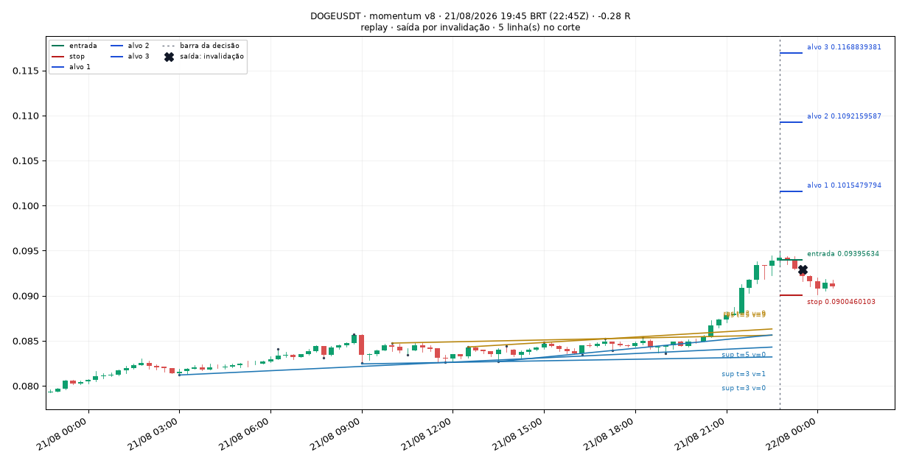

> Momentum 15m: fechamento 0.09388 acima da máxima dos 20 fechamentos anteriores (0.09343), retorno 15m 0.64%, volume relativo 3.69x da mediana de 96 barras, ATR% 1.36%

### 046 — SOLUSDT · 21/08/2026 23:45 BRT · +2.08 R

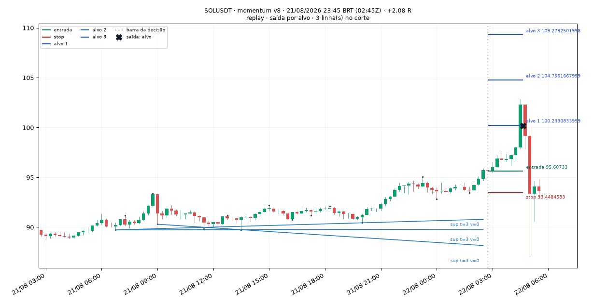

> Momentum 15m: fechamento 95.71 acima da máxima dos 20 fechamentos anteriores (94.84), retorno 15m 0.92%, volume relativo 2.17x da mediana de 96 barras, ATR% 0.79%

### 047 — DOGEUSDT · 22/08/2026 00:30 BRT · -1.03 R

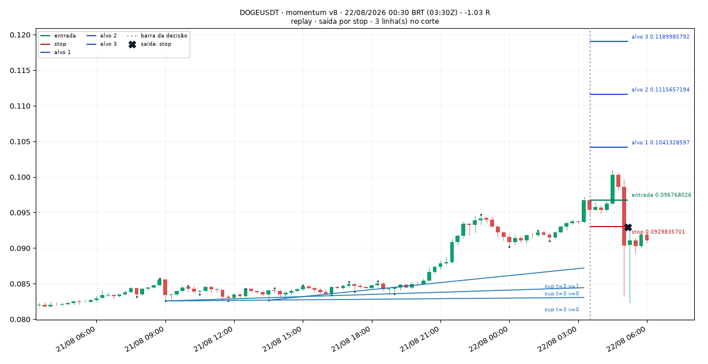

> Momentum 15m: fechamento 0.0967 acima da máxima dos 20 fechamentos anteriores (0.09418), retorno 15m 3.27%, volume relativo 4.02x da mediana de 96 barras, ATR% 1.28%

### 048 — XRPUSDT · 22/08/2026 00:30 BRT · -1.03 R

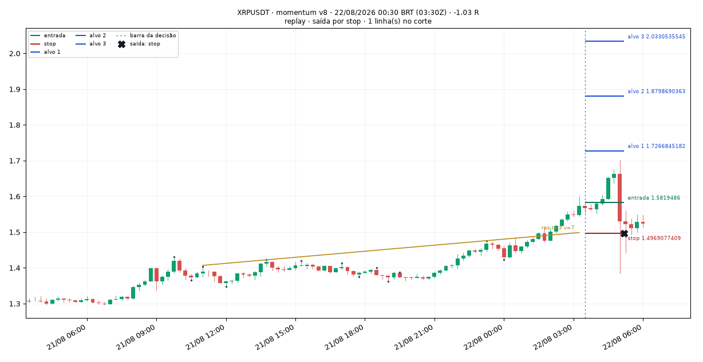

> Momentum 15m: fechamento 1.5735 acima da máxima dos 20 fechamentos anteriores (1.5492), retorno 15m 1.65%, volume relativo 3.49x da mediana de 96 barras, ATR% 1.62%

### 049 — DOGEUSDT · 22/08/2026 14:30 BRT · +0.21 R

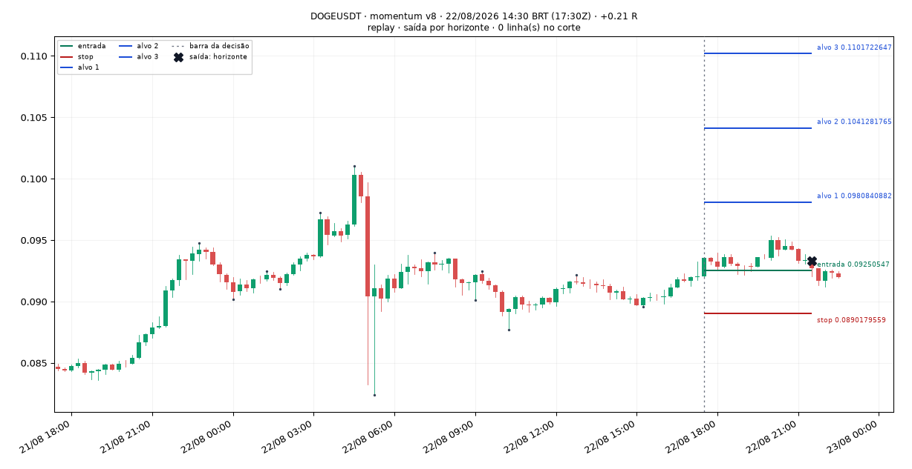

> Momentum 15m: fechamento 0.09204 acima da máxima dos 20 fechamentos anteriores (0.09195), retorno 15m 0.10%, volume relativo 1.51x da mediana de 96 barras, ATR% 1.09%

### 050 — ETHUSDT · 22/08/2026 17:00 BRT · -0.45 R

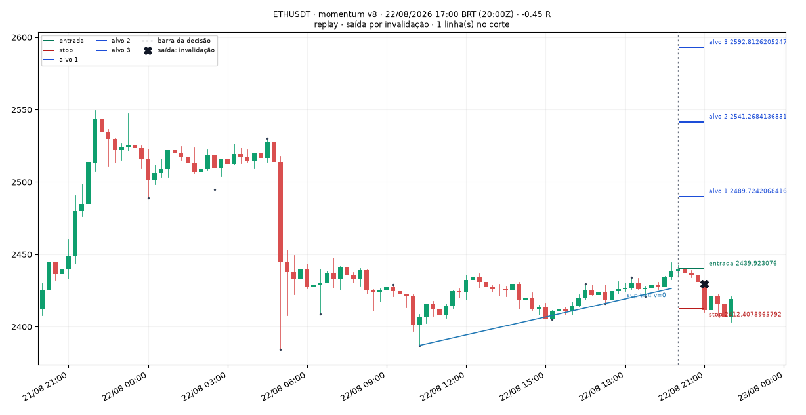

> Momentum 15m: fechamento 2438.18 acima da máxima dos 20 fechamentos anteriores (2433.81), retorno 15m 0.18%, volume relativo 1.59x da mediana de 96 barras, ATR% 0.35%

### 051 — SOLUSDT · 22/08/2026 21:45 BRT · -0.78 R

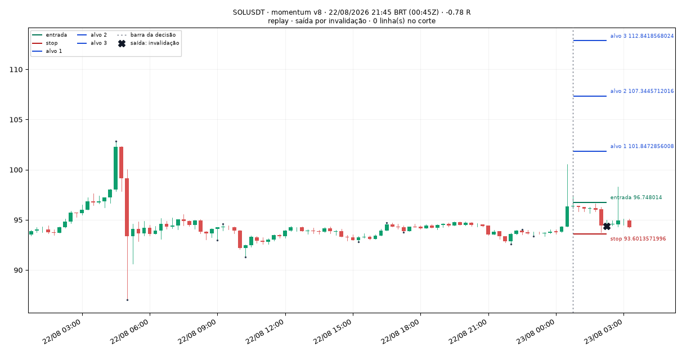

> Momentum 15m: fechamento 96.35 acima da máxima dos 20 fechamentos anteriores (94.76), retorno 15m 2.16%, volume relativo 10.28x da mediana de 96 barras, ATR% 0.95%

### 052 — ETHUSDT · 23/08/2026 05:45 BRT · -0.34 R

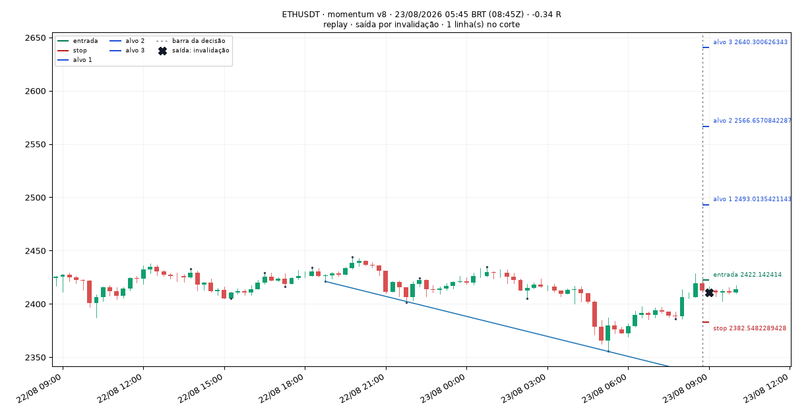

> Momentum 15m: fechamento 2419.37 acima da máxima dos 20 fechamentos anteriores (2413.68), retorno 15m 0.53%, volume relativo 4.18x da mediana de 96 barras, ATR% 0.51%

### 053 — DOGEUSDT · 23/08/2026 07:30 BRT · +0.87 R

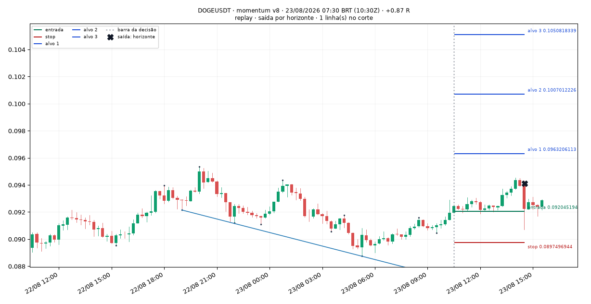

> Momentum 15m: fechamento 0.09194 acima da máxima dos 20 fechamentos anteriores (0.09142), retorno 15m 0.59%, volume relativo 2.63x da mediana de 96 barras, ATR% 0.79%

### 054 — XRPUSDT · 23/08/2026 08:30 BRT · -0.13 R

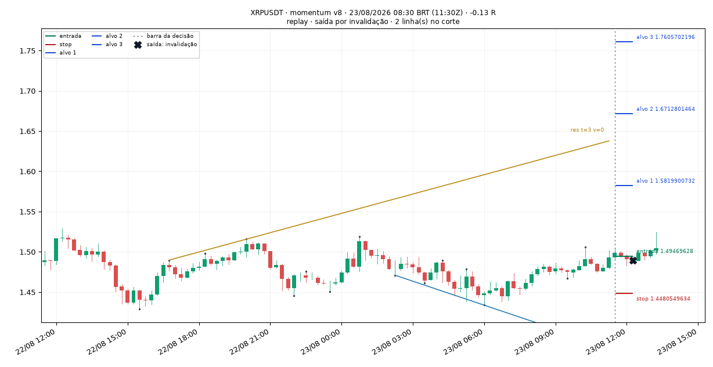

> Momentum 15m: fechamento 1.4927 acima da máxima dos 20 fechamentos anteriores (1.491), retorno 15m 0.86%, volume relativo 1.70x da mediana de 96 barras, ATR% 1.00%

### 055 — SOLUSDT · 23/08/2026 08:30 BRT · +0.56 R

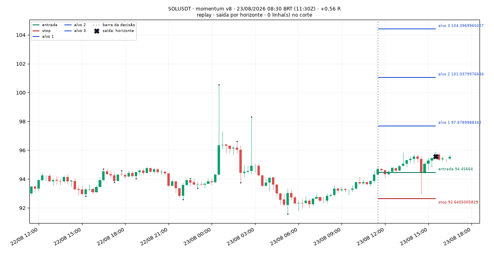

> Momentum 15m: fechamento 94.32 acima da máxima dos 20 fechamentos anteriores (93.85), retorno 15m 0.50%, volume relativo 2.32x da mediana de 96 barras, ATR% 0.59%

### 056 — ETHUSDT · 23/08/2026 08:30 BRT · -1.10 R

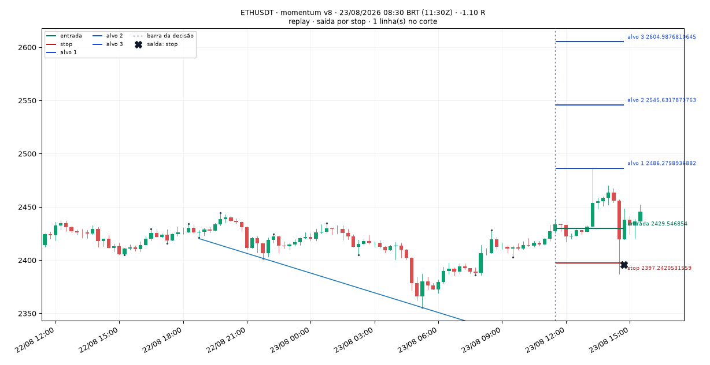

> Momentum 15m: fechamento 2426.92 acima da máxima dos 20 fechamentos anteriores (2420.05), retorno 15m 0.28%, volume relativo 3.78x da mediana de 96 barras, ATR% 0.41%

### 057 — XRPUSDT · 23/08/2026 10:30 BRT · -1.04 R

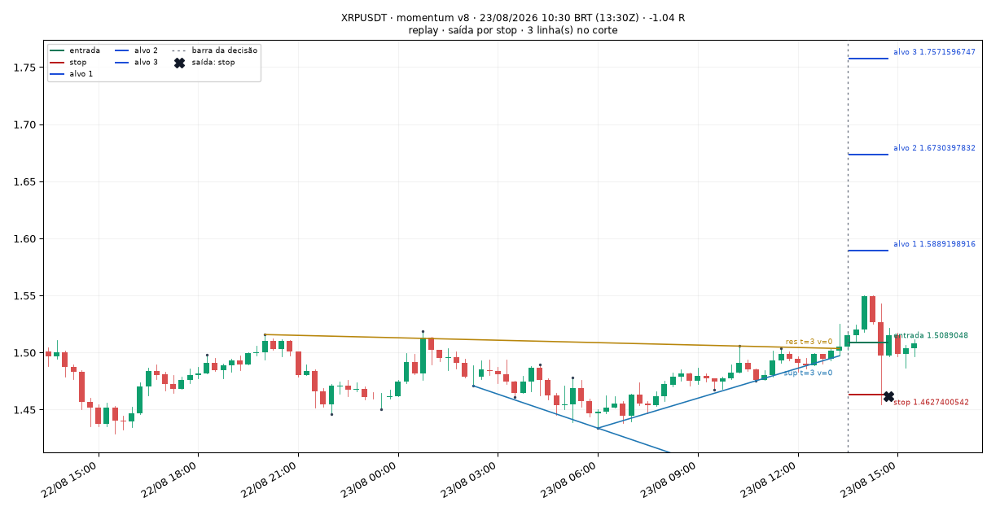

> Momentum 15m: fechamento 1.5048 acima da máxima dos 20 fechamentos anteriores (1.5014), retorno 15m 0.23%, volume relativo 3.58x da mediana de 96 barras, ATR% 0.93%

### 058 — ETHUSDT · 23/08/2026 18:15 BRT · -0.65 R

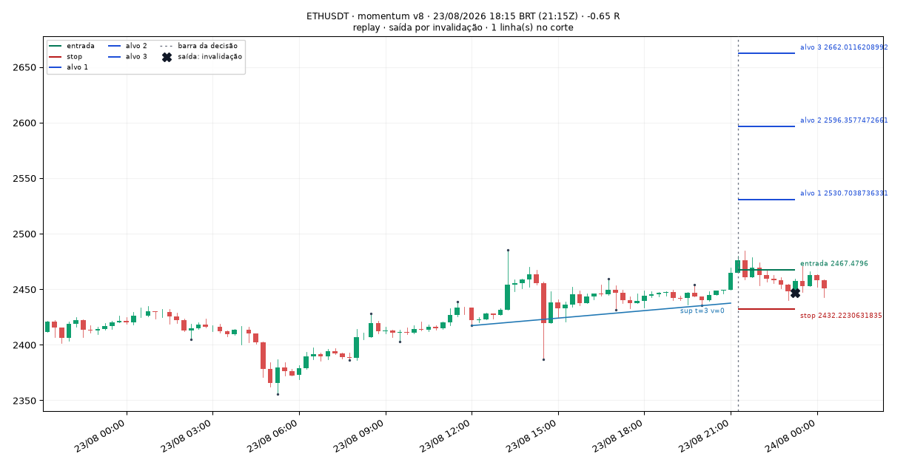

> Momentum 15m: fechamento 2465.05 acima da máxima dos 20 fechamentos anteriores (2449.7), retorno 15m 0.65%, volume relativo 3.05x da mediana de 96 barras, ATR% 0.44%

### 059 — SOLUSDT · 23/08/2026 18:15 BRT · -0.43 R

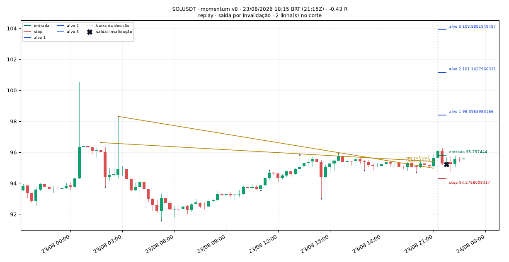

> Momentum 15m: fechamento 95.65 acima da máxima dos 20 fechamentos anteriores (95.54), retorno 15m 0.61%, volume relativo 1.63x da mediana de 96 barras, ATR% 0.48%

### 060 — XRPUSDT · 23/08/2026 18:30 BRT · -0.48 R

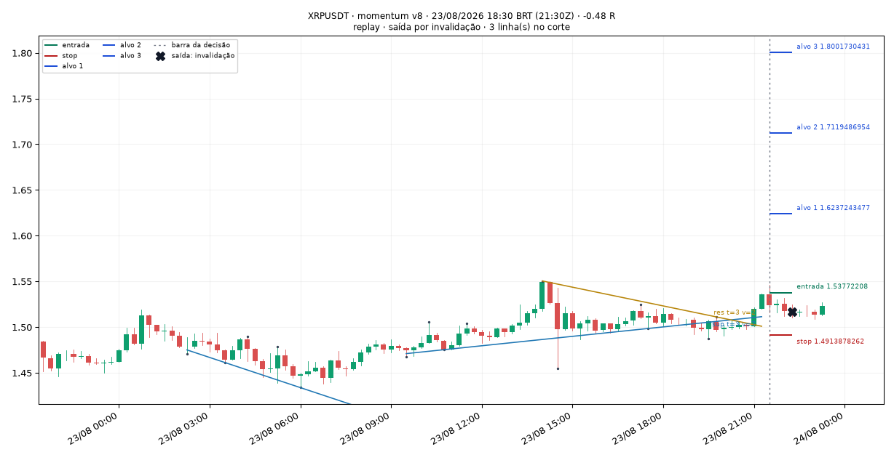

> Momentum 15m: fechamento 1.5355 acima da máxima dos 20 fechamentos anteriores (1.5198), retorno 15m 1.03%, volume relativo 1.55x da mediana de 96 barras, ATR% 0.96%

### 061 — ETHUSDT · 24/08/2026 04:15 BRT · -0.51 R

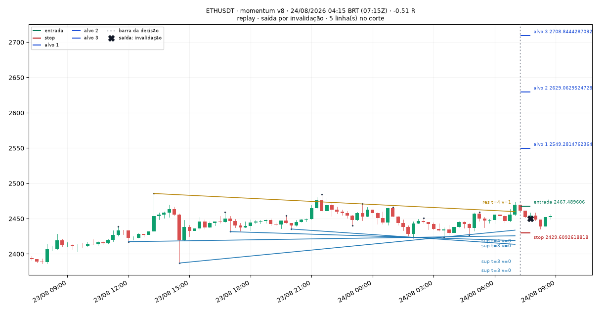

> Momentum 15m: fechamento 2469.5 acima da máxima dos 20 fechamentos anteriores (2457.16), retorno 15m 0.57%, volume relativo 2.42x da mediana de 96 barras, ATR% 0.54%

### 062 — XRPUSDT · 24/08/2026 04:15 BRT · -0.50 R

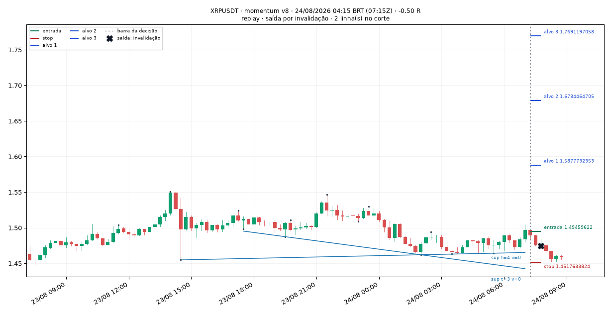

> Momentum 15m: fechamento 1.4971 acima da máxima dos 20 fechamentos anteriores (1.489), retorno 15m 0.91%, volume relativo 1.66x da mediana de 96 barras, ATR% 1.01%

### 063 — SOLUSDT · 24/08/2026 04:15 BRT · -0.59 R

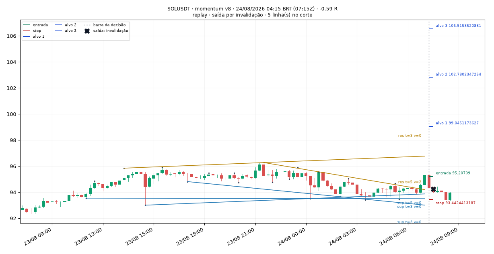

> Momentum 15m: fechamento 95.31 acima da máxima dos 20 fechamentos anteriores (94.78), retorno 15m 0.81%, volume relativo 2.09x da mediana de 96 barras, ATR% 0.65%

### 064 — ETHUSDT · 24/08/2026 07:15 BRT · -0.52 R

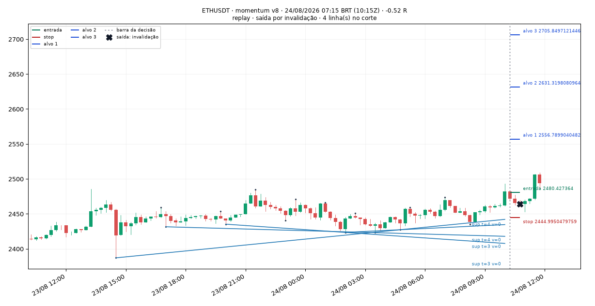

> Momentum 15m: fechamento 2482.26 acima da máxima dos 20 fechamentos anteriores (2469.5), retorno 15m 0.81%, volume relativo 6.06x da mediana de 96 barras, ATR% 0.50%

### 065 — XRPUSDT · 24/08/2026 08:45 BRT · -0.30 R

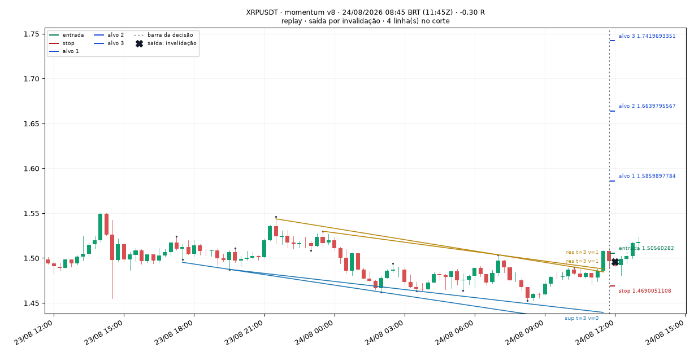

> Momentum 15m: fechamento 1.508 acima da máxima dos 20 fechamentos anteriores (1.4971), retorno 15m 1.48%, volume relativo 2.17x da mediana de 96 barras, ATR% 0.86%

### 066 — SOLUSDT · 24/08/2026 08:45 BRT · -0.62 R

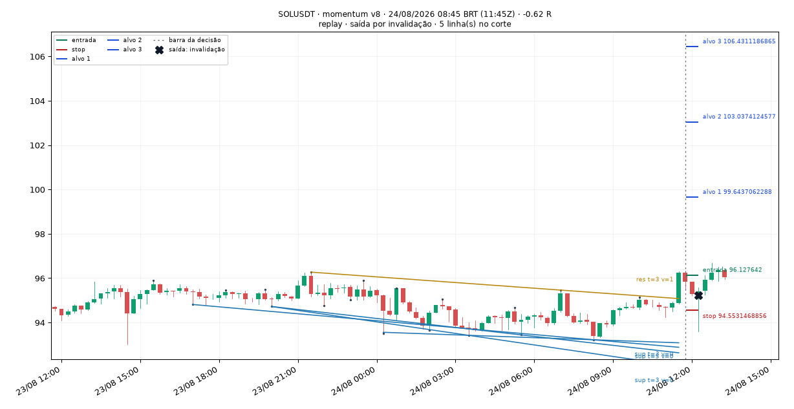

> Momentum 15m: fechamento 96.25 acima da máxima dos 20 fechamentos anteriores (95.31), retorno 15m 1.43%, volume relativo 4.10x da mediana de 96 barras, ATR% 0.59%

### 067 — ETHUSDT · 24/08/2026 08:45 BRT · -0.19 R

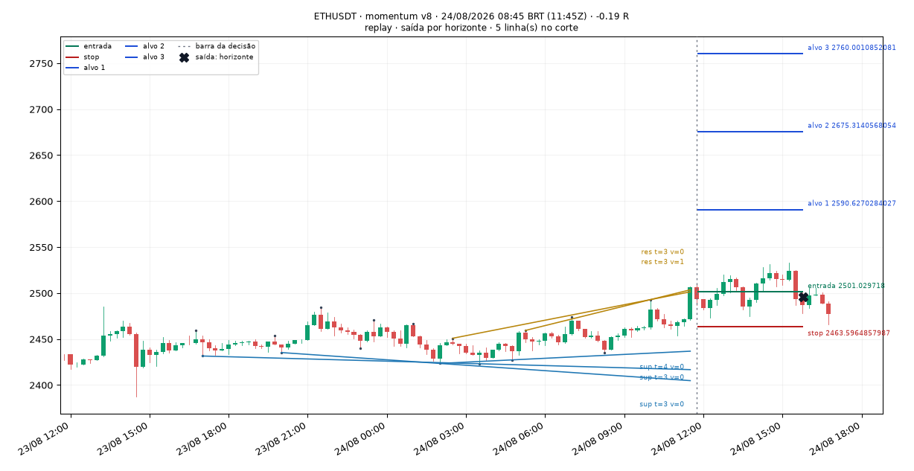

> Momentum 15m: fechamento 2505.94 acima da máxima dos 20 fechamentos anteriores (2482.26), retorno 15m 1.39%, volume relativo 6.26x da mediana de 96 barras, ATR% 0.56%

### 068 — DOGEUSDT · 24/08/2026 08:45 BRT · -0.23 R

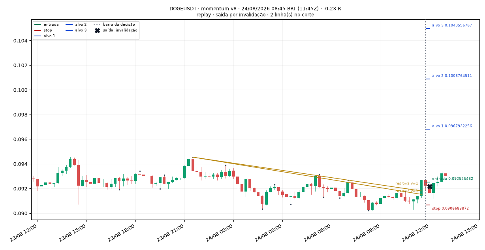

> Momentum 15m: fechamento 0.09271 acima da máxima dos 20 fechamentos anteriores (0.0925), retorno 15m 1.49%, volume relativo 2.70x da mediana de 96 barras, ATR% 0.73%

### 069 — DOGEUSDT · 24/08/2026 10:00 BRT · -0.34 R

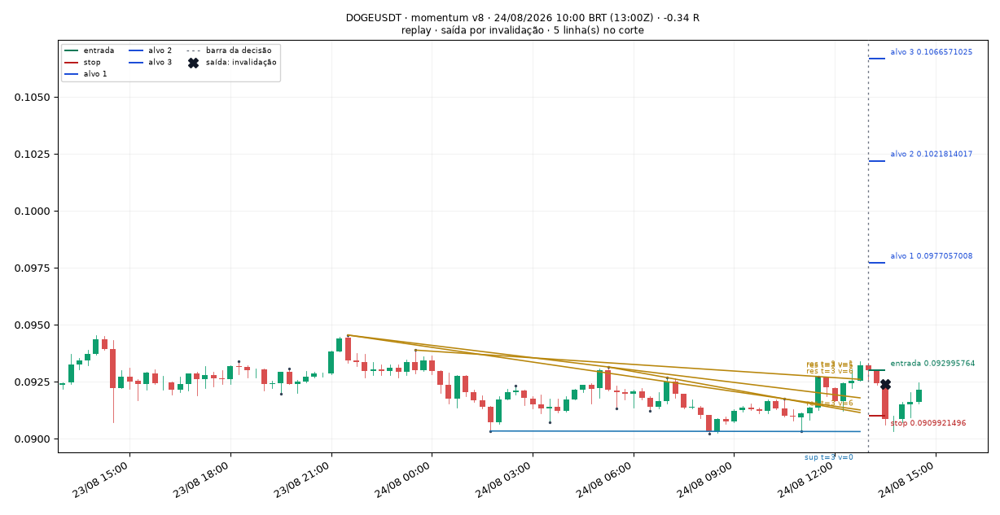

> Momentum 15m: fechamento 0.09323 acima da máxima dos 20 fechamentos anteriores (0.09271), retorno 15m 0.73%, volume relativo 2.39x da mediana de 96 barras, ATR% 0.80%

### 070 — SOLUSDT · 24/08/2026 10:00 BRT · -0.14 R

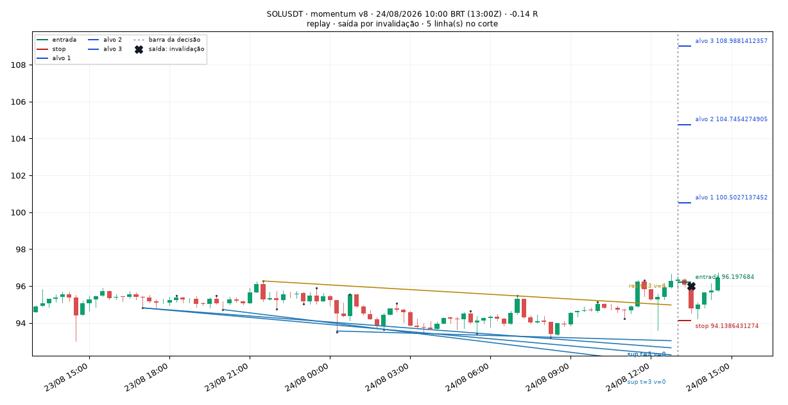

> Momentum 15m: fechamento 96.26 acima da máxima dos 20 fechamentos anteriores (96.25), retorno 15m 0.34%, volume relativo 3.11x da mediana de 96 barras, ATR% 0.73%

### 071 — XRPUSDT · 24/08/2026 10:00 BRT · -0.73 R

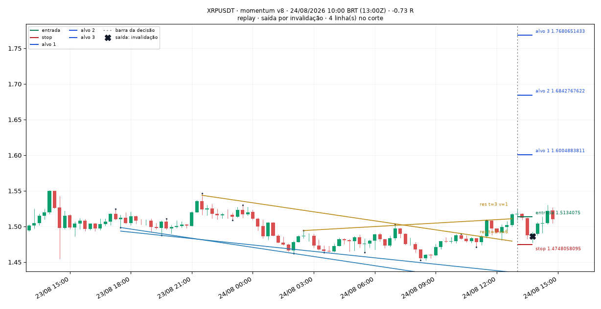

> Momentum 15m: fechamento 1.5167 acima da máxima dos 20 fechamentos anteriores (1.508), retorno 15m 0.98%, volume relativo 2.14x da mediana de 96 barras, ATR% 0.92%

### 072 — SOLUSDT · 24/08/2026 11:45 BRT · -0.22 R

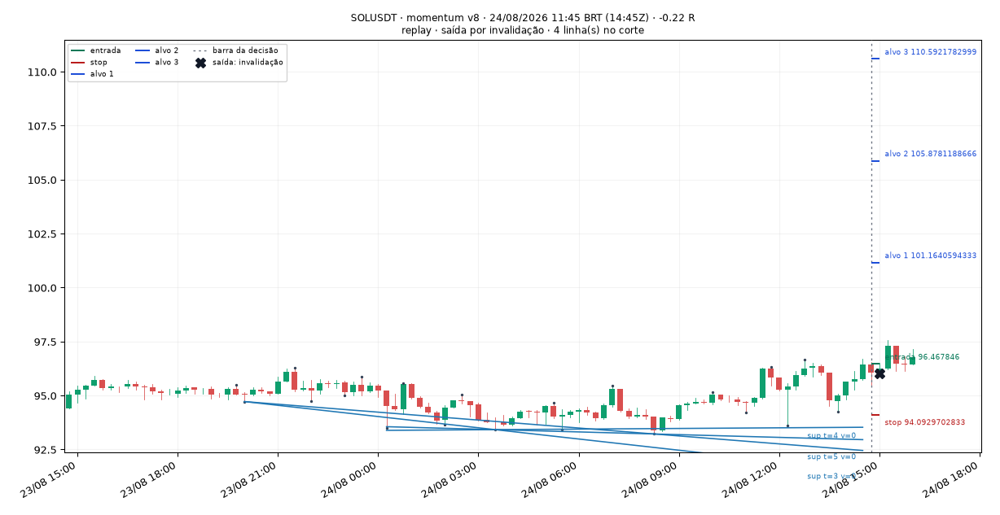

> Momentum 15m: fechamento 96.45 acima da máxima dos 20 fechamentos anteriores (96.36), retorno 15m 0.73%, volume relativo 3.03x da mediana de 96 barras, ATR% 0.81%

### 073 — XRPUSDT · 24/08/2026 11:45 BRT · -0.32 R

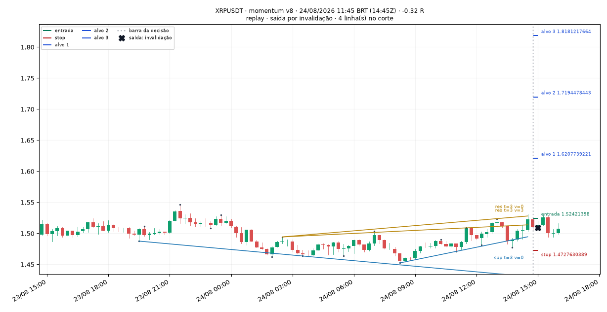

> Momentum 15m: fechamento 1.5221 acima da máxima dos 20 fechamentos anteriores (1.5176), retorno 15m 1.15%, volume relativo 2.76x da mediana de 96 barras, ATR% 1.08%

### 074 — SOLUSDT · 24/08/2026 12:30 BRT · -0.39 R

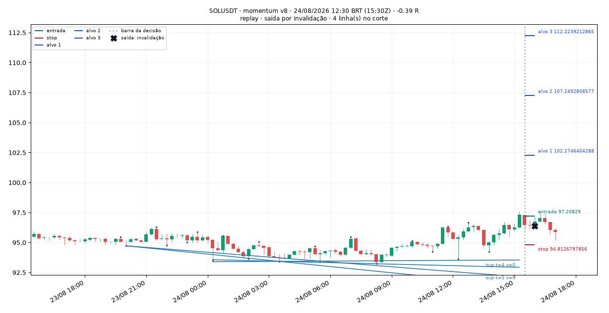

> Momentum 15m: fechamento 97.3 acima da máxima dos 20 fechamentos anteriores (96.45), retorno 15m 1.08%, volume relativo 3.66x da mediana de 96 barras, ATR% 0.85%

### 075 — SOLUSDT · 24/08/2026 19:45 BRT · -0.26 R

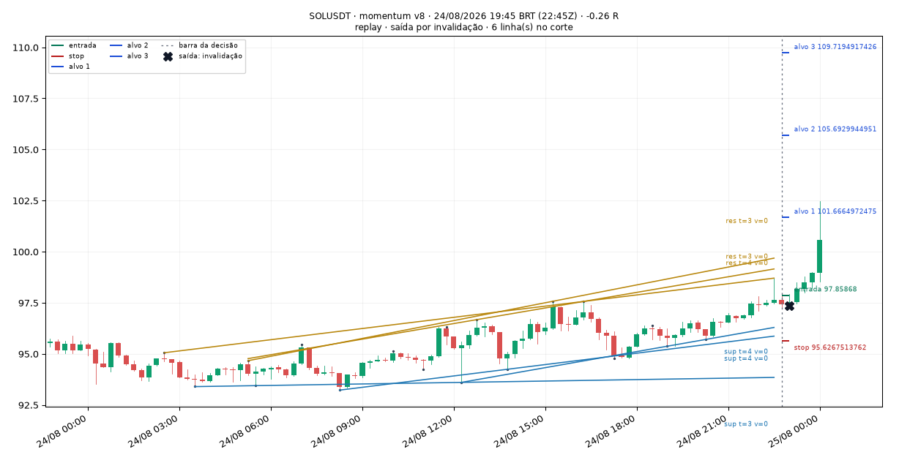

> Momentum 15m: fechamento 97.64 acima da máxima dos 20 fechamentos anteriores (97.51), retorno 15m 0.13%, volume relativo 3.46x da mediana de 96 barras, ATR% 0.69%

### 076 — SOLUSDT · 24/08/2026 21:15 BRT · +0.61 R

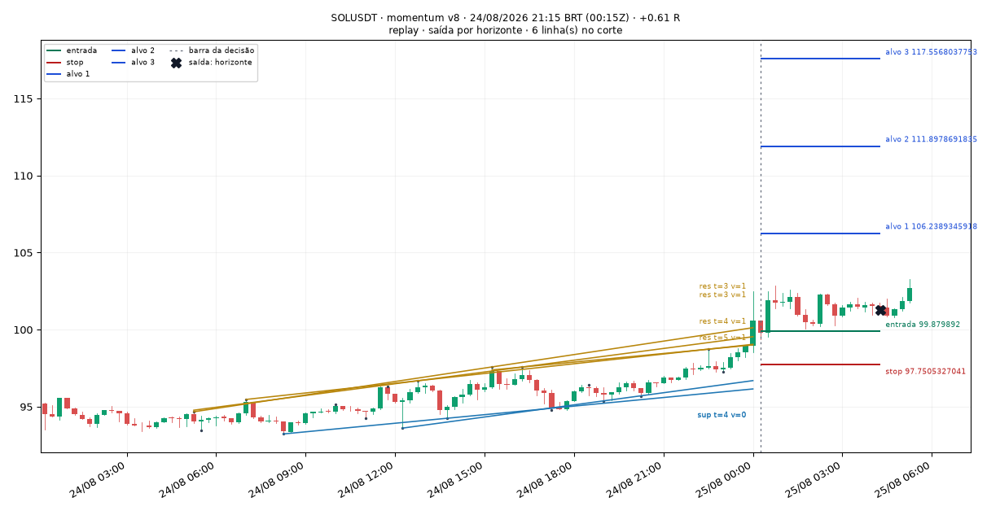

> Momentum 15m: fechamento 100.58 acima da máxima dos 20 fechamentos anteriores (98.96), retorno 15m 1.64%, volume relativo 9.37x da mediana de 96 barras, ATR% 0.94%

### 077 — XRPUSDT · 24/08/2026 21:45 BRT · -0.14 R

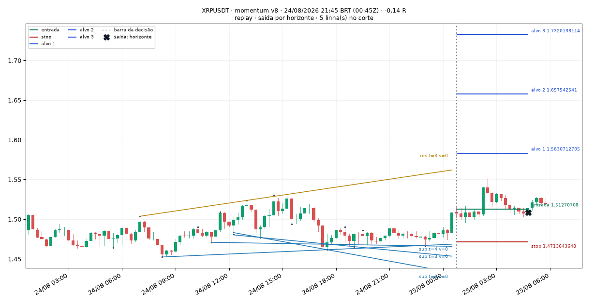

> Momentum 15m: fechamento 1.5086 acima da máxima dos 20 fechamentos anteriores (1.4883), retorno 15m 1.75%, volume relativo 1.65x da mediana de 96 barras, ATR% 0.82%

### 078 — ETHUSDT · 24/08/2026 22:00 BRT · -0.30 R

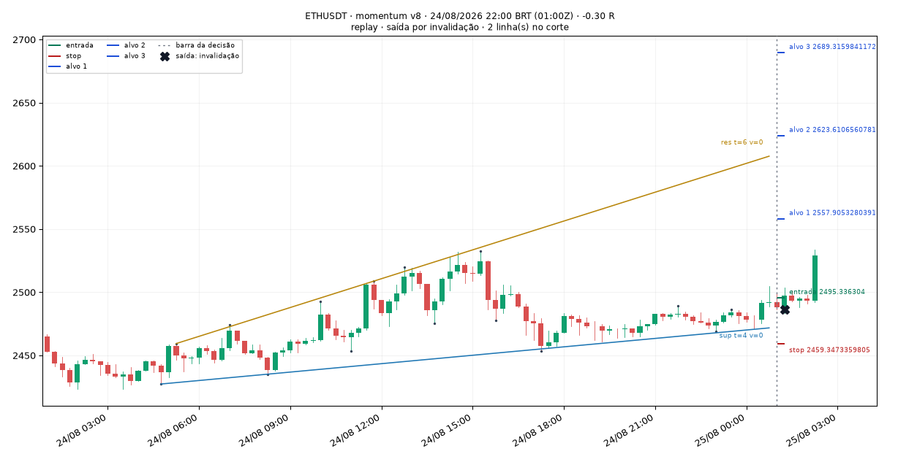

> Momentum 15m: fechamento 2492.2 acima da máxima dos 20 fechamentos anteriores (2491.54), retorno 15m 0.03%, volume relativo 2.38x da mediana de 96 barras, ATR% 0.44%

### 079 — DOGEUSDT · 24/08/2026 22:00 BRT · -0.30 R

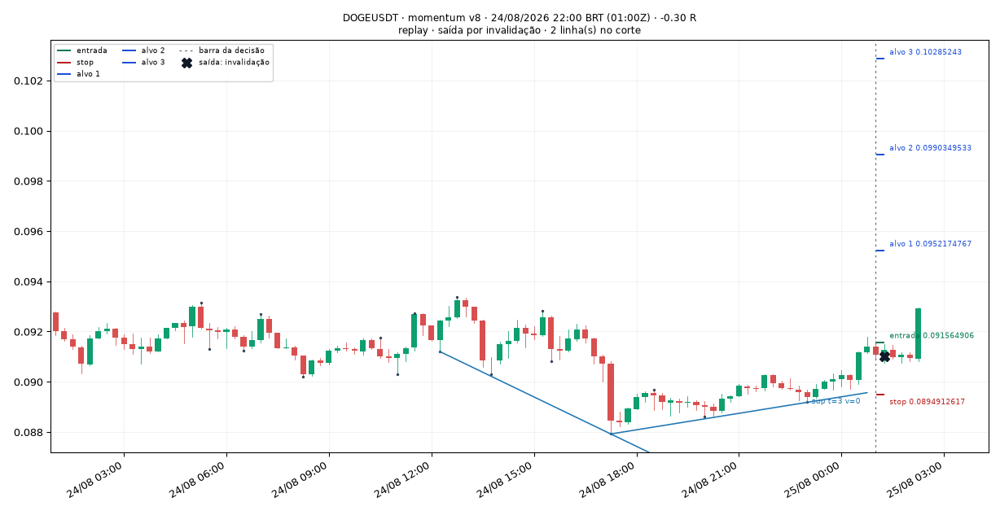

> Momentum 15m: fechamento 0.0914 acima da máxima dos 20 fechamentos anteriores (0.09116), retorno 15m 0.26%, volume relativo 1.77x da mediana de 96 barras, ATR% 0.70%

### 080 — DOGEUSDT · 24/08/2026 23:30 BRT · -0.20 R

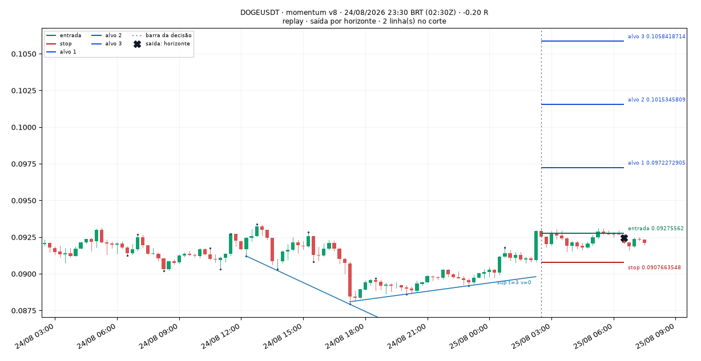

> Momentum 15m: fechamento 0.09292 acima da máxima dos 20 fechamentos anteriores (0.0914), retorno 15m 2.19%, volume relativo 3.48x da mediana de 96 barras, ATR% 0.77%

### 081 — ETHUSDT · 24/08/2026 23:30 BRT · -1.09 R

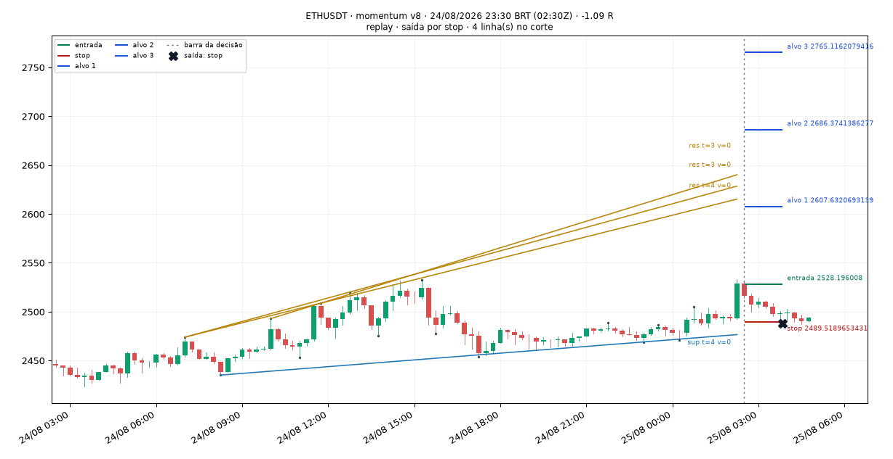

> Momentum 15m: fechamento 2528.89 acima da máxima dos 20 fechamentos anteriores (2497.38), retorno 15m 1.43%, volume relativo 5.75x da mediana de 96 barras, ATR% 0.52%

### 082 — SOLUSDT · 25/08/2026 02:30 BRT · -0.36 R

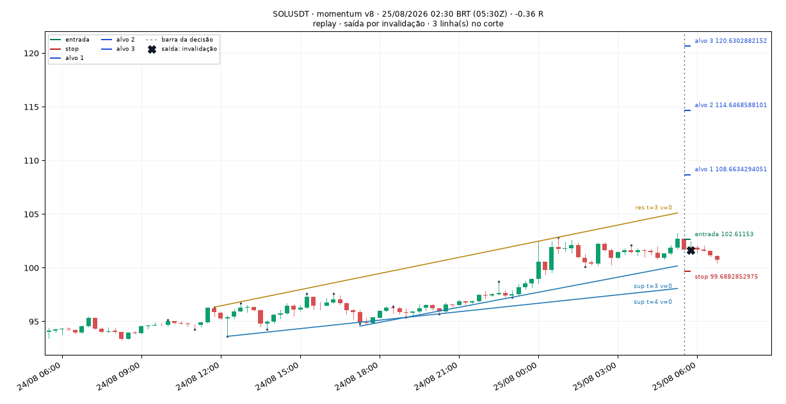

> Momentum 15m: fechamento 102.68 acima da máxima dos 20 fechamentos anteriores (102.25), retorno 15m 0.80%, volume relativo 1.80x da mediana de 96 barras, ATR% 0.97%

### 083 — SOLUSDT · 26/08/2026 07:45 BRT · -0.49 R

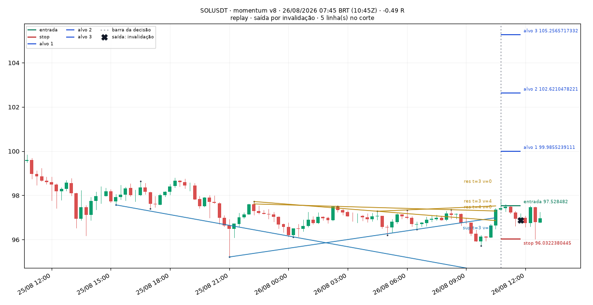

> Momentum 15m: fechamento 97.35 acima da máxima dos 20 fechamentos anteriores (97.18), retorno 15m 0.75%, volume relativo 2.20x da mediana de 96 barras, ATR% 0.45%

### 084 — DOGEUSDT · 26/08/2026 08:00 BRT · -0.18 R

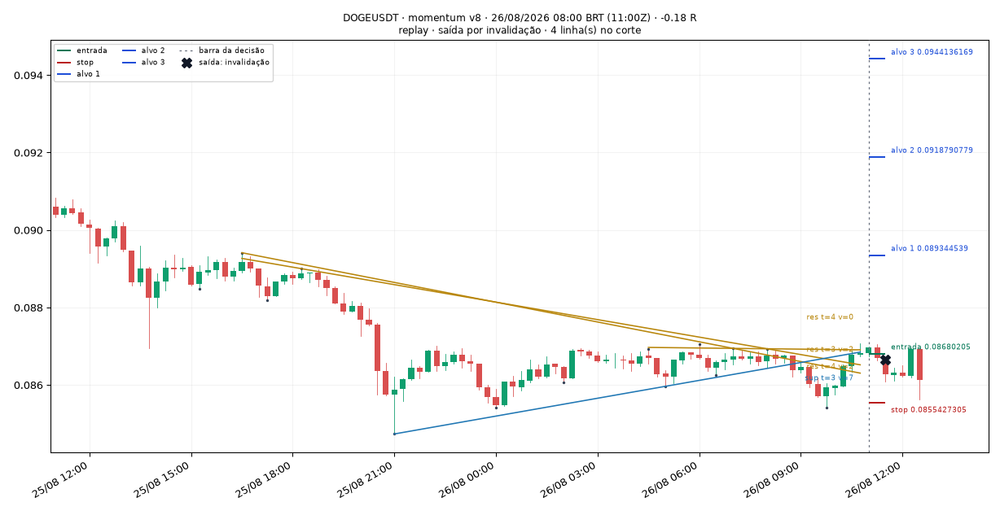

> Momentum 15m: fechamento 0.08681 acima da máxima dos 20 fechamentos anteriores (0.08678), retorno 15m 0.03%, volume relativo 1.50x da mediana de 96 barras, ATR% 0.49%

### 085 — ETHUSDT · 26/08/2026 08:00 BRT · -0.43 R

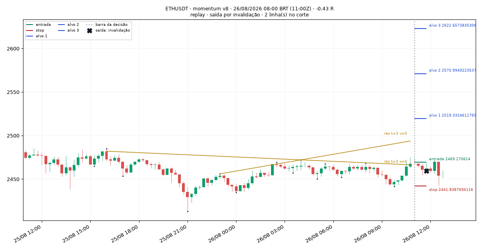

> Momentum 15m: fechamento 2467.67 acima da máxima dos 20 fechamentos anteriores (2464.17), retorno 15m 0.14%, volume relativo 2.32x da mediana de 96 barras, ATR% 0.35%

### 086 — ETHUSDT · 26/08/2026 15:15 BRT · -0.25 R

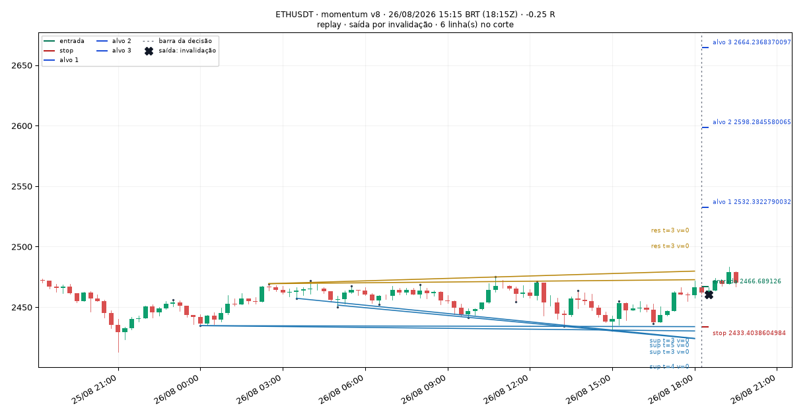

> Momentum 15m: fechamento 2466.38 acima da máxima dos 20 fechamentos anteriores (2461.98), retorno 15m 0.26%, volume relativo 1.88x da mediana de 96 barras, ATR% 0.45%

### 087 — ETHUSDT · 26/08/2026 16:30 BRT · -0.36 R

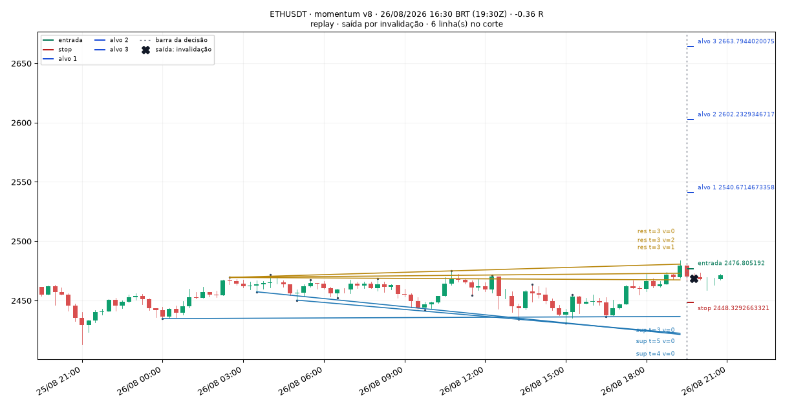

> Momentum 15m: fechamento 2479.11 acima da máxima dos 20 fechamentos anteriores (2471.72), retorno 15m 0.39%, volume relativo 2.88x da mediana de 96 barras, ATR% 0.41%

### 088 — SOLUSDT · 26/08/2026 18:15 BRT · +1.74 R

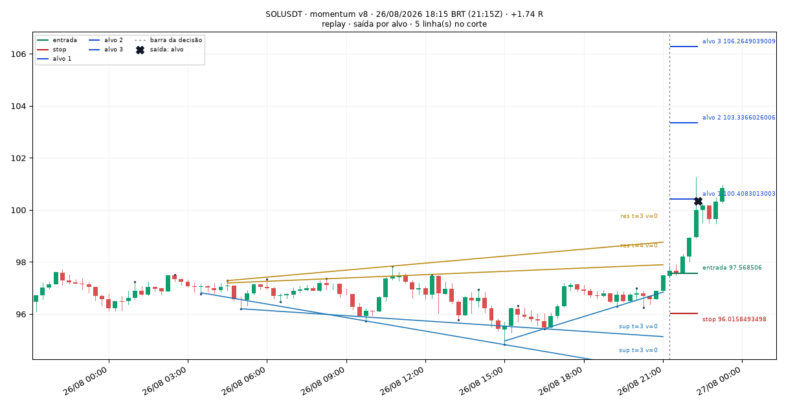

> Momentum 15m: fechamento 97.48 acima da máxima dos 20 fechamentos anteriores (97.12), retorno 15m 0.62%, volume relativo 1.75x da mediana de 96 barras, ATR% 0.50%

### 089 — ETHUSDT · 26/08/2026 18:15 BRT · -0.21 R

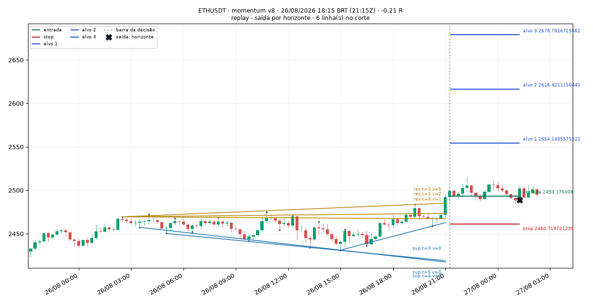

> Momentum 15m: fechamento 2491.86 acima da máxima dos 20 fechamentos anteriores (2479.11), retorno 15m 0.83%, volume relativo 3.93x da mediana de 96 barras, ATR% 0.42%

### 090 — DOGEUSDT · 26/08/2026 18:30 BRT · +0.90 R

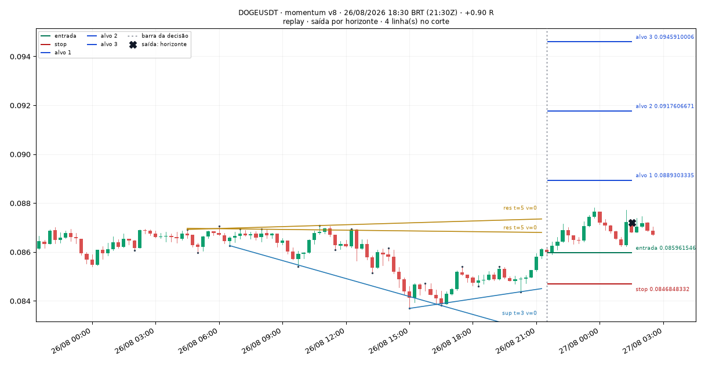

> Momentum 15m: fechamento 0.0861 acima da máxima dos 20 fechamentos anteriores (0.08581), retorno 15m 0.34%, volume relativo 2.00x da mediana de 96 barras, ATR% 0.55%

### 091 — XRPUSDT · 26/08/2026 19:15 BRT · -0.27 R

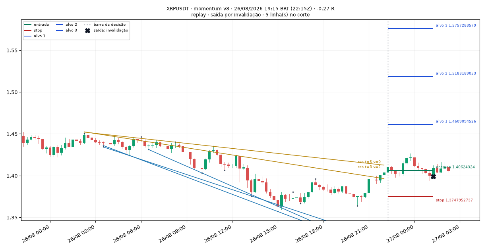

> Momentum 15m: fechamento 1.4035 acima da máxima dos 20 fechamentos anteriores (1.4004), retorno 15m 0.22%, volume relativo 1.62x da mediana de 96 barras, ATR% 0.68%

### 092 — SOLUSDT · 26/08/2026 20:15 BRT · +0.14 R

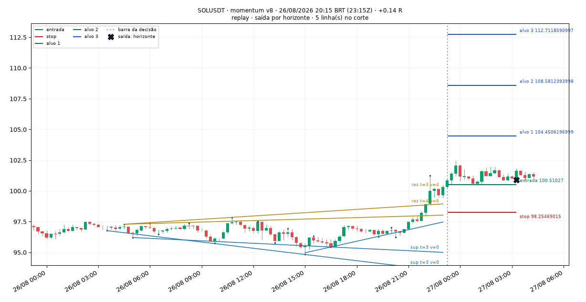

> Momentum 15m: fechamento 100.32 acima da máxima dos 20 fechamentos anteriores (100.16), retorno 15m 0.67%, volume relativo 2.67x da mediana de 96 barras, ATR% 0.69%

### 093 — SOLUSDT · 27/08/2026 03:00 BRT · -0.34 R

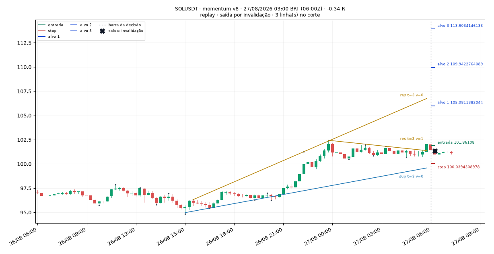

> Momentum 15m: fechamento 102.02 acima da máxima dos 20 fechamentos anteriores (101.66), retorno 15m 0.78%, volume relativo 2.65x da mediana de 96 barras, ATR% 0.65%

### 094 — DOGEUSDT · 27/08/2026 05:15 BRT · +0.24 R

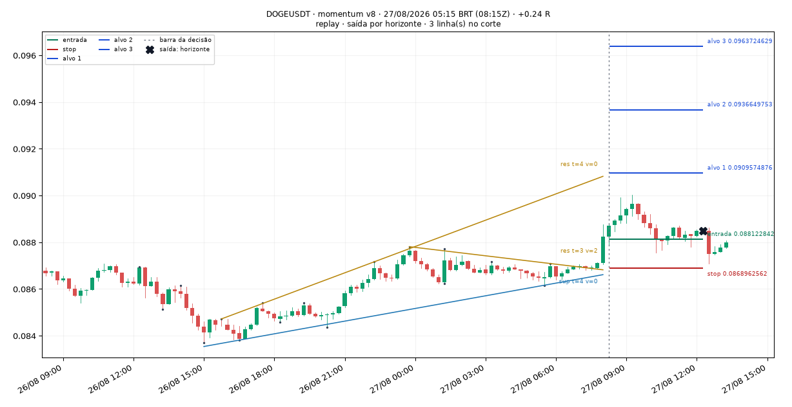

> Momentum 15m: fechamento 0.08825 acima da máxima dos 20 fechamentos anteriores (0.0871), retorno 15m 1.32%, volume relativo 5.47x da mediana de 96 barras, ATR% 0.51%

### 095 — ETHUSDT · 27/08/2026 05:15 BRT · -1.15 R

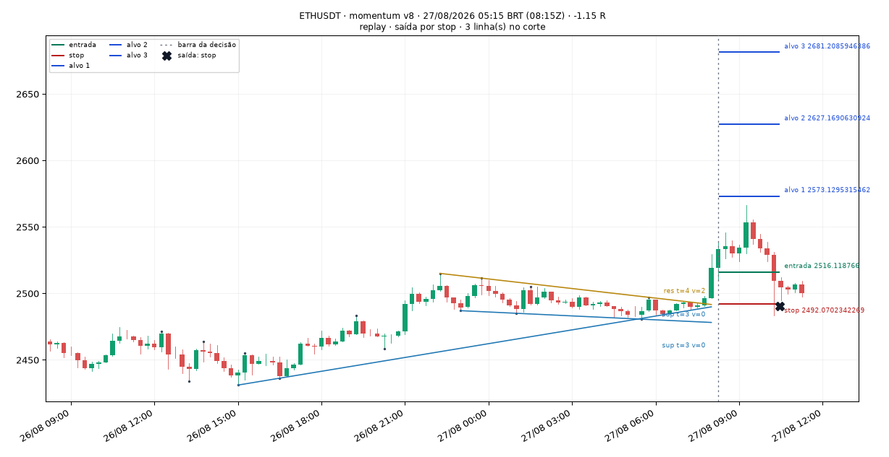

> Momentum 15m: fechamento 2519.09 acima da máxima dos 20 fechamentos anteriores (2496.78), retorno 15m 0.92%, volume relativo 8.40x da mediana de 96 barras, ATR% 0.36%

### 096 — XRPUSDT · 27/08/2026 05:15 BRT · +0.20 R

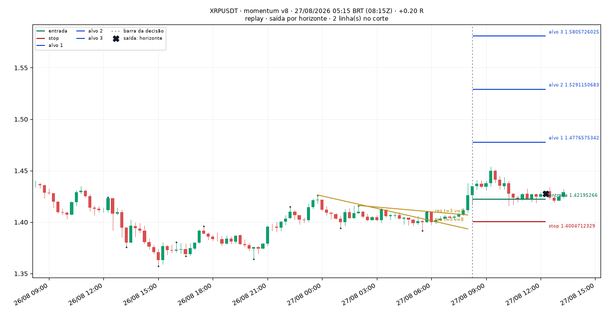

> Momentum 15m: fechamento 1.4262 acima da máxima dos 20 fechamentos anteriores (1.4118), retorno 15m 1.04%, volume relativo 5.09x da mediana de 96 barras, ATR% 0.60%

### 097 — SOLUSDT · 27/08/2026 05:15 BRT · +0.72 R

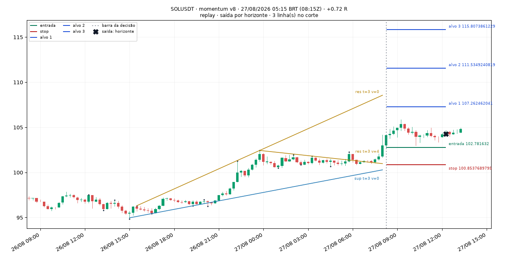

> Momentum 15m: fechamento 102.99 acima da máxima dos 20 fechamentos anteriores (102.02), retorno 15m 1.20%, volume relativo 8.23x da mediana de 96 barras, ATR% 0.69%

### 098 — SOLUSDT · 27/08/2026 11:00 BRT · +0.76 R

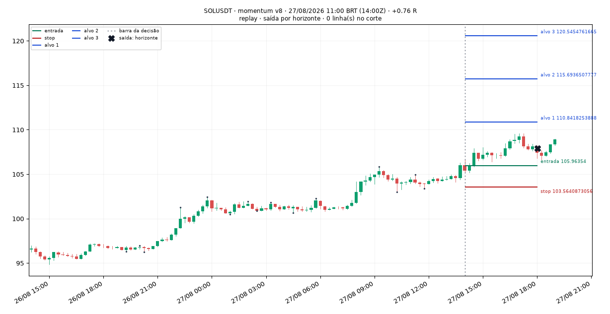

> Momentum 15m: fechamento 105.99 acima da máxima dos 20 fechamentos anteriores (105.36), retorno 15m 1.36%, volume relativo 5.72x da mediana de 96 barras, ATR% 0.76%

### 099 — XRPUSDT · 27/08/2026 11:30 BRT · -0.47 R

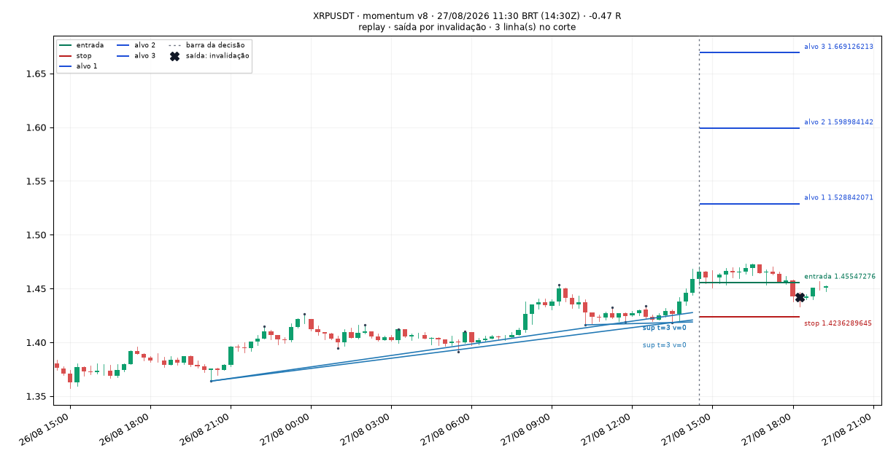

> Momentum 15m: fechamento 1.4587 acima da máxima dos 20 fechamentos anteriores (1.4499), retorno 15m 0.90%, volume relativo 4.01x da mediana de 96 barras, ATR% 0.80%

### 100 — DOGEUSDT · 27/08/2026 11:45 BRT · -0.21 R

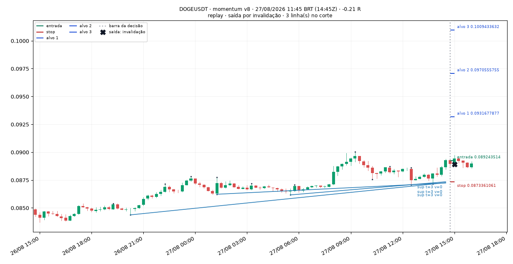

> Momentum 15m: fechamento 0.08928 acima da máxima dos 20 fechamentos anteriores (0.08919), retorno 15m 0.73%, volume relativo 2.08x da mediana de 96 barras, ATR% 0.73%

### 101 — DOGEUSDT · 27/08/2026 13:45 BRT · -0.31 R

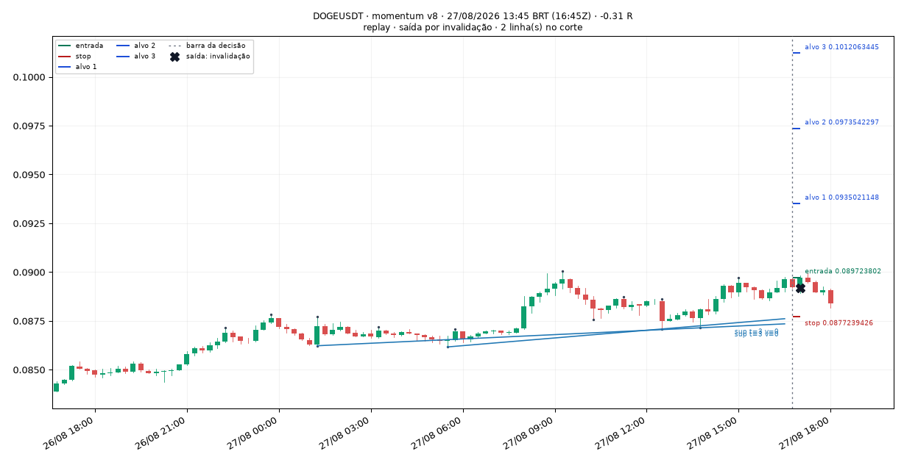

> Momentum 15m: fechamento 0.08965 acima da máxima dos 20 fechamentos anteriores (0.08945), retorno 15m 0.52%, volume relativo 1.58x da mediana de 96 barras, ATR% 0.72%

### 102 — SOLUSDT · 27/08/2026 17:00 BRT · -0.13 R

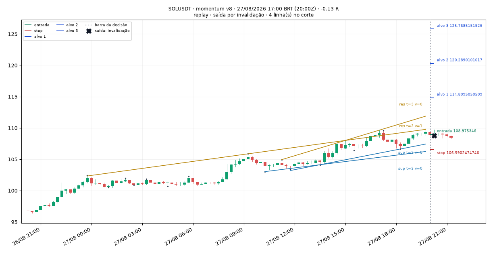

> Momentum 15m: fechamento 109.33 acima da máxima dos 20 fechamentos anteriores (109.22), retorno 15m 0.21%, volume relativo 2.54x da mediana de 96 barras, ATR% 0.84%

### 103 — XRPUSDT · 27/08/2026 22:30 BRT · -0.78 R

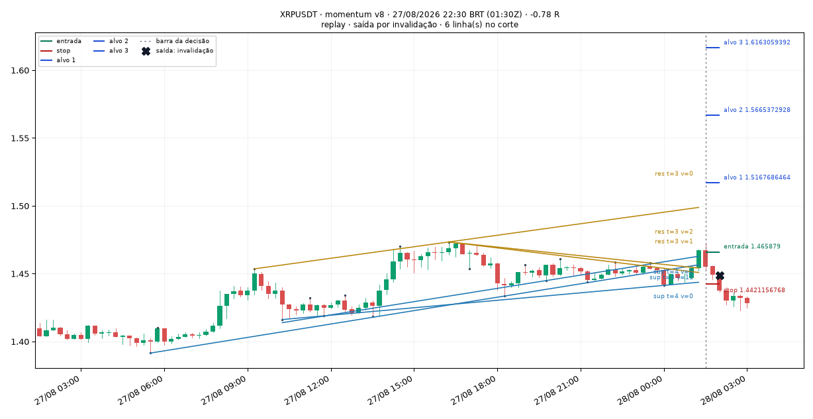

> Momentum 15m: fechamento 1.467 acima da máxima dos 20 fechamentos anteriores (1.4552), retorno 15m 0.89%, volume relativo 1.68x da mediana de 96 barras, ATR% 0.57%

### 104 — DOGEUSDT · 27/08/2026 22:30 BRT · -0.72 R

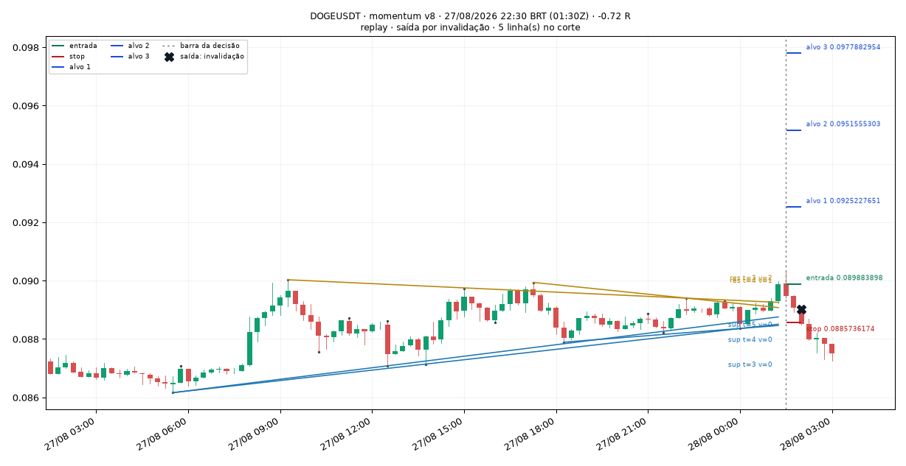

> Momentum 15m: fechamento 0.08989 acima da máxima dos 20 fechamentos anteriores (0.0893), retorno 15m 0.66%, volume relativo 1.91x da mediana de 96 barras, ATR% 0.49%

### 105 — XRPUSDT · 28/08/2026 08:15 BRT · -0.32 R

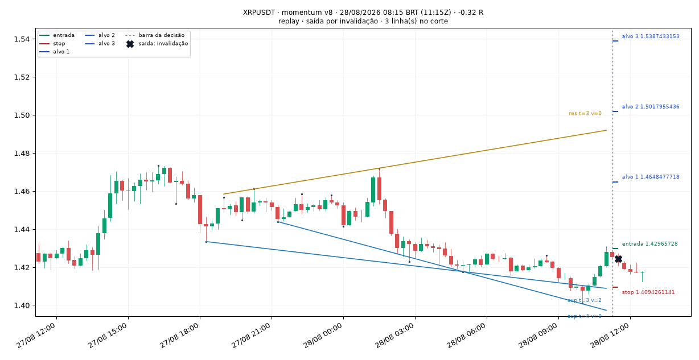

> Momentum 15m: fechamento 1.4279 acima da máxima dos 20 fechamentos anteriores (1.4269), retorno 15m 0.52%, volume relativo 2.07x da mediana de 96 barras, ATR% 0.43%

### 106 — DOGEUSDT · 28/08/2026 11:45 BRT · -0.43 R

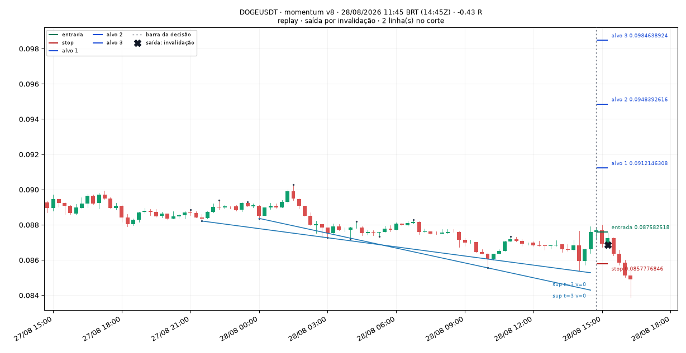

> Momentum 15m: fechamento 0.08759 acima da máxima dos 20 fechamentos anteriores (0.08717), retorno 15m 1.15%, volume relativo 5.28x da mediana de 96 barras, ATR% 0.69%

### 107 — ETHUSDT · 28/08/2026 11:45 BRT · -0.20 R

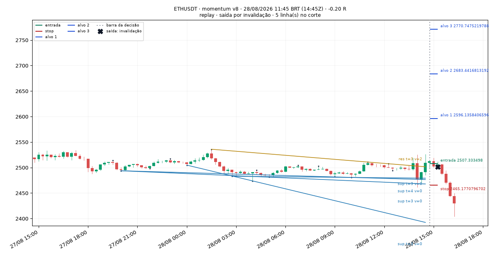

> Momentum 15m: fechamento 2508.83 acima da máxima dos 20 fechamentos anteriores (2508.72), retorno 15m 0.73%, volume relativo 9.67x da mediana de 96 barras, ATR% 0.58%

### 108 — XRPUSDT · 28/08/2026 12:00 BRT · -0.40 R

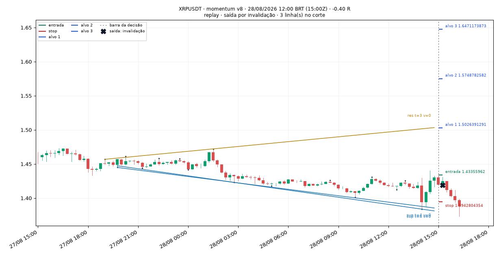

> Momentum 15m: fechamento 1.4304 acima da máxima dos 20 fechamentos anteriores (1.4279), retorno 15m 0.33%, volume relativo 2.76x da mediana de 96 barras, ATR% 0.84%

### 109 — SOLUSDT · 28/08/2026 12:30 BRT · -0.37 R

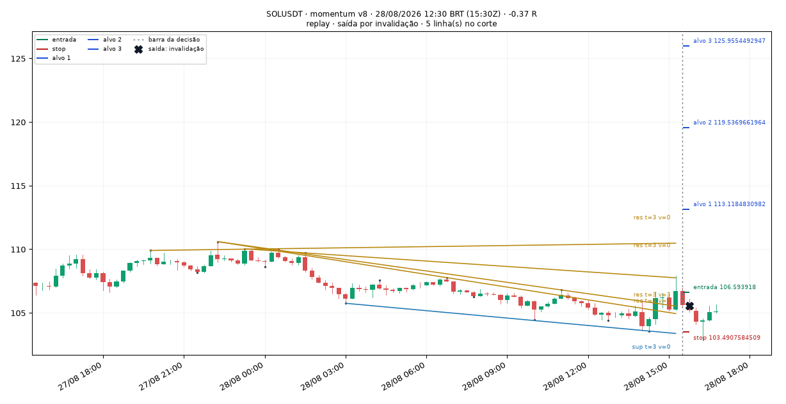

> Momentum 15m: fechamento 106.7 acima da máxima dos 20 fechamentos anteriores (106.39), retorno 15m 1.38%, volume relativo 7.92x da mediana de 96 barras, ATR% 1.00%

### 110 — SOLUSDT · 29/08/2026 11:45 BRT · -0.14 R

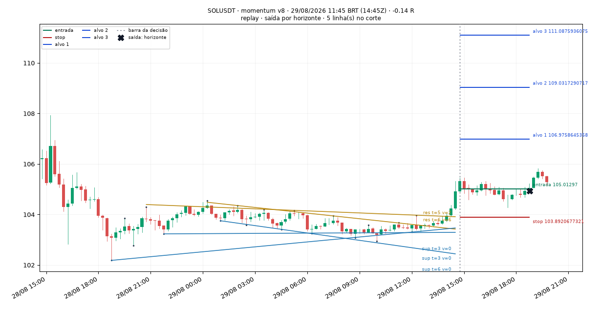

> Momentum 15m: fechamento 104.92 acima da máxima dos 20 fechamentos anteriores (104.24), retorno 15m 0.65%, volume relativo 5.72x da mediana de 96 barras, ATR% 0.33%

### 111 — SOLUSDT · 29/08/2026 16:30 BRT · -0.52 R

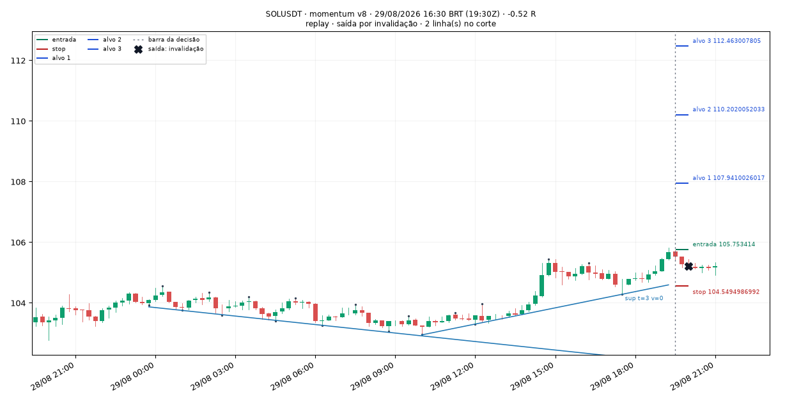

> Momentum 15m: fechamento 105.68 acima da máxima dos 20 fechamentos anteriores (105.45), retorno 15m 0.22%, volume relativo 2.33x da mediana de 96 barras, ATR% 0.36%

### 112 — DOGEUSDT · 30/08/2026 10:00 BRT · -0.31 R

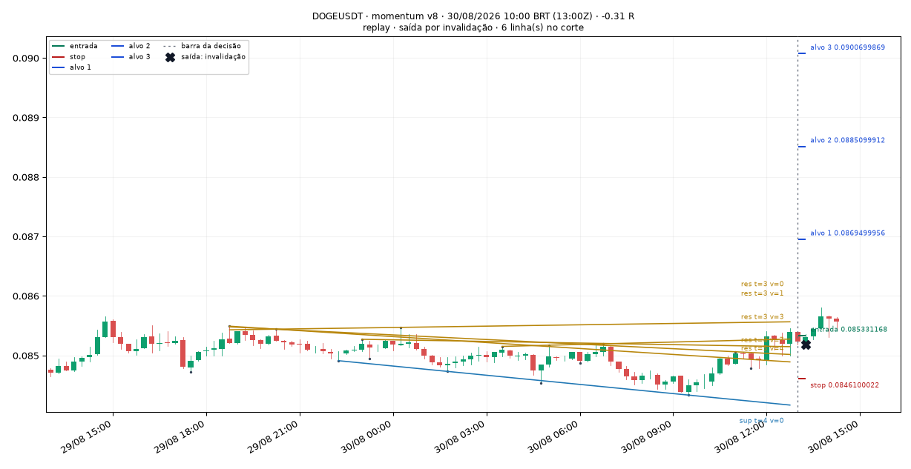

> Momentum 15m: fechamento 0.08539 acima da máxima dos 20 fechamentos anteriores (0.08532), retorno 15m 0.23%, volume relativo 1.82x da mediana de 96 barras, ATR% 0.30%

### 113 — SOLUSDT · 30/08/2026 10:00 BRT · +0.43 R

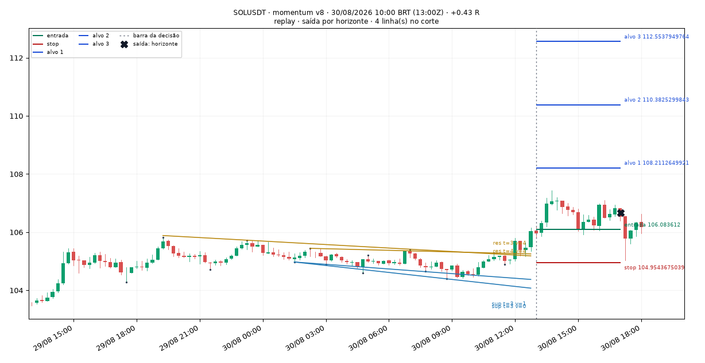

> Momentum 15m: fechamento 106.04 acima da máxima dos 20 fechamentos anteriores (105.7), retorno 15m 0.54%, volume relativo 2.90x da mediana de 96 barras, ATR% 0.34%

### 114 — XRPUSDT · 30/08/2026 11:00 BRT · -0.90 R

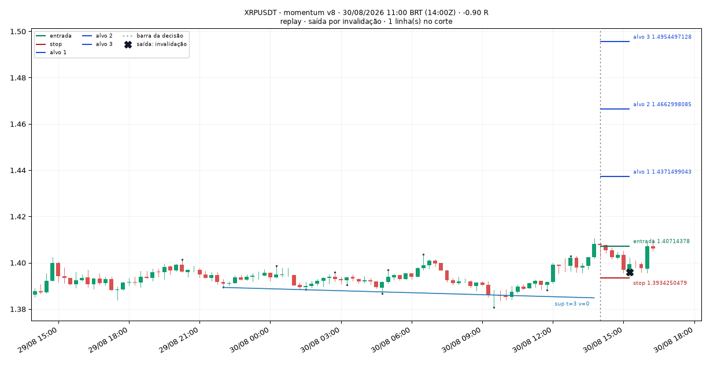

> Momentum 15m: fechamento 1.408 acima da máxima dos 20 fechamentos anteriores (1.4023), retorno 15m 0.41%, volume relativo 3.74x da mediana de 96 barras, ATR% 0.35%

### 115 — DOGEUSDT · 30/08/2026 11:00 BRT · -0.45 R

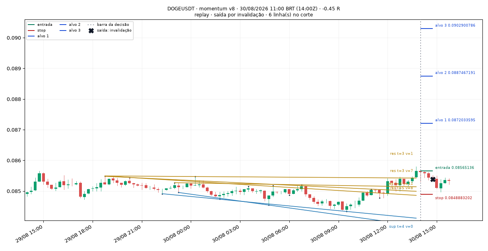

> Momentum 15m: fechamento 0.08566 acima da máxima dos 20 fechamentos anteriores (0.08544), retorno 15m 0.26%, volume relativo 3.52x da mediana de 96 barras, ATR% 0.30%

### 116 — ETHUSDT · 30/08/2026 13:15 BRT · -0.48 R

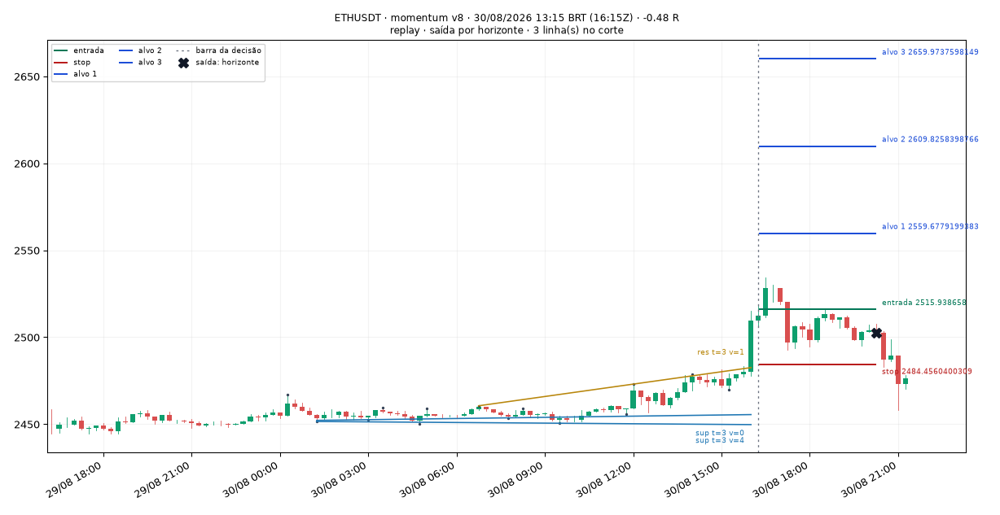

> Momentum 15m: fechamento 2509.53 acima da máxima dos 20 fechamentos anteriores (2479.91), retorno 15m 1.19%, volume relativo 16.87x da mediana de 96 barras, ATR% 0.33%

### 117 — DOGEUSDT · 30/08/2026 13:15 BRT · -0.52 R

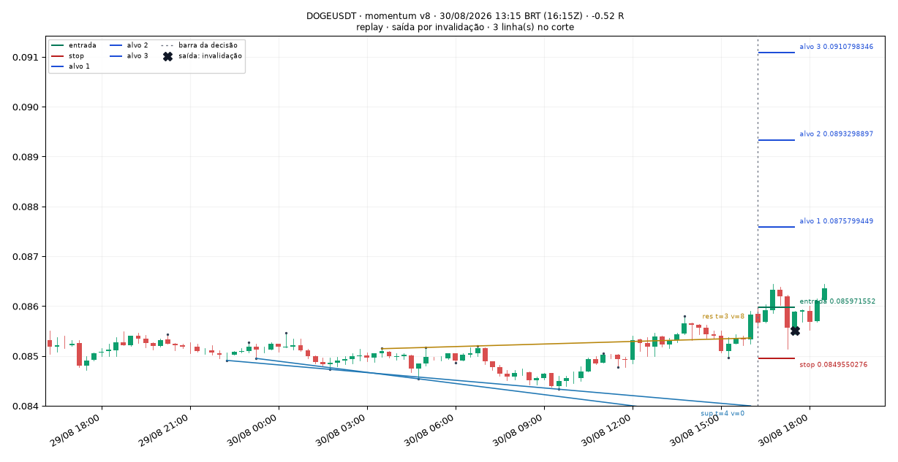

> Momentum 15m: fechamento 0.08583 acima da máxima dos 20 fechamentos anteriores (0.08566), retorno 15m 0.59%, volume relativo 3.23x da mediana de 96 barras, ATR% 0.34%

### 118 — XRPUSDT · 30/08/2026 13:45 BRT · -0.62 R

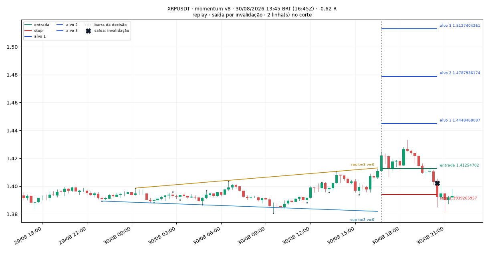

> Momentum 15m: fechamento 1.4109 acima da máxima dos 20 fechamentos anteriores (1.408), retorno 15m 0.34%, volume relativo 2.51x da mediana de 96 barras, ATR% 0.40%

### 119 — DOGEUSDT · 30/08/2026 15:45 BRT · -0.15 R

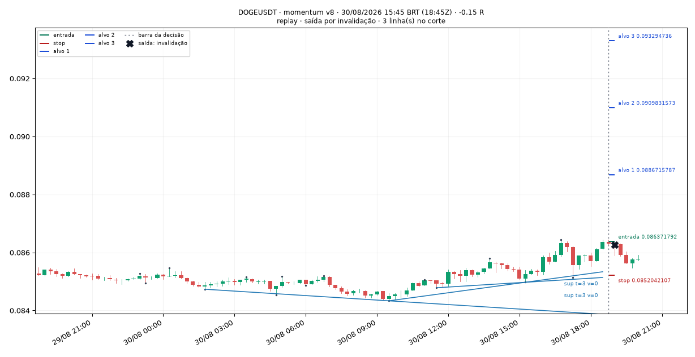

> Momentum 15m: fechamento 0.08636 acima da máxima dos 20 fechamentos anteriores (0.08632), retorno 15m 0.29%, volume relativo 2.21x da mediana de 96 barras, ATR% 0.45%

### 120 — DOGEUSDT · 31/08/2026 02:30 BRT · -0.09 R

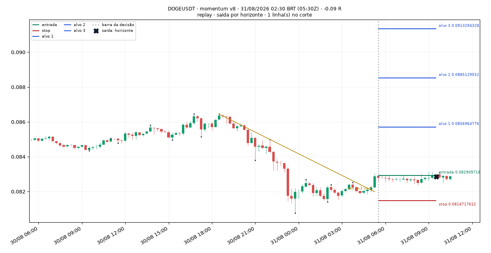

> Momentum 15m: fechamento 0.08288 acima da máxima dos 20 fechamentos anteriores (0.08247), retorno 15m 0.80%, volume relativo 3.64x da mediana de 96 barras, ATR% 0.57%

### 121 — ETHUSDT · 31/08/2026 02:30 BRT · +0.20 R

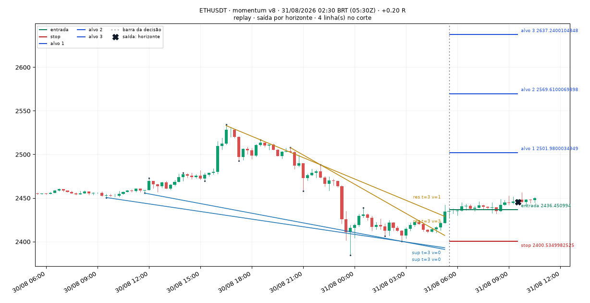

> Momentum 15m: fechamento 2434.35 acima da máxima dos 20 fechamentos anteriores (2431.11), retorno 15m 0.54%, volume relativo 4.54x da mediana de 96 barras, ATR% 0.46%

### 122 — SOLUSDT · 31/08/2026 02:30 BRT · +0.13 R

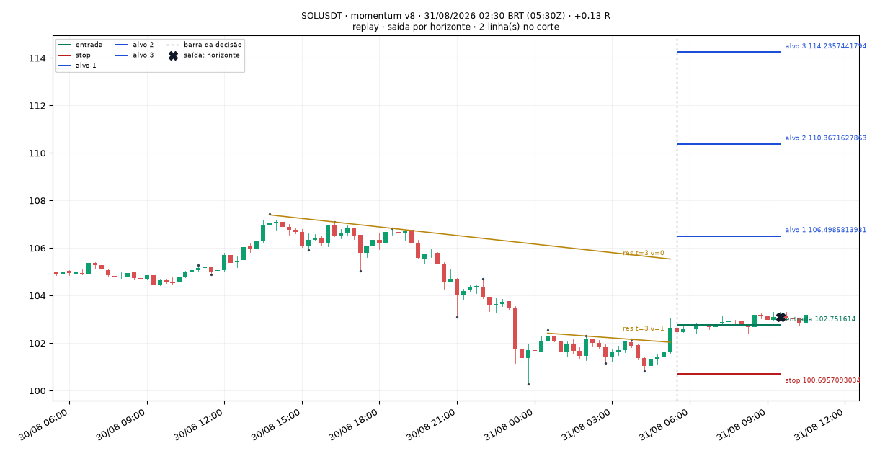

> Momentum 15m: fechamento 102.63 acima da máxima dos 20 fechamentos anteriores (102.28), retorno 15m 0.98%, volume relativo 4.78x da mediana de 96 barras, ATR% 0.63%

### 123 — SOLUSDT · 31/08/2026 08:00 BRT · -0.44 R

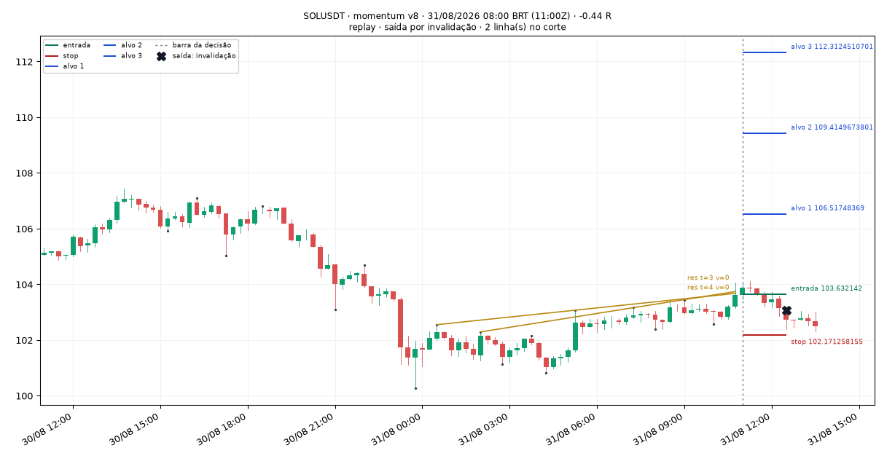

> Momentum 15m: fechamento 103.62 acima da máxima dos 20 fechamentos anteriores (103.19), retorno 15m 0.42%, volume relativo 2.76x da mediana de 96 barras, ATR% 0.47%

### 124 — ETHUSDT · 31/08/2026 11:45 BRT · +0.37 R

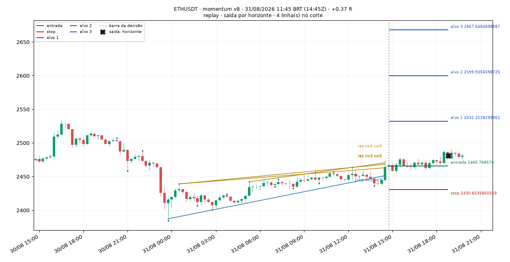

> Momentum 15m: fechamento 2464.51 acima da máxima dos 20 fechamentos anteriores (2454.37), retorno 15m 0.81%, volume relativo 4.52x da mediana de 96 barras, ATR% 0.46%

### 125 — SOLUSDT · 31/08/2026 15:30 BRT · -0.18 R

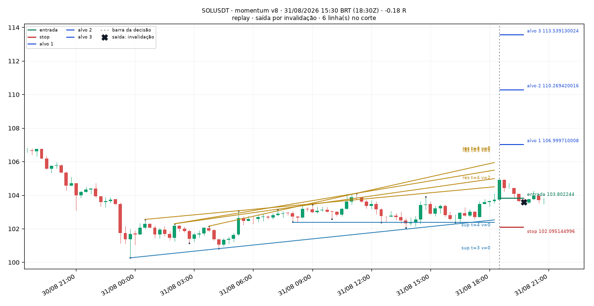

> Momentum 15m: fechamento 103.73 acima da máxima dos 20 fechamentos anteriores (103.65), retorno 15m 0.08%, volume relativo 1.50x da mediana de 96 barras, ATR% 0.53%

### 126 — DOGEUSDT · 01/09/2026 00:45 BRT · -0.28 R

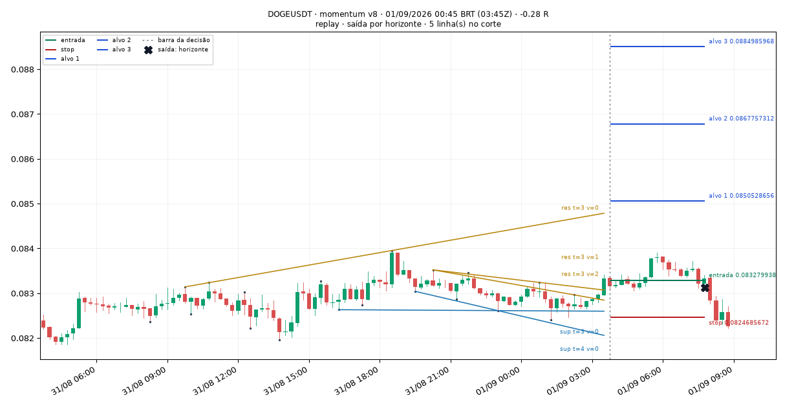

> Momentum 15m: fechamento 0.08333 acima da máxima dos 20 fechamentos anteriores (0.08309), retorno 15m 0.45%, volume relativo 1.95x da mediana de 96 barras, ATR% 0.34%

### 127 — XRPUSDT · 01/09/2026 00:45 BRT · -0.32 R

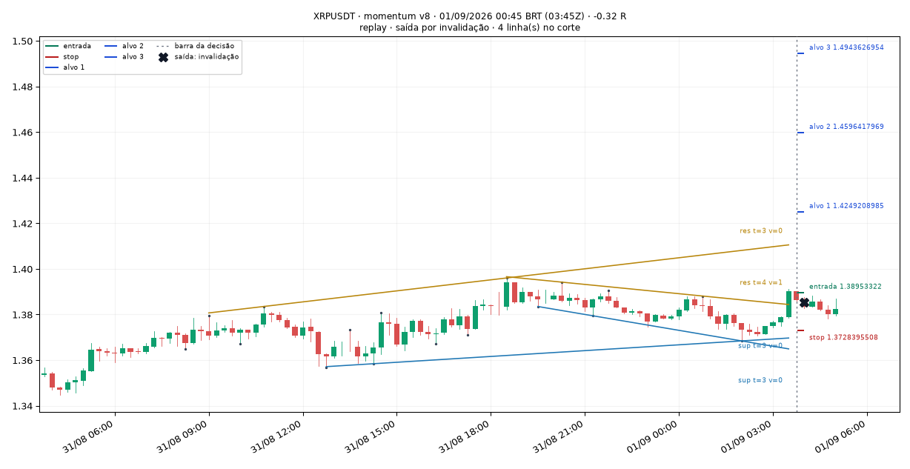

> Momentum 15m: fechamento 1.3902 acima da máxima dos 20 fechamentos anteriores (1.3865), retorno 15m 0.83%, volume relativo 1.91x da mediana de 96 barras, ATR% 0.42%

### 128 — SOLUSDT · 01/09/2026 00:45 BRT · -0.56 R

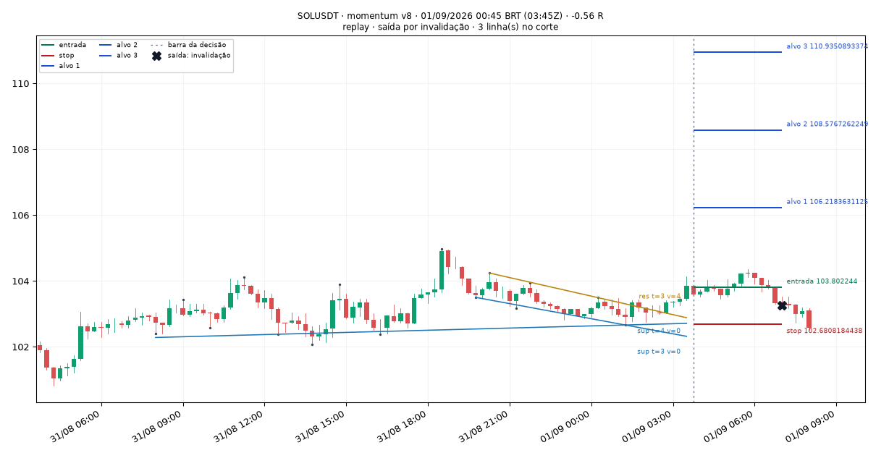

> Momentum 15m: fechamento 103.86 acima da máxima dos 20 fechamentos anteriores (103.46), retorno 15m 0.39%, volume relativo 1.66x da mediana de 96 barras, ATR% 0.38%

### 129 — ETHUSDT · 01/09/2026 00:45 BRT · -0.36 R

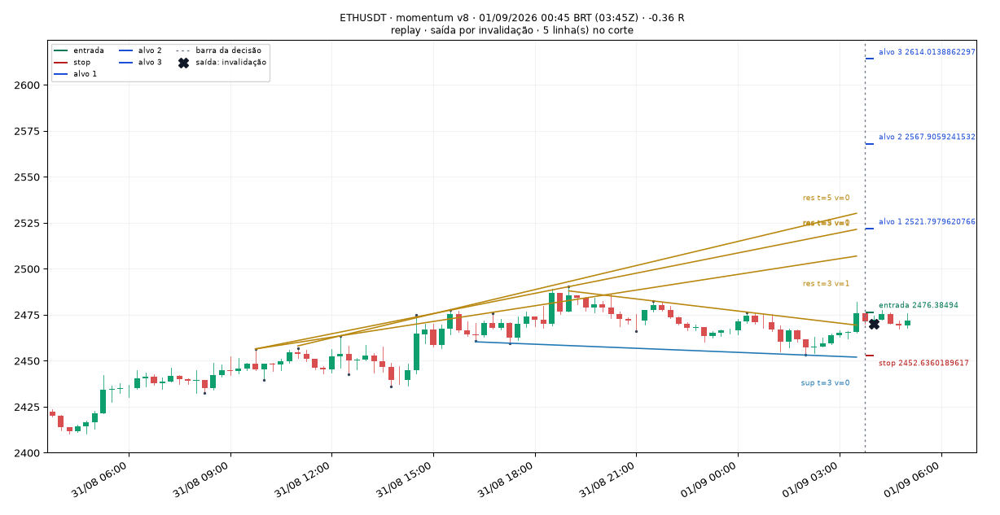

> Momentum 15m: fechamento 2475.69 acima da máxima dos 20 fechamentos anteriores (2474.26), retorno 15m 0.40%, volume relativo 2.52x da mediana de 96 barras, ATR% 0.31%

### 130 — XRPUSDT · 01/09/2026 03:00 BRT · -0.36 R

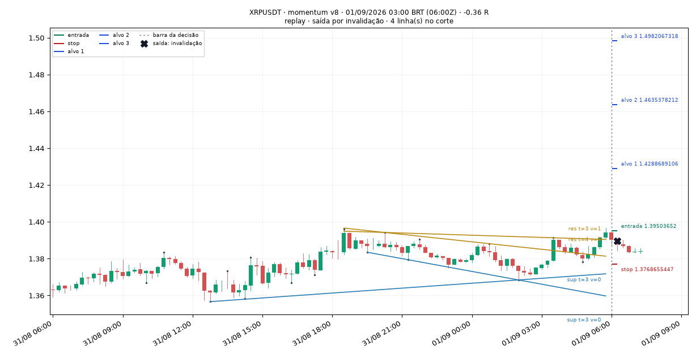

> Momentum 15m: fechamento 1.3942 acima da máxima dos 20 fechamentos anteriores (1.3915), retorno 15m 0.19%, volume relativo 1.58x da mediana de 96 barras, ATR% 0.41%

### 131 — ETHUSDT · 01/09/2026 20:45 BRT · -0.29 R

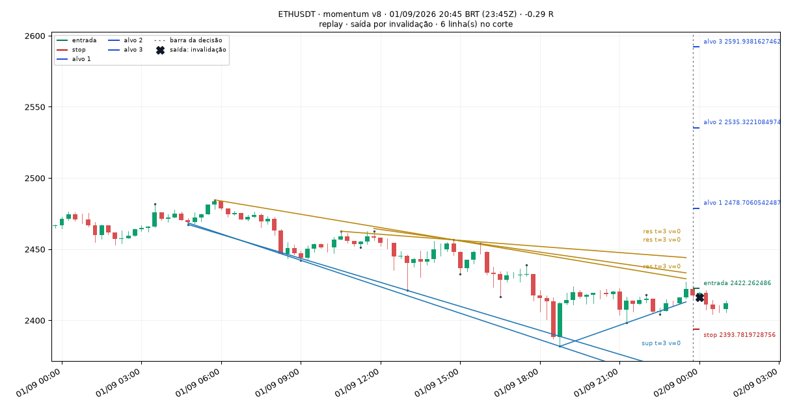

> Momentum 15m: fechamento 2422.09 acima da máxima dos 20 fechamentos anteriores (2420.23), retorno 15m 0.25%, volume relativo 1.78x da mediana de 96 barras, ATR% 0.39%

### 132 — XRPUSDT · 02/09/2026 00:30 BRT · -0.26 R

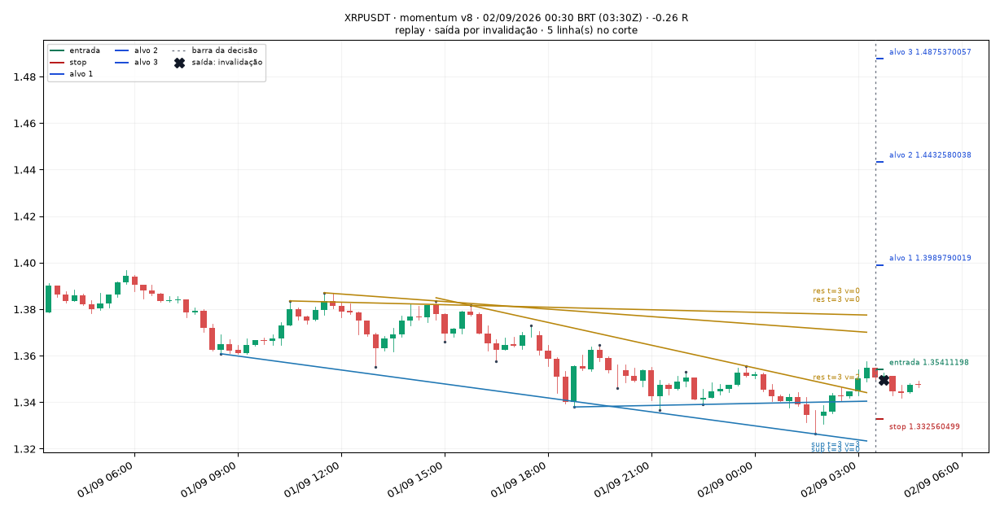

> Momentum 15m: fechamento 1.3547 acima da máxima dos 20 fechamentos anteriores (1.3528), retorno 15m 0.33%, volume relativo 1.71x da mediana de 96 barras, ATR% 0.54%

### 133 — ETHUSDT · 02/09/2026 10:45 BRT · -0.79 R

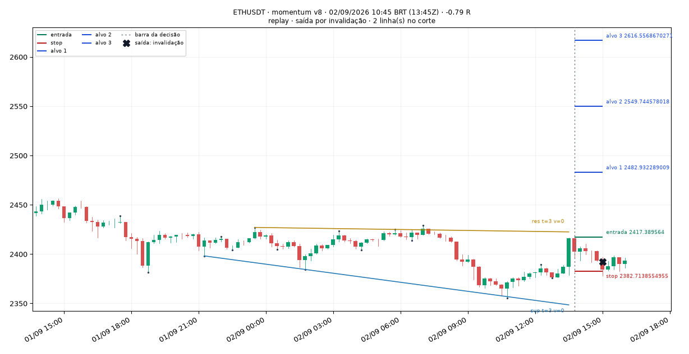

> Momentum 15m: fechamento 2416.12 acima da máxima dos 20 fechamentos anteriores (2394.65), retorno 15m 1.22%, volume relativo 5.17x da mediana de 96 barras, ATR% 0.46%

### 134 — DOGEUSDT · 02/09/2026 10:45 BRT · -1.09 R

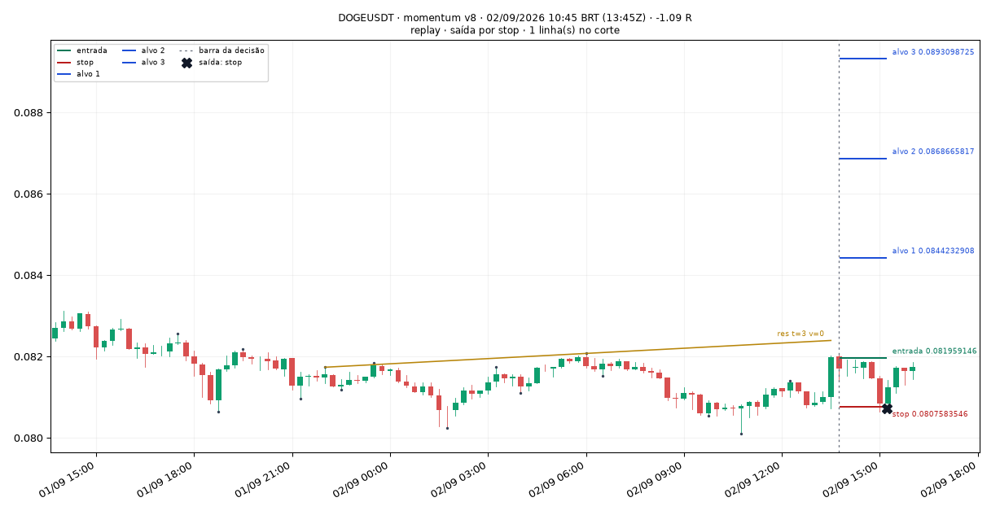

> Momentum 15m: fechamento 0.08198 acima da máxima dos 20 fechamentos anteriores (0.08135), retorno 15m 1.22%, volume relativo 2.75x da mediana de 96 barras, ATR% 0.50%

### 135 — XRPUSDT · 02/09/2026 10:45 BRT · -0.64 R

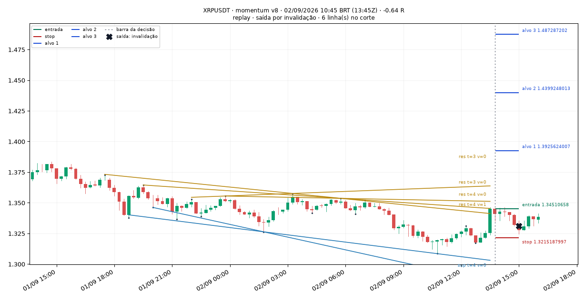

> Momentum 15m: fechamento 1.3452 acima da máxima dos 20 fechamentos anteriores (1.3322), retorno 15m 1.50%, volume relativo 3.40x da mediana de 96 barras, ATR% 0.59%

### 136 — SOLUSDT · 02/09/2026 10:45 BRT · -0.31 R

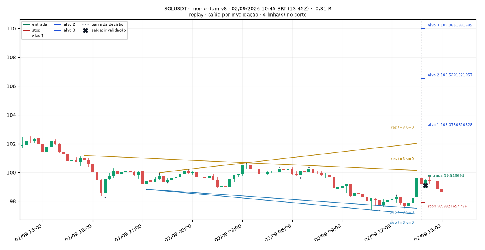

> Momentum 15m: fechamento 99.62 acima da máxima dos 20 fechamentos anteriores (99.18), retorno 15m 1.40%, volume relativo 3.82x da mediana de 96 barras, ATR% 0.58%

### 137 — SOLUSDT · 02/09/2026 17:15 BRT · -0.13 R

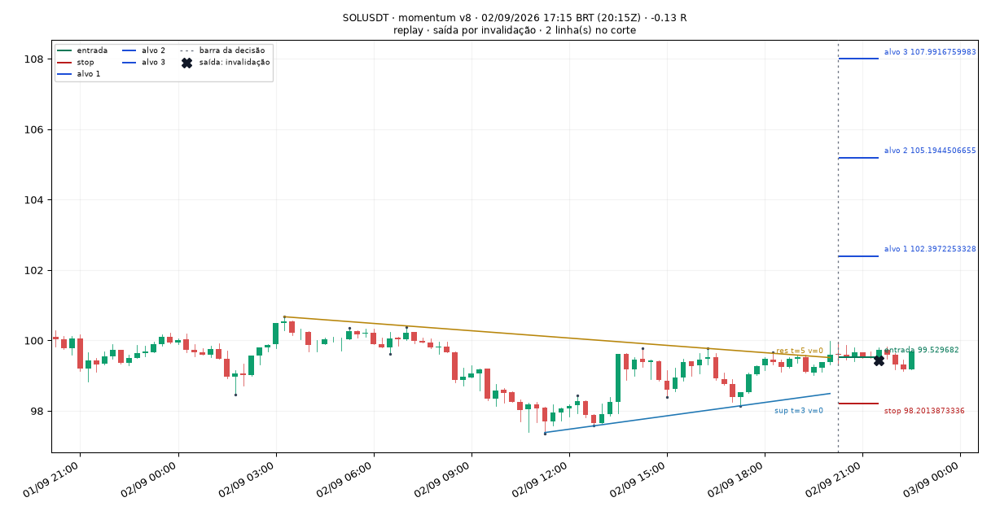

> Momentum 15m: fechamento 99.6 acima da máxima dos 20 fechamentos anteriores (99.52), retorno 15m 0.22%, volume relativo 1.88x da mediana de 96 barras, ATR% 0.47%

### 138 — XRPUSDT · 02/09/2026 17:15 BRT · -0.35 R

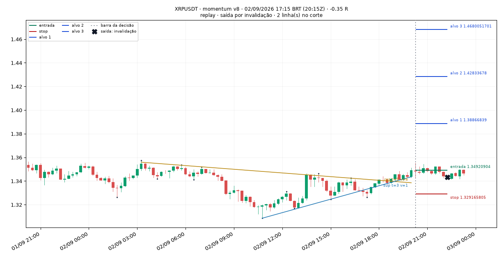

> Momentum 15m: fechamento 1.349 acima da máxima dos 20 fechamentos anteriores (1.3456), retorno 15m 0.39%, volume relativo 1.62x da mediana de 96 barras, ATR% 0.49%

### 139 — SOLUSDT · 02/09/2026 21:00 BRT · -0.67 R

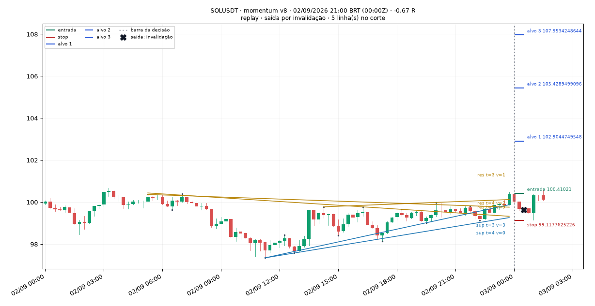

> Momentum 15m: fechamento 100.38 acima da máxima dos 20 fechamentos anteriores (99.9), retorno 15m 0.52%, volume relativo 1.59x da mediana de 96 barras, ATR% 0.42%

### 140 — DOGEUSDT · 02/09/2026 22:15 BRT · +0.51 R

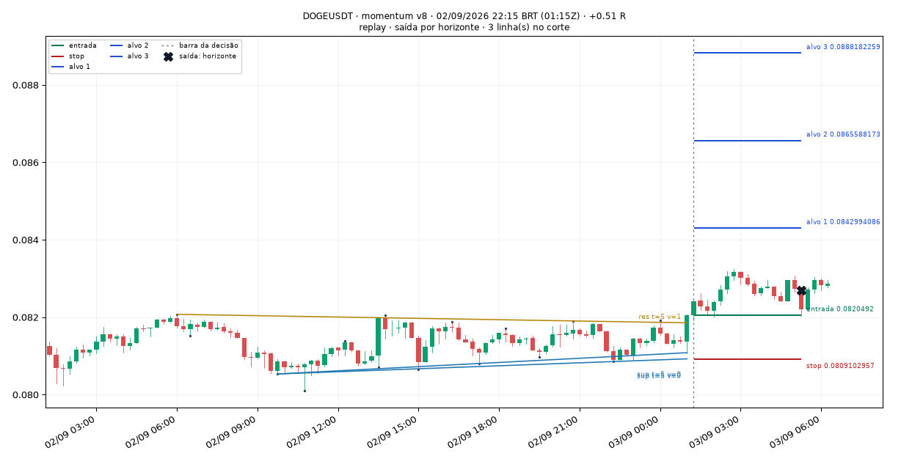

> Momentum 15m: fechamento 0.08204 acima da máxima dos 20 fechamentos anteriores (0.08182), retorno 15m 0.84%, volume relativo 2.32x da mediana de 96 barras, ATR% 0.46%

### 141 — XRPUSDT · 02/09/2026 22:15 BRT · +0.23 R

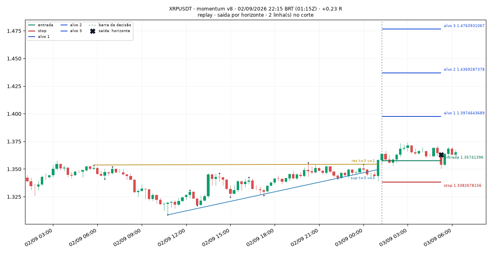

> Momentum 15m: fechamento 1.358 acima da máxima dos 20 fechamentos anteriores (1.3522), retorno 15m 1.08%, volume relativo 2.10x da mediana de 96 barras, ATR% 0.48%

### 142 — ETHUSDT · 02/09/2026 23:45 BRT · -1.13 R

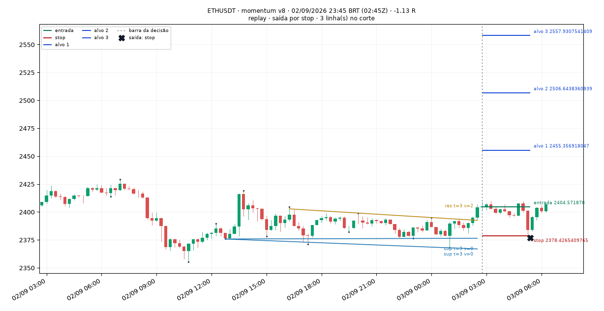

> Momentum 15m: fechamento 2404.07 acima da máxima dos 20 fechamentos anteriores (2394.79), retorno 15m 0.39%, volume relativo 3.39x da mediana de 96 barras, ATR% 0.36%

### 143 — SOLUSDT · 02/09/2026 23:45 BRT · -0.40 R

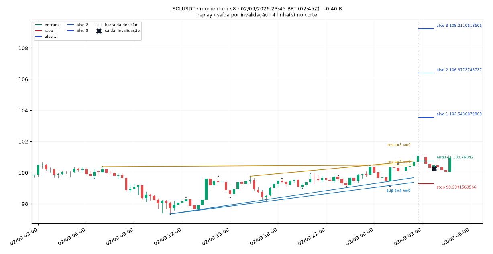

> Momentum 15m: fechamento 100.71 acima da máxima dos 20 fechamentos anteriores (100.41), retorno 15m 0.30%, volume relativo 3.14x da mediana de 96 barras, ATR% 0.47%

### 144 — XRPUSDT · 03/09/2026 04:15 BRT · -0.18 R

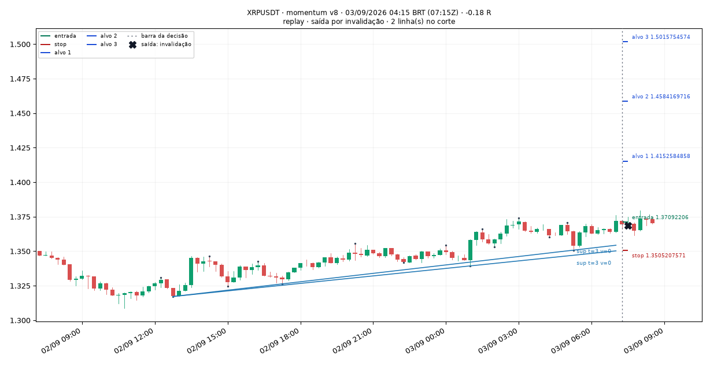

> Momentum 15m: fechamento 1.3721 acima da máxima dos 20 fechamentos anteriores (1.3713), retorno 15m 0.59%, volume relativo 1.85x da mediana de 96 barras, ATR% 0.52%

### 145 — DOGEUSDT · 03/09/2026 04:15 BRT · -0.37 R

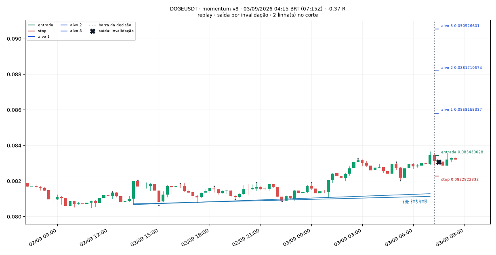

> Momentum 15m: fechamento 0.08346 acima da máxima dos 20 fechamentos anteriores (0.08316), retorno 15m 0.60%, volume relativo 3.00x da mediana de 96 barras, ATR% 0.47%

### 146 — SOLUSDT · 03/09/2026 04:15 BRT · -0.29 R

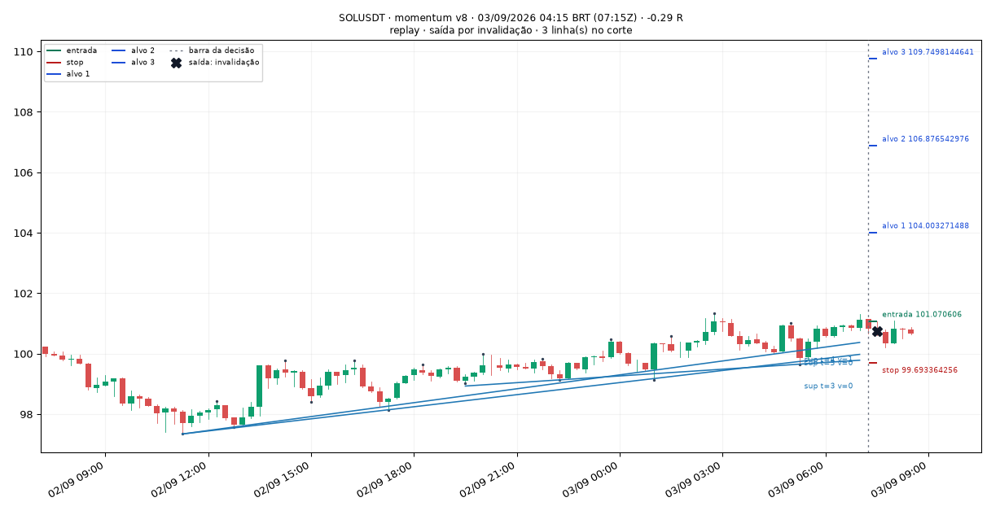

> Momentum 15m: fechamento 101.13 acima da máxima dos 20 fechamentos anteriores (101.06), retorno 15m 0.28%, volume relativo 2.43x da mediana de 96 barras, ATR% 0.47%

### 147 — ETHUSDT · 03/09/2026 04:15 BRT · -0.28 R

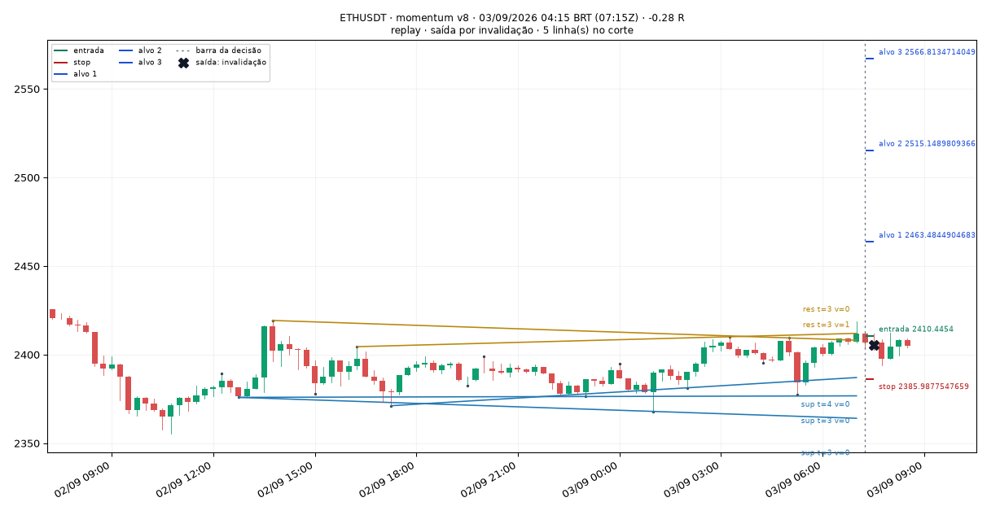

> Momentum 15m: fechamento 2411.82 acima da máxima dos 20 fechamentos anteriores (2408.94), retorno 15m 0.19%, volume relativo 3.33x da mediana de 96 barras, ATR% 0.36%

### 148 — XRPUSDT · 03/09/2026 05:15 BRT · -0.21 R

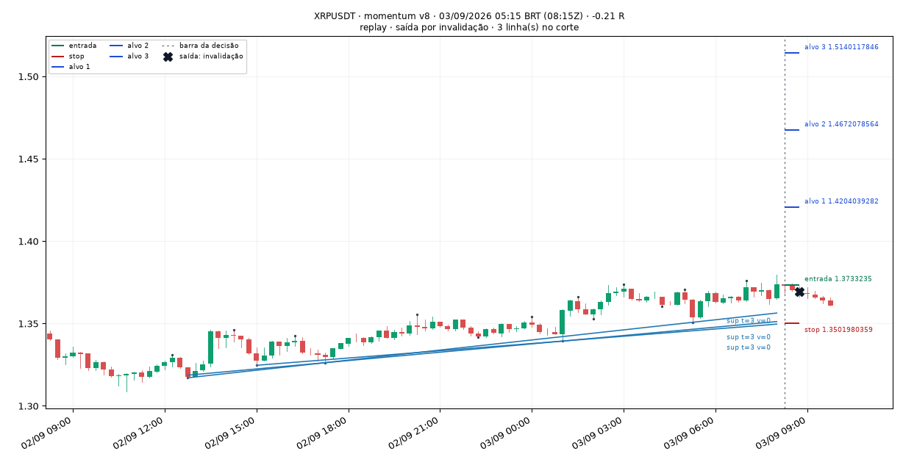

> Momentum 15m: fechamento 1.3736 acima da máxima dos 20 fechamentos anteriores (1.3721), retorno 15m 0.63%, volume relativo 2.18x da mediana de 96 barras, ATR% 0.57%

### 149 — ETHUSDT · 03/09/2026 09:45 BRT · +1.70 R

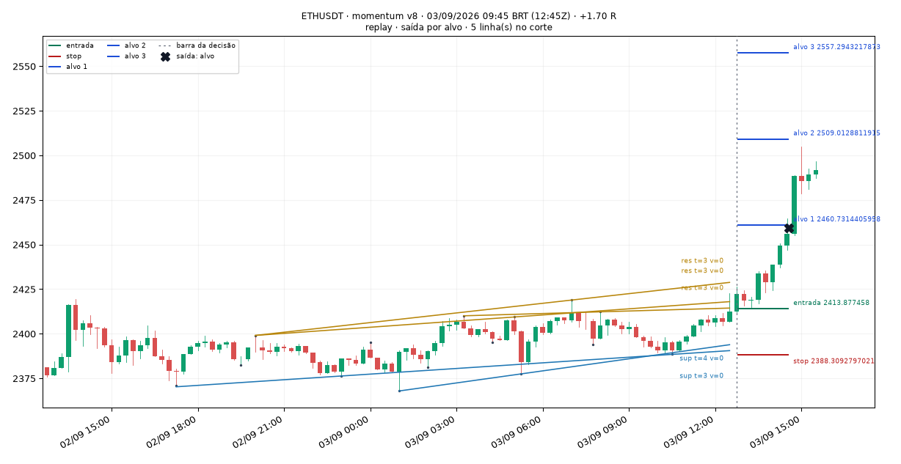

> Momentum 15m: fechamento 2412.45 acima da máxima dos 20 fechamentos anteriores (2408.74), retorno 15m 0.23%, volume relativo 4.31x da mediana de 96 barras, ATR% 0.33%

### 150 — XRPUSDT · 03/09/2026 09:45 BRT · +1.70 R

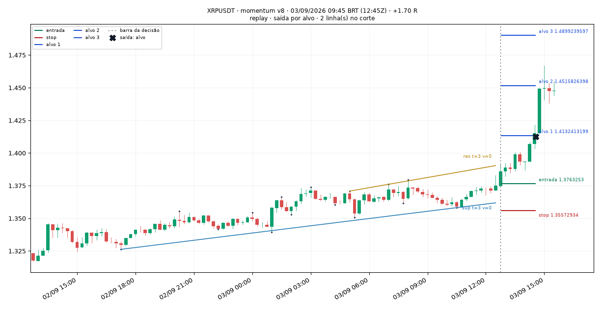

> Momentum 15m: fechamento 1.3749 acima da máxima dos 20 fechamentos anteriores (1.3736), retorno 15m 0.26%, volume relativo 3.56x da mediana de 96 barras, ATR% 0.46%

### 151 — SOLUSDT · 03/09/2026 09:45 BRT · +1.76 R

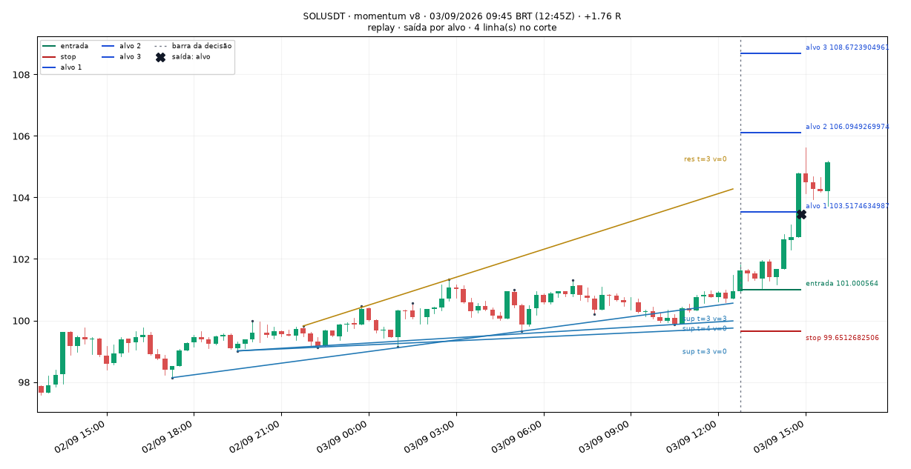

> Momentum 15m: fechamento 100.94 acima da máxima dos 20 fechamentos anteriores (100.91), retorno 15m 0.24%, volume relativo 2.96x da mediana de 96 barras, ATR% 0.43%

### 152 — DOGEUSDT · 03/09/2026 10:00 BRT · +2.47 R

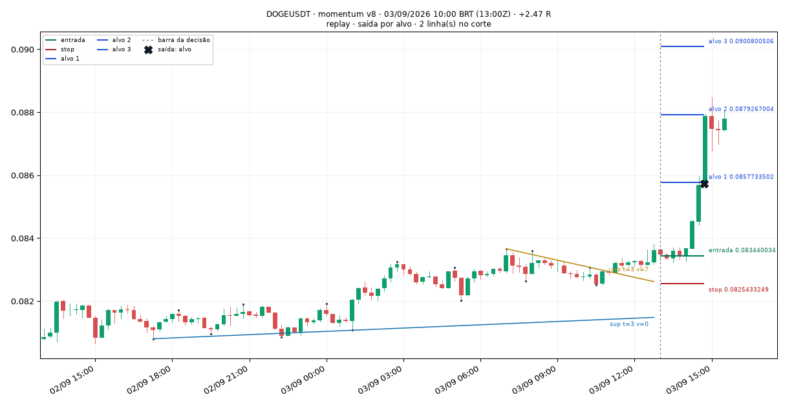

> Momentum 15m: fechamento 0.08362 acima da máxima dos 20 fechamentos anteriores (0.08329), retorno 15m 0.48%, volume relativo 2.32x da mediana de 96 barras, ATR% 0.43%

### 153 — ETHUSDT · 03/09/2026 12:30 BRT · -0.16 R

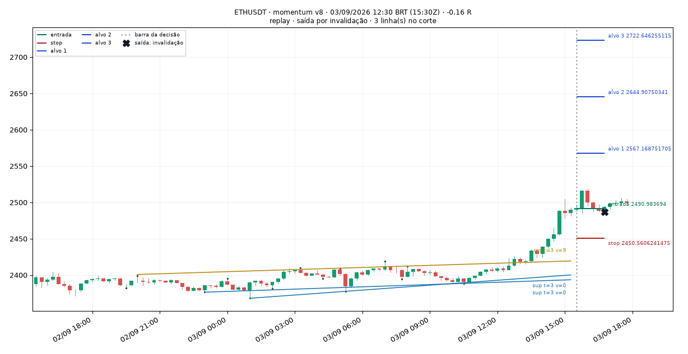

> Momentum 15m: fechamento 2489.43 acima da máxima dos 20 fechamentos anteriores (2488.32), retorno 15m 0.16%, volume relativo 2.63x da mediana de 96 barras, ATR% 0.52%

### 154 — XRPUSDT · 03/09/2026 13:00 BRT · -0.01 R

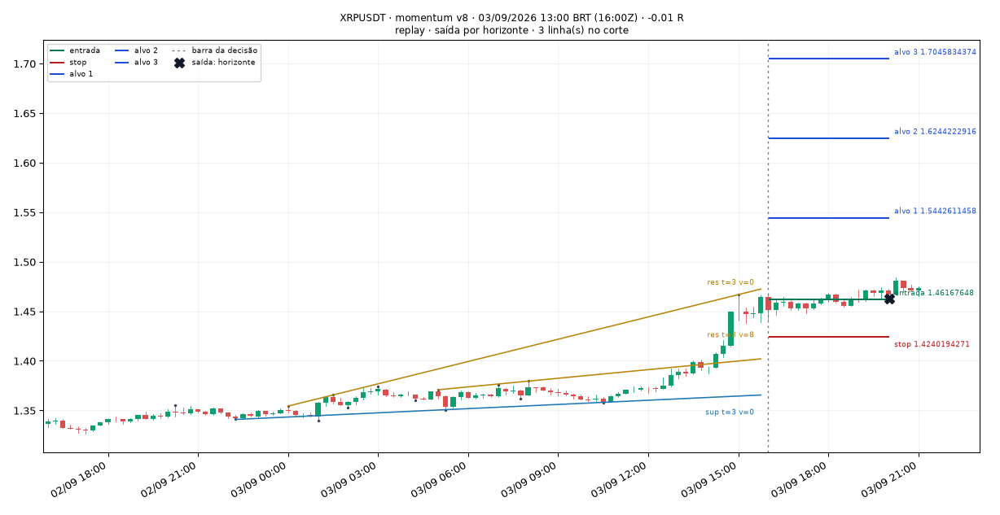

> Momentum 15m: fechamento 1.4641 acima da máxima dos 20 fechamentos anteriores (1.4497), retorno 15m 1.12%, volume relativo 4.95x da mediana de 96 barras, ATR% 0.91%

### 155 — SOLUSDT · 03/09/2026 13:00 BRT · -0.41 R

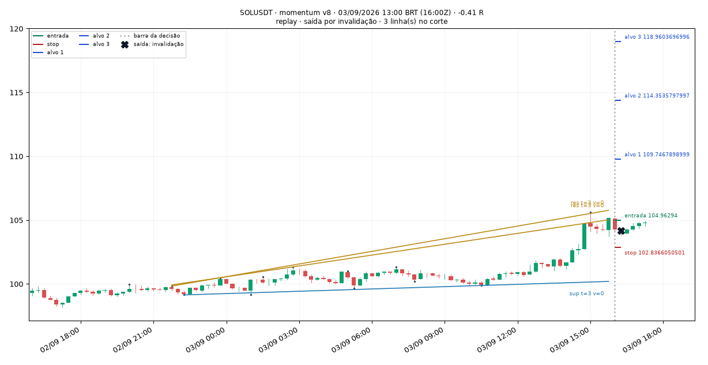

> Momentum 15m: fechamento 105.14 acima da máxima dos 20 fechamentos anteriores (104.77), retorno 15m 0.89%, volume relativo 4.00x da mediana de 96 barras, ATR% 0.73%

### 156 — DOGEUSDT · 03/09/2026 13:00 BRT · -0.19 R

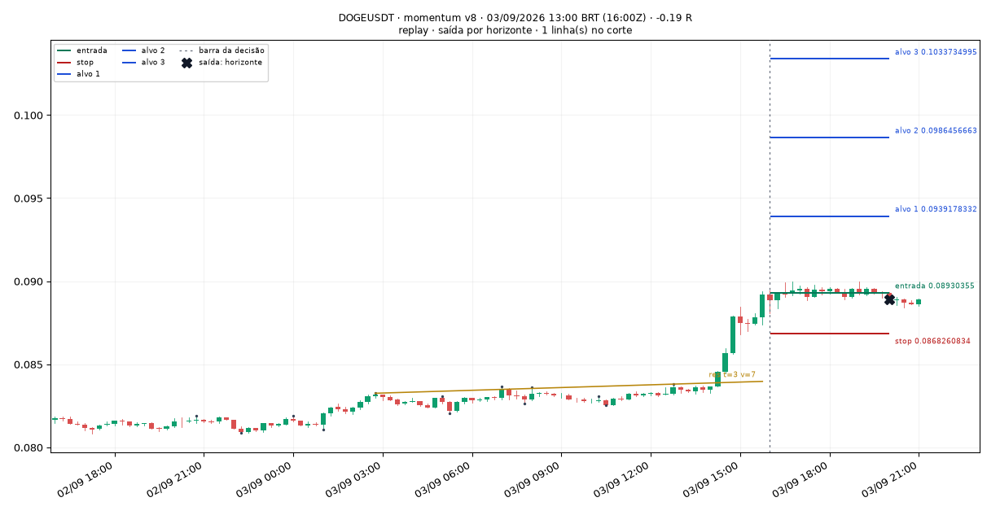

> Momentum 15m: fechamento 0.08919 acima da máxima dos 20 fechamentos anteriores (0.08788), retorno 15m 1.58%, volume relativo 5.97x da mediana de 96 barras, ATR% 0.88%

### 157 — XRPUSDT · 03/09/2026 17:30 BRT · -0.33 R

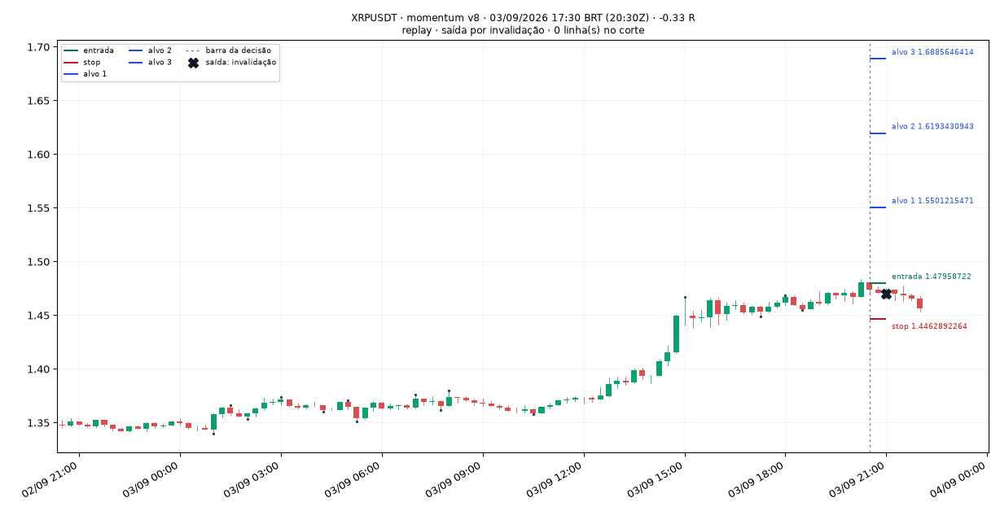

> Momentum 15m: fechamento 1.4809 acima da máxima dos 20 fechamentos anteriores (1.4709), retorno 15m 0.93%, volume relativo 1.84x da mediana de 96 barras, ATR% 0.78%

### 158 — ETHUSDT · 04/09/2026 00:15 BRT · -0.30 R

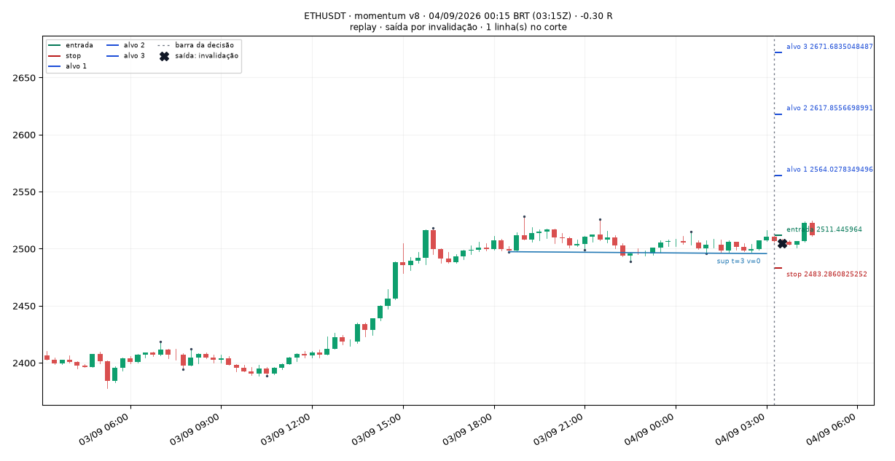

> Momentum 15m: fechamento 2510.2 acima da máxima dos 20 fechamentos anteriores (2506.99), retorno 15m 0.13%, volume relativo 2.22x da mediana de 96 barras, ATR% 0.36%

### 159 — ETHUSDT · 04/09/2026 01:30 BRT · -0.67 R

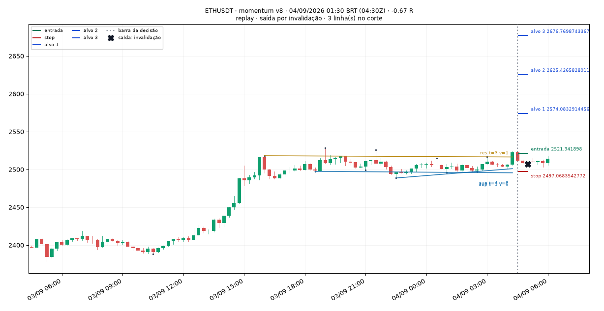

> Momentum 15m: fechamento 2522.74 acima da máxima dos 20 fechamentos anteriores (2510.2), retorno 15m 0.65%, volume relativo 3.12x da mediana de 96 barras, ATR% 0.34%

### 160 — SOLUSDT · 04/09/2026 06:00 BRT · -0.29 R

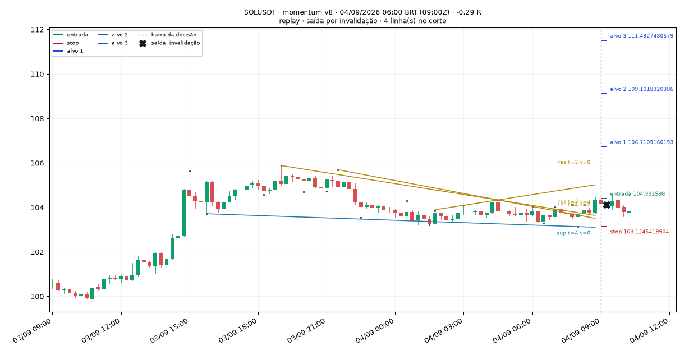

> Momentum 15m: fechamento 104.32 acima da máxima dos 20 fechamentos anteriores (104.24), retorno 15m 0.55%, volume relativo 2.53x da mediana de 96 barras, ATR% 0.38%

### 161 — DOGEUSDT · 04/09/2026 06:00 BRT · -0.25 R

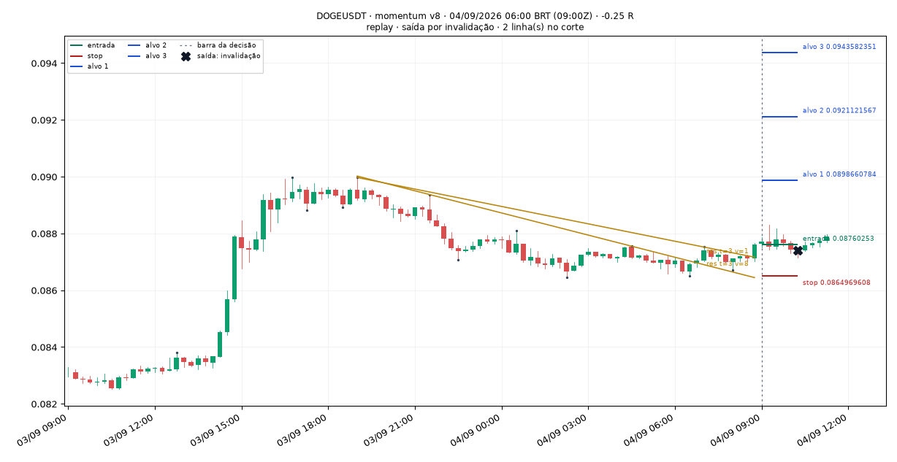

> Momentum 15m: fechamento 0.08762 acima da máxima dos 20 fechamentos anteriores (0.08751), retorno 15m 0.57%, volume relativo 1.95x da mediana de 96 barras, ATR% 0.43%

### 162 — ETHUSDT · 04/09/2026 06:00 BRT · -0.34 R

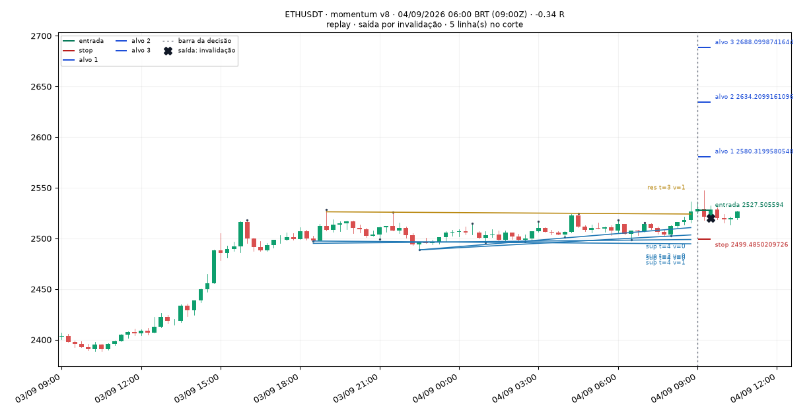

> Momentum 15m: fechamento 2526.43 acima da máxima dos 20 fechamentos anteriores (2522.74), retorno 15m 0.33%, volume relativo 5.32x da mediana de 96 barras, ATR% 0.36%

### 163 — DOGEUSDT · 05/09/2026 03:45 BRT · +0.35 R

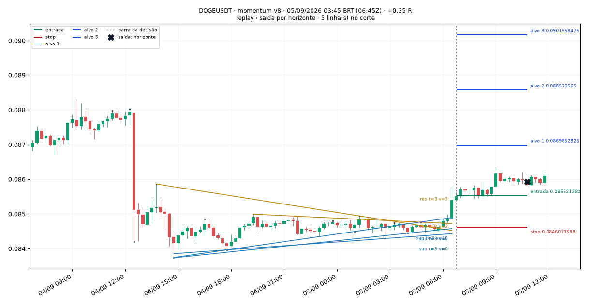

> Momentum 15m: fechamento 0.0854 acima da máxima dos 20 fechamentos anteriores (0.08486), retorno 15m 0.64%, volume relativo 4.73x da mediana de 96 barras, ATR% 0.31%

### 164 — DOGEUSDT · 05/09/2026 09:45 BRT · +0.03 R

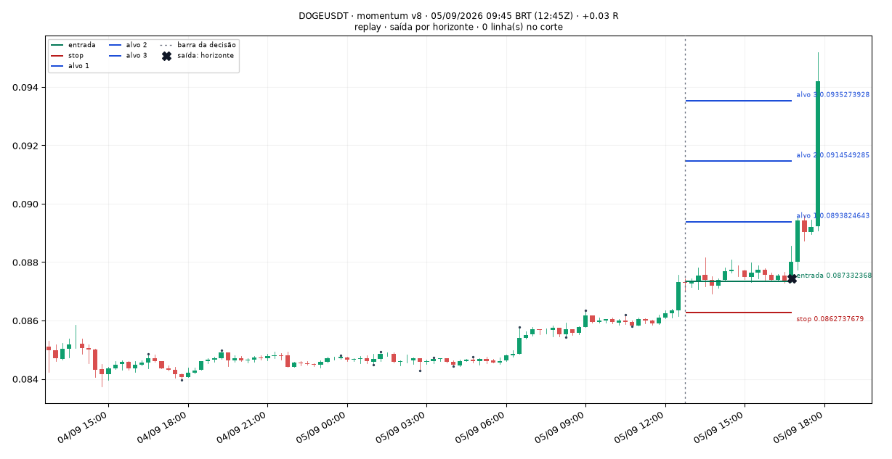

> Momentum 15m: fechamento 0.08731 acima da máxima dos 20 fechamentos anteriores (0.08634), retorno 15m 1.12%, volume relativo 6.93x da mediana de 96 barras, ATR% 0.40%

### 165 — XRPUSDT · 05/09/2026 11:45 BRT · -0.41 R

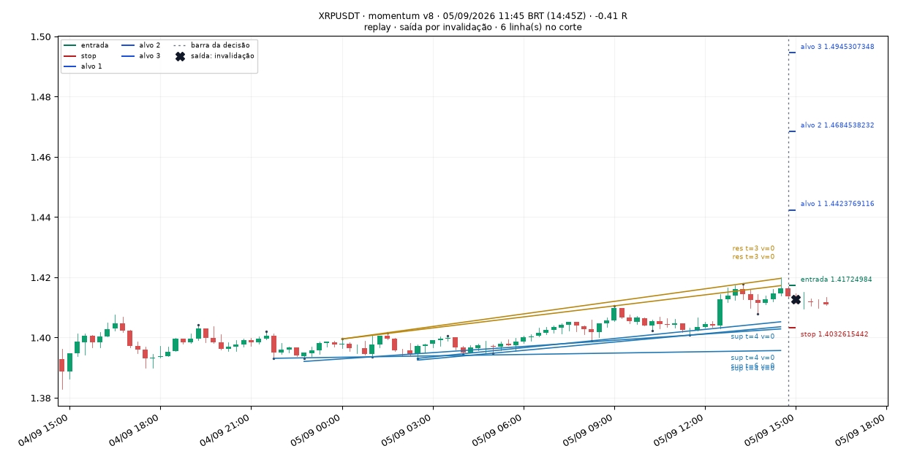

> Momentum 15m: fechamento 1.4163 acima da máxima dos 20 fechamentos anteriores (1.4161), retorno 15m 0.12%, volume relativo 2.09x da mediana de 96 barras, ATR% 0.31%

### 166 — XRPUSDT · 05/09/2026 14:15 BRT · -0.51 R

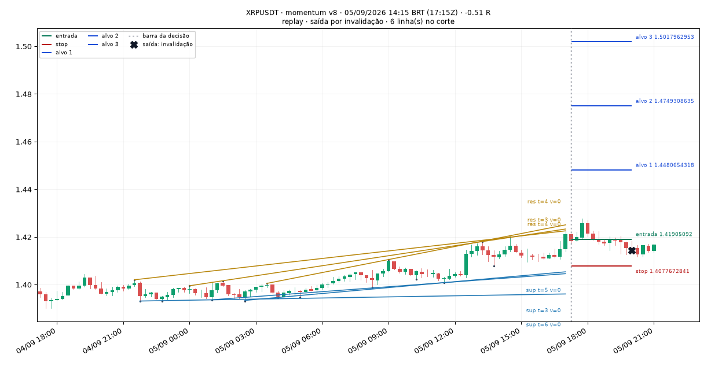

> Momentum 15m: fechamento 1.4212 acima da máxima dos 20 fechamentos anteriores (1.4163), retorno 15m 0.45%, volume relativo 2.84x da mediana de 96 barras, ATR% 0.32%

### 167 — SOLUSDT · 05/09/2026 14:15 BRT · -0.97 R

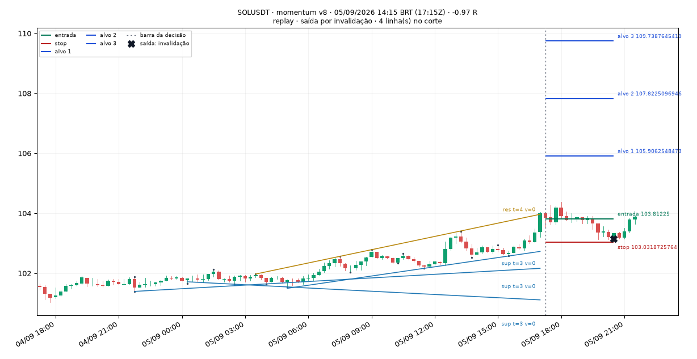

> Momentum 15m: fechamento 103.99 acima da máxima dos 20 fechamentos anteriores (103.36), retorno 15m 0.61%, volume relativo 5.84x da mediana de 96 barras, ATR% 0.31%

### 168 — DOGEUSDT · 05/09/2026 15:00 BRT · -1.06 R

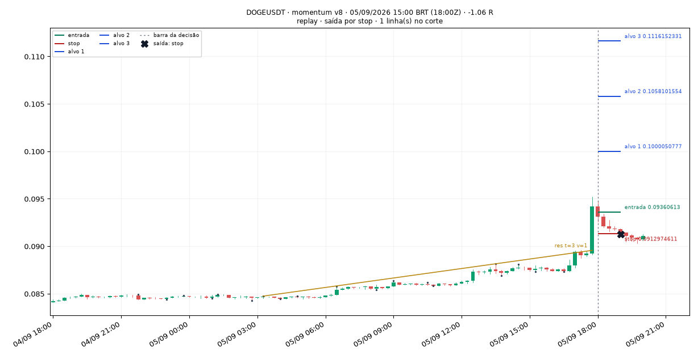

> Momentum 15m: fechamento 0.0942 acima da máxima dos 20 fechamentos anteriores (0.08943), retorno 15m 5.59%, volume relativo 24.00x da mediana de 96 barras, ATR% 1.03%

### 169 — SOLUSDT · 05/09/2026 23:00 BRT · +1.43 R

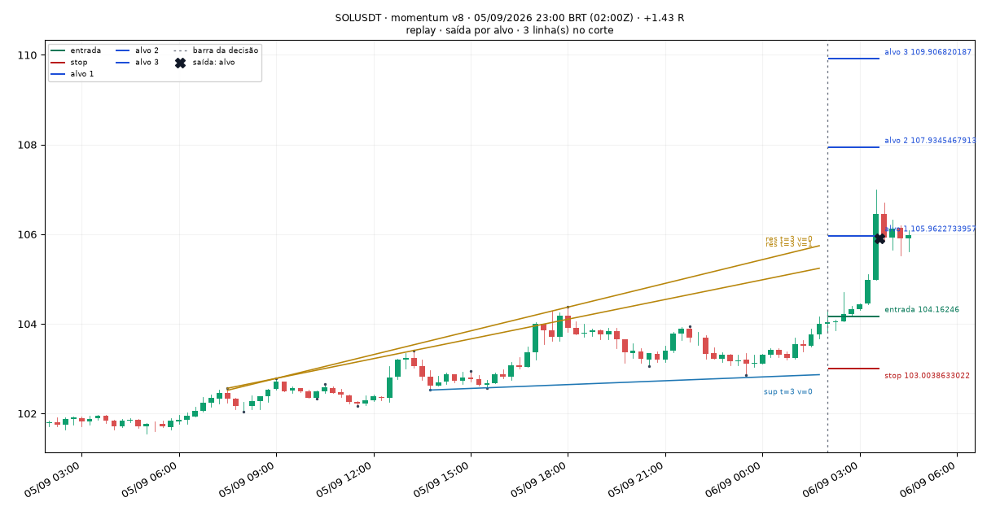

> Momentum 15m: fechamento 103.99 acima da máxima dos 20 fechamentos anteriores (103.88), retorno 15m 0.22%, volume relativo 2.71x da mediana de 96 barras, ATR% 0.32%

### 170 — XRPUSDT · 06/09/2026 00:45 BRT · -0.83 R

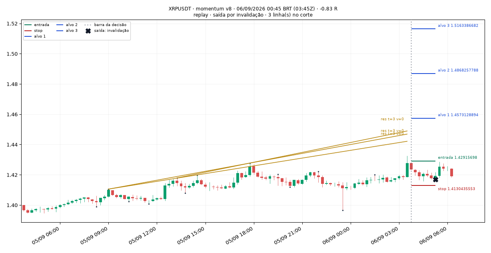

> Momentum 15m: fechamento 1.4278 acima da máxima dos 20 fechamentos anteriores (1.419), retorno 15m 0.66%, volume relativo 3.18x da mediana de 96 barras, ATR% 0.34%

### 171 — DOGEUSDT · 06/09/2026 00:45 BRT · -0.77 R

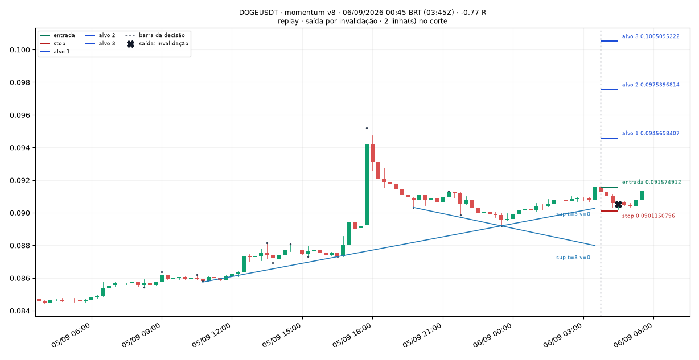

> Momentum 15m: fechamento 0.0916 acima da máxima dos 20 fechamentos anteriores (0.0909), retorno 15m 0.90%, volume relativo 3.45x da mediana de 96 barras, ATR% 0.54%

### 172 — SOLUSDT · 06/09/2026 06:30 BRT · -0.57 R

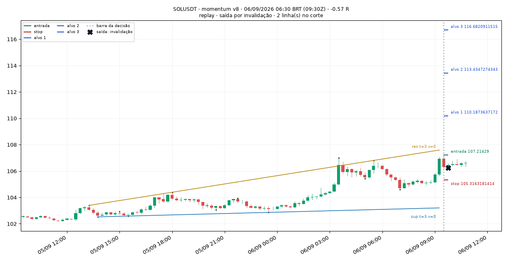

> Momentum 15m: fechamento 106.94 acima da máxima dos 20 fechamentos anteriores (106.4), retorno 15m 1.14%, volume relativo 6.17x da mediana de 96 barras, ATR% 0.51%

### 173 — SOLUSDT · 06/09/2026 09:45 BRT · -0.28 R

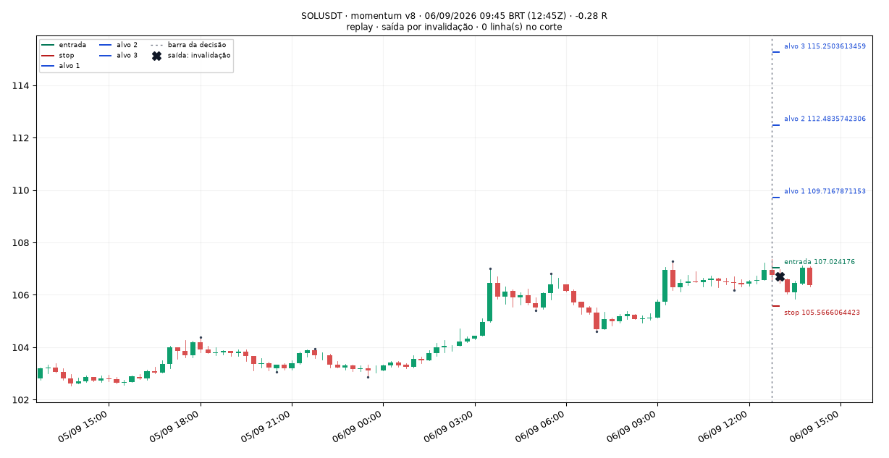

> Momentum 15m: fechamento 106.95 acima da máxima dos 20 fechamentos anteriores (106.94), retorno 15m 0.37%, volume relativo 2.38x da mediana de 96 barras, ATR% 0.43%

### 174 — SOLUSDT · 06/09/2026 11:00 BRT · -0.50 R

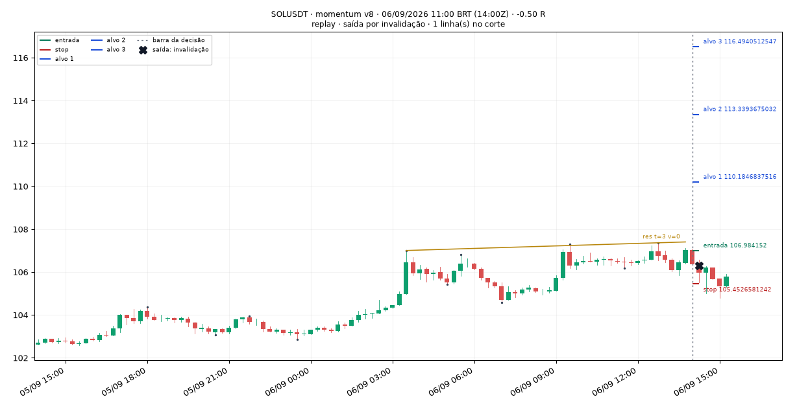

> Momentum 15m: fechamento 107.03 acima da máxima dos 20 fechamentos anteriores (106.95), retorno 15m 0.55%, volume relativo 1.86x da mediana de 96 barras, ATR% 0.49%

### 175 — DOGEUSDT · 06/09/2026 17:30 BRT · +0.85 R

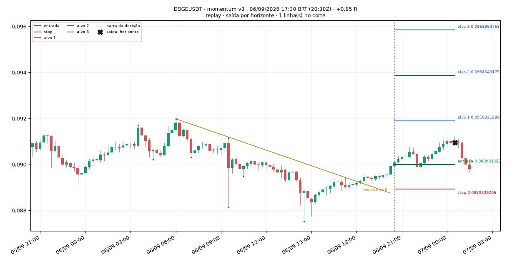

> Momentum 15m: fechamento 0.08992 acima da máxima dos 20 fechamentos anteriores (0.08956), retorno 15m 0.40%, volume relativo 1.65x da mediana de 96 barras, ATR% 0.37%

### 176 — SOLUSDT · 06/09/2026 23:45 BRT · -0.66 R

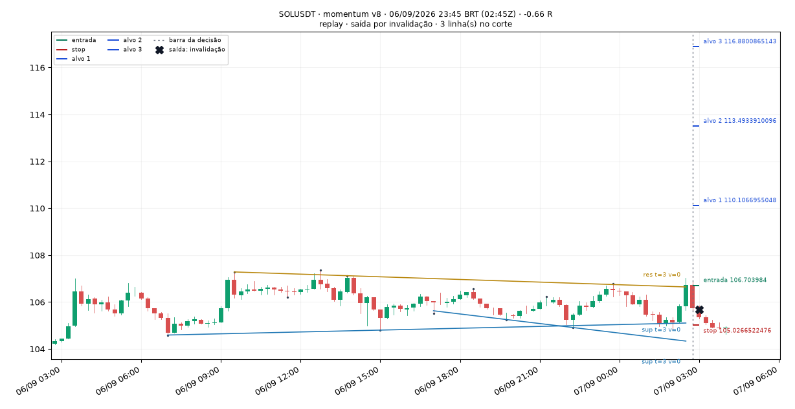

> Momentum 15m: fechamento 106.72 acima da máxima dos 20 fechamentos anteriores (106.57), retorno 15m 0.85%, volume relativo 2.70x da mediana de 96 barras, ATR% 0.53%

### 177 — ETHUSDT · 06/09/2026 23:45 BRT · -0.65 R

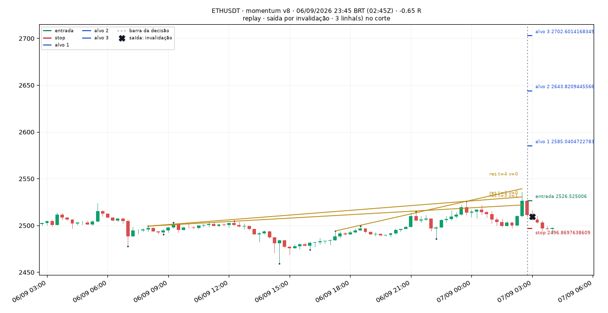

> Momentum 15m: fechamento 2526.26 acima da máxima dos 20 fechamentos anteriores (2519.27), retorno 15m 0.65%, volume relativo 7.09x da mediana de 96 barras, ATR% 0.39%

### 178 — DOGEUSDT · 07/09/2026 09:30 BRT · -0.75 R

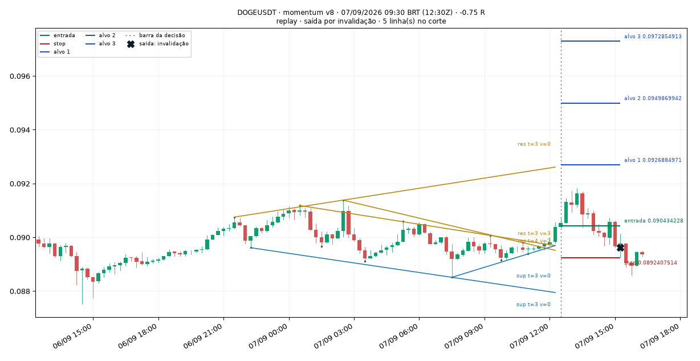

> Momentum 15m: fechamento 0.09039 acima da máxima dos 20 fechamentos anteriores (0.08982), retorno 15m 0.65%, volume relativo 1.59x da mediana de 96 barras, ATR% 0.42%

### 179 — XRPUSDT · 07/09/2026 10:00 BRT · -0.72 R

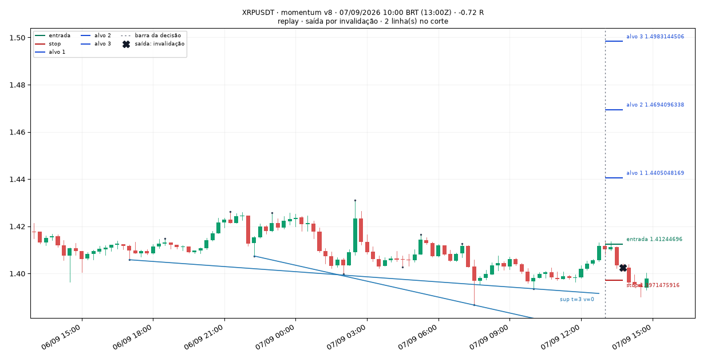

> Momentum 15m: fechamento 1.4116 acima da máxima dos 20 fechamentos anteriores (1.4062), retorno 15m 0.43%, volume relativo 2.25x da mediana de 96 barras, ATR% 0.34%

### 180 — SOLUSDT · 07/09/2026 10:00 BRT · -0.74 R

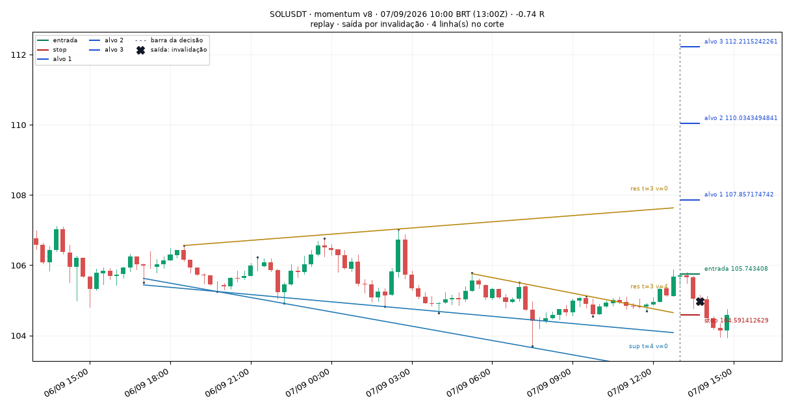

> Momentum 15m: fechamento 105.68 acima da máxima dos 20 fechamentos anteriores (105.33), retorno 15m 0.51%, volume relativo 1.96x da mediana de 96 barras, ATR% 0.34%

### 181 — DOGEUSDT · 07/09/2026 20:15 BRT · -0.35 R

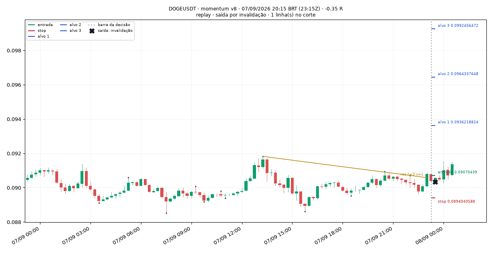

> Momentum 15m: fechamento 0.09081 acima da máxima dos 20 fechamentos anteriores (0.09071), retorno 15m 0.82%, volume relativo 1.57x da mediana de 96 barras, ATR% 0.52%

### 182 — ZROUSDT · 08/09/2026 19:30 BRT · -0.30 R

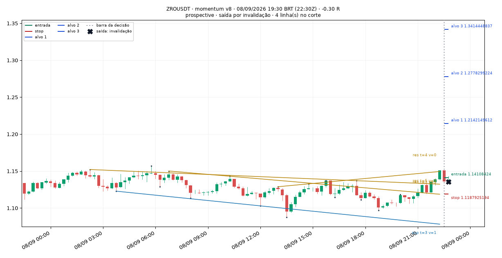

> Momentum 15m: fechamento 1.1506 acima da máxima dos 20 fechamentos anteriores (1.1389), retorno 15m 1.03%, volume relativo 1.89x da mediana de 96 barras, ATR% 0.92%

### 183 — FFUSDT · 08/09/2026 19:45 BRT · -0.23 R

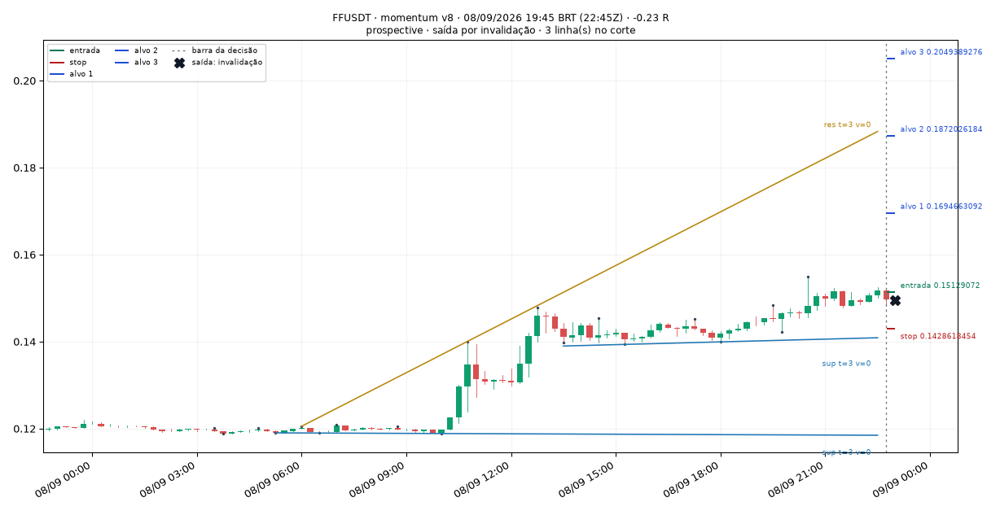

> Momentum 15m: fechamento 0.15173 acima da máxima dos 20 fechamentos anteriores (0.15151), retorno 15m 0.76%, volume relativo 1.68x da mediana de 96 barras, ATR% 1.95%

### 184 — ATOMUSDT · 08/09/2026 19:45 BRT · -0.23 R

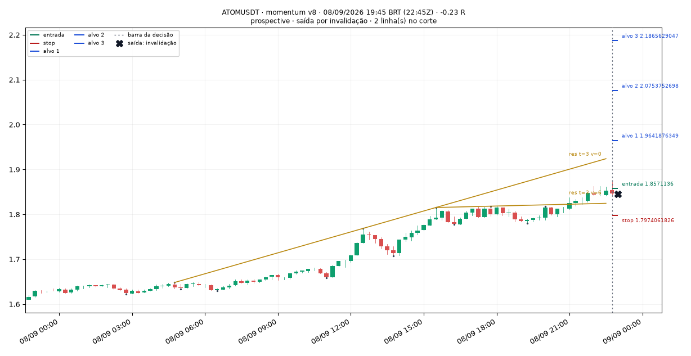

> Momentum 15m: fechamento 1.853 acima da máxima dos 20 fechamentos anteriores (1.847), retorno 15m 0.49%, volume relativo 2.55x da mediana de 96 barras, ATR% 1.00%
