# session_orb v1 — operações traçadas

**20 operação(ões) concluída(s)**, coorte(s) replay, expectância **-0.1928 R** por operação (média simples de `signal_outcomes.r_multiple`, líquida de custos e funding). Corte da leitura: 08/09/2026 20:15 BRT (23:15Z).

As linhas de tendência destes gráficos são traçadas pelo **mesmo código congelado**
que decide (`hunter_core.strategies.tl_scan`, parâmetros de
`trendline_breakout_v1.default_parameters`), cortado na barra da decisão: nenhuma
vela posterior à decisão participa do traçado. Para toda versão que **não é**
`trendline_breakout_v1`, elas são **contexto calculado depois** — a estratégia não
leu linha nenhuma para decidir. Ver [[Operacoes-tracadas/README]] e [[KB-0076-por-que-perdemos-2026-09-08]].

> [!info] Esta versão **não lê** linhas de tendência para decidir. As linhas abaixo são contexto, nunca entrada da decisão.

**Contrato da hipótese:** [[EXP-0010-session-orb-faixa-de-abertura]].

## Tabela

| # | Decisão (BRT) | UTC | Mercado | Coorte | Entrada | Stop | Alvo | Saída | R | Linhas no corte | `line_id` usado | Gráfico |
|---|---|---|---|---|---|---|---|---|---|---|---|---|
| 001 | 19/08 23:15 | 02:15Z | DOGEUSDT | replay | 0.0758654920 | 0.0749100000 | 0.0776700000 | stop | -1.11 | 2 | `—` | [20260820-0215Z-DOGEUSDT-stop.png](../../attachments/operacoes/session_orb-v1/20260820-0215Z-DOGEUSDT-stop.png) |
| 002 | 20/08 11:15 | 14:15Z | DOGEUSDT | replay | 0.0778967100 | 0.0768200000 | 0.0803600000 | alvo | +2.18 | 2 | `—` | [20260820-1415Z-DOGEUSDT-target.png](../../attachments/operacoes/session_orb-v1/20260820-1415Z-DOGEUSDT-target.png) |
| 003 | 20/08 22:30 | 01:30Z | XRPUSDT | replay | 1.2876721400 | 1.2585000000 | 1.3497000000 | horizonte | +0.63 | 0 | `—` | [20260821-0130Z-XRPUSDT-expired.png](../../attachments/operacoes/session_orb-v1/20260821-0130Z-XRPUSDT-expired.png) |
| 004 | 20/08 22:45 | 01:45Z | ETHUSDT | replay | 2359.1446380000 | 2323.8300000000 | 2422.8000000000 | horizonte | -0.27 | 3 | `—` | [20260821-0145Z-ETHUSDT-expired.png](../../attachments/operacoes/session_orb-v1/20260821-0145Z-ETHUSDT-expired.png) |
| 005 | 21/08 00:15 | 03:15Z | SOLUSDT | replay | 89.0433940000 | 87.5500000000 | 92.2300000000 | horizonte | +1.10 | 3 | `—` | [20260821-0315Z-SOLUSDT-expired.png](../../attachments/operacoes/session_orb-v1/20260821-0315Z-SOLUSDT-expired.png) |
| 006 | 21/08 05:30 | 08:30Z | SOLUSDT | replay | 91.4648460000 | 89.9200000000 | 94.2700000000 | stop | -1.08 | 5 | `—` | [20260821-0830Z-SOLUSDT-stop.png](../../attachments/operacoes/session_orb-v1/20260821-0830Z-SOLUSDT-stop.png) |
| 007 | 21/08 06:45 | 09:45Z | ETHUSDT | replay | 2412.6267080000 | 2368.0000000000 | 2486.7100000000 | stop | -1.07 | 3 | `—` | [20260821-0945Z-ETHUSDT-stop.png](../../attachments/operacoes/session_orb-v1/20260821-0945Z-ETHUSDT-stop.png) |
| 008 | 22/08 14:30 | 17:30Z | DOGEUSDT | replay | 0.0925054700 | 0.0907700000 | 0.0945800000 | alvo | +1.12 | 0 | `—` | [20260822-1730Z-DOGEUSDT-target.png](../../attachments/operacoes/session_orb-v1/20260822-1730Z-DOGEUSDT-target.png) |
| 009 | 23/08 05:45 | 08:45Z | SOLUSDT | replay | 93.3859980000 | 92.1300000000 | 95.7300000000 | horizonte | +0.91 | 1 | `—` | [20260823-0845Z-SOLUSDT-expired.png](../../attachments/operacoes/session_orb-v1/20260823-0845Z-SOLUSDT-expired.png) |
| 010 | 23/08 11:30 | 14:30Z | XRPUSDT | replay | 1.5296172200 | 1.4930000000 | 1.5926000000 | stop | -1.06 | 3 | `—` | [20260823-1430Z-XRPUSDT-stop.png](../../attachments/operacoes/session_orb-v1/20260823-1430Z-XRPUSDT-stop.png) |
| 011 | 24/08 08:45 | 11:45Z | DOGEUSDT | replay | 0.0925254820 | 0.0913200000 | 0.0954900000 | stop | -1.11 | 2 | `—` | [20260824-1145Z-DOGEUSDT-stop.png](../../attachments/operacoes/session_orb-v1/20260824-1145Z-DOGEUSDT-stop.png) |
| 012 | 27/08 07:30 | 10:30Z | XRPUSDT | replay | 1.4266554800 | 1.4021000000 | 1.4780000000 | horizonte | +1.06 | 2 | `—` | [20260827-1030Z-XRPUSDT-expired.png](../../attachments/operacoes/session_orb-v1/20260827-1030Z-XRPUSDT-expired.png) |
| 013 | 27/08 07:30 | 10:30Z | ETHUSDT | replay | 2510.4053400000 | 2487.4200000000 | 2553.9300000000 | stop | -1.15 | 4 | `—` | [20260827-1030Z-ETHUSDT-stop.png](../../attachments/operacoes/session_orb-v1/20260827-1030Z-ETHUSDT-stop.png) |
| 014 | 27/08 07:30 | 10:30Z | DOGEUSDT | replay | 0.0881128360 | 0.0868000000 | 0.0907300000 | horizonte | +0.17 | 3 | `—` | [20260827-1030Z-DOGEUSDT-expired.png](../../attachments/operacoes/session_orb-v1/20260827-1030Z-DOGEUSDT-expired.png) |
| 015 | 27/08 22:45 | 01:45Z | XRPUSDT | replay | 1.4556728800 | 1.4413000000 | 1.4830000000 | stop | -1.14 | 6 | `—` | [20260828-0145Z-XRPUSDT-stop.png](../../attachments/operacoes/session_orb-v1/20260828-0145Z-XRPUSDT-stop.png) |
| 016 | 28/08 11:45 | 14:45Z | SOLUSDT | replay | 105.9835520000 | 104.5800000000 | 109.3800000000 | stop | -1.10 | 4 | `—` | [20260828-1445Z-SOLUSDT-stop.png](../../attachments/operacoes/session_orb-v1/20260828-1445Z-SOLUSDT-stop.png) |
| 017 | 28/08 11:45 | 14:45Z | DOGEUSDT | replay | 0.0875825180 | 0.0864600000 | 0.0898500000 | stop | -1.11 | 2 | `—` | [20260828-1445Z-DOGEUSDT-stop.png](../../attachments/operacoes/session_orb-v1/20260828-1445Z-DOGEUSDT-stop.png) |
| 018 | 28/08 12:00 | 15:00Z | XRPUSDT | replay | 1.4335596200 | 1.4141000000 | 1.4630000000 | stop | -1.10 | 3 | `—` | [20260828-1500Z-XRPUSDT-stop.png](../../attachments/operacoes/session_orb-v1/20260828-1500Z-XRPUSDT-stop.png) |
| 019 | 31/08 12:00 | 15:00Z | XRPUSDT | replay | 1.3774259600 | 1.3588000000 | 1.4101000000 | horizonte | +0.36 | 4 | `—` | [20260831-1500Z-XRPUSDT-expired.png](../../attachments/operacoes/session_orb-v1/20260831-1500Z-XRPUSDT-expired.png) |
| 020 | 05/09 22:15 | 01:15Z | DOGEUSDT | replay | 0.0904342280 | 0.0896200000 | 0.0920500000 | horizonte | -0.09 | 2 | `—` | [20260906-0115Z-DOGEUSDT-expired.png](../../attachments/operacoes/session_orb-v1/20260906-0115Z-DOGEUSDT-expired.png) |

## Gráficos

### 001 — DOGEUSDT · 19/08/2026 23:15 BRT · -1.11 R

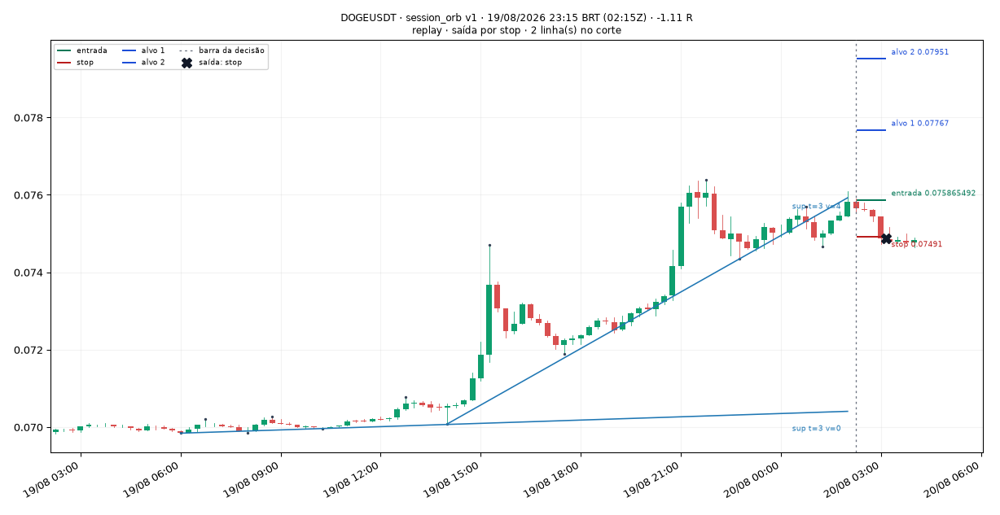

> Session ORB 15m: sessão asia (abertura 00:00Z), fechamento 0.07583 acima da máxima 0.07569 da faixa das 4 primeiras barras, 9 barras após a abertura; stop na mínima da faixa (0.07491), risco 1.73 ATR, volume relativo 2.74x da mediana de 96 barras, ATR% 0.70%

### 002 — DOGEUSDT · 20/08/2026 11:15 BRT · +2.18 R

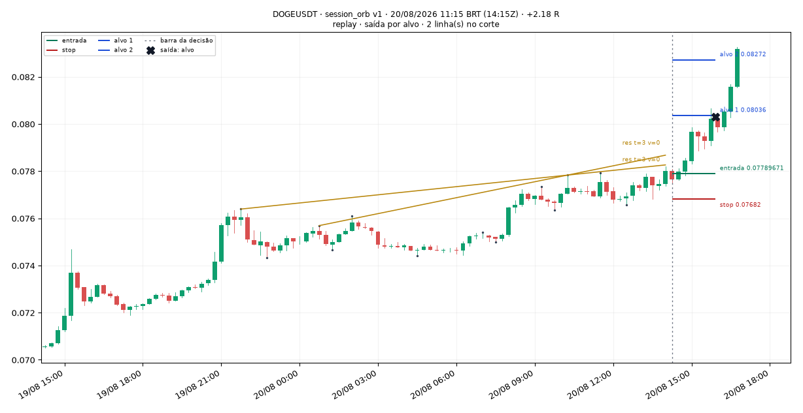

> Session ORB 15m: sessão us (abertura 13:00Z), fechamento 0.078 acima da máxima 0.07789 da faixa das 4 primeiras barras, 5 barras após a abertura; stop na mínima da faixa (0.07682), risco 2.16 ATR, volume relativo 1.98x da mediana de 96 barras, ATR% 0.70%

### 003 — XRPUSDT · 20/08/2026 22:30 BRT · +0.63 R

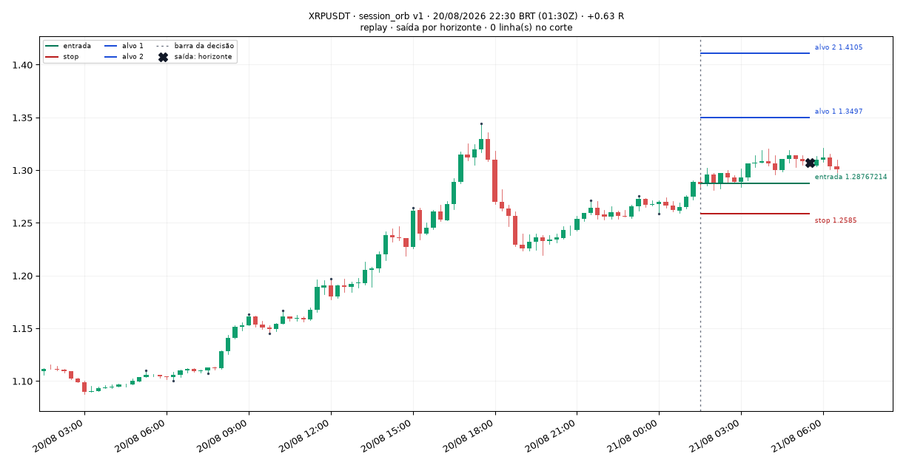

> Session ORB 15m: sessão asia (abertura 00:00Z), fechamento 1.2889 acima da máxima 1.2742 da faixa das 4 primeiras barras, 6 barras após a abertura; stop na mínima da faixa (1.2585), risco 2.34 ATR, volume relativo 1.43x da mediana de 96 barras, ATR% 1.01%

### 004 — ETHUSDT · 20/08/2026 22:45 BRT · -0.27 R

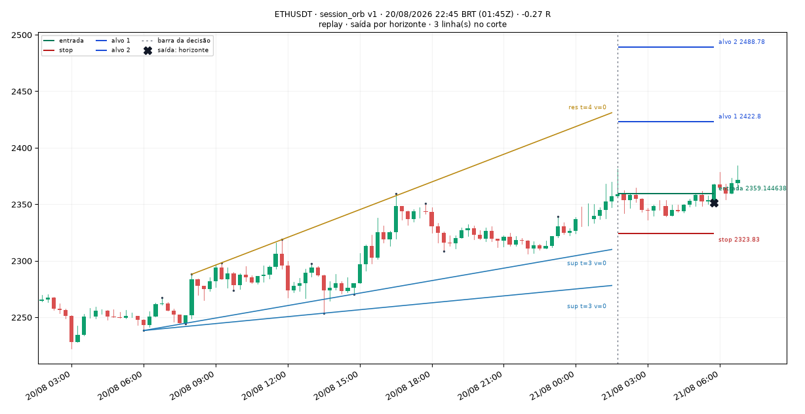

> Session ORB 15m: sessão asia (abertura 00:00Z), fechamento 2356.82 acima da máxima 2351 da faixa das 4 primeiras barras, 7 barras após a abertura; stop na mínima da faixa (2323.83), risco 2.26 ATR, volume relativo 2.29x da mediana de 96 barras, ATR% 0.62%

### 005 — SOLUSDT · 21/08/2026 00:15 BRT · +1.10 R

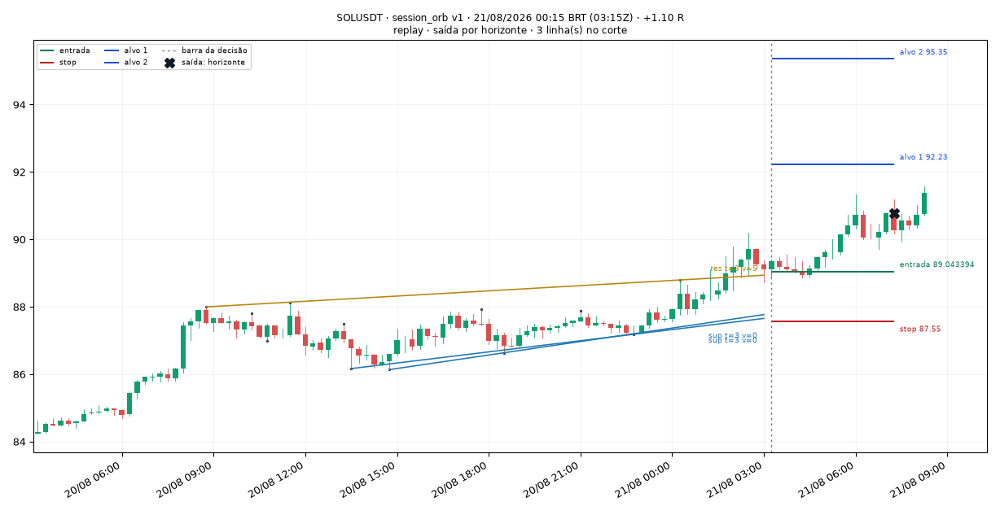

> Session ORB 15m: sessão asia (abertura 00:00Z), fechamento 89.11 acima da máxima 88.79 da faixa das 4 primeiras barras, 13 barras após a abertura; stop na mínima da faixa (87.55), risco 2.48 ATR, volume relativo 1.42x da mediana de 96 barras, ATR% 0.71%

### 006 — SOLUSDT · 21/08/2026 05:30 BRT · -1.08 R

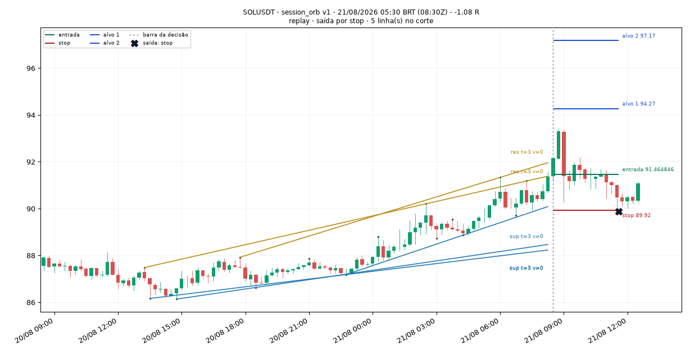

> Session ORB 15m: sessão europe (abertura 07:00Z), fechamento 91.37 acima da máxima 91.19 da faixa das 4 primeiras barras, 6 barras após a abertura; stop na mínima da faixa (89.92), risco 2.22 ATR, volume relativo 2.74x da mediana de 96 barras, ATR% 0.71%

### 007 — ETHUSDT · 21/08/2026 06:45 BRT · -1.07 R

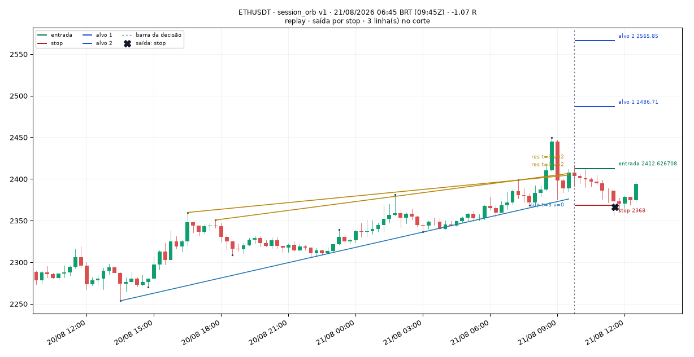

> Session ORB 15m: sessão europe (abertura 07:00Z), fechamento 2407.57 acima da máxima 2398.56 da faixa das 4 primeiras barras, 11 barras após a abertura; stop na mínima da faixa (2368), risco 1.83 ATR, volume relativo 1.36x da mediana de 96 barras, ATR% 0.90%

### 008 — DOGEUSDT · 22/08/2026 14:30 BRT · +1.12 R

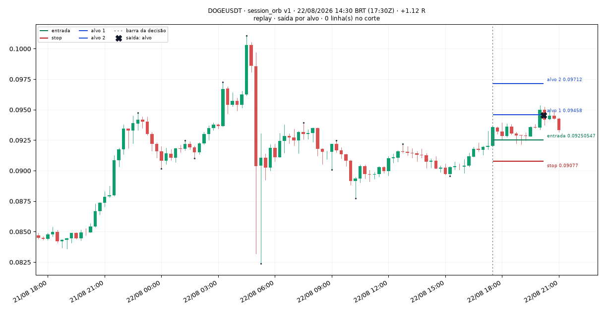

> Session ORB 15m: sessão us (abertura 13:00Z), fechamento 0.09204 acima da máxima 0.09199 da faixa das 4 primeiras barras, 18 barras após a abertura; stop na mínima da faixa (0.09077), risco 1.26 ATR, volume relativo 1.51x da mediana de 96 barras, ATR% 1.09%

### 009 — SOLUSDT · 23/08/2026 05:45 BRT · +0.91 R

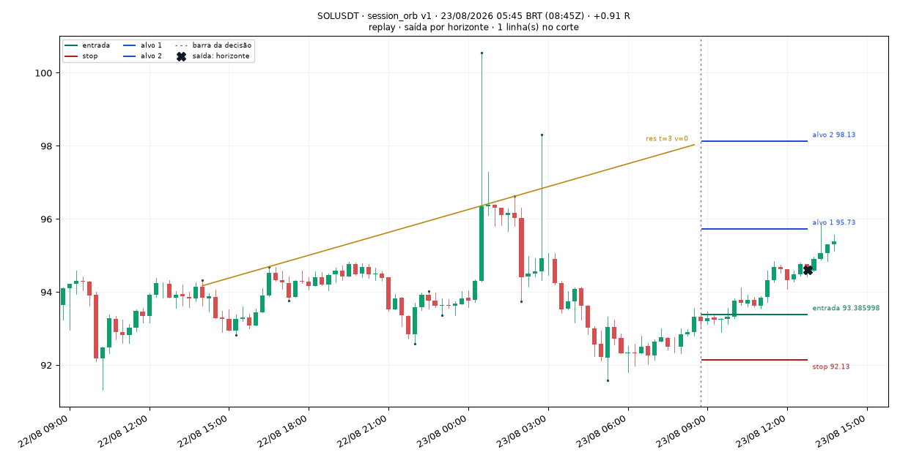

> Session ORB 15m: sessão europe (abertura 07:00Z), fechamento 93.33 acima da máxima 92.99 da faixa das 4 primeiras barras, 7 barras após a abertura; stop na mínima da faixa (92.13), risco 1.67 ATR, volume relativo 1.82x da mediana de 96 barras, ATR% 0.77%

### 010 — XRPUSDT · 23/08/2026 11:30 BRT · -1.06 R

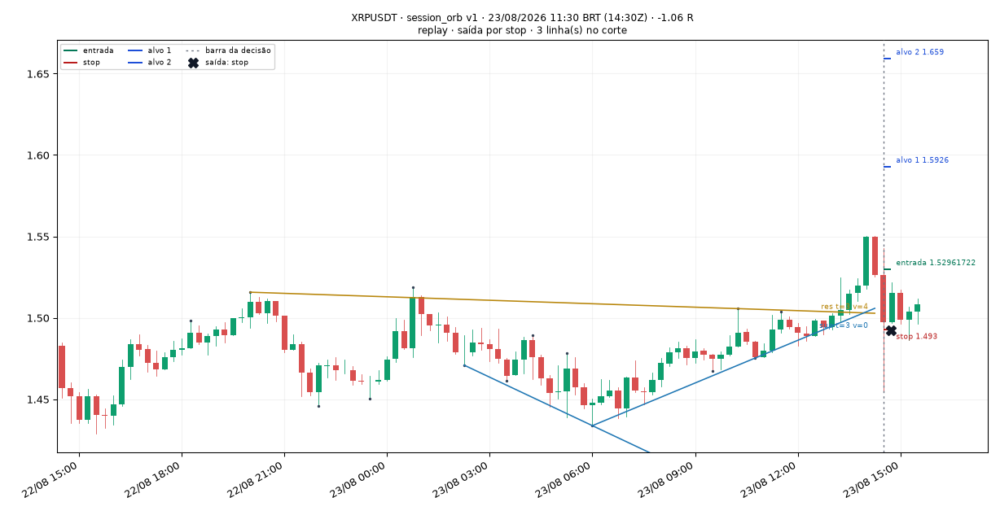

> Session ORB 15m: sessão us (abertura 13:00Z), fechamento 1.5262 acima da máxima 1.5248 da faixa das 4 primeiras barras, 6 barras após a abertura; stop na mínima da faixa (1.493), risco 2.06 ATR, volume relativo 2.22x da mediana de 96 barras, ATR% 1.06%

### 011 — DOGEUSDT · 24/08/2026 08:45 BRT · -1.11 R

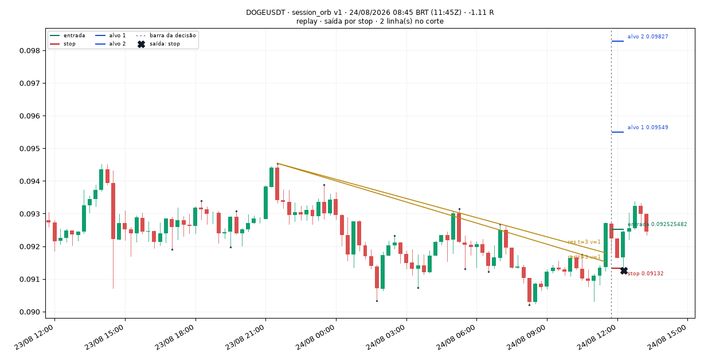

> Session ORB 15m: sessão europe (abertura 07:00Z), fechamento 0.09271 acima da máxima 0.09268 da faixa das 4 primeiras barras, 19 barras após a abertura; stop na mínima da faixa (0.09132), risco 2.04 ATR, volume relativo 2.70x da mediana de 96 barras, ATR% 0.73%

### 012 — XRPUSDT · 27/08/2026 07:30 BRT · +1.06 R

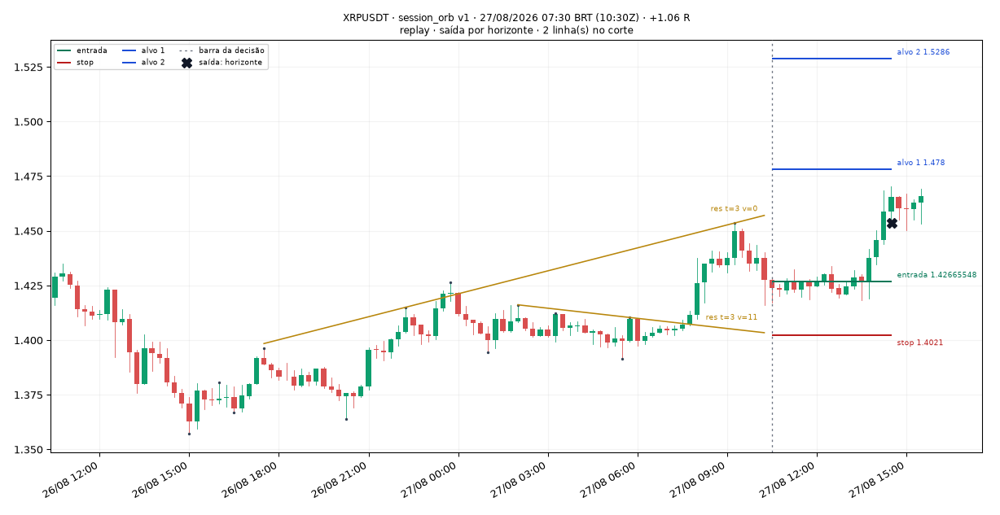

> Session ORB 15m: sessão europe (abertura 07:00Z), fechamento 1.4274 acima da máxima 1.4134 da faixa das 4 primeiras barras, 14 barras após a abertura; stop na mínima da faixa (1.4021), risco 2.24 ATR, volume relativo 2.98x da mediana de 96 barras, ATR% 0.79%

### 013 — ETHUSDT · 27/08/2026 07:30 BRT · -1.15 R

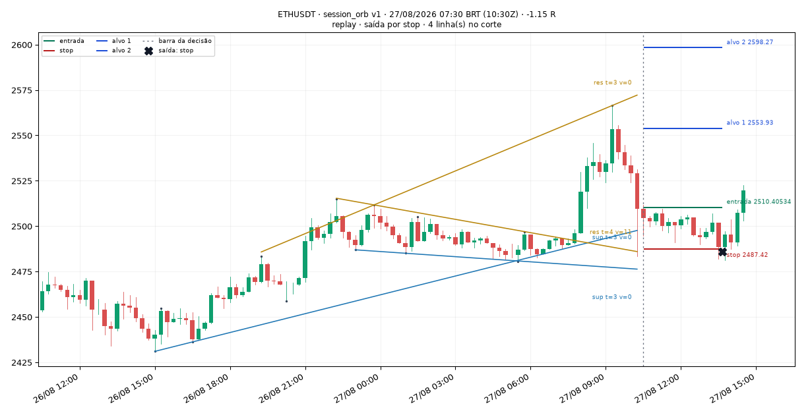

> Session ORB 15m: sessão europe (abertura 07:00Z), fechamento 2509.59 acima da máxima 2498.14 da faixa das 4 primeiras barras, 14 barras após a abertura; stop na mínima da faixa (2487.42), risco 1.39 ATR, volume relativo 9.06x da mediana de 96 barras, ATR% 0.63%

### 014 — DOGEUSDT · 27/08/2026 07:30 BRT · +0.17 R

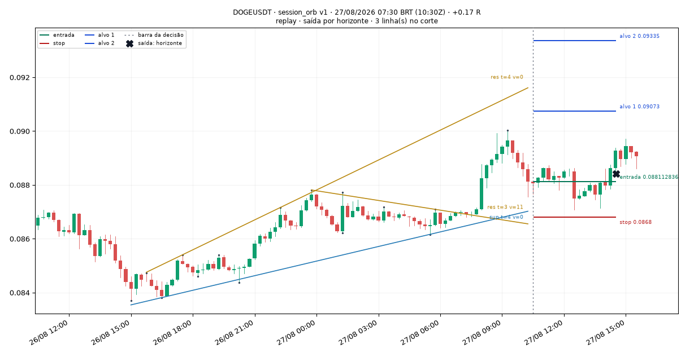

> Session ORB 15m: sessão europe (abertura 07:00Z), fechamento 0.08811 acima da máxima 0.08715 da faixa das 4 primeiras barras, 14 barras após a abertura; stop na mínima da faixa (0.0868), risco 2.04 ATR, volume relativo 4.28x da mediana de 96 barras, ATR% 0.73%

### 015 — XRPUSDT · 27/08/2026 22:45 BRT · -1.14 R

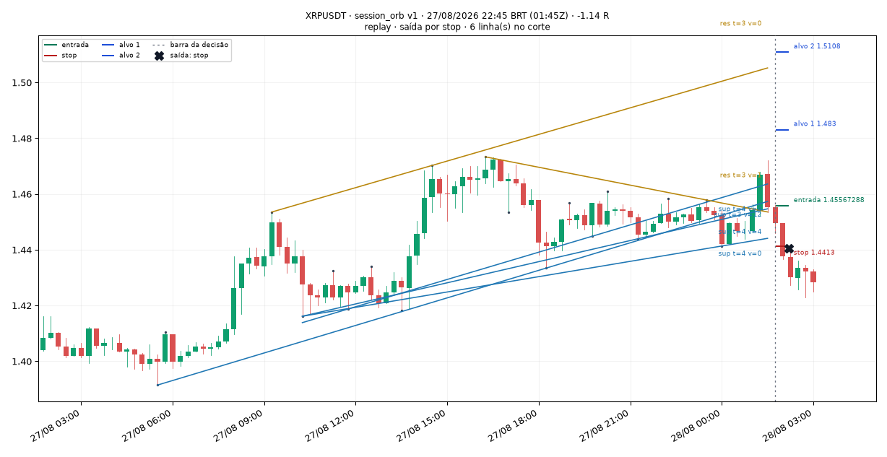

> Session ORB 15m: sessão asia (abertura 00:00Z), fechamento 1.4552 acima da máxima 1.4539 da faixa das 4 primeiras barras, 7 barras após a abertura; stop na mínima da faixa (1.4413), risco 1.54 ATR, volume relativo 2.19x da mediana de 96 barras, ATR% 0.62%

### 016 — SOLUSDT · 28/08/2026 11:45 BRT · -1.10 R

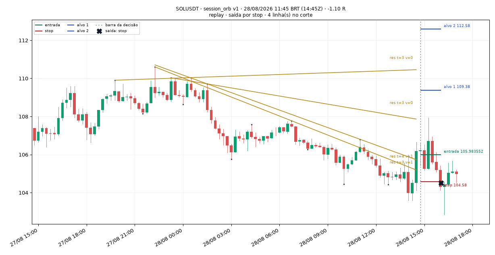

> Session ORB 15m: sessão us (abertura 13:00Z), fechamento 106.18 acima da máxima 105.56 da faixa das 4 primeiras barras, 7 barras após a abertura; stop na mínima da faixa (104.58), risco 1.79 ATR, volume relativo 5.96x da mediana de 96 barras, ATR% 0.84%

### 017 — DOGEUSDT · 28/08/2026 11:45 BRT · -1.11 R

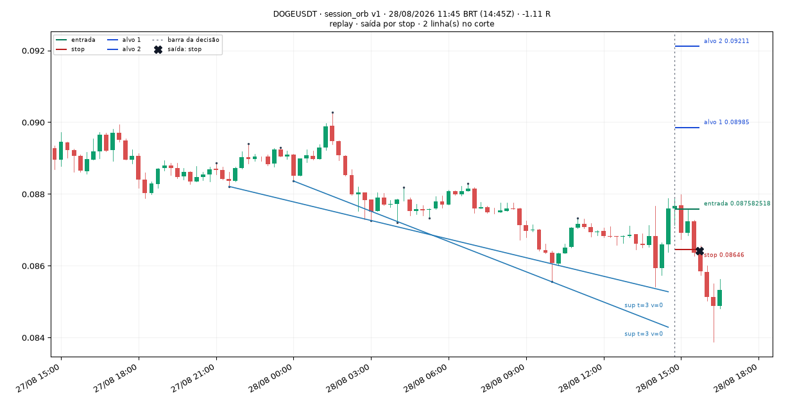

> Session ORB 15m: sessão us (abertura 13:00Z), fechamento 0.08759 acima da máxima 0.08713 da faixa das 4 primeiras barras, 7 barras após a abertura; stop na mínima da faixa (0.08646), risco 1.87 ATR, volume relativo 5.28x da mediana de 96 barras, ATR% 0.69%

### 018 — XRPUSDT · 28/08/2026 12:00 BRT · -1.10 R

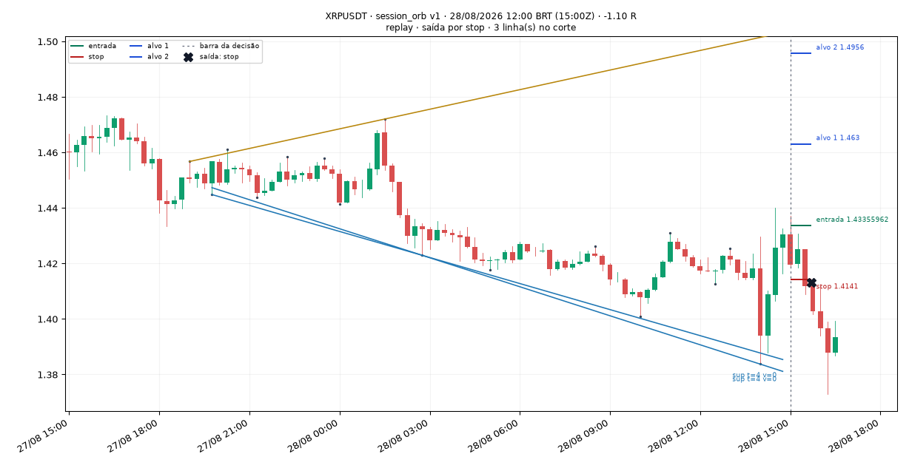

> Session ORB 15m: sessão us (abertura 13:00Z), fechamento 1.4304 acima da máxima 1.4254 da faixa das 4 primeiras barras, 8 barras após a abertura; stop na mínima da faixa (1.4141), risco 1.35 ATR, volume relativo 2.76x da mediana de 96 barras, ATR% 0.84%

### 019 — XRPUSDT · 31/08/2026 12:00 BRT · +0.36 R

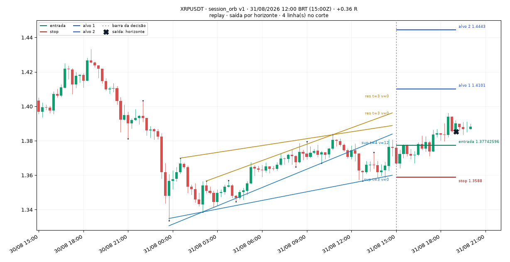

> Session ORB 15m: sessão us (abertura 13:00Z), fechamento 1.3759 acima da máxima 1.3733 da faixa das 4 primeiras barras, 8 barras após a abertura; stop na mínima da faixa (1.3588), risco 2.05 ATR, volume relativo 1.63x da mediana de 96 barras, ATR% 0.61%

### 020 — DOGEUSDT · 05/09/2026 22:15 BRT · -0.09 R

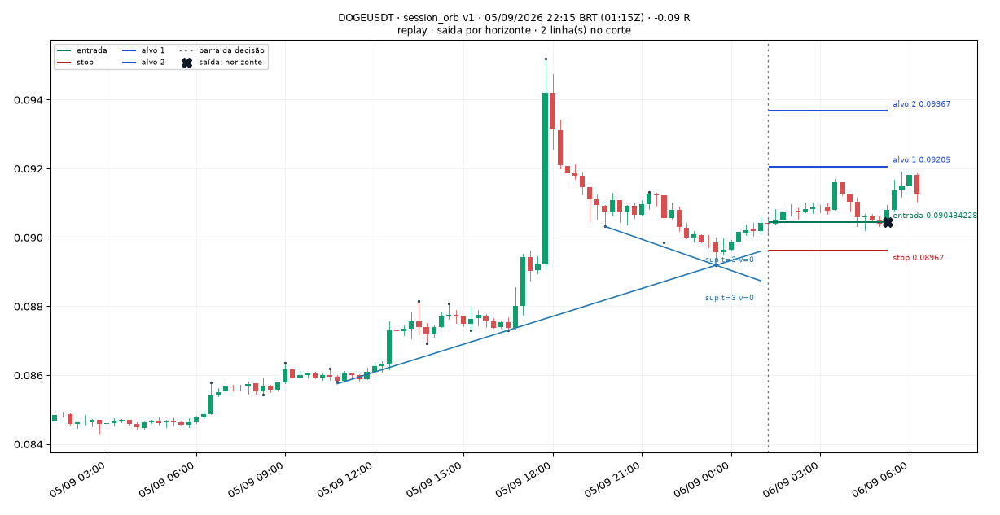

> Session ORB 15m: sessão asia (abertura 00:00Z), fechamento 0.09043 acima da máxima 0.09041 da faixa das 4 primeiras barras, 5 barras após a abertura; stop na mínima da faixa (0.08962), risco 1.39 ATR, volume relativo 1.53x da mediana de 96 barras, ATR% 0.64%
