# trendline_breakout v1 — operações traçadas

**47 operação(ões) concluída(s)**, coorte(s) replay, expectância **-0.0382 R** por operação (média simples de `signal_outcomes.r_multiple`, líquida de custos e funding). Corte da leitura: 08/09/2026 20:15 BRT (23:15Z).

As linhas de tendência destes gráficos são traçadas pelo **mesmo código congelado**
que decide (`hunter_core.strategies.tl_scan`, parâmetros de
`trendline_breakout_v1.default_parameters`), cortado na barra da decisão: nenhuma
vela posterior à decisão participa do traçado. Para toda versão que **não é**
`trendline_breakout_v1`, elas são **contexto calculado depois** — a estratégia não
leu linha nenhuma para decidir. Ver [[Operacoes-tracadas/README]] e [[KB-0076-por-que-perdemos-2026-09-08]].

> [!info] Esta versão **lê** linhas de tendência para decidir.

**Contrato da hipótese:** `EXP-0016-trendline-breakout` — ainda **rascunho** em `.claude/state/exp-drafts/`, por isso sem link de nota.

## Tabela

| # | Decisão (BRT) | UTC | Mercado | Coorte | Entrada | Stop | Alvo | Saída | R | Linhas no corte | `line_id` usado | Gráfico |
|---|---|---|---|---|---|---|---|---|---|---|---|---|
| 001 | 19/08 20:45 | 23:45Z | DOGEUSDT | replay | 0.0751150420 | 0.0739130990 | 0.0776538020 | invalidação | -0.50 | 2 | `03422055d14efe64` | [20260819-2345Z-DOGEUSDT-invalidated.png](../../attachments/operacoes/trendline_breakout-v1/20260819-2345Z-DOGEUSDT-invalidated.png) |
| 002 | 20/08 09:15 | 12:15Z | ETHUSDT | replay | 2274.6039440000 | 2241.7659879006 | 2336.8480241988 | alvo | +1.80 | 1 | `67ccc7512afc5748` | [20260820-1215Z-ETHUSDT-target.png](../../attachments/operacoes/trendline_breakout-v1/20260820-1215Z-ETHUSDT-target.png) |
| 003 | 20/08 16:30 | 19:30Z | ETHUSDT | replay | 2327.0053660000 | 2294.9784261925 | 2390.2931476149 | invalidação | -0.51 | 4 | `da6434cc25758098` | [20260820-1930Z-ETHUSDT-invalidated.png](../../attachments/operacoes/trendline_breakout-v1/20260820-1930Z-ETHUSDT-invalidated.png) |
| 004 | 21/08 04:45 | 07:45Z | SOLUSDT | replay | 90.6343480000 | 89.2581593165 | 93.1636813671 | alvo | +1.74 | 4 | `46322f83b8f431af` | [20260821-0745Z-SOLUSDT-target.png](../../attachments/operacoes/trendline_breakout-v1/20260821-0745Z-SOLUSDT-target.png) |
| 005 | 21/08 06:15 | 09:15Z | ETHUSDT | replay | 2391.2038620000 | 2354.9372376085 | 2484.4855247831 | invalidação | -0.66 | 2 | `1b816b3c78fa5084` | [20260821-0915Z-ETHUSDT-invalidated.png](../../attachments/operacoes/trendline_breakout-v1/20260821-0915Z-ETHUSDT-invalidated.png) |
| 006 | 21/08 06:15 | 09:15Z | SOLUSDT | replay | 91.1646660000 | 89.6192336592 | 94.9315326816 | invalidação | -0.64 | 5 | `2babaab26a49f03d` | [20260821-0915Z-SOLUSDT-invalidated.png](../../attachments/operacoes/trendline_breakout-v1/20260821-0915Z-SOLUSDT-invalidated.png) |
| 007 | 21/08 07:00 | 10:00Z | DOGEUSDT | replay | 0.0844506400 | 0.0825600000 | 0.0883200000 | invalidação | -0.36 | 1 | `ab6e7408f3b30951` | [20260821-1000Z-DOGEUSDT-invalidated.png](../../attachments/operacoes/trendline_breakout-v1/20260821-1000Z-DOGEUSDT-invalidated.png) |
| 008 | 21/08 10:45 | 13:45Z | SOLUSDT | replay | 91.0846180000 | 89.5178670394 | 93.9342659212 | horizonte | +1.24 | 3 | `4289ffae1e75ee79` | [20260821-1345Z-SOLUSDT-expired.png](../../attachments/operacoes/trendline_breakout-v1/20260821-1345Z-SOLUSDT-expired.png) |
| 009 | 21/08 11:30 | 14:30Z | DOGEUSDT | replay | 0.0837702320 | 0.0820725180 | 0.0870749640 | alvo | +1.87 | 2 | `6fdd34b1c910fbc1` | [20260821-1430Z-DOGEUSDT-target.png](../../attachments/operacoes/trendline_breakout-v1/20260821-1430Z-DOGEUSDT-target.png) |
| 010 | 21/08 16:00 | 19:00Z | ETHUSDT | replay | 2416.7491800000 | 2383.0000000000 | 2493.4000000000 | alvo | +2.17 | 2 | `0c9af2ee8373e8e8` | [20260821-1900Z-ETHUSDT-target.png](../../attachments/operacoes/trendline_breakout-v1/20260821-1900Z-ETHUSDT-target.png) |
| 011 | 22/08 20:45 | 23:45Z | XRPUSDT | replay | 1.4626770800 | 1.4301354602 | 1.5224290796 | invalidação | -0.56 | 2 | `269e933ac4672f9f` | [20260822-2345Z-XRPUSDT-invalidated.png](../../attachments/operacoes/trendline_breakout-v1/20260822-2345Z-XRPUSDT-invalidated.png) |
| 012 | 23/08 09:45 | 12:45Z | XRPUSDT | replay | 1.4957969400 | 1.4713218001 | 1.6557032313 | stop | -1.08 | 4 | `3648a9cbdcf6c5da` | [20260823-1245Z-XRPUSDT-stop.png](../../attachments/operacoes/trendline_breakout-v1/20260823-1245Z-XRPUSDT-stop.png) |
| 013 | 23/08 19:15 | 22:15Z | DOGEUSDT | replay | 0.0930558000 | 0.0915143972 | 0.0958512055 | invalidação | -0.55 | 3 | `3f1b739e028183f5` | [20260823-2215Z-DOGEUSDT-invalidated.png](../../attachments/operacoes/trendline_breakout-v1/20260823-2215Z-DOGEUSDT-invalidated.png) |
| 014 | 23/08 20:30 | 23:30Z | ETHUSDT | replay | 2466.5190240000 | 2432.5333658249 | 2507.7332683502 | invalidação | -0.94 | 1 | `e71a800ca9a08471` | [20260823-2330Z-ETHUSDT-invalidated.png](../../attachments/operacoes/trendline_breakout-v1/20260823-2330Z-ETHUSDT-invalidated.png) |
| 015 | 23/08 21:00 | 00:00Z | SOLUSDT | replay | 95.5573000000 | 94.3186802718 | 97.6826394563 | stop | -1.11 | 4 | `ca145a0446f0036d` | [20260824-0000Z-SOLUSDT-stop.png](../../attachments/operacoes/trendline_breakout-v1/20260824-0000Z-SOLUSDT-stop.png) |
| 016 | 24/08 01:30 | 04:30Z | SOLUSDT | replay | 94.3365680000 | 93.0742513803 | 97.2809494908 | invalidação | -0.88 | 4 | `2c350e4951a47040` | [20260824-0430Z-SOLUSDT-invalidated.png](../../attachments/operacoes/trendline_breakout-v1/20260824-0430Z-SOLUSDT-invalidated.png) |
| 017 | 24/08 02:00 | 05:00Z | ETHUSDT | replay | 2435.8606400000 | 2411.5917287138 | 2486.9765425725 | alvo | +1.95 | 4 | `5850c4f02764a0ca` | [20260824-0500Z-ETHUSDT-target.png](../../attachments/operacoes/trendline_breakout-v1/20260824-0500Z-ETHUSDT-target.png) |
| 018 | 24/08 03:15 | 06:15Z | XRPUSDT | replay | 1.4886926800 | 1.4592164402 | 1.5485671195 | stop | -1.07 | 3 | `9c256ec9510595d5` | [20260824-0615Z-XRPUSDT-stop.png](../../attachments/operacoes/trendline_breakout-v1/20260824-0615Z-XRPUSDT-stop.png) |
| 019 | 24/08 04:15 | 07:15Z | DOGEUSDT | replay | 0.0924754520 | 0.0909615476 | 0.0955769048 | invalidação | -0.83 | 1 | `7d47691414d70f6c` | [20260824-0715Z-DOGEUSDT-invalidated.png](../../attachments/operacoes/trendline_breakout-v1/20260824-0715Z-DOGEUSDT-invalidated.png) |
| 020 | 24/08 11:15 | 14:15Z | XRPUSDT | replay | 1.5061031200 | 1.4736753713 | 1.5643492574 | stop | -1.07 | 6 | `751092e8434abde6` | [20260824-1415Z-XRPUSDT-stop.png](../../attachments/operacoes/trendline_breakout-v1/20260824-1415Z-XRPUSDT-stop.png) |
| 021 | 24/08 12:45 | 15:45Z | ETHUSDT | replay | 2498.8584160000 | 2456.0747602413 | 2568.8604795173 | invalidação | -0.60 | 4 | `952885bf94a55783` | [20260824-1545Z-ETHUSDT-invalidated.png](../../attachments/operacoes/trendline_breakout-v1/20260824-1545Z-ETHUSDT-invalidated.png) |
| 022 | 24/08 16:15 | 19:15Z | ETHUSDT | replay | 2474.8240040000 | 2439.7060233666 | 2557.3727136777 | horizonte | +0.87 | 6 | `8db732cf3245eef7` | [20260824-1915Z-ETHUSDT-expired.png](../../attachments/operacoes/trendline_breakout-v1/20260824-1915Z-ETHUSDT-expired.png) |
| 023 | 24/08 17:00 | 20:00Z | XRPUSDT | replay | 1.4799874600 | 1.4507788530 | 1.5612247187 | horizonte | +1.09 | 3 | `788ade345a7c8a69` | [20260824-2000Z-XRPUSDT-expired.png](../../attachments/operacoes/trendline_breakout-v1/20260824-2000Z-XRPUSDT-expired.png) |
| 024 | 25/08 04:15 | 07:15Z | SOLUSDT | replay | 101.5308820000 | 99.6359158290 | 106.7347772798 | stop | -1.07 | 4 | `235fae67cbdc5a56` | [20260825-0715Z-SOLUSDT-stop.png](../../attachments/operacoes/trendline_breakout-v1/20260825-0715Z-SOLUSDT-stop.png) |
| 025 | 25/08 05:00 | 08:00Z | XRPUSDT | replay | 1.4869916600 | 1.4608560789 | 1.5731236816 | invalidação | -0.63 | 6 | `57f57ca058e59a8f` | [20260825-0800Z-XRPUSDT-invalidated.png](../../attachments/operacoes/trendline_breakout-v1/20260825-0800Z-XRPUSDT-invalidated.png) |
| 026 | 25/08 05:30 | 08:30Z | DOGEUSDT | replay | 0.0915148760 | 0.0900836682 | 0.0939726637 | stop | -1.09 | 3 | `087102f4b1f5f9ea` | [20260825-0830Z-DOGEUSDT-stop.png](../../attachments/operacoes/trendline_breakout-v1/20260825-0830Z-DOGEUSDT-stop.png) |
| 027 | 26/08 18:15 | 21:15Z | SOLUSDT | replay | 97.5685060000 | 96.2400000000 | 99.9600000000 | alvo | +1.70 | 5 | `acdb05390947f527` | [20260826-2115Z-SOLUSDT-target.png](../../attachments/operacoes/trendline_breakout-v1/20260826-2115Z-SOLUSDT-target.png) |
| 028 | 27/08 03:00 | 06:00Z | SOLUSDT | replay | 101.8610800000 | 100.6600000000 | 104.7400000000 | invalidação | -0.87 | 3 | `1a7dd10e2b6c29fb` | [20260827-0600Z-SOLUSDT-invalidated.png](../../attachments/operacoes/trendline_breakout-v1/20260827-0600Z-SOLUSDT-invalidated.png) |
| 029 | 27/08 08:15 | 11:15Z | ETHUSDT | replay | 2508.2940740000 | 2477.4277940717 | 2583.9982091719 | invalidação | -0.54 | 4 | `176e40c3768ce52a` | [20260827-1115Z-ETHUSDT-invalidated.png](../../attachments/operacoes/trendline_breakout-v1/20260827-1115Z-ETHUSDT-invalidated.png) |
| 030 | 27/08 10:30 | 13:30Z | XRPUSDT | replay | 1.4291569800 | 1.4104415145 | 1.4722952781 | alvo | +2.20 | 2 | `86073d28b2c8ab48` | [20260827-1330Z-XRPUSDT-target.png](../../attachments/operacoes/trendline_breakout-v1/20260827-1330Z-XRPUSDT-target.png) |
| 031 | 27/08 11:00 | 14:00Z | DOGEUSDT | replay | 0.0880828180 | 0.0868947213 | 0.0904505575 | horizonte | +0.45 | 1 | `1f225a55fee1bbfb` | [20260827-1400Z-DOGEUSDT-expired.png](../../attachments/operacoes/trendline_breakout-v1/20260827-1400Z-DOGEUSDT-expired.png) |
| 032 | 27/08 18:00 | 21:00Z | XRPUSDT | replay | 1.4520707200 | 1.4343615590 | 1.4959253807 | invalidação | -0.49 | 4 | `f1b58f1eb89cfb01` | [20260827-2100Z-XRPUSDT-invalidated.png](../../attachments/operacoes/trendline_breakout-v1/20260827-2100Z-XRPUSDT-invalidated.png) |
| 033 | 27/08 19:15 | 22:15Z | XRPUSDT | replay | 1.4548724000 | 1.4356139653 | 1.4968129464 | invalidação | -0.77 | 5 | `339808c2daaf45ed` | [20260827-2215Z-XRPUSDT-invalidated.png](../../attachments/operacoes/trendline_breakout-v1/20260827-2215Z-XRPUSDT-invalidated.png) |
| 034 | 27/08 20:30 | 23:30Z | SOLUSDT | replay | 109.7758260000 | 108.1500000000 | 113.2500000000 | invalidação | -0.50 | 5 | `6e063774cba29dfc` | [20260827-2330Z-SOLUSDT-invalidated.png](../../attachments/operacoes/trendline_breakout-v1/20260827-2330Z-SOLUSDT-invalidated.png) |
| 035 | 27/08 22:00 | 01:00Z | XRPUSDT | replay | 1.4490689200 | 1.4315657575 | 1.5068354182 | invalidação | -0.78 | 6 | `114344ec9e80b313` | [20260828-0100Z-XRPUSDT-invalidated.png](../../attachments/operacoes/trendline_breakout-v1/20260828-0100Z-XRPUSDT-invalidated.png) |
| 036 | 27/08 22:30 | 01:30Z | SOLUSDT | replay | 109.3655800000 | 107.9470616619 | 112.2458766762 | invalidação | -0.83 | 6 | `f0b0dc2646b75415` | [20260828-0130Z-SOLUSDT-invalidated.png](../../attachments/operacoes/trendline_breakout-v1/20260828-0130Z-SOLUSDT-invalidated.png) |
| 037 | 28/08 01:15 | 04:15Z | DOGEUSDT | replay | 0.0880027700 | 0.0868292793 | 0.0909638437 | stop | -1.11 | 4 | `98cbbe6e3173e514` | [20260828-0415Z-DOGEUSDT-stop.png](../../attachments/operacoes/trendline_breakout-v1/20260828-0415Z-DOGEUSDT-stop.png) |
| 038 | 28/08 11:45 | 14:45Z | SOLUSDT | replay | 105.9835520000 | 104.3933314480 | 109.7533371040 | invalidação | -0.55 | 4 | `2e9568bfc6dfcec5` | [20260828-1445Z-SOLUSDT-invalidated.png](../../attachments/operacoes/trendline_breakout-v1/20260828-1445Z-SOLUSDT-invalidated.png) |
| 039 | 31/08 02:30 | 05:30Z | SOLUSDT | replay | 102.7516140000 | 100.8100000000 | 106.2700000000 | horizonte | -0.00 | 2 | `0a4cc5db6a07565e` | [20260831-0530Z-SOLUSDT-expired.png](../../attachments/operacoes/trendline_breakout-v1/20260831-0530Z-SOLUSDT-expired.png) |
| 040 | 31/08 11:15 | 14:15Z | XRPUSDT | replay | 1.3621167800 | 1.3481133434 | 1.3921733132 | alvo | +2.00 | 4 | `1fee6ba2c554cdb4` | [20260831-1415Z-XRPUSDT-target.png](../../attachments/operacoes/trendline_breakout-v1/20260831-1415Z-XRPUSDT-target.png) |
| 041 | 31/08 11:45 | 14:45Z | DOGEUSDT | replay | 0.0831598660 | 0.0819500000 | 0.0851900000 | invalidação | -0.52 | 4 | `191ff42bf48ae8fb` | [20260831-1445Z-DOGEUSDT-invalidated.png](../../attachments/operacoes/trendline_breakout-v1/20260831-1445Z-DOGEUSDT-invalidated.png) |
| 042 | 31/08 11:45 | 14:45Z | SOLUSDT | replay | 103.4820520000 | 102.0600000000 | 106.1100000000 | horizonte | -0.32 | 4 | `1579b58c85792983` | [20260831-1445Z-SOLUSDT-expired.png](../../attachments/operacoes/trendline_breakout-v1/20260831-1445Z-SOLUSDT-expired.png) |
| 043 | 01/09 20:45 | 23:45Z | XRPUSDT | replay | 1.3522108400 | 1.3375349580 | 1.3833300840 | invalidação | -0.60 | 4 | `1e8d97d2cecbbac6` | [20260901-2345Z-XRPUSDT-invalidated.png](../../attachments/operacoes/trendline_breakout-v1/20260901-2345Z-XRPUSDT-invalidated.png) |
| 044 | 02/09 12:30 | 15:30Z | DOGEUSDT | replay | 0.0811786780 | 0.0803198164 | 0.0830503671 | horizonte | +0.12 | 3 | `1fc20fd19bbcbda3` | [20260902-1530Z-DOGEUSDT-expired.png](../../attachments/operacoes/trendline_breakout-v1/20260902-1530Z-DOGEUSDT-expired.png) |
| 045 | 02/09 15:15 | 18:15Z | XRPUSDT | replay | 1.3410041200 | 1.3262000000 | 1.3715000000 | horizonte | +0.90 | 4 | `fdc27eec198442cf` | [20260902-1815Z-XRPUSDT-expired.png](../../attachments/operacoes/trendline_breakout-v1/20260902-1815Z-XRPUSDT-expired.png) |
| 046 | 03/09 02:45 | 05:45Z | SOLUSDT | replay | 100.3101500000 | 99.1400000000 | 102.8600000000 | horizonte | +1.11 | 2 | `0a7f99ac3cb52013` | [20260903-0545Z-SOLUSDT-expired.png](../../attachments/operacoes/trendline_breakout-v1/20260903-0545Z-SOLUSDT-expired.png) |
| 047 | 03/09 19:00 | 22:00Z | SOLUSDT | replay | 105.1330420000 | 104.0607853575 | 107.3584292849 | invalidação | -0.97 | 1 | `6df5d8374fafae43` | [20260903-2200Z-SOLUSDT-invalidated.png](../../attachments/operacoes/trendline_breakout-v1/20260903-2200Z-SOLUSDT-invalidated.png) |

## Gráficos

### 001 — DOGEUSDT · 19/08/2026 20:45 BRT · -0.50 R

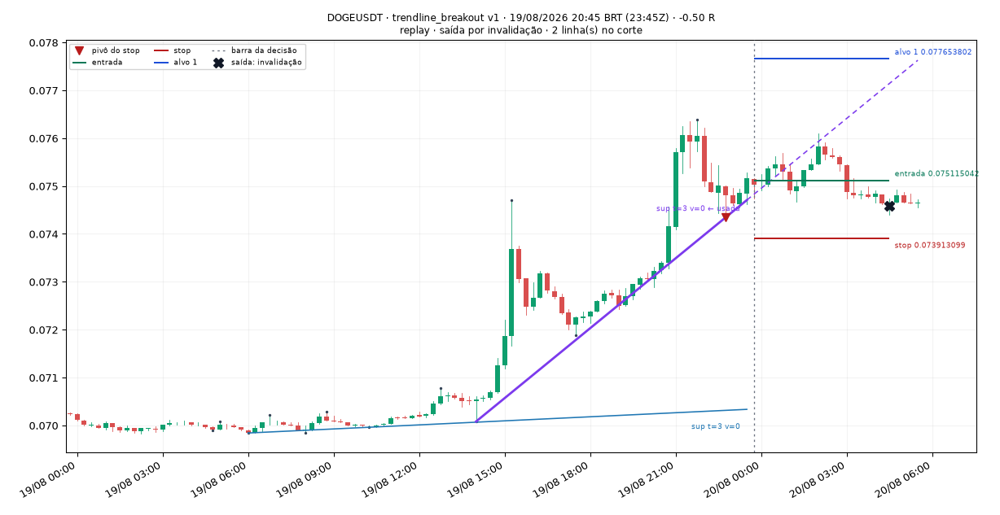

> Linha de tendencia 15m: bounce de uma support com 3 toques e 0 violacoes (inclinacao 0.0001217142857142857142857142857/barra, linha em 0.07470514285714285714285714286); fechamento 0.07516 a 0.73 ATR da linha, ATR% 0.83%

### 002 — ETHUSDT · 20/08/2026 09:15 BRT · +1.80 R

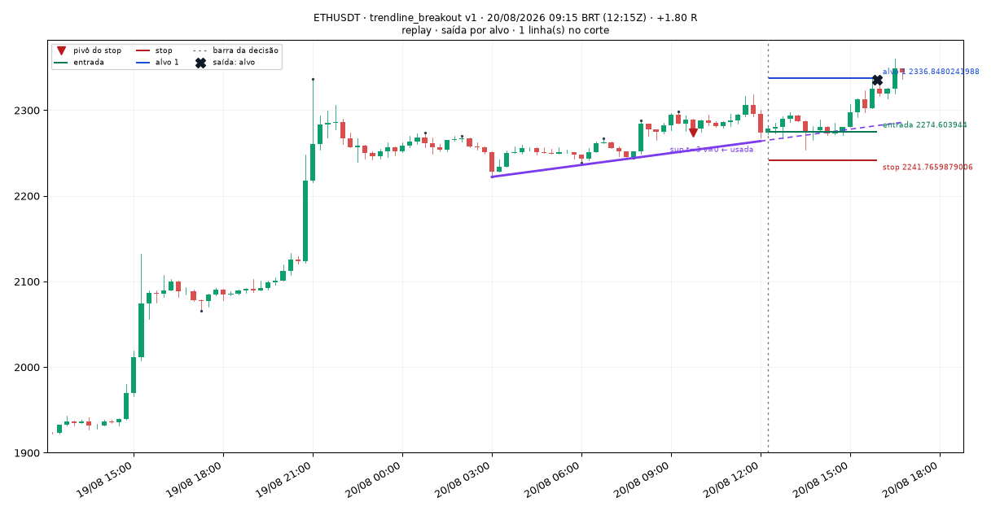

> Linha de tendencia 15m: bounce de uma support com 3 toques e 0 violacoes (inclinacao 1.158421052631578947368421053/barra, linha em 2263.703157894736842105263158); fechamento 2273.46 a 0.62 ATR da linha, ATR% 0.70%

### 003 — ETHUSDT · 20/08/2026 16:30 BRT · -0.51 R

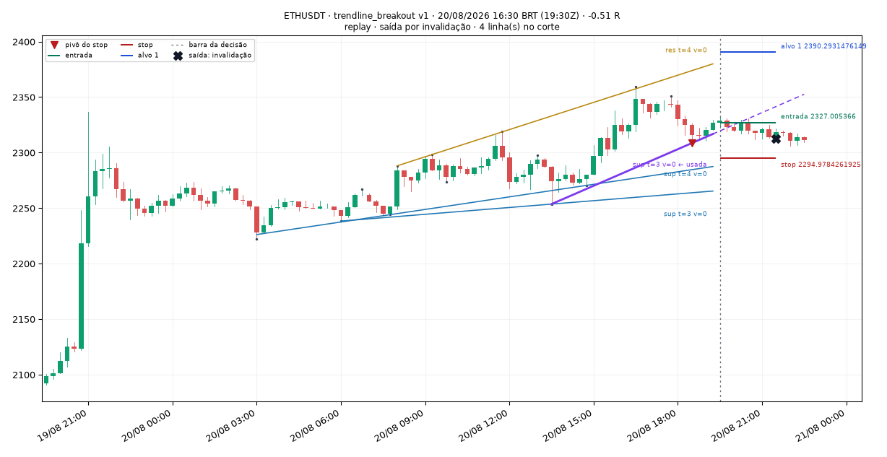

> Linha de tendencia 15m: bounce de uma support com 3 toques e 0 violacoes (inclinacao 2.7475/barra, linha em 2316.7425); fechamento 2326.75 a 0.63 ATR da linha, ATR% 0.68%

### 004 — SOLUSDT · 21/08/2026 04:45 BRT · +1.74 R

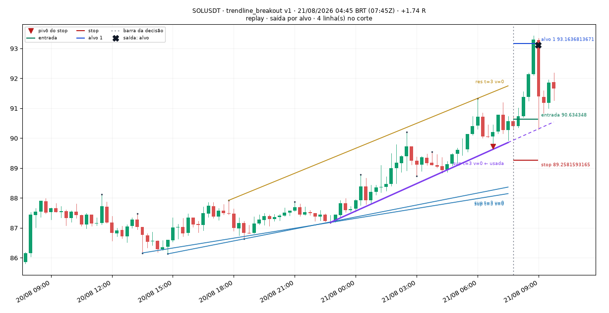

> Linha de tendencia 15m: bounce de uma support com 3 toques e 0 violacoes (inclinacao 0.07636363636363636363636363636/barra, linha em 89.85272727272727272727272727); fechamento 90.56 a 1.09 ATR da linha, ATR% 0.72%

### 005 — ETHUSDT · 21/08/2026 06:15 BRT · -0.66 R

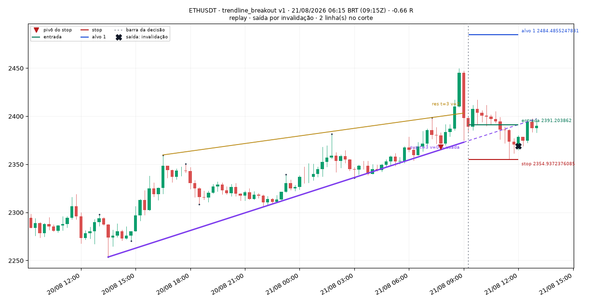

> Linha de tendencia 15m: bounce de uma support com 3 toques e 0 violacoes (inclinacao 1.529444444444444444444444444/barra, linha em 2372.846666666666666666666667); fechamento 2398.12 a 1.17 ATR da linha, ATR% 0.90%

### 006 — SOLUSDT · 21/08/2026 06:15 BRT · -0.64 R

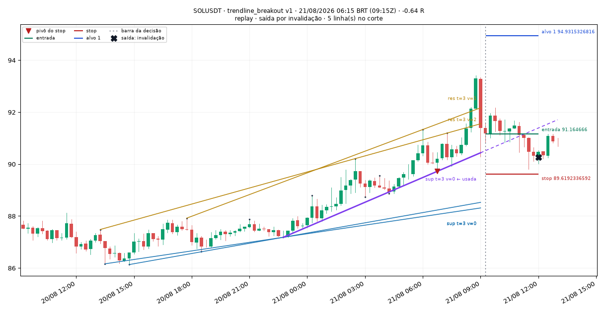

> Linha de tendencia 15m: bounce de uma support com 3 toques e 0 violacoes (inclinacao 0.079375/barra, linha em 90.434375); fechamento 91.39 a 1.08 ATR da linha, ATR% 0.97%

### 007 — DOGEUSDT · 21/08/2026 07:00 BRT · -0.36 R

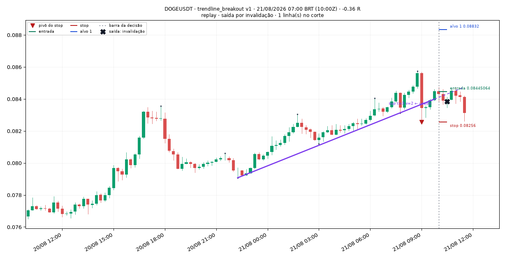

> Linha de tendencia 15m: bounce de uma support com 3 toques e 2 violacoes (inclinacao 0.0001068421052631578947368421053/barra, linha em 0.08398473684210526315789473684); fechamento 0.08448 a 0.60 ATR da linha, ATR% 0.97%

### 008 — SOLUSDT · 21/08/2026 10:45 BRT · +1.24 R

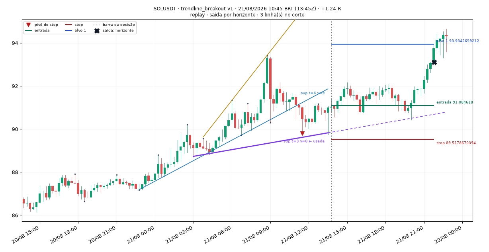

> Linha de tendencia 15m: bounce de uma support com 3 toques e 0 violacoes (inclinacao 0.026/barra, linha em 89.822); fechamento 90.99 a 1.59 ATR da linha, ATR% 0.81%

### 009 — DOGEUSDT · 21/08/2026 11:30 BRT · +1.87 R

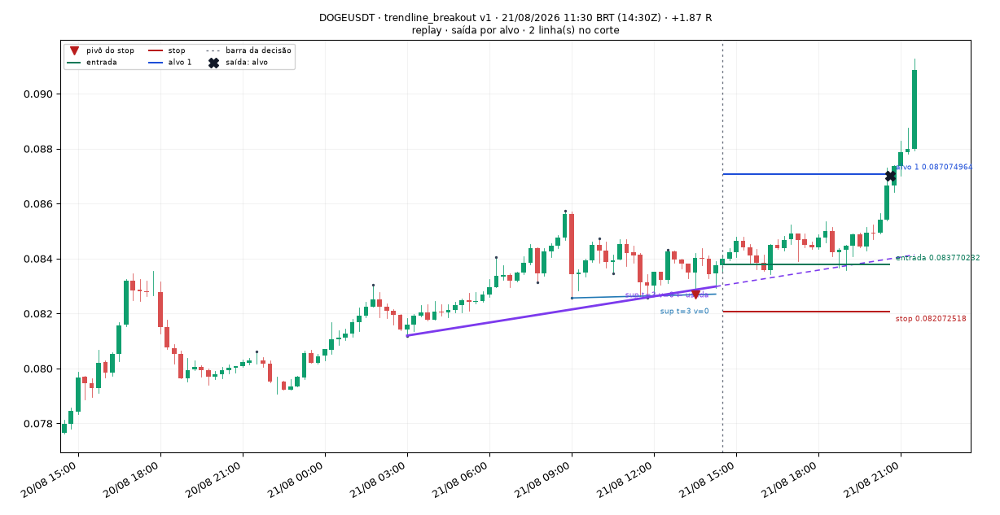

> Linha de tendencia 15m: bounce de uma support com 3 toques e 0 violacoes (inclinacao 0.00003971428571428571428571428571/barra, linha em 0.08297714285714285714285714286); fechamento 0.08374 a 0.91 ATR da linha, ATR% 1.00%

### 010 — ETHUSDT · 21/08/2026 16:00 BRT · +2.17 R

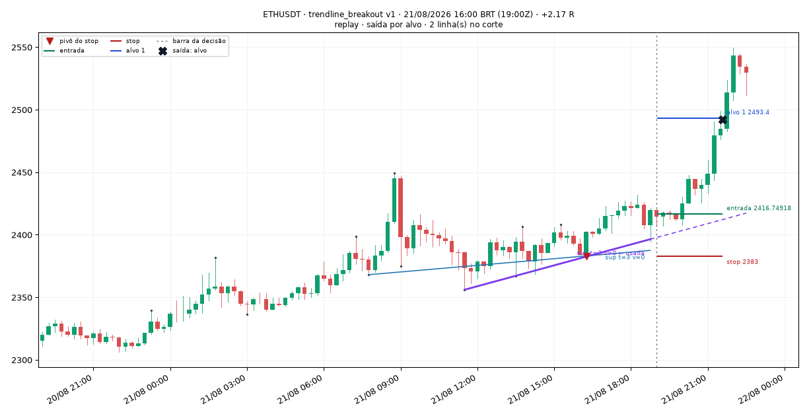

> Linha de tendencia 15m: bounce de uma support com 3 toques e 0 violacoes (inclinacao 1.39125/barra, linha em 2396.34625); fechamento 2419.8 a 1.46 ATR da linha, ATR% 0.66%

### 011 — XRPUSDT · 22/08/2026 20:45 BRT · -0.56 R

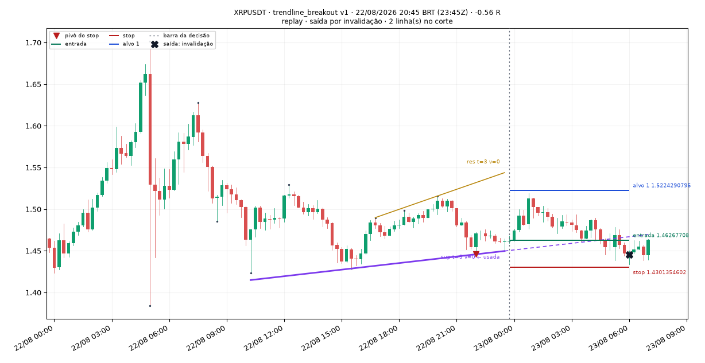

> Linha de tendencia 15m: bounce de uma support com 3 toques e 0 violacoes (inclinacao 0.0006576923076923076923076923077/barra, linha em 1.449646153846153846153846154); fechamento 1.4609 a 0.73 ATR da linha, ATR% 1.05%

### 012 — XRPUSDT · 23/08/2026 09:45 BRT · -1.08 R

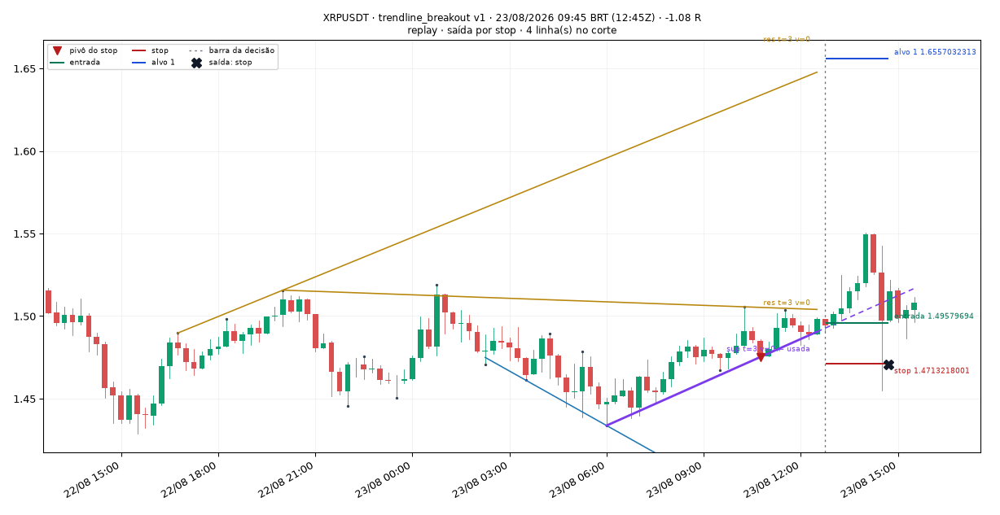

> Linha de tendencia 15m: bounce de uma support com 3 toques e 0 violacoes (inclinacao 0.002184210526315789473684210526/barra, linha em 1.490489473684210526315789474); fechamento 1.4985 a 0.59 ATR da linha, alvo pela largura do canal (11.57 ATR), ATR% 0.91%

### 013 — DOGEUSDT · 23/08/2026 19:15 BRT · -0.55 R

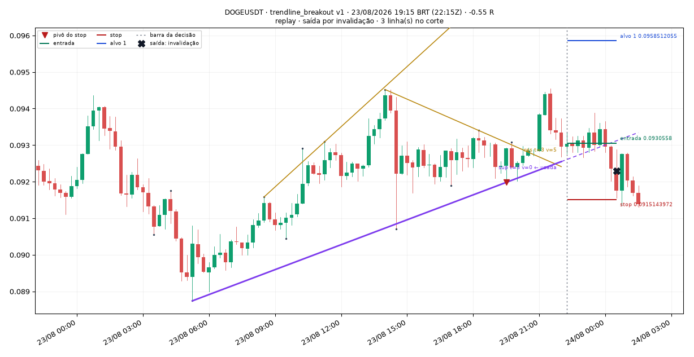

> Linha de tendencia 15m: bounce de uma support com 3 toques e 0 violacoes (inclinacao 0.00005684210526315789473684210526/barra, linha em 0.09254842105263157894736842105); fechamento 0.09296 a 0.57 ATR da linha, ATR% 0.78%

### 014 — ETHUSDT · 23/08/2026 20:30 BRT · -0.94 R

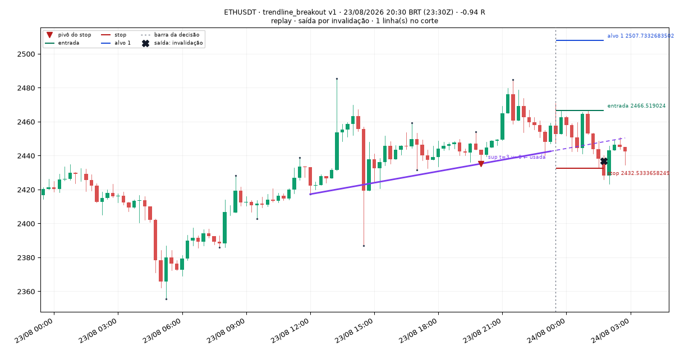

> Linha de tendencia 15m: bounce de uma support com 3 toques e 0 violacoes (inclinacao 0.5615625/barra, linha em 2442.5103125); fechamento 2457.6 a 1.20 ATR da linha, ATR% 0.51%

### 015 — SOLUSDT · 23/08/2026 21:00 BRT · -1.11 R

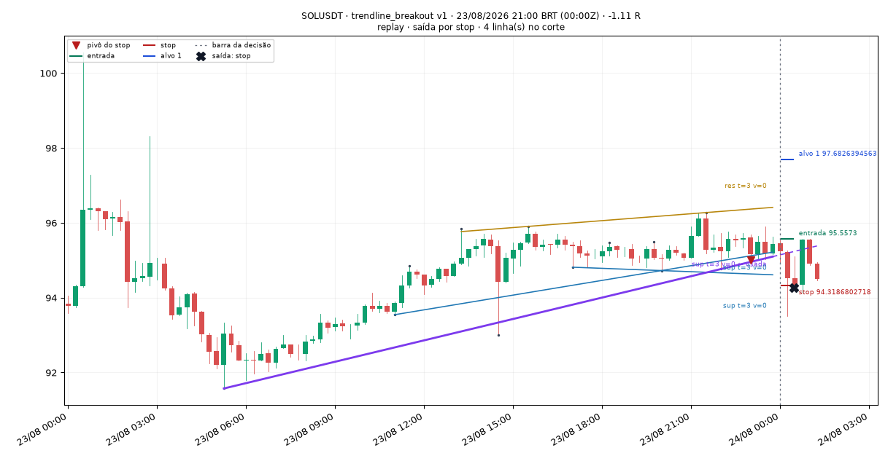

> Linha de tendencia 15m: bounce de uma support com 3 toques e 0 violacoes (inclinacao 0.04761194029850746268656716418/barra, linha em 95.09328358208955223880597015); fechamento 95.44 a 0.62 ATR da linha, ATR% 0.59%

### 016 — SOLUSDT · 24/08/2026 01:30 BRT · -0.88 R

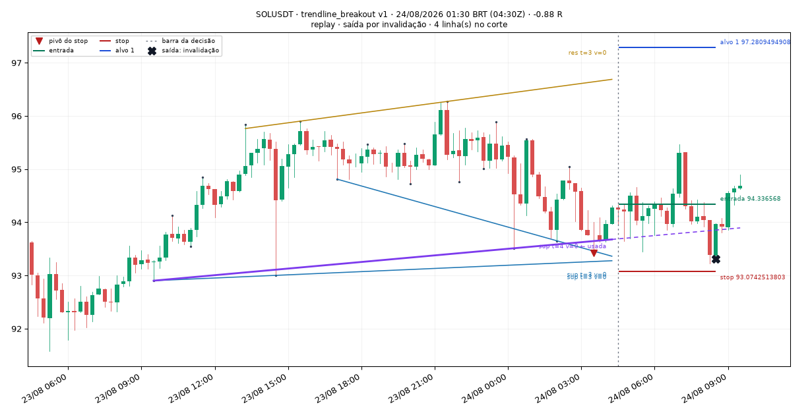

> Linha de tendencia 15m: bounce de uma support com 4 toques e 0 violacoes (inclinacao 0.01033898305084745762711864407/barra, linha em 93.67542372881355932203389831); fechamento 94.27 a 0.99 ATR da linha, alvo pela largura do canal (5.04 ATR), ATR% 0.63%

### 017 — ETHUSDT · 24/08/2026 02:00 BRT · +1.95 R

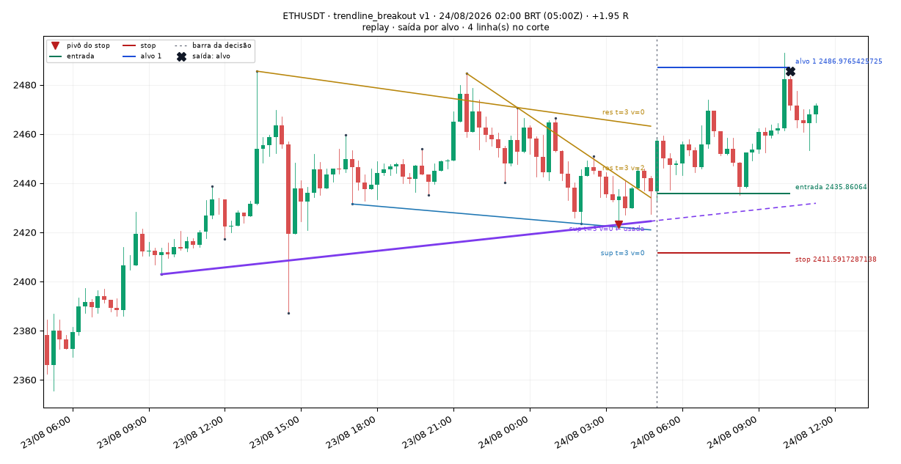

> Linha de tendencia 15m: bounce de uma support com 3 toques e 0 violacoes (inclinacao 0.2805555555555555555555555556/barra, linha em 2424.452777777777777777777778); fechamento 2436.72 a 0.98 ATR da linha, ATR% 0.52%

### 018 — XRPUSDT · 24/08/2026 03:15 BRT · -1.07 R

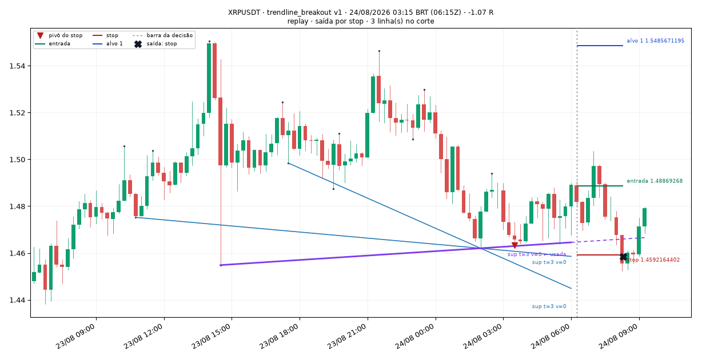

> Linha de tendencia 15m: bounce de uma support com 3 toques e 0 violacoes (inclinacao 0.0001565217391304347826086956522/barra, linha em 1.46450434782608695652173913); fechamento 1.489 a 1.64 ATR da linha, ATR% 1.00%

### 019 — DOGEUSDT · 24/08/2026 04:15 BRT · -0.83 R

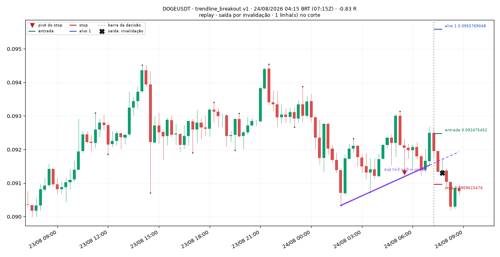

> Linha de tendencia 15m: bounce de uma support com 3 toques e 0 violacoes (inclinacao 0.00005714285714285714285714285714/barra, linha em 0.09153); fechamento 0.0925 a 1.26 ATR da linha, ATR% 0.83%

### 020 — XRPUSDT · 24/08/2026 11:15 BRT · -1.07 R

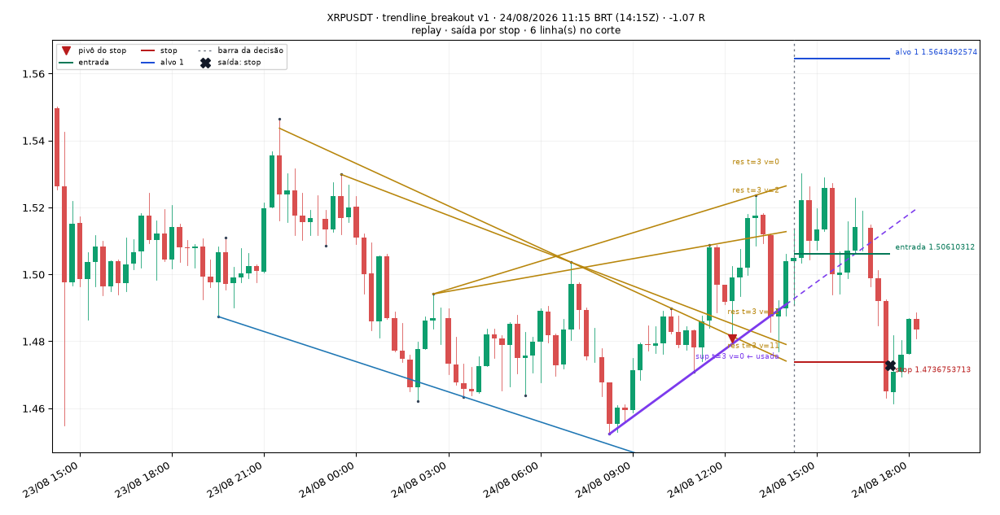

> Linha de tendencia 15m: bounce de uma support com 3 toques e 0 violacoes (inclinacao 0.001681818181818181818181818182/barra, linha em 1.490981818181818181818181818); fechamento 1.5039 a 0.85 ATR da linha, ATR% 1.00%

### 021 — ETHUSDT · 24/08/2026 12:45 BRT · -0.60 R

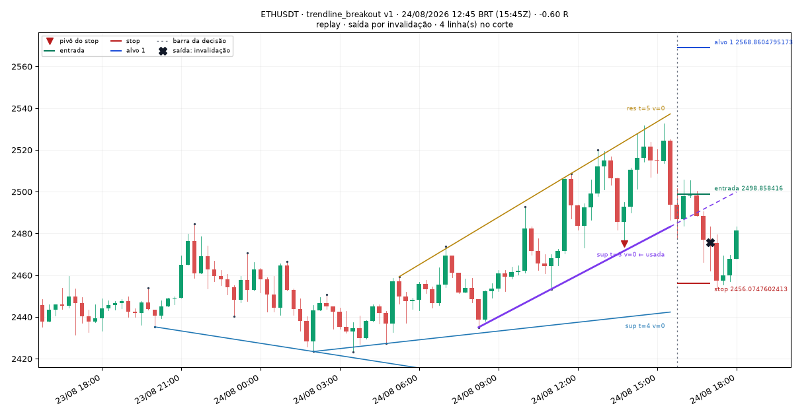

> Linha de tendencia 15m: bounce de uma support com 3 toques e 0 violacoes (inclinacao 1.661818181818181818181818182/barra, linha em 2483.202727272727272727272727); fechamento 2493.67 a 0.56 ATR da linha, ATR% 0.75%

### 022 — ETHUSDT · 24/08/2026 16:15 BRT · +0.87 R

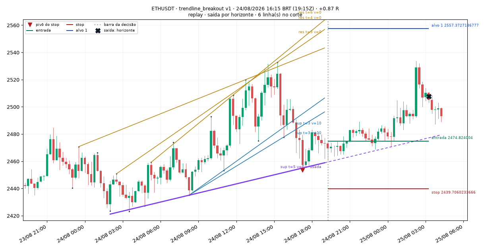

> Linha de tendencia 15m: bounce de uma support com 5 toques e 0 violacoes (inclinacao 0.555/barra, linha em 2458.875); fechamento 2473 a 0.85 ATR da linha, alvo pela largura do canal (5.07 ATR), ATR% 0.67%

### 023 — XRPUSDT · 24/08/2026 17:00 BRT · +1.09 R

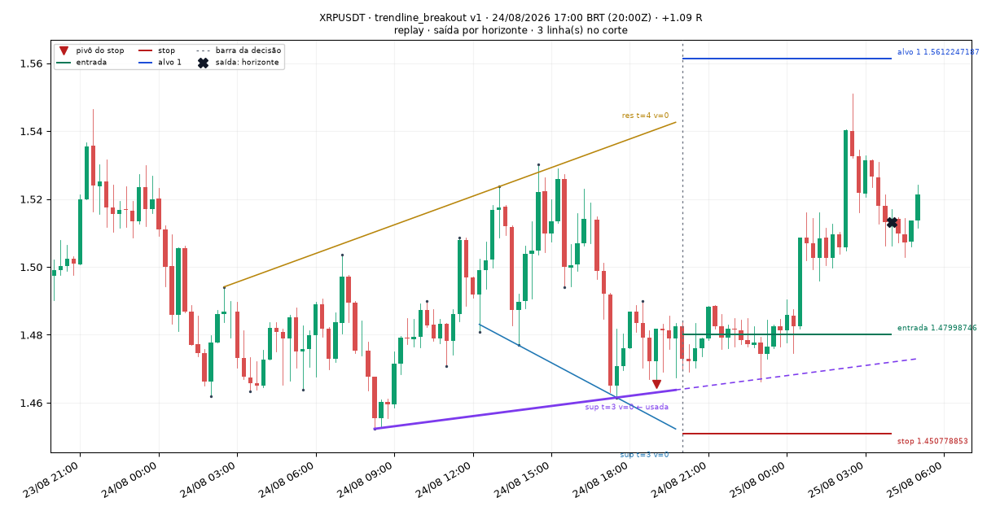

> Linha de tendencia 15m: bounce de uma support com 3 toques e 0 violacoes (inclinacao 0.0002486486486486486486486486486/barra, linha em 1.463737837837837837837837838); fechamento 1.4824 a 1.18 ATR da linha, alvo pela largura do canal (4.99 ATR), ATR% 1.07%

### 024 — SOLUSDT · 25/08/2026 04:15 BRT · -1.07 R

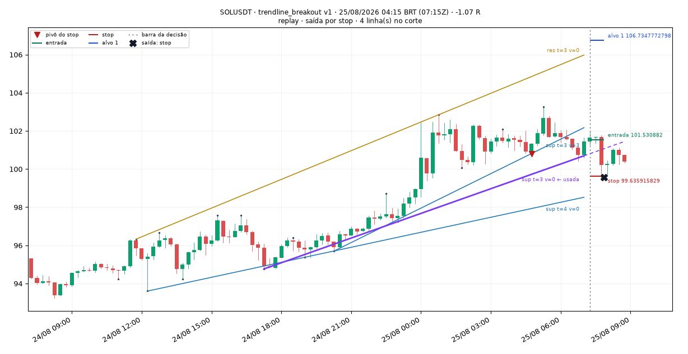

> Linha de tendencia 15m: bounce de uma support com 3 toques e 0 violacoes (inclinacao 0.1078260869565217391304347826/barra, linha em 100.690434782608695652173913); fechamento 101.45 a 0.84 ATR da linha, alvo pela largura do canal (5.83 ATR), ATR% 0.89%

### 025 — XRPUSDT · 25/08/2026 05:00 BRT · -0.63 R

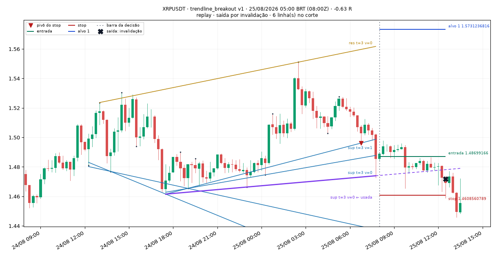

> Linha de tendencia 15m: bounce de uma support com 3 toques e 0 violacoes (inclinacao 0.0002181818181818181818181818182/barra, linha em 1.473936363636363636363636364); fechamento 1.4854 a 0.93 ATR da linha, alvo pela largura do canal (7.15 ATR), ATR% 0.83%

### 026 — DOGEUSDT · 25/08/2026 05:30 BRT · -1.09 R

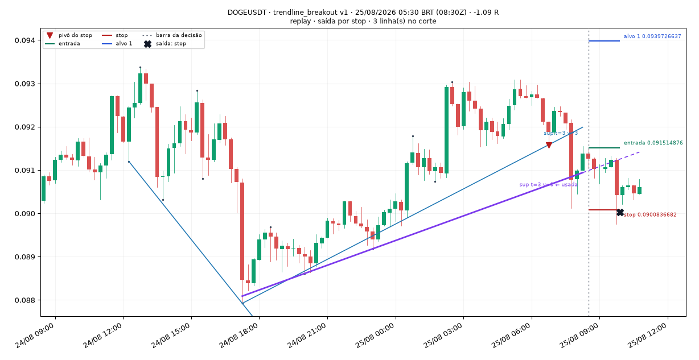

> Linha de tendencia 15m: bounce de uma support com 3 toques e 0 violacoes (inclinacao 0.0000475/barra, linha em 0.0909375); fechamento 0.09138 a 0.68 ATR da linha, ATR% 0.71%

### 027 — SOLUSDT · 26/08/2026 18:15 BRT · +1.70 R

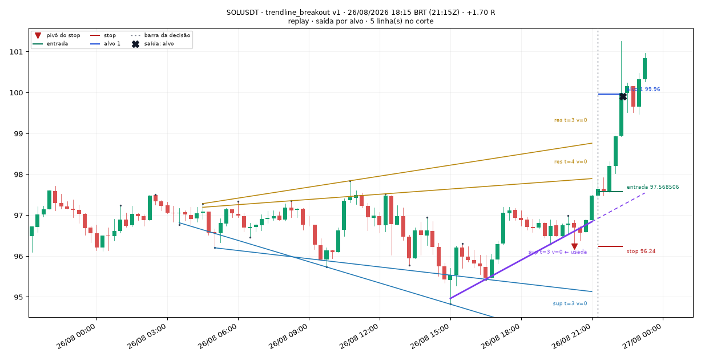

> Linha de tendencia 15m: bounce de uma support com 3 toques e 0 violacoes (inclinacao 0.07818181818181818181818181818/barra, linha em 96.83727272727272727272727273); fechamento 97.48 a 1.32 ATR da linha, ATR% 0.50%

### 028 — SOLUSDT · 27/08/2026 03:00 BRT · -0.87 R

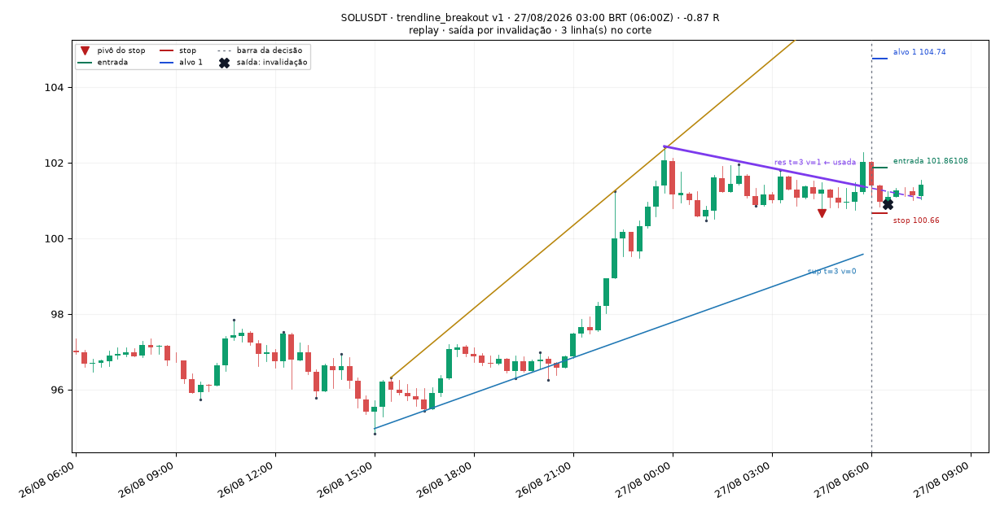

> Linha de tendencia 15m: breakout de uma resistance com 3 toques e 1 violacoes (inclinacao -0.04428571428571428571428571429/barra, linha em 101.3671428571428571428571429); fechamento 102.02 a 0.99 ATR da linha, volume relativo 2.65x, ATR% 0.65%

### 029 — ETHUSDT · 27/08/2026 08:15 BRT · -0.54 R

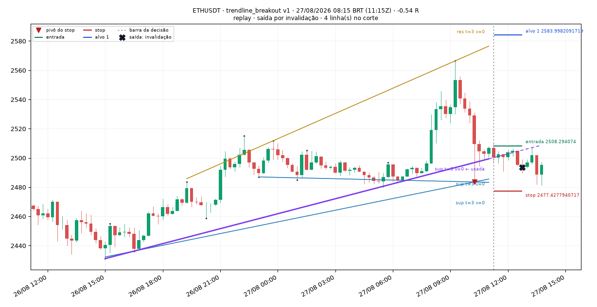

> Linha de tendencia 15m: bounce de uma support com 3 toques e 0 violacoes (inclinacao 0.8532692307692307692307692308/barra, linha em 2499.331923076923076923076923); fechamento 2506.86 a 0.51 ATR da linha, alvo pela largura do canal (5.24 ATR), ATR% 0.59%

### 030 — XRPUSDT · 27/08/2026 10:30 BRT · +2.20 R

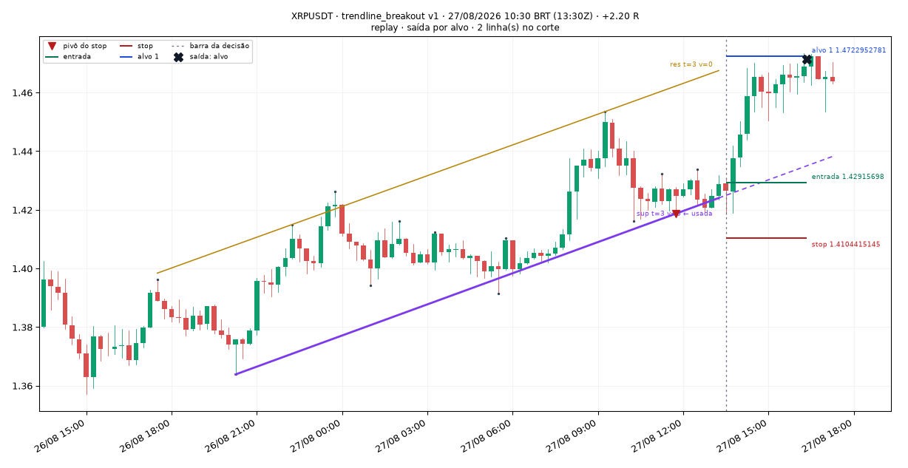

> Linha de tendencia 15m: bounce de uma support com 3 toques e 0 violacoes (inclinacao 0.0008854838709677419354838709677/barra, linha em 1.424012903225806451612903226); fechamento 1.4288 a 0.52 ATR da linha, alvo pela largura do canal (4.74 ATR), ATR% 0.64%

### 031 — DOGEUSDT · 27/08/2026 11:00 BRT · +0.45 R

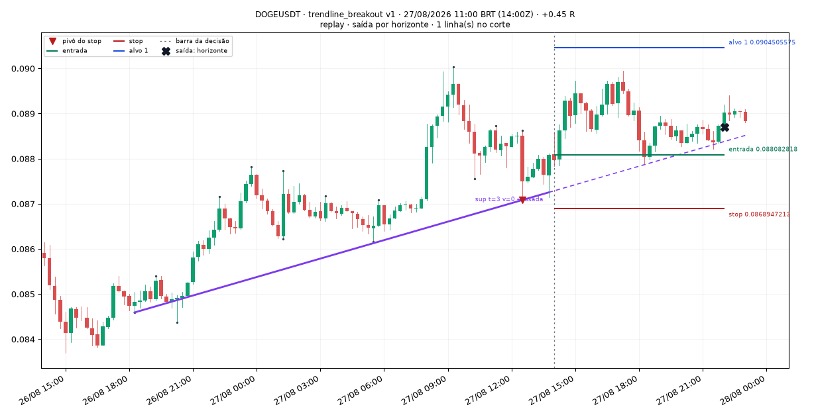

> Linha de tendencia 15m: bounce de uma support com 3 toques e 0 violacoes (inclinacao 0.00003410958904109589041095890411/barra, linha em 0.08725054794520547945205479452); fechamento 0.08808 a 1.40 ATR da linha, ATR% 0.67%

### 032 — XRPUSDT · 27/08/2026 18:00 BRT · -0.49 R

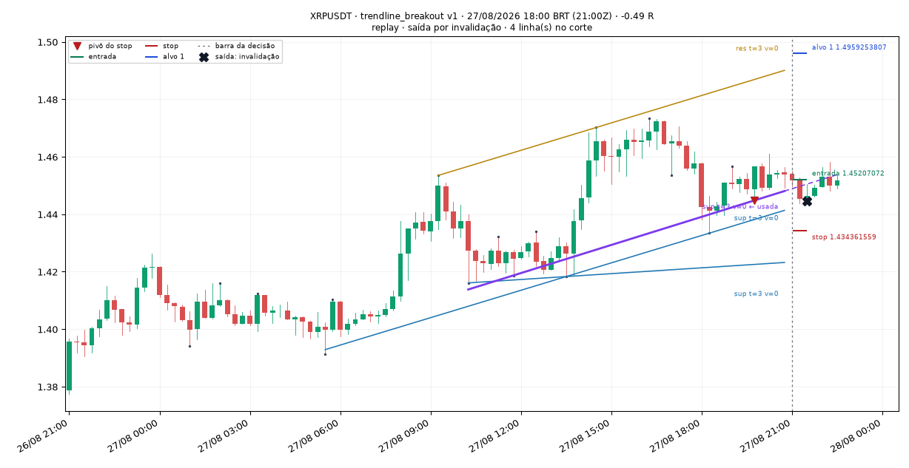

> Linha de tendencia 15m: bounce de uma support com 3 toques e 0 violacoes (inclinacao 0.000815625/barra, linha em 1.4480625); fechamento 1.4539 a 0.60 ATR da linha, alvo pela largura do canal (4.30 ATR), ATR% 0.67%

### 033 — XRPUSDT · 27/08/2026 19:15 BRT · -0.77 R

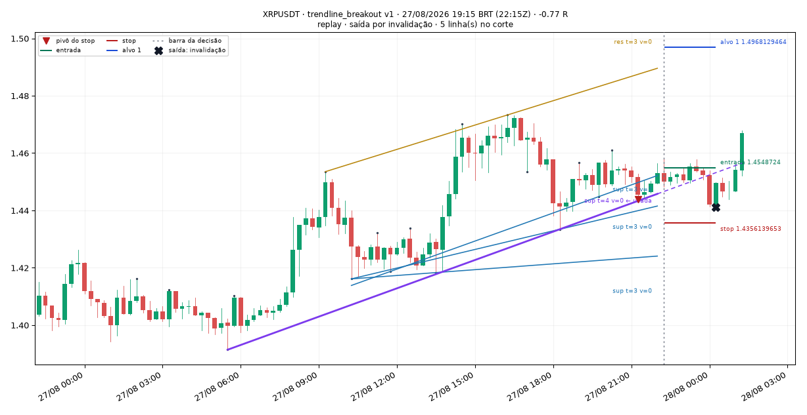

> Linha de tendencia 15m: bounce de uma support com 4 toques e 0 violacoes (inclinacao 0.0008235294117647058823529411765/barra, linha em 1.445752941176470588235294118); fechamento 1.453 a 0.83 ATR da linha, alvo pela largura do canal (5.04 ATR), ATR% 0.60%

### 034 — SOLUSDT · 27/08/2026 20:30 BRT · -0.50 R

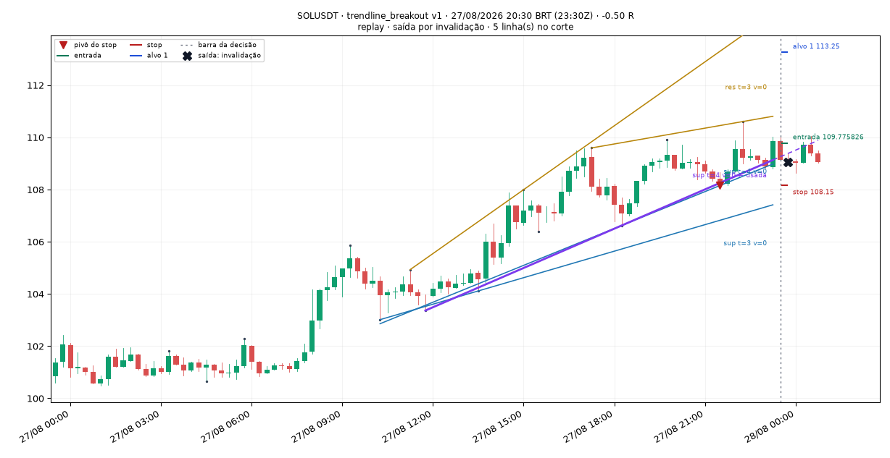

> Linha de tendencia 15m: bounce de uma support com 4 toques e 0 violacoes (inclinacao 0.1253846153846153846153846154/barra, linha em 109.1276923076923076923076923); fechamento 109.85 a 0.92 ATR da linha, ATR% 0.72%

### 035 — XRPUSDT · 27/08/2026 22:00 BRT · -0.78 R

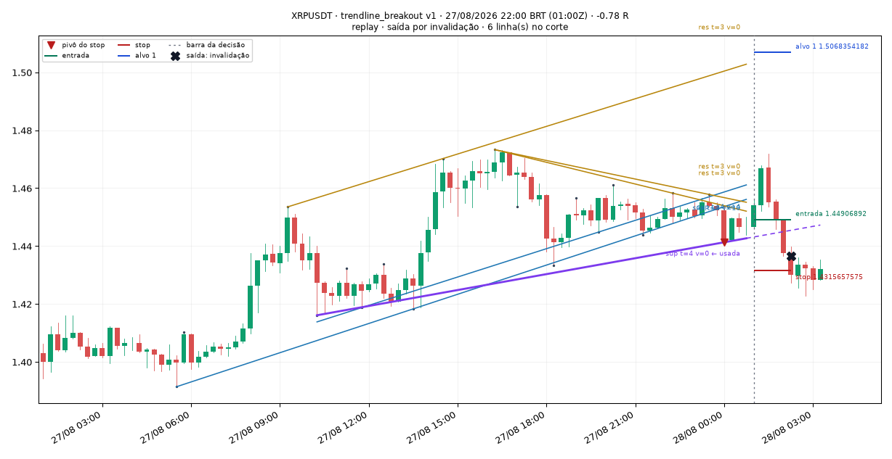

> Linha de tendencia 15m: bounce de uma support com 4 toques e 0 violacoes (inclinacao 0.0004581818181818181818181818182/barra, linha em 1.442674545454545454545454545); fechamento 1.4467 a 0.53 ATR da linha, alvo pela largura do canal (7.95 ATR), ATR% 0.52%

### 036 — SOLUSDT · 27/08/2026 22:30 BRT · -0.83 R

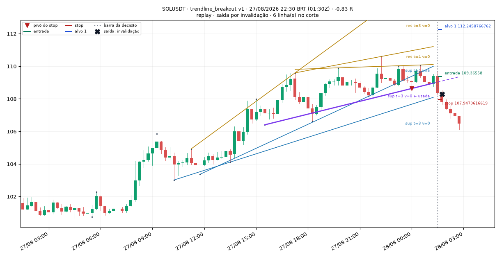

> Linha de tendencia 15m: bounce de uma support com 3 toques e 0 violacoes (inclinacao 0.06558823529411764705882352941/barra, linha em 108.9579411764705882352941176); fechamento 109.38 a 0.59 ATR da linha, ATR% 0.66%

### 037 — DOGEUSDT · 28/08/2026 01:15 BRT · -1.11 R

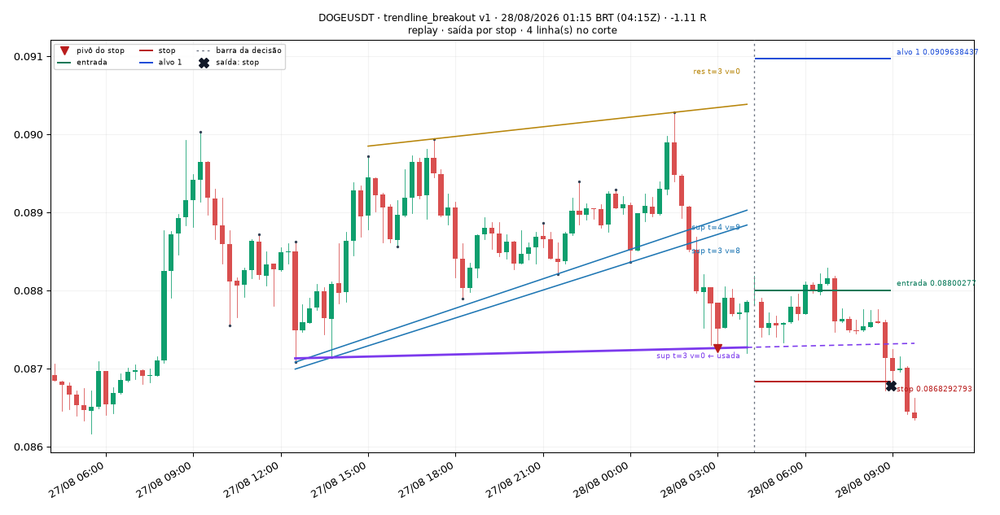

> Linha de tendencia 15m: bounce de uma support com 3 toques e 0 violacoes (inclinacao 0.000002264150943396226415094339623/barra, linha em 0.08726905660377358490566037736); fechamento 0.08785 a 1.14 ATR da linha, alvo pela largura do canal (6.10 ATR), ATR% 0.58%

### 038 — SOLUSDT · 28/08/2026 11:45 BRT · -0.55 R

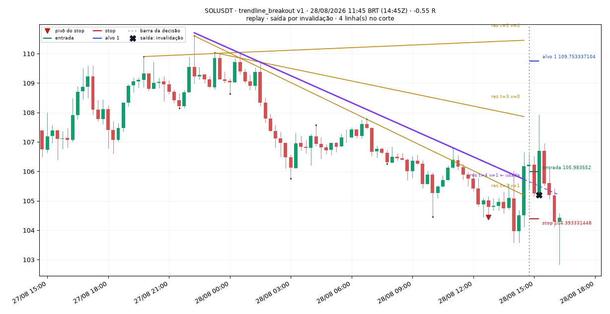

> Linha de tendencia 15m: breakout de uma resistance com 4 toques e 1 violacoes (inclinacao -0.07657894736842105263157894737/barra, linha em 105.7278947368421052631578947); fechamento 106.18 a 0.51 ATR da linha, volume relativo 5.96x, ATR% 0.84%

### 039 — SOLUSDT · 31/08/2026 02:30 BRT · -0.00 R

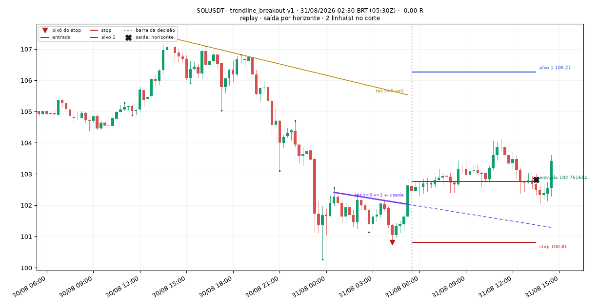

> Linha de tendencia 15m: breakout de uma resistance com 3 toques e 1 violacoes (inclinacao -0.02/barra, linha em 102.03); fechamento 102.63 a 0.93 ATR da linha, volume relativo 4.78x, ATR% 0.63%

### 040 — XRPUSDT · 31/08/2026 11:15 BRT · +2.00 R

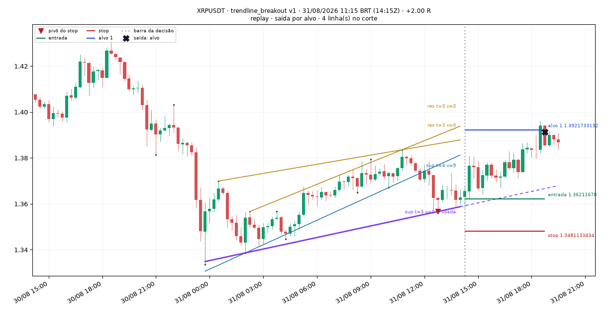

> Linha de tendencia 15m: bounce de uma support com 3 toques e 0 violacoes (inclinacao 0.0004186046511627906976744186047/barra, linha em 1.358693023255813953488372093); fechamento 1.3628 a 0.56 ATR da linha, ATR% 0.54%

### 041 — DOGEUSDT · 31/08/2026 11:45 BRT · -0.52 R

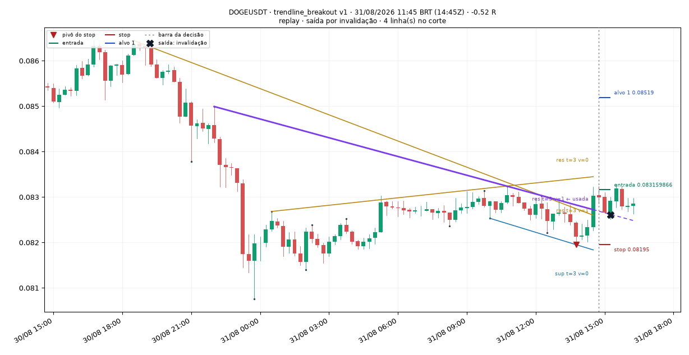

> Linha de tendencia 15m: breakout de uma resistance com 3 toques e 1 violacoes (inclinacao -0.00003438596491228070175438596491/barra, linha em 0.08272052631578947368421052632); fechamento 0.08303 a 0.73 ATR da linha, volume relativo 2.61x, ATR% 0.51%

### 042 — SOLUSDT · 31/08/2026 11:45 BRT · -0.32 R

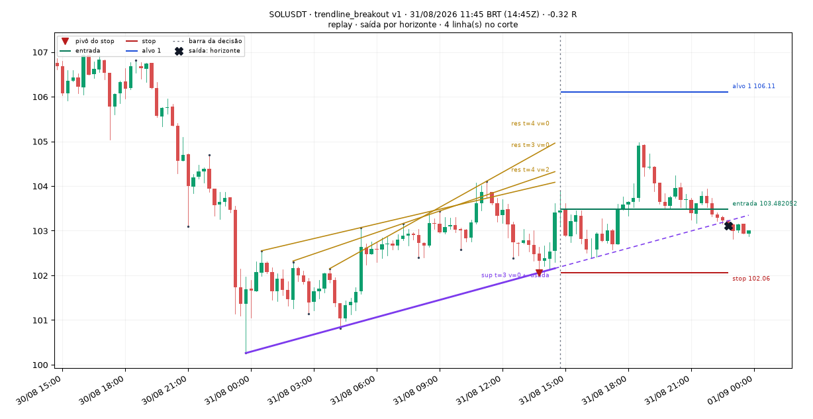

> Linha de tendencia 15m: bounce de uma support com 3 toques e 0 violacoes (inclinacao 0.03214285714285714285714285714/barra, linha em 102.1564285714285714285714286); fechamento 103.41 a 2.21 ATR da linha, ATR% 0.55%

### 043 — XRPUSDT · 01/09/2026 20:45 BRT · -0.60 R

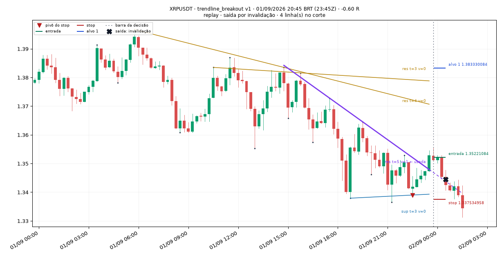

> Linha de tendencia 15m: breakout de uma resistance com 5 toques e 1 violacoes (inclinacao -0.0010375/barra, linha em 1.3479); fechamento 1.3528 a 0.64 ATR da linha, volume relativo 1.55x, ATR% 0.56%

### 044 — DOGEUSDT · 02/09/2026 12:30 BRT · +0.12 R

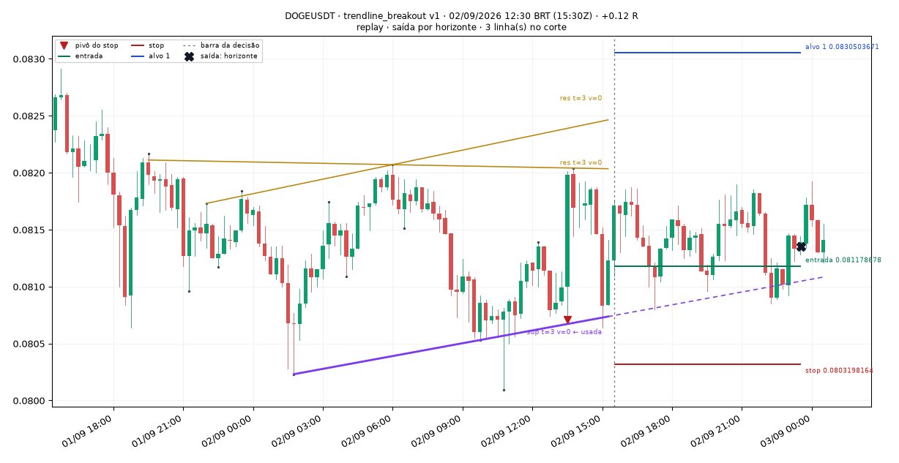

> Linha de tendencia 15m: bounce de uma support com 3 toques e 0 violacoes (inclinacao 0.000009375/barra, linha em 0.08073625); fechamento 0.08123 a 1.08 ATR da linha, ATR% 0.56%

### 045 — XRPUSDT · 02/09/2026 15:15 BRT · +0.90 R

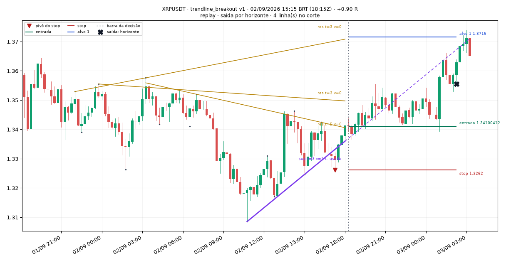

> Linha de tendencia 15m: bounce de uma support com 3 toques e 1 violacoes (inclinacao 0.0009470588235294117647058823529/barra, linha em 1.335964705882352941176470588); fechamento 1.3413 a 0.74 ATR da linha, ATR% 0.54%

### 046 — SOLUSDT · 03/09/2026 02:45 BRT · +1.11 R

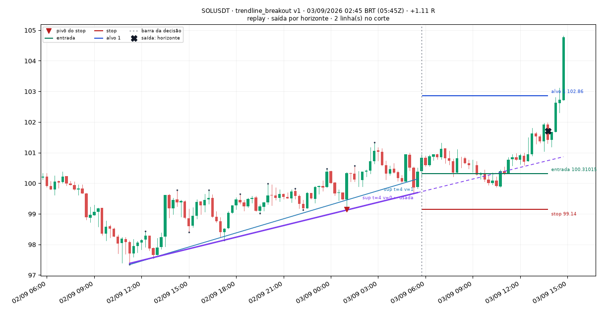

> Linha de tendencia 15m: bounce de uma support com 4 toques e 0 violacoes (inclinacao 0.03166666666666666666666666667/barra, linha em 99.69166666666666666666666667); fechamento 100.38 a 1.30 ATR da linha, ATR% 0.53%

### 047 — SOLUSDT · 03/09/2026 19:00 BRT · -0.97 R

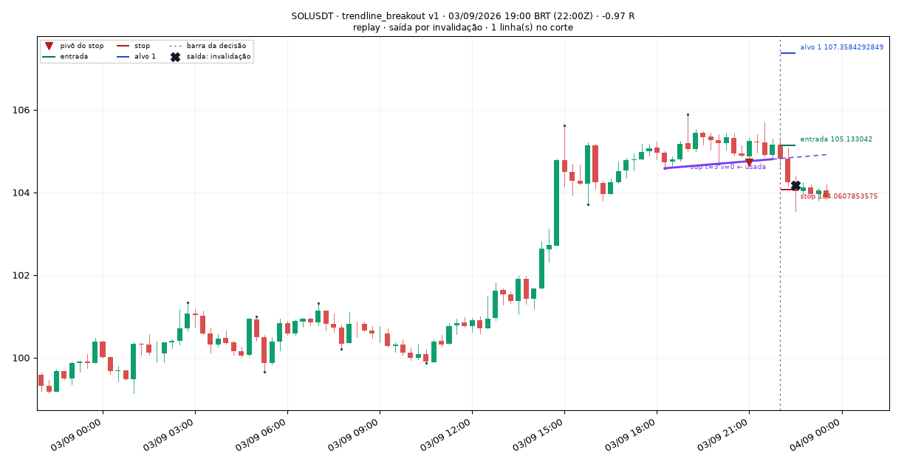

> Linha de tendencia 15m: bounce de uma support com 3 toques e 0 violacoes (inclinacao 0.01571428571428571428571428571/barra, linha em 104.8); fechamento 105.16 a 0.66 ATR da linha, ATR% 0.52%
