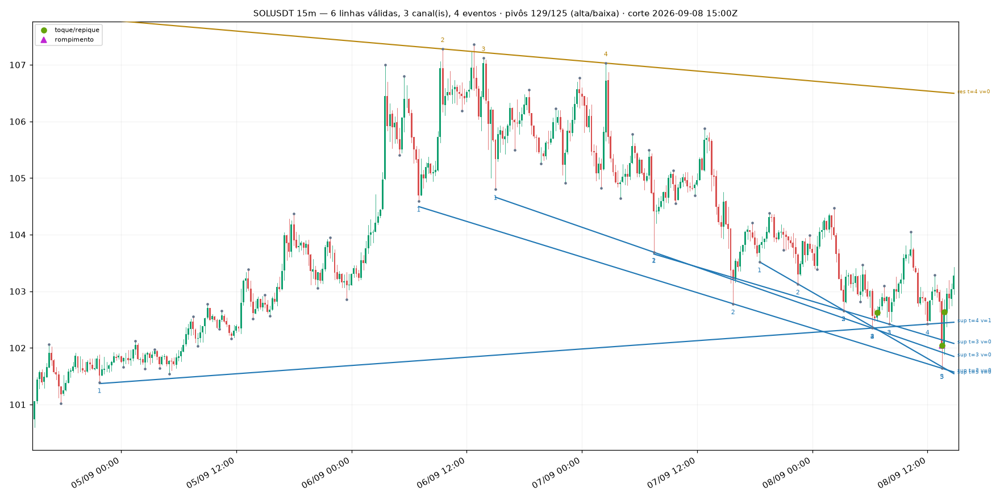
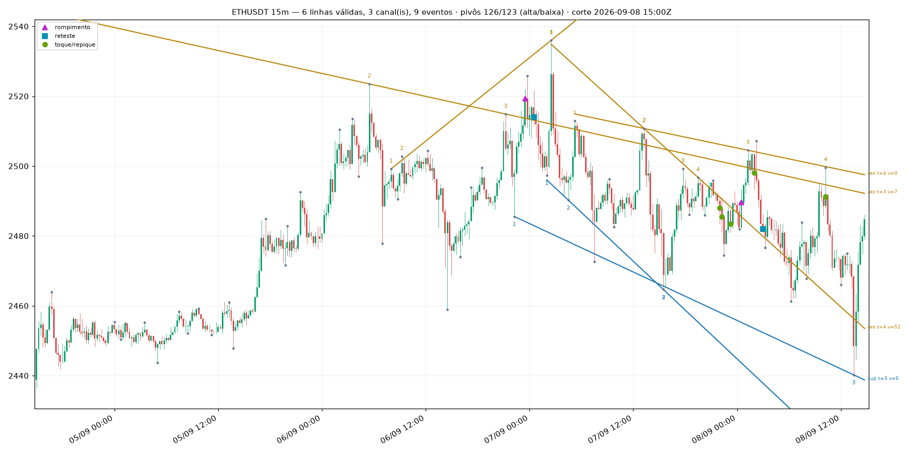

# KB-0077 — linhas de tendência: como o Lab passou a traçá-las (pivôs, linhas, canais, rompimento, reteste)

> **Arquivada pela Sexta-feira em 2026-09-08 (T3.33h)** a partir do rascunho do `quant-engineer`
> (T3.34, `.claude/state/exp-drafts/KB-0077-linhas-de-tendencia.md`, commit `db798b8`). As seis
> figuras foram copiadas de `.claude/state/design/trendlines/` para `obsidian/attachments/trendlines/`
> e estão embutidas na §6. **Isto é geometria determinística, não vantagem medida** — nenhum número
> desta página diz que linha de tendência prevê preço.

## O que isto é

O Everton pediu (2026-09-08) que o Lab aprendesse a traçar "as famosas linhas de tendência". Esta
nota descreve a **primitiva determinística** entregue: pivôs, linhas de suporte e resistência, canais
e os três eventos que o preço pode causar numa linha. Nada aqui decide operação — a estratégia que
usa isto é a **T3.34b** (`trendline_breakout_v1`). Figuras, cunha, triângulo, bandeira e OCO (os
"padrões gráficos" do mesmo material) são a T3.35, e todos são **duas destas linhas com uma relação**
entre elas (convergentes, paralelas, divergentes) — por isso esta é a peça de baixo.

Código: `packages/indicators/hunter_indicators/patterns/` (`pivots.py`, `trendlines.py`,
`channels.py`, `events.py`, `scale.py`, `scan.py`, `definitions.py`), oito arquivos, todos ≤ 350
linhas, 31 testes em `packages/indicators/tests/patterns/`. **Nada entrou em
`features.engine.DEFAULT_REGISTRY`**: isso moveria `feature_set_version`, que carimba toda linha de
`feature_snapshots` já escrita. As cinco `FeatureDefinition` (`trendline_*`) existem com nome, versão
e `inputs` desde o primeiro dia, **fora** do registro ativo.

## 1. Pivô — o ponto por onde a linha passa

Um **pivô de alta** (swing high) é uma barra cuja máxima é a maior das `k` barras de cada lado. Um
**pivô de baixa** é o espelho, com a mínima. Três regras, e cada uma existe porque tirá-la produz uma
linha que ninguém traçaria à mão:

1. **janela de confirmação `k` (padrão 3).** O lado direito é o ponto inteiro: um pivô só é
   *conhecido* `k` barras depois. Cada pivô carrega `confirmed_at = index + k`, e nenhum consumidor
   pode ancorar decisão na barra do próprio pivô. Isto é **anti-antecipação**, não estética;
2. **filtro de significância em ATR (`min_swing_atr`, padrão 1,0).** A *proeminência* — a
   profundidade do vale medida contra o mais baixo dos dois picos que o ladeiam (definição
   topográfica, sobre as `k` barras de cada lado, **excluída a barra do pivô**, para que a própria
   amplitude dela não sirva de fiador) — precisa alcançar `min_swing_atr` ATRs. Sem isso, todo repuxo
   de uma fita que acabou de acalmar vira "swing";
3. **empate fica com a barra mais velha:** estritamente maior à esquerda, maior-ou-igual à direita.
   Um platô de três máximas iguais rende **um** pivô, não três.

Uma barra cujo ATR ainda não aqueceu (as ~15 primeiras, com período 14) **não é pivô**: sem escala não
há como aplicar a regra 2, e inventar escala seria pior do que recusar.

## 2. Quando uma linha vale

Candidata = a reta por **dois pivôs do mesmo lado** (máximas → resistência, mínimas → suporte). Ela
vira **linha** quando a fita a honrou:

- **toques:** pelo menos `min_touches` (padrão **3** — "dois pontos traçam, o terceiro confirma")
  pivôs do mesmo lado ficam a até `tolerance_atr` (padrão 0,25 ATR) dela;
- **respeitada:** entre o primeiro e o último toque, **nenhum fechamento** passa da linha por mais de
  `tolerance_atr`. Um fechamento através dela é pavio; dois são outra linha;
- **nota:** `toques × extensão − violações`, com extensão em barras entre o primeiro e o último toque,
  e `violações` contando os fechamentos através da linha do primeiro toque até o corte;
- **`valid_from_idx`** = o **mais tardio** entre a confirmação dos dois pivôs que fixam a inclinação
  (`origin` e `through`) e a confirmação do `min_touches`-ésimo toque. É a primeira barra em que
  alguém poderia ter traçado aquela linha, e nenhum evento é reportado antes dela. **A geometria de
  uma linha é história; a existência dela tem data.**

O que a varredura **não** promete: que a mesma linha estivesse *selecionada* naquela barra. Nota,
baldes e o teto de seis linhas são avaliados no corte, então uma varredura na barra 500 é um desenho
retrospectivo das linhas que sobrevivem **hoje**, não uma repetição de quais eram as seis melhores na
barra 300. Quem precisa da sequência viva chama a varredura uma vez por barra — que é o que uma
estratégia faz.

Linhas redundantes são colapsadas: uma por (lado, faixa de inclinação, faixa de nível), medidas em ATR
(`angle_bucket_atr` 0,10 ATR/barra; `level_bucket_atr` 0,50 ATR) — e a de maior nota vence.

## 3. Canal

Um **canal** é um par (resistência, suporte) cujas inclinações concordam até `parallel_tol` (padrão
0,05 ATR por barra), com preço entre elas. A largura sai em ATRs (`width_atr`) e é o que dá alvo à
estratégia: *"o alvo é a largura do canal"* só significa alguma coisa quando a largura tem unidade.

## 4. Os três eventos

Avaliados **no fechamento da barra** e nunca antes de `valid_from_idx`:

- **repique / toque (`bounce`):** o extremo da barra chega a `tolerance_atr` da linha e, em até
  `bounce_bars` (3) barras, um fechamento se afasta `bounce_atr` (0,5 ATR). É a evidência de que a
  linha está sendo respeitada;
- **rompimento (`breakout`):** o primeiro fechamento além da linha por mais de `break_atr` (0,5 ATR).
  Com `rvol_min` informado, um rompimento **sem volume relativo** não é evento nenhum — não é
  reportado em lugar algum, porque "rompeu, quietinho" é exatamente o rompimento que falha;
- **reteste (`retest`):** depois do rompimento, uma barra que volta a `tolerance_atr` da linha e fecha
  de novo no sentido do rompimento, dentro de `retest_bars` (10). **A polaridade inverte:** quem toca
  a resistência rompida por cima é a **mínima** da barra, não a máxima (foi bug real, com teste).

Um pavio que **atravessa** a linha por mais que a tolerância e fecha de volta **não** é repique aqui
(é um rompimento falso, e nomeá-lo de repique deixaria uma estratégia comprar um nível que acabou de
ser furado). É omissão deliberada — ver §7.

## 5. Parâmetros e padrões

| parâmetro | padrão | o que é |
|---|---|---|
| `pivot_k` | 3 | barras de cada lado para confirmar um pivô |
| `min_swing_atr` | 1,0 | proeminência mínima do pivô, em ATR |
| `atr_period` | 14 | ATR de Wilder (`wilder_v1`, o mesmo do resto do sistema) |
| `min_touches` | 3 | pivôs necessários para a linha valer |
| `tolerance_atr` | 0,25 | distância que ainda conta como "na linha" |
| `break_atr` | 0,5 | fechamento além da linha que conta como rompimento |
| `bounce_atr` | 0,5 | afastamento que confirma o repique |
| `retest_bars` | 10 | janela do reteste depois do rompimento |
| `bounce_bars` | 3 | janela da confirmação do repique |
| `parallel_tol` | 0,05 | diferença de inclinação (ATR/barra) que ainda é "paralela" |
| `angle_bucket_atr` / `level_bucket_atr` | 0,10 / 0,50 | faixas de deduplicação |
| `max_anchors` | 20 | pivôs mais recentes usados como âncora (custo) |
| `max_lines` / `max_channels` | 6 / 3 | teto de saída |
| `rvol_min` | — | volume relativo mínimo do rompimento (opcional) |

**Todos são suposições declaradas, nenhum é medido.** Vêm do brief da T3.34 e da prática clássica. A
calibração honesta exige rodar a T3.34b e olhar a distribuição, **não olhar mais figuras** — é a mesma
regra de [[KB-0010-overfitting-de-backtest-e-o-preco-de-cada-variante]].

## 6. As figuras (dado real da VPS, 14 dias, corte 2026-09-08 15:00Z)

Exportação **somente leitura**: velas de 1 min finais de BTCUSDT, ETHUSDT e SOLUSDT entre
`2026-08-25 15:00Z` e `2026-09-08 15:00Z`, dobradas em SQL em baldes **completos** de 15 m e 1 h
(balde com um minuto faltando não é exportado; não faltou nenhum nos 14 dias). Pontos cinza = pivôs;
azul = suporte; dourado = resistência; números = ordem dos toques; ▲ rompimento, ■ reteste, ● repique.
O rótulo `t=` são os toques e `v=` as violações.

| figura | barras | pivôs | linhas | canais | eventos |
|---|---:|---:|---:|---:|---:|
| `btcusdt-15m.png` | 1344 | 240 | 6 | 3 | 8 |
| `btcusdt-1h.png` | 336 | 58 | 6 | 0 | 12 |
| `ethusdt-15m.png` | 1344 | 249 | 6 | 3 | 9 |
| `ethusdt-1h.png` | 336 | 60 | 6 | 3 | 12 |
| `solusdt-15m.png` | 1344 | 254 | 6 | 3 | 4 |
| `solusdt-1h.png` | 336 | 58 | 6 | 3 | 19 |

(números **depois** das três correções da §7; antes delas os eventos eram 10/14/11/25/8/25 — a queda
é o repique que deixou de engolir rompimento e a validade que deixou de começar cedo demais.)

**O que saiu certo, e vale dizer alto:** em `solusdt-1h` o canal de alta de 02/09 a 08/09 —
resistência com 6 toques e 0 violações, suporte com 4 —, o rompimento para baixo em 08/09 e o reteste
logo depois são exatamente o que um humano teria desenhado. Em `btcusdt-15m` a resistência descendente
de 4 toques com o rompimento e o reteste de 07/09 também. Em `solusdt-15m` a resistência descendente
de 4 toques atravessa a figura inteira (977 barras de extensão) sem uma violação. Em `ethusdt-1h`, a
resistência descendente de 5 toques e o suporte ascendente convergindo na borda direita, com
rompimento e reteste em 08/09, é uma cunha de manual.

## 7. Limites — o que um humano teria traçado diferente

Seis diferenças, em ordem de importância:

1. **não aposentamos linha rompida.** A nota penaliza cada violação em 1 ponto, mas `toques × extensão`
   domina: em `ethusdt-15m` há uma resistência com `t=4 v=52` — o preço deixou aquela linha há 52
   barras e ela continua desenhada; em `btcusdt-1h`, um suporte com `v=59`. Um humano apaga a linha no
   rompimento (ou, no máximo, a mantém até o fim da janela de reteste). **É a correção número um**, e
   é de versão nova, não de ajuste: `retire_after_break` mudaria a saída de **todas** as figuras;
2. **leque a partir de um mesmo fundo.** Em `btcusdt-1h` seis suportes saem do mesmo aglomerado de
   mínimas de 02/09 abrindo em leque. Para nós são seis linhas com inclinações diferentes; para um
   humano é **uma**. A deduplicação usa inclinação e nível *no corte*, e no corte elas já divergiram o
   bastante para sobreviver — falta uma regra de "mesma âncora inicial";
3. **linhas quase idênticas empilhadas.** Em `ethusdt-1h` sobram três resistências (`t=4`, `t=5`,
   `t=6`), duas delas a menos de 10 pontos uma da outra na borda direita. O balde de nível de
   0,50 ATR é fino demais para 1 h;
4. **pivôs demais no 15 m.** 240–254 pivôs em 1344 barras é um pivô a cada ~5 barras (somando os dois
   lados); um humano marca 20 ou 30 no mesmo gráfico. `pivot_k = 3` com `min_swing_atr = 1,0` é
   permissivo em 15 m — o número de pivôs não atrapalha a linha (ela exige colinearidade), mas polui
   a figura e infla o custo;
5. **não existe linha horizontal como conceito.** Suporte/resistência clássicos incluem **níveis**
   (topos e fundos no mesmo preço). Aqui um nível é só uma reta de inclinação ~0 e precisa de três
   pivôs dentro de 0,25 ATR — no BTC de 1 h (ATR ~400 USDT) isso é uma janela de 100 USDT, e os topos
   de 80.100/80.500/81.350 não cabem. Resultado: **nenhuma resistência** em `btcusdt-1h`, e é
   justamente onde um humano traçaria a horizontal de 80.100;
6. **a linha é estendida até o corte, sempre.** Um humano encurta a linha quando ela deixa de ser
   relevante; nós projetamos do primeiro toque até a última barra, o que faz suportes íngremes
   atravessarem o gráfico inteiro (as azuis de `solusdt-15m` e `btcusdt-15m`).

**Nenhum destes seis é bug:** são a regra da T3.34 funcionando como escrita. Todos são candidatos a
`patterns` **v2** (estão no [[Strategy Backlog]]), e cada um muda números já desenhados — portanto
**versão nova, nunca edição**.

### Três que eram bug, apontados pela Astra e corrigidos antes desta nota existir

Revisão em `.claude/state/astra-review-T3.34-trendlines.md`; os três foram reproduzidos, ganharam
teste **antes** da correção, e as figuras da §6 são as de depois:

- **A. a linha desenhada não era a linha validada.** A geometria vinha do par de pivôs, mas a projeção
  reancorava no primeiro *toque*, que só precisa estar a 0,25 ATR dela. No dado real a deriva chegou a
  **0,485 ATR**, e uma das linhas publicadas violava a própria regra de respeito. Agora
  `origin`/`through` guardam o par e `projected()` usa o par. *(Cenário da Astra: candidata horizontal
  em 100, ATR = 1, primeiro toque em 100,20 — um fechamento em 100,60 deveria romper por 0,50 e, na
  projeção deslocada, vira 0,40 e o evento desaparece.)*
- **B. `valid_from_idx` podia anteceder a própria geometria.** Uma linha cuja inclinação vinha de pivôs
  das barras 310 e 323 dizia valer desde a barra 232, e os eventos procurados a partir dali eram
  medidos contra uma inclinação **do futuro**. Era antecipação real dentro de uma varredura, invisível
  para a propriedade prefixo-vs-corte porque as duas chamadas cometiam o mesmo erro. Agora a validade
  é o **mais tardio** entre as três confirmações;
- **C. um repique pendente engolia o rompimento que veio antes dele.** Toque em `t`, rompimento em
  `t+1`, recuperação em `t+2` produzia um repique em `t+2` e o cursor pulava o rompimento — que sumia
  do histórico (o corte vivo em `t+1` o tinha reportado). Agora o rompimento **cancela** o repique
  pendente.

**O que não foi aceito da revisão, e por quê:** a Astra pediu que a varredura garantisse que a linha
estivesse *selecionada* no corte em que diz valer. **Não garante e não deve prometer** — nota, baldes
e o teto de seis são avaliados no corte, então uma varredura tardia é um desenho retrospectivo (está
dito na §2 e no docstring de `trendlines.py`). As outras sugestões dela — estados explícitos
ativa → rompida → encerrada; separar rompimento **geométrico** de **confirmação por volume**;
deduplicação gulosa por distância ao longo do intervalo em vez de baldes; seleção estrutural de swings
por excursão/reversão — são mudanças de **regra**, isto é, `patterns` v2, e estão na §7 e no
[[Strategy Backlog]].

## 8. Custo

Uma varredura completa custa **194 ms** em 1344 barras de 15 m e **84 ms** em 336 barras de 1 h
(ETHUSDT, medido em 2026-09-08 na máquina de dev). O teto vem do `max_anchors = 20`: sem ele o número
de pares candidatos cresce com o quadrado dos pivôs.

## 9. O ponto aberto da T3.34b — onde o código mora sem mover nenhum digest

**A `trendline_breakout_v1` não pode importar `hunter_indicators.patterns`.** `hunter-core` não
depende de `hunter-indicators` (o inverso sim), e `code_ref.module_closure` só fecha sobre **módulos
irmãos planos** de `hunter_core.strategies` — um import cruzado deixaria a geometria **fora** do digest
da versão congelada, isto é, a estratégia poderia mudar de comportamento sem mudar de `code_ref`. Isso
é exatamente o que o contrato de versão existe para impedir.

As três opções e a recomendação (portar a geometria para irmãos planos de `hunter_core.strategies`,
com **teste de paridade numérica** contra `hunter_indicators.patterns`) estão em
`.claude/state/brief-T3.34b-trendline-breakout-strategy.md` §0. **Decisão ainda não tomada**, e ela é
pré-requisito da T3.34b — junto com `retire_after_break`, que a T3.34b propõe **na cópia** da
geometria, para não mudar as figuras publicadas aqui.

## 10. O que isto **não** prova

Que linha de tendência tem valor preditivo. Isto é geometria determinística e reproduzível; **se
comprar rompimento de resistência descendente com volume paga o custo** é o que a T3.34b existe para
descobrir, com replay e coorte, como as outras estratégias — e sob o mesmo pedágio de
[[KB-0008-custos-em-perpetuos-e-o-r-que-sobra]] que matou as populações da
[[KB-0076-por-que-perdemos-2026-09-08]]. A janela das figuras (14 dias, 3 mercados) é ilustração, não
amostra.

## Relacionadas

[[11-KNOWLEDGE/Index|Index]] · [[Strategy Backlog]] · [[Registro de Tentativas]] ·
[[Experiments Index]] · [[KB-0003-rompimento-de-canal-e-data-snooping]] ·
[[KB-0053-contracao-de-volatilidade-o-unico-pedaco-formalizavel]] ·
[[KB-0008-custos-em-perpetuos-e-o-r-que-sobra]] ·
[[KB-0010-overfitting-de-backtest-e-o-preco-de-cada-variante]] ·
[[KB-0076-por-que-perdemos-2026-09-08]] · [[Features]] · [[Open Bugs]]

## Fontes

`.claude/state/notes-T3.34.md` · `.claude/state/brief-T3.34-trendlines-indicator.md` ·
`.claude/state/brief-T3.34b-trendline-breakout-strategy.md` ·
`.claude/state/astra-review-T3.34-trendlines.md` ·
`packages/indicators/hunter_indicators/patterns/` · commit `db798b8`
